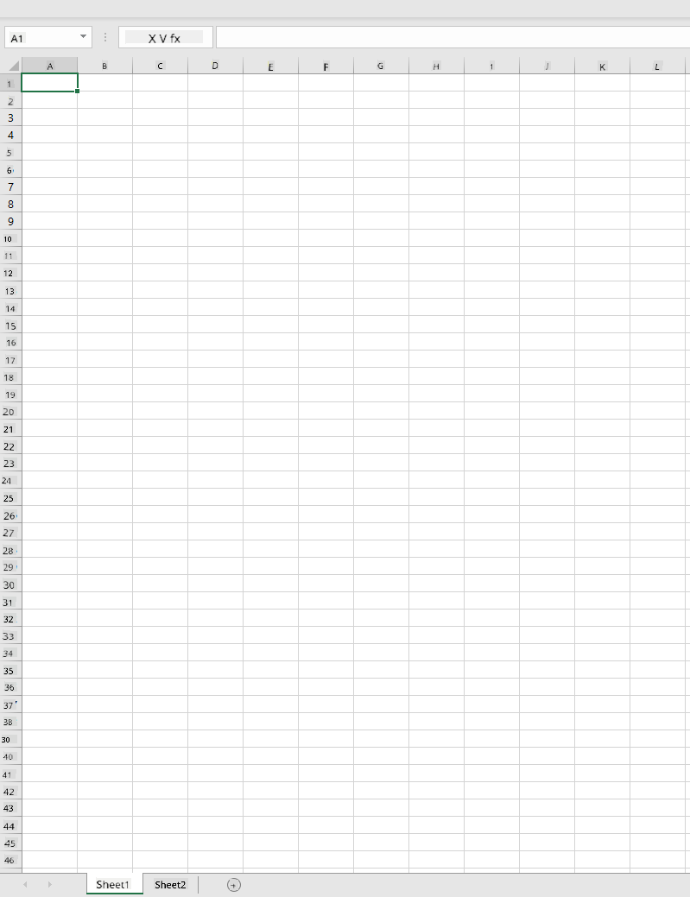
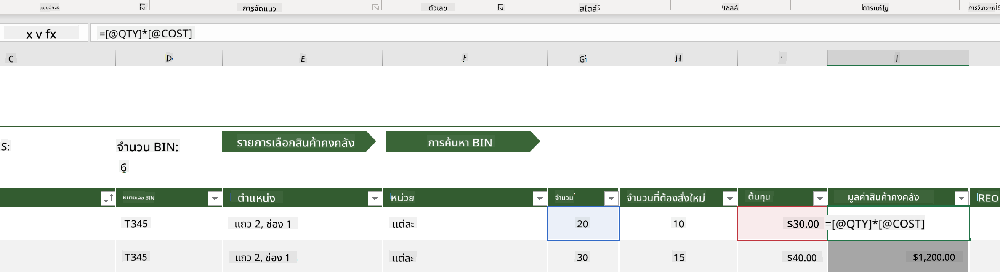
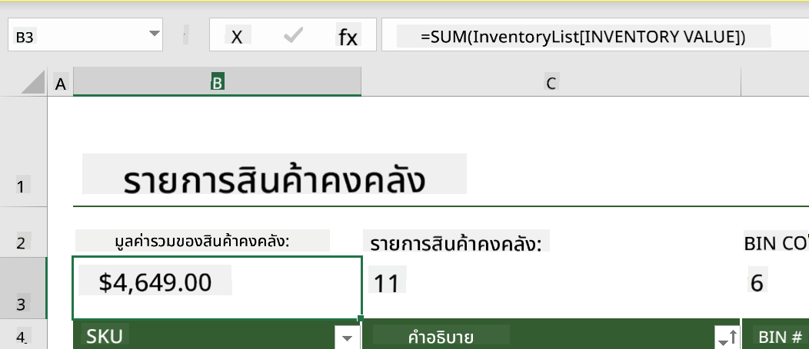
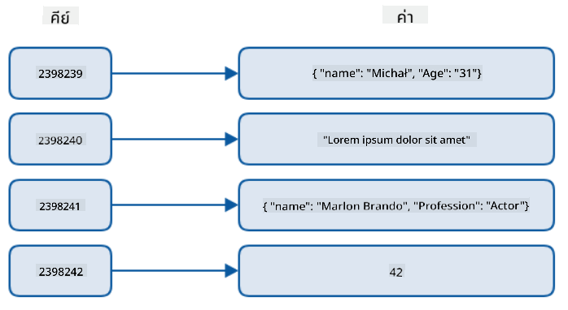
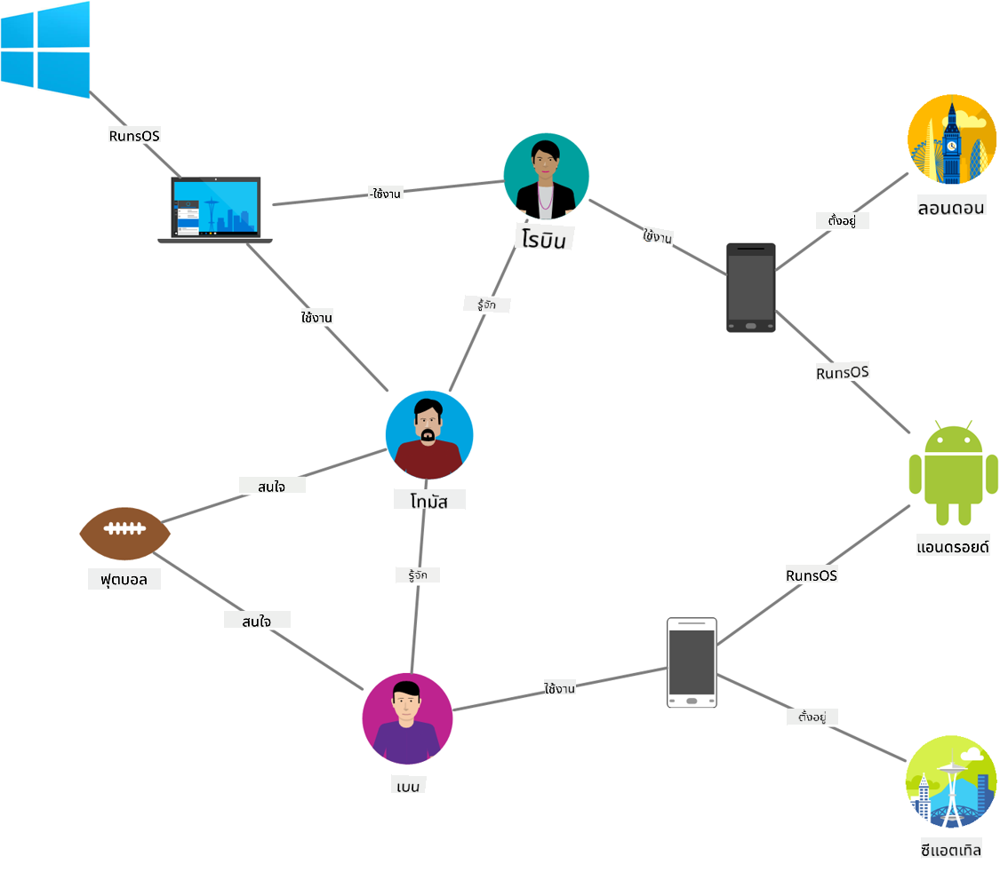
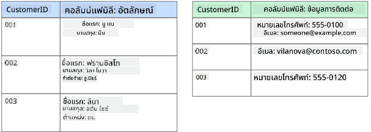
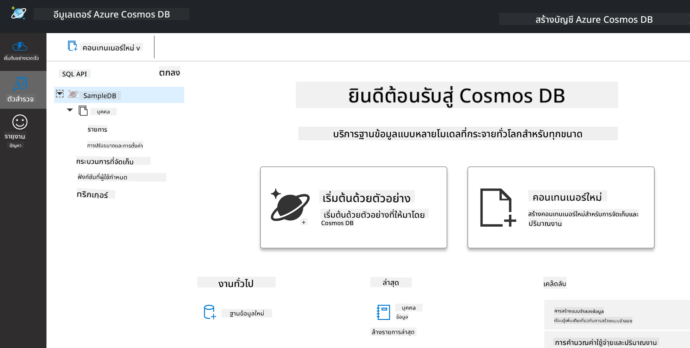
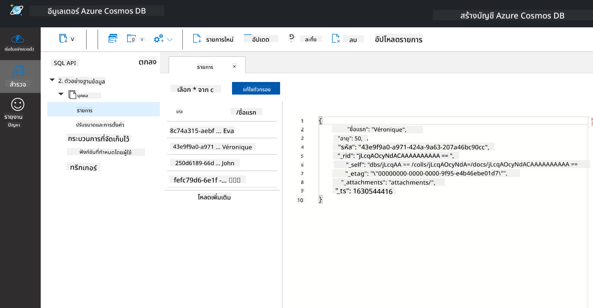
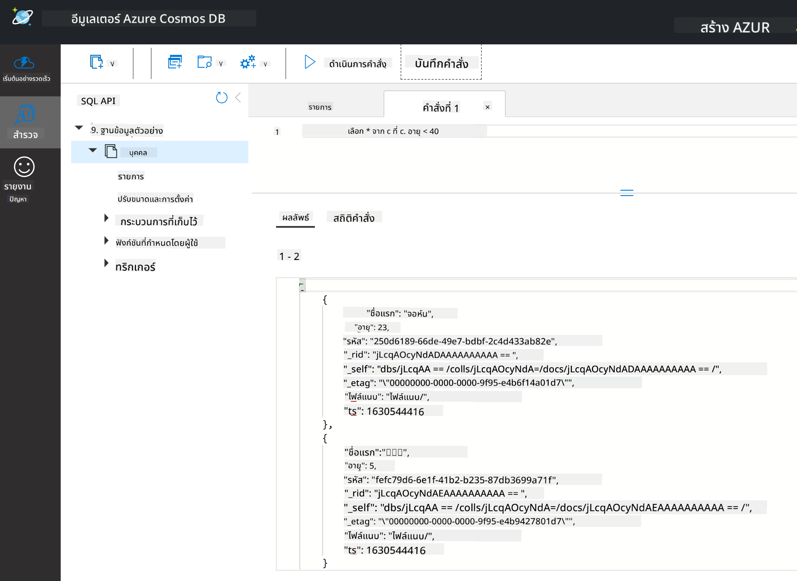

<!--
CO_OP_TRANSLATOR_METADATA:
{
  "original_hash": "32ddfef8121650f2ca2f3416fd283c37",
  "translation_date": "2025-08-26T21:08:49+00:00",
  "source_file": "2-Working-With-Data/06-non-relational/README.md",
  "language_code": "th"
}
-->
# การทำงานกับข้อมูล: ข้อมูลแบบไม่สัมพันธ์กัน

| ](../../sketchnotes/06-NoSQL.png)|
|:---:|
|การทำงานกับข้อมูล NoSQL - _สเก็ตโน้ตโดย [@nitya](https://twitter.com/nitya)_ |

## [แบบทดสอบก่อนเรียน](https://purple-hill-04aebfb03.1.azurestaticapps.net/quiz/10)

ข้อมูลไม่ได้จำกัดอยู่แค่ในฐานข้อมูลแบบสัมพันธ์กัน บทเรียนนี้จะเน้นไปที่ข้อมูลแบบไม่สัมพันธ์กันและครอบคลุมพื้นฐานของสเปรดชีตและ NoSQL

## สเปรดชีต

สเปรดชีตเป็นวิธีที่นิยมในการจัดเก็บและสำรวจข้อมูล เพราะใช้เวลาในการตั้งค่าและเริ่มต้นน้อยกว่า ในบทเรียนนี้คุณจะได้เรียนรู้ส่วนประกอบพื้นฐานของสเปรดชีต รวมถึงสูตรและฟังก์ชัน ตัวอย่างจะถูกแสดงด้วย Microsoft Excel แต่ส่วนใหญ่ของหัวข้อและขั้นตอนจะมีชื่อและวิธีการที่คล้ายกันในซอฟต์แวร์สเปรดชีตอื่น ๆ



สเปรดชีตเป็นไฟล์ที่สามารถเข้าถึงได้ในระบบไฟล์ของคอมพิวเตอร์ อุปกรณ์ หรือระบบไฟล์บนคลาวด์ ซอฟต์แวร์อาจเป็นแบบเบราว์เซอร์หรือแอปพลิเคชันที่ต้องติดตั้งบนคอมพิวเตอร์หรือดาวน์โหลดเป็นแอป ใน Excel ไฟล์เหล่านี้ถูกเรียกว่า **workbooks** และคำศัพท์นี้จะถูกใช้ตลอดบทเรียนนี้

Workbook ประกอบด้วยหนึ่งหรือมากกว่า **worksheets** โดยแต่ละ worksheet จะมีป้ายกำกับเป็นแท็บ ภายใน worksheet จะมีสี่เหลี่ยมที่เรียกว่า **cells** ซึ่งจะบรรจุข้อมูลจริง Cell คือจุดตัดของแถวและคอลัมน์ โดยคอลัมน์จะมีป้ายกำกับเป็นตัวอักษร และแถวจะมีป้ายกำกับเป็นตัวเลข สเปรดชีตบางตัวจะมีส่วนหัวในแถวแรก ๆ เพื่ออธิบายข้อมูลใน cell

ด้วยองค์ประกอบพื้นฐานเหล่านี้ของ workbook Excel เราจะใช้ตัวอย่างจาก [Microsoft Templates](https://templates.office.com/) ที่เน้นไปที่การจัดการสินค้าคงคลังเพื่อเดินผ่านส่วนเพิ่มเติมของสเปรดชีต

### การจัดการสินค้าคงคลัง

ไฟล์สเปรดชีตชื่อ "InventoryExample" เป็นสเปรดชีตที่จัดรูปแบบรายการในสินค้าคงคลังที่มีสาม worksheets โดยแท็บถูกป้ายกำกับว่า "Inventory List", "Inventory Pick List" และ "Bin Lookup" แถวที่ 4 ของ worksheet Inventory List เป็นส่วนหัวที่อธิบายค่าของแต่ละ cell ในคอลัมน์ส่วนหัว



มีกรณีที่ cell ขึ้นอยู่กับค่าของ cell อื่น ๆ เพื่อสร้างค่าของมันเอง สเปรดชีต Inventory List ติดตามต้นทุนของแต่ละรายการในสินค้าคงคลัง แต่ถ้าเราต้องการทราบมูลค่าของทุกอย่างในสินค้าคงคลังล่ะ? [**สูตร**](https://support.microsoft.com/en-us/office/overview-of-formulas-34519a4e-1e8d-4f4b-84d4-d642c4f63263) ใช้ในการดำเนินการกับข้อมูลใน cell และใช้ในการคำนวณต้นทุนของสินค้าคงคลังในตัวอย่างนี้ สเปรดชีตนี้ใช้สูตรในคอลัมน์ Inventory Value เพื่อคำนวณมูลค่าของแต่ละรายการโดยการคูณจำนวนภายใต้ส่วนหัว QTY และต้นทุนโดย cell ภายใต้ส่วนหัว COST การดับเบิลคลิกหรือไฮไลต์ cell จะทำให้เห็นสูตร คุณจะสังเกตเห็นว่าสูตรเริ่มต้นด้วยเครื่องหมายเท่ากับ ตามด้วยการคำนวณหรือการดำเนินการ



เราสามารถใช้สูตรอื่นเพื่อบวกค่าทั้งหมดใน Inventory Value เพื่อหามูลค่ารวมได้ สิ่งนี้สามารถคำนวณได้โดยการบวกแต่ละ cell เพื่อสร้างผลรวม แต่จะเป็นงานที่น่าเบื่อ Excel มี [**ฟังก์ชัน**](https://support.microsoft.com/en-us/office/sum-function-043e1c7d-7726-4e80-8f32-07b23e057f89) หรือสูตรที่กำหนดไว้ล่วงหน้าเพื่อดำเนินการคำนวณกับค่าของ cell ฟังก์ชันต้องการอาร์กิวเมนต์ ซึ่งเป็นค่าที่จำเป็นในการดำเนินการคำนวณ เมื่อฟังก์ชันต้องการมากกว่าหนึ่งอาร์กิวเมนต์ จะต้องระบุในลำดับที่เฉพาะเจาะจง มิฉะนั้นฟังก์ชันอาจไม่คำนวณค่าที่ถูกต้อง ตัวอย่างนี้ใช้ฟังก์ชัน SUM และใช้ค่าของ Inventory Value เป็นอาร์กิวเมนต์เพื่อบวกสร้างผลรวมที่ระบุไว้ภายใต้แถว 3 คอลัมน์ B (หรือเรียกว่า B3)

## NoSQL

NoSQL เป็นคำที่ครอบคลุมวิธีการต่าง ๆ ในการจัดเก็บข้อมูลแบบไม่สัมพันธ์กัน และสามารถตีความได้ว่า "ไม่ใช่ SQL", "ไม่สัมพันธ์กัน" หรือ "ไม่ใช่แค่ SQL" ระบบฐานข้อมูลประเภทนี้สามารถแบ่งออกเป็น 4 ประเภท


> แหล่งที่มา [บล็อกของ Michał Białecki](https://www.michalbialecki.com/2018/03/18/azure-cosmos-db-key-value-database-cloud/)

[ฐานข้อมูลแบบ key-value](https://docs.microsoft.com/en-us/azure/architecture/data-guide/big-data/non-relational-data#keyvalue-data-stores) จับคู่คีย์ที่ไม่ซ้ำกัน ซึ่งเป็นตัวระบุที่ไม่ซ้ำกันที่เชื่อมโยงกับค่า คู่เหล่านี้ถูกจัดเก็บโดยใช้ [ตารางแฮช](https://www.hackerearth.com/practice/data-structures/hash-tables/basics-of-hash-tables/tutorial/) พร้อมฟังก์ชันแฮชที่เหมาะสม


> แหล่งที่มา [Microsoft](https://docs.microsoft.com/en-us/azure/cosmos-db/graph/graph-introduction#graph-database-by-example)

[ฐานข้อมูลแบบกราฟ](https://docs.microsoft.com/en-us/azure/architecture/data-guide/big-data/non-relational-data#graph-data-stores) อธิบายความสัมพันธ์ในข้อมูลและแสดงเป็นคอลเลกชันของโหนดและขอบ โหนดแสดงถึงเอนทิตี สิ่งที่มีอยู่ในโลกจริง เช่น นักเรียนหรือใบแจ้งยอดธนาคาร ขอบแสดงถึงความสัมพันธ์ระหว่างสองเอนทิตี โดยแต่ละโหนดและขอบมีคุณสมบัติที่ให้ข้อมูลเพิ่มเติมเกี่ยวกับโหนดและขอบแต่ละตัว



[ฐานข้อมูลแบบ columnar](https://docs.microsoft.com/en-us/azure/architecture/data-guide/big-data/non-relational-data#columnar-data-stores) จัดระเบียบข้อมูลเป็นคอลัมน์และแถวเหมือนโครงสร้างข้อมูลแบบสัมพันธ์กัน แต่แต่ละคอลัมน์ถูกแบ่งออกเป็นกลุ่มที่เรียกว่ากลุ่มคอลัมน์ โดยข้อมูลทั้งหมดภายใต้คอลัมน์เดียวกันมีความเกี่ยวข้องและสามารถดึงและเปลี่ยนแปลงได้ในหน่วยเดียว

### ฐานข้อมูลแบบเอกสารกับ Azure Cosmos DB

[ฐานข้อมูลแบบเอกสาร](https://docs.microsoft.com/en-us/azure/architecture/data-guide/big-data/non-relational-data#document-data-stores) สร้างขึ้นบนแนวคิดของฐานข้อมูลแบบ key-value และประกอบด้วยชุดของฟิลด์และออบเจ็กต์ บทนี้จะสำรวจฐานข้อมูลแบบเอกสารด้วย Cosmos DB Emulator

ฐานข้อมูล Cosmos DB ตรงกับคำจำกัดความของ "ไม่ใช่แค่ SQL" โดยฐานข้อมูลแบบเอกสารของ Cosmos DB อาศัย SQL ในการสืบค้นข้อมูล [บทเรียนก่อนหน้า](../05-relational-databases/README.md) เกี่ยวกับ SQL ครอบคลุมพื้นฐานของภาษา และเราจะสามารถใช้คำสั่งบางส่วนกับฐานข้อมูลแบบเอกสารที่นี่ เราจะใช้ Cosmos DB Emulator ซึ่งช่วยให้เราสร้างและสำรวจฐานข้อมูลแบบเอกสารในเครื่องคอมพิวเตอร์ อ่านเพิ่มเติมเกี่ยวกับ Emulator [ที่นี่](https://docs.microsoft.com/en-us/azure/cosmos-db/local-emulator?tabs=ssl-netstd21)

เอกสารคือคอลเลกชันของฟิลด์และค่าของออบเจ็กต์ โดยฟิลด์อธิบายว่าออบเจ็กต์แสดงถึงอะไร ด้านล่างคือตัวอย่างของเอกสาร

```json
{
    "firstname": "Eva",
    "age": 44,
    "id": "8c74a315-aebf-4a16-bb38-2430a9896ce5",
    "_rid": "bHwDAPQz8s0BAAAAAAAAAA==",
    "_self": "dbs/bHwDAA==/colls/bHwDAPQz8s0=/docs/bHwDAPQz8s0BAAAAAAAAAA==/",
    "_etag": "\"00000000-0000-0000-9f95-010a691e01d7\"",
    "_attachments": "attachments/",
    "_ts": 1630544034
}
```

ฟิลด์ที่น่าสนใจในเอกสารนี้คือ: `firstname`, `id`, และ `age` ฟิลด์ที่เหลือที่มีขีดเส้นใต้ถูกสร้างขึ้นโดย Cosmos DB

#### การสำรวจข้อมูลด้วย Cosmos DB Emulator

คุณสามารถดาวน์โหลดและติดตั้ง Emulator [สำหรับ Windows ได้ที่นี่](https://aka.ms/cosmosdb-emulator) ดูเอกสารนี้ [ที่นี่](https://docs.microsoft.com/en-us/azure/cosmos-db/local-emulator?tabs=ssl-netstd21#run-on-linux-macos) สำหรับตัวเลือกในการใช้งาน Emulator บน macOS และ Linux

Emulator จะเปิดหน้าต่างเบราว์เซอร์ โดยมุมมอง Explorer ช่วยให้คุณสำรวจเอกสาร



หากคุณกำลังติดตาม ให้คลิก "Start with Sample" เพื่อสร้างฐานข้อมูลตัวอย่างชื่อ SampleDB หากคุณขยาย SampleDB โดยคลิกที่ลูกศร คุณจะพบคอนเทนเนอร์ชื่อ `Persons` คอนเทนเนอร์จะถือคอลเลกชันของรายการ ซึ่งเป็นเอกสารภายในคอนเทนเนอร์ คุณสามารถสำรวจเอกสารแต่ละฉบับภายใต้ `Items`



#### การสืบค้นข้อมูลเอกสารด้วย Cosmos DB Emulator

เรายังสามารถสืบค้นข้อมูลตัวอย่างได้โดยคลิกที่ปุ่ม New SQL Query (ปุ่มที่สองจากซ้าย)

`SELECT * FROM c` จะดึงเอกสารทั้งหมดในคอนเทนเนอร์ ลองเพิ่มคำสั่ง where และค้นหาทุกคนที่อายุน้อยกว่า 40

`SELECT * FROM c where c.age < 40`



คำสั่งนี้จะดึงเอกสารสองฉบับ สังเกตว่าค่า age ในแต่ละเอกสารน้อยกว่า 40

#### JSON และเอกสาร

หากคุณคุ้นเคยกับ JavaScript Object Notation (JSON) คุณจะสังเกตว่าเอกสารดูคล้ายกับ JSON มีไฟล์ `PersonsData.json` ในไดเรกทอรีนี้ที่มีข้อมูลเพิ่มเติมที่คุณสามารถอัปโหลดไปยังคอนเทนเนอร์ Persons ใน Emulator ผ่านปุ่ม `Upload Item`

ในหลายกรณี API ที่ส่งคืนข้อมูล JSON สามารถถ่ายโอนและจัดเก็บโดยตรงในฐานข้อมูลแบบเอกสาร ด้านล่างคือตัวอย่างเอกสารอีกฉบับ ซึ่งแสดงถึงทวีตจากบัญชี Twitter ของ Microsoft ที่ถูกดึงมาโดยใช้ Twitter API แล้วแทรกลงใน Cosmos DB

```json
{
    "created_at": "2021-08-31T19:03:01.000Z",
    "id": "1432780985872142341",
    "text": "Blank slate. Like this tweet if you’ve ever painted in Microsoft Paint before. https://t.co/cFeEs8eOPK",
    "_rid": "dhAmAIUsA4oHAAAAAAAAAA==",
    "_self": "dbs/dhAmAA==/colls/dhAmAIUsA4o=/docs/dhAmAIUsA4oHAAAAAAAAAA==/",
    "_etag": "\"00000000-0000-0000-9f84-a0958ad901d7\"",
    "_attachments": "attachments/",
    "_ts": 1630537000
```

ฟิลด์ที่น่าสนใจในเอกสารนี้คือ: `created_at`, `id`, และ `text`

## 🚀 ความท้าทาย

มีไฟล์ `TwitterData.json` ที่คุณสามารถอัปโหลดไปยังฐานข้อมูล SampleDB ขอแนะนำให้คุณเพิ่มไฟล์นี้ในคอนเทนเนอร์แยกต่างหาก วิธีการทำได้ดังนี้:

1. คลิกปุ่ม New Container ที่มุมขวาบน
1. เลือกฐานข้อมูลที่มีอยู่ (SampleDB) สร้าง container id สำหรับคอนเทนเนอร์
1. ตั้งค่า partition key เป็น `/id`
1. คลิก OK (คุณสามารถละเว้นข้อมูลอื่น ๆ ในมุมมองนี้ได้ เนื่องจากเป็นชุดข้อมูลขนาดเล็กที่รันในเครื่องของคุณ)
1. เปิดคอนเทนเนอร์ใหม่ของคุณและอัปโหลดไฟล์ Twitter Data ด้วยปุ่ม `Upload Item`

ลองรันคำสั่ง select เพื่อค้นหาเอกสารที่มีคำว่า Microsoft ในฟิลด์ text คำใบ้: ลองใช้ [คำสั่ง LIKE](https://docs.microsoft.com/en-us/azure/cosmos-db/sql/sql-query-keywords#using-like-with-the--wildcard-character)

## [แบบทดสอบหลังเรียน](https://purple-hill-04aebfb03.1.azurestaticapps.net/quiz/11)

## ทบทวนและศึกษาด้วยตนเอง

- มีการเพิ่มการจัดรูปแบบและฟีเจอร์เพิ่มเติมในสเปรดชีตนี้ที่บทเรียนไม่ได้ครอบคลุม Microsoft มี [คลังเอกสารและวิดีโอขนาดใหญ่](https://support.microsoft.com/excel) เกี่ยวกับ Excel หากคุณสนใจเรียนรู้เพิ่มเติม

- เอกสารสถาปัตยกรรมนี้อธิบายลักษณะของประเภทข้อมูลแบบไม่สัมพันธ์กัน: [ข้อมูลแบบไม่สัมพันธ์กันและ NoSQL](https://docs.microsoft.com/en-us/azure/architecture/data-guide/big-data/non-relational-data)

- Cosmos DB เป็นฐานข้อมูลแบบไม่สัมพันธ์กันบนคลาวด์ที่สามารถจัดเก็บประเภท NoSQL ต่าง ๆ ที่กล่าวถึงในบทเรียนนี้ เรียนรู้เพิ่มเติมเกี่ยวกับประเภทเหล่านี้ใน [Cosmos DB Microsoft Learn Module](https://docs.microsoft.com/en-us/learn/paths/work-with-nosql-data-in-azure-cosmos-db/)

## งานที่ได้รับมอบหมาย

[Soda Profits](assignment.md)

---

**ข้อจำกัดความรับผิดชอบ**:  
เอกสารนี้ได้รับการแปลโดยใช้บริการแปลภาษา AI [Co-op Translator](https://github.com/Azure/co-op-translator) แม้ว่าเราจะพยายามอย่างเต็มที่เพื่อความถูกต้อง แต่โปรดทราบว่าการแปลอัตโนมัติอาจมีข้อผิดพลาดหรือความไม่แม่นยำ เอกสารต้นฉบับในภาษาต้นทางควรถือเป็นแหล่งข้อมูลที่เชื่อถือได้ สำหรับข้อมูลที่สำคัญ แนะนำให้ใช้บริการแปลภาษามนุษย์ที่เป็นมืออาชีพ เราไม่รับผิดชอบต่อความเข้าใจผิดหรือการตีความที่ผิดพลาดซึ่งเกิดจากการใช้การแปลนี้