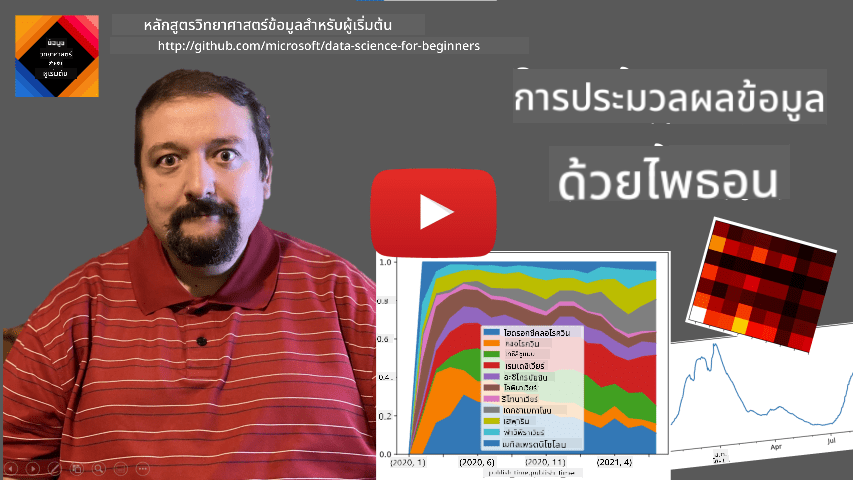
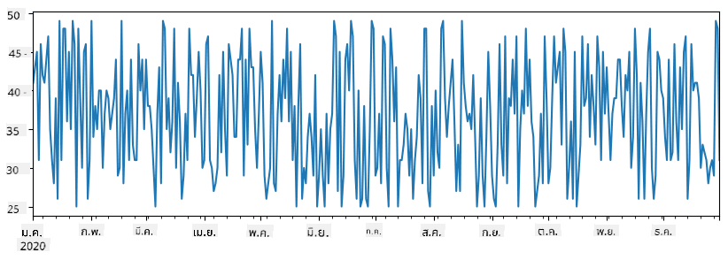
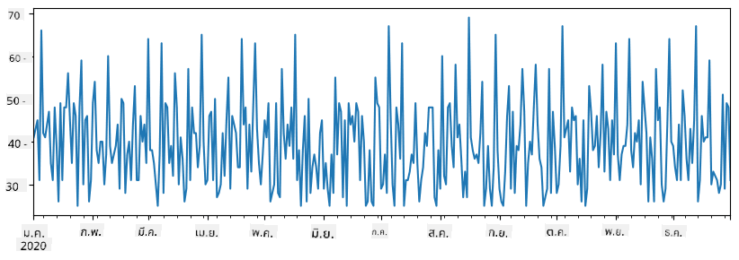
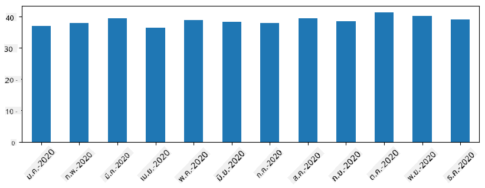
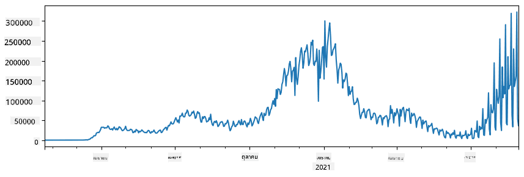
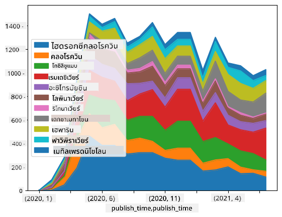

<!--
CO_OP_TRANSLATOR_METADATA:
{
  "original_hash": "57f7db1f4c3ae3361c1d1fbafcdd690c",
  "translation_date": "2025-09-04T18:44:33+00:00",
  "source_file": "2-Working-With-Data/07-python/README.md",
  "language_code": "th"
}
-->
# การทำงานกับข้อมูล: Python และ Pandas Library

|  ](../../sketchnotes/07-WorkWithPython.png) |
| :-------------------------------------------------------------------------------------------------------: |
|                 การทำงานกับ Python - _Sketchnote โดย [@nitya](https://twitter.com/nitya)_                 |

[](https://youtu.be/dZjWOGbsN4Y)

แม้ว่าฐานข้อมูลจะมีวิธีที่มีประสิทธิภาพในการจัดเก็บข้อมูลและเรียกใช้ข้อมูลด้วยภาษา SQL แต่การเขียนโปรแกรมเพื่อจัดการข้อมูลด้วยตัวเองถือเป็นวิธีที่ยืดหยุ่นที่สุด ในหลายกรณี การใช้ SQL อาจมีประสิทธิภาพมากกว่า แต่ในบางกรณีที่ต้องการการประมวลผลข้อมูลที่ซับซ้อนมากขึ้น SQL อาจไม่สามารถทำได้ง่ายๆ การประมวลผลข้อมูลสามารถเขียนโปรแกรมได้ในทุกภาษา แต่มีบางภาษาที่เหมาะสมกับการทำงานกับข้อมูลมากกว่า นักวิทยาศาสตร์ข้อมูลมักนิยมใช้ภาษาต่อไปนี้:

* **[Python](https://www.python.org/)** เป็นภาษาการเขียนโปรแกรมทั่วไปที่มักถูกมองว่าเป็นตัวเลือกที่ดีที่สุดสำหรับผู้เริ่มต้นเนื่องจากความเรียบง่าย Python มีไลบรารีเพิ่มเติมมากมายที่ช่วยแก้ปัญหาต่างๆ เช่น การดึงข้อมูลจาก ZIP archive หรือการแปลงภาพเป็นสีเทา นอกจากการวิเคราะห์ข้อมูลแล้ว Python ยังถูกใช้ในงานพัฒนาเว็บอีกด้วย
* **[R](https://www.r-project.org/)** เป็นเครื่องมือดั้งเดิมที่พัฒนาขึ้นเพื่อการประมวลผลข้อมูลเชิงสถิติ R มีคลังไลบรารีขนาดใหญ่ (CRAN) ทำให้เป็นตัวเลือกที่ดีสำหรับการประมวลผลข้อมูล อย่างไรก็ตาม R ไม่ใช่ภาษาการเขียนโปรแกรมทั่วไป และไม่ค่อยถูกใช้ในงานนอกเหนือจากการวิเคราะห์ข้อมูล
* **[Julia](https://julialang.org/)** เป็นอีกหนึ่งภาษาที่พัฒนาขึ้นเพื่อการวิเคราะห์ข้อมูลโดยเฉพาะ โดยมีเป้าหมายเพื่อให้ประสิทธิภาพดีกว่า Python ทำให้เป็นเครื่องมือที่ยอดเยี่ยมสำหรับการทดลองทางวิทยาศาสตร์

ในบทเรียนนี้ เราจะมุ่งเน้นการใช้ Python ในการประมวลผลข้อมูลแบบง่ายๆ โดยสมมติว่าคุณมีความคุ้นเคยพื้นฐานกับภาษา Python หากคุณต้องการเรียนรู้ Python อย่างลึกซึ้ง คุณสามารถดูแหล่งข้อมูลต่อไปนี้:

* [เรียนรู้ Python อย่างสนุกสนานด้วย Turtle Graphics และ Fractals](https://github.com/shwars/pycourse) - คอร์สแนะนำ Python บน GitHub
* [เริ่มต้นเรียนรู้ Python](https://docs.microsoft.com/en-us/learn/paths/python-first-steps/?WT.mc_id=academic-77958-bethanycheum) เส้นทางการเรียนรู้บน [Microsoft Learn](http://learn.microsoft.com/?WT.mc_id=academic-77958-bethanycheum)

ข้อมูลสามารถมาในหลายรูปแบบ ในบทเรียนนี้ เราจะพิจารณาข้อมูลในสามรูปแบบ - **ข้อมูลแบบตาราง**, **ข้อความ** และ **ภาพ**

เราจะมุ่งเน้นตัวอย่างการประมวลผลข้อมูลบางส่วนแทนที่จะให้ภาพรวมทั้งหมดของไลบรารีที่เกี่ยวข้อง วิธีนี้จะช่วยให้คุณเข้าใจแนวคิดหลักของสิ่งที่เป็นไปได้ และรู้ว่าจะหาวิธีแก้ปัญหาได้จากที่ไหนเมื่อคุณต้องการ

> **คำแนะนำที่มีประโยชน์ที่สุด** เมื่อคุณต้องการดำเนินการบางอย่างกับข้อมูลที่คุณไม่รู้วิธีทำ ลองค้นหาวิธีในอินเทอร์เน็ต [Stackoverflow](https://stackoverflow.com/) มักมีตัวอย่างโค้ด Python ที่มีประโยชน์สำหรับงานทั่วไปมากมาย

## [แบบทดสอบก่อนเรียน](https://purple-hill-04aebfb03.1.azurestaticapps.net/quiz/12)

## ข้อมูลแบบตารางและ Dataframes

คุณเคยพบข้อมูลแบบตารางเมื่อเราพูดถึงฐานข้อมูลเชิงสัมพันธ์ เมื่อคุณมีข้อมูลจำนวนมากและข้อมูลนั้นถูกจัดเก็บในตารางที่เชื่อมโยงกันหลายตาราง การใช้ SQL ในการทำงานกับข้อมูลนั้นถือว่ามีเหตุผล อย่างไรก็ตาม มีหลายกรณีที่เรามีตารางข้อมูลและต้องการเข้าใจหรือวิเคราะห์ข้อมูล เช่น การกระจายตัว ความสัมพันธ์ระหว่างค่า ฯลฯ ในการวิเคราะห์ข้อมูล มีหลายกรณีที่เราต้องทำการแปลงข้อมูลต้นฉบับและตามด้วยการสร้างภาพ ทั้งสองขั้นตอนนี้สามารถทำได้ง่ายๆ ด้วย Python

มีไลบรารีที่มีประโยชน์ที่สุดสองตัวใน Python ที่ช่วยคุณจัดการกับข้อมูลแบบตาราง:
* **[Pandas](https://pandas.pydata.org/)** ช่วยให้คุณจัดการกับ **Dataframes** ซึ่งคล้ายกับตารางเชิงสัมพันธ์ คุณสามารถมีคอลัมน์ที่มีชื่อ และดำเนินการต่างๆ กับแถว คอลัมน์ และ Dataframes โดยรวม
* **[Numpy](https://numpy.org/)** เป็นไลบรารีสำหรับการทำงานกับ **tensors** หรือ **arrays** หลายมิติ Array มีค่าที่มีประเภทเดียวกัน และง่ายกว่า Dataframe แต่มีการดำเนินการทางคณิตศาสตร์มากกว่า และสร้าง overhead น้อยกว่า

นอกจากนี้ยังมีไลบรารีอื่นๆ ที่คุณควรรู้จัก:
* **[Matplotlib](https://matplotlib.org/)** เป็นไลบรารีที่ใช้สำหรับการสร้างภาพข้อมูลและการวาดกราฟ
* **[SciPy](https://www.scipy.org/)** เป็นไลบรารีที่มีฟังก์ชันทางวิทยาศาสตร์เพิ่มเติม เราเคยพูดถึงไลบรารีนี้เมื่อพูดถึงความน่าจะเป็นและสถิติ

นี่คือตัวอย่างโค้ดที่คุณมักใช้ในการนำเข้าไลบรารีเหล่านี้ในตอนต้นของโปรแกรม Python:
```python
import numpy as np
import pandas as pd
import matplotlib.pyplot as plt
from scipy import ... # you need to specify exact sub-packages that you need
``` 

Pandas มีแนวคิดพื้นฐานอยู่ไม่กี่อย่าง

### Series 

**Series** คือชุดของค่าที่คล้ายกับ list หรือ numpy array ความแตกต่างหลักคือ series มี **index** และเมื่อเราดำเนินการกับ series (เช่น การบวก) index จะถูกนำมาพิจารณาด้วย Index สามารถเป็นตัวเลขแถวแบบง่ายๆ (เป็น index ที่ใช้โดยค่าเริ่มต้นเมื่อสร้าง series จาก list หรือ array) หรืออาจมีโครงสร้างที่ซับซ้อน เช่น ช่วงเวลา

> **หมายเหตุ**: มีโค้ด Pandas เบื้องต้นใน notebook ที่แนบมาชื่อ [`notebook.ipynb`](notebook.ipynb) เราเพียงแค่สรุปตัวอย่างบางส่วนที่นี่ และคุณสามารถดู notebook ฉบับเต็มได้

ลองพิจารณาตัวอย่าง: เราต้องการวิเคราะห์ยอดขายของร้านไอศกรีมของเรา ลองสร้าง series ของตัวเลขยอดขาย (จำนวนสินค้าที่ขายได้ในแต่ละวัน) สำหรับช่วงเวลาหนึ่ง:

```python
start_date = "Jan 1, 2020"
end_date = "Mar 31, 2020"
idx = pd.date_range(start_date,end_date)
print(f"Length of index is {len(idx)}")
items_sold = pd.Series(np.random.randint(25,50,size=len(idx)),index=idx)
items_sold.plot()
```


สมมติว่าในแต่ละสัปดาห์เราจัดปาร์ตี้สำหรับเพื่อนๆ และเรานำไอศกรีมเพิ่มอีก 10 แพ็คสำหรับปาร์ตี้ เราสามารถสร้าง series อีกตัวที่มี index เป็นสัปดาห์เพื่อแสดงสิ่งนี้:
```python
additional_items = pd.Series(10,index=pd.date_range(start_date,end_date,freq="W"))
```
เมื่อเราบวก series สองตัวเข้าด้วยกัน เราจะได้ยอดรวม:
```python
total_items = items_sold.add(additional_items,fill_value=0)
total_items.plot()
```


> **หมายเหตุ** เราไม่ได้ใช้ไวยากรณ์ง่ายๆ `total_items+additional_items` หากเราใช้ เราจะได้รับค่ามากมายที่เป็น `NaN` (*Not a Number*) ใน series ที่ได้ นี่เป็นเพราะมีค่าที่หายไปสำหรับบาง index ใน series `additional_items` และการบวก `NaN` กับอะไรก็ตามจะได้ผลลัพธ์เป็น `NaN` ดังนั้นเราจำเป็นต้องระบุพารามิเตอร์ `fill_value` ระหว่างการบวก

สำหรับ time series เราสามารถ **resample** series ด้วยช่วงเวลาที่แตกต่างกันได้ ตัวอย่างเช่น สมมติว่าเราต้องการคำนวณยอดขายเฉลี่ยรายเดือน เราสามารถใช้โค้ดต่อไปนี้:
```python
monthly = total_items.resample("1M").mean()
ax = monthly.plot(kind='bar')
```


### DataFrame

DataFrame คือชุดของ series ที่มี index เดียวกัน เราสามารถรวม series หลายตัวเข้าด้วยกันเป็น DataFrame:
```python
a = pd.Series(range(1,10))
b = pd.Series(["I","like","to","play","games","and","will","not","change"],index=range(0,9))
df = pd.DataFrame([a,b])
```
สิ่งนี้จะสร้างตารางแนวนอนดังนี้:
|     | 0   | 1    | 2   | 3   | 4      | 5   | 6      | 7    | 8    |
| --- | --- | ---- | --- | --- | ------ | --- | ------ | ---- | ---- |
| 0   | 1   | 2    | 3   | 4   | 5      | 6   | 7      | 8    | 9    |
| 1   | I   | like | to  | use | Python | and | Pandas | very | much |

เรายังสามารถใช้ Series เป็นคอลัมน์ และระบุชื่อคอลัมน์โดยใช้ dictionary:
```python
df = pd.DataFrame({ 'A' : a, 'B' : b })
```
สิ่งนี้จะให้ตารางดังนี้:

|     | A   | B      |
| --- | --- | ------ |
| 0   | 1   | I      |
| 1   | 2   | like   |
| 2   | 3   | to     |
| 3   | 4   | use    |
| 4   | 5   | Python |
| 5   | 6   | and    |
| 6   | 7   | Pandas |
| 7   | 8   | very   |
| 8   | 9   | much   |

**หมายเหตุ** เราสามารถได้รูปแบบตารางนี้โดยการ transpose ตารางก่อนหน้า เช่น โดยการเขียน 
```python
df = pd.DataFrame([a,b]).T..rename(columns={ 0 : 'A', 1 : 'B' })
```
ที่นี่ `.T` หมายถึงการดำเนินการ transpose DataFrame คือการเปลี่ยนแถวและคอลัมน์ และการดำเนินการ `rename` ช่วยให้เราสามารถเปลี่ยนชื่อคอลัมน์ให้ตรงกับตัวอย่างก่อนหน้า

นี่คือการดำเนินการที่สำคัญที่สุดบางส่วนที่เราสามารถทำได้กับ DataFrames:

**การเลือกคอลัมน์** เราสามารถเลือกคอลัมน์แต่ละคอลัมน์โดยเขียน `df['A']` - การดำเนินการนี้จะคืนค่า Series เราสามารถเลือกชุดย่อยของคอลัมน์เป็นอีก DataFrame โดยเขียน `df[['B','A']]` - สิ่งนี้จะคืนค่า DataFrame อีกตัวหนึ่ง

**การกรอง** เฉพาะแถวที่ตรงตามเกณฑ์ ตัวอย่างเช่น เพื่อให้เหลือเฉพาะแถวที่มีคอลัมน์ `A` มากกว่า 5 เราสามารถเขียน `df[df['A']>5]`

> **หมายเหตุ** วิธีการกรองทำงานดังนี้: นิพจน์ `df['A']<5` คืนค่า boolean series ซึ่งระบุว่านิพจน์เป็น `True` หรือ `False` สำหรับแต่ละองค์ประกอบของ series ดั้งเดิม `df['A']` เมื่อ boolean series ถูกใช้เป็น index มันจะคืนค่าชุดย่อยของแถวใน DataFrame ดังนั้นจึงไม่สามารถใช้นิพจน์ boolean Python ทั่วไปได้ ตัวอย่างเช่น การเขียน `df[df['A']>5 and df['A']<7]` จะผิด แทนที่จะใช้การดำเนินการพิเศษ `&` บน boolean series โดยเขียน `df[(df['A']>5) & (df['A']<7)]` (*วงเล็บมีความสำคัญที่นี่*)

**การสร้างคอลัมน์ใหม่ที่คำนวณได้** เราสามารถสร้างคอลัมน์ใหม่ที่คำนวณได้สำหรับ DataFrame ของเราได้อย่างง่ายดายโดยใช้นิพจน์ที่เข้าใจง่าย เช่นนี้:
```python
df['DivA'] = df['A']-df['A'].mean() 
``` 
ตัวอย่างนี้คำนวณ divergence ของ A จากค่าเฉลี่ยของมัน สิ่งที่เกิดขึ้นจริงคือเรากำลังคำนวณ series และจากนั้นกำหนด series นี้ให้กับด้านซ้ายมือ สร้างคอลัมน์ใหม่ ดังนั้น เราไม่สามารถใช้การดำเนินการใดๆ ที่ไม่เข้ากันกับ series ตัวอย่างเช่น โค้ดด้านล่างนี้ผิด:
```python
# Wrong code -> df['ADescr'] = "Low" if df['A'] < 5 else "Hi"
df['LenB'] = len(df['B']) # <- Wrong result
``` 
ตัวอย่างหลัง แม้ว่าจะถูกต้องตามไวยากรณ์ แต่ให้ผลลัพธ์ที่ผิด เพราะมันกำหนดความยาวของ series `B` ให้กับค่าทั้งหมดในคอลัมน์ และไม่ใช่ความยาวขององค์ประกอบแต่ละตัวตามที่เราตั้งใจไว้

หากเราต้องการคำนวณนิพจน์ที่ซับซ้อนเช่นนี้ เราสามารถใช้ฟังก์ชัน `apply` ตัวอย่างสุดท้ายสามารถเขียนได้ดังนี้:
```python
df['LenB'] = df['B'].apply(lambda x : len(x))
# or 
df['LenB'] = df['B'].apply(len)
```

หลังจากการดำเนินการข้างต้น เราจะได้ DataFrame ดังนี้:

|     | A   | B      | DivA | LenB |
| --- | --- | ------ | ---- | ---- |
| 0   | 1   | I      | -4.0 | 1    |
| 1   | 2   | like   | -3.0 | 4    |
| 2   | 3   | to     | -2.0 | 2    |
| 3   | 4   | use    | -1.0 | 3    |
| 4   | 5   | Python | 0.0  | 6    |
| 5   | 6   | and    | 1.0  | 3    |
| 6   | 7   | Pandas | 2.0  | 6    |
| 7   | 8   | very   | 3.0  | 4    |
| 8   | 9   | much   | 4.0  | 4    |

**การเลือกแถวตามตัวเลข** สามารถทำได้โดยใช้โครงสร้าง `iloc` ตัวอย่างเช่น เพื่อเลือกแถวแรก 5 แถวจาก DataFrame:
```python
df.iloc[:5]
```

**การจัดกลุ่ม** มักถูกใช้เพื่อให้ได้ผลลัพธ์ที่คล้ายกับ *pivot tables* ใน Excel สมมติว่าเราต้องการคำนวณค่าเฉลี่ยของคอลัมน์ `A` สำหรับแต่ละจำนวน `LenB` เราสามารถจัดกลุ่ม DataFrame ของเราด้วย `LenB` และเรียกใช้ `mean`:
```python
df.groupby(by='LenB').mean()
```
หากเราต้องการคำนวณค่าเฉลี่ยและจำนวนองค์ประกอบในกลุ่ม เราสามารถใช้ฟังก์ชัน `aggregate` ที่ซับซ้อนกว่า:
```python
df.groupby(by='LenB') \
 .aggregate({ 'DivA' : len, 'A' : lambda x: x.mean() }) \
 .rename(columns={ 'DivA' : 'Count', 'A' : 'Mean'})
```
สิ่งนี้จะให้ตารางดังนี้:

| LenB | Count | Mean     |
| ---- | ----- | -------- |
| 1    | 1     | 1.000000 |
| 2    | 1     | 3.000000 |
| 3    | 2     | 5.000000 |
| 4    | 3     | 6.333333 |
| 6    | 2     | 6.000000 |

### การดึงข้อมูล
เราได้เห็นแล้วว่าการสร้าง Series และ DataFrames จากวัตถุใน Python นั้นง่ายมาก อย่างไรก็ตาม ข้อมูลมักจะมาในรูปแบบไฟล์ข้อความ หรือ ตาราง Excel โชคดีที่ Pandas มีวิธีง่ายๆ ในการโหลดข้อมูลจากดิสก์ ตัวอย่างเช่น การอ่านไฟล์ CSV สามารถทำได้ง่ายๆ ดังนี้:
```python
df = pd.read_csv('file.csv')
```
เราจะเห็นตัวอย่างเพิ่มเติมเกี่ยวกับการโหลดข้อมูล รวมถึงการดึงข้อมูลจากเว็บไซต์ภายนอกในส่วน "Challenge"

### การพิมพ์และการสร้างกราฟ

นักวิทยาศาสตร์ข้อมูลมักต้องสำรวจข้อมูล ดังนั้นการสามารถมองเห็นข้อมูลจึงเป็นสิ่งสำคัญ เมื่อ DataFrame มีขนาดใหญ่ หลายครั้งเราต้องการเพียงตรวจสอบว่าเราทำทุกอย่างถูกต้องโดยการพิมพ์แถวแรกๆ ออกมา ซึ่งสามารถทำได้โดยการเรียกใช้ `df.head()` หากคุณใช้งานจาก Jupyter Notebook มันจะพิมพ์ DataFrame ออกมาในรูปแบบตารางที่ดูดี

เรายังได้เห็นการใช้งานฟังก์ชัน `plot` เพื่อสร้างกราฟสำหรับบางคอลัมน์ แม้ว่า `plot` จะมีประโยชน์สำหรับหลายงาน และรองรับกราฟประเภทต่างๆ ผ่านพารามิเตอร์ `kind=` คุณยังสามารถใช้ไลบรารี `matplotlib` เพื่อสร้างกราฟที่ซับซ้อนมากขึ้น เราจะครอบคลุมการสร้างภาพข้อมูลในรายละเอียดในบทเรียนของหลักสูตรแยกต่างหาก

ภาพรวมนี้ครอบคลุมแนวคิดที่สำคัญที่สุดของ Pandas อย่างไรก็ตาม ไลบรารีนี้มีความหลากหลายมาก และไม่มีข้อจำกัดในสิ่งที่คุณสามารถทำได้! ตอนนี้เรามาใช้ความรู้นี้ในการแก้ปัญหาเฉพาะกัน

## 🚀 Challenge 1: การวิเคราะห์การแพร่กระจายของ COVID

ปัญหาแรกที่เราจะมุ่งเน้นคือการสร้างแบบจำลองการแพร่ระบาดของ COVID-19 เพื่อทำสิ่งนี้ เราจะใช้ข้อมูลเกี่ยวกับจำนวนผู้ติดเชื้อในประเทศต่างๆ ซึ่งจัดทำโดย [Center for Systems Science and Engineering](https://systems.jhu.edu/) (CSSE) ที่ [Johns Hopkins University](https://jhu.edu/) ชุดข้อมูลนี้สามารถเข้าถึงได้ใน [GitHub Repository นี้](https://github.com/CSSEGISandData/COVID-19)

เนื่องจากเราต้องการแสดงวิธีการจัดการกับข้อมูล เราขอเชิญคุณเปิด [`notebook-covidspread.ipynb`](notebook-covidspread.ipynb) และอ่านตั้งแต่ต้นจนจบ คุณยังสามารถรันเซลล์ และทำความท้าทายที่เราได้ทิ้งไว้ให้คุณในตอนท้าย



> หากคุณไม่ทราบวิธีการรันโค้ดใน Jupyter Notebook ลองดู [บทความนี้](https://soshnikov.com/education/how-to-execute-notebooks-from-github/)

## การทำงานกับข้อมูลที่ไม่มีโครงสร้าง

แม้ว่าข้อมูลมักจะมาในรูปแบบตาราง ในบางกรณีเราจำเป็นต้องจัดการกับข้อมูลที่มีโครงสร้างน้อยกว่า เช่น ข้อความหรือภาพ ในกรณีนี้ เพื่อใช้เทคนิคการประมวลผลข้อมูลที่เราได้เห็นข้างต้น เราจำเป็นต้อง **ดึง** ข้อมูลที่มีโครงสร้างออกมา ตัวอย่างเช่น:

* การดึงคำสำคัญจากข้อความ และดูว่าคำสำคัญเหล่านั้นปรากฏบ่อยแค่ไหน
* การใช้เครือข่ายประสาทเทียมเพื่อดึงข้อมูลเกี่ยวกับวัตถุในภาพ
* การรับข้อมูลเกี่ยวกับอารมณ์ของผู้คนจากฟีดกล้องวิดีโอ

## 🚀 Challenge 2: การวิเคราะห์เอกสาร COVID

ในความท้าทายนี้ เราจะดำเนินการต่อในหัวข้อการระบาดของ COVID และมุ่งเน้นไปที่การประมวลผลเอกสารทางวิทยาศาสตร์เกี่ยวกับเรื่องนี้ มี [CORD-19 Dataset](https://www.kaggle.com/allen-institute-for-ai/CORD-19-research-challenge) ที่มีเอกสารมากกว่า 7000 ฉบับ (ในขณะที่เขียน) เกี่ยวกับ COVID ซึ่งมีข้อมูลเมตาและบทคัดย่อ (และสำหรับประมาณครึ่งหนึ่งของเอกสารมีข้อความเต็มให้ด้วย)

ตัวอย่างเต็มของการวิเคราะห์ชุดข้อมูลนี้โดยใช้ [Text Analytics for Health](https://docs.microsoft.com/azure/cognitive-services/text-analytics/how-tos/text-analytics-for-health/?WT.mc_id=academic-77958-bethanycheum) บริการวิเคราะห์ข้อความเชิงสุขภาพ ได้อธิบายไว้ใน [บล็อกโพสต์นี้](https://soshnikov.com/science/analyzing-medical-papers-with-azure-and-text-analytics-for-health/) เราจะพูดถึงเวอร์ชันที่ง่ายขึ้นของการวิเคราะห์นี้

> **NOTE**: เราไม่ได้ให้สำเนาของชุดข้อมูลเป็นส่วนหนึ่งของ repository นี้ คุณอาจต้องดาวน์โหลดไฟล์ [`metadata.csv`](https://www.kaggle.com/allen-institute-for-ai/CORD-19-research-challenge?select=metadata.csv) จาก [ชุดข้อมูลนี้บน Kaggle](https://www.kaggle.com/allen-institute-for-ai/CORD-19-research-challenge) การลงทะเบียนกับ Kaggle อาจจำเป็น คุณยังสามารถดาวน์โหลดชุดข้อมูลโดยไม่ต้องลงทะเบียน [จากที่นี่](https://ai2-semanticscholar-cord-19.s3-us-west-2.amazonaws.com/historical_releases.html) แต่จะรวมข้อความเต็มทั้งหมดนอกเหนือจากไฟล์ข้อมูลเมตา

เปิด [`notebook-papers.ipynb`](notebook-papers.ipynb) และอ่านตั้งแต่ต้นจนจบ คุณยังสามารถรันเซลล์ และทำความท้าทายที่เราได้ทิ้งไว้ให้คุณในตอนท้าย



## การประมวลผลข้อมูลภาพ

เมื่อเร็วๆ นี้ โมเดล AI ที่ทรงพลังมากได้ถูกพัฒนาขึ้น ซึ่งช่วยให้เราเข้าใจภาพ มีหลายงานที่สามารถแก้ไขได้โดยใช้เครือข่ายประสาทเทียมที่ผ่านการฝึกอบรมล่วงหน้า หรือบริการคลาวด์ ตัวอย่างบางส่วนได้แก่:

* **การจำแนกภาพ** ซึ่งสามารถช่วยคุณจัดหมวดหมู่ภาพเป็นหนึ่งในคลาสที่กำหนดไว้ล่วงหน้า คุณสามารถฝึกตัวจำแนกภาพของคุณเองได้อย่างง่ายดายโดยใช้บริการ เช่น [Custom Vision](https://azure.microsoft.com/services/cognitive-services/custom-vision-service/?WT.mc_id=academic-77958-bethanycheum)
* **การตรวจจับวัตถุ** เพื่อค้นหาวัตถุต่างๆ ในภาพ บริการ เช่น [computer vision](https://azure.microsoft.com/services/cognitive-services/computer-vision/?WT.mc_id=academic-77958-bethanycheum) สามารถตรวจจับวัตถุทั่วไปจำนวนมาก และคุณสามารถฝึกโมเดล [Custom Vision](https://azure.microsoft.com/services/cognitive-services/custom-vision-service/?WT.mc_id=academic-77958-bethanycheum) เพื่อค้นหาวัตถุเฉพาะที่คุณสนใจ
* **การตรวจจับใบหน้า** รวมถึงการตรวจจับอายุ เพศ และอารมณ์ สิ่งนี้สามารถทำได้ผ่าน [Face API](https://azure.microsoft.com/services/cognitive-services/face/?WT.mc_id=academic-77958-bethanycheum)

บริการคลาวด์ทั้งหมดนี้สามารถเรียกใช้งานได้โดยใช้ [Python SDKs](https://docs.microsoft.com/samples/azure-samples/cognitive-services-python-sdk-samples/cognitive-services-python-sdk-samples/?WT.mc_id=academic-77958-bethanycheum) และสามารถรวมเข้ากับเวิร์กโฟลว์การสำรวจข้อมูลของคุณได้อย่างง่ายดาย

ตัวอย่างบางส่วนของการสำรวจข้อมูลจากแหล่งข้อมูลภาพ:
* ในบล็อกโพสต์ [How to Learn Data Science without Coding](https://soshnikov.com/azure/how-to-learn-data-science-without-coding/) เราสำรวจภาพถ่าย Instagram โดยพยายามทำความเข้าใจว่าอะไรทำให้ผู้คนกดไลค์ภาพถ่ายมากขึ้น เราเริ่มต้นด้วยการดึงข้อมูลจากภาพถ่ายให้ได้มากที่สุดโดยใช้ [computer vision](https://azure.microsoft.com/services/cognitive-services/computer-vision/?WT.mc_id=academic-77958-bethanycheum) และจากนั้นใช้ [Azure Machine Learning AutoML](https://docs.microsoft.com/azure/machine-learning/concept-automated-ml/?WT.mc_id=academic-77958-bethanycheum) เพื่อสร้างโมเดลที่สามารถตีความได้
* ใน [Facial Studies Workshop](https://github.com/CloudAdvocacy/FaceStudies) เราใช้ [Face API](https://azure.microsoft.com/services/cognitive-services/face/?WT.mc_id=academic-77958-bethanycheum) เพื่อดึงข้อมูลอารมณ์ของผู้คนในภาพถ่ายจากงานต่างๆ เพื่อพยายามทำความเข้าใจว่าอะไรทำให้ผู้คนมีความสุข

## สรุป

ไม่ว่าคุณจะมีข้อมูลที่มีโครงสร้างหรือไม่มีโครงสร้างอยู่แล้ว การใช้ Python คุณสามารถดำเนินการทุกขั้นตอนที่เกี่ยวข้องกับการประมวลผลและการทำความเข้าใจข้อมูลได้ มันเป็นวิธีที่ยืดหยุ่นที่สุดในการประมวลผลข้อมูล และนั่นคือเหตุผลที่นักวิทยาศาสตร์ข้อมูลส่วนใหญ่ใช้ Python เป็นเครื่องมือหลัก การเรียนรู้ Python อย่างลึกซึ้งเป็นความคิดที่ดีหากคุณจริงจังกับการเดินทางในสายงานวิทยาศาสตร์ข้อมูล!

## [แบบทดสอบหลังการบรรยาย](https://ff-quizzes.netlify.app/en/ds/)

## การทบทวนและการศึกษาด้วยตนเอง

**หนังสือ**
* [Wes McKinney. Python for Data Analysis: Data Wrangling with Pandas, NumPy, and IPython](https://www.amazon.com/gp/product/1491957662)

**แหล่งข้อมูลออนไลน์**
* บทเรียน [10 นาทีเพื่อเรียนรู้ Pandas](https://pandas.pydata.org/pandas-docs/stable/user_guide/10min.html) อย่างเป็นทางการ
* [เอกสารเกี่ยวกับการสร้างภาพข้อมูลใน Pandas](https://pandas.pydata.org/pandas-docs/stable/user_guide/visualization.html)

**การเรียนรู้ Python**
* [เรียนรู้ Python อย่างสนุกสนานด้วย Turtle Graphics และ Fractals](https://github.com/shwars/pycourse)
* [เริ่มต้นเรียนรู้ Python](https://docs.microsoft.com/learn/paths/python-first-steps/?WT.mc_id=academic-77958-bethanycheum) Learning Path บน [Microsoft Learn](http://learn.microsoft.com/?WT.mc_id=academic-77958-bethanycheum)

## งานที่ได้รับมอบหมาย

[ทำการศึกษาข้อมูลเพิ่มเติมสำหรับความท้าทายข้างต้น](assignment.md)

## เครดิต

บทเรียนนี้เขียนขึ้นด้วย ♥️ โดย [Dmitry Soshnikov](http://soshnikov.com)

---

**ข้อจำกัดความรับผิดชอบ**:  
เอกสารนี้ได้รับการแปลโดยใช้บริการแปลภาษา AI [Co-op Translator](https://github.com/Azure/co-op-translator) แม้ว่าเราจะพยายามให้การแปลมีความถูกต้อง แต่โปรดทราบว่าการแปลโดยอัตโนมัติอาจมีข้อผิดพลาดหรือความไม่ถูกต้อง เอกสารต้นฉบับในภาษาดั้งเดิมควรถือเป็นแหล่งข้อมูลที่เชื่อถือได้ สำหรับข้อมูลที่สำคัญ ขอแนะนำให้ใช้บริการแปลภาษามนุษย์ที่มีความเชี่ยวชาญ เราไม่รับผิดชอบต่อความเข้าใจผิดหรือการตีความที่ผิดพลาดซึ่งเกิดจากการใช้การแปลนี้