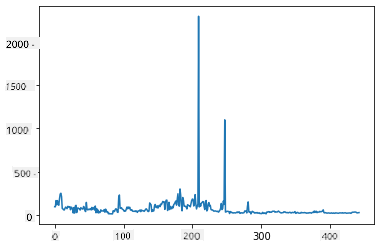
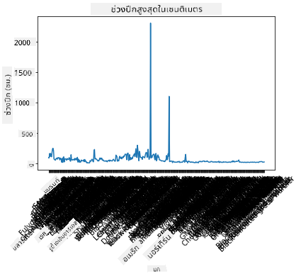
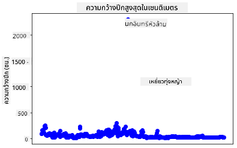
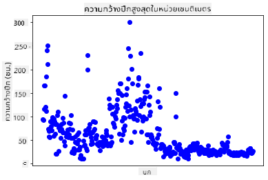
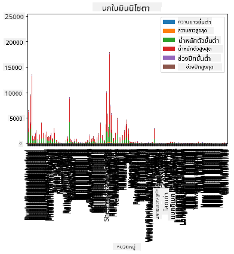
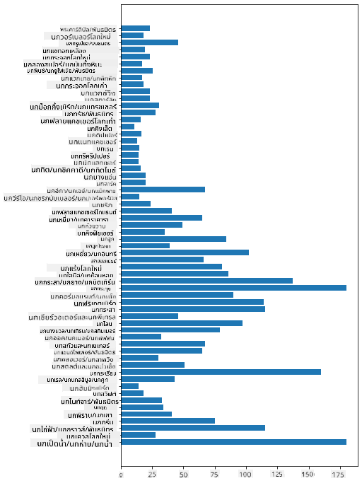
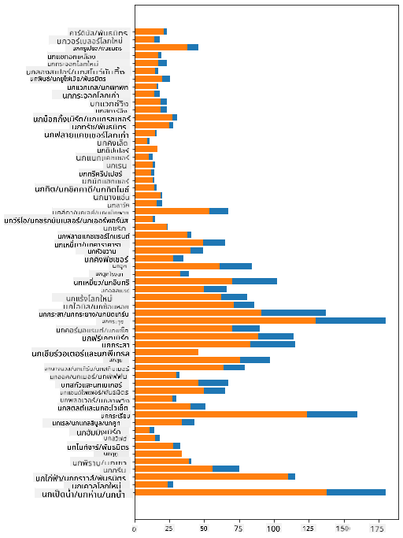

<!--
CO_OP_TRANSLATOR_METADATA:
{
  "original_hash": "69b32b6789a91f796ebc7a02f5575e03",
  "translation_date": "2025-09-04T18:50:24+00:00",
  "source_file": "3-Data-Visualization/09-visualization-quantities/README.md",
  "language_code": "th"
}
-->
# การแสดงผลข้อมูลเชิงปริมาณ

|](../../sketchnotes/09-Visualizing-Quantities.png)|
|:---:|
| การแสดงผลข้อมูลเชิงปริมาณ - _ภาพสเก็ตช์โดย [@nitya](https://twitter.com/nitya)_ |

ในบทเรียนนี้ คุณจะได้เรียนรู้วิธีการใช้ไลบรารี Python ที่มีอยู่มากมายเพื่อสร้างการแสดงผลที่น่าสนใจเกี่ยวกับแนวคิดของข้อมูลเชิงปริมาณ โดยใช้ชุดข้อมูลที่ถูกทำความสะอาดเกี่ยวกับนกในรัฐมินนิโซตา คุณจะได้เรียนรู้ข้อเท็จจริงที่น่าสนใจเกี่ยวกับสัตว์ป่าในพื้นที่นี้  
## [แบบทดสอบก่อนเรียน](https://purple-hill-04aebfb03.1.azurestaticapps.net/quiz/16)

## สังเกตความกว้างของปีกด้วย Matplotlib

ไลบรารีที่ยอดเยี่ยมสำหรับการสร้างกราฟและแผนภูมิทั้งแบบง่ายและซับซ้อนคือ [Matplotlib](https://matplotlib.org/stable/index.html) โดยทั่วไปแล้ว กระบวนการสร้างกราฟด้วยไลบรารีเหล่านี้ประกอบด้วยการระบุส่วนของ dataframe ที่คุณต้องการใช้งาน การปรับเปลี่ยนข้อมูลตามความจำเป็น กำหนดค่าของแกน x และ y ตัดสินใจเลือกประเภทของกราฟที่จะแสดง และแสดงกราฟนั้นออกมา Matplotlib มีตัวเลือกการแสดงผลที่หลากหลาย แต่สำหรับบทเรียนนี้ เราจะเน้นไปที่ประเภทที่เหมาะสมที่สุดสำหรับการแสดงผลข้อมูลเชิงปริมาณ ได้แก่ กราฟเส้น กราฟกระจาย และกราฟแท่ง

> ✅ เลือกกราฟที่เหมาะสมกับโครงสร้างข้อมูลและเรื่องราวที่คุณต้องการเล่า  
> - วิเคราะห์แนวโน้มตามเวลา: กราฟเส้น  
> - เปรียบเทียบค่า: กราฟแท่ง กราฟคอลัมน์ กราฟวงกลม กราฟกระจาย  
> - แสดงความสัมพันธ์ระหว่างส่วนต่างๆ: กราฟวงกลม  
> - แสดงการกระจายของข้อมูล: กราฟกระจาย กราฟแท่ง  
> - แสดงแนวโน้ม: กราฟเส้น กราฟคอลัมน์  
> - แสดงความสัมพันธ์ระหว่างค่า: กราฟเส้น กราฟกระจาย กราฟฟอง  

หากคุณมีชุดข้อมูลและต้องการค้นหาปริมาณของรายการที่กำหนด งานแรกที่คุณต้องทำคือการตรวจสอบค่าของมัน  

✅ มี 'cheat sheets' ที่ดีมากสำหรับ Matplotlib [ที่นี่](https://matplotlib.org/cheatsheets/cheatsheets.pdf)

## สร้างกราฟเส้นเกี่ยวกับค่าความกว้างของปีกนก

เปิดไฟล์ `notebook.ipynb` ที่อยู่ในโฟลเดอร์บทเรียนนี้และเพิ่มเซลล์ใหม่  

> หมายเหตุ: ข้อมูลถูกจัดเก็บไว้ในโฟลเดอร์ `/data` ที่อยู่ใน root ของ repo นี้  

```python
import pandas as pd
import matplotlib.pyplot as plt
birds = pd.read_csv('../../data/birds.csv')
birds.head()
```  
ข้อมูลนี้เป็นการผสมระหว่างข้อความและตัวเลข:

|      | Name                         | ScientificName         | Category              | Order        | Family   | Genus       | ConservationStatus | MinLength | MaxLength | MinBodyMass | MaxBodyMass | MinWingspan | MaxWingspan |
| ---: | :--------------------------- | :--------------------- | :-------------------- | :----------- | :------- | :---------- | :----------------- | --------: | --------: | ----------: | ----------: | ----------: | ----------: |
|    0 | Black-bellied whistling-duck | Dendrocygna autumnalis | Ducks/Geese/Waterfowl | Anseriformes | Anatidae | Dendrocygna | LC                 |        47 |        56 |         652 |        1020 |          76 |          94 |
|    1 | Fulvous whistling-duck       | Dendrocygna bicolor    | Ducks/Geese/Waterfowl | Anseriformes | Anatidae | Dendrocygna | LC                 |        45 |        53 |         712 |        1050 |          85 |          93 |
|    2 | Snow goose                   | Anser caerulescens     | Ducks/Geese/Waterfowl | Anseriformes | Anatidae | Anser       | LC                 |        64 |        79 |        2050 |        4050 |         135 |         165 |
|    3 | Ross's goose                 | Anser rossii           | Ducks/Geese/Waterfowl | Anseriformes | Anatidae | Anser       | LC                 |      57.3 |        64 |        1066 |        1567 |         113 |         116 |
|    4 | Greater white-fronted goose  | Anser albifrons        | Ducks/Geese/Waterfowl | Anseriformes | Anatidae | Anser       | LC                 |        64 |        81 |        1930 |        3310 |         130 |         165 |

เริ่มต้นด้วยการสร้างกราฟเส้นพื้นฐานเพื่อแสดงข้อมูลตัวเลขบางส่วน สมมติว่าคุณต้องการดูค่าความกว้างของปีกสูงสุดของนกเหล่านี้  

```python
wingspan = birds['MaxWingspan'] 
wingspan.plot()
```  


คุณสังเกตเห็นอะไรทันที? ดูเหมือนว่าจะมีค่าผิดปกติอย่างน้อยหนึ่งค่า - นั่นเป็นความกว้างของปีกที่ใหญ่มาก! ความกว้างของปีก 2300 เซนติเมตรเท่ากับ 23 เมตร - มีนก Pterodactyls อยู่ในมินนิโซตาหรือเปล่า? มาสำรวจเพิ่มเติมกัน  

แม้ว่าคุณจะสามารถจัดเรียงข้อมูลใน Excel เพื่อค้นหาค่าผิดปกติได้อย่างรวดเร็ว แต่ให้ดำเนินการต่อในกระบวนการแสดงผลโดยทำงานจากภายในกราฟ  

เพิ่มป้ายกำกับที่แกน x เพื่อแสดงว่านกชนิดใดที่กำลังถูกพิจารณา:

```
plt.title('Max Wingspan in Centimeters')
plt.ylabel('Wingspan (CM)')
plt.xlabel('Birds')
plt.xticks(rotation=45)
x = birds['Name'] 
y = birds['MaxWingspan']

plt.plot(x, y)

plt.show()
```  


แม้จะหมุนป้ายกำกับเป็น 45 องศา แต่ก็ยังมีมากเกินไปที่จะอ่านได้ ลองใช้กลยุทธ์อื่น: แสดงป้ายกำกับเฉพาะค่าผิดปกติและตั้งป้ายกำกับไว้ในกราฟ คุณสามารถใช้กราฟกระจายเพื่อเพิ่มพื้นที่สำหรับการแสดงป้ายกำกับ:

```python
plt.title('Max Wingspan in Centimeters')
plt.ylabel('Wingspan (CM)')
plt.tick_params(axis='both',which='both',labelbottom=False,bottom=False)

for i in range(len(birds)):
    x = birds['Name'][i]
    y = birds['MaxWingspan'][i]
    plt.plot(x, y, 'bo')
    if birds['MaxWingspan'][i] > 500:
        plt.text(x, y * (1 - 0.05), birds['Name'][i], fontsize=12)
    
plt.show()
```  
เกิดอะไรขึ้นที่นี่? คุณใช้ `tick_params` เพื่อซ่อนป้ายกำกับด้านล่างและสร้างลูปผ่านชุดข้อมูลนกของคุณ โดยการสร้างกราฟด้วยจุดสีน้ำเงินเล็กๆ โดยใช้ `bo` คุณตรวจสอบนกที่มีความกว้างของปีกสูงสุดเกิน 500 และแสดงป้ายกำกับถัดจากจุดนั้นหากเป็นเช่นนั้น คุณปรับป้ายกำกับเล็กน้อยบนแกน y (`y * (1 - 0.05)`) และใช้ชื่อของนกเป็นป้ายกำกับ  

คุณค้นพบอะไร?

  
## กรองข้อมูลของคุณ

ทั้ง Bald Eagle และ Prairie Falcon แม้จะเป็นนกที่ใหญ่มาก แต่ดูเหมือนว่าจะมีการระบุค่าผิดพลาด โดยมีการเพิ่ม `0` เข้าไปในค่าความกว้างของปีกสูงสุด เป็นไปได้ยากที่คุณจะพบ Bald Eagle ที่มีความกว้างของปีก 25 เมตร แต่ถ้าเจอ โปรดแจ้งให้เราทราบ! มาสร้าง dataframe ใหม่โดยไม่มีค่าผิดปกติสองตัวนี้:

```python
plt.title('Max Wingspan in Centimeters')
plt.ylabel('Wingspan (CM)')
plt.xlabel('Birds')
plt.tick_params(axis='both',which='both',labelbottom=False,bottom=False)
for i in range(len(birds)):
    x = birds['Name'][i]
    y = birds['MaxWingspan'][i]
    if birds['Name'][i] not in ['Bald eagle', 'Prairie falcon']:
        plt.plot(x, y, 'bo')
plt.show()
```  

เมื่อกรองค่าผิดปกติออก ข้อมูลของคุณจะมีความสอดคล้องและเข้าใจง่ายขึ้น  

  

ตอนนี้เรามีชุดข้อมูลที่สะอาดขึ้นอย่างน้อยในแง่ของความกว้างของปีก มาค้นพบข้อมูลเพิ่มเติมเกี่ยวกับนกเหล่านี้กัน  

แม้ว่ากราฟเส้นและกราฟกระจายสามารถแสดงข้อมูลเกี่ยวกับค่าของข้อมูลและการกระจายของมันได้ เราต้องการคิดถึงค่าที่มีอยู่ในชุดข้อมูลนี้ คุณสามารถสร้างการแสดงผลเพื่อหาคำตอบเกี่ยวกับข้อมูลเชิงปริมาณ เช่น:

> มีกี่ประเภทของนก และมีจำนวนเท่าไหร่?  
> มีกี่ตัวที่สูญพันธุ์ ใกล้สูญพันธุ์ หายาก หรือพบได้ทั่วไป?  
> มีกี่ตัวในสกุลและลำดับต่างๆ ตามคำศัพท์ของ Linnaeus?  
## สำรวจกราฟแท่ง

กราฟแท่งมีประโยชน์เมื่อคุณต้องการแสดงการจัดกลุ่มของข้อมูล มาสำรวจประเภทของนกที่มีอยู่ในชุดข้อมูลนี้เพื่อดูว่าประเภทใดมีจำนวนมากที่สุด  

ในไฟล์ notebook สร้างกราฟแท่งพื้นฐาน  

✅ หมายเหตุ คุณสามารถกรองนกสองตัวที่เป็นค่าผิดปกติที่เราระบุไว้ในส่วนก่อนหน้า แก้ไขค่าผิดพลาดในความกว้างของปีก หรือปล่อยไว้สำหรับการฝึกฝนที่ไม่ขึ้นอยู่กับค่าความกว้างของปีก  

หากคุณต้องการสร้างกราฟแท่ง คุณสามารถเลือกข้อมูลที่คุณต้องการเน้น กราฟแท่งสามารถสร้างจากข้อมูลดิบ:

```python
birds.plot(x='Category',
        kind='bar',
        stacked=True,
        title='Birds of Minnesota')

```  
  

กราฟแท่งนี้ อย่างไรก็ตาม อ่านยากเพราะมีข้อมูลที่ไม่ได้จัดกลุ่มมากเกินไป คุณต้องเลือกเฉพาะข้อมูลที่คุณต้องการแสดง ดังนั้นมาดูความยาวของนกตามประเภทของมัน  

กรองข้อมูลของคุณเพื่อรวมเฉพาะประเภทของนก  

✅ สังเกตว่าคุณใช้ Pandas เพื่อจัดการข้อมูล และให้ Matplotlib ทำการสร้างกราฟ  

เนื่องจากมีหลายประเภท คุณสามารถแสดงกราฟนี้ในแนวตั้งและปรับความสูงเพื่อรองรับข้อมูลทั้งหมด:

```python
category_count = birds.value_counts(birds['Category'].values, sort=True)
plt.rcParams['figure.figsize'] = [6, 12]
category_count.plot.barh()
```  
  

กราฟแท่งนี้แสดงภาพที่ดีเกี่ยวกับจำนวนของนกในแต่ละประเภท ในพริบตา คุณจะเห็นว่าจำนวนมากที่สุดของนกในภูมิภาคนี้อยู่ในประเภท Ducks/Geese/Waterfowl มินนิโซตาเป็น 'ดินแดนแห่งทะเลสาบ 10,000 แห่ง' ดังนั้นจึงไม่น่าแปลกใจ!  

✅ ลองนับข้อมูลอื่นๆ ในชุดข้อมูลนี้ มีอะไรที่ทำให้คุณประหลาดใจหรือไม่?  

## การเปรียบเทียบข้อมูล

คุณสามารถลองเปรียบเทียบข้อมูลที่จัดกลุ่มโดยการสร้างแกนใหม่ ลองเปรียบเทียบ MaxLength ของนกตามประเภทของมัน:

```python
maxlength = birds['MaxLength']
plt.barh(y=birds['Category'], width=maxlength)
plt.rcParams['figure.figsize'] = [6, 12]
plt.show()
```  
  

ไม่มีอะไรน่าประหลาดใจที่นี่: นกฮัมมิงเบิร์ดมี MaxLength น้อยที่สุดเมื่อเทียบกับนกกระทุงหรือนกห่าน ข้อมูลที่สมเหตุสมผลเป็นสิ่งที่ดี!  

คุณสามารถสร้างการแสดงผลที่น่าสนใจยิ่งขึ้นของกราฟแท่งโดยการซ้อนข้อมูล ลองซ้อน Minimum และ Maximum Length ในประเภทของนก:

```python
minLength = birds['MinLength']
maxLength = birds['MaxLength']
category = birds['Category']

plt.barh(category, maxLength)
plt.barh(category, minLength)

plt.show()
```  
ในกราฟนี้ คุณสามารถเห็นช่วงของ Minimum Length และ Maximum Length ต่อประเภทของนก คุณสามารถพูดได้อย่างปลอดภัยว่า จากข้อมูลนี้ ยิ่งนกตัวใหญ่ ช่วงความยาวของมันก็ยิ่งกว้างขึ้น น่าสนใจมาก!  

  

## 🚀 ความท้าทาย

ชุดข้อมูลนกนี้มีข้อมูลมากมายเกี่ยวกับนกประเภทต่างๆ ในระบบนิเวศเฉพาะ ลองค้นหาชุดข้อมูลเกี่ยวกับนกอื่นๆ บนอินเทอร์เน็ต และฝึกสร้างกราฟและแผนภูมิรอบๆ นกเหล่านี้เพื่อค้นพบข้อเท็จจริงที่คุณไม่เคยรู้มาก่อน  

## [แบบทดสอบหลังเรียน](https://ff-quizzes.netlify.app/en/ds/)

## ทบทวนและศึกษาด้วยตนเอง

บทเรียนแรกนี้ได้ให้ข้อมูลเกี่ยวกับวิธีการใช้ Matplotlib เพื่อแสดงผลข้อมูลเชิงปริมาณ ลองค้นคว้าเกี่ยวกับวิธีอื่นๆ ในการทำงานกับชุดข้อมูลเพื่อการแสดงผล [Plotly](https://github.com/plotly/plotly.py) เป็นอีกหนึ่งตัวเลือกที่เราจะไม่ครอบคลุมในบทเรียนนี้ ลองดูว่ามันสามารถทำอะไรได้บ้าง  

## งานที่ได้รับมอบหมาย

[Lines, Scatters, and Bars](assignment.md)  

---

**ข้อจำกัดความรับผิดชอบ**:  
เอกสารนี้ได้รับการแปลโดยใช้บริการแปลภาษา AI [Co-op Translator](https://github.com/Azure/co-op-translator) แม้ว่าเราจะพยายามให้การแปลมีความถูกต้อง แต่โปรดทราบว่าการแปลโดยอัตโนมัติอาจมีข้อผิดพลาดหรือความไม่ถูกต้อง เอกสารต้นฉบับในภาษาดั้งเดิมควรถือเป็นแหล่งข้อมูลที่เชื่อถือได้ สำหรับข้อมูลที่สำคัญ ขอแนะนำให้ใช้บริการแปลภาษามืออาชีพ เราไม่รับผิดชอบต่อความเข้าใจผิดหรือการตีความผิดที่เกิดจากการใช้การแปลนี้