<!--
CO_OP_TRANSLATOR_METADATA:
{
  "original_hash": "87faccac113d772551486a67a607153e",
  "translation_date": "2025-08-26T22:48:07+00:00",
  "source_file": "3-Data-Visualization/10-visualization-distributions/README.md",
  "language_code": "th"
}
-->
# การแสดงภาพการกระจายตัวของข้อมูล

| ](../../sketchnotes/10-Visualizing-Distributions.png)|
|:---:|
| การแสดงภาพการกระจายตัวของข้อมูล - _สเก็ตช์โน้ตโดย [@nitya](https://twitter.com/nitya)_ |

ในบทเรียนก่อนหน้านี้ คุณได้เรียนรู้ข้อเท็จจริงที่น่าสนใจเกี่ยวกับชุดข้อมูลเกี่ยวกับนกในรัฐมินนิโซตา คุณพบข้อมูลที่ผิดพลาดโดยการแสดงภาพค่าผิดปกติ และได้ดูความแตกต่างระหว่างหมวดหมู่นกตามความยาวสูงสุดของพวกมัน

## [แบบทดสอบก่อนเรียน](https://purple-hill-04aebfb03.1.azurestaticapps.net/quiz/18)
## สำรวจชุดข้อมูลนก

อีกวิธีหนึ่งในการเจาะลึกข้อมูลคือการดูการกระจายตัวของข้อมูล หรือวิธีที่ข้อมูลถูกจัดเรียงตามแกนตัวอย่าง เช่น คุณอาจต้องการเรียนรู้เกี่ยวกับการกระจายตัวทั่วไปของความกว้างปีกสูงสุดหรือมวลร่างกายสูงสุดของนกในรัฐมินนิโซตาในชุดข้อมูลนี้

มาค้นหาข้อเท็จจริงบางอย่างเกี่ยวกับการกระจายตัวของข้อมูลในชุดข้อมูลนี้กัน ในไฟล์ _notebook.ipynb_ ที่อยู่ในโฟลเดอร์บทเรียนนี้ ให้นำเข้า Pandas, Matplotlib และข้อมูลของคุณ:

```python
import pandas as pd
import matplotlib.pyplot as plt
birds = pd.read_csv('../../data/birds.csv')
birds.head()
```

|      | ชื่อ                          | ชื่อวิทยาศาสตร์         | หมวดหมู่              | ลำดับ        | วงศ์      | สกุล         | สถานะการอนุรักษ์ | ความยาวต่ำสุด | ความยาวสูงสุด | มวลร่างกายต่ำสุด | มวลร่างกายสูงสุด | ความกว้างปีกต่ำสุด | ความกว้างปีกสูงสุด |
| ---: | :--------------------------- | :--------------------- | :-------------------- | :----------- | :------- | :---------- | :----------------- | --------: | --------: | ----------: | ----------: | ----------: | ----------: |
|    0 | เป็ดหวีดท้องดำ               | Dendrocygna autumnalis | เป็ด/ห่าน/นกน้ำ       | Anseriformes | Anatidae | Dendrocygna | LC                 |        47 |        56 |         652 |        1020 |          76 |          94 |
|    1 | เป็ดหวีดสีน้ำตาล             | Dendrocygna bicolor    | เป็ด/ห่าน/นกน้ำ       | Anseriformes | Anatidae | Dendrocygna | LC                 |        45 |        53 |         712 |        1050 |          85 |          93 |
|    2 | ห่านหิมะ                     | Anser caerulescens     | เป็ด/ห่าน/นกน้ำ       | Anseriformes | Anatidae | Anser       | LC                 |        64 |        79 |        2050 |        4050 |         135 |         165 |
|    3 | ห่านรอสส์                   | Anser rossii           | เป็ด/ห่าน/นกน้ำ       | Anseriformes | Anatidae | Anser       | LC                 |      57.3 |        64 |        1066 |        1567 |         113 |         116 |
|    4 | ห่านหน้าขาวใหญ่              | Anser albifrons        | เป็ด/ห่าน/นกน้ำ       | Anseriformes | Anatidae | Anser       | LC                 |        64 |        81 |        1930 |        3310 |         130 |         165 |

โดยทั่วไป คุณสามารถดูการกระจายตัวของข้อมูลได้อย่างรวดเร็วโดยใช้แผนภาพกระจาย (scatter plot) เช่นเดียวกับที่เราได้ทำในบทเรียนก่อนหน้านี้:

```python
birds.plot(kind='scatter',x='MaxLength',y='Order',figsize=(12,8))

plt.title('Max Length per Order')
plt.ylabel('Order')
plt.xlabel('Max Length')

plt.show()
```
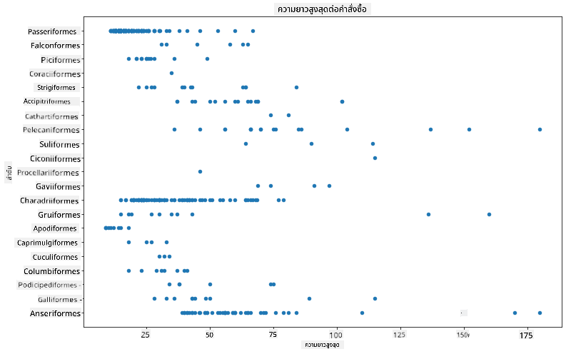

นี่เป็นภาพรวมของการกระจายตัวทั่วไปของความยาวร่างกายต่ออันดับของนก แต่ไม่ใช่วิธีที่เหมาะสมที่สุดในการแสดงการกระจายตัวที่แท้จริง งานนี้มักจะทำโดยการสร้างฮิสโตแกรม

## การทำงานกับฮิสโตแกรม

Matplotlib มีวิธีที่ดีมากในการแสดงการกระจายตัวของข้อมูลโดยใช้ฮิสโตแกรม แผนภูมิประเภทนี้คล้ายกับแผนภูมิแท่งที่การกระจายตัวสามารถมองเห็นได้ผ่านการเพิ่มขึ้นและลดลงของแท่งข้อมูล ในการสร้างฮิสโตแกรม คุณต้องมีข้อมูลเชิงตัวเลข ในการสร้างฮิสโตแกรม คุณสามารถสร้างแผนภูมิที่กำหนดชนิดเป็น 'hist' สำหรับฮิสโตแกรม แผนภูมินี้แสดงการกระจายตัวของ MaxBodyMass สำหรับช่วงข้อมูลเชิงตัวเลขทั้งหมดในชุดข้อมูล โดยการแบ่งข้อมูลออกเป็นกลุ่มย่อย (bins) จะสามารถแสดงการกระจายตัวของค่าข้อมูลได้:

```python
birds['MaxBodyMass'].plot(kind = 'hist', bins = 10, figsize = (12,12))
plt.show()
```
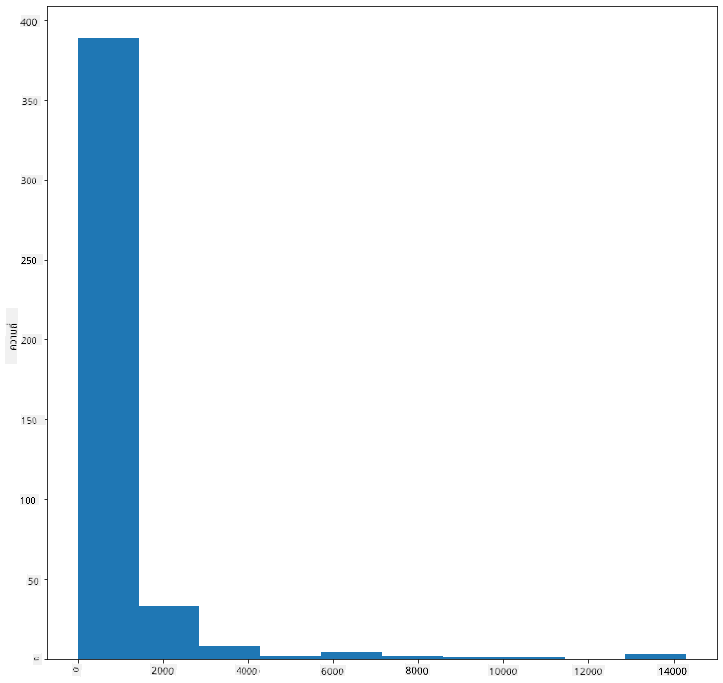

ดังที่คุณเห็น นกส่วนใหญ่ในชุดข้อมูลกว่า 400 ตัวนี้มีมวลร่างกายสูงสุดต่ำกว่า 2000 ลองเปลี่ยนพารามิเตอร์ `bins` เป็นค่าที่สูงขึ้น เช่น 30 เพื่อดูข้อมูลในรายละเอียดมากขึ้น:

```python
birds['MaxBodyMass'].plot(kind = 'hist', bins = 30, figsize = (12,12))
plt.show()
```
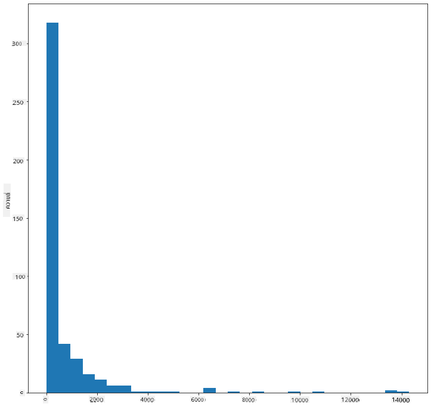

แผนภูมินี้แสดงการกระจายตัวในลักษณะที่ละเอียดขึ้นเล็กน้อย คุณสามารถสร้างแผนภูมิที่ไม่เอียงไปทางซ้ายมากเกินไปได้โดยการเลือกข้อมูลเฉพาะในช่วงที่กำหนด:

กรองข้อมูลของคุณเพื่อเลือกเฉพาะนกที่มีมวลร่างกายต่ำกว่า 60 และแสดง `bins` จำนวน 40:

```python
filteredBirds = birds[(birds['MaxBodyMass'] > 1) & (birds['MaxBodyMass'] < 60)]      
filteredBirds['MaxBodyMass'].plot(kind = 'hist',bins = 40,figsize = (12,12))
plt.show()     
```
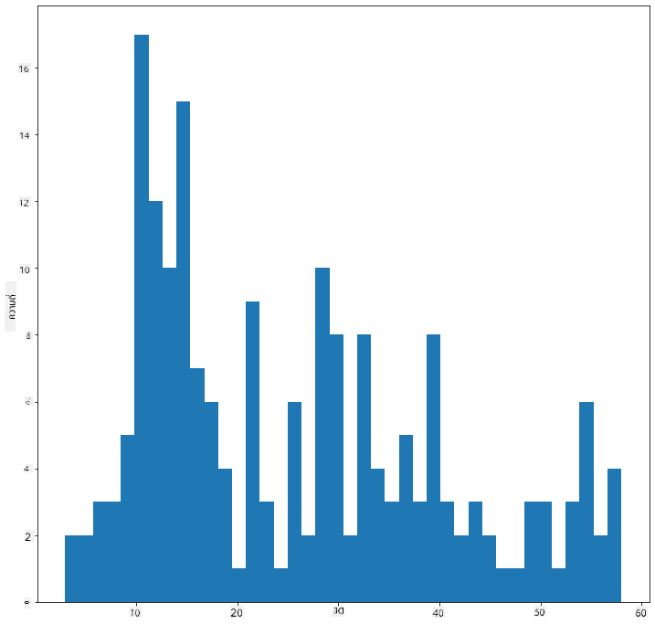

✅ ลองใช้ตัวกรองและจุดข้อมูลอื่น ๆ เพื่อดูการกระจายตัวของข้อมูลทั้งหมด ลบตัวกรอง `['MaxBodyMass']` เพื่อแสดงการกระจายตัวที่มีการติดป้ายกำกับ

ฮิสโตแกรมยังมีการปรับปรุงสีและการติดป้ายกำกับที่น่าสนใจให้ลองใช้ด้วย:

สร้างฮิสโตแกรม 2 มิติ เพื่อเปรียบเทียบความสัมพันธ์ระหว่างการกระจายตัวสองแบบ ลองเปรียบเทียบ `MaxBodyMass` กับ `MaxLength` Matplotlib มีวิธีในตัวเพื่อแสดงการบรรจบกันโดยใช้สีที่สว่างขึ้น:

```python
x = filteredBirds['MaxBodyMass']
y = filteredBirds['MaxLength']

fig, ax = plt.subplots(tight_layout=True)
hist = ax.hist2d(x, y)
```
ดูเหมือนว่าจะมีความสัมพันธ์ที่คาดหวังระหว่างสององค์ประกอบนี้ตามแกนที่คาดไว้ โดยมีจุดบรรจบที่แข็งแกร่งจุดหนึ่ง:

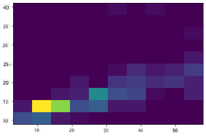

ฮิสโตแกรมทำงานได้ดีโดยค่าเริ่มต้นสำหรับข้อมูลเชิงตัวเลข แล้วถ้าคุณต้องการดูการกระจายตัวตามข้อมูลข้อความล่ะ?

## สำรวจชุดข้อมูลเพื่อดูการกระจายตัวโดยใช้ข้อมูลข้อความ

ชุดข้อมูลนี้ยังมีข้อมูลที่ดีเกี่ยวกับหมวดหมู่นก สกุล สปีชีส์ และวงศ์ รวมถึงสถานะการอนุรักษ์ มาสำรวจข้อมูลสถานะการอนุรักษ์นี้กัน การกระจายตัวของนกตามสถานะการอนุรักษ์เป็นอย่างไร?

> ✅ ในชุดข้อมูลนี้ มีการใช้ตัวย่อหลายตัวเพื่ออธิบายสถานะการอนุรักษ์ ตัวย่อเหล่านี้มาจาก [IUCN Red List Categories](https://www.iucnredlist.org/) ซึ่งเป็นองค์กรที่จัดทำรายการสถานะของสปีชีส์
> 
> - CR: ใกล้สูญพันธุ์อย่างยิ่ง
> - EN: ใกล้สูญพันธุ์
> - EX: สูญพันธุ์
> - LC: ความกังวลน้อยที่สุด
> - NT: ใกล้ถูกคุกคาม
> - VU: มีแนวโน้มใกล้สูญพันธุ์

ค่าพวกนี้เป็นค่าข้อความ ดังนั้นคุณจะต้องทำการแปลงเพื่อสร้างฮิสโตแกรม โดยใช้ dataframe ที่กรองแล้ว แสดงสถานะการอนุรักษ์ควบคู่ไปกับความกว้างปีกขั้นต่ำ คุณเห็นอะไรบ้าง?

```python
x1 = filteredBirds.loc[filteredBirds.ConservationStatus=='EX', 'MinWingspan']
x2 = filteredBirds.loc[filteredBirds.ConservationStatus=='CR', 'MinWingspan']
x3 = filteredBirds.loc[filteredBirds.ConservationStatus=='EN', 'MinWingspan']
x4 = filteredBirds.loc[filteredBirds.ConservationStatus=='NT', 'MinWingspan']
x5 = filteredBirds.loc[filteredBirds.ConservationStatus=='VU', 'MinWingspan']
x6 = filteredBirds.loc[filteredBirds.ConservationStatus=='LC', 'MinWingspan']

kwargs = dict(alpha=0.5, bins=20)

plt.hist(x1, **kwargs, color='red', label='Extinct')
plt.hist(x2, **kwargs, color='orange', label='Critically Endangered')
plt.hist(x3, **kwargs, color='yellow', label='Endangered')
plt.hist(x4, **kwargs, color='green', label='Near Threatened')
plt.hist(x5, **kwargs, color='blue', label='Vulnerable')
plt.hist(x6, **kwargs, color='gray', label='Least Concern')

plt.gca().set(title='Conservation Status', ylabel='Min Wingspan')
plt.legend();
```

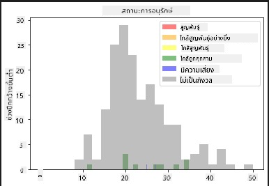

ดูเหมือนว่าจะไม่มีความสัมพันธ์ที่ดีระหว่างความกว้างปีกขั้นต่ำและสถานะการอนุรักษ์ ลองทดสอบองค์ประกอบอื่น ๆ ในชุดข้อมูลโดยใช้วิธีนี้ คุณสามารถลองใช้ตัวกรองที่แตกต่างกันได้ คุณพบความสัมพันธ์ใดหรือไม่?

## แผนภูมิความหนาแน่น

คุณอาจสังเกตเห็นว่าฮิสโตแกรมที่เราดูจนถึงตอนนี้มีลักษณะเป็น 'ขั้นบันได' และไม่ได้ไหลอย่างราบรื่นในรูปแบบโค้ง หากต้องการแสดงแผนภูมิความหนาแน่นที่ราบรื่นขึ้น คุณสามารถลองใช้แผนภูมิความหนาแน่น

ในการทำงานกับแผนภูมิความหนาแน่น ให้ทำความคุ้นเคยกับไลบรารีการสร้างแผนภูมิใหม่ [Seaborn](https://seaborn.pydata.org/generated/seaborn.kdeplot.html)

โหลด Seaborn และลองสร้างแผนภูมิความหนาแน่นพื้นฐาน:

```python
import seaborn as sns
import matplotlib.pyplot as plt
sns.kdeplot(filteredBirds['MinWingspan'])
plt.show()
```
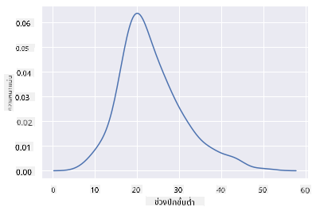

คุณสามารถเห็นได้ว่าแผนภูมิสะท้อนแผนภูมิก่อนหน้านี้สำหรับข้อมูลความกว้างปีกขั้นต่ำ เพียงแต่ราบรื่นขึ้นเล็กน้อย ตามเอกสารของ Seaborn "เมื่อเทียบกับฮิสโตแกรม KDE สามารถสร้างแผนภูมิที่ดูไม่รกและตีความได้ง่ายกว่า โดยเฉพาะเมื่อวาดการกระจายตัวหลายแบบ แต่ก็มีโอกาสที่จะเกิดการบิดเบือนหากการกระจายตัวพื้นฐานมีขอบเขตหรือไม่ราบรื่น" [source](https://seaborn.pydata.org/generated/seaborn.kdeplot.html) กล่าวอีกนัยหนึ่ง ค่าผิดปกติจะทำให้แผนภูมิของคุณแสดงผลไม่ดีเสมอ

หากคุณต้องการกลับไปดูเส้น MaxBodyMass ที่เป็นขั้นบันไดในแผนภูมิที่สองที่คุณสร้าง คุณสามารถทำให้มันราบรื่นได้ดีมากโดยสร้างใหม่ด้วยวิธีนี้:

```python
sns.kdeplot(filteredBirds['MaxBodyMass'])
plt.show()
```
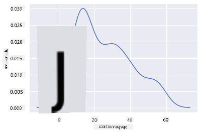

หากคุณต้องการเส้นที่ราบรื่นแต่ไม่ราบรื่นเกินไป ให้แก้ไขพารามิเตอร์ `bw_adjust`:

```python
sns.kdeplot(filteredBirds['MaxBodyMass'], bw_adjust=.2)
plt.show()
```
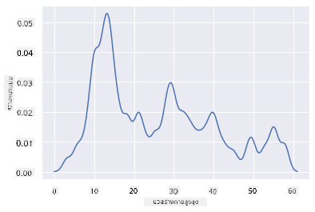

✅ อ่านเกี่ยวกับพารามิเตอร์ที่มีสำหรับแผนภูมิประเภทนี้และทดลองใช้!

แผนภูมิประเภทนี้ให้การแสดงภาพที่อธิบายได้อย่างสวยงาม ด้วยโค้ดเพียงไม่กี่บรรทัด ตัวอย่างเช่น คุณสามารถแสดงความหนาแน่นของมวลร่างกายสูงสุดต่ออันดับของนก:

```python
sns.kdeplot(
   data=filteredBirds, x="MaxBodyMass", hue="Order",
   fill=True, common_norm=False, palette="crest",
   alpha=.5, linewidth=0,
)
```

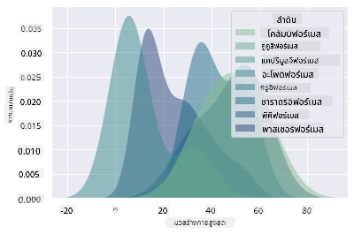

คุณยังสามารถทำแผนที่ความหนาแน่นของตัวแปรหลายตัวในแผนภูมิเดียวกันได้ ลองเปรียบเทียบ MaxLength และ MinLength ของนกกับสถานะการอนุรักษ์:

```python
sns.kdeplot(data=filteredBirds, x="MinLength", y="MaxLength", hue="ConservationStatus")
```

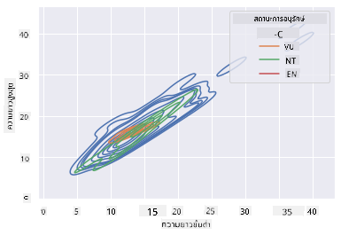

บางทีอาจคุ้มค่าที่จะวิจัยว่ากลุ่มของนกที่ 'มีแนวโน้มใกล้สูญพันธุ์' ตามความยาวของพวกมันมีความหมายหรือไม่

## 🚀 ความท้าทาย

ฮิสโตแกรมเป็นแผนภูมิที่ซับซ้อนกว่าการกระจายจุด แผนภูมิแท่ง หรือแผนภูมิเส้นพื้นฐาน ลองค้นหาตัวอย่างการใช้ฮิสโตแกรมที่ดีบนอินเทอร์เน็ต พวกมันถูกใช้ในลักษณะใด แสดงอะไร และมักถูกใช้ในสาขาหรือพื้นที่ใด?

## [แบบทดสอบหลังเรียน](https://purple-hill-04aebfb03.1.azurestaticapps.net/quiz/19)

## ทบทวนและศึกษาด้วยตนเอง

ในบทเรียนนี้ คุณได้ใช้ Matplotlib และเริ่มทำงานกับ Seaborn เพื่อแสดงแผนภูมิที่ซับซ้อนมากขึ้น ลองค้นคว้าเกี่ยวกับ `kdeplot` ใน Seaborn ซึ่งเป็น "เส้นโค้งความน่าจะเป็นต่อเนื่องในหนึ่งหรือหลายมิติ" อ่าน [เอกสาร](https://seaborn.pydata.org/generated/seaborn.kdeplot.html) เพื่อทำความเข้าใจวิธีการทำงาน

## งานที่ได้รับมอบหมาย

[นำทักษะของคุณไปใช้](assignment.md)

---

**ข้อจำกัดความรับผิดชอบ**:  
เอกสารนี้ได้รับการแปลโดยใช้บริการแปลภาษา AI [Co-op Translator](https://github.com/Azure/co-op-translator) แม้ว่าเราจะพยายามให้การแปลมีความถูกต้อง แต่โปรดทราบว่าการแปลอัตโนมัติอาจมีข้อผิดพลาดหรือความไม่แม่นยำ เอกสารต้นฉบับในภาษาดั้งเดิมควรถือเป็นแหล่งข้อมูลที่เชื่อถือได้ สำหรับข้อมูลที่สำคัญ แนะนำให้ใช้บริการแปลภาษาจากผู้เชี่ยวชาญ เราไม่รับผิดชอบต่อความเข้าใจผิดหรือการตีความที่ผิดพลาดซึ่งเกิดจากการใช้การแปลนี้