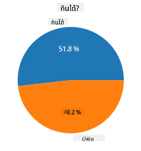
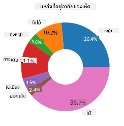
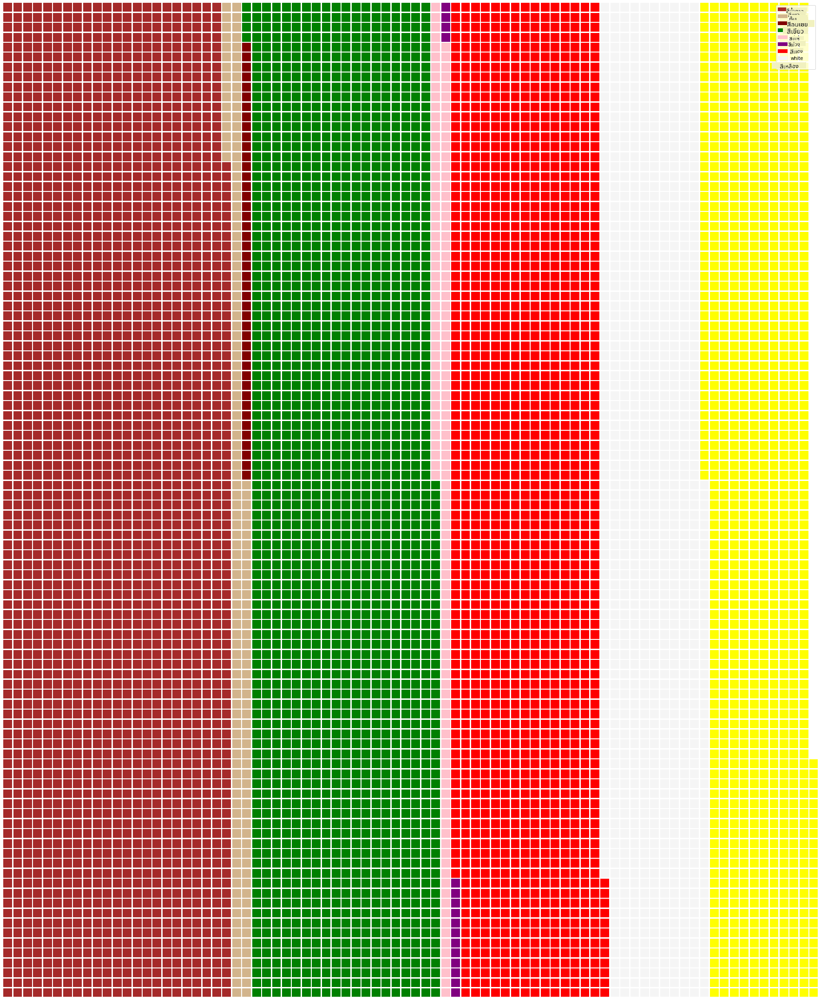

<!--
CO_OP_TRANSLATOR_METADATA:
{
  "original_hash": "cc490897ee2d276870472bcb31602d03",
  "translation_date": "2025-09-04T18:49:24+00:00",
  "source_file": "3-Data-Visualization/11-visualization-proportions/README.md",
  "language_code": "th"
}
-->
# การแสดงสัดส่วนข้อมูล

| ](../../sketchnotes/11-Visualizing-Proportions.png)|
|:---:|
|การแสดงสัดส่วนข้อมูล - _ภาพสเก็ตช์โดย [@nitya](https://twitter.com/nitya)_ |

ในบทเรียนนี้ คุณจะใช้ชุดข้อมูลที่เกี่ยวกับธรรมชาติในการแสดงสัดส่วน เช่น จำนวนชนิดของเห็ดที่ปรากฏในชุดข้อมูลเกี่ยวกับเห็ด ลองสำรวจเห็ดที่น่าสนใจเหล่านี้โดยใช้ชุดข้อมูลจาก Audubon ซึ่งมีรายละเอียดเกี่ยวกับเห็ดมีครีบ 23 สายพันธุ์ในตระกูล Agaricus และ Lepiota คุณจะได้ทดลองสร้างภาพข้อมูลที่น่าสนใจ เช่น:

- แผนภูมิวงกลม 🥧
- แผนภูมิวงแหวน 🍩
- แผนภูมิแบบวาฟเฟิล 🧇

> 💡 โครงการที่น่าสนใจมากชื่อ [Charticulator](https://charticulator.com) โดย Microsoft Research มีอินเทอร์เฟซแบบลากและวางสำหรับการสร้างภาพข้อมูลฟรี ในหนึ่งในบทเรียนของพวกเขา พวกเขาใช้ชุดข้อมูลเห็ดนี้ด้วย! คุณสามารถสำรวจข้อมูลและเรียนรู้ไลบรารีไปพร้อมกัน: [บทเรียน Charticulator](https://charticulator.com/tutorials/tutorial4.html)

## [แบบทดสอบหลังบทเรียน](https://ff-quizzes.netlify.app/en/ds/)

## ทำความรู้จักกับเห็ด 🍄

เห็ดเป็นสิ่งที่น่าสนใจมาก ลองนำเข้าชุดข้อมูลเพื่อศึกษา:

```python
import pandas as pd
import matplotlib.pyplot as plt
mushrooms = pd.read_csv('../../data/mushrooms.csv')
mushrooms.head()
```
ตารางจะถูกพิมพ์ออกมาพร้อมข้อมูลที่ยอดเยี่ยมสำหรับการวิเคราะห์:


| class     | cap-shape | cap-surface | cap-color | bruises | odor    | gill-attachment | gill-spacing | gill-size | gill-color | stalk-shape | stalk-root | stalk-surface-above-ring | stalk-surface-below-ring | stalk-color-above-ring | stalk-color-below-ring | veil-type | veil-color | ring-number | ring-type | spore-print-color | population | habitat |
| --------- | --------- | ----------- | --------- | ------- | ------- | --------------- | ------------ | --------- | ---------- | ----------- | ---------- | ------------------------ | ------------------------ | ---------------------- | ---------------------- | --------- | ---------- | ----------- | --------- | ----------------- | ---------- | ------- |
| Poisonous | Convex    | Smooth      | Brown     | Bruises | Pungent | Free            | Close        | Narrow    | Black      | Enlarging   | Equal      | Smooth                   | Smooth                   | White                  | White                  | Partial   | White      | One         | Pendant   | Black             | Scattered  | Urban   |
| Edible    | Convex    | Smooth      | Yellow    | Bruises | Almond  | Free            | Close        | Broad     | Black      | Enlarging   | Club       | Smooth                   | Smooth                   | White                  | White                  | Partial   | White      | One         | Pendant   | Brown             | Numerous   | Grasses |
| Edible    | Bell      | Smooth      | White     | Bruises | Anise   | Free            | Close        | Broad     | Brown      | Enlarging   | Club       | Smooth                   | Smooth                   | White                  | White                  | Partial   | White      | One         | Pendant   | Brown             | Numerous   | Meadows |
| Poisonous | Convex    | Scaly       | White     | Bruises | Pungent | Free            | Close        | Narrow    | Brown      | Enlarging   | Equal      | Smooth                   | Smooth                   | White                  | White                  | Partial   | White      | One         | Pendant   | Black             | Scattered  | Urban   |

ทันทีที่คุณเห็นข้อมูล คุณจะสังเกตได้ว่าข้อมูลทั้งหมดเป็นข้อความ คุณจะต้องแปลงข้อมูลนี้เพื่อให้สามารถใช้ในแผนภูมิได้ ข้อมูลส่วนใหญ่ในความเป็นจริงถูกแสดงเป็นออบเจ็กต์:

```python
print(mushrooms.select_dtypes(["object"]).columns)
```

ผลลัพธ์คือ:

```output
Index(['class', 'cap-shape', 'cap-surface', 'cap-color', 'bruises', 'odor',
       'gill-attachment', 'gill-spacing', 'gill-size', 'gill-color',
       'stalk-shape', 'stalk-root', 'stalk-surface-above-ring',
       'stalk-surface-below-ring', 'stalk-color-above-ring',
       'stalk-color-below-ring', 'veil-type', 'veil-color', 'ring-number',
       'ring-type', 'spore-print-color', 'population', 'habitat'],
      dtype='object')
```
นำข้อมูลนี้มาแปลงคอลัมน์ 'class' ให้เป็นหมวดหมู่:

```python
cols = mushrooms.select_dtypes(["object"]).columns
mushrooms[cols] = mushrooms[cols].astype('category')
```

```python
edibleclass=mushrooms.groupby(['class']).count()
edibleclass
```

ตอนนี้ หากคุณพิมพ์ข้อมูลเห็ดออกมา คุณจะเห็นว่ามันถูกจัดกลุ่มเป็นหมวดหมู่ตามคลาสที่แบ่งเป็นเห็ดมีพิษ/เห็ดกินได้:


|           | cap-shape | cap-surface | cap-color | bruises | odor | gill-attachment | gill-spacing | gill-size | gill-color | stalk-shape | ... | stalk-surface-below-ring | stalk-color-above-ring | stalk-color-below-ring | veil-type | veil-color | ring-number | ring-type | spore-print-color | population | habitat |
| --------- | --------- | ----------- | --------- | ------- | ---- | --------------- | ------------ | --------- | ---------- | ----------- | --- | ------------------------ | ---------------------- | ---------------------- | --------- | ---------- | ----------- | --------- | ----------------- | ---------- | ------- |
| class     |           |             |           |         |      |                 |              |           |            |             |     |                          |                        |                        |           |            |             |           |                   |            |         |
| Edible    | 4208      | 4208        | 4208      | 4208    | 4208 | 4208            | 4208         | 4208      | 4208       | 4208        | ... | 4208                     | 4208                   | 4208                   | 4208      | 4208       | 4208        | 4208      | 4208              | 4208       | 4208    |
| Poisonous | 3916      | 3916        | 3916      | 3916    | 3916 | 3916            | 3916         | 3916      | 3916       | 3916        | ... | 3916                     | 3916                   | 3916                   | 3916      | 3916       | 3916        | 3916      | 3916              | 3916       | 3916    |

หากคุณทำตามลำดับที่นำเสนอในตารางนี้เพื่อสร้างป้ายหมวดหมู่ของคลาส คุณสามารถสร้างแผนภูมิวงกลมได้:

## วงกลม!

```python
labels=['Edible','Poisonous']
plt.pie(edibleclass['population'],labels=labels,autopct='%.1f %%')
plt.title('Edible?')
plt.show()
```
และนี่คือแผนภูมิวงกลมที่แสดงสัดส่วนข้อมูลตามคลาสของเห็ดสองประเภทนี้ สิ่งสำคัญคือการจัดลำดับป้ายให้ถูกต้อง โดยเฉพาะในกรณีนี้ ดังนั้นอย่าลืมตรวจสอบลำดับของอาร์เรย์ป้าย!



## วงแหวน!

แผนภูมิวงกลมที่ดูน่าสนใจมากขึ้นคือแผนภูมิวงแหวน ซึ่งเป็นแผนภูมิวงกลมที่มีรูตรงกลาง ลองดูข้อมูลของเราโดยใช้วิธีนี้

ดูที่แหล่งที่อยู่อาศัยต่าง ๆ ที่เห็ดเติบโต:

```python
habitat=mushrooms.groupby(['habitat']).count()
habitat
```
ที่นี่ คุณกำลังจัดกลุ่มข้อมูลตามแหล่งที่อยู่อาศัย มีทั้งหมด 7 แหล่งที่อยู่อาศัย ใช้สิ่งเหล่านี้เป็นป้ายสำหรับแผนภูมิวงแหวน:

```python
labels=['Grasses','Leaves','Meadows','Paths','Urban','Waste','Wood']

plt.pie(habitat['class'], labels=labels,
        autopct='%1.1f%%', pctdistance=0.85)
  
center_circle = plt.Circle((0, 0), 0.40, fc='white')
fig = plt.gcf()

fig.gca().add_artist(center_circle)
  
plt.title('Mushroom Habitats')
  
plt.show()
```



โค้ดนี้สร้างแผนภูมิและวงกลมตรงกลาง จากนั้นเพิ่มวงกลมตรงกลางในแผนภูมิ ปรับความกว้างของวงกลมตรงกลางโดยเปลี่ยน `0.40` เป็นค่าอื่น

แผนภูมิวงแหวนสามารถปรับแต่งได้หลายวิธีเพื่อเปลี่ยนป้าย ป้ายโดยเฉพาะสามารถเน้นเพื่อให้อ่านง่ายขึ้น เรียนรู้เพิ่มเติมใน [เอกสาร](https://matplotlib.org/stable/gallery/pie_and_polar_charts/pie_and_donut_labels.html?highlight=donut)

ตอนนี้คุณรู้วิธีจัดกลุ่มข้อมูลและแสดงผลเป็นวงกลมหรือวงแหวนแล้ว คุณสามารถสำรวจแผนภูมิประเภทอื่นได้ ลองแผนภูมิแบบวาฟเฟิล ซึ่งเป็นวิธีการแสดงปริมาณที่แตกต่างออกไป
## วาฟเฟิล!

แผนภูมิแบบ 'วาฟเฟิล' เป็นวิธีการแสดงปริมาณในรูปแบบอาร์เรย์ 2 มิติของสี่เหลี่ยม ลองแสดงปริมาณสีของหมวกเห็ดในชุดข้อมูลนี้ ในการทำเช่นนี้ คุณต้องติดตั้งไลบรารีช่วยเหลือชื่อ [PyWaffle](https://pypi.org/project/pywaffle/) และใช้ Matplotlib:

```python
pip install pywaffle
```

เลือกส่วนหนึ่งของข้อมูลเพื่อจัดกลุ่ม:

```python
capcolor=mushrooms.groupby(['cap-color']).count()
capcolor
```

สร้างแผนภูมิแบบวาฟเฟิลโดยสร้างป้ายและจัดกลุ่มข้อมูลของคุณ:

```python
import pandas as pd
import matplotlib.pyplot as plt
from pywaffle import Waffle
  
data ={'color': ['brown', 'buff', 'cinnamon', 'green', 'pink', 'purple', 'red', 'white', 'yellow'],
    'amount': capcolor['class']
     }
  
df = pd.DataFrame(data)
  
fig = plt.figure(
    FigureClass = Waffle,
    rows = 100,
    values = df.amount,
    labels = list(df.color),
    figsize = (30,30),
    colors=["brown", "tan", "maroon", "green", "pink", "purple", "red", "whitesmoke", "yellow"],
)
```

ด้วยแผนภูมิแบบวาฟเฟิล คุณสามารถเห็นสัดส่วนของสีหมวกเห็ดในชุดข้อมูลนี้ได้อย่างชัดเจน น่าสนใจที่มีเห็ดหมวกสีเขียวจำนวนมาก!



✅ Pywaffle รองรับไอคอนภายในแผนภูมิที่ใช้ไอคอนใด ๆ ที่มีใน [Font Awesome](https://fontawesome.com/) ลองทำการทดลองเพื่อสร้างแผนภูมิแบบวาฟเฟิลที่น่าสนใจยิ่งขึ้นโดยใช้ไอคอนแทนสี่เหลี่ยม

ในบทเรียนนี้ คุณได้เรียนรู้วิธีการแสดงสัดส่วนข้อมูลสามวิธี ก่อนอื่น คุณต้องจัดกลุ่มข้อมูลเป็นหมวดหมู่ จากนั้นตัดสินใจว่าวิธีใดดีที่สุดในการแสดงข้อมูล - วงกลม วงแหวน หรือวาฟเฟิล ทั้งหมดนี้น่าสนใจและให้ภาพรวมของชุดข้อมูลแก่ผู้ใช้ได้ทันที

## 🚀 ความท้าทาย

ลองสร้างแผนภูมิที่น่าสนใจเหล่านี้ใน [Charticulator](https://charticulator.com)
## [แบบทดสอบหลังบทเรียน](https://purple-hill-04aebfb03.1.azurestaticapps.net/quiz/21)

## ทบทวนและศึกษาด้วยตนเอง

บางครั้งไม่ชัดเจนว่าจะใช้แผนภูมิวงกลม วงแหวน หรือวาฟเฟิลเมื่อใด นี่คือบทความบางส่วนที่คุณสามารถอ่านเกี่ยวกับหัวข้อนี้:

https://www.beautiful.ai/blog/battle-of-the-charts-pie-chart-vs-donut-chart

https://medium.com/@hypsypops/pie-chart-vs-donut-chart-showdown-in-the-ring-5d24fd86a9ce

https://www.mit.edu/~mbarker/formula1/f1help/11-ch-c6.htm

https://medium.datadriveninvestor.com/data-visualization-done-the-right-way-with-tableau-waffle-chart-fdf2a19be402

ลองค้นคว้าเพิ่มเติมเพื่อหาข้อมูลเกี่ยวกับการตัดสินใจที่ซับซ้อนนี้
## งานที่ได้รับมอบหมาย

[ลองทำใน Excel](assignment.md)

---

**ข้อจำกัดความรับผิดชอบ**:  
เอกสารนี้ได้รับการแปลโดยใช้บริการแปลภาษา AI [Co-op Translator](https://github.com/Azure/co-op-translator) แม้ว่าเราจะพยายามให้การแปลมีความถูกต้องมากที่สุด แต่โปรดทราบว่าการแปลโดยอัตโนมัติอาจมีข้อผิดพลาดหรือความไม่ถูกต้อง เอกสารต้นฉบับในภาษาดั้งเดิมควรถือเป็นแหล่งข้อมูลที่เชื่อถือได้ สำหรับข้อมูลที่สำคัญ ขอแนะนำให้ใช้บริการแปลภาษามืออาชีพ เราจะไม่รับผิดชอบต่อความเข้าใจผิดหรือการตีความผิดที่เกิดจากการใช้การแปลนี้