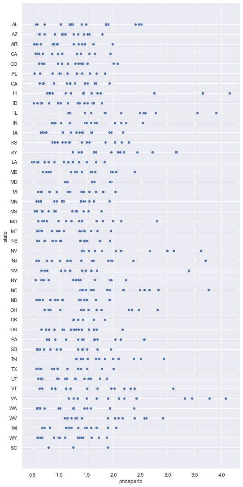

<!--
CO_OP_TRANSLATOR_METADATA:
{
  "original_hash": "b29e427401499e81f4af55a8c4afea76",
  "translation_date": "2025-09-04T18:51:44+00:00",
  "source_file": "3-Data-Visualization/12-visualization-relationships/README.md",
  "language_code": "th"
}
-->
# การแสดงความสัมพันธ์: เรื่องราวของน้ำผึ้ง 🍯

| ](../../sketchnotes/12-Visualizing-Relationships.png)|
|:---:|
|การแสดงความสัมพันธ์ - _สเก็ตโน้ตโดย [@nitya](https://twitter.com/nitya)_ |

ต่อเนื่องจากการวิจัยที่เน้นธรรมชาติ มาค้นพบวิธีการแสดงภาพที่น่าสนใจเพื่อแสดงความสัมพันธ์ระหว่างน้ำผึ้งประเภทต่าง ๆ โดยอ้างอิงจากชุดข้อมูลที่ได้มาจาก [กระทรวงเกษตรแห่งสหรัฐอเมริกา](https://www.nass.usda.gov/About_NASS/index.php)

ชุดข้อมูลนี้มีประมาณ 600 รายการ แสดงการผลิตน้ำผึ้งในหลายรัฐของสหรัฐฯ ตัวอย่างเช่น คุณสามารถดูจำนวนรังผึ้ง ผลผลิตต่อรัง การผลิตรวม สต็อก ราคาเฉลี่ยต่อปอนด์ และมูลค่าของน้ำผึ้งที่ผลิตในแต่ละรัฐตั้งแต่ปี 1998-2012 โดยมีหนึ่งแถวต่อปีสำหรับแต่ละรัฐ

จะน่าสนใจมากหากแสดงภาพความสัมพันธ์ระหว่างการผลิตน้ำผึ้งในแต่ละปีของรัฐหนึ่ง ๆ กับราคาน้ำผึ้งในรัฐนั้น หรืออาจแสดงภาพความสัมพันธ์ระหว่างผลผลิตน้ำผึ้งต่อรังในแต่ละรัฐ ช่วงเวลานี้ครอบคลุมเหตุการณ์ 'CCD' หรือ 'Colony Collapse Disorder' ที่เริ่มปรากฏในปี 2006 (http://npic.orst.edu/envir/ccd.html) ซึ่งทำให้ชุดข้อมูลนี้มีความสำคัญต่อการศึกษา 🐝

## [แบบทดสอบก่อนเรียน](https://purple-hill-04aebfb03.1.azurestaticapps.net/quiz/22)

ในบทเรียนนี้ คุณสามารถใช้ Seaborn ซึ่งคุณเคยใช้มาก่อน เป็นไลบรารีที่ดีในการแสดงภาพความสัมพันธ์ระหว่างตัวแปร โดยเฉพาะอย่างยิ่งการใช้ฟังก์ชัน `relplot` ของ Seaborn ที่ช่วยให้สร้าง scatter plots และ line plots เพื่อแสดง '[ความสัมพันธ์ทางสถิติ](https://seaborn.pydata.org/tutorial/relational.html?highlight=relationships)' ได้อย่างรวดเร็ว ซึ่งช่วยให้นักวิทยาศาสตร์ข้อมูลเข้าใจว่าตัวแปรต่าง ๆ มีความสัมพันธ์กันอย่างไร

## Scatterplots

ใช้ scatterplot เพื่อแสดงว่าราคาน้ำผึ้งเปลี่ยนแปลงไปอย่างไรในแต่ละปีในแต่ละรัฐ Seaborn โดยใช้ `relplot` สามารถจัดกลุ่มข้อมูลของรัฐและแสดงจุดข้อมูลสำหรับทั้งข้อมูลเชิงหมวดหมู่และข้อมูลเชิงตัวเลขได้อย่างสะดวก

เริ่มต้นด้วยการนำเข้าข้อมูลและ Seaborn:

```python
import pandas as pd
import matplotlib.pyplot as plt
import seaborn as sns
honey = pd.read_csv('../../data/honey.csv')
honey.head()
```
คุณจะสังเกตเห็นว่าข้อมูลน้ำผึ้งมีหลายคอลัมน์ที่น่าสนใจ รวมถึงปีและราคาต่อปอนด์ ลองสำรวจข้อมูลนี้โดยจัดกลุ่มตามรัฐในสหรัฐฯ:

| state | numcol | yieldpercol | totalprod | stocks   | priceperlb | prodvalue | year |
| ----- | ------ | ----------- | --------- | -------- | ---------- | --------- | ---- |
| AL    | 16000  | 71          | 1136000   | 159000   | 0.72       | 818000    | 1998 |
| AZ    | 55000  | 60          | 3300000   | 1485000  | 0.64       | 2112000   | 1998 |
| AR    | 53000  | 65          | 3445000   | 1688000  | 0.59       | 2033000   | 1998 |
| CA    | 450000 | 83          | 37350000  | 12326000 | 0.62       | 23157000  | 1998 |
| CO    | 27000  | 72          | 1944000   | 1594000  | 0.7        | 1361000   | 1998 |

สร้าง scatterplot พื้นฐานเพื่อแสดงความสัมพันธ์ระหว่างราคาต่อปอนด์ของน้ำผึ้งกับรัฐที่ผลิตน้ำผึ้ง ตั้งค่าแกน `y` ให้สูงพอที่จะแสดงข้อมูลของทุกรัฐ:

```python
sns.relplot(x="priceperlb", y="state", data=honey, height=15, aspect=.5);
```


ตอนนี้ แสดงข้อมูลเดียวกันด้วยโทนสีของน้ำผึ้งเพื่อแสดงว่าราคาเปลี่ยนแปลงไปอย่างไรในแต่ละปี คุณสามารถทำได้โดยเพิ่มพารามิเตอร์ 'hue' เพื่อแสดงการเปลี่ยนแปลงในแต่ละปี:

> ✅ เรียนรู้เพิ่มเติมเกี่ยวกับ [ชุดสีที่คุณสามารถใช้ใน Seaborn](https://seaborn.pydata.org/tutorial/color_palettes.html) - ลองใช้ชุดสีรุ้งที่สวยงาม!

```python
sns.relplot(x="priceperlb", y="state", hue="year", palette="YlOrBr", data=honey, height=15, aspect=.5);
```


ด้วยการเปลี่ยนโทนสีนี้ คุณจะเห็นได้ชัดเจนว่ามีการเปลี่ยนแปลงอย่างต่อเนื่องในราคาน้ำผึ้งต่อปอนด์ในแต่ละปี หากคุณดูตัวอย่างข้อมูลในชุดข้อมูลเพื่อยืนยัน (เลือกดูรัฐหนึ่ง เช่น รัฐแอริโซนา) คุณจะเห็นรูปแบบของการเพิ่มขึ้นของราคาปีต่อปี โดยมีข้อยกเว้นเล็กน้อย:

| state | numcol | yieldpercol | totalprod | stocks  | priceperlb | prodvalue | year |
| ----- | ------ | ----------- | --------- | ------- | ---------- | --------- | ---- |
| AZ    | 55000  | 60          | 3300000   | 1485000 | 0.64       | 2112000   | 1998 |
| AZ    | 52000  | 62          | 3224000   | 1548000 | 0.62       | 1999000   | 1999 |
| AZ    | 40000  | 59          | 2360000   | 1322000 | 0.73       | 1723000   | 2000 |
| AZ    | 43000  | 59          | 2537000   | 1142000 | 0.72       | 1827000   | 2001 |
| AZ    | 38000  | 63          | 2394000   | 1197000 | 1.08       | 2586000   | 2002 |
| AZ    | 35000  | 72          | 2520000   | 983000  | 1.34       | 3377000   | 2003 |
| AZ    | 32000  | 55          | 1760000   | 774000  | 1.11       | 1954000   | 2004 |
| AZ    | 36000  | 50          | 1800000   | 720000  | 1.04       | 1872000   | 2005 |
| AZ    | 30000  | 65          | 1950000   | 839000  | 0.91       | 1775000   | 2006 |
| AZ    | 30000  | 64          | 1920000   | 902000  | 1.26       | 2419000   | 2007 |
| AZ    | 25000  | 64          | 1600000   | 336000  | 1.26       | 2016000   | 2008 |
| AZ    | 20000  | 52          | 1040000   | 562000  | 1.45       | 1508000   | 2009 |
| AZ    | 24000  | 77          | 1848000   | 665000  | 1.52       | 2809000   | 2010 |
| AZ    | 23000  | 53          | 1219000   | 427000  | 1.55       | 1889000   | 2011 |
| AZ    | 22000  | 46          | 1012000   | 253000  | 1.79       | 1811000   | 2012 |

อีกวิธีหนึ่งในการแสดงภาพการเปลี่ยนแปลงนี้คือการใช้ขนาดแทนสี สำหรับผู้ใช้ที่มีปัญหาด้านการมองเห็นสี วิธีนี้อาจเป็นตัวเลือกที่ดีกว่า แก้ไขการแสดงภาพของคุณเพื่อแสดงการเพิ่มขึ้นของราคาด้วยการเพิ่มขนาดของจุด:

```python
sns.relplot(x="priceperlb", y="state", size="year", data=honey, height=15, aspect=.5);
```
คุณจะเห็นว่าขนาดของจุดเพิ่มขึ้นเรื่อย ๆ


นี่เป็นกรณีง่าย ๆ ของอุปสงค์และอุปทานหรือไม่? เนื่องจากปัจจัยต่าง ๆ เช่น การเปลี่ยนแปลงสภาพภูมิอากาศและการล่มสลายของรังผึ้ง มีน้ำผึ้งน้อยลงสำหรับการซื้อในแต่ละปี และทำให้ราคาสูงขึ้น?

เพื่อค้นหาความสัมพันธ์ระหว่างตัวแปรบางตัวในชุดข้อมูลนี้ ลองสำรวจกราฟเส้นกัน

## กราฟเส้น

คำถาม: มีการเพิ่มขึ้นของราคาน้ำผึ้งต่อปอนด์อย่างชัดเจนในแต่ละปีหรือไม่? คุณสามารถค้นพบสิ่งนี้ได้ง่ายที่สุดโดยการสร้างกราฟเส้นเดียว:

```python
sns.relplot(x="year", y="priceperlb", kind="line", data=honey);
```
คำตอบ: ใช่ โดยมีข้อยกเว้นบางประการในปี 2003:


✅ เนื่องจาก Seaborn กำลังรวบรวมข้อมูลรอบเส้นเดียว มันจะแสดง "การวัดหลายครั้งที่แต่ละค่าของ x โดยการวางค่าเฉลี่ยและช่วงความเชื่อมั่น 95% รอบค่าเฉลี่ย" [แหล่งที่มา](https://seaborn.pydata.org/tutorial/relational.html) พฤติกรรมที่ใช้เวลานานนี้สามารถปิดได้โดยเพิ่ม `ci=None`

คำถาม: ในปี 2003 เราเห็นการเพิ่มขึ้นของปริมาณน้ำผึ้งหรือไม่? หากคุณดูการผลิตรวมในแต่ละปีล่ะ?

```python
sns.relplot(x="year", y="totalprod", kind="line", data=honey);
```


คำตอบ: ไม่จริง หากคุณดูการผลิตรวม ดูเหมือนว่าจะเพิ่มขึ้นในปีนั้น แม้ว่าปริมาณน้ำผึ้งที่ผลิตโดยทั่วไปจะลดลงในช่วงปีเหล่านี้

คำถาม: ในกรณีนั้น อะไรที่อาจทำให้เกิดการเพิ่มขึ้นของราคาน้ำผึ้งในปี 2003?

เพื่อค้นหาสิ่งนี้ คุณสามารถสำรวจ facet grid

## Facet grids

Facet grids ใช้หนึ่ง facet ของชุดข้อมูลของคุณ (ในกรณีนี้ คุณสามารถเลือก 'ปี' เพื่อหลีกเลี่ยงการสร้าง facet มากเกินไป) Seaborn สามารถสร้างกราฟสำหรับแต่ละ facet ของพิกัด x และ y ที่คุณเลือกเพื่อการเปรียบเทียบที่ง่ายขึ้น ปี 2003 โดดเด่นในประเภทการเปรียบเทียบนี้หรือไม่?

สร้าง facet grid โดยใช้ `relplot` ตามที่แนะนำใน [เอกสารของ Seaborn](https://seaborn.pydata.org/generated/seaborn.FacetGrid.html?highlight=facetgrid#seaborn.FacetGrid)

```python
sns.relplot(
    data=honey, 
    x="yieldpercol", y="numcol",
    col="year", 
    col_wrap=3,
    kind="line"
```
ในภาพนี้ คุณสามารถเปรียบเทียบผลผลิตต่อรังและจำนวนรังในแต่ละปี โดยจัดเรียง wrap ที่ 3 สำหรับคอลัมน์:


สำหรับชุดข้อมูลนี้ ไม่มีสิ่งใดที่โดดเด่นเกี่ยวกับจำนวนรังและผลผลิตของพวกมันในแต่ละปีและแต่ละรัฐ มีวิธีอื่นในการค้นหาความสัมพันธ์ระหว่างตัวแปรสองตัวนี้หรือไม่?

## กราฟเส้นคู่

ลองใช้กราฟเส้นหลายเส้นโดยซ้อนกราฟเส้นสองกราฟเข้าด้วยกัน โดยใช้ `despine` ของ Seaborn เพื่อลบ spine ด้านบนและด้านขวา และใช้ `ax.twinx` [ที่มาจาก Matplotlib](https://matplotlib.org/stable/api/_as_gen/matplotlib.axes.Axes.twinx.html) Twinx ช่วยให้กราฟแชร์แกน x และแสดงแกน y สองแกน ดังนั้นแสดงผลผลิตต่อรังและจำนวนรังที่ซ้อนกัน:

```python
fig, ax = plt.subplots(figsize=(12,6))
lineplot = sns.lineplot(x=honey['year'], y=honey['numcol'], data=honey, 
                        label = 'Number of bee colonies', legend=False)
sns.despine()
plt.ylabel('# colonies')
plt.title('Honey Production Year over Year');

ax2 = ax.twinx()
lineplot2 = sns.lineplot(x=honey['year'], y=honey['yieldpercol'], ax=ax2, color="r", 
                         label ='Yield per colony', legend=False) 
sns.despine(right=False)
plt.ylabel('colony yield')
ax.figure.legend();
```


แม้ว่าไม่มีสิ่งใดที่โดดเด่นในสายตาในปี 2003 แต่ก็ช่วยให้เราจบบทเรียนนี้ด้วยโน้ตที่มีความสุขเล็กน้อย: แม้ว่าจำนวนรังจะลดลงโดยรวม แต่จำนวนรังก็เริ่มคงที่ แม้ว่าผลผลิตต่อรังจะลดลง

สู้ต่อไปนะ ผึ้งน้อย!

🐝❤️
## 🚀 ความท้าทาย

ในบทเรียนนี้ คุณได้เรียนรู้เพิ่มเติมเกี่ยวกับการใช้ scatterplots และ line grids รวมถึง facet grids ท้าทายตัวเองในการสร้าง facet grid โดยใช้ชุดข้อมูลอื่น อาจเป็นชุดข้อมูลที่คุณเคยใช้ก่อนหน้านี้ในบทเรียนเหล่านี้ สังเกตว่าต้องใช้เวลานานแค่ไหนในการสร้าง และคุณต้องระมัดระวังเกี่ยวกับจำนวน grid ที่คุณต้องวาดโดยใช้เทคนิคเหล่านี้

## [แบบทดสอบหลังเรียน](https://ff-quizzes.netlify.app/en/ds/)

## ทบทวนและศึกษาด้วยตนเอง

กราฟเส้นสามารถเรียบง่ายหรือซับซ้อนได้ ลองอ่านเพิ่มเติมใน [เอกสารของ Seaborn](https://seaborn.pydata.org/generated/seaborn.lineplot.html) เกี่ยวกับวิธีต่าง ๆ ที่คุณสามารถสร้างกราฟเส้น ลองปรับปรุงกราฟเส้นที่คุณสร้างในบทเรียนนี้ด้วยวิธีอื่น ๆ ที่ระบุไว้ในเอกสาร
## งานที่ได้รับมอบหมาย

[สำรวจรังผึ้ง](assignment.md)

---

**ข้อจำกัดความรับผิดชอบ**:  
เอกสารนี้ได้รับการแปลโดยใช้บริการแปลภาษา AI [Co-op Translator](https://github.com/Azure/co-op-translator) แม้ว่าเราจะพยายามให้การแปลมีความถูกต้อง แต่โปรดทราบว่าการแปลอัตโนมัติอาจมีข้อผิดพลาดหรือความไม่ถูกต้อง เอกสารต้นฉบับในภาษาดั้งเดิมควรถือเป็นแหล่งข้อมูลที่เชื่อถือได้ สำหรับข้อมูลที่สำคัญ ขอแนะนำให้ใช้บริการแปลภาษามืออาชีพ เราไม่รับผิดชอบต่อความเข้าใจผิดหรือการตีความผิดที่เกิดจากการใช้การแปลนี้