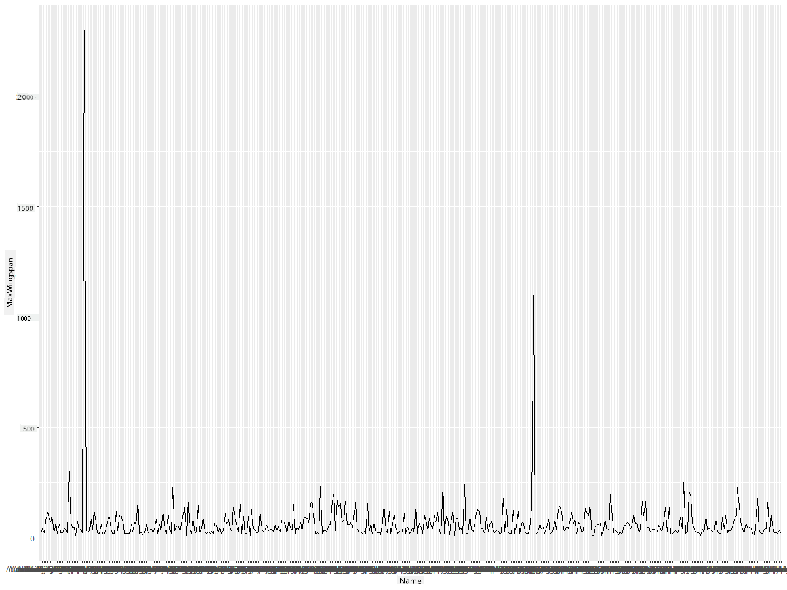
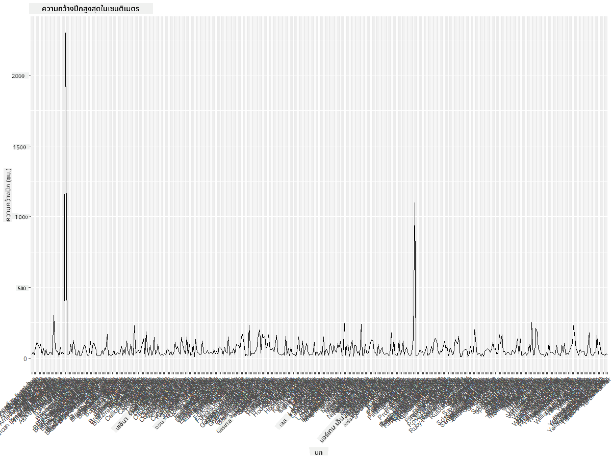
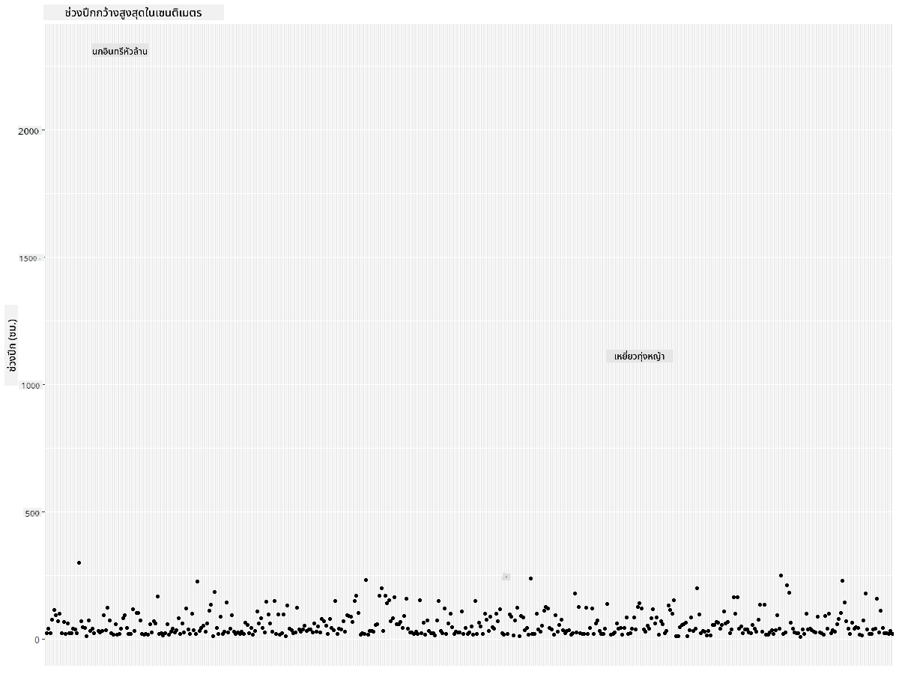
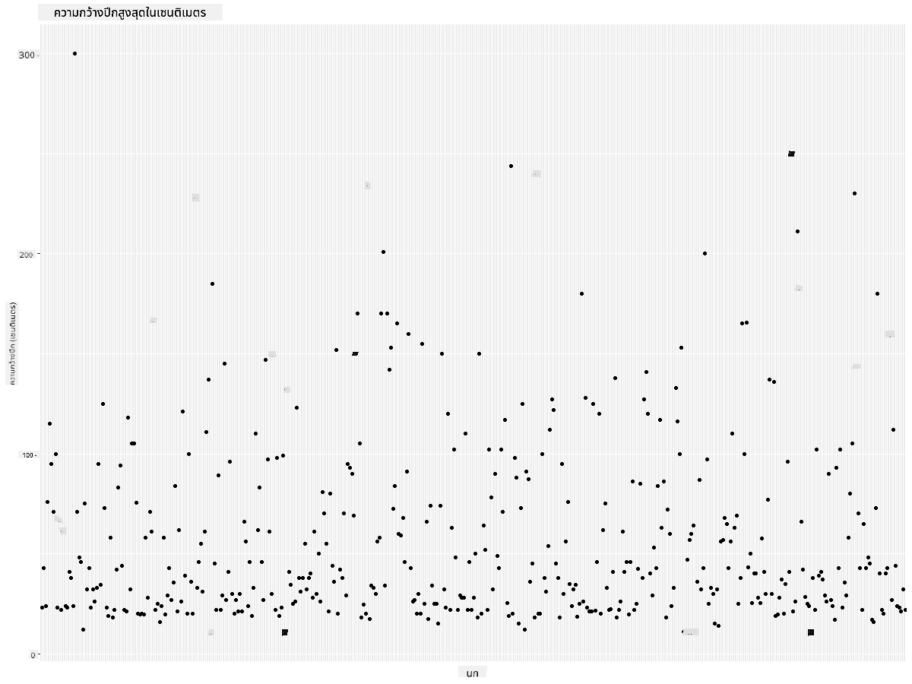
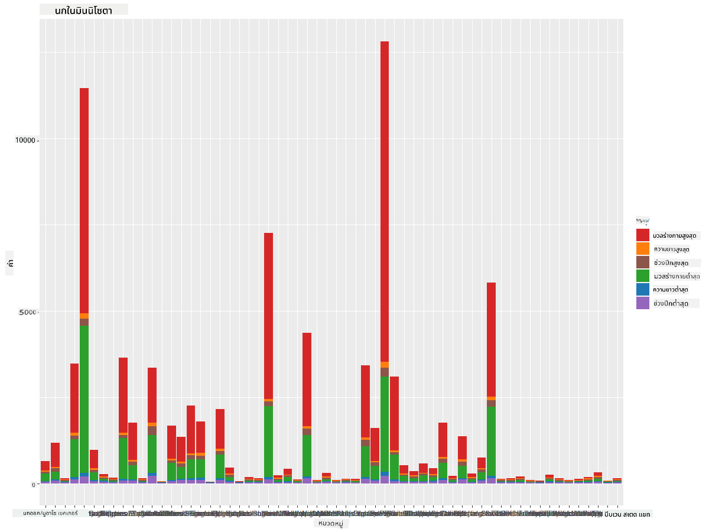
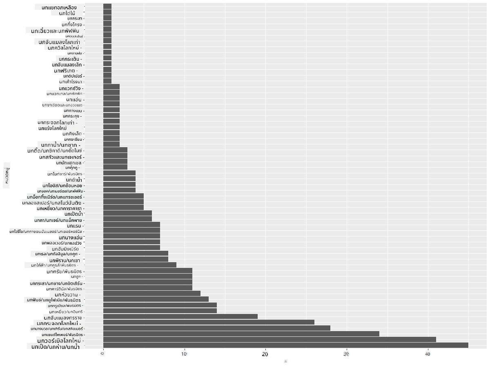
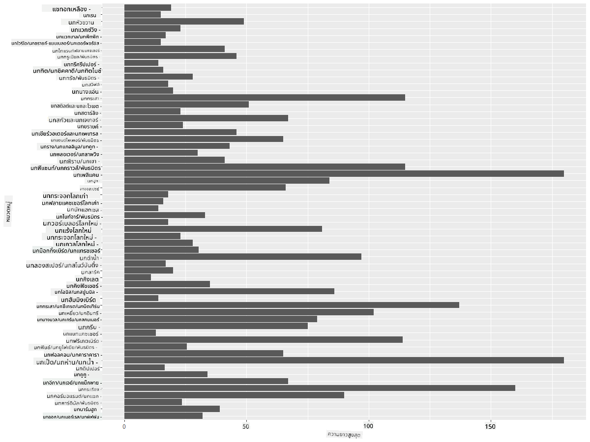
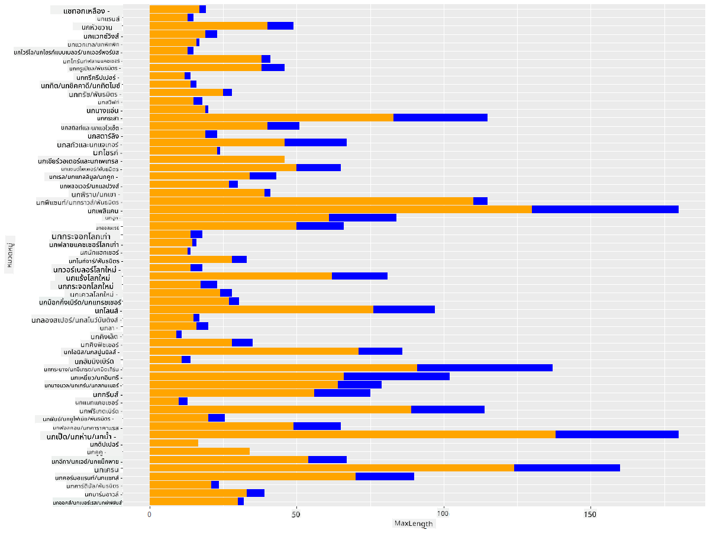

<!--
CO_OP_TRANSLATOR_METADATA:
{
  "original_hash": "22acf28f518a4769ea14fa42f4734b9f",
  "translation_date": "2025-08-26T23:04:53+00:00",
  "source_file": "3-Data-Visualization/R/09-visualization-quantities/README.md",
  "language_code": "th"
}
-->
# การแสดงผลข้อมูลเชิงปริมาณ
| ](https://github.com/microsoft/Data-Science-For-Beginners/blob/main/sketchnotes/09-Visualizing-Quantities.png)|
|:---:|
| การแสดงผลข้อมูลเชิงปริมาณ - _Sketchnote โดย [@nitya](https://twitter.com/nitya)_ |

ในบทเรียนนี้ คุณจะได้เรียนรู้วิธีการใช้ไลบรารี R packages ที่มีอยู่มากมายเพื่อสร้างการแสดงผลที่น่าสนใจเกี่ยวกับแนวคิดของข้อมูลเชิงปริมาณ โดยใช้ชุดข้อมูลที่ถูกทำความสะอาดเกี่ยวกับนกในรัฐมินนิโซตา คุณจะได้เรียนรู้ข้อเท็จจริงที่น่าสนใจมากมายเกี่ยวกับสัตว์ป่าในท้องถิ่น

## [แบบทดสอบก่อนเรียน](https://purple-hill-04aebfb03.1.azurestaticapps.net/quiz/16)

## สังเกตความกว้างของปีกด้วย ggplot2
ไลบรารีที่ยอดเยี่ยมสำหรับการสร้างกราฟและแผนภูมิทั้งแบบง่ายและซับซ้อนคือ [ggplot2](https://cran.r-project.org/web/packages/ggplot2/index.html) โดยทั่วไปแล้ว กระบวนการสร้างกราฟด้วยไลบรารีเหล่านี้ประกอบด้วยการระบุส่วนของ dataframe ที่คุณต้องการวิเคราะห์ การปรับเปลี่ยนข้อมูลตามความจำเป็น การกำหนดค่าของแกน x และ y การเลือกประเภทของกราฟที่จะแสดง และการแสดงผลกราฟนั้น

`ggplot2` เป็นระบบสำหรับการสร้างกราฟิกแบบประกาศ โดยอิงตาม Grammar of Graphics [Grammar of Graphics](https://en.wikipedia.org/wiki/Ggplot2) เป็นโครงร่างทั่วไปสำหรับการแสดงผลข้อมูลที่แบ่งกราฟออกเป็นองค์ประกอบเชิงความหมาย เช่น สเกลและเลเยอร์ กล่าวอีกนัยหนึ่ง ความง่ายในการสร้างกราฟสำหรับข้อมูลแบบ univariate หรือ multivariate ด้วยโค้ดเพียงเล็กน้อยทำให้ `ggplot2` เป็นแพ็กเกจที่ได้รับความนิยมมากที่สุดสำหรับการแสดงผลใน R ผู้ใช้บอก `ggplot2` ว่าจะจับคู่ตัวแปรกับลักษณะกราฟิกอย่างไร และ `ggplot2` จะจัดการส่วนที่เหลือให้

> ✅ กราฟ = ข้อมูล + ลักษณะกราฟิก + รูปทรง
> - ข้อมูล หมายถึงชุดข้อมูล
> - ลักษณะกราฟิก หมายถึงตัวแปรที่ต้องการศึกษา (ตัวแปร x และ y)
> - รูปทรง หมายถึงประเภทของกราฟ (กราฟเส้น กราฟแท่ง ฯลฯ)

เลือกประเภทของกราฟที่เหมาะสมกับข้อมูลของคุณและเรื่องราวที่คุณต้องการเล่าผ่านกราฟ

> - วิเคราะห์แนวโน้ม: กราฟเส้น กราฟแท่ง
> - เปรียบเทียบค่า: กราฟแท่ง กราฟคอลัมน์ กราฟวงกลม กราฟกระจาย
> - แสดงความสัมพันธ์ระหว่างส่วนต่างๆ: กราฟวงกลม
> - แสดงการกระจายของข้อมูล: กราฟกระจาย กราฟแท่ง
> - แสดงความสัมพันธ์ระหว่างค่า: กราฟเส้น กราฟกระจาย กราฟฟอง

✅ คุณสามารถดู [cheatsheet](https://nyu-cdsc.github.io/learningr/assets/data-visualization-2.1.pdf) ที่อธิบาย ggplot2 ได้เพิ่มเติม

## สร้างกราฟเส้นเกี่ยวกับค่าความกว้างของปีกนก

เปิด R console และนำเข้าชุดข้อมูล  
> หมายเหตุ: ชุดข้อมูลถูกเก็บไว้ใน root ของ repo นี้ในโฟลเดอร์ `/data`

นำเข้าชุดข้อมูลและดูหัวข้อ (5 แถวแรก) ของข้อมูล

```r
birds <- read.csv("../../data/birds.csv",fileEncoding="UTF-8-BOM")
head(birds)
```
หัวข้อของข้อมูลมีทั้งข้อความและตัวเลข:

|      | Name                         | ScientificName         | Category              | Order        | Family   | Genus       | ConservationStatus | MinLength | MaxLength | MinBodyMass | MaxBodyMass | MinWingspan | MaxWingspan |
| ---: | :--------------------------- | :--------------------- | :-------------------- | :----------- | :------- | :---------- | :----------------- | --------: | --------: | ----------: | ----------: | ----------: | ----------: |
|    0 | Black-bellied whistling-duck | Dendrocygna autumnalis | Ducks/Geese/Waterfowl | Anseriformes | Anatidae | Dendrocygna | LC                 |        47 |        56 |         652 |        1020 |          76 |          94 |
|    1 | Fulvous whistling-duck       | Dendrocygna bicolor    | Ducks/Geese/Waterfowl | Anseriformes | Anatidae | Dendrocygna | LC                 |        45 |        53 |         712 |        1050 |          85 |          93 |
|    2 | Snow goose                   | Anser caerulescens     | Ducks/Geese/Waterfowl | Anseriformes | Anatidae | Anser       | LC                 |        64 |        79 |        2050 |        4050 |         135 |         165 |
|    3 | Ross's goose                 | Anser rossii           | Ducks/Geese/Waterfowl | Anseriformes | Anatidae | Anser       | LC                 |      57.3 |        64 |        1066 |        1567 |         113 |         116 |
|    4 | Greater white-fronted goose  | Anser albifrons        | Ducks/Geese/Waterfowl | Anseriformes | Anatidae | Anser       | LC                 |        64 |        81 |        1930 |        3310 |         130 |         165 |

เริ่มต้นด้วยการสร้างกราฟเส้นพื้นฐานสำหรับข้อมูลตัวเลข สมมติว่าคุณต้องการดูค่าความกว้างปีกสูงสุดของนกเหล่านี้

```r
install.packages("ggplot2")
library("ggplot2")
ggplot(data=birds, aes(x=Name, y=MaxWingspan,group=1)) +
  geom_line() 
```
ในที่นี้ คุณติดตั้งแพ็กเกจ `ggplot2` และนำเข้ามาใน workspace โดยใช้คำสั่ง `library("ggplot2")` เพื่อสร้างกราฟใน ggplot ใช้ฟังก์ชัน `ggplot()` และระบุชุดข้อมูล ตัวแปร x และ y เป็น attribute ในกรณีนี้ เราใช้ฟังก์ชัน `geom_line()` เนื่องจากเราต้องการสร้างกราฟเส้น



คุณสังเกตเห็นอะไรทันที? ดูเหมือนว่าจะมีค่าผิดปกติอย่างน้อยหนึ่งค่า - นั่นคือความกว้างปีกที่ใหญ่มาก! ความกว้างปีกกว่า 2000 เซนติเมตรเท่ากับมากกว่า 20 เมตร - มี Pterodactyls อยู่ในมินนิโซตาหรือเปล่า? มาสำรวจเพิ่มเติมกันเถอะ

แม้ว่าคุณจะสามารถจัดเรียงข้อมูลใน Excel เพื่อค้นหาค่าผิดปกติได้อย่างรวดเร็ว แต่เราจะดำเนินการต่อจากภายในกราฟ

เพิ่มป้ายกำกับในแกน x เพื่อแสดงว่านกชนิดใดที่กำลังถูกวิเคราะห์:

```r
ggplot(data=birds, aes(x=Name, y=MaxWingspan,group=1)) +
  geom_line() +
  theme(axis.text.x = element_text(angle = 45, hjust=1))+
  xlab("Birds") +
  ylab("Wingspan (CM)") +
  ggtitle("Max Wingspan in Centimeters")
```
เราระบุมุมใน `theme` และระบุป้ายกำกับแกน x และ y ใน `xlab()` และ `ylab()` ตามลำดับ ส่วน `ggtitle()` ให้ชื่อกราฟ/แผนภูมิ



แม้จะหมุนป้ายกำกับเป็น 45 องศา แต่ก็ยังอ่านยากเกินไป ลองใช้กลยุทธ์อื่น: แสดงป้ายกำกับเฉพาะค่าผิดปกติและตั้งป้ายกำกับภายในกราฟ คุณสามารถใช้กราฟกระจายเพื่อเพิ่มพื้นที่สำหรับการติดป้ายกำกับ:

```r
ggplot(data=birds, aes(x=Name, y=MaxWingspan,group=1)) +
  geom_point() +
  geom_text(aes(label=ifelse(MaxWingspan>500,as.character(Name),'')),hjust=0,vjust=0) + 
  theme(axis.title.x=element_blank(), axis.text.x=element_blank(), axis.ticks.x=element_blank())
  ylab("Wingspan (CM)") +
  ggtitle("Max Wingspan in Centimeters") + 
```
เกิดอะไรขึ้นที่นี่? คุณใช้ฟังก์ชัน `geom_point()` เพื่อสร้างจุดกระจาย ด้วยวิธีนี้ คุณเพิ่มป้ายกำกับสำหรับนกที่มี `MaxWingspan > 500` และซ่อนป้ายกำกับบนแกน x เพื่อทำให้กราฟดูสะอาดขึ้น

คุณค้นพบอะไร?



## กรองข้อมูลของคุณ

ทั้ง Bald Eagle และ Prairie Falcon แม้จะเป็นนกที่ใหญ่มาก แต่ดูเหมือนว่าจะมีการระบุค่าผิดพลาด โดยมีการเพิ่มเลข 0 เข้าไปในค่าความกว้างปีกสูงสุด เป็นไปได้ยากที่คุณจะพบ Bald Eagle ที่มีความกว้างปีก 25 เมตร แต่ถ้าเจอ โปรดแจ้งให้เราทราบ! มาสร้าง dataframe ใหม่โดยไม่มีค่าผิดปกติสองค่านี้:

```r
birds_filtered <- subset(birds, MaxWingspan < 500)

ggplot(data=birds_filtered, aes(x=Name, y=MaxWingspan,group=1)) +
  geom_point() +
  ylab("Wingspan (CM)") +
  xlab("Birds") +
  ggtitle("Max Wingspan in Centimeters") + 
  geom_text(aes(label=ifelse(MaxWingspan>500,as.character(Name),'')),hjust=0,vjust=0) +
  theme(axis.text.x=element_blank(), axis.ticks.x=element_blank())
```
เราสร้าง dataframe ใหม่ชื่อ `birds_filtered` และสร้างกราฟกระจายอีกครั้ง โดยการกรองค่าผิดปกติออก ข้อมูลของคุณจะดูสอดคล้องและเข้าใจง่ายขึ้น



ตอนนี้เรามีชุดข้อมูลที่สะอาดขึ้นในแง่ของความกว้างปีก มาค้นพบข้อมูลเพิ่มเติมเกี่ยวกับนกเหล่านี้กัน

แม้ว่ากราฟเส้นและกราฟกระจายสามารถแสดงข้อมูลเกี่ยวกับค่าของข้อมูลและการกระจายของข้อมูลได้ แต่เราต้องการคิดถึงค่าที่มีอยู่ในชุดข้อมูลนี้ คุณสามารถสร้างการแสดงผลเพื่อตอบคำถามเกี่ยวกับข้อมูลเชิงปริมาณ เช่น:

> มีหมวดหมู่นกกี่ประเภท และมีจำนวนเท่าไหร่?
> มีนกที่สูญพันธุ์ ใกล้สูญพันธุ์ หายาก หรือพบได้ทั่วไปกี่ตัว?
> มีนกใน genus และ order ต่างๆ ตามคำศัพท์ของ Linnaeus กี่ตัว?

## สำรวจกราฟแท่ง

กราฟแท่งมีประโยชน์เมื่อคุณต้องการแสดงการจัดกลุ่มของข้อมูล มาสำรวจหมวดหมู่นกที่มีอยู่ในชุดข้อมูลนี้เพื่อดูว่าหมวดหมู่ใดมีจำนวนมากที่สุด

มาสร้างกราฟแท่งจากข้อมูลที่กรองแล้ว

```r
install.packages("dplyr")
install.packages("tidyverse")

library(lubridate)
library(scales)
library(dplyr)
library(ggplot2)
library(tidyverse)

birds_filtered %>% group_by(Category) %>%
  summarise(n=n(),
  MinLength = mean(MinLength),
  MaxLength = mean(MaxLength),
  MinBodyMass = mean(MinBodyMass),
  MaxBodyMass = mean(MaxBodyMass),
  MinWingspan=mean(MinWingspan),
  MaxWingspan=mean(MaxWingspan)) %>% 
  gather("key", "value", - c(Category, n)) %>%
  ggplot(aes(x = Category, y = value, group = key, fill = key)) +
  geom_bar(stat = "identity") +
  scale_fill_manual(values = c("#D62728", "#FF7F0E", "#8C564B","#2CA02C", "#1F77B4", "#9467BD")) +                   
  xlab("Category")+ggtitle("Birds of Minnesota")

```
ในตัวอย่างนี้ เราติดตั้งแพ็กเกจ [dplyr](https://www.rdocumentation.org/packages/dplyr/versions/0.7.8) และ [lubridate](https://www.rdocumentation.org/packages/lubridate/versions/1.8.0) เพื่อช่วยจัดการและจัดกลุ่มข้อมูลเพื่อสร้างกราฟแท่งแบบซ้อนกัน ก่อนอื่น คุณจัดกลุ่มข้อมูลตาม `Category` ของนกและสรุปคอลัมน์ `MinLength`, `MaxLength`, `MinBodyMass`, `MaxBodyMass`, `MinWingspan`, `MaxWingspan` จากนั้นสร้างกราฟแท่งโดยใช้แพ็กเกจ `ggplot2` และระบุสีสำหรับหมวดหมู่ต่างๆ และป้ายกำกับ



อย่างไรก็ตาม กราฟแท่งนี้อ่านยากเนื่องจากมีข้อมูลที่ไม่ได้จัดกลุ่มมากเกินไป คุณต้องเลือกเฉพาะข้อมูลที่คุณต้องการแสดงผล ดังนั้นมาดูความยาวของนกตามหมวดหมู่กัน

กรองข้อมูลของคุณเพื่อรวมเฉพาะหมวดหมู่นก

เนื่องจากมีหลายหมวดหมู่ คุณสามารถแสดงกราฟนี้ในแนวตั้งและปรับความสูงเพื่อรองรับข้อมูลทั้งหมด:

```r
birds_count<-dplyr::count(birds_filtered, Category, sort = TRUE)
birds_count$Category <- factor(birds_count$Category, levels = birds_count$Category)
ggplot(birds_count,aes(Category,n))+geom_bar(stat="identity")+coord_flip()
```
คุณนับค่าที่ไม่ซ้ำกันในคอลัมน์ `Category` และจัดเรียงข้อมูลลงใน dataframe ใหม่ชื่อ `birds_count` ข้อมูลที่จัดเรียงนี้จะถูกจัดระดับในลำดับเดียวกันเพื่อให้แสดงผลในลำดับที่จัดเรียงไว้ จากนั้นใช้ `ggplot2` เพื่อสร้างกราฟแท่ง โดย `coord_flip()` จะสร้างกราฟแท่งแนวนอน



กราฟแท่งนี้แสดงภาพที่ดีเกี่ยวกับจำนวนของนกในแต่ละหมวดหมู่ เพียงแค่ดู คุณจะเห็นว่าจำนวนมากที่สุดของนกในภูมิภาคนี้อยู่ในหมวด Ducks/Geese/Waterfowl มินนิโซตาเป็น 'ดินแดนแห่งทะเลสาบ 10,000 แห่ง' ดังนั้นจึงไม่น่าแปลกใจ!

✅ ลองนับข้อมูลอื่นๆ ในชุดข้อมูลนี้ มีอะไรที่ทำให้คุณประหลาดใจหรือไม่?

## การเปรียบเทียบข้อมูล

คุณสามารถลองเปรียบเทียบข้อมูลที่จัดกลุ่มโดยสร้างแกนใหม่ ลองเปรียบเทียบค่าความยาวสูงสุดของนกตามหมวดหมู่:

```r
birds_grouped <- birds_filtered %>%
  group_by(Category) %>%
  summarise(
  MaxLength = max(MaxLength, na.rm = T),
  MinLength = max(MinLength, na.rm = T)
           ) %>%
  arrange(Category)
  
ggplot(birds_grouped,aes(Category,MaxLength))+geom_bar(stat="identity")+coord_flip()
```
เราจัดกลุ่มข้อมูล `birds_filtered` ตาม `Category` และสร้างกราฟแท่ง



ไม่มีอะไรน่าแปลกใจที่นี่: นกฮัมมิงเบิร์ดมีค่าความยาวสูงสุดน้อยที่สุดเมื่อเทียบกับนกกระทุงหรือนกห่าน ข้อมูลที่มีเหตุผลเป็นสิ่งที่ดี!

คุณสามารถสร้างการแสดงผลที่น่าสนใจมากขึ้นของกราฟแท่งโดยการซ้อนข้อมูล ลองซ้อนค่าความยาวขั้นต่ำและสูงสุดในหมวดหมู่นก:

```r
ggplot(data=birds_grouped, aes(x=Category)) +
  geom_bar(aes(y=MaxLength), stat="identity", position ="identity",  fill='blue') +
  geom_bar(aes(y=MinLength), stat="identity", position="identity", fill='orange')+
  coord_flip()
```


## 🚀 ความท้าทาย

ชุดข้อมูลนกนี้มีข้อมูลมากมายเกี่ยวกับนกประเภทต่างๆ ในระบบนิเวศเฉพาะ ลองค้นหาชุดข้อมูลเกี่ยวกับนกอื่นๆ บนอินเทอร์เน็ต และฝึกสร้างกราฟและแผนภูมิรอบๆ นกเหล่านี้เพื่อค้นพบข้อเท็จจริงที่คุณไม่เคยรู้มาก่อน

## [แบบทดสอบหลังเรียน](https://purple-hill-04aebfb03.1.azurestaticapps.net/quiz/17)

## ทบทวนและศึกษาด้วยตนเอง

บทเรียนแรกนี้ได้ให้ข้อมูลเกี่ยวกับวิธีการใช้ `ggplot2` เพื่อแสดงผลข้อมูลเชิงปริมาณ ลองค้นคว้าวิธีอื่นๆ ในการทำงานกับชุดข้อมูลเพื่อการแสดงผล ค้นคว้าและมองหาชุดข้อมูลที่คุณสามารถแสดงผลโดยใช้แพ็กเกจอื่นๆ เช่น [Lattice](https://stat.ethz.ch/R-manual/R-devel/library/lattice/html/Lattice.html) และ [Plotly](https://github.com/plotly/plotly.R#readme)

## งานที่ได้รับมอบหมาย
[Lines, Scatters, and Bars](assignment.md)

---

**ข้อจำกัดความรับผิดชอบ**:  
เอกสารนี้ได้รับการแปลโดยใช้บริการแปลภาษา AI [Co-op Translator](https://github.com/Azure/co-op-translator) แม้ว่าเราจะพยายามอย่างเต็มที่เพื่อความถูกต้อง แต่โปรดทราบว่าการแปลอัตโนมัติอาจมีข้อผิดพลาดหรือความไม่ถูกต้อง เอกสารต้นฉบับในภาษาต้นทางควรถือเป็นแหล่งข้อมูลที่เชื่อถือได้ สำหรับข้อมูลที่สำคัญ แนะนำให้ใช้บริการแปลภาษามนุษย์ที่เป็นมืออาชีพ เราไม่รับผิดชอบต่อความเข้าใจผิดหรือการตีความที่ผิดพลาดซึ่งเกิดจากการใช้การแปลนี้