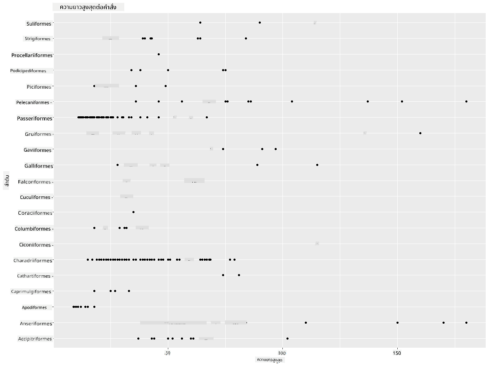
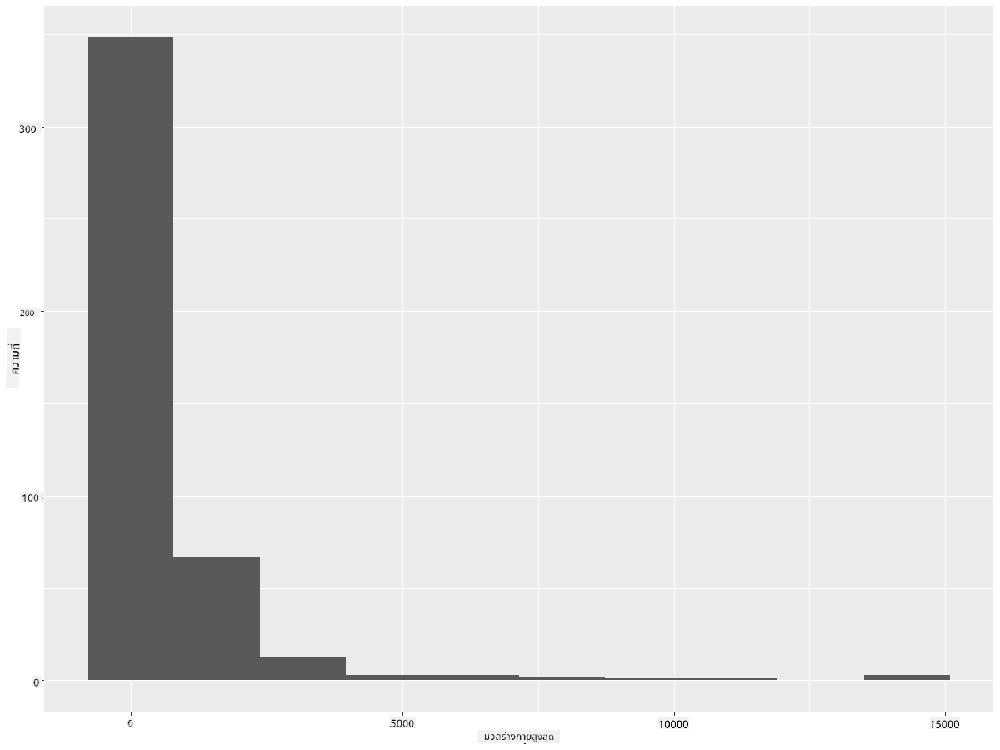
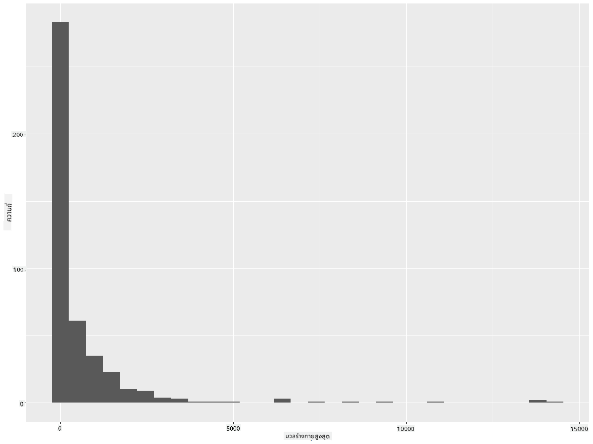
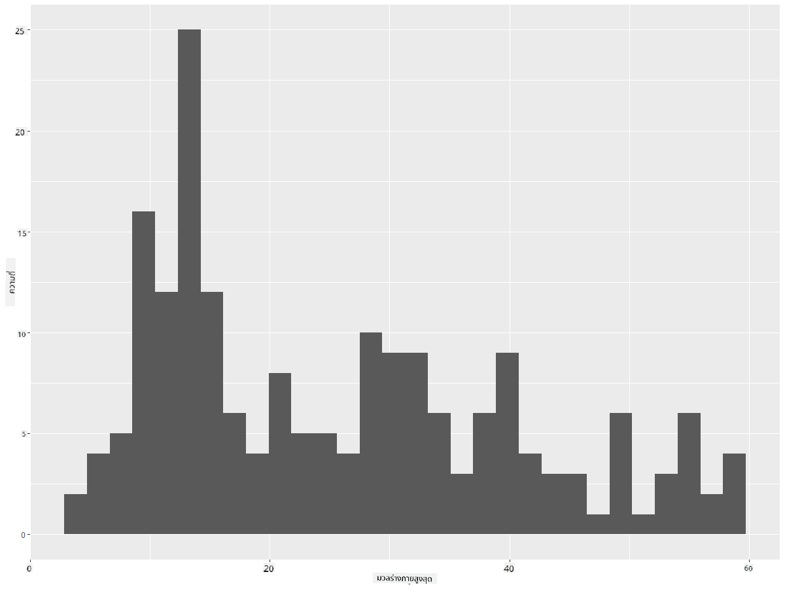
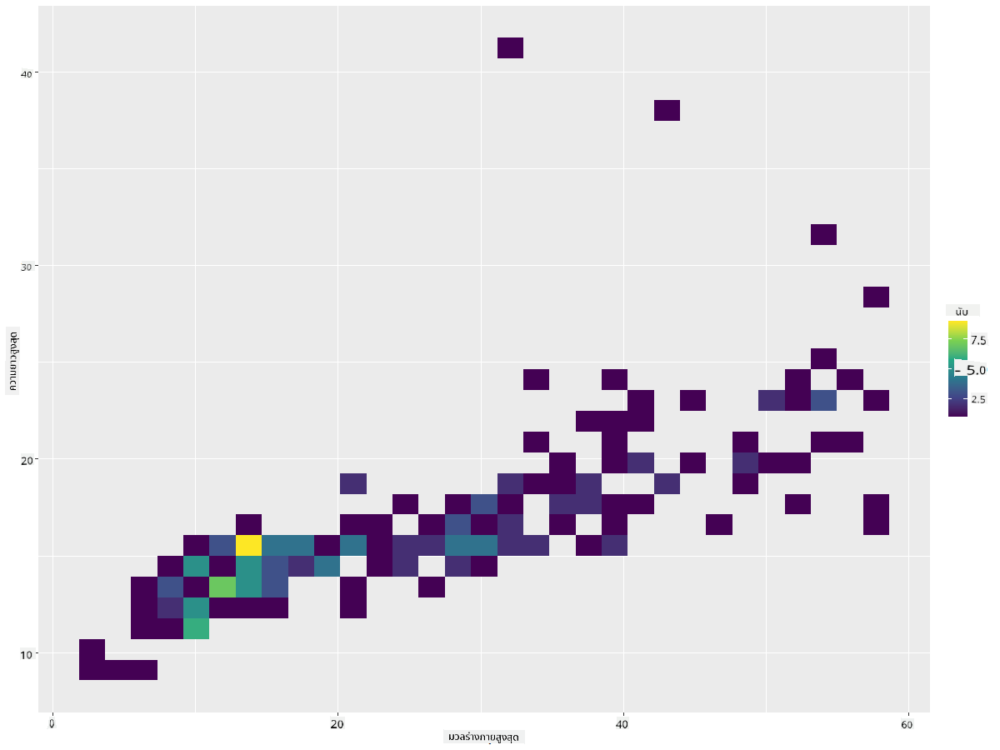
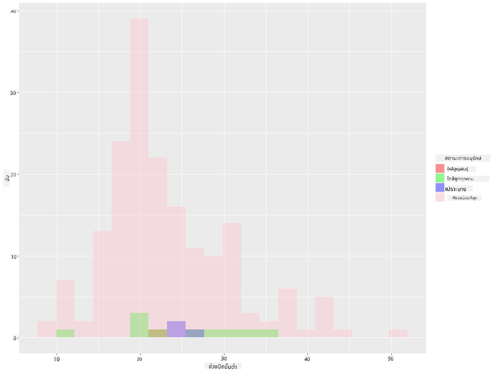
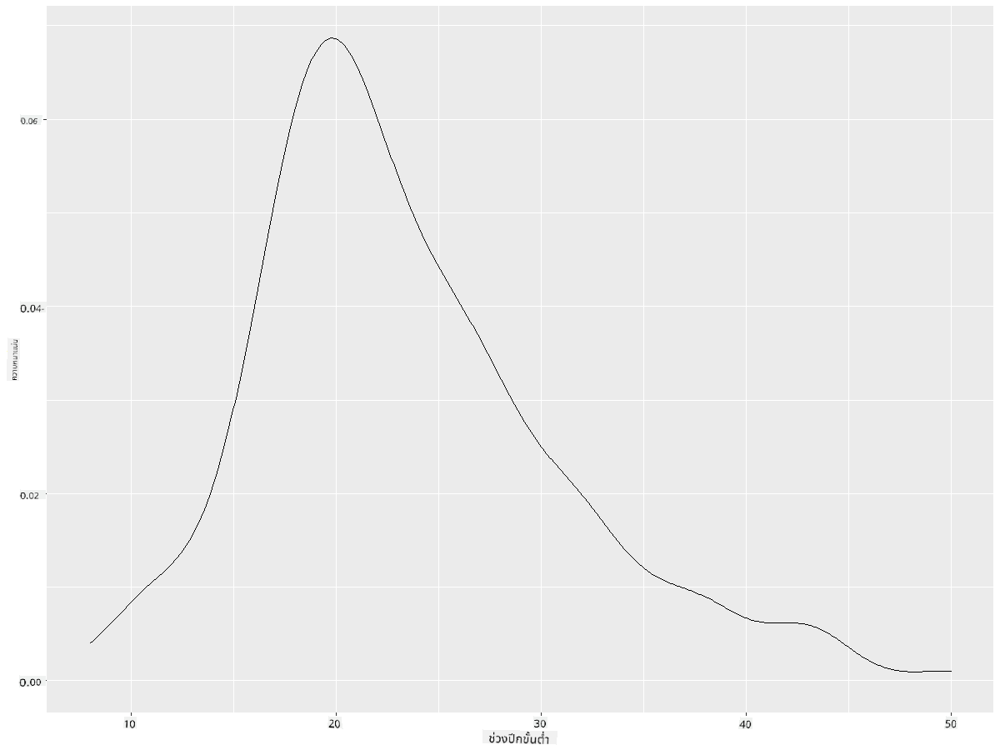
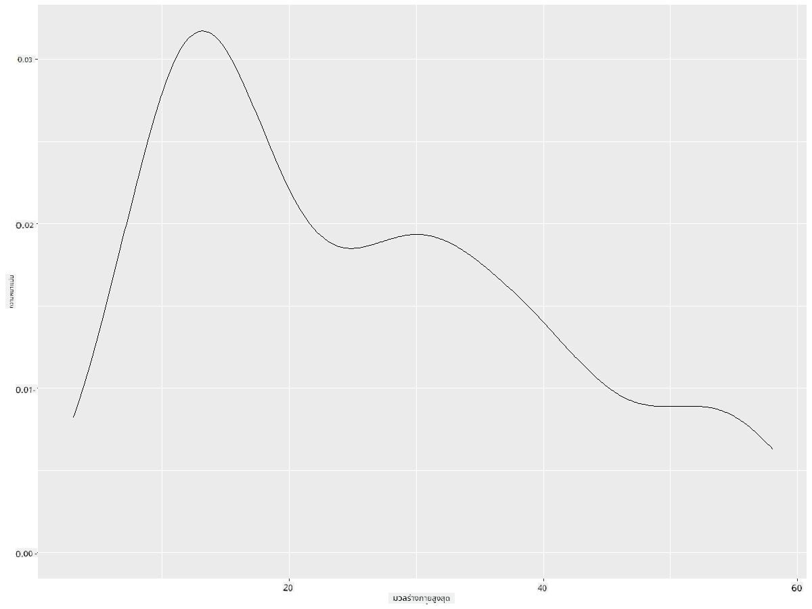
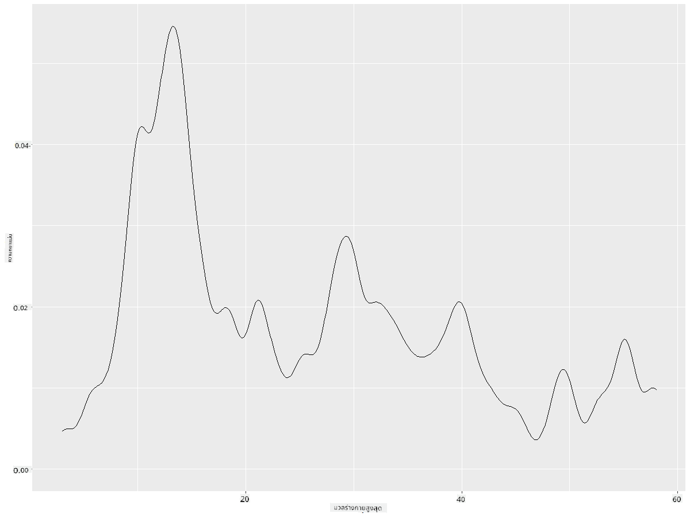
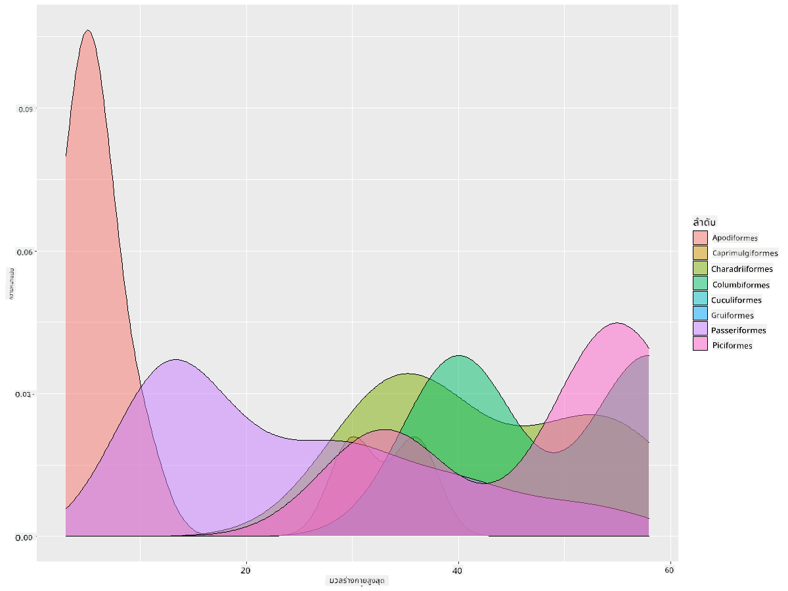

<!--
CO_OP_TRANSLATOR_METADATA:
{
  "original_hash": "ea67c0c40808fd723594de6896c37ccf",
  "translation_date": "2025-08-26T22:56:32+00:00",
  "source_file": "3-Data-Visualization/R/10-visualization-distributions/README.md",
  "language_code": "th"
}
-->
# การแสดงภาพการกระจายตัวของข้อมูล

| ](https://github.com/microsoft/Data-Science-For-Beginners/blob/main/sketchnotes/10-Visualizing-Distributions.png)|
|:---:|
| การแสดงภาพการกระจายตัวของข้อมูล - _Sketchnote โดย [@nitya](https://twitter.com/nitya)_ |

ในบทเรียนก่อนหน้านี้ คุณได้เรียนรู้ข้อเท็จจริงที่น่าสนใจเกี่ยวกับชุดข้อมูลเกี่ยวกับนกในรัฐมินนิโซตา คุณพบข้อมูลที่ผิดพลาดโดยการแสดงภาพค่าผิดปกติ และได้ดูความแตกต่างระหว่างหมวดหมู่นกโดยพิจารณาจากความยาวสูงสุด

## [แบบทดสอบก่อนเรียน](https://purple-hill-04aebfb03.1.azurestaticapps.net/quiz/18)
## สำรวจชุดข้อมูลนก

อีกวิธีหนึ่งในการเจาะลึกข้อมูลคือการดูการกระจายตัวของข้อมูล หรือวิธีที่ข้อมูลถูกจัดเรียงตามแกน ตัวอย่างเช่น คุณอาจต้องการเรียนรู้เกี่ยวกับการกระจายตัวทั่วไปของความกว้างปีกสูงสุดหรือมวลร่างกายสูงสุดของนกในรัฐมินนิโซตาในชุดข้อมูลนี้

มาค้นหาข้อเท็จจริงบางอย่างเกี่ยวกับการกระจายตัวของข้อมูลในชุดข้อมูลนี้กัน ใน R console ของคุณ ให้นำเข้า `ggplot2` และฐานข้อมูล ลบค่าผิดปกติออกจากฐานข้อมูลเหมือนที่คุณทำในหัวข้อก่อนหน้า

```r
library(ggplot2)

birds <- read.csv("../../data/birds.csv",fileEncoding="UTF-8-BOM")

birds_filtered <- subset(birds, MaxWingspan < 500)
head(birds_filtered)
```
|      | ชื่อ                          | ชื่อวิทยาศาสตร์         | หมวดหมู่              | ลำดับ        | วงศ์     | สกุล       | สถานะการอนุรักษ์ | ความยาวต่ำสุด | ความยาวสูงสุด | มวลร่างกายต่ำสุด | มวลร่างกายสูงสุด | ความกว้างปีกต่ำสุด | ความกว้างปีกสูงสุด |
| ---: | :--------------------------- | :--------------------- | :-------------------- | :----------- | :------- | :---------- | :----------------- | --------: | --------: | ----------: | ----------: | ----------: | ----------: |
|    0 | เป็ดหวีดท้องดำ               | Dendrocygna autumnalis | เป็ด/ห่าน/นกน้ำ       | Anseriformes | Anatidae | Dendrocygna | LC                 |        47 |        56 |         652 |        1020 |          76 |          94 |
|    1 | เป็ดหวีดสีน้ำตาล             | Dendrocygna bicolor    | เป็ด/ห่าน/นกน้ำ       | Anseriformes | Anatidae | Dendrocygna | LC                 |        45 |        53 |         712 |        1050 |          85 |          93 |
|    2 | ห่านหิมะ                     | Anser caerulescens     | เป็ด/ห่าน/นกน้ำ       | Anseriformes | Anatidae | Anser       | LC                 |        64 |        79 |        2050 |        4050 |         135 |         165 |
|    3 | ห่านรอสส์                   | Anser rossii           | เป็ด/ห่าน/นกน้ำ       | Anseriformes | Anatidae | Anser       | LC                 |      57.3 |        64 |        1066 |        1567 |         113 |         116 |
|    4 | ห่านหน้าขาวใหญ่              | Anser albifrons        | เป็ด/ห่าน/นกน้ำ       | Anseriformes | Anatidae | Anser       | LC                 |        64 |        81 |        1930 |        3310 |         130 |         165 |

โดยทั่วไป คุณสามารถดูการกระจายตัวของข้อมูลได้อย่างรวดเร็วโดยใช้แผนภาพกระจาย (scatter plot) เหมือนที่เราได้ทำในบทเรียนก่อนหน้า:

```r
ggplot(data=birds_filtered, aes(x=Order, y=MaxLength,group=1)) +
  geom_point() +
  ggtitle("Max Length per order") + coord_flip()
```


นี่เป็นภาพรวมของการกระจายตัวทั่วไปของความยาวร่างกายต่ออันดับของนก แต่ไม่ใช่วิธีที่เหมาะสมที่สุดในการแสดงการกระจายตัวที่แท้จริง งานนี้มักจะทำโดยการสร้างฮิสโตแกรม (Histogram)

## การทำงานกับฮิสโตแกรม

`ggplot2` มีวิธีที่ดีมากในการแสดงการกระจายตัวของข้อมูลโดยใช้ฮิสโตแกรม แผนภูมิประเภทนี้คล้ายกับแผนภูมิแท่งที่การกระจายตัวสามารถมองเห็นได้ผ่านการเพิ่มขึ้นและลดลงของแท่งข้อมูล ในการสร้างฮิสโตแกรม คุณต้องมีข้อมูลเชิงตัวเลข ในการสร้างฮิสโตแกรม คุณสามารถสร้างแผนภูมิโดยกำหนดชนิดเป็น 'hist' สำหรับฮิสโตแกรม แผนภูมินี้แสดงการกระจายตัวของ MaxBodyMass สำหรับช่วงข้อมูลเชิงตัวเลขทั้งหมดในชุดข้อมูล โดยการแบ่งข้อมูลออกเป็นกลุ่มย่อย (bins) จะสามารถแสดงการกระจายตัวของค่าข้อมูลได้:

```r
ggplot(data = birds_filtered, aes(x = MaxBodyMass)) + 
  geom_histogram(bins=10)+ylab('Frequency')
```


ดังที่คุณเห็น นกส่วนใหญ่ในชุดข้อมูลกว่า 400 ตัวนี้มีมวลร่างกายสูงสุดต่ำกว่า 2000 ลองเปลี่ยนพารามิเตอร์ `bins` เป็นค่าที่สูงขึ้น เช่น 30 เพื่อดูข้อมูลเพิ่มเติม:

```r
ggplot(data = birds_filtered, aes(x = MaxBodyMass)) + geom_histogram(bins=30)+ylab('Frequency')
```



แผนภูมินี้แสดงการกระจายตัวในลักษณะที่ละเอียดขึ้นเล็กน้อย คุณสามารถสร้างแผนภูมิที่ไม่เอนเอียงไปทางซ้ายมากเกินไปได้โดยการเลือกข้อมูลเฉพาะในช่วงที่กำหนด:

กรองข้อมูลของคุณเพื่อเลือกเฉพาะนกที่มีมวลร่างกายต่ำกว่า 60 และแสดง 30 `bins`:

```r
birds_filtered_1 <- subset(birds_filtered, MaxBodyMass > 1 & MaxBodyMass < 60)
ggplot(data = birds_filtered_1, aes(x = MaxBodyMass)) + 
  geom_histogram(bins=30)+ylab('Frequency')
```



✅ ลองใช้ตัวกรองและจุดข้อมูลอื่น ๆ เพื่อดูการกระจายตัวของข้อมูลทั้งหมด ลบตัวกรอง `['MaxBodyMass']` เพื่อแสดงการกระจายตัวที่มีป้ายกำกับ

ฮิสโตแกรมยังมีการปรับปรุงสีและการติดป้ายกำกับที่น่าสนใจให้ลองใช้ด้วย:

สร้างฮิสโตแกรม 2 มิติ เพื่อเปรียบเทียบความสัมพันธ์ระหว่างการกระจายตัวสองแบบ ลองเปรียบเทียบ `MaxBodyMass` กับ `MaxLength` `ggplot2` มีวิธีในตัวเพื่อแสดงจุดที่ค่ามาบรรจบกันโดยใช้สีที่สว่างขึ้น:

```r
ggplot(data=birds_filtered_1, aes(x=MaxBodyMass, y=MaxLength) ) +
  geom_bin2d() +scale_fill_continuous(type = "viridis")
```
ดูเหมือนว่าจะมีความสัมพันธ์ที่คาดหวังระหว่างสององค์ประกอบนี้ตามแกนที่คาดไว้ โดยมีจุดบรรจบที่แข็งแกร่งจุดหนึ่ง:



ฮิสโตแกรมทำงานได้ดีโดยค่าเริ่มต้นสำหรับข้อมูลเชิงตัวเลข แล้วถ้าคุณต้องการดูการกระจายตัวตามข้อมูลข้อความล่ะ?
## สำรวจชุดข้อมูลเพื่อดูการกระจายตัวโดยใช้ข้อมูลข้อความ

ชุดข้อมูลนี้ยังมีข้อมูลที่ดีเกี่ยวกับหมวดหมู่นก สกุล สปีชีส์ และวงศ์ รวมถึงสถานะการอนุรักษ์ มาสำรวจข้อมูลการอนุรักษ์นี้กัน การกระจายตัวของนกตามสถานะการอนุรักษ์เป็นอย่างไร?

> ✅ ในชุดข้อมูลนี้ มีการใช้อักษรย่อหลายตัวเพื่ออธิบายสถานะการอนุรักษ์ อักษรย่อเหล่านี้มาจาก [IUCN Red List Categories](https://www.iucnredlist.org/) ซึ่งเป็นองค์กรที่จัดทำรายการสถานะของสปีชีส์
> 
> - CR: ใกล้สูญพันธุ์อย่างยิ่ง
> - EN: ใกล้สูญพันธุ์
> - EX: สูญพันธุ์
> - LC: ความกังวลน้อยที่สุด
> - NT: ใกล้ถูกคุกคาม
> - VU: มีความเสี่ยง

ค่าพวกนี้เป็นค่าข้อความ ดังนั้นคุณจะต้องทำการแปลงเพื่อสร้างฮิสโตแกรม โดยใช้ dataframe ที่กรองแล้ว แสดงสถานะการอนุรักษ์ควบคู่ไปกับความกว้างปีกต่ำสุด คุณเห็นอะไรบ้าง?

```r
birds_filtered_1$ConservationStatus[birds_filtered_1$ConservationStatus == 'EX'] <- 'x1' 
birds_filtered_1$ConservationStatus[birds_filtered_1$ConservationStatus == 'CR'] <- 'x2'
birds_filtered_1$ConservationStatus[birds_filtered_1$ConservationStatus == 'EN'] <- 'x3'
birds_filtered_1$ConservationStatus[birds_filtered_1$ConservationStatus == 'NT'] <- 'x4'
birds_filtered_1$ConservationStatus[birds_filtered_1$ConservationStatus == 'VU'] <- 'x5'
birds_filtered_1$ConservationStatus[birds_filtered_1$ConservationStatus == 'LC'] <- 'x6'

ggplot(data=birds_filtered_1, aes(x = MinWingspan, fill = ConservationStatus)) +
  geom_histogram(position = "identity", alpha = 0.4, bins = 20) +
  scale_fill_manual(name="Conservation Status",values=c("red","green","blue","pink"),labels=c("Endangered","Near Threathened","Vulnerable","Least Concern"))
```



ดูเหมือนว่าจะไม่มีความสัมพันธ์ที่ดีระหว่างความกว้างปีกต่ำสุดและสถานะการอนุรักษ์ ลองทดสอบองค์ประกอบอื่น ๆ ในชุดข้อมูลโดยใช้วิธีนี้ คุณสามารถลองใช้ตัวกรองที่แตกต่างกันได้ คุณพบความสัมพันธ์ใดหรือไม่?

## แผนภูมิความหนาแน่น

คุณอาจสังเกตเห็นว่าฮิสโตแกรมที่เราดูจนถึงตอนนี้มีลักษณะเป็น 'ขั้นบันได' และไม่ได้ไหลอย่างราบรื่นในลักษณะโค้ง หากต้องการแสดงแผนภูมิความหนาแน่นที่ราบรื่นขึ้น คุณสามารถลองใช้แผนภูมิความหนาแน่นได้

มาลองทำงานกับแผนภูมิความหนาแน่นกันเถอะ!

```r
ggplot(data = birds_filtered_1, aes(x = MinWingspan)) + 
  geom_density()
```


คุณจะเห็นว่าแผนภูมินี้สะท้อนแผนภูมิก่อนหน้านี้สำหรับข้อมูลความกว้างปีกต่ำสุด เพียงแต่ดูราบรื่นขึ้นเล็กน้อย หากคุณต้องการแก้ไขเส้นที่ไม่ราบรื่นของ MaxBodyMass ในแผนภูมิที่สองที่คุณสร้าง คุณสามารถทำให้มันราบรื่นได้ดีมากโดยสร้างใหม่ด้วยวิธีนี้:

```r
ggplot(data = birds_filtered_1, aes(x = MaxBodyMass)) + 
  geom_density()
```


หากคุณต้องการเส้นที่ราบรื่น แต่ไม่ราบรื่นเกินไป ให้แก้ไขพารามิเตอร์ `adjust`:

```r
ggplot(data = birds_filtered_1, aes(x = MaxBodyMass)) + 
  geom_density(adjust = 1/5)
```


✅ อ่านเกี่ยวกับพารามิเตอร์ที่มีให้สำหรับแผนภูมิประเภทนี้และทดลองใช้!

แผนภูมิประเภทนี้ให้การแสดงภาพที่อธิบายได้อย่างสวยงาม ด้วยโค้ดเพียงไม่กี่บรรทัด ตัวอย่างเช่น คุณสามารถแสดงความหนาแน่นของมวลร่างกายสูงสุดต่ออันดับของนก:

```r
ggplot(data=birds_filtered_1,aes(x = MaxBodyMass, fill = Order)) +
  geom_density(alpha=0.5)
```


## 🚀 ความท้าทาย

ฮิสโตแกรมเป็นแผนภูมิที่ซับซ้อนกว่าการกระจายจุด แผนภูมิแท่ง หรือแผนภูมิเส้นแบบพื้นฐาน ลองค้นหาตัวอย่างการใช้ฮิสโตแกรมที่ดีบนอินเทอร์เน็ต พวกมันถูกใช้อย่างไร แสดงอะไร และมักถูกใช้ในสาขาหรือพื้นที่ใด?

## [แบบทดสอบหลังเรียน](https://purple-hill-04aebfb03.1.azurestaticapps.net/quiz/19)

## ทบทวนและศึกษาด้วยตนเอง

ในบทเรียนนี้ คุณได้ใช้ `ggplot2` และเริ่มทำงานเพื่อแสดงแผนภูมิที่ซับซ้อนมากขึ้น ลองค้นคว้าเกี่ยวกับ `geom_density_2d()` ซึ่งเป็น "เส้นโค้งความหนาแน่นของความน่าจะเป็นต่อเนื่องในหนึ่งหรือหลายมิติ" อ่าน [เอกสารประกอบ](https://ggplot2.tidyverse.org/reference/geom_density_2d.html) เพื่อทำความเข้าใจว่ามันทำงานอย่างไร

## งานที่ได้รับมอบหมาย

[ใช้ทักษะของคุณ](assignment.md)

---

**ข้อจำกัดความรับผิดชอบ**:  
เอกสารนี้ได้รับการแปลโดยใช้บริการแปลภาษา AI [Co-op Translator](https://github.com/Azure/co-op-translator) แม้ว่าเราจะพยายามให้การแปลมีความถูกต้องมากที่สุด แต่โปรดทราบว่าการแปลโดยอัตโนมัติอาจมีข้อผิดพลาดหรือความไม่ถูกต้อง เอกสารต้นฉบับในภาษาดั้งเดิมควรถือเป็นแหล่งข้อมูลที่เชื่อถือได้ สำหรับข้อมูลที่สำคัญ ขอแนะนำให้ใช้บริการแปลภาษามืออาชีพ เราไม่รับผิดชอบต่อความเข้าใจผิดหรือการตีความผิดที่เกิดจากการใช้การแปลนี้