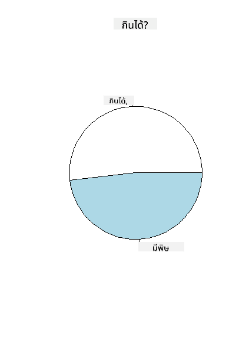
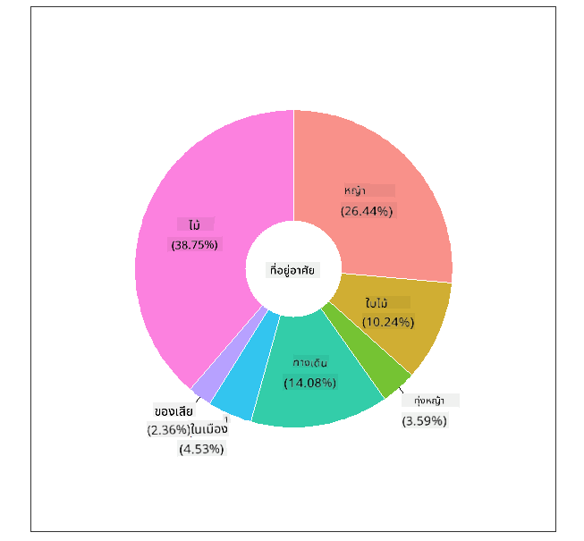
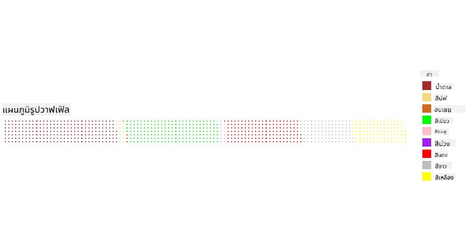

<!--
CO_OP_TRANSLATOR_METADATA:
{
  "original_hash": "47028abaaafa2bcb1079702d20569066",
  "translation_date": "2025-08-26T23:13:53+00:00",
  "source_file": "3-Data-Visualization/R/11-visualization-proportions/README.md",
  "language_code": "th"
}
-->
# การแสดงสัดส่วนข้อมูล

|](../../../sketchnotes/11-Visualizing-Proportions.png)|
|:---:|
|การแสดงสัดส่วนข้อมูล - _ภาพสเก็ตช์โดย [@nitya](https://twitter.com/nitya)_ |

ในบทเรียนนี้ คุณจะใช้ชุดข้อมูลที่เกี่ยวกับธรรมชาติในการแสดงสัดส่วน เช่น จำนวนชนิดของเห็ดที่ปรากฏในชุดข้อมูลเกี่ยวกับเห็ด ลองสำรวจเห็ดที่น่าสนใจเหล่านี้ผ่านชุดข้อมูลที่มาจาก Audubon ซึ่งมีรายละเอียดเกี่ยวกับเห็ดมีครีบ 23 สายพันธุ์ในตระกูล Agaricus และ Lepiota คุณจะได้ทดลองสร้างภาพข้อมูลที่น่าสนใจ เช่น:

- แผนภูมิวงกลม 🥧
- แผนภูมิโดนัท 🍩
- แผนภูมิแบบวาฟเฟิล 🧇

> 💡 โครงการที่น่าสนใจมากชื่อ [Charticulator](https://charticulator.com) โดย Microsoft Research มีอินเทอร์เฟซแบบลากและวางสำหรับการสร้างภาพข้อมูลฟรี ในหนึ่งในบทเรียนของพวกเขา พวกเขาใช้ชุดข้อมูลเห็ดนี้ด้วย! ดังนั้นคุณสามารถสำรวจข้อมูลและเรียนรู้ไลบรารีไปพร้อมกัน: [บทเรียน Charticulator](https://charticulator.com/tutorials/tutorial4.html)

## [แบบทดสอบก่อนเรียน](https://purple-hill-04aebfb03.1.azurestaticapps.net/quiz/20)

## ทำความรู้จักกับเห็ดของคุณ 🍄

เห็ดเป็นสิ่งที่น่าสนใจมาก ลองนำเข้าชุดข้อมูลเพื่อศึกษาพวกมัน:

```r
mushrooms = read.csv('../../data/mushrooms.csv')
head(mushrooms)
```
ตารางจะถูกพิมพ์ออกมาพร้อมข้อมูลที่ยอดเยี่ยมสำหรับการวิเคราะห์:


| class     | cap-shape | cap-surface | cap-color | bruises | odor    | gill-attachment | gill-spacing | gill-size | gill-color | stalk-shape | stalk-root | stalk-surface-above-ring | stalk-surface-below-ring | stalk-color-above-ring | stalk-color-below-ring | veil-type | veil-color | ring-number | ring-type | spore-print-color | population | habitat |
| --------- | --------- | ----------- | --------- | ------- | ------- | --------------- | ------------ | --------- | ---------- | ----------- | ---------- | ------------------------ | ------------------------ | ---------------------- | ---------------------- | --------- | ---------- | ----------- | --------- | ----------------- | ---------- | ------- |
| Poisonous | Convex    | Smooth      | Brown     | Bruises | Pungent | Free            | Close        | Narrow    | Black      | Enlarging   | Equal      | Smooth                   | Smooth                   | White                  | White                  | Partial   | White      | One         | Pendant   | Black             | Scattered  | Urban   |
| Edible    | Convex    | Smooth      | Yellow    | Bruises | Almond  | Free            | Close        | Broad     | Black      | Enlarging   | Club       | Smooth                   | Smooth                   | White                  | White                  | Partial   | White      | One         | Pendant   | Brown             | Numerous   | Grasses |
| Edible    | Bell      | Smooth      | White     | Bruises | Anise   | Free            | Close        | Broad     | Brown      | Enlarging   | Club       | Smooth                   | Smooth                   | White                  | White                  | Partial   | White      | One         | Pendant   | Brown             | Numerous   | Meadows |
| Poisonous | Convex    | Scaly       | White     | Bruises | Pungent | Free            | Close        | Narrow    | Brown      | Enlarging   | Equal      | Smooth                   | Smooth                   | White                  | White                  | Partial   | White      | One         | Pendant   | Black             | Scattered  | Urban 
| Edible | Convex       |Smooth       | Green     | No Bruises| None   |Free            | Crowded       | Broad     | Black      | Tapering   | Equal      |  Smooth | Smooth                    | White                 | White                  | Partial    | White     | One         | Evanescent | Brown             | Abundant | Grasses
|Edible  |  Convex      | Scaly   | Yellow         | Bruises  | Almond  | Free | Close  |   Broad   |   Brown  | Enlarging   |   Club                      | Smooth                  | Smooth    | White                 |  White                | Partial      | White    |  One  |  Pendant | Black   | Numerous | Grasses
      
ทันทีที่คุณเห็น คุณจะสังเกตได้ว่าข้อมูลทั้งหมดเป็นข้อความ คุณจะต้องแปลงข้อมูลนี้เพื่อให้สามารถใช้ในแผนภูมิได้ ข้อมูลส่วนใหญ่ในความเป็นจริงถูกแสดงเป็นออบเจ็กต์:

```r
names(mushrooms)
```

ผลลัพธ์คือ:

```output
[1] "class"                    "cap.shape"               
 [3] "cap.surface"              "cap.color"               
 [5] "bruises"                  "odor"                    
 [7] "gill.attachment"          "gill.spacing"            
 [9] "gill.size"                "gill.color"              
[11] "stalk.shape"              "stalk.root"              
[13] "stalk.surface.above.ring" "stalk.surface.below.ring"
[15] "stalk.color.above.ring"   "stalk.color.below.ring"  
[17] "veil.type"                "veil.color"              
[19] "ring.number"              "ring.type"               
[21] "spore.print.color"        "population"              
[23] "habitat"            
```
นำข้อมูลนี้มาแปลงคอลัมน์ 'class' ให้เป็นหมวดหมู่:

```r
library(dplyr)
grouped=mushrooms %>%
  group_by(class) %>%
  summarise(count=n())
```


ตอนนี้ หากคุณพิมพ์ข้อมูลเห็ดออกมา คุณจะเห็นว่ามันถูกจัดกลุ่มเป็นหมวดหมู่ตามคลาสที่แบ่งเป็นเห็ดมีพิษ/เห็ดกินได้:
```r
View(grouped)
```


| class | count |
| --------- | --------- |
| Edible | 4208 |
| Poisonous| 3916 |


หากคุณทำตามลำดับที่นำเสนอในตารางนี้เพื่อสร้างป้ายหมวดหมู่คลาส คุณสามารถสร้างแผนภูมิวงกลมได้ 

## วงกลม!

```r
pie(grouped$count,grouped$class, main="Edible?")
```
และนี่คือแผนภูมิวงกลมที่แสดงสัดส่วนข้อมูลตามสองคลาสของเห็ดนี้ สิ่งสำคัญคือการจัดลำดับป้ายให้ถูกต้อง โดยเฉพาะในกรณีนี้ ดังนั้นอย่าลืมตรวจสอบลำดับที่สร้างอาร์เรย์ป้าย!



## โดนัท!

แผนภูมิวงกลมที่ดูน่าสนใจมากขึ้นคือแผนภูมิโดนัท ซึ่งเป็นแผนภูมิวงกลมที่มีรูตรงกลาง ลองดูข้อมูลของเราด้วยวิธีนี้

ดูที่แหล่งที่อยู่อาศัยต่าง ๆ ที่เห็ดเติบโต:

```r
library(dplyr)
habitat=mushrooms %>%
  group_by(habitat) %>%
  summarise(count=n())
View(habitat)
```
ผลลัพธ์คือ:
| habitat| count |
| --------- | --------- |
| Grasses    | 2148 |
| Leaves| 832 |
| Meadows    | 292 |
| Paths| 1144 |
| Urban    | 368 |
| Waste| 192 |
| Wood| 3148 |


ที่นี่ คุณกำลังจัดกลุ่มข้อมูลตามแหล่งที่อยู่อาศัย มีทั้งหมด 7 รายการ ดังนั้นใช้สิ่งเหล่านี้เป็นป้ายสำหรับแผนภูมิโดนัทของคุณ:

```r
library(ggplot2)
library(webr)
PieDonut(habitat, aes(habitat, count=count))
```



โค้ดนี้ใช้สองไลบรารี - ggplot2 และ webr โดยใช้ฟังก์ชัน PieDonut ของไลบรารี webr เราสามารถสร้างแผนภูมิโดนัทได้อย่างง่ายดาย!

แผนภูมิโดนัทใน R สามารถสร้างได้โดยใช้ไลบรารี ggplot2 เพียงอย่างเดียว คุณสามารถเรียนรู้เพิ่มเติมเกี่ยวกับมัน [ที่นี่](https://www.r-graph-gallery.com/128-ring-or-donut-plot.html) และลองทำด้วยตัวเอง

ตอนนี้คุณรู้วิธีจัดกลุ่มข้อมูลและแสดงผลเป็นแผนภูมิวงกลมหรือโดนัทแล้ว คุณสามารถสำรวจแผนภูมิประเภทอื่น ๆ ได้ ลองแผนภูมิแบบวาฟเฟิล ซึ่งเป็นวิธีการแสดงปริมาณในรูปแบบที่แตกต่างออกไป
## วาฟเฟิล!

แผนภูมิแบบ 'วาฟเฟิล' เป็นวิธีการแสดงปริมาณในรูปแบบอาร์เรย์ 2 มิติของสี่เหลี่ยม ลองแสดงปริมาณสีของหมวกเห็ดในชุดข้อมูลนี้ เพื่อทำสิ่งนี้ คุณต้องติดตั้งไลบรารีช่วยเหลือชื่อ [waffle](https://cran.r-project.org/web/packages/waffle/waffle.pdf) และใช้มันเพื่อสร้างภาพข้อมูลของคุณ:

```r
install.packages("waffle", repos = "https://cinc.rud.is")
```

เลือกส่วนหนึ่งของข้อมูลของคุณเพื่อจัดกลุ่ม:

```r
library(dplyr)
cap_color=mushrooms %>%
  group_by(cap.color) %>%
  summarise(count=n())
View(cap_color)
```

สร้างแผนภูมิแบบวาฟเฟิลโดยสร้างป้ายและจัดกลุ่มข้อมูลของคุณ:

```r
library(waffle)
names(cap_color$count) = paste0(cap_color$cap.color)
waffle((cap_color$count/10), rows = 7, title = "Waffle Chart")+scale_fill_manual(values=c("brown", "#F0DC82", "#D2691E", "green", 
                                                                                     "pink", "purple", "red", "grey", 
                                                                                     "yellow","white"))
```

ด้วยแผนภูมิแบบวาฟเฟิล คุณสามารถเห็นสัดส่วนของสีหมวกเห็ดในชุดข้อมูลนี้ได้อย่างชัดเจน น่าสนใจที่มีเห็ดที่มีหมวกสีเขียวจำนวนมาก!



ในบทเรียนนี้ คุณได้เรียนรู้สามวิธีในการแสดงสัดส่วนข้อมูล ก่อนอื่น คุณต้องจัดกลุ่มข้อมูลของคุณเป็นหมวดหมู่ จากนั้นตัดสินใจว่าวิธีใดดีที่สุดในการแสดงข้อมูล - วงกลม โดนัท หรือวาฟเฟิล ทั้งหมดนี้น่าสนใจและให้ภาพรวมของชุดข้อมูลแก่ผู้ใช้ได้ทันที

## 🚀 ความท้าทาย

ลองสร้างแผนภูมิที่น่าสนใจเหล่านี้ใน [Charticulator](https://charticulator.com).
## [แบบทดสอบหลังเรียน](https://purple-hill-04aebfb03.1.azurestaticapps.net/quiz/21)

## ทบทวนและศึกษาด้วยตนเอง

บางครั้งมันไม่ชัดเจนว่าจะใช้แผนภูมิวงกลม โดนัท หรือวาฟเฟิลเมื่อใด นี่คือบทความบางส่วนที่คุณสามารถอ่านเกี่ยวกับหัวข้อนี้:

https://www.beautiful.ai/blog/battle-of-the-charts-pie-chart-vs-donut-chart

https://medium.com/@hypsypops/pie-chart-vs-donut-chart-showdown-in-the-ring-5d24fd86a9ce

https://www.mit.edu/~mbarker/formula1/f1help/11-ch-c6.htm

https://medium.datadriveninvestor.com/data-visualization-done-the-right-way-with-tableau-waffle-chart-fdf2a19be402

ค้นคว้าเพิ่มเติมเพื่อหาข้อมูลเกี่ยวกับการตัดสินใจที่สำคัญนี้
## งานที่ได้รับมอบหมาย

[ลองทำใน Excel](assignment.md)

---

**ข้อจำกัดความรับผิดชอบ**:  
เอกสารนี้ได้รับการแปลโดยใช้บริการแปลภาษา AI [Co-op Translator](https://github.com/Azure/co-op-translator) แม้ว่าเราจะพยายามให้การแปลมีความถูกต้อง แต่โปรดทราบว่าการแปลโดยอัตโนมัติอาจมีข้อผิดพลาดหรือความไม่ถูกต้อง เอกสารต้นฉบับในภาษาดั้งเดิมควรถือเป็นแหล่งข้อมูลที่เชื่อถือได้ สำหรับข้อมูลที่สำคัญ ขอแนะนำให้ใช้บริการแปลภาษาจากผู้เชี่ยวชาญ เราไม่รับผิดชอบต่อความเข้าใจผิดหรือการตีความผิดที่เกิดจากการใช้การแปลนี้