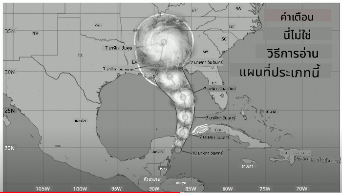
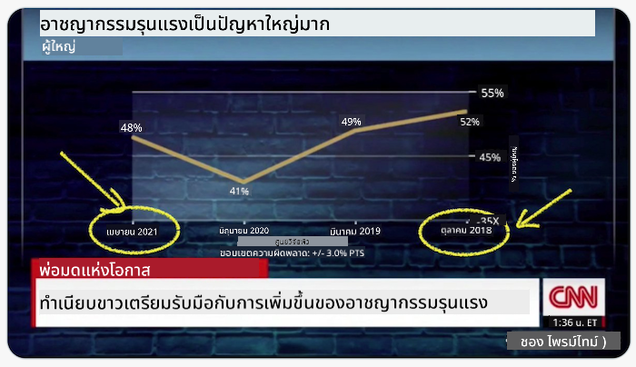
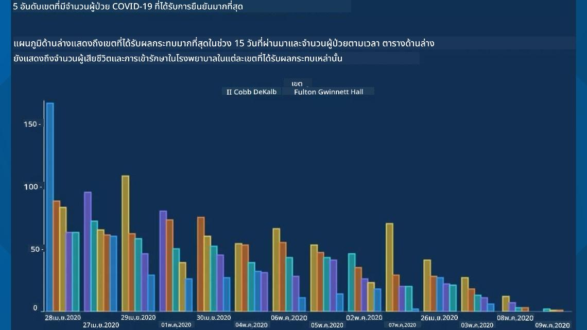
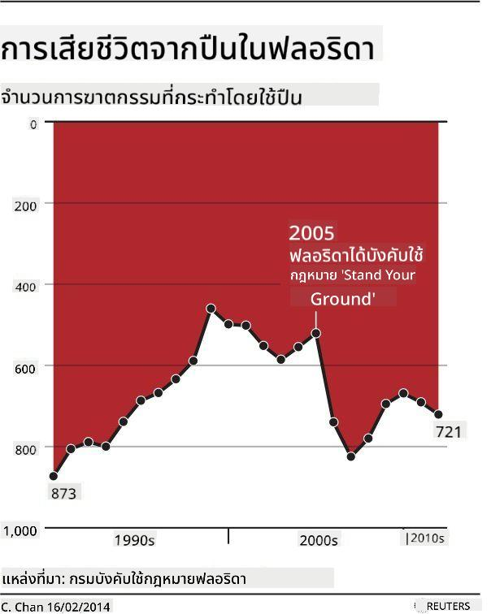
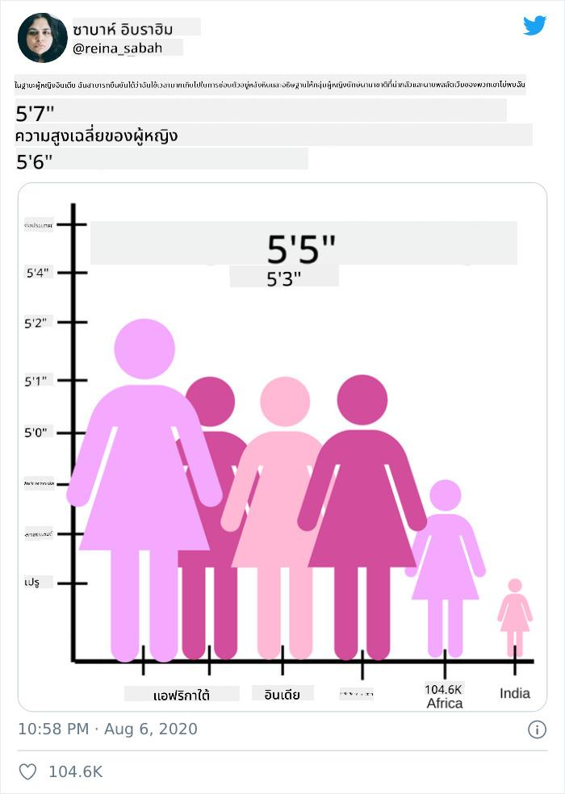
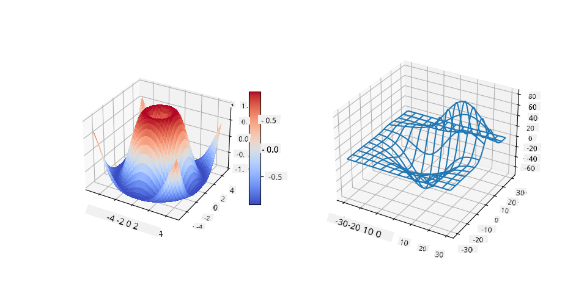
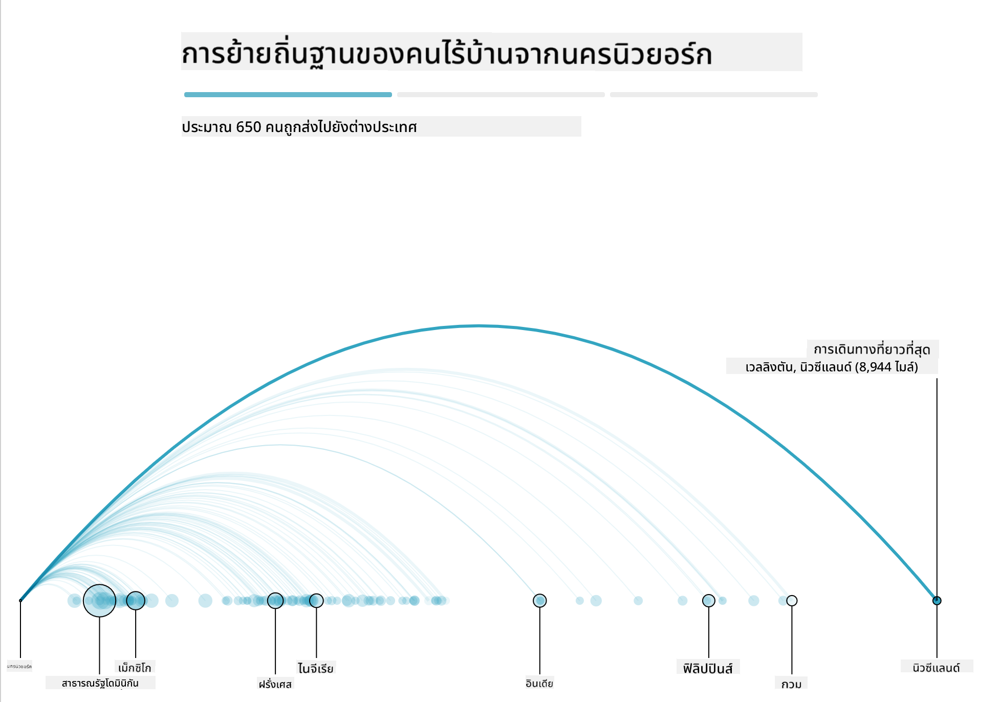
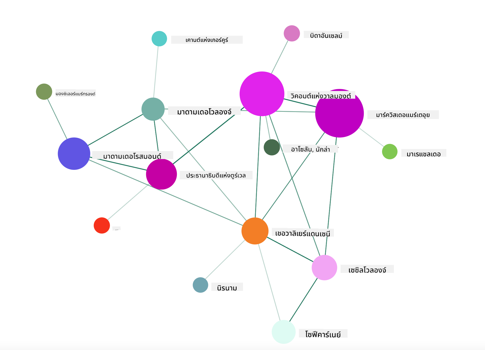

<!--
CO_OP_TRANSLATOR_METADATA:
{
  "original_hash": "b4039f1c76548d144a0aee0bf28304ec",
  "translation_date": "2025-08-26T23:10:16+00:00",
  "source_file": "3-Data-Visualization/R/13-meaningful-vizualizations/README.md",
  "language_code": "th"
}
-->
# การสร้างภาพข้อมูลที่มีความหมาย

| ](../../../sketchnotes/13-MeaningfulViz.png)|
|:---:|
| การสร้างภาพข้อมูลที่มีความหมาย - _Sketchnote โดย [@nitya](https://twitter.com/nitya)_ |

> "ถ้าคุณทรมานข้อมูลนานพอ มันจะยอมสารภาพทุกอย่าง" -- [Ronald Coase](https://en.wikiquote.org/wiki/Ronald_Coase)

หนึ่งในทักษะพื้นฐานของนักวิทยาศาสตร์ข้อมูลคือความสามารถในการสร้างภาพข้อมูลที่มีความหมาย ซึ่งช่วยตอบคำถามที่คุณอาจมี ก่อนที่คุณจะสร้างภาพข้อมูล คุณต้องมั่นใจว่าข้อมูลนั้นได้รับการทำความสะอาดและเตรียมพร้อมแล้วเหมือนที่คุณได้ทำในบทเรียนก่อนหน้า หลังจากนั้น คุณสามารถเริ่มตัดสินใจว่าจะนำเสนอข้อมูลอย่างไรให้ดีที่สุด

ในบทเรียนนี้ คุณจะได้ทบทวน:

1. วิธีเลือกประเภทกราฟที่เหมาะสม
2. วิธีหลีกเลี่ยงการสร้างกราฟที่หลอกลวง
3. วิธีการใช้สี
4. วิธีการปรับแต่งกราฟเพื่อให้อ่านง่าย
5. วิธีสร้างกราฟแบบเคลื่อนไหวหรือแบบ 3 มิติ
6. วิธีสร้างภาพข้อมูลที่สร้างสรรค์

## [แบบทดสอบก่อนเรียน](https://purple-hill-04aebfb03.1.azurestaticapps.net/quiz/24)

## เลือกประเภทกราฟที่เหมาะสม

ในบทเรียนก่อนหน้า คุณได้ทดลองสร้างภาพข้อมูลที่น่าสนใจหลากหลายรูปแบบโดยใช้ Matplotlib และ Seaborn สำหรับการสร้างกราฟ โดยทั่วไป คุณสามารถเลือก [ประเภทกราฟที่เหมาะสม](https://chartio.com/learn/charts/how-to-select-a-data-vizualization/) สำหรับคำถามที่คุณต้องการตอบโดยใช้ตารางนี้:

| คุณต้องการ:               | คุณควรใช้:                     |
| -------------------------- | ------------------------------- |
| แสดงแนวโน้มข้อมูลตามเวลา | เส้น (Line)                    |
| เปรียบเทียบหมวดหมู่       | แท่ง (Bar), วงกลม (Pie)         |
| เปรียบเทียบยอดรวม         | วงกลม (Pie), แท่งซ้อน (Stacked Bar) |
| แสดงความสัมพันธ์          | กระจาย (Scatter), เส้น (Line), Facet, เส้นคู่ (Dual Line) |
| แสดงการกระจายตัว          | กระจาย (Scatter), ฮิสโตแกรม (Histogram), กล่อง (Box) |
| แสดงสัดส่วน               | วงกลม (Pie), โดนัท (Donut), วาฟเฟิล (Waffle) |

> ✅ ขึ้นอยู่กับลักษณะของข้อมูล คุณอาจต้องแปลงข้อมูลจากข้อความเป็นตัวเลขเพื่อให้กราฟรองรับได้

## หลีกเลี่ยงการหลอกลวง

แม้ว่านักวิทยาศาสตร์ข้อมูลจะระมัดระวังในการเลือกกราฟที่เหมาะสมกับข้อมูล แต่ก็ยังมีวิธีมากมายที่ข้อมูลสามารถถูกแสดงออกมาเพื่อสนับสนุนจุดยืนบางอย่าง ซึ่งมักจะทำให้ข้อมูลเสียความน่าเชื่อถือ มีตัวอย่างมากมายของกราฟและอินโฟกราฟิกที่หลอกลวง!

[](https://www.youtube.com/watch?v=oX74Nge8Wkw "How charts lie")

> 🎥 คลิกที่ภาพด้านบนเพื่อดูการบรรยายเกี่ยวกับกราฟที่หลอกลวง

กราฟนี้กลับด้านแกน X เพื่อแสดงสิ่งที่ตรงข้ามกับความจริงตามวันที่:



[กราฟนี้](https://media.firstcoastnews.com/assets/WTLV/images/170ae16f-4643-438f-b689-50d66ca6a8d8/170ae16f-4643-438f-b689-50d66ca6a8d8_1140x641.jpg) ยิ่งหลอกลวงมากขึ้น เพราะสายตาจะถูกดึงไปทางขวาเพื่อสรุปว่าเมื่อเวลาผ่านไป จำนวนผู้ติดเชื้อ COVID ในแต่ละเขตลดลง แต่ถ้าคุณดูวันที่อย่างละเอียด คุณจะพบว่ามันถูกจัดเรียงใหม่เพื่อสร้างแนวโน้มที่ลดลงอย่างหลอกลวง



ตัวอย่างที่มีชื่อเสียงนี้ใช้สีและกลับด้านแกน Y เพื่อหลอกลวง: แทนที่จะสรุปว่าการเสียชีวิตจากอาวุธปืนเพิ่มขึ้นหลังจากการผ่านกฎหมายที่สนับสนุนอาวุธปืน สายตากลับถูกหลอกให้คิดว่าตรงกันข้าม:



กราฟแปลก ๆ นี้แสดงให้เห็นว่าสัดส่วนสามารถถูกบิดเบือนได้อย่างน่าขบขัน:



การเปรียบเทียบสิ่งที่ไม่สามารถเปรียบเทียบได้เป็นอีกหนึ่งกลวิธีที่ไม่ซื่อสัตย์ มี [เว็บไซต์ที่ยอดเยี่ยม](https://tylervigen.com/spurious-correlations) ที่รวบรวม 'ความสัมพันธ์ที่ผิดพลาด' แสดง 'ข้อเท็จจริง' ที่เชื่อมโยงสิ่งต่าง ๆ เช่น อัตราการหย่าร้างใน Maine กับการบริโภคมาการีน กลุ่ม Reddit ยังรวบรวม [การใช้ข้อมูลที่น่าเกลียด](https://www.reddit.com/r/dataisugly/top/?t=all) อีกด้วย

สิ่งสำคัญคือต้องเข้าใจว่าสายตาสามารถถูกหลอกได้ง่ายเพียงใดจากกราฟที่หลอกลวง แม้ว่าความตั้งใจของนักวิทยาศาสตร์ข้อมูลจะดี แต่การเลือกประเภทกราฟที่ไม่เหมาะสม เช่น กราฟวงกลมที่แสดงหมวดหมู่มากเกินไป ก็อาจทำให้เกิดความเข้าใจผิดได้

## สี

คุณได้เห็นในกราฟ 'ความรุนแรงจากอาวุธปืนในฟลอริดา' ว่าสีสามารถเพิ่มความหมายเพิ่มเติมให้กับกราฟ โดยเฉพาะกราฟที่ไม่ได้ออกแบบโดยใช้ไลบรารี เช่น ggplot2 และ RColorBrewer ซึ่งมาพร้อมกับไลบรารีสีและพาเลตที่ผ่านการตรวจสอบแล้ว หากคุณกำลังสร้างกราฟด้วยตัวเอง ลองศึกษาทฤษฎีสีเล็กน้อย [ทฤษฎีสี](https://colormatters.com/color-and-design/basic-color-theory)

> ✅ โปรดทราบว่าเมื่อออกแบบกราฟ การเข้าถึงเป็นแง่มุมที่สำคัญของการสร้างภาพข้อมูล ผู้ใช้บางคนอาจมีปัญหาการมองเห็นสี - กราฟของคุณแสดงผลได้ดีสำหรับผู้ใช้ที่มีความบกพร่องทางการมองเห็นหรือไม่?

ระวังเมื่อเลือกสีสำหรับกราฟของคุณ เพราะสีสามารถสื่อความหมายที่คุณอาจไม่ได้ตั้งใจได้ 'ผู้หญิงในชุดสีชมพู' ในกราฟ 'ความสูง' ด้านบน สื่อความหมายที่ 'เป็นผู้หญิง' ซึ่งเพิ่มความแปลกประหลาดให้กับกราฟนั้นเอง

แม้ว่า [ความหมายของสี](https://colormatters.com/color-symbolism/the-meanings-of-colors) อาจแตกต่างกันในแต่ละส่วนของโลก และมักเปลี่ยนแปลงตามเฉดสี โดยทั่วไป ความหมายของสีรวมถึง:

| สี      | ความหมาย               |
| ------- | ----------------------- |
| แดง     | อำนาจ                  |
| น้ำเงิน  | ความไว้วางใจ, ความภักดี |
| เหลือง   | ความสุข, ความระมัดระวัง |
| เขียว    | สิ่งแวดล้อม, โชค, ความอิจฉา |
| ม่วง     | ความสุข                |
| ส้ม      | ความสดใส              |

หากคุณได้รับมอบหมายให้สร้างกราฟที่มีสีที่กำหนดเอง ตรวจสอบให้แน่ใจว่ากราฟของคุณทั้งเข้าถึงได้ง่ายและสีที่คุณเลือกสอดคล้องกับความหมายที่คุณต้องการสื่อ

## การปรับแต่งกราฟเพื่อให้อ่านง่าย

กราฟจะไม่มีความหมายหากอ่านไม่ออก! ใช้เวลาสักครู่เพื่อพิจารณาปรับแต่งความกว้างและความสูงของกราฟของคุณให้เหมาะสมกับข้อมูล หากตัวแปรหนึ่ง (เช่น ทั้ง 50 รัฐ) จำเป็นต้องแสดงผล ให้แสดงในแนวตั้งบนแกน Y หากเป็นไปได้ เพื่อหลีกเลี่ยงกราฟที่ต้องเลื่อนในแนวนอน

ใส่ป้ายกำกับแกน, เพิ่มคำอธิบายถ้าจำเป็น และเสนอคำแนะนำ (tooltips) เพื่อช่วยให้เข้าใจข้อมูลได้ดีขึ้น

หากข้อมูลของคุณเป็นข้อความและยาวบนแกน X คุณสามารถปรับมุมข้อความเพื่อให้อ่านง่ายขึ้น [plot3D](https://cran.r-project.org/web/packages/plot3D/index.html) เสนอการสร้างกราฟแบบ 3 มิติ หากข้อมูลของคุณรองรับ กราฟข้อมูลที่ซับซ้อนสามารถสร้างได้โดยใช้เครื่องมือนี้



## การแสดงกราฟแบบเคลื่อนไหวและ 3 มิติ

ภาพข้อมูลที่ดีที่สุดในปัจจุบันบางส่วนเป็นแบบเคลื่อนไหว Shirley Wu มีตัวอย่างที่น่าทึ่งที่สร้างด้วย D3 เช่น '[film flowers](http://bl.ocks.org/sxywu/raw/d612c6c653fb8b4d7ff3d422be164a5d/)' ซึ่งแต่ละดอกไม้เป็นภาพข้อมูลของภาพยนตร์ อีกตัวอย่างหนึ่งสำหรับ Guardian คือ 'bussed out' ซึ่งเป็นประสบการณ์แบบโต้ตอบที่รวมภาพข้อมูลกับ Greensock และ D3 พร้อมบทความแบบเลื่อนเพื่อแสดงวิธีที่ NYC จัดการกับปัญหาคนไร้บ้านโดยการส่งพวกเขาออกจากเมือง



> "Bussed Out: How America Moves its Homeless" จาก [the Guardian](https://www.theguardian.com/us-news/ng-interactive/2017/dec/20/bussed-out-america-moves-homeless-people-country-study). ภาพข้อมูลโดย Nadieh Bremer & Shirley Wu

แม้ว่าบทเรียนนี้จะไม่เพียงพอที่จะสอนไลบรารีการสร้างภาพข้อมูลที่ทรงพลังเหล่านี้อย่างละเอียด ลองใช้ D3 ในแอป Vue.js โดยใช้ไลบรารีเพื่อแสดงภาพข้อมูลของหนังสือ "Dangerous Liaisons" เป็นเครือข่ายสังคมแบบเคลื่อนไหว

> "Les Liaisons Dangereuses" เป็นนวนิยายที่นำเสนอในรูปแบบจดหมาย เขียนในปี 1782 โดย Choderlos de Laclos เล่าเรื่องราวการวางแผนทางสังคมที่ไร้ศีลธรรมของตัวเอกสองคนในชนชั้นสูงของฝรั่งเศสในศตวรรษที่ 18 Vicomte de Valmont และ Marquise de Merteuil ทั้งคู่พบจุดจบของตนเองในที่สุด แต่ไม่ใช่ก่อนที่จะสร้างความเสียหายทางสังคมอย่างมาก นวนิยายนี้เล่าเรื่องผ่านจดหมายที่เขียนถึงบุคคลต่าง ๆ ในวงสังคมของพวกเขา วางแผนแก้แค้นหรือเพียงแค่สร้างปัญหา สร้างภาพข้อมูลของจดหมายเหล่านี้เพื่อค้นหาตัวละครสำคัญในเรื่องราวผ่านภาพ

คุณจะสร้างแอปเว็บที่จะแสดงมุมมองแบบเคลื่อนไหวของเครือข่ายสังคมนี้ โดยใช้ไลบรารีที่สร้างขึ้นเพื่อสร้าง [ภาพเครือข่าย](https://github.com/emiliorizzo/vue-d3-network) โดยใช้ Vue.js และ D3 เมื่อแอปทำงาน คุณสามารถลากโหนดไปรอบ ๆ บนหน้าจอเพื่อจัดเรียงข้อมูลใหม่ได้



## โครงการ: สร้างกราฟเพื่อแสดงเครือข่ายโดยใช้ D3.js

> โฟลเดอร์บทเรียนนี้มีโฟลเดอร์ `solution` ซึ่งคุณสามารถค้นหาโครงการที่เสร็จสมบูรณ์เพื่อใช้อ้างอิงได้

1. ทำตามคำแนะนำในไฟล์ README.md ในโฟลเดอร์ root ของโฟลเดอร์ starter ตรวจสอบให้แน่ใจว่าคุณมี NPM และ Node.js ทำงานบนเครื่องของคุณก่อนติดตั้ง dependencies ของโครงการ

2. เปิดโฟลเดอร์ `starter/src` คุณจะพบโฟลเดอร์ `assets` ซึ่งมีไฟล์ .json ที่มีจดหมายทั้งหมดจากนวนิยาย โดยมีหมายเลข พร้อมคำอธิบาย 'to' และ 'from'

3. เติมโค้ดใน `components/Nodes.vue` เพื่อเปิดใช้งานการแสดงภาพ ค้นหาวิธีที่เรียกว่า `createLinks()` และเพิ่มลูปซ้อนดังนี้

วนลูปผ่านวัตถุ .json เพื่อดึงข้อมูล 'to' และ 'from' สำหรับจดหมาย และสร้างวัตถุ `links` เพื่อให้ไลบรารีการแสดงภาพสามารถใช้งานได้:

```javascript
//loop through letters
      let f = 0;
      let t = 0;
      for (var i = 0; i < letters.length; i++) {
          for (var j = 0; j < characters.length; j++) {
              
            if (characters[j] == letters[i].from) {
              f = j;
            }
            if (characters[j] == letters[i].to) {
              t = j;
            }
        }
        this.links.push({ sid: f, tid: t });
      }
  ```

รันแอปของคุณจากเทอร์มินัล (npm run serve) และเพลิดเพลินกับการแสดงภาพ!

## 🚀 ความท้าทาย

สำรวจอินเทอร์เน็ตเพื่อค้นหาภาพข้อมูลที่หลอกลวง ผู้เขียนหลอกลวงผู้ใช้อย่างไร และเป็นความตั้งใจหรือไม่? ลองแก้ไขภาพข้อมูลเพื่อแสดงให้เห็นว่าควรมีลักษณะอย่างไร

## [แบบทดสอบหลังเรียน](https://purple-hill-04aebfb03.1.azurestaticapps.net/quiz/25)

## ทบทวนและศึกษาด้วยตนเอง

นี่คือตัวอย่างบทความเกี่ยวกับการสร้างภาพข้อมูลที่หลอกลวง:

https://gizmodo.com/how-to-lie-with-data-visualization-1563576606

http://ixd.prattsi.org/2017/12/visual-lies-usability-in-deceptive-data-visualizations/

ลองดูภาพข้อมูลที่น่าสนใจเกี่ยวกับทรัพย์สินและสิ่งประดิษฐ์ทางประวัติศาสตร์:

https://handbook.pubpub.org/

อ่านบทความนี้เกี่ยวกับวิธีที่การเคลื่อนไหวสามารถเพิ่มประสิทธิภาพให้กับภาพข้อมูลของคุณ:

https://medium.com/@EvanSinar/use-animation-to-supercharge-data-visualization-cd905a882ad4

## การบ้าน

[สร้างภาพข้อมูลของคุณเอง](assignment.md)

---

**ข้อจำกัดความรับผิดชอบ**:  
เอกสารนี้ได้รับการแปลโดยใช้บริการแปลภาษา AI [Co-op Translator](https://github.com/Azure/co-op-translator) แม้ว่าเราจะพยายามให้การแปลมีความถูกต้องมากที่สุด แต่โปรดทราบว่าการแปลโดยอัตโนมัติอาจมีข้อผิดพลาดหรือความไม่ถูกต้อง เอกสารต้นฉบับในภาษาดั้งเดิมควรถือเป็นแหล่งข้อมูลที่เชื่อถือได้ สำหรับข้อมูลที่สำคัญ ขอแนะนำให้ใช้บริการแปลภาษามืออาชีพ เราไม่รับผิดชอบต่อความเข้าใจผิดหรือการตีความผิดที่เกิดจากการใช้การแปลนี้