<!--
CO_OP_TRANSLATOR_METADATA:
{
  "original_hash": "39f3b3a9d873eaa522c2e792ce0ca503",
  "translation_date": "2025-09-04T18:40:52+00:00",
  "source_file": "5-Data-Science-In-Cloud/18-Low-Code/README.md",
  "language_code": "th"
}
-->
# วิทยาศาสตร์ข้อมูลในระบบคลาวด์: วิธี "Low code/No code"

|](../../sketchnotes/18-DataScience-Cloud.png)|
|:---:|
| วิทยาศาสตร์ข้อมูลในระบบคลาวด์: Low Code - _ภาพสเก็ตช์โดย [@nitya](https://twitter.com/nitya)_ |

สารบัญ:

- [วิทยาศาสตร์ข้อมูลในระบบคลาวด์: วิธี "Low code/No code"](../../../../5-Data-Science-In-Cloud/18-Low-Code)
  - [แบบทดสอบก่อนการบรรยาย](../../../../5-Data-Science-In-Cloud/18-Low-Code)
  - [1. บทนำ](../../../../5-Data-Science-In-Cloud/18-Low-Code)
    - [1.1 Azure Machine Learning คืออะไร?](../../../../5-Data-Science-In-Cloud/18-Low-Code)
    - [1.2 โครงการทำนายภาวะหัวใจล้มเหลว:](../../../../5-Data-Science-In-Cloud/18-Low-Code)
    - [1.3 ชุดข้อมูลภาวะหัวใจล้มเหลว:](../../../../5-Data-Science-In-Cloud/18-Low-Code)
  - [2. การฝึกโมเดลแบบ Low code/No code ใน Azure ML Studio](../../../../5-Data-Science-In-Cloud/18-Low-Code)
    - [2.1 สร้าง Azure ML workspace](../../../../5-Data-Science-In-Cloud/18-Low-Code)
    - [2.2 ทรัพยากรคอมพิวเตอร์](../../../../5-Data-Science-In-Cloud/18-Low-Code)
      - [2.2.1 การเลือกตัวเลือกที่เหมาะสมสำหรับทรัพยากรคอมพิวเตอร์](../../../../5-Data-Science-In-Cloud/18-Low-Code)
      - [2.2.2 การสร้างคลัสเตอร์คอมพิวเตอร์](../../../../5-Data-Science-In-Cloud/18-Low-Code)
    - [2.3 การโหลดชุดข้อมูล](../../../../5-Data-Science-In-Cloud/18-Low-Code)
    - [2.4 การฝึกแบบ Low code/No code ด้วย AutoML](../../../../5-Data-Science-In-Cloud/18-Low-Code)
  - [3. การปรับใช้โมเดลแบบ Low code/No code และการใช้งาน Endpoint](../../../../5-Data-Science-In-Cloud/18-Low-Code)
    - [3.1 การปรับใช้โมเดล](../../../../5-Data-Science-In-Cloud/18-Low-Code)
    - [3.2 การใช้งาน Endpoint](../../../../5-Data-Science-In-Cloud/18-Low-Code)
  - [🚀 ความท้าทาย](../../../../5-Data-Science-In-Cloud/18-Low-Code)
  - [แบบทดสอบหลังการบรรยาย](../../../../5-Data-Science-In-Cloud/18-Low-Code)
  - [การทบทวนและการศึกษาด้วยตนเอง](../../../../5-Data-Science-In-Cloud/18-Low-Code)
  - [งานที่ได้รับมอบหมาย](../../../../5-Data-Science-In-Cloud/18-Low-Code)

## [แบบทดสอบก่อนการบรรยาย](https://ff-quizzes.netlify.app/en/ds/)

## 1. บทนำ
### 1.1 Azure Machine Learning คืออะไร?

แพลตฟอร์มคลาวด์ Azure มีผลิตภัณฑ์และบริการคลาวด์มากกว่า 200 รายการที่ออกแบบมาเพื่อช่วยให้คุณสร้างโซลูชันใหม่ ๆ ได้อย่างมีประสิทธิภาพ นักวิทยาศาสตร์ข้อมูลใช้เวลาและความพยายามอย่างมากในการสำรวจและเตรียมข้อมูล รวมถึงการทดลองใช้วิธีการฝึกโมเดลต่าง ๆ เพื่อสร้างโมเดลที่แม่นยำ งานเหล่านี้ใช้เวลานานและมักใช้ทรัพยากรคอมพิวเตอร์ที่มีราคาแพงอย่างไม่มีประสิทธิภาพ

[Azure ML](https://docs.microsoft.com/azure/machine-learning/overview-what-is-azure-machine-learning?WT.mc_id=academic-77958-bethanycheum&ocid=AID3041109) เป็นแพลตฟอร์มบนคลาวด์สำหรับการสร้างและดำเนินการโซลูชัน Machine Learning ใน Azure โดยมีฟีเจอร์และความสามารถหลากหลายที่ช่วยให้นักวิทยาศาสตร์ข้อมูลเตรียมข้อมูล ฝึกโมเดล เผยแพร่บริการทำนาย และติดตามการใช้งาน สิ่งสำคัญที่สุดคือช่วยเพิ่มประสิทธิภาพโดยการทำงานอัตโนมัติในหลาย ๆ งานที่ใช้เวลานาน และช่วยให้สามารถใช้ทรัพยากรคอมพิวเตอร์บนคลาวด์ที่ปรับขนาดได้อย่างมีประสิทธิภาพเพื่อจัดการข้อมูลปริมาณมาก โดยเสียค่าใช้จ่ายเฉพาะเมื่อใช้งานจริงเท่านั้น

Azure ML มีเครื่องมือทั้งหมดที่นักพัฒนาและนักวิทยาศาสตร์ข้อมูลต้องการสำหรับการทำงาน Machine Learning ซึ่งรวมถึง:

- **Azure Machine Learning Studio**: พอร์ทัลเว็บใน Azure Machine Learning สำหรับตัวเลือกแบบ low-code และ no-code ในการฝึกโมเดล การปรับใช้ การทำงานอัตโนมัติ การติดตาม และการจัดการทรัพย์สิน Studio ผสานรวมกับ Azure Machine Learning SDK เพื่อประสบการณ์ที่ราบรื่น
- **Jupyter Notebooks**: ใช้สำหรับการสร้างต้นแบบและทดสอบโมเดล ML อย่างรวดเร็ว
- **Azure Machine Learning Designer**: ช่วยให้สามารถลากและวางโมดูลเพื่อสร้างการทดลองและปรับใช้ pipeline ในสภาพแวดล้อมแบบ low-code
- **Automated machine learning UI (AutoML)**: ทำงานอัตโนมัติในงานที่ซ้ำซากของการพัฒนาโมเดล Machine Learning ช่วยสร้างโมเดล ML ด้วยประสิทธิภาพและผลิตภาพสูง ในขณะที่ยังคงรักษาคุณภาพของโมเดล
- **Data Labelling**: เครื่องมือ ML ที่ช่วยในการติดป้ายกำกับข้อมูลโดยอัตโนมัติ
- **Machine learning extension for Visual Studio Code**: สภาพแวดล้อมการพัฒนาเต็มรูปแบบสำหรับการสร้างและจัดการโครงการ ML
- **Machine learning CLI**: คำสั่งสำหรับจัดการทรัพยากร Azure ML ผ่านบรรทัดคำสั่ง
- **การผสานรวมกับเฟรมเวิร์กโอเพ่นซอร์ส** เช่น PyTorch, TensorFlow, Scikit-learn และอื่น ๆ สำหรับการฝึก การปรับใช้ และการจัดการกระบวนการ Machine Learning แบบครบวงจร
- **MLflow**: ไลบรารีโอเพ่นซอร์สสำหรับการจัดการวงจรชีวิตของการทดลอง Machine Learning **MLFlow Tracking** เป็นส่วนประกอบของ MLflow ที่บันทึกและติดตามเมตริกการฝึกและสิ่งประดิษฐ์ของโมเดล ไม่ว่าจะอยู่ในสภาพแวดล้อมใดก็ตาม

### 1.2 โครงการทำนายภาวะหัวใจล้มเหลว:

ไม่มีข้อสงสัยเลยว่าการสร้างและพัฒนาโครงการเป็นวิธีที่ดีที่สุดในการทดสอบทักษะและความรู้ของคุณ ในบทเรียนนี้ เราจะสำรวจสองวิธีที่แตกต่างกันในการสร้างโครงการวิทยาศาสตร์ข้อมูลเพื่อทำนายการเกิดภาวะหัวใจล้มเหลวใน Azure ML Studio ผ่านวิธี Low code/No code และผ่าน Azure ML SDK ตามแผนภาพต่อไปนี้:

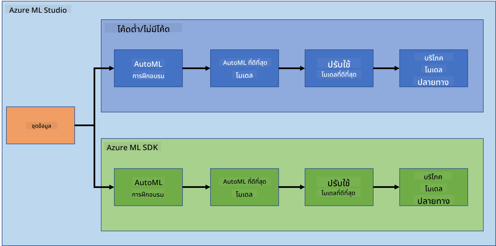

แต่ละวิธีมีข้อดีและข้อเสียของตัวเอง วิธี Low code/No code เริ่มต้นได้ง่ายกว่าเนื่องจากเกี่ยวข้องกับการใช้งาน GUI (Graphical User Interface) โดยไม่ต้องมีความรู้เกี่ยวกับโค้ดมาก่อน วิธีนี้ช่วยให้สามารถทดสอบความเป็นไปได้ของโครงการได้อย่างรวดเร็วและสร้าง POC (Proof Of Concept) อย่างไรก็ตาม เมื่อโครงการเติบโตขึ้นและต้องการความพร้อมสำหรับการผลิต การสร้างทรัพยากรผ่าน GUI จะไม่เหมาะสม เราจำเป็นต้องทำงานอัตโนมัติผ่านโปรแกรม ตั้งแต่การสร้างทรัพยากรไปจนถึงการปรับใช้โมเดล ซึ่งการรู้วิธีใช้ Azure ML SDK จะมีความสำคัญอย่างยิ่ง

|                   | Low code/No code | Azure ML SDK              |
|-------------------|------------------|---------------------------|
| ความเชี่ยวชาญในโค้ด | ไม่จำเป็น         | จำเป็น                    |
| เวลาที่ใช้ในการพัฒนา | รวดเร็วและง่าย    | ขึ้นอยู่กับความเชี่ยวชาญในโค้ด |
| พร้อมสำหรับการผลิต | ไม่               | ใช่                       |

### 1.3 ชุดข้อมูลภาวะหัวใจล้มเหลว:

โรคหัวใจและหลอดเลือด (CVDs) เป็นสาเหตุการเสียชีวิตอันดับ 1 ทั่วโลก คิดเป็น 31% ของการเสียชีวิตทั้งหมดทั่วโลก ปัจจัยเสี่ยงด้านสิ่งแวดล้อมและพฤติกรรม เช่น การใช้ยาสูบ อาหารที่ไม่ดีต่อสุขภาพและโรคอ้วน การไม่ออกกำลังกาย และการใช้แอลกอฮอล์ในทางที่ผิด สามารถใช้เป็นคุณลักษณะสำหรับโมเดลการประมาณการ การสามารถประมาณความน่าจะเป็นของการพัฒนา CVD จะมีประโยชน์อย่างมากในการป้องกันการเกิดภาวะหัวใจล้มเหลวในผู้ที่มีความเสี่ยงสูง

Kaggle ได้เผยแพร่ [ชุดข้อมูลภาวะหัวใจล้มเหลว](https://www.kaggle.com/andrewmvd/heart-failure-clinical-data) ให้ใช้งานได้ฟรี ซึ่งเราจะใช้สำหรับโครงการนี้ คุณสามารถดาวน์โหลดชุดข้อมูลได้ทันที ชุดข้อมูลนี้เป็นข้อมูลแบบตารางที่มี 13 คอลัมน์ (12 คุณลักษณะและ 1 ตัวแปรเป้าหมาย) และ 299 แถว

|    | ชื่อตัวแปร                | ประเภท          | คำอธิบาย                                               | ตัวอย่าง          |
|----|---------------------------|-----------------|-------------------------------------------------------|-------------------|
| 1  | age                       | ตัวเลข          | อายุของผู้ป่วย                                        | 25                |
| 2  | anaemia                   | บูลีน           | การลดลงของเซลล์เม็ดเลือดแดงหรือฮีโมโกลบิน           | 0 หรือ 1          |
| 3  | creatinine_phosphokinase  | ตัวเลข          | ระดับเอนไซม์ CPK ในเลือด                              | 542               |
| 4  | diabetes                  | บูลีน           | ผู้ป่วยมีโรคเบาหวานหรือไม่                           | 0 หรือ 1          |
| 5  | ejection_fraction         | ตัวเลข          | เปอร์เซ็นต์ของเลือดที่ออกจากหัวใจในแต่ละการบีบตัว   | 45                |
| 6  | high_blood_pressure       | บูลีน           | ผู้ป่วยมีความดันโลหิตสูงหรือไม่                      | 0 หรือ 1          |
| 7  | platelets                 | ตัวเลข          | จำนวนเกล็ดเลือดในเลือด                                | 149000            |
| 8  | serum_creatinine          | ตัวเลข          | ระดับเซรั่มครีเอตินีนในเลือด                         | 0.5               |
| 9  | serum_sodium              | ตัวเลข          | ระดับเซรั่มโซเดียมในเลือด                            | jun               |
| 10 | sex                       | บูลีน           | เพศหญิงหรือชาย                                        | 0 หรือ 1          |
| 11 | smoking                   | บูลีน           | ผู้ป่วยสูบบุหรี่หรือไม่                               | 0 หรือ 1          |
| 12 | time                      | ตัวเลข          | ระยะเวลาติดตามผล (วัน)                               | 4                 |
|----|---------------------------|-----------------|-------------------------------------------------------|-------------------|
| 21 | DEATH_EVENT [Target]      | บูลีน           | ผู้ป่วยเสียชีวิตในช่วงระยะเวลาติดตามผลหรือไม่       | 0 หรือ 1          |

เมื่อคุณมีชุดข้อมูลแล้ว เราสามารถเริ่มโครงการใน Azure ได้

## 2. การฝึกโมเดลแบบ Low code/No code ใน Azure ML Studio
### 2.1 สร้าง Azure ML workspace
ในการฝึกโมเดลใน Azure ML คุณต้องสร้าง Azure ML workspace ก่อน Workspace เป็นทรัพยากรระดับสูงสุดสำหรับ Azure Machine Learning ซึ่งให้สถานที่รวมศูนย์สำหรับการทำงานกับสิ่งประดิษฐ์ทั้งหมดที่คุณสร้างเมื่อใช้ Azure Machine Learning Workspace จะเก็บประวัติการฝึกทั้งหมด รวมถึงบันทึก เมตริก ผลลัพธ์ และภาพรวมของสคริปต์ของคุณ คุณใช้ข้อมูลนี้เพื่อกำหนดว่าการฝึกครั้งใดให้โมเดลที่ดีที่สุด [เรียนรู้เพิ่มเติม](https://docs.microsoft.com/azure/machine-learning/concept-workspace?WT.mc_id=academic-77958-bethanycheum&ocid=AID3041109)

แนะนำให้ใช้เบราว์เซอร์ที่ทันสมัยที่สุดที่เข้ากันได้กับระบบปฏิบัติการของคุณ เบราว์เซอร์ที่รองรับได้แก่:

- Microsoft Edge (Microsoft Edge ใหม่ เวอร์ชันล่าสุด ไม่ใช่ Microsoft Edge legacy)
- Safari (เวอร์ชันล่าสุด เฉพาะ Mac)
- Chrome (เวอร์ชันล่าสุด)
- Firefox (เวอร์ชันล่าสุด)

ในการใช้ Azure Machine Learning ให้สร้าง workspace ในการสมัครสมาชิก Azure ของคุณ จากนั้นคุณสามารถใช้ workspace นี้เพื่อจัดการข้อมูล ทรัพยากรคอมพิวเตอร์ โค้ด โมเดล และสิ่งประดิษฐ์อื่น ๆ ที่เกี่ยวข้องกับงาน Machine Learning ของคุณ

> **_หมายเหตุ:_** การสมัครสมาชิก Azure ของคุณจะถูกเรียกเก็บเงินจำนวนเล็กน้อยสำหรับการจัดเก็บข้อมูลตราบเท่าที่ Azure Machine Learning workspace ยังคงอยู่ในการสมัครสมาชิกของคุณ ดังนั้นเราขอแนะนำให้ลบ Azure Machine Learning workspace เมื่อคุณไม่ได้ใช้งานอีกต่อไป

1. ลงชื่อเข้าใช้ [Azure portal](https://ms.portal.azure.com/) โดยใช้ข้อมูลรับรอง Microsoft ที่เกี่ยวข้องกับการสมัครสมาชิก Azure ของคุณ
2. เลือก **＋Create a resource**
   
   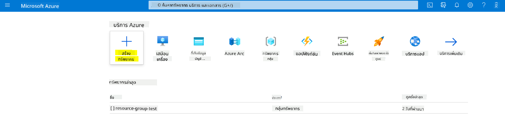

   ค้นหา Machine Learning และเลือกไทล์ Machine Learning

   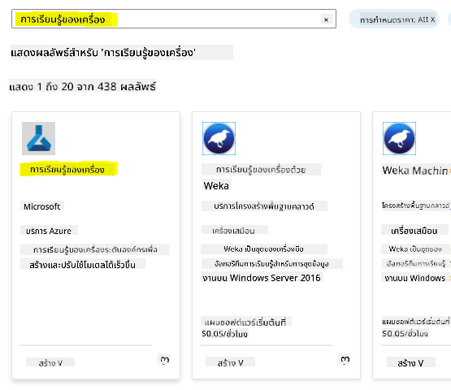

   คลิกปุ่มสร้าง

   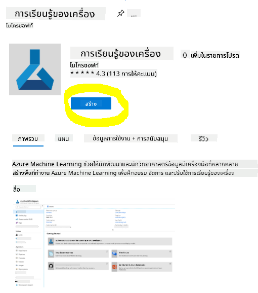

   กรอกการตั้งค่าดังนี้:
   - Subscription: การสมัครสมาชิก Azure ของคุณ
   - Resource group: สร้างหรือเลือกกลุ่มทรัพยากร
   - Workspace name: ใส่ชื่อที่ไม่ซ้ำสำหรับ workspace ของคุณ
   - Region: เลือกภูมิภาคที่ใกล้คุณที่สุด
   - Storage account: สังเกตบัญชีจัดเก็บข้อมูลใหม่ที่ถูกสร้างขึ้นสำหรับ workspace ของคุณ
   - Key vault: สังเกต Key vault ใหม่ที่ถูกสร้างขึ้นสำหรับ workspace ของคุณ
   - Application insights: สังเกตทรัพยากร Application insights ใหม่ที่ถูกสร้างขึ้นสำหรับ workspace ของคุณ
   - Container registry: ไม่มี (จะถูกสร้างขึ้นโดยอัตโนมัติเมื่อคุณปรับใช้โมเดลไปยัง container ครั้งแรก)

    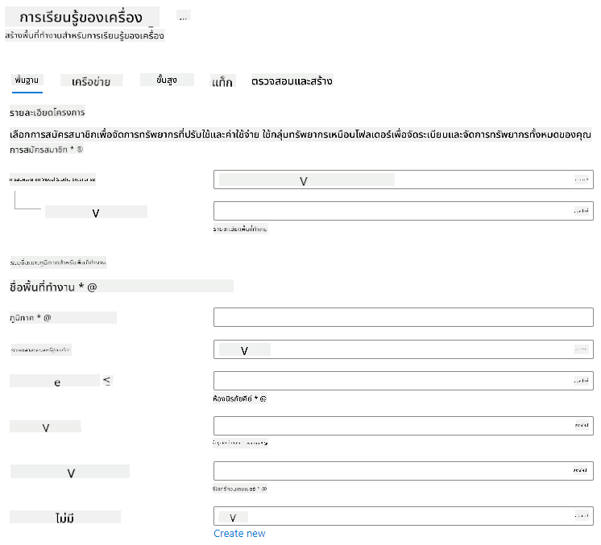

   - คลิกปุ่มสร้าง + ตรวจสอบ และจากนั้นคลิกปุ่มสร้าง
3. รอให้ workspace ของคุณถูกสร้าง (อาจใช้เวลาสักครู่) จากนั้นไปที่ workspace ในพอร์ทัล คุณสามารถค้นหาได้ผ่านบริการ Machine Learning ของ Azure
4. ในหน้าภาพรวมของ workspace ของคุณ เปิด Azure Machine Learning studio (หรือเปิดแท็บเบราว์เซอร์ใหม่และไปที่ https://ml.azure.com) และลงชื่อเข้าใช้ Azure Machine Learning studio โดยใช้บัญชี Microsoft ของคุณ หากมีการแจ้งเตือน ให้เลือกไดเรกทอรีและการสมัครสมาชิก Azure ของคุณ และ workspace Azure Machine Learning ของคุณ
   
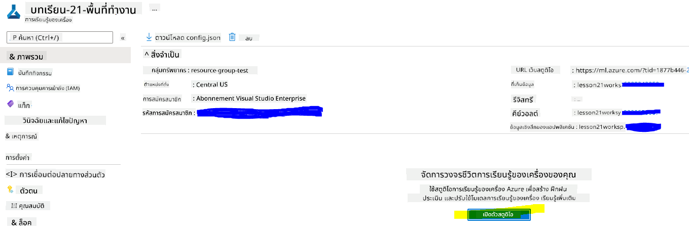

5. ใน Azure Machine Learning studio ให้สลับไอคอน ☰ ที่ด้านบนซ้ายเพื่อดูหน้าต่าง ๆ ในอินเทอร์เฟซ คุณสามารถใช้หน้าต่างเหล่านี้เพื่อจัดการทรัพยากรใน workspace ของคุณ

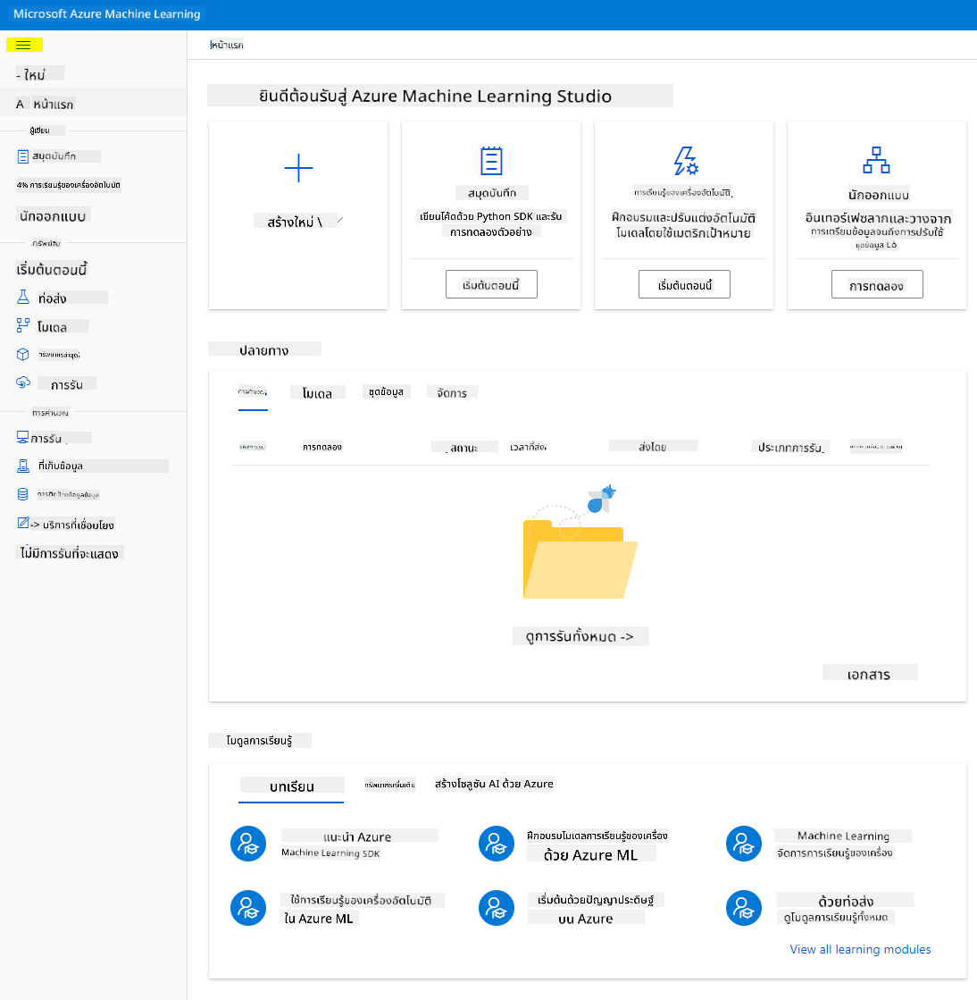

คุณสามารถจัดการ workspace ของคุณโดยใช้ Azure portal แต่สำหรับนักวิทยาศาสตร์ข้อมูลและวิศวกร Machine Learning operations Azure Machine Learning Studio ให้ส่วนติดต่อผู้ใช้ที่มุ่งเน้นมากขึ้นสำหรับการจัดการทรัพยากร workspace

### 2.2 ทรัพยากรคอมพิวเตอร์

ทรัพยากรคอมพิวเตอร์เป็นทรัพยากรบนคลาวด์ที่คุณสามารถใช้ในการฝึกโมเดลและกระบวนการสำรวจข้อมูล มีทรัพยากรคอมพิวเตอร์ 4 ประเภทที่คุณสามารถสร้างได้:

- **Compute Instances**: สถานีงานพัฒนาที่นักวิทยาศาสตร์ข้อมูลสามารถใช้ทำงานกับข้อมูลและโมเดล ซึ่งเกี่ยวข้องกับการสร้าง Virtual Machine (VM) และเปิดตัว notebook instance จากนั้นคุณสามารถฝึกโมเดลโดยเรียกคลัสเตอร์คอมพิวเตอร์จาก notebook
- **Compute Clusters**: คลัสเตอร์ VM ที่ปรับขนาดได้สำหรับการประมวลผลโค้ดการทดลองตามความต้องการ คุณจะต้องใช้เมื่อฝึกโมเดล Compute clusters ยังสามารถใช้ทรัพยากร GPU หรือ CPU เฉพาะทางได้
- **Inference Clusters**: เป้าหมายการปรับใช้สำหรับบริการทำนายที่ใช้โมเดลที่คุณฝึกแล้ว
- **Attached Compute**: ลิงก์ไปยังทรัพยากรคอมพิวเตอร์ Azure ที่มีอยู่ เช่น Virtual Machines หรือคลัสเตอร์ Azure Databricks

#### 2.2.1 การเลือกตัวเลือกที่เหมาะสมสำหรับทรัพยากรคอมพิวเตอร์ของคุณ

มีปัจจัยสำคัญบางประการที่ควรพิจารณาเมื่อสร้างทรัพยากรคอมพิวเตอร์ และตัวเลือกเหล่านี้อาจเป็นการตัดสินใจที่สำคัญ

**คุณต้องการ CPU หรือ GPU?**

CPU (Central Processing Unit) คือวงจรอิเล็กทรอนิกส์ที่ทำหน้าที่ประมวลผลคำสั่งในโปรแกรมคอมพิวเตอร์ ส่วน GPU (Graphics Processing Unit) เป็นวงจรอิเล็กทรอนิกส์เฉพาะทางที่สามารถประมวลผลโค้ดที่เกี่ยวข้องกับกราฟิกได้ในอัตราที่สูงมาก

ความแตกต่างหลักระหว่างสถาปัตยกรรม CPU และ GPU คือ CPU ถูกออกแบบมาเพื่อจัดการงานที่หลากหลายได้อย่างรวดเร็ว (วัดจากความเร็วของนาฬิกา CPU) แต่มีข้อจำกัดในความสามารถในการทำงานพร้อมกัน GPU ถูกออกแบบมาสำหรับการประมวลผลแบบขนานและเหมาะสมกว่าสำหรับงานเรียนรู้เชิงลึก

| CPU                                     | GPU                         |
|-----------------------------------------|-----------------------------|
| ราคาถูกกว่า                            | ราคาแพงกว่า                |
| ระดับการทำงานพร้อมกันต่ำ               | ระดับการทำงานพร้อมกันสูง   |
| ช้ากว่าในการฝึกโมเดลเรียนรู้เชิงลึก    | เหมาะสมสำหรับเรียนรู้เชิงลึก|

**ขนาดคลัสเตอร์**

คลัสเตอร์ที่ใหญ่กว่าจะมีค่าใช้จ่ายสูงกว่า แต่จะให้การตอบสนองที่ดีกว่า ดังนั้น หากคุณมีเวลาแต่มีงบประมาณจำกัด คุณควรเริ่มต้นด้วยคลัสเตอร์ขนาดเล็ก ในทางกลับกัน หากคุณมีงบประมาณแต่มีเวลาจำกัด คุณควรเริ่มต้นด้วยคลัสเตอร์ขนาดใหญ่

**ขนาด VM**

ขึ้นอยู่กับข้อจำกัดด้านเวลาและงบประมาณ คุณสามารถปรับขนาด RAM, ดิสก์, จำนวนคอร์ และความเร็วของนาฬิกา การเพิ่มพารามิเตอร์เหล่านี้ทั้งหมดจะมีค่าใช้จ่ายสูงขึ้น แต่จะให้ประสิทธิภาพที่ดีกว่า

**Dedicated หรือ Low-Priority Instances?**

Low-priority instance หมายถึงสามารถถูกขัดจังหวะได้: Microsoft Azure สามารถนำทรัพยากรเหล่านั้นไปใช้กับงานอื่นได้ ซึ่งจะขัดจังหวะงาน Dedicated instance หรือ non-interruptible หมายถึงงานจะไม่ถูกยกเลิกโดยไม่ได้รับอนุญาตจากคุณ นี่เป็นอีกหนึ่งการพิจารณาระหว่างเวลาและเงิน เนื่องจาก instance ที่สามารถถูกขัดจังหวะได้จะมีราคาถูกกว่าตัวที่ไม่สามารถถูกขัดจังหวะได้

#### 2.2.2 การสร้างคลัสเตอร์คอมพิวเตอร์

ใน [Azure ML workspace](https://ml.azure.com/) ที่เราสร้างไว้ก่อนหน้านี้ ไปที่ Compute และคุณจะเห็นทรัพยากรคอมพิวเตอร์ต่างๆ ที่เราเพิ่งพูดถึง (เช่น compute instances, compute clusters, inference clusters และ attached compute) สำหรับโปรเจกต์นี้ เราจะต้องใช้ compute cluster สำหรับการฝึกโมเดล ใน Studio คลิกที่เมนู "Compute" จากนั้นแท็บ "Compute cluster" และคลิกปุ่ม "+ New" เพื่อสร้าง compute cluster

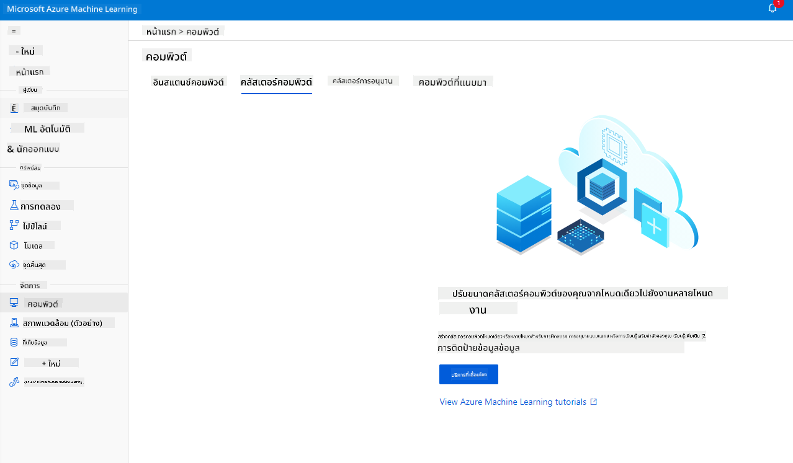

1. เลือกตัวเลือกของคุณ: Dedicated vs Low priority, CPU หรือ GPU, ขนาด VM และจำนวนคอร์ (คุณสามารถใช้การตั้งค่าเริ่มต้นสำหรับโปรเจกต์นี้)
2. คลิกปุ่ม Next

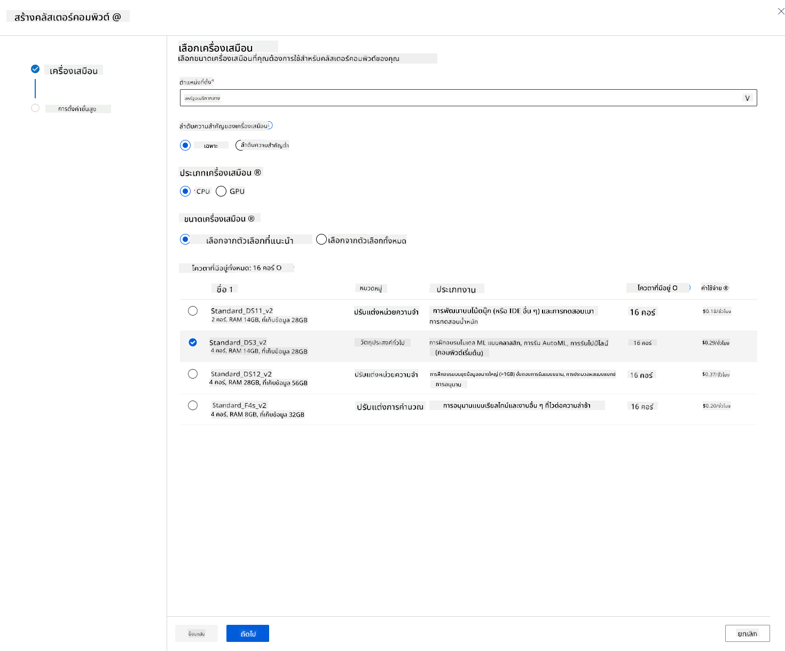

3. ตั้งชื่อคลัสเตอร์
4. เลือกตัวเลือกของคุณ: จำนวนโหนดขั้นต่ำ/สูงสุด, วินาทีที่ไม่ได้ใช้งานก่อนลดขนาด, การเข้าถึง SSH โปรดทราบว่าหากจำนวนโหนดขั้นต่ำคือ 0 คุณจะประหยัดเงินเมื่อคลัสเตอร์ไม่ได้ใช้งาน โปรดทราบว่าจำนวนโหนดสูงสุดที่มากขึ้นจะทำให้การฝึกโมเดลเร็วขึ้น จำนวนโหนดสูงสุดที่แนะนำคือ 3  
5. คลิกปุ่ม "Create" ขั้นตอนนี้อาจใช้เวลาสักครู่

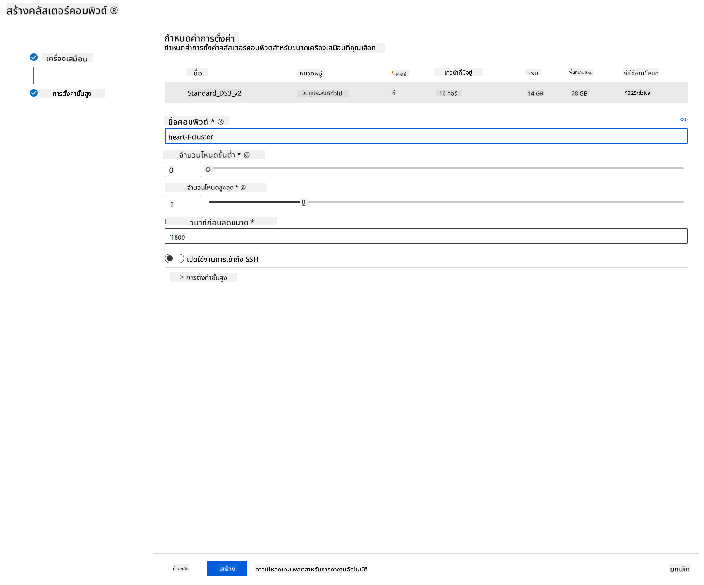

เยี่ยมมาก! ตอนนี้เรามี Compute cluster แล้ว เราต้องโหลดข้อมูลไปยัง Azure ML Studio

### 2.3 การโหลด Dataset

1. ใน [Azure ML workspace](https://ml.azure.com/) ที่เราสร้างไว้ก่อนหน้านี้ คลิกที่ "Datasets" ในเมนูด้านซ้ายและคลิกปุ่ม "+ Create dataset" เพื่อสร้าง dataset เลือกตัวเลือก "From local files" และเลือก dataset จาก Kaggle ที่เราดาวน์โหลดไว้ก่อนหน้านี้
   
   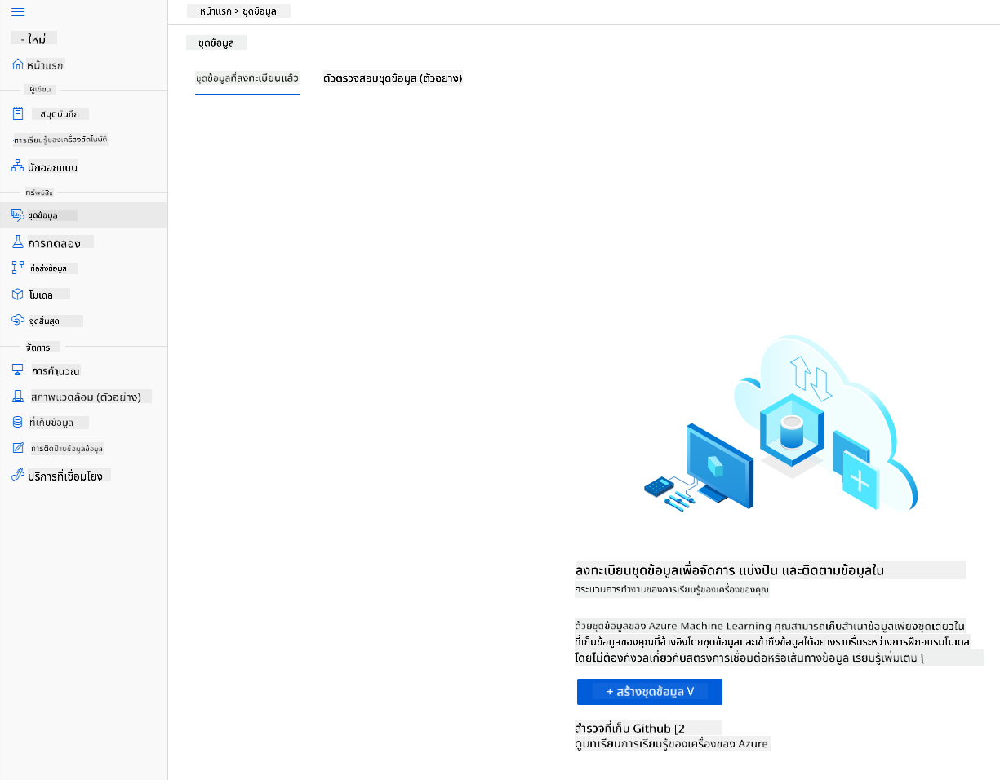

2. ตั้งชื่อ dataset ของคุณ ประเภท และคำอธิบาย คลิก Next อัปโหลดข้อมูลจากไฟล์ คลิก Next
   
   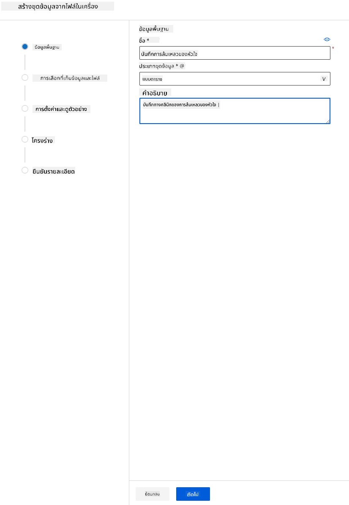

3. ใน Schema เปลี่ยนประเภทข้อมูลเป็น Boolean สำหรับฟีเจอร์ต่อไปนี้: anaemia, diabetes, high blood pressure, sex, smoking, และ DEATH_EVENT คลิก Next และคลิก Create
   
   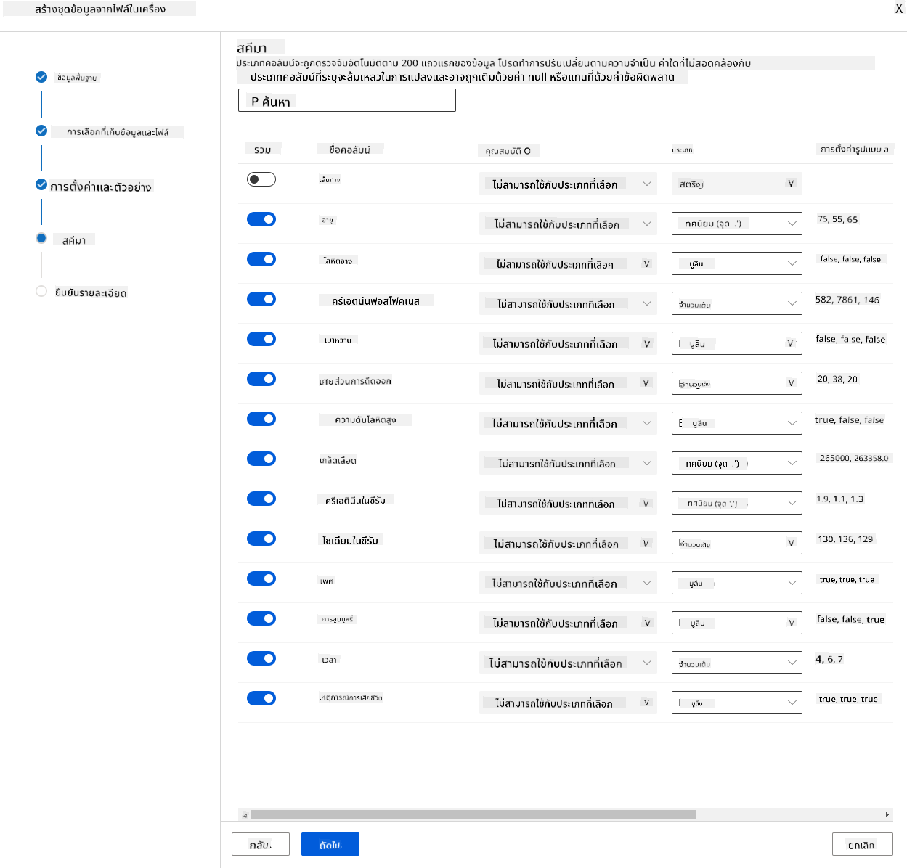

เยี่ยมมาก! ตอนนี้ dataset อยู่ในที่เรียบร้อยและ compute cluster ถูกสร้างขึ้น เราสามารถเริ่มการฝึกโมเดลได้แล้ว!

### 2.4 การฝึกโมเดลแบบ Low code/No Code ด้วย AutoML

การพัฒนาโมเดลเรียนรู้ของเครื่องแบบดั้งเดิมใช้ทรัพยากรมาก ต้องการความรู้เฉพาะทางและเวลาในการสร้างและเปรียบเทียบโมเดลหลายๆ ตัว AutoML (Automated Machine Learning) คือกระบวนการอัตโนมัติที่ช่วยลดงานที่ใช้เวลานานและซ้ำซากในการพัฒนาโมเดลเรียนรู้ของเครื่อง มันช่วยให้นักวิทยาศาสตร์ข้อมูล นักวิเคราะห์ และนักพัฒนาสามารถสร้างโมเดล ML ได้อย่างมีประสิทธิภาพและประสิทธิผล โดยยังคงรักษาคุณภาพของโมเดลไว้ [เรียนรู้เพิ่มเติม](https://docs.microsoft.com/azure/machine-learning/concept-automated-ml?WT.mc_id=academic-77958-bethanycheum&ocid=AID3041109)

1. ใน [Azure ML workspace](https://ml.azure.com/) ที่เราสร้างไว้ก่อนหน้านี้ คลิกที่ "Automated ML" ในเมนูด้านซ้ายและเลือก dataset ที่คุณเพิ่งอัปโหลด คลิก Next

   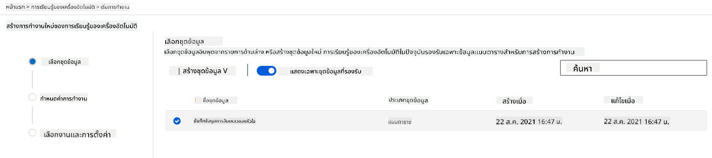

2. ตั้งชื่อ experiment ใหม่ คอลัมน์เป้าหมาย (DEATH_EVENT) และ compute cluster ที่เราสร้าง คลิก Next
   
   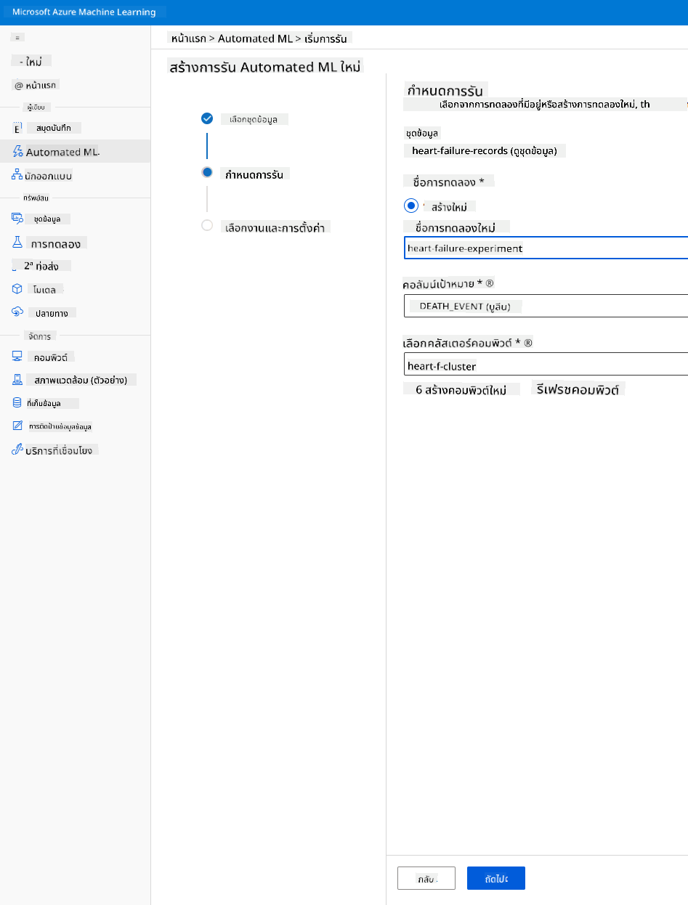

3. เลือก "Classification" และคลิก Finish ขั้นตอนนี้อาจใช้เวลาระหว่าง 30 นาทีถึง 1 ชั่วโมง ขึ้นอยู่กับขนาด compute cluster
    
    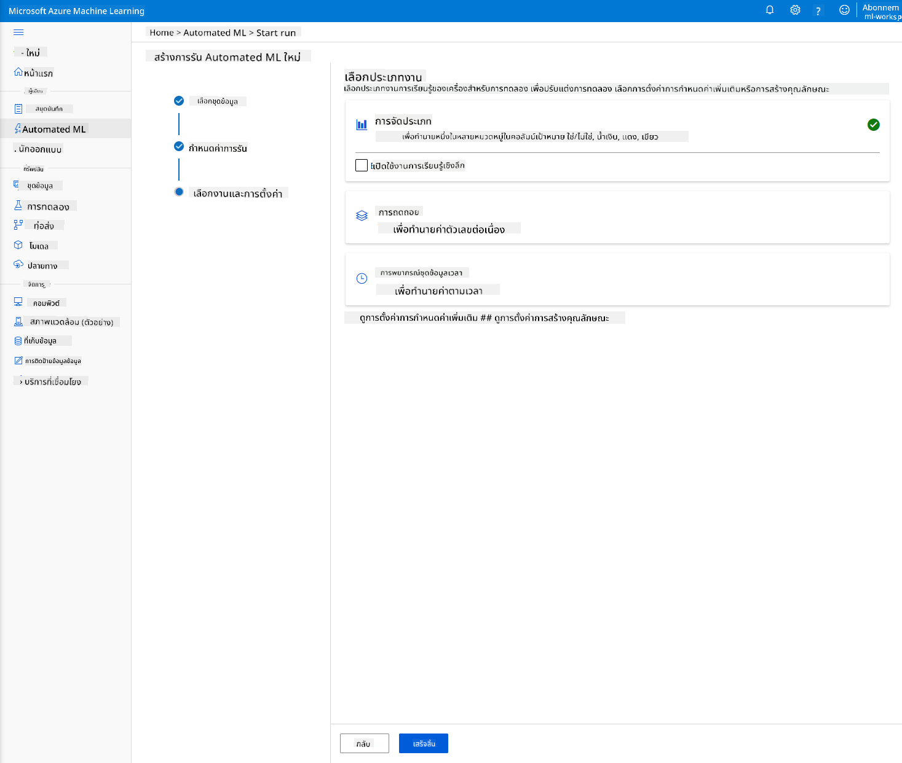

4. เมื่อการรันเสร็จสิ้น คลิกที่แท็บ "Automated ML" คลิกที่การรันของคุณ และคลิกที่ Algorithm ในการ์ด "Best model summary"
    
    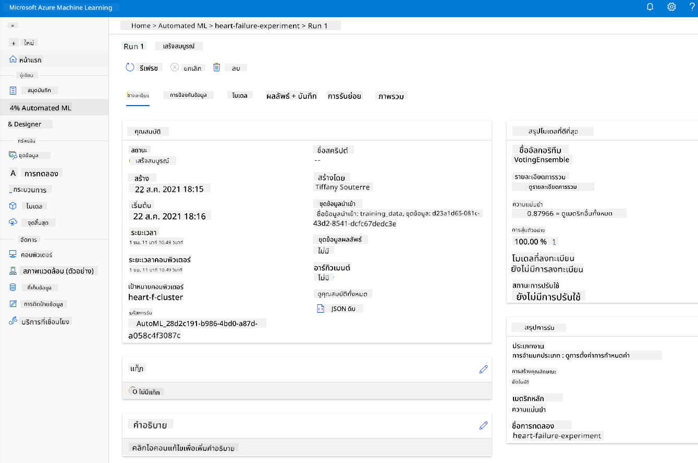

ที่นี่คุณสามารถดูคำอธิบายรายละเอียดของโมเดลที่ดีที่สุดที่ AutoML สร้างขึ้น คุณยังสามารถสำรวจโมเดลอื่นๆ ที่สร้างขึ้นในแท็บ Models ใช้เวลาสักครู่เพื่อสำรวจโมเดลในปุ่ม Explanations (preview) เมื่อคุณเลือกโมเดลที่ต้องการใช้ (ในที่นี้เราจะเลือกโมเดลที่ดีที่สุดที่ AutoML เลือก) เราจะดูวิธีการ deploy โมเดลนั้น

## 3. การ deploy โมเดลและการใช้งาน endpoint แบบ Low code/No Code
### 3.1 การ deploy โมเดล

อินเทอร์เฟซ AutoML ช่วยให้คุณ deploy โมเดลที่ดีที่สุดเป็นบริการเว็บได้ในไม่กี่ขั้นตอน การ deploy คือการรวมโมเดลเพื่อให้สามารถทำการพยากรณ์ตามข้อมูลใหม่และระบุพื้นที่ที่มีโอกาส สำหรับโปรเจกต์นี้ การ deploy ไปยังบริการเว็บหมายความว่าแอปพลิเคชันทางการแพทย์จะสามารถใช้โมเดลเพื่อทำการพยากรณ์สดเกี่ยวกับความเสี่ยงของผู้ป่วยที่จะเกิดหัวใจวาย

ในคำอธิบายโมเดลที่ดีที่สุด คลิกที่ปุ่ม "Deploy"
    
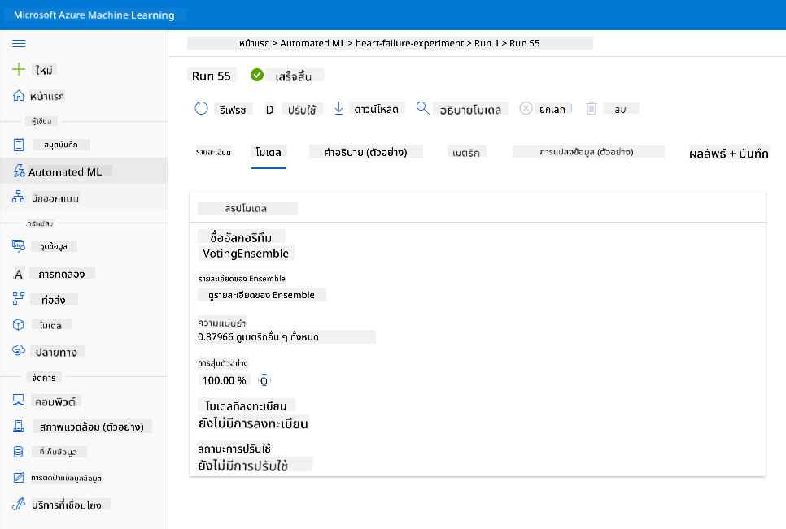

15. ตั้งชื่อ คำอธิบาย ประเภท compute (Azure Container Instance) เปิดใช้งานการตรวจสอบสิทธิ์ และคลิก Deploy ขั้นตอนนี้อาจใช้เวลาประมาณ 20 นาที การ deploy ประกอบด้วยหลายขั้นตอน รวมถึงการลงทะเบียนโมเดล การสร้างทรัพยากร และการกำหนดค่าทรัพยากรสำหรับบริการเว็บ ข้อความสถานะจะปรากฏใต้ Deploy status เลือก Refresh เป็นระยะเพื่อตรวจสอบสถานะการ deploy เมื่อสถานะเป็น "Healthy" หมายความว่าการ deploy เสร็จสมบูรณ์และกำลังทำงาน

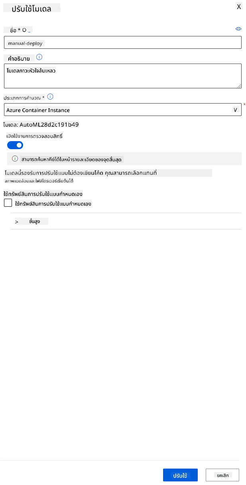

16. เมื่อ deploy เสร็จสิ้น คลิกที่แท็บ Endpoint และคลิกที่ endpoint ที่คุณเพิ่ง deploy คุณสามารถดูรายละเอียดทั้งหมดเกี่ยวกับ endpoint ได้ที่นี่ 

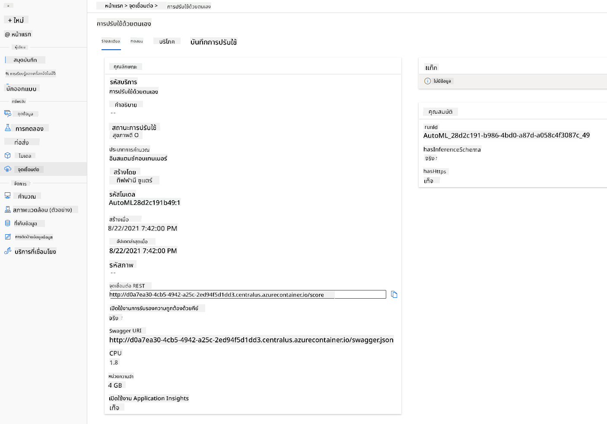

ยอดเยี่ยม! ตอนนี้เรามีโมเดลที่ deploy แล้ว เราสามารถเริ่มการใช้งาน endpoint ได้

### 3.2 การใช้งาน endpoint

คลิกที่แท็บ "Consume" ที่นี่คุณจะพบ REST endpoint และสคริปต์ Python ในตัวเลือกการใช้งาน ใช้เวลาสักครู่เพื่ออ่านโค้ด Python

สคริปต์นี้สามารถรันได้โดยตรงจากเครื่องของคุณและจะใช้งาน endpoint ของคุณ

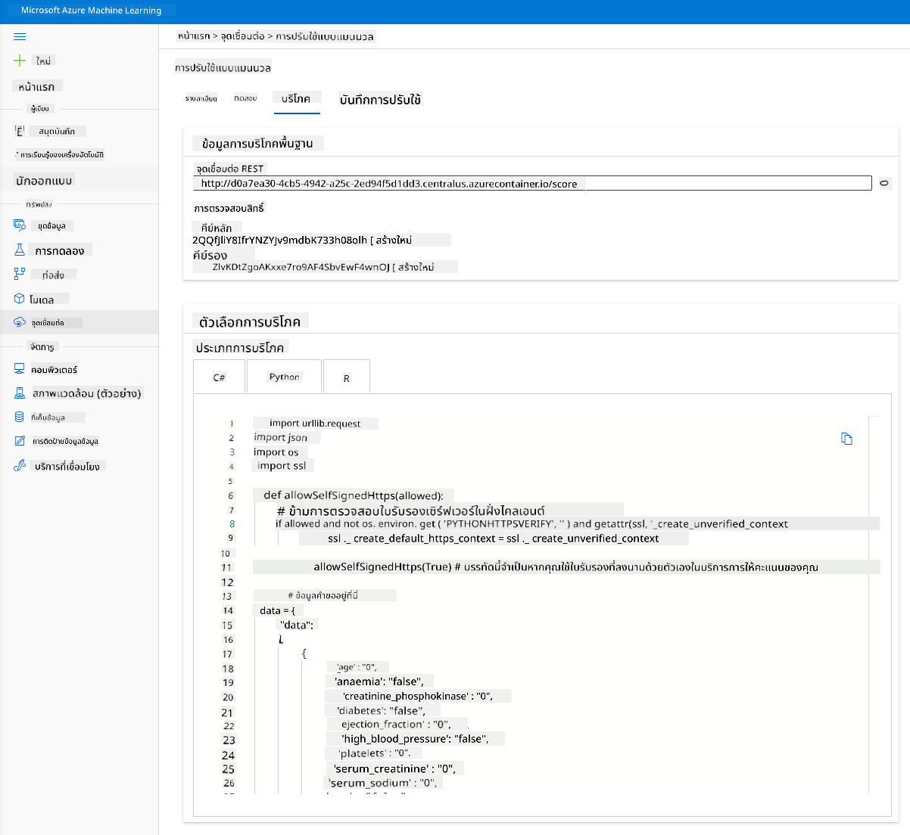

ใช้เวลาสักครู่เพื่อดูสองบรรทัดโค้ดนี้:

```python
url = 'http://98e3715f-xxxx-xxxx-xxxx-9ec22d57b796.centralus.azurecontainer.io/score'
api_key = '' # Replace this with the API key for the web service
```
ตัวแปร `url` คือ REST endpoint ที่พบในแท็บ Consume และตัวแปร `api_key` คือคีย์หลักที่พบในแท็บ Consume (เฉพาะในกรณีที่คุณเปิดใช้งานการตรวจสอบสิทธิ์) นี่คือวิธีที่สคริปต์สามารถใช้งาน endpoint ได้

18. เมื่อรันสคริปต์ คุณควรเห็นผลลัพธ์ดังนี้:
    ```python
    b'"{\\"result\\": [true]}"'
    ```
หมายความว่าการพยากรณ์ความล้มเหลวของหัวใจสำหรับข้อมูลที่ให้มาคือจริง ซึ่งสมเหตุสมผลเพราะหากคุณดูข้อมูลที่สร้างขึ้นโดยอัตโนมัติในสคริปต์ ทุกอย่างจะเป็น 0 และ false โดยค่าเริ่มต้น คุณสามารถเปลี่ยนข้อมูลด้วยตัวอย่างข้อมูลต่อไปนี้:

```python
data = {
    "data":
    [
        {
            'age': "0",
            'anaemia': "false",
            'creatinine_phosphokinase': "0",
            'diabetes': "false",
            'ejection_fraction': "0",
            'high_blood_pressure': "false",
            'platelets': "0",
            'serum_creatinine': "0",
            'serum_sodium': "0",
            'sex': "false",
            'smoking': "false",
            'time': "0",
        },
        {
            'age': "60",
            'anaemia': "false",
            'creatinine_phosphokinase': "500",
            'diabetes': "false",
            'ejection_fraction': "38",
            'high_blood_pressure': "false",
            'platelets': "260000",
            'serum_creatinine': "1.40",
            'serum_sodium': "137",
            'sex': "false",
            'smoking': "false",
            'time': "130",
        },
    ],
}
```
สคริปต์ควรแสดงผลลัพธ์:
    ```python
    b'"{\\"result\\": [true, false]}"'
    ```

ขอแสดงความยินดี! คุณเพิ่งใช้งานโมเดลที่ deploy และฝึกบน Azure ML!

> **_NOTE:_** เมื่อคุณทำโปรเจกต์เสร็จแล้ว อย่าลืมลบทรัพยากรทั้งหมด
## 🚀 Challenge

ดูรายละเอียดคำอธิบายโมเดลและข้อมูลที่ AutoML สร้างขึ้นสำหรับโมเดลที่ดีที่สุด ลองทำความเข้าใจว่าทำไมโมเดลที่ดีที่สุดถึงดีกว่าโมเดลอื่นๆ อัลกอริทึมใดที่ถูกเปรียบเทียบ? ความแตกต่างระหว่างพวกมันคืออะไร? ทำไมโมเดลที่ดีที่สุดถึงมีประสิทธิภาพดีกว่าในกรณีนี้?

## [Post-lecture quiz](https://ff-quizzes.netlify.app/en/ds/)

## Review & Self Study

ในบทเรียนนี้ คุณได้เรียนรู้วิธีการฝึก, deploy และใช้งานโมเดลเพื่อพยากรณ์ความเสี่ยงของหัวใจวายในรูปแบบ Low code/No code บนคลาวด์ หากคุณยังไม่ได้ทำ ลองเจาะลึกคำอธิบายโมเดลที่ AutoML สร้างขึ้นสำหรับโมเดลที่ดีที่สุด และพยายามทำความเข้าใจว่าทำไมโมเดลที่ดีที่สุดถึงดีกว่าโมเดลอื่นๆ

คุณสามารถศึกษาต่อเกี่ยวกับ AutoML แบบ Low code/No code ได้โดยอ่าน [เอกสารนี้](https://docs.microsoft.com/azure/machine-learning/tutorial-first-experiment-automated-ml?WT.mc_id=academic-77958-bethanycheum&ocid=AID3041109)

## Assignment

[โปรเจกต์ Data Science แบบ Low code/No code บน Azure ML](assignment.md)

---

**ข้อจำกัดความรับผิดชอบ**:  
เอกสารนี้ได้รับการแปลโดยใช้บริการแปลภาษา AI [Co-op Translator](https://github.com/Azure/co-op-translator) แม้ว่าเราจะพยายามให้การแปลมีความถูกต้องมากที่สุด แต่โปรดทราบว่าการแปลอัตโนมัติอาจมีข้อผิดพลาดหรือความไม่ถูกต้อง เอกสารต้นฉบับในภาษาที่เป็นต้นฉบับควรถือเป็นแหล่งข้อมูลที่เชื่อถือได้ สำหรับข้อมูลที่สำคัญ ขอแนะนำให้ใช้บริการแปลภาษามืออาชีพ เราไม่รับผิดชอบต่อความเข้าใจผิดหรือการตีความผิดที่เกิดจากการใช้การแปลนี้