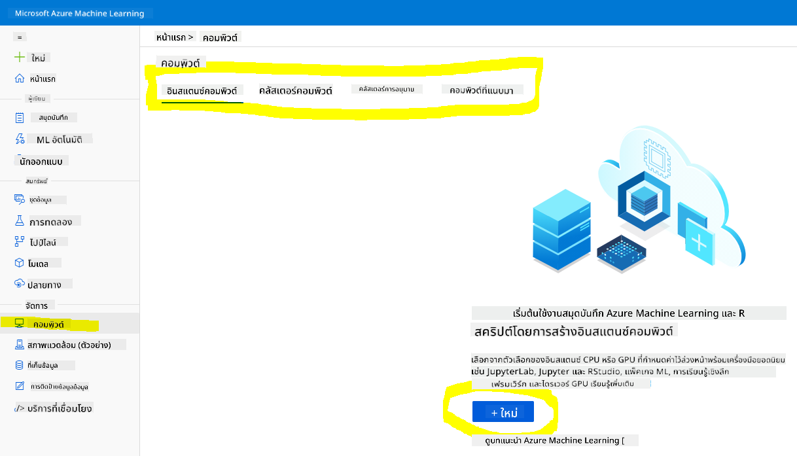
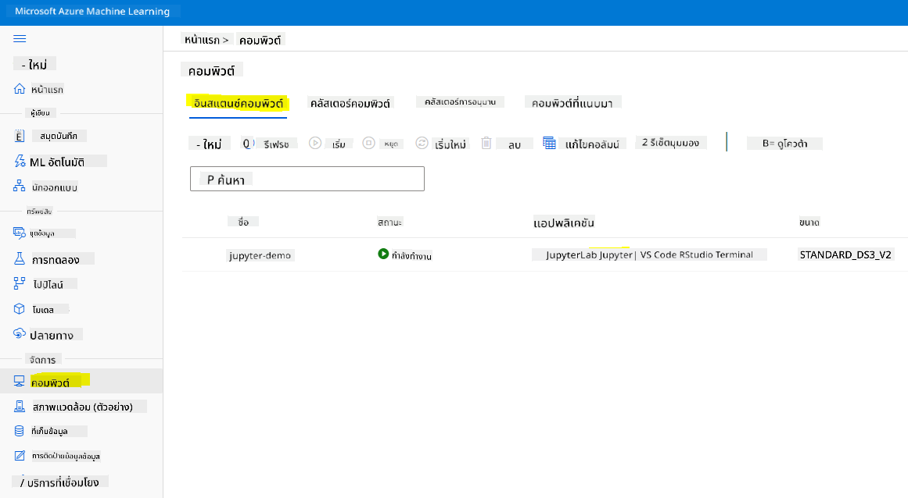
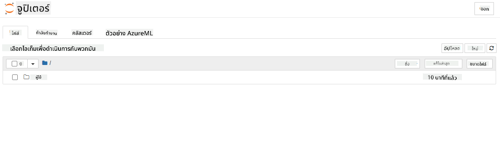

<!--
CO_OP_TRANSLATOR_METADATA:
{
  "original_hash": "5da2d6b3736f6d668b89de9bf3bdd31b",
  "translation_date": "2025-09-04T18:43:01+00:00",
  "source_file": "5-Data-Science-In-Cloud/19-Azure/README.md",
  "language_code": "th"
}
-->
# วิทยาศาสตร์ข้อมูลในระบบคลาวด์: วิธีการ "Azure ML SDK"

|](../../sketchnotes/19-DataScience-Cloud.png)|
|:---:|
| วิทยาศาสตร์ข้อมูลในระบบคลาวด์: Azure ML SDK - _ภาพสเก็ตช์โดย [@nitya](https://twitter.com/nitya)_ |

สารบัญ:

- [วิทยาศาสตร์ข้อมูลในระบบคลาวด์: วิธีการ "Azure ML SDK"](../../../../5-Data-Science-In-Cloud/19-Azure)
  - [แบบทดสอบก่อนการบรรยาย](../../../../5-Data-Science-In-Cloud/19-Azure)
  - [1. บทนำ](../../../../5-Data-Science-In-Cloud/19-Azure)
    - [1.1 Azure ML SDK คืออะไร?](../../../../5-Data-Science-In-Cloud/19-Azure)
    - [1.2 โครงการทำนายภาวะหัวใจล้มเหลวและการแนะนำชุดข้อมูล](../../../../5-Data-Science-In-Cloud/19-Azure)
  - [2. การฝึกโมเดลด้วย Azure ML SDK](../../../../5-Data-Science-In-Cloud/19-Azure)
    - [2.1 สร้าง Azure ML workspace](../../../../5-Data-Science-In-Cloud/19-Azure)
    - [2.2 สร้าง compute instance](../../../../5-Data-Science-In-Cloud/19-Azure)
    - [2.3 การโหลดชุดข้อมูล](../../../../5-Data-Science-In-Cloud/19-Azure)
    - [2.4 การสร้าง Notebook](../../../../5-Data-Science-In-Cloud/19-Azure)
    - [2.5 การฝึกโมเดล](../../../../5-Data-Science-In-Cloud/19-Azure)
      - [2.5.1 การตั้งค่า Workspace, experiment, compute cluster และ dataset](../../../../5-Data-Science-In-Cloud/19-Azure)
      - [2.5.2 การตั้งค่า AutoML และการฝึก](../../../../5-Data-Science-In-Cloud/19-Azure)
  - [3. การปรับใช้โมเดลและการใช้งาน endpoint ด้วย Azure ML SDK](../../../../5-Data-Science-In-Cloud/19-Azure)
    - [3.1 การบันทึกโมเดลที่ดีที่สุด](../../../../5-Data-Science-In-Cloud/19-Azure)
    - [3.2 การปรับใช้โมเดล](../../../../5-Data-Science-In-Cloud/19-Azure)
    - [3.3 การใช้งาน endpoint](../../../../5-Data-Science-In-Cloud/19-Azure)
  - [🚀 ความท้าทาย](../../../../5-Data-Science-In-Cloud/19-Azure)
  - [แบบทดสอบหลังการบรรยาย](../../../../5-Data-Science-In-Cloud/19-Azure)
  - [การทบทวนและการศึกษาด้วยตนเอง](../../../../5-Data-Science-In-Cloud/19-Azure)
  - [การบ้าน](../../../../5-Data-Science-In-Cloud/19-Azure)

## [แบบทดสอบก่อนการบรรยาย](https://purple-hill-04aebfb03.1.azurestaticapps.net/quiz/36)

## 1. บทนำ

### 1.1 Azure ML SDK คืออะไร?

นักวิทยาศาสตร์ข้อมูลและนักพัฒนา AI ใช้ Azure Machine Learning SDK เพื่อสร้างและดำเนินการเวิร์กโฟลว์การเรียนรู้ของเครื่องด้วยบริการ Azure Machine Learning คุณสามารถโต้ตอบกับบริการนี้ในสภาพแวดล้อม Python ใด ๆ เช่น Jupyter Notebooks, Visual Studio Code หรือ IDE Python ที่คุณชื่นชอบ

พื้นที่สำคัญของ SDK ได้แก่:

- สำรวจ เตรียม และจัดการวงจรชีวิตของชุดข้อมูลที่ใช้ในการทดลองการเรียนรู้ของเครื่อง
- จัดการทรัพยากรคลาวด์สำหรับการตรวจสอบ การบันทึก และการจัดระเบียบการทดลองการเรียนรู้ของเครื่อง
- ฝึกโมเดลทั้งในเครื่องหรือโดยใช้ทรัพยากรคลาวด์ รวมถึงการฝึกโมเดลที่เร่งด้วย GPU
- ใช้การเรียนรู้ของเครื่องแบบอัตโนมัติ ซึ่งรับพารามิเตอร์การกำหนดค่าและข้อมูลการฝึกฝน และทำการวนซ้ำผ่านอัลกอริทึมและการตั้งค่าพารามิเตอร์เพื่อค้นหาโมเดลที่ดีที่สุดสำหรับการทำนาย
- ปรับใช้บริการเว็บเพื่อแปลงโมเดลที่ฝึกฝนแล้วของคุณให้เป็นบริการ RESTful ที่สามารถใช้งานในแอปพลิเคชันใด ๆ

[เรียนรู้เพิ่มเติมเกี่ยวกับ Azure Machine Learning SDK](https://docs.microsoft.com/python/api/overview/azure/ml?WT.mc_id=academic-77958-bethanycheum&ocid=AID3041109)

ใน [บทเรียนก่อนหน้า](../18-Low-Code/README.md) เราได้เห็นวิธีการฝึก ปรับใช้ และใช้งานโมเดลในรูปแบบ Low code/No code โดยใช้ชุดข้อมูลภาวะหัวใจล้มเหลวเพื่อสร้างโมเดลทำนายภาวะหัวใจล้มเหลว ในบทเรียนนี้ เราจะทำสิ่งเดียวกันแต่ใช้ Azure Machine Learning SDK


### 1.2 โครงการทำนายภาวะหัวใจล้มเหลวและการแนะนำชุดข้อมูล

ดู [ที่นี่](../18-Low-Code/README.md) สำหรับการแนะนำโครงการทำนายภาวะหัวใจล้มเหลวและชุดข้อมูล

## 2. การฝึกโมเดลด้วย Azure ML SDK
### 2.1 สร้าง Azure ML workspace

เพื่อความง่าย เราจะทำงานใน jupyter notebook ซึ่งหมายความว่าคุณมี Workspace และ compute instance อยู่แล้ว หากคุณมี Workspace อยู่แล้ว คุณสามารถข้ามไปยังส่วน 2.3 การสร้าง Notebook ได้เลย

หากยังไม่มี โปรดทำตามคำแนะนำในส่วน **2.1 สร้าง Azure ML workspace** ใน [บทเรียนก่อนหน้า](../18-Low-Code/README.md) เพื่อสร้าง Workspace

### 2.2 สร้าง compute instance

ใน [Azure ML workspace](https://ml.azure.com/) ที่เราสร้างไว้ก่อนหน้านี้ ไปที่เมนู compute และคุณจะเห็นทรัพยากร compute ต่าง ๆ ที่มีอยู่



มาสร้าง compute instance เพื่อจัดเตรียม jupyter notebook กันเถอะ
1. คลิกปุ่ม + New
2. ตั้งชื่อ compute instance ของคุณ
3. เลือกตัวเลือกของคุณ: CPU หรือ GPU, ขนาด VM และจำนวนคอร์
4. คลิกปุ่ม Create

ยินดีด้วย คุณเพิ่งสร้าง compute instance เสร็จแล้ว! เราจะใช้ compute instance นี้เพื่อสร้าง Notebook ในส่วน [การสร้าง Notebook](../../../../5-Data-Science-In-Cloud/19-Azure)

### 2.3 การโหลดชุดข้อมูล
ดู [บทเรียนก่อนหน้า](../18-Low-Code/README.md) ในส่วน **2.3 การโหลดชุดข้อมูล** หากคุณยังไม่ได้อัปโหลดชุดข้อมูล

### 2.4 การสร้าง Notebook

> **_หมายเหตุ:_** สำหรับขั้นตอนถัดไป คุณสามารถสร้าง Notebook ใหม่ตั้งแต่ต้น หรืออัปโหลด [Notebook ที่เราสร้างไว้](notebook.ipynb) ใน Azure ML Studio ของคุณได้ หากต้องการอัปโหลด เพียงคลิกที่เมนู "Notebook" และอัปโหลด Notebook

Notebook เป็นส่วนสำคัญของกระบวนการวิทยาศาสตร์ข้อมูล สามารถใช้เพื่อทำการวิเคราะห์ข้อมูลเชิงสำรวจ (EDA) เรียกใช้คลัสเตอร์คอมพิวเตอร์เพื่อฝึกโมเดล หรือเรียกใช้คลัสเตอร์การอนุมานเพื่อปรับใช้ endpoint

ในการสร้าง Notebook เราต้องมี compute node ที่ให้บริการ jupyter notebook instance กลับไปที่ [Azure ML workspace](https://ml.azure.com/) และคลิกที่ Compute instances ในรายการ compute instances คุณควรเห็น [compute instance ที่เราสร้างไว้ก่อนหน้านี้](../../../../5-Data-Science-In-Cloud/19-Azure)

1. ในส่วน Applications คลิกที่ตัวเลือก Jupyter
2. ติ๊กช่อง "Yes, I understand" และคลิกปุ่ม Continue

3. สิ่งนี้จะเปิดแท็บเบราว์เซอร์ใหม่พร้อม jupyter notebook instance ของคุณ คลิกปุ่ม "New" เพื่อสร้าง Notebook



ตอนนี้เรามี Notebook แล้ว เราสามารถเริ่มฝึกโมเดลด้วย Azure ML SDK ได้

### 2.5 การฝึกโมเดล

ก่อนอื่น หากคุณมีข้อสงสัยใด ๆ ให้ดู [เอกสาร Azure ML SDK](https://docs.microsoft.com/python/api/overview/azure/ml?WT.mc_id=academic-77958-bethanycheum&ocid=AID3041109) ซึ่งมีข้อมูลที่จำเป็นทั้งหมดเพื่อทำความเข้าใจโมดูลที่เราจะดูในบทเรียนนี้

#### 2.5.1 การตั้งค่า Workspace, experiment, compute cluster และ dataset

คุณต้องโหลด `workspace` จากไฟล์การกำหนดค่าด้วยโค้ดต่อไปนี้:

```python
from azureml.core import Workspace
ws = Workspace.from_config()
```

สิ่งนี้จะส่งคืนออบเจ็กต์ประเภท `Workspace` ที่แสดงถึง workspace จากนั้นคุณต้องสร้าง `experiment` ด้วยโค้ดต่อไปนี้:

```python
from azureml.core import Experiment
experiment_name = 'aml-experiment'
experiment = Experiment(ws, experiment_name)
```
ในการรับหรือสร้าง experiment จาก workspace คุณต้องร้องขอ experiment โดยใช้ชื่อ experiment ชื่อ experiment ต้องมีความยาว 3-36 ตัวอักษร เริ่มต้นด้วยตัวอักษรหรือตัวเลข และสามารถมีได้เฉพาะตัวอักษร ตัวเลข ขีดล่าง และขีดกลาง หากไม่พบ experiment ใน workspace จะมีการสร้าง experiment ใหม่

ตอนนี้คุณต้องสร้าง compute cluster สำหรับการฝึกด้วยโค้ดต่อไปนี้ โปรดทราบว่าขั้นตอนนี้อาจใช้เวลาสักครู่

```python
from azureml.core.compute import AmlCompute

aml_name = "heart-f-cluster"
try:
    aml_compute = AmlCompute(ws, aml_name)
    print('Found existing AML compute context.')
except:
    print('Creating new AML compute context.')
    aml_config = AmlCompute.provisioning_configuration(vm_size = "Standard_D2_v2", min_nodes=1, max_nodes=3)
    aml_compute = AmlCompute.create(ws, name = aml_name, provisioning_configuration = aml_config)
    aml_compute.wait_for_completion(show_output = True)

cts = ws.compute_targets
compute_target = cts[aml_name]
```

คุณสามารถรับ dataset จาก workspace โดยใช้ชื่อ dataset ในลักษณะต่อไปนี้:

```python
dataset = ws.datasets['heart-failure-records']
df = dataset.to_pandas_dataframe()
df.describe()
```
#### 2.5.2 การตั้งค่า AutoML และการฝึก

ในการตั้งค่าการกำหนดค่า AutoML ให้ใช้ [AutoMLConfig class](https://docs.microsoft.com/python/api/azureml-train-automl-client/azureml.train.automl.automlconfig(class)?WT.mc_id=academic-77958-bethanycheum&ocid=AID3041109)

ตามที่อธิบายในเอกสาร มีพารามิเตอร์มากมายที่คุณสามารถปรับแต่งได้ สำหรับโครงการนี้ เราจะใช้พารามิเตอร์ดังต่อไปนี้:

- `experiment_timeout_minutes`: เวลาสูงสุด (เป็นนาที) ที่อนุญาตให้ experiment ทำงานก่อนที่จะหยุดโดยอัตโนมัติและผลลัพธ์จะถูกสร้างขึ้นโดยอัตโนมัติ
- `max_concurrent_iterations`: จำนวนการวนซ้ำการฝึกสูงสุดที่อนุญาตสำหรับ experiment
- `primary_metric`: เมตริกหลักที่ใช้ในการกำหนดสถานะของ experiment
- `compute_target`: เป้าหมายการคำนวณ Azure Machine Learning ที่ใช้ในการรัน experiment การเรียนรู้ของเครื่องแบบอัตโนมัติ
- `task`: ประเภทของงานที่จะรัน ค่าอาจเป็น 'classification', 'regression' หรือ 'forecasting' ขึ้นอยู่กับประเภทของปัญหา Automated ML ที่ต้องแก้ไข
- `training_data`: ข้อมูลการฝึกที่ใช้ใน experiment ควรมีทั้งคุณลักษณะการฝึกและคอลัมน์ป้ายกำกับ (อาจมีคอลัมน์น้ำหนักตัวอย่าง)
- `label_column_name`: ชื่อของคอลัมน์ป้ายกำกับ
- `path`: เส้นทางเต็มไปยังโฟลเดอร์โครงการ Azure Machine Learning
- `enable_early_stopping`: เปิดใช้งานการหยุดก่อนกำหนดหรือไม่ หากคะแนนไม่ดีขึ้นในระยะสั้น
- `featurization`: ตัวบ่งชี้ว่าควรทำขั้นตอนการสร้างคุณลักษณะโดยอัตโนมัติหรือไม่ หรือควรใช้การสร้างคุณลักษณะแบบกำหนดเอง
- `debug_log`: ไฟล์บันทึกเพื่อเขียนข้อมูลการดีบัก

```python
from azureml.train.automl import AutoMLConfig

project_folder = './aml-project'

automl_settings = {
    "experiment_timeout_minutes": 20,
    "max_concurrent_iterations": 3,
    "primary_metric" : 'AUC_weighted'
}

automl_config = AutoMLConfig(compute_target=compute_target,
                             task = "classification",
                             training_data=dataset,
                             label_column_name="DEATH_EVENT",
                             path = project_folder,  
                             enable_early_stopping= True,
                             featurization= 'auto',
                             debug_log = "automl_errors.log",
                             **automl_settings
                            )
```
ตอนนี้คุณตั้งค่าการกำหนดค่าเรียบร้อยแล้ว คุณสามารถฝึกโมเดลด้วยโค้ดต่อไปนี้ ขั้นตอนนี้อาจใช้เวลาถึงหนึ่งชั่วโมงขึ้นอยู่กับขนาดคลัสเตอร์ของคุณ

```python
remote_run = experiment.submit(automl_config)
```
คุณสามารถรัน RunDetails widget เพื่อแสดง experiment ต่าง ๆ
```python
from azureml.widgets import RunDetails
RunDetails(remote_run).show()
```
## 3. การปรับใช้โมเดลและการใช้งาน endpoint ด้วย Azure ML SDK

### 3.1 การบันทึกโมเดลที่ดีที่สุด

`remote_run` เป็นออบเจ็กต์ประเภท [AutoMLRun](https://docs.microsoft.com/python/api/azureml-train-automl-client/azureml.train.automl.run.automlrun?WT.mc_id=academic-77958-bethanycheum&ocid=AID3041109) ออบเจ็กต์นี้มีเมธอด `get_output()` ซึ่งส่งคืนการรันที่ดีที่สุดและโมเดลที่เหมาะสมที่สุด

```python
best_run, fitted_model = remote_run.get_output()
```
คุณสามารถดูพารามิเตอร์ที่ใช้สำหรับโมเดลที่ดีที่สุดได้โดยการพิมพ์ fitted_model และดูคุณสมบัติของโมเดลที่ดีที่สุดโดยใช้เมธอด [get_properties()](https://docs.microsoft.com/python/api/azureml-core/azureml.core.run(class)?view=azure-ml-py#azureml_core_Run_get_properties?WT.mc_id=academic-77958-bethanycheum&ocid=AID3041109)

```python
best_run.get_properties()
```

ตอนนี้ลงทะเบียนโมเดลด้วยเมธอด [register_model](https://docs.microsoft.com/python/api/azureml-train-automl-client/azureml.train.automl.run.automlrun?view=azure-ml-py#register-model-model-name-none--description-none--tags-none--iteration-none--metric-none-?WT.mc_id=academic-77958-bethanycheum&ocid=AID3041109)
```python
model_name = best_run.properties['model_name']
script_file_name = 'inference/score.py'
best_run.download_file('outputs/scoring_file_v_1_0_0.py', 'inference/score.py')
description = "aml heart failure project sdk"
model = best_run.register_model(model_name = model_name,
                                model_path = './outputs/',
                                description = description,
                                tags = None)
```
### 3.2 การปรับใช้โมเดล

เมื่อบันทึกโมเดลที่ดีที่สุดแล้ว เราสามารถปรับใช้ได้ด้วยคลาส [InferenceConfig](https://docs.microsoft.com/python/api/azureml-core/azureml.core.model.inferenceconfig?view=azure-ml-py?ocid=AID3041109) ซึ่งแสดงถึงการตั้งค่าการกำหนดค่าสำหรับสภาพแวดล้อมที่กำหนดเองที่ใช้สำหรับการปรับใช้ คลาส [AciWebservice](https://docs.microsoft.com/python/api/azureml-core/azureml.core.webservice.aciwebservice?view=azure-ml-py) แสดงถึงโมเดลการเรียนรู้ของเครื่องที่ปรับใช้เป็น endpoint บริการเว็บบน Azure Container Instances บริการเว็บที่ปรับใช้จะถูกสร้างขึ้นจากโมเดล สคริปต์ และไฟล์ที่เกี่ยวข้อง บริการเว็บที่ได้จะเป็น HTTP endpoint ที่มี REST API คุณสามารถส่งข้อมูลไปยัง API นี้และรับการทำนายที่ส่งคืนโดยโมเดล

โมเดลถูกปรับใช้โดยใช้เมธอด [deploy](https://docs.microsoft.com/python/api/azureml-core/azureml.core.model(class)?view=azure-ml-py#deploy-workspace--name--models--inference-config-none--deployment-config-none--deployment-target-none--overwrite-false--show-output-false-?WT.mc_id=academic-77958-bethanycheum&ocid=AID3041109)

```python
from azureml.core.model import InferenceConfig, Model
from azureml.core.webservice import AciWebservice

inference_config = InferenceConfig(entry_script=script_file_name, environment=best_run.get_environment())

aciconfig = AciWebservice.deploy_configuration(cpu_cores = 1,
                                               memory_gb = 1,
                                               tags = {'type': "automl-heart-failure-prediction"},
                                               description = 'Sample service for AutoML Heart Failure Prediction')

aci_service_name = 'automl-hf-sdk'
aci_service = Model.deploy(ws, aci_service_name, [model], inference_config, aciconfig)
aci_service.wait_for_deployment(True)
print(aci_service.state)
```
ขั้นตอนนี้อาจใช้เวลาสักครู่

### 3.3 การใช้งาน endpoint

คุณสามารถใช้งาน endpoint ของคุณโดยการสร้างตัวอย่าง input:

```python
data = {
    "data":
    [
        {
            'age': "60",
            'anaemia': "false",
            'creatinine_phosphokinase': "500",
            'diabetes': "false",
            'ejection_fraction': "38",
            'high_blood_pressure': "false",
            'platelets': "260000",
            'serum_creatinine': "1.40",
            'serum_sodium': "137",
            'sex': "false",
            'smoking': "false",
            'time': "130",
        },
    ],
}

test_sample = str.encode(json.dumps(data))
```
จากนั้นคุณสามารถส่ง input นี้ไปยังโมเดลของคุณเพื่อการทำนาย:
```python
response = aci_service.run(input_data=test_sample)
response
```
ผลลัพธ์ควรเป็น `'{"result": [false]}'` ซึ่งหมายความว่าข้อมูลผู้ป่วยที่เราส่งไปยัง endpoint ได้สร้างการทำนายเป็น `false` ซึ่งหมายความว่าบุคคลนี้ไม่น่าจะมีความเสี่ยงต่อการเกิดโรคหัวใจวาย

ยินดีด้วย! คุณเพิ่งใช้โมเดลที่ถูก deploy และ train บน Azure ML ด้วย Azure ML SDK!

> **_NOTE:_** เมื่อคุณทำโปรเจกต์เสร็จแล้ว อย่าลืมลบทรัพยากรทั้งหมด

## 🚀 ความท้าทาย

ยังมีสิ่งอื่นๆ อีกมากมายที่คุณสามารถทำได้ผ่าน SDK แต่โชคร้ายที่เราไม่สามารถครอบคลุมทั้งหมดในบทเรียนนี้ แต่ข่าวดีคือ การเรียนรู้วิธีค้นหาข้อมูลในเอกสาร SDK จะช่วยให้คุณก้าวหน้าไปได้ไกลด้วยตัวเอง ลองดูเอกสาร Azure ML SDK และค้นหา `Pipeline` class ที่ช่วยให้คุณสร้าง pipeline ได้ Pipeline คือชุดของขั้นตอนที่สามารถดำเนินการเป็น workflow ได้

**HINT:** ไปที่ [SDK documentation](https://docs.microsoft.com/python/api/overview/azure/ml/?view=azure-ml-py?WT.mc_id=academic-77958-bethanycheum&ocid=AID3041109) และพิมพ์คำสำคัญในช่องค้นหา เช่น "Pipeline" คุณควรเห็น `azureml.pipeline.core.Pipeline` class ในผลการค้นหา

## [แบบทดสอบหลังบทเรียน](https://ff-quizzes.netlify.app/en/ds/)

## ทบทวนและศึกษาด้วยตัวเอง

ในบทเรียนนี้ คุณได้เรียนรู้วิธี train, deploy และใช้โมเดลเพื่อทำนายความเสี่ยงของโรคหัวใจวายด้วย Azure ML SDK บนคลาวด์ ลองดู [เอกสารนี้](https://docs.microsoft.com/python/api/overview/azure/ml/?view=azure-ml-py?WT.mc_id=academic-77958-bethanycheum&ocid=AID3041109) เพื่อข้อมูลเพิ่มเติมเกี่ยวกับ Azure ML SDK และลองสร้างโมเดลของคุณเองด้วย Azure ML SDK

## งานที่ได้รับมอบหมาย

[โปรเจกต์ Data Science โดยใช้ Azure ML SDK](assignment.md)

---

**ข้อจำกัดความรับผิดชอบ**:  
เอกสารนี้ได้รับการแปลโดยใช้บริการแปลภาษา AI [Co-op Translator](https://github.com/Azure/co-op-translator) แม้ว่าเราจะพยายามให้การแปลมีความถูกต้อง แต่โปรดทราบว่าการแปลอัตโนมัติอาจมีข้อผิดพลาดหรือความไม่ถูกต้อง เอกสารต้นฉบับในภาษาดั้งเดิมควรถือเป็นแหล่งข้อมูลที่เชื่อถือได้ สำหรับข้อมูลที่สำคัญ ขอแนะนำให้ใช้บริการแปลภาษามืออาชีพ เราจะไม่รับผิดชอบต่อความเข้าใจผิดหรือการตีความผิดที่เกิดจากการใช้การแปลนี้