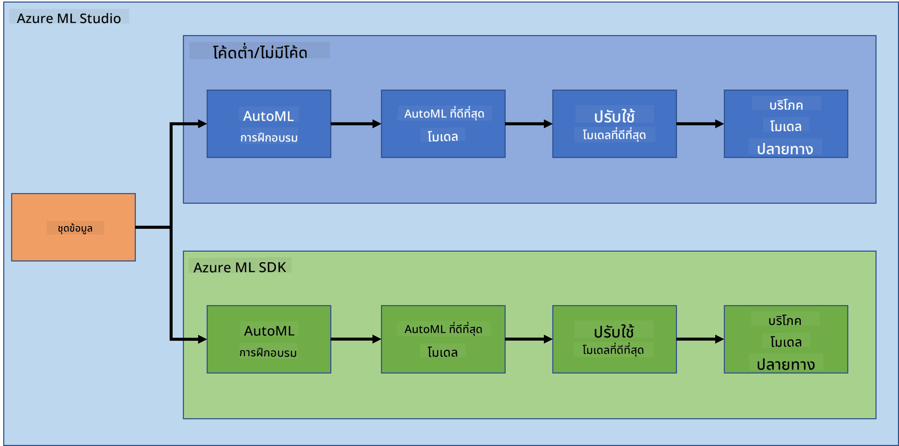

<!--
CO_OP_TRANSLATOR_METADATA:
{
  "original_hash": "8dfe141a0f46f7d253e07f74913c7f44",
  "translation_date": "2025-08-26T21:56:59+00:00",
  "source_file": "5-Data-Science-In-Cloud/README.md",
  "language_code": "th"
}
-->
# วิทยาศาสตร์ข้อมูลบนคลาวด์

> ภาพโดย [Jelleke Vanooteghem](https://unsplash.com/@ilumire) จาก [Unsplash](https://unsplash.com/s/photos/cloud?orientation=landscape)

เมื่อพูดถึงการทำวิทยาศาสตร์ข้อมูลกับข้อมูลขนาดใหญ่ คลาวด์สามารถเปลี่ยนเกมได้อย่างมาก ในสามบทเรียนถัดไป เราจะมาดูกันว่าคลาวด์คืออะไรและทำไมมันถึงมีประโยชน์มาก นอกจากนี้ เรายังจะสำรวจชุดข้อมูลเกี่ยวกับภาวะหัวใจล้มเหลวและสร้างโมเดลเพื่อช่วยประเมินความน่าจะเป็นที่ใครบางคนจะมีภาวะหัวใจล้มเหลว เราจะใช้พลังของคลาวด์ในการฝึกอบรม, ปรับใช้ และใช้งานโมเดลในสองวิธีที่แตกต่างกัน วิธีแรกใช้เฉพาะอินเทอร์เฟซผู้ใช้ในรูปแบบ Low code/No code และอีกวิธีใช้ Azure Machine Learning Software Developer Kit (Azure ML SDK)

### หัวข้อ

1. [ทำไมต้องใช้คลาวด์สำหรับวิทยาศาสตร์ข้อมูล?](17-Introduction/README.md)  
2. [วิทยาศาสตร์ข้อมูลบนคลาวด์: วิธี "Low code/No code"](18-Low-Code/README.md)  
3. [วิทยาศาสตร์ข้อมูลบนคลาวด์: วิธี "Azure ML SDK"](19-Azure/README.md)  

### เครดิต
บทเรียนเหล่านี้เขียนขึ้นด้วย ☁️ และ 💕 โดย [Maud Levy](https://twitter.com/maudstweets) และ [Tiffany Souterre](https://twitter.com/TiffanySouterre)

ข้อมูลสำหรับโครงการพยากรณ์ภาวะหัวใจล้มเหลวได้มาจาก [
Larxel](https://www.kaggle.com/andrewmvd) บน [Kaggle](https://www.kaggle.com/andrewmvd/heart-failure-clinical-data) โดยได้รับอนุญาตภายใต้ [Attribution 4.0 International (CC BY 4.0)](https://creativecommons.org/licenses/by/4.0/)

---

**ข้อจำกัดความรับผิดชอบ**:  
เอกสารนี้ได้รับการแปลโดยใช้บริการแปลภาษา AI [Co-op Translator](https://github.com/Azure/co-op-translator) แม้ว่าเราจะพยายามให้การแปลมีความถูกต้องมากที่สุด แต่โปรดทราบว่าการแปลโดยอัตโนมัติอาจมีข้อผิดพลาดหรือความไม่ถูกต้อง เอกสารต้นฉบับในภาษาดั้งเดิมควรถือเป็นแหล่งข้อมูลที่เชื่อถือได้ สำหรับข้อมูลที่สำคัญ ขอแนะนำให้ใช้บริการแปลภาษามืออาชีพ เราไม่รับผิดชอบต่อความเข้าใจผิดหรือการตีความที่ผิดพลาดซึ่งเกิดจากการใช้การแปลนี้