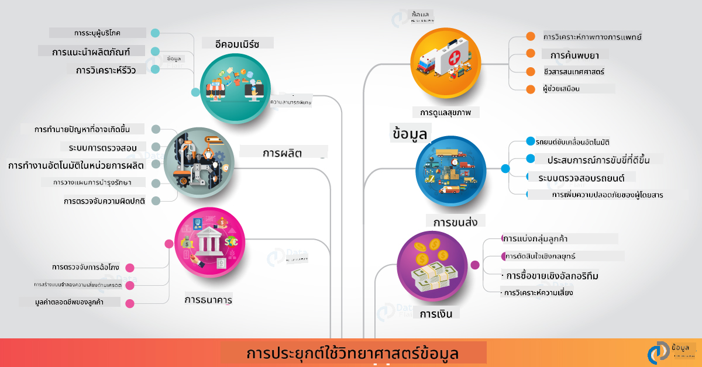

<!--
CO_OP_TRANSLATOR_METADATA:
{
  "original_hash": "f95679140c7cb39c30ccba535cd8f03f",
  "translation_date": "2025-09-04T18:54:52+00:00",
  "source_file": "6-Data-Science-In-Wild/20-Real-World-Examples/README.md",
  "language_code": "th"
}
-->
# วิทยาศาสตร์ข้อมูลในโลกแห่งความจริง

|  ](../../sketchnotes/20-DataScience-RealWorld.png) |
| :--------------------------------------------------------------------------------------------------------------: |
|               วิทยาศาสตร์ข้อมูลในโลกแห่งความจริง - _Sketchnote โดย [@nitya](https://twitter.com/nitya)_               |

เราใกล้จะถึงจุดสิ้นสุดของการเรียนรู้ครั้งนี้แล้ว!

เราเริ่มต้นด้วยการนิยามวิทยาศาสตร์ข้อมูลและจริยธรรม สำรวจเครื่องมือและเทคนิคต่าง ๆ สำหรับการวิเคราะห์และการแสดงผลข้อมูล ทบทวนวงจรชีวิตของวิทยาศาสตร์ข้อมูล และดูวิธีการขยายและทำให้กระบวนการวิทยาศาสตร์ข้อมูลเป็นอัตโนมัติด้วยบริการคลาวด์ ดังนั้น คุณอาจสงสัยว่า: _"เราจะนำสิ่งที่เรียนรู้ทั้งหมดนี้ไปใช้ในบริบทของโลกแห่งความจริงได้อย่างไร?"_

ในบทเรียนนี้ เราจะสำรวจการประยุกต์ใช้วิทยาศาสตร์ข้อมูลในโลกแห่งความจริงในอุตสาหกรรมต่าง ๆ และเจาะลึกตัวอย่างเฉพาะในบริบทของการวิจัย มนุษยศาสตร์ดิจิทัล และความยั่งยืน เราจะดูโอกาสในโครงการนักศึกษาและสรุปด้วยแหล่งข้อมูลที่มีประโยชน์เพื่อช่วยให้คุณเดินทางต่อไปในเส้นทางการเรียนรู้ของคุณ!

## แบบทดสอบก่อนการบรรยาย

[แบบทดสอบก่อนการบรรยาย](https://ff-quizzes.netlify.app/en/ds/)

## วิทยาศาสตร์ข้อมูล + อุตสาหกรรม

ด้วยการทำให้ AI เข้าถึงได้ง่ายขึ้น นักพัฒนาจึงสามารถออกแบบและผสานการตัดสินใจที่ขับเคลื่อนด้วย AI และข้อมูลเชิงลึกที่ขับเคลื่อนด้วยข้อมูลเข้าสู่ประสบการณ์ของผู้ใช้และกระบวนการพัฒนาได้ง่ายขึ้น ต่อไปนี้คือตัวอย่างบางส่วนของการที่วิทยาศาสตร์ข้อมูลถูก "ประยุกต์ใช้" ในโลกแห่งความจริงในอุตสาหกรรมต่าง ๆ:

 * [Google Flu Trends](https://www.wired.com/2015/10/can-learn-epic-failure-google-flu-trends/) ใช้วิทยาศาสตร์ข้อมูลเพื่อเชื่อมโยงคำค้นหากับแนวโน้มของไข้หวัดใหญ่ แม้ว่าวิธีการนี้จะมีข้อบกพร่อง แต่ก็ช่วยสร้างความตระหนักถึงความเป็นไปได้ (และความท้าทาย) ของการทำนายด้านสุขภาพที่ขับเคลื่อนด้วยข้อมูล

 * [UPS Routing Predictions](https://www.technologyreview.com/2018/11/21/139000/how-ups-uses-ai-to-outsmart-bad-weather/) - อธิบายว่า UPS ใช้วิทยาศาสตร์ข้อมูลและการเรียนรู้ของเครื่องเพื่อทำนายเส้นทางที่เหมาะสมที่สุดสำหรับการจัดส่ง โดยคำนึงถึงสภาพอากาศ รูปแบบการจราจร กำหนดเวลาการจัดส่ง และอื่น ๆ

 * [NYC Taxicab Route Visualization](http://chriswhong.github.io/nyctaxi/) - ข้อมูลที่รวบรวมโดยใช้ [Freedom Of Information Laws](https://chriswhong.com/open-data/foil_nyc_taxi/) ช่วยให้เห็นภาพหนึ่งวันในชีวิตของรถแท็กซี่ในนิวยอร์กซิตี้ ช่วยให้เราเข้าใจว่าพวกเขานำทางในเมืองที่วุ่นวายอย่างไร รายได้ที่พวกเขาได้รับ และระยะเวลาของการเดินทางในแต่ละช่วงเวลา 24 ชั่วโมง

 * [Uber Data Science Workbench](https://eng.uber.com/dsw/) - ใช้ข้อมูล (เกี่ยวกับสถานที่รับและส่ง ระยะเวลาการเดินทาง เส้นทางที่นิยม ฯลฯ) ที่รวบรวมจากการเดินทางของ Uber หลายล้านครั้ง *รายวัน* เพื่อสร้างเครื่องมือวิเคราะห์ข้อมูลที่ช่วยในเรื่องการกำหนดราคา ความปลอดภัย การตรวจจับการฉ้อโกง และการตัดสินใจด้านการนำทาง

 * [Sports Analytics](https://towardsdatascience.com/scope-of-analytics-in-sports-world-37ed09c39860) - มุ่งเน้นไปที่ _การวิเคราะห์เชิงพยากรณ์_ (การวิเคราะห์ทีมและผู้เล่น - เช่น [Moneyball](https://datasciencedegree.wisconsin.edu/blog/moneyball-proves-importance-big-data-big-ideas/) - และการจัดการแฟนคลับ) และ _การแสดงผลข้อมูล_ (แดชบอร์ดทีมและแฟน เกม ฯลฯ) โดยมีการประยุกต์ใช้ เช่น การสรรหาผู้มีความสามารถ การพนันกีฬา และการจัดการสินค้าคงคลัง/สถานที่จัดงาน

 * [Data Science in Banking](https://data-flair.training/blogs/data-science-in-banking/) - เน้นคุณค่าของวิทยาศาสตร์ข้อมูลในอุตสาหกรรมการเงิน โดยมีการประยุกต์ใช้ตั้งแต่การสร้างแบบจำลองความเสี่ยงและการตรวจจับการฉ้อโกง ไปจนถึงการแบ่งกลุ่มลูกค้า การทำนายแบบเรียลไทม์ และระบบแนะนำ การวิเคราะห์เชิงพยากรณ์ยังช่วยขับเคลื่อนมาตรการสำคัญ เช่น [คะแนนเครดิต](https://dzone.com/articles/using-big-data-and-predictive-analytics-for-credit)

 * [Data Science in Healthcare](https://data-flair.training/blogs/data-science-in-healthcare/) - เน้นการประยุกต์ใช้ เช่น การถ่ายภาพทางการแพทย์ (เช่น MRI, X-Ray, CT-Scan) จีโนม (การจัดลำดับ DNA) การพัฒนายา (การประเมินความเสี่ยง การทำนายความสำเร็จ) การวิเคราะห์เชิงพยากรณ์ (การดูแลผู้ป่วยและโลจิสติกส์การจัดหา) การติดตามและป้องกันโรค ฯลฯ

 เครดิตภาพ: [Data Flair: 6 Amazing Data Science Applications ](https://data-flair.training/blogs/data-science-applications/)

ภาพนี้แสดงโดเมนและตัวอย่างอื่น ๆ สำหรับการประยุกต์ใช้เทคนิควิทยาศาสตร์ข้อมูล ต้องการสำรวจการประยุกต์ใช้อื่น ๆ หรือไม่? ดูที่ส่วน [Review & Self Study](../../../../6-Data-Science-In-Wild/20-Real-World-Examples) ด้านล่าง

## วิทยาศาสตร์ข้อมูล + การวิจัย

|  ](../../sketchnotes/20-DataScience-Research.png) |
| :---------------------------------------------------------------------------------------------------------------: |
|              วิทยาศาสตร์ข้อมูลและการวิจัย - _Sketchnote โดย [@nitya](https://twitter.com/nitya)_              |

ในขณะที่การประยุกต์ใช้ในโลกแห่งความจริงมักมุ่งเน้นไปที่กรณีการใช้งานในอุตสาหกรรมในระดับใหญ่ การประยุกต์ใช้และโครงการ _การวิจัย_ สามารถเป็นประโยชน์จากสองมุมมอง:

* _โอกาสในการสร้างนวัตกรรม_ - สำรวจการสร้างต้นแบบอย่างรวดเร็วของแนวคิดขั้นสูงและการทดสอบประสบการณ์ผู้ใช้สำหรับแอปพลิเคชันรุ่นต่อไป
* _ความท้าทายในการนำไปใช้_ - สืบสวนอันตรายที่อาจเกิดขึ้นหรือผลกระทบที่ไม่ได้ตั้งใจของเทคโนโลยีวิทยาศาสตร์ข้อมูลในบริบทของโลกแห่งความจริง

สำหรับนักเรียน โครงการวิจัยเหล่านี้สามารถให้โอกาสในการเรียนรู้และการทำงานร่วมกันที่ช่วยปรับปรุงความเข้าใจในหัวข้อ และขยายความตระหนักและการมีส่วนร่วมกับบุคคลหรือทีมที่เกี่ยวข้องที่ทำงานในพื้นที่ที่สนใจ แล้วโครงการวิจัยมีลักษณะอย่างไรและสามารถสร้างผลกระทบได้อย่างไร?

ลองดูตัวอย่างหนึ่ง - [MIT Gender Shades Study](http://gendershades.org/overview.html) จาก Joy Buolamwini (MIT Media Labs) พร้อม [งานวิจัยที่โดดเด่น](http://proceedings.mlr.press/v81/buolamwini18a/buolamwini18a.pdf) ที่ร่วมเขียนโดย Timnit Gebru (ขณะนั้นอยู่ที่ Microsoft Research) ซึ่งมุ่งเน้นไปที่

 * **อะไร:** วัตถุประสงค์ของโครงการวิจัยคือ _ประเมินอคติที่มีอยู่ในอัลกอริทึมการวิเคราะห์ใบหน้าอัตโนมัติและชุดข้อมูล_ ตามเพศและประเภทผิว
 * **ทำไม:** การวิเคราะห์ใบหน้าใช้ในพื้นที่ต่าง ๆ เช่น การบังคับใช้กฎหมาย ความปลอดภัยในสนามบิน ระบบการจ้างงาน และอื่น ๆ - บริบทที่การจำแนกที่ไม่ถูกต้อง (เช่น เนื่องจากอคติ) อาจก่อให้เกิดอันตรายทางเศรษฐกิจและสังคมต่อบุคคลหรือกลุ่มที่ได้รับผลกระทบ การทำความเข้าใจ (และกำจัดหรือบรรเทา) อคติเป็นกุญแจสำคัญในการใช้งานอย่างเป็นธรรม
 * **อย่างไร:** นักวิจัยตระหนักว่ามาตรฐานที่มีอยู่ใช้ตัวอย่างที่มีผิวสีอ่อนเป็นหลัก และสร้างชุดข้อมูลใหม่ (ภาพมากกว่า 1000 ภาพ) ที่ _สมดุลมากขึ้น_ ตามเพศและประเภทผิว ชุดข้อมูลนี้ถูกใช้เพื่อประเมินความแม่นยำของผลิตภัณฑ์การจำแนกเพศสามรายการ (จาก Microsoft, IBM และ Face++)

ผลลัพธ์แสดงให้เห็นว่าแม้ความแม่นยำโดยรวมของการจำแนกจะดี แต่มีความแตกต่างที่สังเกตได้ในอัตราความผิดพลาดระหว่างกลุ่มย่อยต่าง ๆ โดยมี **การจำผิดเพศ** สูงขึ้นสำหรับผู้หญิงหรือบุคคลที่มีผิวสีเข้ม ซึ่งบ่งชี้ถึงอคติ

**ผลลัพธ์สำคัญ:** สร้างความตระหนักว่าวิทยาศาสตร์ข้อมูลต้องการชุดข้อมูลที่ _เป็นตัวแทนมากขึ้น_ (กลุ่มย่อยที่สมดุล) และทีมที่ _ครอบคลุมมากขึ้น_ (ภูมิหลังที่หลากหลาย) เพื่อรับรู้และกำจัดหรือบรรเทาอคติเช่นนี้ในโซลูชัน AI ตั้งแต่เนิ่น ๆ ความพยายามในการวิจัยเช่นนี้ยังมีบทบาทสำคัญในองค์กรหลายแห่งในการกำหนดหลักการและแนวปฏิบัติสำหรับ _AI ที่มีความรับผิดชอบ_ เพื่อปรับปรุงความเป็นธรรมในผลิตภัณฑ์และกระบวนการ AI ของพวกเขา

**ต้องการเรียนรู้เกี่ยวกับความพยายามในการวิจัยที่เกี่ยวข้องใน Microsoft หรือไม่?**

* ดู [โครงการวิจัยของ Microsoft](https://www.microsoft.com/research/research-area/artificial-intelligence/?facet%5Btax%5D%5Bmsr-research-area%5D%5B%5D=13556&facet%5Btax%5D%5Bmsr-content-type%5D%5B%5D=msr-project) ด้านปัญญาประดิษฐ์
* สำรวจโครงการนักศึกษาจาก [Microsoft Research Data Science Summer School](https://www.microsoft.com/en-us/research/academic-program/data-science-summer-school/)
* ดูโครงการ [Fairlearn](https://fairlearn.org/) และความริเริ่ม [AI ที่มีความรับผิดชอบ](https://www.microsoft.com/en-us/ai/responsible-ai?activetab=pivot1%3aprimaryr6)

## วิทยาศาสตร์ข้อมูล + มนุษยศาสตร์

|  ](../../sketchnotes/20-DataScience-Humanities.png) |
| :---------------------------------------------------------------------------------------------------------------: |
|              วิทยาศาสตร์ข้อมูลและมนุษยศาสตร์ดิจิทัล - _Sketchnote โดย [@nitya](https://twitter.com/nitya)_              |

มนุษยศาสตร์ดิจิทัล [ถูกนิยาม](https://digitalhumanities.stanford.edu/about-dh-stanford) ว่าเป็น "การรวบรวมแนวปฏิบัติและวิธีการที่ผสมผสานวิธีการคำนวณกับการสืบสวนเชิงมนุษยศาสตร์" โครงการ [Stanford](https://digitalhumanities.stanford.edu/projects) เช่น _"rebooting history"_ และ _"poetic thinking"_ แสดงให้เห็นถึงความเชื่อมโยงระหว่าง [มนุษยศาสตร์ดิจิทัลและวิทยาศาสตร์ข้อมูล](https://digitalhumanities.stanford.edu/digital-humanities-and-data-science) - โดยเน้นเทคนิค เช่น การวิเคราะห์เครือข่าย การแสดงผลข้อมูล การวิเคราะห์เชิงพื้นที่และข้อความ ที่สามารถช่วยให้เราทบทวนชุดข้อมูลทางประวัติศาสตร์และวรรณกรรมเพื่อค้นพบข้อมูลเชิงลึกและมุมมองใหม่ ๆ

*ต้องการสำรวจและขยายโครงการในพื้นที่นี้หรือไม่?*

ดูตัวอย่างที่ยอดเยี่ยมจาก [Jen Looper](https://twitter.com/jenlooper) เรื่อง ["Emily Dickinson and the Meter of Mood"](https://gist.github.com/jlooper/ce4d102efd057137bc000db796bfd671) ที่ถามว่าเราสามารถใช้วิทยาศาสตร์ข้อมูลเพื่อทบทวนบทกวีที่คุ้นเคยและประเมินความหมายและผลงานของผู้เขียนในบริบทใหม่ได้อย่างไร ตัวอย่างเช่น _เราสามารถทำนายฤดูกาลที่บทกวีถูกเขียนขึ้นโดยการวิเคราะห์โทนหรือความรู้สึกของมันได้หรือไม่_ - และสิ่งนี้บอกอะไรเราเกี่ยวกับสภาพจิตใจของผู้เขียนในช่วงเวลาที่เกี่ยวข้อง?

เพื่อหาคำตอบ เราติดตามขั้นตอนของวงจรชีวิตวิทยาศาสตร์ข้อมูล:
 * [`การได้มาของข้อมูล`](https://gist.github.com/jlooper/ce4d102efd057137bc000db796bfd671#acquiring-the-dataset) - เพื่อรวบรวมชุดข้อมูลที่เกี่ยวข้องสำหรับการวิเคราะห์ ตัวเลือกต่าง ๆ รวมถึงการใช้ API (เช่น [Poetry DB API](https://poetrydb.org/index.html)) หรือการดึงข้อมูลจากเว็บเพจ (เช่น [Project Gutenberg](https://www.gutenberg.org/files/12242/12242-h/12242-h.htm)) โดยใช้เครื่องมือ เช่น [Scrapy](https://scrapy.org/)
 * [`การทำความสะอาดข้อมูล`](https://gist.github.com/jlooper/ce4d102efd057137bc000db796bfd671#clean-the-data) - อธิบายวิธีการจัดรูปแบบ ขจัดสิ่งสกปรก และทำให้ข้อความเรียบง่ายโดยใช้เครื่องมือพื้นฐาน เช่น Visual Studio Code และ Microsoft Excel
 * [`การวิเคราะห์ข้อมูล`](https://gist.github.com/jlooper/ce4d102efd057137bc000db796bfd671#working-with-the-data-in-a-notebook) - อธิบายวิธีการนำชุดข้อมูลเข้าสู่ "Notebooks" เพื่อการวิเคราะห์โดยใช้แพ็กเกจ Python (เช่น pandas, numpy และ matplotlib) เพื่อจัดระเบียบและแสดงผลข้อมูล
 * [`การวิเคราะห์ความรู้สึก`](https://gist.github.com/jlooper/ce4d102efd057137bc000db796bfd671#sentiment-analysis-using-cognitive-services) - อธิบายวิธีการผสานบริการคลาวด์ เช่น Text Analytics โดยใช้เครื่องมือที่ใช้โค้ดน้อย เช่น [Power Automate](https://flow.microsoft.com/en-us/) สำหรับกระบวนการจัดการข้อมูลอัตโนมัติ

ด้วยการใช้กระบวนการนี้ เราสามารถสำรวจผลกระทบของฤดูกาลต่อความรู้สึกของบทกวี และช่วยให้เราสร้างมุมมองของเราเองเกี่ยวกับผู้เขียน ลองทำด้วยตัวเอง - แล้วขยาย Notebook เพื่อถามคำถามอื่น ๆ หรือแสดงผลข้อมูลในรูปแบบใหม่!

> คุณสามารถใช้เครื่องมือบางอย่างใน [ชุดเครื่องมือมนุษยศาสตร์ดิจิทัล](https://github.com/Digital-Humanities-Toolkit) เพื่อดำเนินการสอบถามในเส้นทางนี้

## วิทยาศาสตร์ข้อมูล + ความยั่งยืน

|  ](../../sketchnotes/20-DataScience-Sustainability.png) |
| :---------------------------------------------------------------------------------------------------------------: |
|              วิทยาศาสตร์ข้อมูลและความยั่งยืน - _Sketchnote โดย [@nitya](https://twitter.com/nitya)_              |

[วาระปี 2030 เพื่อการพัฒนาที่ยั่งยืน](https://sdgs.un.org/2030agenda) - ซึ่งได้รับการรับรองจากสมาชิกสหประชาชาติทั้งหมดในปี 2015 - ระบุเป้าหมาย 17 ข้อ รวมถึงเป้าหมายที่มุ่งเน้นไปที่ **การปกป้องโลก** จากการเสื่อมโทรมและผลกระทบของการเปลี่ยนแปลงสภาพภูมิอากาศ ความริเริ่ม [Microsoft Sustainability](https://www.microsoft.com/en-us/sustainability) สนับสนุนเป้าหมายเหล่านี้โดยสำรวจวิธีที่โซลูชันเทคโนโลยีสามารถสนับสนุนและสร้างอนาคตที่ยั่งยืนมากขึ้น โดยมี [เป้าหมาย 4 ข้อ](https://dev.to/azure/a-visual-guide-to-sustainable-software-engineering-53hh) - เป็นคาร์บอนเชิงลบ เป็นบวกด้านน้ำ ไม่มีขยะ และมีความหลากหลายทางชีวภาพภายในปี 2030

การจัดการ
**โครงการ Planetary Computer กำลังอยู่ในช่วงพรีวิว (ณ เดือนกันยายน 2021)** - นี่คือวิธีที่คุณสามารถเริ่มต้นมีส่วนร่วมในการแก้ปัญหาด้านความยั่งยืนด้วยวิทยาศาสตร์ข้อมูล

* [ขอสิทธิ์การเข้าถึง](https://planetarycomputer.microsoft.com/account/request) เพื่อเริ่มต้นสำรวจและเชื่อมต่อกับเพื่อนร่วมงาน
* [สำรวจเอกสาร](https://planetarycomputer.microsoft.com/docs/overview/about) เพื่อทำความเข้าใจชุดข้อมูลและ API ที่รองรับ
* สำรวจแอปพลิเคชัน เช่น [Ecosystem Monitoring](https://analytics-lab.org/ecosystemmonitoring/) เพื่อหาแรงบันดาลใจสำหรับไอเดียแอปพลิเคชัน

ลองคิดดูว่าคุณสามารถใช้การแสดงผลข้อมูลเพื่อเปิดเผยหรือขยายข้อมูลเชิงลึกที่เกี่ยวข้องในด้านต่างๆ เช่น การเปลี่ยนแปลงสภาพภูมิอากาศและการตัดไม้ทำลายป่าได้อย่างไร หรือคิดดูว่าข้อมูลเชิงลึกเหล่านี้สามารถนำไปใช้สร้างประสบการณ์ผู้ใช้ใหม่ๆ ที่กระตุ้นการเปลี่ยนแปลงพฤติกรรมเพื่อการใช้ชีวิตที่ยั่งยืนมากขึ้นได้อย่างไร

## วิทยาศาสตร์ข้อมูล + นักศึกษา

เราได้พูดถึงการใช้งานในโลกจริงในอุตสาหกรรมและการวิจัย และได้สำรวจตัวอย่างการใช้งานวิทยาศาสตร์ข้อมูลในด้านมนุษยศาสตร์ดิจิทัลและความยั่งยืน แล้วคุณจะสามารถพัฒนาทักษะและแบ่งปันความเชี่ยวชาญของคุณในฐานะผู้เริ่มต้นด้านวิทยาศาสตร์ข้อมูลได้อย่างไร?

นี่คือตัวอย่างโครงการวิทยาศาสตร์ข้อมูลสำหรับนักศึกษาเพื่อสร้างแรงบันดาลใจให้คุณ

* [MSR Data Science Summer School](https://www.microsoft.com/en-us/research/academic-program/data-science-summer-school/#!projects) พร้อม GitHub [projects](https://github.com/msr-ds3) ที่สำรวจหัวข้อต่างๆ เช่น:
    - [อคติทางเชื้อชาติในการใช้กำลังของตำรวจ](https://www.microsoft.com/en-us/research/video/data-science-summer-school-2019-replicating-an-empirical-analysis-of-racial-differences-in-police-use-of-force/) | [Github](https://github.com/msr-ds3/stop-question-frisk)
    - [ความน่าเชื่อถือของระบบรถไฟใต้ดินในนิวยอร์ก](https://www.microsoft.com/en-us/research/video/data-science-summer-school-2018-exploring-the-reliability-of-the-nyc-subway-system/) | [Github](https://github.com/msr-ds3/nyctransit)
* [การแปลงวัฒนธรรมวัสดุเป็นดิจิทัล: การสำรวจการกระจายทางเศรษฐกิจและสังคมใน Sirkap](https://claremont.maps.arcgis.com/apps/Cascade/index.html?appid=bdf2aef0f45a4674ba41cd373fa23afc) - จาก [Ornella Altunyan](https://twitter.com/ornelladotcom) และทีมงานที่ Claremont โดยใช้ [ArcGIS StoryMaps](https://storymaps.arcgis.com/)

## 🚀 ความท้าทาย

ค้นหาบทความที่แนะนำโครงการวิทยาศาสตร์ข้อมูลที่เหมาะสำหรับผู้เริ่มต้น เช่น [50 หัวข้อ](https://www.upgrad.com/blog/data-science-project-ideas-topics-beginners/) หรือ [21 ไอเดียโครงการ](https://www.intellspot.com/data-science-project-ideas) หรือ [16 โครงการพร้อมโค้ดต้นฉบับ](https://data-flair.training/blogs/data-science-project-ideas/) ที่คุณสามารถแยกส่วนและปรับแต่งได้ และอย่าลืมเขียนบล็อกเกี่ยวกับการเรียนรู้ของคุณและแบ่งปันข้อมูลเชิงลึกกับพวกเราทุกคน

## แบบทดสอบหลังการบรรยาย

## [แบบทดสอบหลังการบรรยาย](https://ff-quizzes.netlify.app/en/ds/)

## ทบทวนและศึกษาด้วยตนเอง

ต้องการสำรวจกรณีการใช้งานเพิ่มเติมหรือไม่? นี่คือตัวอย่างบทความที่เกี่ยวข้อง:
* [17 การใช้งานและตัวอย่างวิทยาศาสตร์ข้อมูล](https://builtin.com/data-science/data-science-applications-examples) - กรกฎาคม 2021
* [11 การใช้งานวิทยาศาสตร์ข้อมูลที่น่าทึ่งในโลกจริง](https://myblindbird.com/data-science-applications-real-world/) - พฤษภาคม 2021
* [วิทยาศาสตร์ข้อมูลในโลกจริง](https://towardsdatascience.com/data-science-in-the-real-world/home) - คอลเลกชันบทความ
* วิทยาศาสตร์ข้อมูลใน: [การศึกษา](https://data-flair.training/blogs/data-science-in-education/), [การเกษตร](https://data-flair.training/blogs/data-science-in-agriculture/), [การเงิน](https://data-flair.training/blogs/data-science-in-finance/), [ภาพยนตร์](https://data-flair.training/blogs/data-science-at-movies/) และอื่นๆ

## งานที่ได้รับมอบหมาย

[สำรวจชุดข้อมูล Planetary Computer](assignment.md)

---

**ข้อจำกัดความรับผิดชอบ**:  
เอกสารนี้ได้รับการแปลโดยใช้บริการแปลภาษา AI [Co-op Translator](https://github.com/Azure/co-op-translator) แม้ว่าเราจะพยายามให้การแปลมีความถูกต้องมากที่สุด แต่โปรดทราบว่าการแปลโดยอัตโนมัติอาจมีข้อผิดพลาดหรือความไม่ถูกต้อง เอกสารต้นฉบับในภาษาดั้งเดิมควรถือเป็นแหล่งข้อมูลที่เชื่อถือได้ สำหรับข้อมูลที่สำคัญ ขอแนะนำให้ใช้บริการแปลภาษามืออาชีพ เราไม่รับผิดชอบต่อความเข้าใจผิดหรือการตีความผิดที่เกิดจากการใช้การแปลนี้