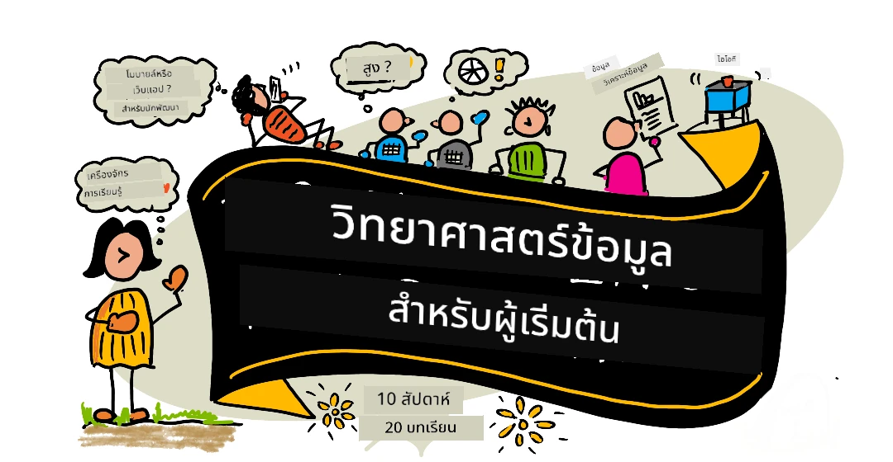
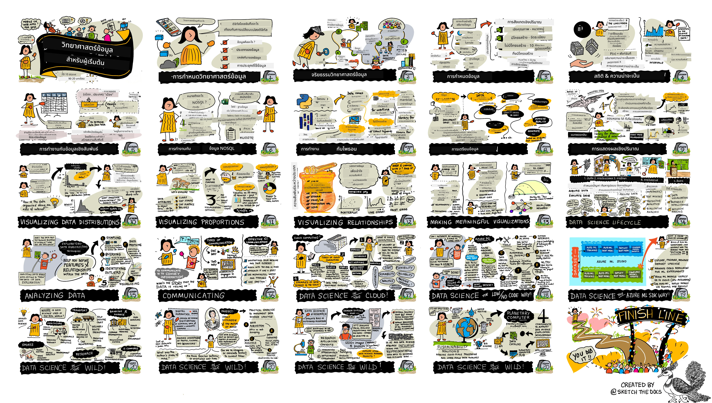

# Data Science for Beginners - A Curriculum

[](https://github.com/codespaces/new?hide_repo_select=true&ref=main&repo=344191198)

[](https://github.com/microsoft/Data-Science-For-Beginners/blob/master/LICENSE)
[](https://GitHub.com/microsoft/Data-Science-For-Beginners/graphs/contributors/)
[](https://GitHub.com/microsoft/Data-Science-For-Beginners/issues/)
[](https://GitHub.com/microsoft/Data-Science-For-Beginners/pulls/)
[](http://makeapullrequest.com)

[](https://GitHub.com/microsoft/Data-Science-For-Beginners/watchers/)
[](https://GitHub.com/microsoft/Data-Science-For-Beginners/network/)
[](https://GitHub.com/microsoft/Data-Science-For-Beginners/stargazers/)


[](https://discord.gg/nTYy5BXMWG)

[](https://aka.ms/foundry/forum)

Azure Cloud Advocates ที่ Microsoft มีความยินดีที่จะนำเสนอหลักสูตร 10 สัปดาห์ 20 บทเรียนเกี่ยวกับ Data Science แต่ละบทเรียนประกอบด้วยแบบทดสอบก่อนและหลังบทเรียน คำแนะนำเป็นลายลักษณ์อักษรเพื่อทำบทเรียนให้เสร็จสมบูรณ์ โซลูชัน และงานมอบหมาย วิธีการสอนโดยใช้โครงการของเราช่วยให้คุณเรียนรู้ขณะสร้างผลงาน ซึ่งเป็นวิธีที่พิสูจน์แล้วว่าสำหรับทักษะใหม่ที่ 'ติดแน่น'

**ขอขอบคุณอย่างอบอุ่นต่อผู้เขียนของเรา:** [Jasmine Greenaway](https://www.twitter.com/paladique), [Dmitry Soshnikov](http://soshnikov.com), [Nitya Narasimhan](https://twitter.com/nitya), [Jalen McGee](https://twitter.com/JalenMcG), [Jen Looper](https://twitter.com/jenlooper), [Maud Levy](https://twitter.com/maudstweets), [Tiffany Souterre](https://twitter.com/TiffanySouterre), [Christopher Harrison](https://www.twitter.com/geektrainer).

**🙏 ขอบคุณพิเศษ 🙏 ต่อผู้เขียน ผู้ตรวจสอบ และผู้ร่วมเนื้อหาจาก [Microsoft Student Ambassador](https://studentambassadors.microsoft.com/),** โดยเฉพาะ Aaryan Arora, [Aditya Garg](https://github.com/AdityaGarg00), [Alondra Sanchez](https://www.linkedin.com/in/alondra-sanchez-molina/), [Ankita Singh](https://www.linkedin.com/in/ankitasingh007), [Anupam Mishra](https://www.linkedin.com/in/anupam--mishra/), [Arpita Das](https://www.linkedin.com/in/arpitadas01/), ChhailBihari Dubey, [Dibri Nsofor](https://www.linkedin.com/in/dibrinsofor), [Dishita Bhasin](https://www.linkedin.com/in/dishita-bhasin-7065281bb), [Majd Safi](https://www.linkedin.com/in/majd-s/), [Max Blum](https://www.linkedin.com/in/max-blum-6036a1186/), [Miguel Correa](https://www.linkedin.com/in/miguelmque/), [Mohamma Iftekher (Iftu) Ebne Jalal](https://twitter.com/iftu119), [Nawrin Tabassum](https://www.linkedin.com/in/nawrin-tabassum), [Raymond Wangsa Putra](https://www.linkedin.com/in/raymond-wp/), [Rohit Yadav](https://www.linkedin.com/in/rty2423), Samridhi Sharma, [Sanya Sinha](https://www.linkedin.com/mwlite/in/sanya-sinha-13aab1200),
[Sheena Narula](https://www.linkedin.com/in/sheena-narua-n/), [Tauqeer Ahmad](https://www.linkedin.com/in/tauqeerahmad5201/), Yogendrasingh Pawar , [Vidushi Gupta](https://www.linkedin.com/in/vidushi-gupta07/), [Jasleen Sondhi](https://www.linkedin.com/in/jasleen-sondhi/)

||
|:---:|
| Data Science For Beginners - _Sketchnote โดย [@nitya](https://twitter.com/nitya)_ |

### 🌐 รองรับหลายภาษา

#### สนับสนุนโดย GitHub Action (อัตโนมัติและอัพเดตเสมอ)

<!-- CO-OP TRANSLATOR LANGUAGES TABLE START -->
[Arabic](../ar/README.md) | [Bengali](../bn/README.md) | [Bulgarian](../bg/README.md) | [Burmese (Myanmar)](../my/README.md) | [Chinese (Simplified)](../zh-CN/README.md) | [Chinese (Traditional, Hong Kong)](../zh-HK/README.md) | [Chinese (Traditional, Macau)](../zh-MO/README.md) | [Chinese (Traditional, Taiwan)](../zh-TW/README.md) | [Croatian](../hr/README.md) | [Czech](../cs/README.md) | [Danish](../da/README.md) | [Dutch](../nl/README.md) | [Estonian](../et/README.md) | [Finnish](../fi/README.md) | [French](../fr/README.md) | [German](../de/README.md) | [Greek](../el/README.md) | [Hebrew](../he/README.md) | [Hindi](../hi/README.md) | [Hungarian](../hu/README.md) | [Indonesian](../id/README.md) | [Italian](../it/README.md) | [Japanese](../ja/README.md) | [Kannada](../kn/README.md) | [Khmer](../km/README.md) | [Korean](../ko/README.md) | [Lithuanian](../lt/README.md) | [Malay](../ms/README.md) | [Malayalam](../ml/README.md) | [Marathi](../mr/README.md) | [Nepali](../ne/README.md) | [Nigerian Pidgin](../pcm/README.md) | [Norwegian](../no/README.md) | [Persian (Farsi)](../fa/README.md) | [Polish](../pl/README.md) | [Portuguese (Brazil)](../pt-BR/README.md) | [Portuguese (Portugal)](../pt-PT/README.md) | [Punjabi (Gurmukhi)](../pa/README.md) | [Romanian](../ro/README.md) | [Russian](../ru/README.md) | [Serbian (Cyrillic)](../sr/README.md) | [Slovak](../sk/README.md) | [Slovenian](../sl/README.md) | [Spanish](../es/README.md) | [Swahili](../sw/README.md) | [Swedish](../sv/README.md) | [Tagalog (Filipino)](../tl/README.md) | [Tamil](../ta/README.md) | [Telugu](../te/README.md) | [Thai](./README.md) | [Turkish](../tr/README.md) | [Ukrainian](../uk/README.md) | [Urdu](../ur/README.md) | [Vietnamese](../vi/README.md)

> **ต้องการโคลนแบบโลคอล?**
>
> ที่เก็บนี้รวมการแปลมากกว่า 50 ภาษา ซึ่งจะเพิ่มขนาดการดาวน์โหลดอย่างมาก เพื่อโคลนโดยไม่รวมการแปล ให้ใช้ sparse checkout:
>
> **Bash / macOS / Linux:**
> ```bash
> git clone --filter=blob:none --sparse https://github.com/microsoft/Data-Science-For-Beginners.git
> cd Data-Science-For-Beginners
> git sparse-checkout set --no-cone '/*' '!translations' '!translated_images'
> ```
>
> **CMD (Windows):**
> ```cmd
> git clone --filter=blob:none --sparse https://github.com/microsoft/Data-Science-For-Beginners.git
> cd Data-Science-For-Beginners
> git sparse-checkout set --no-cone "/*" "!translations" "!translated_images"
> ```
>
> วิธีนี้จะให้ทุกอย่างที่คุณต้องการเพื่อทำหลักสูตรนี้ให้เสร็จด้วยการดาวน์โหลดที่รวดเร็วขึ้นมาก
<!-- CO-OP TRANSLATOR LANGUAGES TABLE END -->

**หากคุณต้องการให้สนับสนุนภาษาเพิ่มเติม รายการภาษาที่สนับสนุนอยู่ที่ [นี่](https://github.com/Azure/co-op-translator/blob/main/getting_started/supported-languages.md)**

#### เข้าร่วมชุมชนของเรา  
[](https://discord.gg/nTYy5BXMWG)

เรามีซีรีส์เรียนรู้กับ AI บน Discord ที่กำลังดำเนินอยู่ เรียนรู้เพิ่มเติมและเข้าร่วมกับเราที่ [Learn with AI Series](https://aka.ms/learnwithai/discord) ตั้งแต่วันที่ 18 - 30 กันยายน 2025 คุณจะได้รับเคล็ดลับและเทคนิคในการใช้ GitHub Copilot สำหรับ Data Science


# คุณเป็นนักเรียนหรือไม่?

เริ่มต้นด้วยแหล่งข้อมูลดังต่อไปนี้:

- [หน้า Student Hub](https://docs.microsoft.com/en-gb/learn/student-hub?WT.mc_id=academic-77958-bethanycheum) ในหน้านี้ คุณจะพบแหล่งข้อมูลสำหรับผู้เริ่มต้น ชุดดาวน์โหลดสำหรับนักเรียน และแม้แต่วิธีรับคูปองใบรับรองฟรี นี่คือหน้าที่คุณควรบุ๊คมาร์คและตรวจสอบเป็นระยะ ๆ เพราะเราจะเปลี่ยนเนื้อหาอย่างน้อยทุกเดือน
- [Microsoft Learn Student Ambassadors](https://studentambassadors.microsoft.com?WT.mc_id=academic-77958-bethanycheum) เข้าร่วมชุมชนแอมบาสเดอร์นักเรียนระดับโลก นี่อาจเป็นเส้นทางของคุณสู่ Microsoft

# การเริ่มต้น

## 📚 เอกสาร

- **[คู่มือการติดตั้ง](INSTALLATION.md)** - คำแนะนำการตั้งค่าแบบทีละขั้นตอนสำหรับผู้เริ่มต้น
- **[คู่มือการใช้งาน](USAGE.md)** - ตัวอย่างและขั้นตอนการทำงานทั่วไป
- **[การแก้ไขปัญหา](TROUBLESHOOTING.md)** - วิธีแก้ปัญหาที่พบบ่อย
- **[คู่มือการมีส่วนร่วม](CONTRIBUTING.md)** - วิธีการมีส่วนร่วมในโปรเจ็กต์นี้
- **[สำหรับครูผู้สอน](for-teachers.md)** - แนวทางการสอนและแหล่งข้อมูลในห้องเรียน

## 👨‍🎓 สำหรับนักเรียน
> **สำหรับผู้เริ่มต้นอย่างสมบูรณ์**: เพิ่งเริ่มกับ data science ใช่ไหม? เริ่มด้วย [ตัวอย่างสำหรับผู้เริ่มต้น](examples/README.md) ของเรา! ตัวอย่างที่ง่ายและมีคำอธิบายอย่างดีเหล่านี้จะช่วยให้คุณเข้าใจพื้นฐานก่อนที่จะลงลึกในหลักสูตรเต็มรูปแบบ
> **[นักเรียน](https://aka.ms/student-page)**: เพื่อใช้หลักสูตรนี้ด้วยตัวเอง ให้โคลนรีโปนี้ทั้งหมดและทำแบบฝึกหัดตามลำพัง โดยเริ่มจากแบบทดสอบก่อนบรรยาย จากนั้นอ่านบรรยายและทำกิจกรรมส่วนที่เหลือ พยายามสร้างโปรเจ็กต์โดยการทำความเข้าใจบทเรียนแทนการคัดลอกโค้ดโซลูชัน แต่โค้ดนั้นมีให้ในโฟลเดอร์ /solutions ในแต่ละบทเรียนที่มุ่งเน้นโครงการ อีกทางเลือกหนึ่งคือสร้างกลุ่มเรียนกับเพื่อนและเรียนรู้ด้วยกัน สำหรับการศึกษาต่อ เราแนะนำ [Microsoft Learn](https://docs.microsoft.com/en-us/users/jenlooper-2911/collections/qprpajyoy3x0g7?WT.mc_id=academic-77958-bethanycheum).

**เริ่มต้นอย่างรวดเร็ว:**
1. ตรวจสอบ [คู่มือการติดตั้ง](INSTALLATION.md) เพื่อเตรียมสภาพแวดล้อมของคุณ
2. ทบทวน [คู่มือการใช้งาน](USAGE.md) เพื่อเรียนรู้วิธีการใช้งานหลักสูตร
3. เริ่มที่บทเรียนที่ 1 และทำตามลำดับ
4. เข้าร่วม [ชุมชน Discord](https://aka.ms/ds4beginners/discord) ของเราเพื่อรับการสนับสนุน

## 👩‍🏫 สำหรับครูผู้สอน
> **สำหรับครูผู้สอน**: เราได้ [รวบรวมข้อแนะนำบางประการ](for-teachers.md) ในการใช้หลักสูตรนี้ไว้ให้แล้ว เรายินดีรับฟังความคิดเห็นของคุณ [ในเว็บบอร์ดพูดคุยของเรา](https://github.com/microsoft/Data-Science-For-Beginners/discussions)!

## ทำความรู้จักกับทีมงาน

[](https://youtu.be/8mzavjQSMM4 "วิดีโอโฆษณา")

**Gif โดย** [Mohit Jaisal](https://www.linkedin.com/in/mohitjaisal)

> 🎥 คลิกที่รูปภาพด้านบนเพื่อชมวิดีโอเกี่ยวกับโครงการและทีมงานผู้สร้าง!

## วิธีการสอน

เราได้เลือกหลักการทางการศึกษา 2 ข้อในการสร้างหลักสูตรนี้ ได้แก่ การทำให้หลักสูตรมีพื้นฐานจากโครงการและการมีแบบทดสอบบ่อยครั้ง ภายในตอนท้ายของชุดนี้ นักเรียนจะได้เรียนรู้หลักการพื้นฐานของวิทยาศาสตร์ข้อมูล รวมถึงแนวคิดด้านจริยธรรม การเตรียมข้อมูล วิธีการต่างๆ ในการทำงานกับข้อมูล การวิเคราะห์เชิงภาพ การวิเคราะห์ข้อมูล กรณีศึกษาในโลกจริงของวิทยาศาสตร์ข้อมูล และอื่นๆ

นอกจากนี้ แบบทดสอบแบบแรงกดดันต่ำก่อนเริ่มเรียน จะช่วยสร้างเจตนารมณ์ของนักเรียนต่อการเรียนรู้หัวข้อ นอกจากนี้แบบทดสอบที่สองหลังเรียนจะช่วยเสริมความจำหลักสูตรนี้ถูกออกแบบมาให้ยืดหยุ่นและสนุกสนาน สามารถเรียนได้ทั้งหลักสูตรหรือบางส่วน โครงการเริ่มต้นขนาดเล็กและมีความซับซ้อนเพิ่มขึ้นเรื่อยๆ จนจบวงรอบ 10 สัปดาห์

> ค้นหา [จรรยาบรรณการปฏิบัติงาน](CODE_OF_CONDUCT.md), [แนวทางการร่วมพัฒนา](CONTRIBUTING.md), [แนวทางการแปล](TRANSLATIONS.md) ของเรา เราต้อนรับข้อเสนอแนะที่สร้างสรรค์ของคุณ!

## แต่ละบทเรียนประกอบด้วย:

- สเก็ตช์โน้ต (เลือกดูได้)
- วิดีโอเสริม (เลือกดูได้)
- แบบทดสอบวอร์มอัพก่อนบทเรียน
- บทเรียนที่เป็นลายลักษณ์อักษร
- สำหรับบทเรียนที่เน้นโครงการ จะมีคำแนะนำทีละขั้นตอนสำหรับการสร้างโครงการ
- การตรวจสอบความรู้
- ความท้าทาย
- การอ่านเพิ่มเติม
- การบ้าน
- [แบบทดสอบหลังบทเรียน](https://ff-quizzes.netlify.app/en/)

> **หมายเหตุเกี่ยวกับแบบทดสอบ**: แบบทดสอบทั้งหมดจัดอยู่ในโฟลเดอร์ Quiz-App รวม 40 แบบทดสอบที่มีคำถาม 3 ข้อแต่ละแบบ มีการลิงก์จากภายในบทเรียน แต่แอปแบบทดสอบสามารถรันในเครื่องหรือดีพลอยไปยัง Azure ได้; ปฏิบัติตามคำแนะนำในโฟลเดอร์ `quiz-app` ซึ่งแบบทดสอบกำลังถูกแปลเป็นภาษาต่างๆ ทีละน้อย

## 🎓 ตัวอย่างสำหรับผู้เริ่มต้น

**เพิ่งเริ่มเรียนวิทยาศาสตร์ข้อมูล?** เราได้สร้าง [ไดเรกทอรีตัวอย่าง](examples/README.md) พิเศษด้วยโค้ดที่ง่ายและคอมเมนต์ครบถ้วนเพื่อช่วยให้คุณเริ่มต้นได้:

- 🌟 **Hello World** - โปรแกรมวิทยาศาสตร์ข้อมูลแรกของคุณ
- 📂 **โหลดข้อมูล** - เรียนรู้การอ่านและสำรวจชุดข้อมูล
- 📊 **วิเคราะห์ง่ายๆ** - คำนวณสถิติและค้นหารูปแบบ
- 📈 **การแสดงผลภาพพื้นฐาน** - สร้างแผนภูมิและกราฟ
- 🔬 **โครงการในโลกจริง** - เวิร์กโฟลว์สมบูรณ์ตั้งแต่ต้นจนจบ

แต่ละตัวอย่างประกอบด้วยคอมเมนต์ละเอียดอธิบายในทุกขั้นตอน เหมาะสำหรับผู้เริ่มต้นอย่างยิ่ง!

👉 **[เริ่มจากตัวอย่าง](examples/README.md)** 👈

## บทเรียน


||
|:---:|
| วิทยาศาสตร์ข้อมูลสำหรับผู้เริ่มต้น: แผนที่เส้นทาง - _สเก็ตช์โน้ตโดย [@nitya](https://twitter.com/nitya)_ |


| หมายเลขบทเรียน | หัวข้อ | การจัดกลุ่มบทเรียน | วัตถุประสงค์การเรียนรู้ | บทเรียนที่ลิงก์ | ผู้เขียน |
| :-----------: | :----------------------------------------: | :--------------------------------------------------: | :-----------------------------------------------------------------------------------------------------------------------------------------------------------------------: | :---------------------------------------------------------------------: | :----: |
| 01 | การนิยามวิทยาศาสตร์ข้อมูล | [บทนำ](1-Introduction/README.md) | เรียนรู้แนวคิดพื้นฐานเบื้องหลังวิทยาศาสตร์ข้อมูลและความสัมพันธ์กับปัญญาประดิษฐ์, การเรียนรู้ของเครื่อง และบิ๊กดาต้า | [บทเรียน](1-Introduction/01-defining-data-science/README.md) [วิดีโอ](https://youtu.be/beZ7Mb_oz9I) | [Dmitry](http://soshnikov.com) |
| 02 | จริยธรรมวิทยาศาสตร์ข้อมูล | [บทนำ](1-Introduction/README.md) | แนวคิดด้านจริยธรรมข้อมูล, ความท้าทาย และกรอบงาน | [บทเรียน](1-Introduction/02-ethics/README.md) | [Nitya](https://twitter.com/nitya) |
| 03 | การนิยามข้อมูล | [บทนำ](1-Introduction/README.md) | วิธีการจัดประเภทข้อมูลและแหล่งที่มาทั่วไป | [บทเรียน](1-Introduction/03-defining-data/README.md) | [Jasmine](https://www.twitter.com/paladique) |
| 04 | บทนำสถิติและความน่าจะเป็น | [บทนำ](1-Introduction/README.md) | เทคนิคทางคณิตศาสตร์ของความน่าจะเป็นและสถิติในการเข้าใจข้อมูล | [บทเรียน](1-Introduction/04-stats-and-probability/README.md) [วิดีโอ](https://youtu.be/Z5Zy85g4Yjw) | [Dmitry](http://soshnikov.com) |
| 05 | การทำงานกับข้อมูลเชิงสัมพันธ์ | [การทำงานกับข้อมูล](2-Working-With-Data/README.md) | บทนำเกี่ยวกับข้อมูลเชิงสัมพันธ์และพื้นฐานการสำรวจและวิเคราะห์ข้อมูลเชิงสัมพันธ์ด้วยภาษาโครงสร้างคำสั่ง (SQL) | [บทเรียน](2-Working-With-Data/05-relational-databases/README.md) | [Christopher](https://www.twitter.com/geektrainer) | | |
| 06 | การทำงานกับข้อมูล NoSQL | [การทำงานกับข้อมูล](2-Working-With-Data/README.md) | บทนำเกี่ยวกับข้อมูลที่ไม่ใช่เชิงสัมพันธ์ ประเภทต่างๆ และพื้นฐานการสำรวจและวิเคราะห์ฐานข้อมูลเอกสาร | [บทเรียน](2-Working-With-Data/06-non-relational/README.md) | [Jasmine](https://twitter.com/paladique)|
| 07 | การทำงานกับ Python | [การทำงานกับข้อมูล](2-Working-With-Data/README.md) | พื้นฐานการใช้ Python สำหรับการสำรวจข้อมูลด้วยไลบรารีอย่าง Pandas การมีความเข้าใจที่มั่นคงใน Python แนะนำให้มีมาก่อน | [บทเรียน](2-Working-With-Data/07-python/README.md) [วิดีโอ](https://youtu.be/dZjWOGbsN4Y) | [Dmitry](http://soshnikov.com) |
| 08 | การเตรียมข้อมูล | [การทำงานกับข้อมูล](2-Working-With-Data/README.md) | หัวข้อเทคนิคข้อมูลเพื่อการทำความสะอาดและเปลี่ยนแปลงข้อมูลเพื่อจัดการกับข้อมูลที่ขาดหาย ไม่ถูกต้อง หรือไม่สมบูรณ์ | [บทเรียน](2-Working-With-Data/08-data-preparation/README.md) | [Jasmine](https://www.twitter.com/paladique) |
| 09 | การแสดงภาพข้อมูลปริมาณ | [การแสดงข้อมูลเชิงภาพ](3-Data-Visualization/README.md) | เรียนรู้การใช้ Matplotlib เพื่อแสดงภาพข้อมูลนก 🦆 | [บทเรียน](3-Data-Visualization/09-visualization-quantities/README.md) | [Jen](https://twitter.com/jenlooper) |
| 10 | การแสดงภาพการแจกแจงข้อมูล | [การแสดงข้อมูลเชิงภาพ](3-Data-Visualization/README.md) | การแสดงภาพการสังเกตและแนวโน้มภายในช่วงเวลา | [บทเรียน](3-Data-Visualization/10-visualization-distributions/README.md) | [Jen](https://twitter.com/jenlooper) |
| 11 | การแสดงภาพสัดส่วน | [การแสดงข้อมูลเชิงภาพ](3-Data-Visualization/README.md) | การแสดงภาพเปอร์เซ็นต์ที่แยกชิ้นและจัดกลุ่ม | [บทเรียน](3-Data-Visualization/11-visualization-proportions/README.md) | [Jen](https://twitter.com/jenlooper) |
| 12 | การแสดงภาพความสัมพันธ์ | [การแสดงข้อมูลเชิงภาพ](3-Data-Visualization/README.md) | การแสดงภาพความเชื่อมโยงและความสัมพันธ์ระหว่างชุดข้อมูลและตัวแปร | [บทเรียน](3-Data-Visualization/12-visualization-relationships/README.md) | [Jen](https://twitter.com/jenlooper) |
| 13 | การแสดงภาพที่มีความหมาย | [การแสดงข้อมูลเชิงภาพ](3-Data-Visualization/README.md) | เทคนิคและคำแนะนำเพื่อทำให้การแสดงภาพของคุณมีคุณค่าสำหรับการแก้ปัญหาอย่างมีประสิทธิภาพและรู้แจ้ง | [บทเรียน](3-Data-Visualization/13-meaningful-visualizations/README.md) | [Jen](https://twitter.com/jenlooper) |
| 14 | บทนำสู่วงจรชีวิตวิทยาศาสตร์ข้อมูล | [วงจรชีวิต](4-Data-Science-Lifecycle/README.md) | บทนำในวงจรชีวิตวิทยาศาสตร์ข้อมูลและขั้นตอนแรกของการได้มาซึ่งข้อมูลและการสกัดข้อมูล | [บทเรียน](4-Data-Science-Lifecycle/14-Introduction/README.md) | [Jasmine](https://twitter.com/paladique) |
| 15 | การวิเคราะห์ | [วงจรชีวิต](4-Data-Science-Lifecycle/README.md) | ขั้นตอนนี้ของวงจรชีวิตวิทยาศาสตร์ข้อมูลมุ่งเน้นที่เทคนิคในการวิเคราะห์ข้อมูล | [บทเรียน](4-Data-Science-Lifecycle/15-analyzing/README.md) | [Jasmine](https://twitter.com/paladique) | | |
| 16 | การสื่อสาร | [วงจรชีวิต](4-Data-Science-Lifecycle/README.md) | ขั้นตอนนี้ของวงจรชีวิตวิทยาศาสตร์ข้อมูลมุ่งเน้นที่การนำเสนอข้อมูลเชิงลึกจากข้อมูลในรูปแบบที่ง่ายต่อการทำความเข้าใจของผู้ตัดสินใจ | [บทเรียน](4-Data-Science-Lifecycle/16-communication/README.md) | [Jalen](https://twitter.com/JalenMcG) | | |
| 17 | วิทยาศาสตร์ข้อมูลบนคลาวด์ | [ข้อมูลบนคลาวด์](5-Data-Science-In-Cloud/README.md) | ชุดบทเรียนนี้แนะนำวิทยาศาสตร์ข้อมูลบนคลาวด์และประโยชน์ต่างๆ | [บทเรียน](5-Data-Science-In-Cloud/17-Introduction/README.md) | [Tiffany](https://twitter.com/TiffanySouterre) and [Maud](https://twitter.com/maudstweets) |
| 18 | วิทยาศาสตร์ข้อมูลบนคลาวด์ | [ข้อมูลบนคลาวด์](5-Data-Science-In-Cloud/README.md) | การฝึกอบรมโมเดลโดยใช้เครื่องมือแบบ Low Code |[บทเรียน](5-Data-Science-In-Cloud/18-Low-Code/README.md) | [Tiffany](https://twitter.com/TiffanySouterre) and [Maud](https://twitter.com/maudstweets) |
| 19 | วิทยาศาสตร์ข้อมูลบนคลาวด์ | [ข้อมูลบนคลาวด์](5-Data-Science-In-Cloud/README.md) | การนำโมเดลไปใช้งานด้วย Azure Machine Learning Studio | [บทเรียน](5-Data-Science-In-Cloud/19-Azure/README.md)| [Tiffany](https://twitter.com/TiffanySouterre) and [Maud](https://twitter.com/maudstweets) |
| 20 | วิทยาศาสตร์ข้อมูลในแวดล้อมจริง | [ในแวดล้อมจริง](6-Data-Science-In-Wild/README.md) | โครงการวิทยาศาสตร์ข้อมูลในโลกความจริง | [บทเรียน](6-Data-Science-In-Wild/20-Real-World-Examples/README.md) | [Nitya](https://twitter.com/nitya) |

## GitHub Codespaces

ทำตามขั้นตอนเหล่านี้เพื่อเปิดตัวอย่างนี้ใน Codespace:
1. คลิกเมนูดรอปดาวน์ Code และเลือกตัวเลือก Open with Codespaces
2. เลือก + New codespace ที่ด้านล่างของแถบด้านข้าง
สำหรับข้อมูลเพิ่มเติม โปรดดูที่ [เอกสาร GitHub](https://docs.github.com/en/codespaces/developing-in-codespaces/creating-a-codespace-for-a-repository#creating-a-codespace)

## VSCode Remote - Containers
ทำตามขั้นตอนเหล่านี้เพื่อเปิด repo นี้ในคอนเทนเนอร์โดยใช้เครื่องของคุณและ VSCode ผ่านส่วนขยาย VS Code Remote - Containers:

1. หากนี่เป็นครั้งแรกของคุณที่ใช้คอนเทนเนอร์พัฒนา โปรดตรวจสอบว่าระบบของคุณตรงตามข้อกำหนดเบื้องต้น (เช่น ติดตั้ง Docker แล้ว) ใน [เอกสารเริ่มต้นใช้งาน](https://code.visualstudio.com/docs/devcontainers/containers#_getting-started)

เพื่อใช้งานรีโพนี้ คุณสามารถเปิดรีโพใน Docker volume แยกต่างหาก:

**หมายเหตุ**: ภายใต้กระบวนการนี้ จะใช้คำสั่ง Remote-Containers: **Clone Repository in Container Volume...** เพื่อโคลนซอร์สโค้ดใน Docker volume แทนไฟล์ระบบในเครื่อง [Volumes](https://docs.docker.com/storage/volumes/) คือกลไกที่แนะนำสำหรับการเก็บข้อมูลคอนเทนเนอร์

หรือเปิดเวอร์ชันที่โคลนหรือดาวน์โหลดมาท้องถิ่น:

- โคลนรีโพนี้มายังไฟล์ระบบในเครื่องคุณ
- กด F1 และเลือกคำสั่ง **Remote-Containers: Open Folder in Container...**
- เลือกโฟลเดอร์นี้ที่โคลนไว้ รอให้คอนเทนเนอร์เริ่มทำงาน และทดลองใช้งาน

## การเข้าถึงออฟไลน์

คุณสามารถอ่านเอกสารนี้แบบออฟไลน์โดยใช้ [Docsify](https://docsify.js.org/#/) ฟอร์กรีโพนี้, [ติดตั้ง Docsify](https://docsify.js.org/#/quickstart) บนเครื่องของคุณ จากนั้นที่โฟลเดอร์รูทของรีโพนี้ ให้พิมพ์ `docsify serve` เว็บไซต์จะถูกให้บริการบนพอร์ต 3000 ที่เครื่องท้องถิ่นของคุณ: `localhost:3000`

> หมายเหตุ สมุดบันทึก (notebooks) จะไม่ถูกแสดงผลผ่าน Docsify ดังนั้นเมื่อคุณต้องการรันสมุดบันทึก ให้ทำแยกต่างหากใน VS Code โดยรัน kernel ของ Python

## หลักสูตรอื่นๆ

ทีมงานของเราผลิตหลักสูตรอื่นๆ อีก! ลองดู:

<!-- CO-OP TRANSLATOR OTHER COURSES START -->
### LangChain
[](https://aka.ms/langchain4j-for-beginners)
[](https://aka.ms/langchainjs-for-beginners?WT.mc_id=m365-94501-dwahlin)
[](https://github.com/microsoft/langchain-for-beginners?WT.mc_id=m365-94501-dwahlin)
---

### Azure / Edge / MCP / Agents
[](https://github.com/microsoft/AZD-for-beginners?WT.mc_id=academic-105485-koreyst)
[](https://github.com/microsoft/edgeai-for-beginners?WT.mc_id=academic-105485-koreyst)
[](https://github.com/microsoft/mcp-for-beginners?WT.mc_id=academic-105485-koreyst)
[](https://github.com/microsoft/ai-agents-for-beginners?WT.mc_id=academic-105485-koreyst)

---
 
### Generative AI Series
[](https://github.com/microsoft/generative-ai-for-beginners?WT.mc_id=academic-105485-koreyst)
[-9333EA?style=for-the-badge&labelColor=E5E7EB&color=9333EA)](https://github.com/microsoft/Generative-AI-for-beginners-dotnet?WT.mc_id=academic-105485-koreyst)
[-C084FC?style=for-the-badge&labelColor=E5E7EB&color=C084FC)](https://github.com/microsoft/generative-ai-for-beginners-java?WT.mc_id=academic-105485-koreyst)
[-E879F9?style=for-the-badge&labelColor=E5E7EB&color=E879F9)](https://github.com/microsoft/generative-ai-with-javascript?WT.mc_id=academic-105485-koreyst)

---
 
### Core Learning
[](https://aka.ms/ml-beginners?WT.mc_id=academic-105485-koreyst)
[](https://aka.ms/datascience-beginners?WT.mc_id=academic-105485-koreyst)
[](https://aka.ms/ai-beginners?WT.mc_id=academic-105485-koreyst)
[](https://github.com/microsoft/Security-101?WT.mc_id=academic-96948-sayoung)
[](https://aka.ms/webdev-beginners?WT.mc_id=academic-105485-koreyst)
[](https://aka.ms/iot-beginners?WT.mc_id=academic-105485-koreyst)
[](https://github.com/microsoft/xr-development-for-beginners?WT.mc_id=academic-105485-koreyst)

---
 
### Copilot Series
[](https://aka.ms/GitHubCopilotAI?WT.mc_id=academic-105485-koreyst)
[](https://github.com/microsoft/mastering-github-copilot-for-dotnet-csharp-developers?WT.mc_id=academic-105485-koreyst)
[](https://github.com/microsoft/CopilotAdventures?WT.mc_id=academic-105485-koreyst)
<!-- CO-OP TRANSLATOR OTHER COURSES END -->

## Getting Help

**เจอปัญหาใช่ไหม?** ตรวจสอบ [คู่มือแก้ไขปัญหา](TROUBLESHOOTING.md) ของเราเพื่อค้นหาวิธีแก้ไขปัญหาทั่วไป

ถ้าคุณติดขัดหรือมีคำถามใดๆ เกี่ยวกับการสร้างแอป AI เข้าร่วมกับผู้เรียนและนักพัฒนาที่มีประสบการณ์ในการสนทนาเกี่ยวกับ MCP นี่คือชุมชนที่สนับสนุนซึ่งเปิดรับคำถามและแบ่งปันความรู้กันอย่างเสรี

[](https://discord.gg/nTYy5BXMWG)

ถ้าคุณมีข้อเสนอแนะเกี่ยวกับผลิตภัณฑ์หรือพบข้อผิดพลาดในขณะสร้างโปรดเยี่ยมชม:

[](https://aka.ms/foundry/forum)

---

<!-- CO-OP TRANSLATOR DISCLAIMER START -->
**ข้อจำกัดความรับผิดชอบ**:  
เอกสารนี้ได้รับการแปลโดยใช้บริการแปลอัตโนมัติ [Co-op Translator](https://github.com/Azure/co-op-translator) ถึงแม้เราจะพยายามให้มีความถูกต้อง โปรดทราบว่าการแปลโดยอัตโนมัติอาจมีข้อผิดพลาดหรือความคลาดเคลื่อน เอกสารต้นฉบับในภาษาดั้งเดิมควรถูกพิจารณาเป็นแหล่งข้อมูลที่เชื่อถือได้ หากเป็นข้อมูลที่สำคัญ แนะนำให้ใช้บริการแปลโดยมนุษย์ผู้เชี่ยวชาญ เราไม่รับผิดชอบต่อความเข้าใจผิดหรือการตีความที่ผิดพลาดที่เกิดจากการใช้การแปลนี้
<!-- CO-OP TRANSLATOR DISCLAIMER END -->