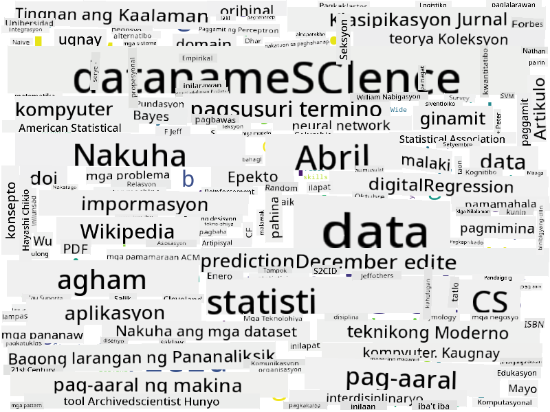

<!--
CO_OP_TRANSLATOR_METADATA:
{
  "original_hash": "a76ab694b1534fa57981311975660bfe",
  "translation_date": "2025-09-06T12:27:59+00:00",
  "source_file": "1-Introduction/01-defining-data-science/README.md",
  "language_code": "tl"
}
-->
## Mga Uri ng Data

Tulad ng nabanggit na, ang data ay nasa lahat ng dako. Kailangan lang natin itong makuha sa tamang paraan! Mahalagang malaman ang pagkakaiba sa pagitan ng **structured** at **unstructured** na data. Ang una ay karaniwang kinakatawan sa isang maayos na istruktura, kadalasan bilang isang talahanayan o bilang maraming talahanayan, habang ang huli ay isang koleksyon lamang ng mga file. Minsan, maaari rin tayong mag-usap tungkol sa **semi-structured** na data, na may ilang uri ng istruktura na maaaring magkaiba-iba.

| Structured                                                                   | Semi-structured                                                                                | Unstructured                            |
| ---------------------------------------------------------------------------- | ---------------------------------------------------------------------------------------------- | --------------------------------------- |
| Listahan ng mga tao kasama ang kanilang mga numero ng telepono               | Mga pahina ng Wikipedia na may mga link                                                        | Teksto ng Encyclopedia Britannica       |
| Temperatura sa lahat ng silid ng isang gusali bawat minuto sa nakaraang 20 taon | Koleksyon ng mga siyentipikong papel sa JSON format na may mga may-akda, petsa ng publikasyon, at abstrak | File share na may mga dokumento ng kumpanya |
| Data para sa edad at kasarian ng lahat ng pumapasok sa gusali                | Mga pahina sa Internet                                                                         | Raw video feed mula sa surveillance camera |

## Saan Kumuha ng Data

Maraming posibleng pinagmumulan ng data, at imposibleng ilista ang lahat ng ito! Gayunpaman, banggitin natin ang ilan sa mga karaniwang lugar kung saan maaaring makakuha ng data:

* **Structured**
  - **Internet of Things** (IoT), kabilang ang data mula sa iba't ibang sensor, tulad ng temperatura o pressure sensors, na nagbibigay ng maraming kapaki-pakinabang na data. Halimbawa, kung ang isang gusali ng opisina ay may IoT sensors, maaari nating awtomatikong kontrolin ang pag-init at pag-iilaw upang mabawasan ang gastos.
  - **Mga Survey** na hinihiling natin sa mga user na sagutan pagkatapos ng pagbili, o pagkatapos bumisita sa isang website.
  - **Pagsusuri ng pag-uugali** na maaaring makatulong, halimbawa, upang maunawaan kung gaano kalalim ang paggalugad ng isang user sa isang site, at ano ang karaniwang dahilan ng pag-alis sa site.
* **Unstructured**
  - **Mga Teksto** ay maaaring maging mayamang pinagmumulan ng mga insight, tulad ng pangkalahatang **sentiment score**, o pagkuha ng mga keyword at semantikong kahulugan.
  - **Mga Larawan** o **Video**. Ang video mula sa surveillance camera ay maaaring gamitin upang tantyahin ang trapiko sa kalsada, at magbigay ng impormasyon sa mga tao tungkol sa posibleng traffic jam.
  - **Logs** ng web server ay maaaring gamitin upang maunawaan kung aling mga pahina ng ating site ang madalas bisitahin, at kung gaano katagal.
* **Semi-structured**
  - **Mga Graph ng Social Network** ay maaaring maging mahusay na pinagmumulan ng data tungkol sa personalidad ng user at potensyal na pagiging epektibo sa pagpapalaganap ng impormasyon.
  - Kapag mayroon tayong koleksyon ng mga litrato mula sa isang party, maaari nating subukang kunin ang data ng **Group Dynamics** sa pamamagitan ng paggawa ng graph ng mga tao na nagpipicture kasama ang isa't isa.

Sa pamamagitan ng pag-alam sa iba't ibang posibleng pinagmumulan ng data, maaari kang mag-isip ng iba't ibang senaryo kung saan maaaring gamitin ang mga teknik ng data science upang mas maunawaan ang sitwasyon, at mapabuti ang mga proseso ng negosyo.

## Ano ang Magagawa Mo sa Data

Sa Data Science, nakatuon tayo sa mga sumusunod na hakbang ng paglalakbay ng data:

Siyempre, depende sa aktwal na data, maaaring may mga hakbang na nawawala (halimbawa, kapag mayroon na tayong data sa database, o kapag hindi natin kailangan ang model training), o maaaring ulitin ang ilang hakbang nang maraming beses (tulad ng data processing).

## Digitalisasyon at Digital Transformation

Sa nakaraang dekada, maraming negosyo ang nagsimulang maunawaan ang kahalagahan ng data sa paggawa ng mga desisyon sa negosyo. Upang magamit ang mga prinsipyo ng data science sa pagpapatakbo ng negosyo, kailangang mangolekta muna ng data, ibig sabihin, isalin ang mga proseso ng negosyo sa digital na anyo. Ito ay kilala bilang **digitalisasyon**. Ang paggamit ng mga teknik ng data science sa data na ito upang gabayan ang mga desisyon ay maaaring magdulot ng makabuluhang pagtaas sa produktibidad (o kahit pagbabago ng negosyo), na tinatawag na **digital transformation**.

Isaalang-alang natin ang isang halimbawa. Ipagpalagay na mayroon tayong kurso sa data science (tulad ng kursong ito) na inihahatid online sa mga estudyante, at nais nating gamitin ang data science upang mapabuti ito. Paano natin ito magagawa?

Maaari tayong magsimula sa pagtatanong, "Ano ang maaaring i-digitize?" Ang pinakasimpleng paraan ay sukatin ang oras na ginugugol ng bawat estudyante upang makumpleto ang bawat module, at sukatin ang nakuha nilang kaalaman sa pamamagitan ng pagbibigay ng multiple-choice test sa dulo ng bawat module. Sa pamamagitan ng pag-average ng oras ng pagkumpleto sa lahat ng estudyante, maaari nating malaman kung aling mga module ang nagdudulot ng pinakamaraming kahirapan sa mga estudyante, at magtrabaho sa pagpapasimple ng mga ito.
Maaaring sabihin mo na ang paraang ito ay hindi perpekto, dahil ang mga module ay maaaring magkakaiba ang haba. Mas makatarungan siguro kung hahatiin ang oras batay sa haba ng module (sa bilang ng mga karakter), at ikumpara ang mga halagang iyon sa halip.
Kapag sinimulan nating suriin ang mga resulta ng mga multiple-choice na pagsusulit, maaari nating tukuyin kung aling mga konsepto ang mahirap maunawaan ng mga estudyante, at gamitin ang impormasyong iyon upang mapabuti ang nilalaman. Upang magawa ito, kailangan nating idisenyo ang mga pagsusulit sa paraang ang bawat tanong ay tumutukoy sa isang partikular na konsepto o bahagi ng kaalaman.

Kung nais nating gawing mas komplikado, maaari nating i-plot ang oras na ginugol sa bawat module laban sa kategorya ng edad ng mga estudyante. Maaaring matuklasan natin na para sa ilang kategorya ng edad, masyadong matagal ang oras na kinakailangan upang makumpleto ang module, o kaya naman ay tumitigil ang mga estudyante bago ito matapos. Makakatulong ito sa atin na magbigay ng mga rekomendasyon sa edad para sa module, at mabawasan ang pagkadismaya ng mga tao mula sa maling inaasahan.

## 🚀 Hamon

Sa hamong ito, susubukan nating tukuyin ang mga konseptong may kaugnayan sa larangan ng Data Science sa pamamagitan ng pagsusuri sa mga teksto. Kukuha tayo ng isang artikulo mula sa Wikipedia tungkol sa Data Science, ida-download at ipoproseso ang teksto, at pagkatapos ay gagawa ng isang word cloud na ganito:

Bisitahin ang [`notebook.ipynb`](../../../../1-Introduction/01-defining-data-science/notebook.ipynb ':ignore') upang basahin ang code. Maaari mo ring patakbuhin ang code, at makita kung paano nito isinasagawa ang lahat ng data transformations sa real time.

> Kung hindi mo alam kung paano patakbuhin ang code sa isang Jupyter Notebook, tingnan ang [artikulong ito](https://soshnikov.com/education/how-to-execute-notebooks-from-github/).

## [Post-lecture quiz](https://ff-quizzes.netlify.app/en/ds/quiz/1)

## Mga Gawain

* **Gawain 1**: Baguhin ang code sa itaas upang tukuyin ang mga kaugnay na konsepto para sa mga larangan ng **Big Data** at **Machine Learning**
* **Gawain 2**: [Pag-isipan ang mga Scenario ng Data Science](assignment.md)

## Mga Kredito

Ang araling ito ay isinulat nang may ♥️ ni [Dmitry Soshnikov](http://soshnikov.com)

---

**Paunawa**:  
Ang dokumentong ito ay isinalin gamit ang AI translation service na [Co-op Translator](https://github.com/Azure/co-op-translator). Bagama't sinisikap naming maging tumpak, tandaan na ang mga awtomatikong pagsasalin ay maaaring maglaman ng mga pagkakamali o hindi pagkakatugma. Ang orihinal na dokumento sa kanyang katutubong wika ang dapat ituring na opisyal na sanggunian. Para sa mahalagang impormasyon, inirerekomenda ang propesyonal na pagsasalin ng tao. Hindi kami mananagot sa anumang hindi pagkakaunawaan o maling interpretasyon na maaaring magmula sa paggamit ng pagsasaling ito.