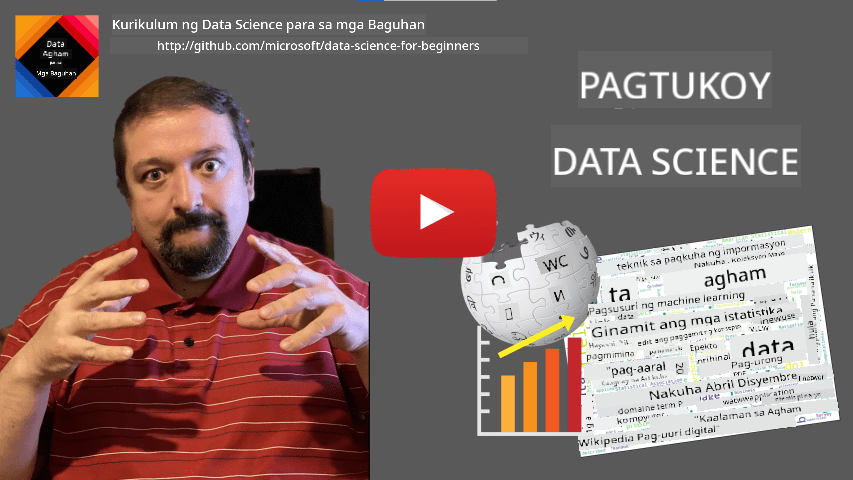

<!--
CO_OP_TRANSLATOR_METADATA:
{
  "original_hash": "8141e7195841682914be03ef930fe43d",
  "translation_date": "2025-09-03T20:25:00+00:00",
  "source_file": "1-Introduction/01-defining-data-science/README.md",
  "language_code": "tl"
}
-->
# Pagpapakilala sa Data Science

|  ](../../sketchnotes/01-Definitions.png) |
| :----------------------------------------------------------------------------------------------------: |
|              Pagpapakilala sa Data Science - _Sketchnote ni [@nitya](https://twitter.com/nitya)_       |

---

## [Pre-lecture quiz](https://purple-hill-04aebfb03.1.azurestaticapps.net/quiz/0)

## Ano ang Data?
Sa araw-araw nating buhay, palagi tayong napapalibutan ng data. Ang tekstong binabasa mo ngayon ay data. Ang listahan ng mga numero ng telepono ng iyong mga kaibigan sa iyong smartphone ay data, gayundin ang kasalukuyang oras na ipinapakita sa iyong relo. Bilang mga tao, natural tayong gumagamit ng data, tulad ng pagbibilang ng pera o pagsusulat ng liham sa mga kaibigan.

Gayunpaman, naging mas mahalaga ang data sa paglikha ng mga computer. Ang pangunahing layunin ng mga computer ay magsagawa ng mga kalkulasyon, ngunit kailangan nila ng data upang gumana. Kaya't mahalagang maunawaan kung paano iniimbak at pinoproseso ng mga computer ang data.

Sa pag-usbong ng Internet, mas lumaki ang papel ng mga computer bilang mga tagapamahala ng data. Kung iisipin mo, mas ginagamit na natin ngayon ang mga computer para sa pagproseso at komunikasyon ng data kaysa sa aktwal na pagkalkula. Kapag nagsusulat tayo ng e-mail sa isang kaibigan o naghahanap ng impormasyon sa Internet, lumilikha, nag-iimbak, nagpapadala, at nagmamaniobra tayo ng data.
> Kailan mo huling ginamit ang computer para aktwal na mag-compute ng isang bagay?

## Ano ang Data Science?

Ayon sa [Wikipedia](https://en.wikipedia.org/wiki/Data_science), ang **Data Science** ay tinutukoy bilang *isang larangang pang-agham na gumagamit ng mga siyentipikong pamamaraan upang makakuha ng kaalaman at pananaw mula sa nakaayos at hindi nakaayos na data, at gamitin ang kaalaman at mga actionable insights mula sa data sa iba't ibang larangan ng aplikasyon*.

Ang depinisyong ito ay nagbibigay-diin sa mga sumusunod na mahalagang aspeto ng data science:

* Ang pangunahing layunin ng data science ay **makakuha ng kaalaman** mula sa data, sa madaling salita - upang **maunawaan** ang data, tuklasin ang mga nakatagong relasyon, at bumuo ng isang **modelo**.
* Gumagamit ang data science ng mga **siyentipikong pamamaraan**, tulad ng probabilidad at estadistika. Sa katunayan, noong unang ipinakilala ang terminong *data science*, may mga nagsabi na ito ay bagong pangalan lamang para sa estadistika. Ngayon, malinaw na mas malawak ang saklaw ng larangang ito.
* Ang nakuhang kaalaman ay dapat gamitin upang makabuo ng mga **actionable insights**, o mga praktikal na pananaw na maaaring gamitin sa mga totoong sitwasyon sa negosyo.
* Dapat tayong marunong gumamit ng parehong **nakaayos** at **hindi nakaayos** na data. Tatalakayin natin ang iba't ibang uri ng data sa mga susunod na bahagi ng kurso.
* Ang **larangan ng aplikasyon** ay mahalaga, at madalas na kailangan ng mga data scientist ng kahit kaunting kaalaman sa larangan ng problema, tulad ng: pananalapi, medisina, marketing, at iba pa.

> Isa pang mahalagang aspeto ng Data Science ay ang pag-aaral kung paano kinokolekta, iniimbak, at pinoproseso ang data gamit ang mga computer. Habang ang estadistika ay nagbibigay ng mga pundasyong matematika, ang data science ay nag-aaplay ng mga konseptong matematika upang aktwal na makakuha ng mga pananaw mula sa data.

Isa sa mga paraan (na iniuugnay kay [Jim Gray](https://en.wikipedia.org/wiki/Jim_Gray_(computer_scientist))) upang tingnan ang data science ay ituring ito bilang isang hiwalay na paradigma ng agham:
* **Empirical**, kung saan umaasa tayo sa mga obserbasyon at resulta ng mga eksperimento
* **Theoretical**, kung saan lumalabas ang mga bagong konsepto mula sa umiiral na kaalamang pang-agham
* **Computational**, kung saan natutuklasan natin ang mga bagong prinsipyo batay sa mga computational experiments
* **Data-Driven**, batay sa pagtuklas ng mga relasyon at pattern sa data  

## Iba Pang Kaugnay na Larangan

Dahil ang data ay laganap, ang data science mismo ay isang malawak na larangan na sumasaklaw sa maraming iba pang disiplina.

## Mga Uri ng Data

Tulad ng nabanggit na, ang data ay nasa lahat ng dako. Kailangan lang natin itong makuha sa tamang paraan! Mahalagang maunawaan ang pagkakaiba ng **nakaayos** at **hindi nakaayos** na data. Ang una ay karaniwang kinakatawan sa isang maayos na anyo, madalas bilang isang talahanayan o bilang ng mga talahanayan, habang ang huli ay isang koleksyon lamang ng mga file. Minsan, maaari rin nating pag-usapan ang tungkol sa **semi-structured** na data, na may ilang uri ng istruktura na maaaring mag-iba nang malaki.

| Nakaayos                                                                    | Semi-structured                                                                                 | Hindi Nakaayos                          |
| ---------------------------------------------------------------------------- | ---------------------------------------------------------------------------------------------- | --------------------------------------- |
| Listahan ng mga tao at kanilang mga numero ng telepono                      | Mga pahina ng Wikipedia na may mga link                                                        | Teksto ng Encyclopedia Britannica       |
| Temperatura sa lahat ng silid ng isang gusali bawat minuto sa nakalipas na 20 taon | Koleksyon ng mga siyentipikong papel sa JSON format na may mga may-akda, petsa ng publikasyon, at abstrak | File share na may mga dokumentong pangkorporasyon |
| Data ng edad at kasarian ng lahat ng pumapasok sa gusali                    | Mga pahina sa Internet                                                                          | Raw na video feed mula sa surveillance camera |

## Saan Kumuha ng Data

Maraming posibleng mapagkukunan ng data, at imposibleng mailista ang lahat ng ito! Gayunpaman, banggitin natin ang ilan sa mga karaniwang lugar kung saan maaaring makakuha ng data:

* **Nakaayos**
  - **Internet of Things** (IoT), kabilang ang data mula sa iba't ibang sensor, tulad ng temperatura o pressure sensors, na nagbibigay ng maraming kapaki-pakinabang na data. Halimbawa, kung ang isang gusali ng opisina ay may mga IoT sensor, maaari nating awtomatikong kontrolin ang pag-init at pag-iilaw upang mabawasan ang gastos.
  - **Mga Survey** na hinihiling nating sagutan ng mga gumagamit pagkatapos ng pagbili o pagbisita sa isang website.
  - **Pagsusuri ng Pag-uugali** na maaaring makatulong upang maunawaan kung gaano kalalim ang paggalugad ng isang gumagamit sa isang site, at kung ano ang karaniwang dahilan ng pag-alis sa site.
* **Hindi Nakaayos**
  - **Mga Teksto** na maaaring maging mayamang mapagkukunan ng pananaw, tulad ng pangkalahatang **sentiment score**, o pagkuha ng mga keyword at kahulugan.
  - **Mga Larawan** o **Video**. Ang video mula sa surveillance camera ay maaaring gamitin upang tantyahin ang trapiko sa kalsada at ipaalam sa mga tao ang posibleng pagsisikip.
  - **Logs** ng web server na maaaring gamitin upang maunawaan kung aling mga pahina ng ating site ang madalas bisitahin at kung gaano katagal.
* **Semi-structured**
  - **Mga Graph ng Social Network** na maaaring maging mahusay na mapagkukunan ng data tungkol sa personalidad ng mga gumagamit at potensyal na pagiging epektibo sa pagpapakalat ng impormasyon.
  - Kapag mayroon tayong koleksyon ng mga litrato mula sa isang party, maaari nating subukang kumuha ng data ng **Group Dynamics** sa pamamagitan ng paggawa ng graph ng mga taong nagpipicture kasama ang isa't isa.

Sa pamamagitan ng pag-alam sa iba't ibang posibleng mapagkukunan ng data, maaari kang mag-isip ng iba't ibang mga senaryo kung saan maaaring gamitin ang mga teknika ng data science upang mas maunawaan ang sitwasyon at mapabuti ang mga proseso ng negosyo.

## Ano ang Magagawa Mo sa Data

Sa Data Science, nakatuon tayo sa mga sumusunod na hakbang ng data journey:

Siyempre, depende sa aktwal na data, maaaring may mga hakbang na nawawala (halimbawa, kung mayroon na tayong data sa database, o kung hindi na kailangan ang model training), o maaaring ulitin ang ilang hakbang nang maraming beses (tulad ng data processing).

## Digitalization at Digital Transformation

Sa nakalipas na dekada, maraming negosyo ang nagsimulang maunawaan ang kahalagahan ng data sa paggawa ng mga desisyon sa negosyo. Upang maipatupad ang mga prinsipyo ng data science sa pagpapatakbo ng negosyo, kailangang mangolekta muna ng data, o isalin ang mga proseso ng negosyo sa digital na anyo. Ito ay kilala bilang **digitalization**. Ang paggamit ng mga teknika ng data science sa data na ito upang gabayan ang mga desisyon ay maaaring humantong sa makabuluhang pagtaas ng produktibidad (o kahit pagbabago ng negosyo), na tinatawag na **digital transformation**.

Isaalang-alang natin ang isang halimbawa. Ipagpalagay nating mayroon tayong kurso sa data science (tulad ng kursong ito) na inihahatid online sa mga mag-aaral, at nais nating gamitin ang data science upang mapabuti ito. Paano natin ito magagawa?

Maaari tayong magsimula sa pagtatanong, "Ano ang maaaring gawing digital?" Ang pinakasimpleng paraan ay sukatin ang oras na ginugugol ng bawat mag-aaral upang matapos ang bawat module, at sukatin ang nakuha nilang kaalaman sa pamamagitan ng pagbibigay ng multiple-choice test sa dulo ng bawat module. Sa pamamagitan ng pagkuha ng average na oras ng pagkumpleto sa lahat ng mag-aaral, malalaman natin kung aling mga module ang nagdudulot ng pinakamaraming kahirapan, at maaaring pagtuunan ng pansin ang pagpapasimple sa mga ito.
Maaaring sabihin mo na ang paraang ito ay hindi perpekto, dahil ang mga module ay maaaring magkakaiba ang haba. Mas makatarungan siguro kung hahatiin ang oras batay sa haba ng module (sa bilang ng mga karakter), at ikumpara ang mga halagang iyon sa halip.
Kapag sinimulan nating suriin ang mga resulta ng mga multiple-choice na pagsusulit, maaari nating tukuyin kung aling mga konsepto ang mahirap maunawaan ng mga estudyante, at gamitin ang impormasyong iyon upang mapabuti ang nilalaman. Upang magawa ito, kailangan nating idisenyo ang mga pagsusulit sa paraang ang bawat tanong ay tumutukoy sa isang partikular na konsepto o bahagi ng kaalaman.

Kung nais nating gawing mas komplikado, maaari nating i-plot ang oras na ginugol sa bawat module laban sa kategorya ng edad ng mga estudyante. Maaaring matuklasan natin na para sa ilang kategorya ng edad, masyadong matagal ang oras na kinakailangan upang makumpleto ang module, o kaya naman ay tumitigil ang mga estudyante bago ito matapos. Makakatulong ito sa atin na magbigay ng rekomendasyon sa edad para sa module, at mabawasan ang pagkadismaya ng mga tao mula sa maling inaasahan.

## 🚀 Hamon

Sa hamong ito, susubukan nating tukuyin ang mga konseptong may kaugnayan sa larangan ng Data Science sa pamamagitan ng pagsusuri sa mga teksto. Kukuha tayo ng isang artikulo mula sa Wikipedia tungkol sa Data Science, ida-download at ipoproseso ang teksto, at pagkatapos ay gagawa ng isang word cloud na ganito:

Bisitahin ang [`notebook.ipynb`](../../../../../../../../../1-Introduction/01-defining-data-science/notebook.ipynb ':ignore') upang basahin ang code. Maaari mo ring patakbuhin ang code, at makita kung paano nito isinasagawa ang lahat ng data transformations nang real-time.

> Kung hindi mo alam kung paano patakbuhin ang code sa isang Jupyter Notebook, tingnan ang [artikulong ito](https://soshnikov.com/education/how-to-execute-notebooks-from-github/).

## [Post-lecture quiz](https://ff-quizzes.netlify.app/en/ds/)

## Mga Gawain

* **Gawain 1**: Baguhin ang code sa itaas upang tukuyin ang mga kaugnay na konsepto para sa mga larangan ng **Big Data** at **Machine Learning**
* **Gawain 2**: [Pag-isipan ang mga Senaryo ng Data Science](assignment.md)

## Mga Kredito

Ang araling ito ay isinulat nang may ♥️ ni [Dmitry Soshnikov](http://soshnikov.com)

---

**Paunawa**:  
Ang dokumentong ito ay isinalin gamit ang AI translation service na [Co-op Translator](https://github.com/Azure/co-op-translator). Bagama't sinisikap naming maging tumpak, pakitandaan na ang mga awtomatikong pagsasalin ay maaaring maglaman ng mga pagkakamali o hindi pagkakatugma. Ang orihinal na dokumento sa kanyang orihinal na wika ang dapat ituring na opisyal na sanggunian. Para sa mahalagang impormasyon, inirerekomenda ang propesyonal na pagsasalin ng tao. Hindi kami mananagot sa anumang hindi pagkakaunawaan o maling interpretasyon na maaaring magmula sa paggamit ng pagsasaling ito.