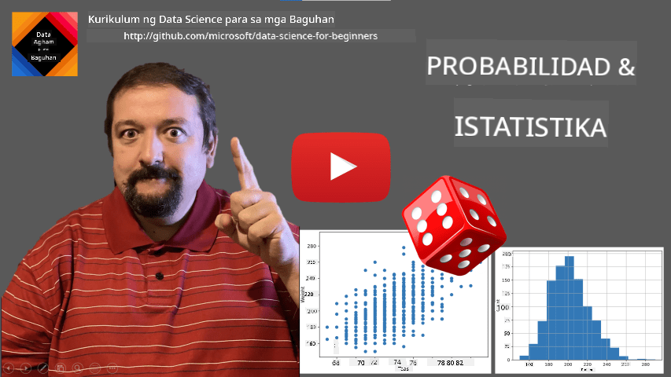
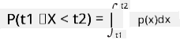
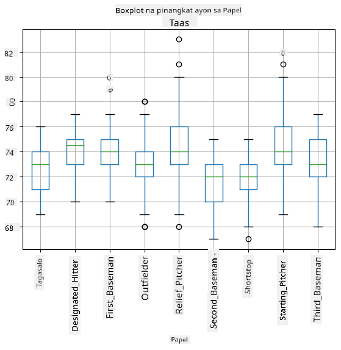
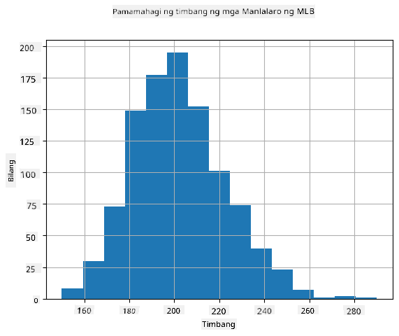
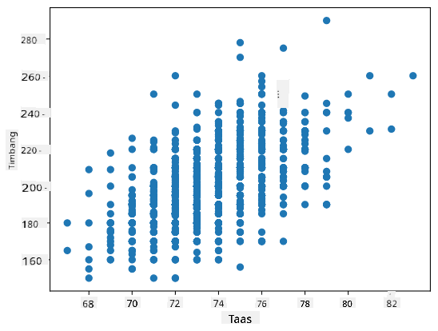

<!--
CO_OP_TRANSLATOR_METADATA:
{
  "original_hash": "8bbb3fa0d4ad61384a3b4b5f7560226f",
  "translation_date": "2025-09-04T21:04:42+00:00",
  "source_file": "1-Introduction/04-stats-and-probability/README.md",
  "language_code": "tl"
}
-->
# Isang Maikling Panimula sa Estadistika at Probabilidad

| ](../../sketchnotes/04-Statistics-Probability.png)|
|:---:|
| Estadistika at Probabilidad - _Sketchnote ni [@nitya](https://twitter.com/nitya)_ |

Ang Estadistika at Teorya ng Probabilidad ay dalawang malapit na kaugnay na larangan ng Matematika na may malaking kaugnayan sa Data Science. Posibleng magtrabaho gamit ang datos nang walang malalim na kaalaman sa matematika, ngunit mas mabuti pa rin na malaman ang ilang mga pangunahing konsepto. Dito, magbibigay kami ng maikling panimula na makakatulong sa iyong magsimula.

[](https://youtu.be/Z5Zy85g4Yjw)

## [Pre-lecture quiz](https://purple-hill-04aebfb03.1.azurestaticapps.net/quiz/6)

## Probabilidad at Random Variables

**Probabilidad** ay isang numero sa pagitan ng 0 at 1 na nagpapahayag kung gaano ka-posible ang isang **pangyayari**. Ito ay tinutukoy bilang bilang ng positibong resulta (na humahantong sa pangyayari), hinati sa kabuuang bilang ng mga resulta, sa kondisyon na ang lahat ng resulta ay pantay na posible. Halimbawa, kapag nag-roll tayo ng dice, ang probabilidad na makakuha tayo ng even na numero ay 3/6 = 0.5.

Kapag pinag-uusapan natin ang mga pangyayari, gumagamit tayo ng **random variables**. Halimbawa, ang random variable na kumakatawan sa numero na nakuha kapag nag-roll ng dice ay magkakaroon ng mga halaga mula 1 hanggang 6. Ang set ng mga numero mula 1 hanggang 6 ay tinatawag na **sample space**. Maaari nating pag-usapan ang probabilidad ng isang random variable na kumuha ng tiyak na halaga, halimbawa P(X=3)=1/6.

Ang random variable sa nakaraang halimbawa ay tinatawag na **discrete**, dahil mayroon itong countable sample space, ibig sabihin, may mga hiwalay na halaga na maaaring bilangin. May mga kaso kung saan ang sample space ay isang saklaw ng mga real numbers, o ang buong set ng real numbers. Ang ganitong mga variable ay tinatawag na **continuous**. Isang magandang halimbawa ay ang oras ng pagdating ng bus.

## Probability Distribution

Sa kaso ng discrete random variables, madali itong ilarawan ang probabilidad ng bawat pangyayari gamit ang isang function na P(X). Para sa bawat halaga *s* mula sa sample space *S*, magbibigay ito ng numero mula 0 hanggang 1, kung saan ang kabuuan ng lahat ng halaga ng P(X=s) para sa lahat ng pangyayari ay magiging 1.

Ang pinaka-kilalang discrete distribution ay ang **uniform distribution**, kung saan may sample space na N elements, na may pantay na probabilidad na 1/N para sa bawat isa.

Mas mahirap ilarawan ang probability distribution ng isang continuous variable, na may mga halaga na kinuha mula sa isang interval [a,b], o ang buong set ng real numbers ℝ. Isaalang-alang ang kaso ng oras ng pagdating ng bus. Sa katunayan, para sa bawat eksaktong oras ng pagdating *t*, ang probabilidad na dumating ang bus sa eksaktong oras na iyon ay 0!

> Ngayon alam mo na ang mga pangyayari na may probabilidad na 0 ay nangyayari, at madalas pa! Lalo na tuwing dumadating ang bus!

Maaari lamang nating pag-usapan ang probabilidad ng isang variable na bumagsak sa isang ibinigay na interval ng mga halaga, halimbawa P(t<sub>1</sub>≤X<t<sub>2</sub>). Sa kasong ito, ang probability distribution ay inilalarawan ng isang **probability density function** p(x), kung saan



Ang continuous analog ng uniform distribution ay tinatawag na **continuous uniform**, na tinutukoy sa isang finite interval. Ang probabilidad na ang halaga X ay bumagsak sa isang interval na may haba l ay proporsyonal sa l, at tumataas hanggang 1.

Isa pang mahalagang distribution ay ang **normal distribution**, na pag-uusapan natin nang mas detalyado sa ibaba.

## Mean, Variance at Standard Deviation

Ipagpalagay na kumuha tayo ng isang sequence ng n samples ng isang random variable X: x<sub>1</sub>, x<sub>2</sub>, ..., x<sub>n</sub>. Maaari nating tukuyin ang **mean** (o **arithmetic average**) na halaga ng sequence sa tradisyunal na paraan bilang (x<sub>1</sub>+x<sub>2</sub>+x<sub>n</sub>)/n. Habang lumalaki ang laki ng sample (ibig sabihin, kunin ang limitasyon na n→∞), makukuha natin ang mean (tinatawag ding **expectation**) ng distribution. Ipapakita natin ang expectation bilang **E**(x).

> Maipapakita na para sa anumang discrete distribution na may mga halaga {x<sub>1</sub>, x<sub>2</sub>, ..., x<sub>N</sub>} at mga kaukulang probabilidad p<sub>1</sub>, p<sub>2</sub>, ..., p<sub>N</sub>, ang expectation ay magiging E(X)=x<sub>1</sub>p<sub>1</sub>+x<sub>2</sub>p<sub>2</sub>+...+x<sub>N</sub>p<sub>N</sub>.

Upang matukoy kung gaano kalayo ang mga halaga, maaari nating kalkulahin ang variance σ<sup>2</sup> = ∑(x<sub>i</sub> - μ)<sup>2</sup>/n, kung saan ang μ ay ang mean ng sequence. Ang halaga σ ay tinatawag na **standard deviation**, at ang σ<sup>2</sup> ay tinatawag na **variance**.

## Mode, Median at Quartiles

Minsan, ang mean ay hindi sapat na kumakatawan sa "karaniwang" halaga para sa datos. Halimbawa, kapag may ilang extreme na halaga na lubos na labas sa saklaw, maaari nitong maapektuhan ang mean. Isa pang magandang indikasyon ay ang **median**, isang halaga kung saan kalahati ng mga data points ay mas mababa dito, at ang kalahati pa - mas mataas.

Upang matulungan tayong maunawaan ang distribution ng datos, kapaki-pakinabang na pag-usapan ang **quartiles**:

* Ang unang quartile, o Q1, ay isang halaga kung saan 25% ng datos ay mas mababa dito
* Ang ikatlong quartile, o Q3, ay isang halaga kung saan 75% ng datos ay mas mababa dito

Graphically, maaari nating ipakita ang relasyon sa pagitan ng median at quartiles sa isang diagram na tinatawag na **box plot**:


Dito, kinakalkula rin natin ang **inter-quartile range** IQR=Q3-Q1, at ang tinatawag na **outliers** - mga halaga na nasa labas ng mga hangganan [Q1-1.5*IQR,Q3+1.5*IQR].

Para sa finite distribution na naglalaman ng maliit na bilang ng posibleng mga halaga, ang isang magandang "karaniwang" halaga ay ang isa na madalas na lumilitaw, na tinatawag na **mode**. Madalas itong ginagamit sa categorical data, tulad ng mga kulay. Isaalang-alang ang sitwasyon kung saan mayroon tayong dalawang grupo ng tao - ang ilan ay mas gustong pula, at ang iba ay mas gustong asul. Kung iko-code natin ang mga kulay sa pamamagitan ng mga numero, ang mean na halaga para sa paboritong kulay ay maaaring nasa orange-green spectrum, na hindi nagpapakita ng aktwal na kagustuhan ng alinmang grupo. Gayunpaman, ang mode ay maaaring isa sa mga kulay, o parehong kulay, kung ang bilang ng mga tao na bumoto para sa kanila ay pantay (sa kasong ito tinatawag natin ang sample na **multimodal**).

## Datos mula sa Tunay na Mundo

Kapag sinusuri natin ang datos mula sa tunay na mundo, madalas na hindi sila random variables sa ganitong kahulugan na hindi tayo nagsasagawa ng mga eksperimento na may hindi tiyak na resulta. Halimbawa, isaalang-alang ang isang koponan ng mga manlalaro ng baseball, at ang kanilang mga datos ng katawan, tulad ng taas, timbang, at edad. Ang mga numerong ito ay hindi eksaktong random, ngunit maaari pa rin nating gamitin ang parehong mga konsepto ng matematika. Halimbawa, ang isang sequence ng mga timbang ng tao ay maaaring ituring na isang sequence ng mga halaga na kinuha mula sa isang random variable. Narito ang sequence ng mga timbang ng aktwal na mga manlalaro ng baseball mula sa [Major League Baseball](http://mlb.mlb.com/index.jsp), na kinuha mula sa [dataset na ito](http://wiki.stat.ucla.edu/socr/index.php/SOCR_Data_MLB_HeightsWeights) (para sa iyong kaginhawaan, ipinakita lamang ang unang 20 halaga):

```
[180.0, 215.0, 210.0, 210.0, 188.0, 176.0, 209.0, 200.0, 231.0, 180.0, 188.0, 180.0, 185.0, 160.0, 180.0, 185.0, 197.0, 189.0, 185.0, 219.0]
```

> **Note**: Upang makita ang halimbawa ng paggamit ng dataset na ito, tingnan ang [kasamang notebook](notebook.ipynb). Mayroon ding ilang mga hamon sa buong aralin na ito, at maaari mong kumpletuhin ang mga ito sa pamamagitan ng pagdaragdag ng ilang code sa notebook na iyon. Kung hindi ka sigurado kung paano mag-operate sa datos, huwag mag-alala - babalikan natin ang paggamit ng datos gamit ang Python sa susunod. Kung hindi mo alam kung paano magpatakbo ng code sa Jupyter Notebook, tingnan ang [artikulong ito](https://soshnikov.com/education/how-to-execute-notebooks-from-github/).

Narito ang box plot na nagpapakita ng mean, median, at quartiles para sa ating datos:


Dahil ang ating datos ay naglalaman ng impormasyon tungkol sa iba't ibang **roles** ng manlalaro, maaari rin tayong gumawa ng box plot ayon sa role - magbibigay ito sa atin ng ideya kung paano nagkakaiba ang mga halaga ng parameter sa bawat role. Sa pagkakataong ito, isasaalang-alang natin ang taas:



Ipinapakita ng diagram na ito na, sa karaniwan, ang taas ng mga first basemen ay mas mataas kaysa sa taas ng mga second basemen. Sa susunod na bahagi ng aralin na ito, matututunan natin kung paano mas pormal na masusubok ang hypothesis na ito, at kung paano ipakita na ang ating datos ay statistically significant upang patunayan ito.

> Kapag nagtatrabaho sa datos mula sa tunay na mundo, ipinapalagay natin na ang lahat ng data points ay mga samples na kinuha mula sa isang probability distribution. Ang assumption na ito ay nagbibigay-daan sa atin na mag-apply ng mga teknik sa machine learning at bumuo ng mga gumaganang predictive models.

Upang makita kung ano ang distribution ng ating datos, maaari tayong mag-plot ng graph na tinatawag na **histogram**. Ang X-axis ay maglalaman ng bilang ng iba't ibang weight intervals (tinatawag na **bins**), at ang vertical axis ay magpapakita ng bilang ng beses na ang sample ng ating random variable ay nasa loob ng isang ibinigay na interval.



Mula sa histogram na ito, makikita mo na ang lahat ng mga halaga ay nakasentro sa paligid ng tiyak na mean weight, at habang lumalayo tayo mula sa mean na iyon - mas kaunti ang mga timbang na may ganitong halaga ang natatagpuan. Ibig sabihin, napaka-improbable na ang timbang ng isang manlalaro ng baseball ay malayo sa mean weight. Ang variance ng mga timbang ay nagpapakita kung gaano kalaki ang posibilidad na magkaiba ang mga timbang mula sa mean.

> Kung kukunin natin ang mga timbang ng ibang tao, hindi mula sa baseball league, malamang na iba ang distribution. Gayunpaman, ang hugis ng distribution ay mananatiling pareho, ngunit ang mean at variance ay magbabago. Kaya, kung itetrain natin ang ating modelo sa mga manlalaro ng baseball, malamang na magbigay ito ng maling resulta kapag ginamit sa mga estudyante ng isang unibersidad, dahil magkaiba ang underlying distribution.

## Normal Distribution

Ang distribution ng mga timbang na nakita natin sa itaas ay napaka-karaniwan, at maraming sukat mula sa tunay na mundo ang sumusunod sa parehong uri ng distribution, ngunit may iba't ibang mean at variance. Ang distribution na ito ay tinatawag na **normal distribution**, at ito ay may mahalagang papel sa estadistika.

Ang paggamit ng normal distribution ay tamang paraan upang makabuo ng random weights ng mga potensyal na manlalaro ng baseball. Kapag alam na natin ang mean weight `mean` at standard deviation `std`, maaari tayong bumuo ng 1000 weight samples sa sumusunod na paraan:
```python
samples = np.random.normal(mean,std,1000)
``` 

Kung i-plot natin ang histogram ng mga sample na nabuo, makikita natin ang larawan na halos katulad ng ipinakita sa itaas. At kung dadagdagan natin ang bilang ng mga sample at ang bilang ng mga bins, maaari tayong bumuo ng larawan ng normal distribution na mas malapit sa ideal:


*Normal Distribution na may mean=0 at std.dev=1*

## Confidence Intervals

Kapag pinag-uusapan natin ang mga timbang ng mga manlalaro ng baseball, ipinapalagay natin na mayroong tiyak na **random variable W** na tumutugma sa ideal probability distribution ng mga timbang ng lahat ng manlalaro ng baseball (tinatawag na **population**). Ang ating sequence ng mga timbang ay tumutugma sa isang subset ng lahat ng manlalaro ng baseball na tinatawag nating **sample**. Isang kawili-wiling tanong ay, maaari ba nating malaman ang mga parameter ng distribution ng W, ibig sabihin, ang mean at variance ng population?

Ang pinakamadaling sagot ay kalkulahin ang mean at variance ng ating sample. Gayunpaman, maaaring mangyari na ang ating random sample ay hindi tumpak na kumakatawan sa buong population. Kaya't makatuwiran na pag-usapan ang **confidence interval**.
> **Ang confidence interval** ay ang pagtatantiya ng tunay na mean ng populasyon batay sa ating sample, na may tiyak na antas ng katiyakan (o **level of confidence**).
Kung mayroon tayong sample X<sub>1</sub>, ..., X<sub>n</sub> mula sa ating distribusyon, bawat beses na kumuha tayo ng sample mula sa distribusyon, magkakaroon tayo ng iba't ibang mean value μ. Kaya't ang μ ay maituturing na isang random variable. Ang **confidence interval** na may confidence p ay isang pares ng mga halaga (L<sub>p</sub>,R<sub>p</sub>), kung saan **P**(L<sub>p</sub>≤μ≤R<sub>p</sub>) = p, ibig sabihin, ang probabilidad na ang mean value na nasukat ay nasa loob ng interval ay katumbas ng p.

Hindi saklaw ng maikling intro na ito ang detalyadong talakayan kung paano kinakalkula ang mga confidence interval. Makakahanap ng karagdagang detalye [sa Wikipedia](https://en.wikipedia.org/wiki/Confidence_interval). Sa madaling salita, tinutukoy natin ang distribusyon ng computed sample mean kaugnay ng tunay na mean ng populasyon, na tinatawag na **student distribution**.

> **Kawili-wiling Katotohanan**: Ang student distribution ay ipinangalan sa matematikong si William Sealy Gosset, na naglathala ng kanyang papel sa ilalim ng pseudonym na "Student". Siya ay nagtrabaho sa Guinness brewery, at ayon sa isa sa mga bersyon, ayaw ng kanyang employer na malaman ng publiko na gumagamit sila ng mga statistical test upang suriin ang kalidad ng mga raw materials.

Kung nais nating tantiyahin ang mean μ ng ating populasyon na may confidence p, kailangan nating kunin ang *(1-p)/2-th percentile* ng Student distribution A, na maaaring makuha mula sa mga talahanayan, o kalkulahin gamit ang mga built-in na function ng statistical software (hal. Python, R, atbp.). Pagkatapos, ang interval para sa μ ay ibibigay ng X±A*D/√n, kung saan ang X ay ang mean na nakuha mula sa sample, at ang D ay ang standard deviation.

> **Tandaan**: Hindi rin natin tatalakayin ang mahalagang konsepto ng [degrees of freedom](https://en.wikipedia.org/wiki/Degrees_of_freedom_(statistics)), na mahalaga kaugnay ng Student distribution. Maaari kang mag-refer sa mas kumpletong mga libro sa statistics upang mas maunawaan ang konseptong ito.

Ang isang halimbawa ng pagkalkula ng confidence interval para sa timbang at taas ay makikita sa [kasamang notebook](notebook.ipynb).

| p | Mean ng Timbang |
|-----|-----------|
| 0.85 | 201.73±0.94 |
| 0.90 | 201.73±1.08 |
| 0.95 | 201.73±1.28 |

Pansinin na habang tumataas ang confidence probability, mas lumalawak ang confidence interval.

## Hypothesis Testing 

Sa dataset ng mga baseball players, may iba't ibang role ang mga manlalaro, na maaaring ibuod sa ibaba (tingnan ang [kasamang notebook](notebook.ipynb) upang makita kung paano makalkula ang talahanayan na ito):

| Role | Taas | Timbang | Bilang |
|------|--------|--------|-------|
| Catcher | 72.723684 | 204.328947 | 76 |
| Designated_Hitter | 74.222222 | 220.888889 | 18 |
| First_Baseman | 74.000000 | 213.109091 | 55 |
| Outfielder | 73.010309 | 199.113402 | 194 |
| Relief_Pitcher | 74.374603 | 203.517460 | 315 |
| Second_Baseman | 71.362069 | 184.344828 | 58 |
| Shortstop | 71.903846 | 182.923077 | 52 |
| Starting_Pitcher | 74.719457 | 205.163636 | 221 |
| Third_Baseman | 73.044444 | 200.955556 | 45 |

Mapapansin natin na ang mean height ng first basemen ay mas mataas kaysa sa second basemen. Kaya't maaari tayong matukso na mag-conclude na **mas matangkad ang first basemen kaysa sa second basemen**.

> Ang pahayag na ito ay tinatawag na **hypothesis**, dahil hindi natin alam kung ang katotohanan ay talagang totoo o hindi.

Gayunpaman, hindi laging halata kung maaari nating gawin ang konklusyon na ito. Mula sa talakayan sa itaas, alam natin na ang bawat mean ay may kaugnay na confidence interval, at kaya't ang pagkakaiba ay maaaring isang statistical error lamang. Kailangan natin ng mas pormal na paraan upang subukan ang ating hypothesis.

Kalkulahin natin ang confidence intervals nang hiwalay para sa taas ng first at second basemen:

| Confidence | First Basemen | Second Basemen |
|------------|---------------|----------------|
| 0.85 | 73.62..74.38 | 71.04..71.69 |
| 0.90 | 73.56..74.44 | 70.99..71.73 |
| 0.95 | 73.47..74.53 | 70.92..71.81 |

Makikita natin na sa anumang confidence level, hindi nag-o-overlap ang intervals. Pinapatunayan nito ang ating hypothesis na mas matangkad ang first basemen kaysa sa second basemen.

Mas pormal, ang problemang ating sinusubukan ay upang makita kung **pareho ang dalawang probability distributions**, o kahit man lang ay may parehong parameters. Depende sa distribusyon, kailangan nating gumamit ng iba't ibang tests para dito. Kung alam natin na ang ating distribusyon ay normal, maaari nating gamitin ang **[Student t-test](https://en.wikipedia.org/wiki/Student%27s_t-test)**.

Sa Student t-test, kinakalkula natin ang tinatawag na **t-value**, na nagpapakita ng pagkakaiba sa pagitan ng mga mean, isinasaalang-alang ang variance. Ipinapakita na ang t-value ay sumusunod sa **student distribution**, na nagbibigay-daan sa atin upang makuha ang threshold value para sa isang tiyak na confidence level **p** (maaaring kalkulahin, o tingnan sa numerical tables). Pagkatapos, ikukumpara natin ang t-value sa threshold upang aprubahan o tanggihan ang hypothesis.

Sa Python, maaari nating gamitin ang **SciPy** package, na may kasamang `ttest_ind` function (bukod sa maraming iba pang kapaki-pakinabang na statistical functions!). Kinakalkula nito ang t-value para sa atin, at ginagawa rin ang reverse lookup ng confidence p-value, kaya't maaari na lang nating tingnan ang confidence upang makagawa ng konklusyon.

Halimbawa, ang ating paghahambing sa taas ng first at second basemen ay nagbibigay sa atin ng mga sumusunod na resulta: 
```python
from scipy.stats import ttest_ind

tval, pval = ttest_ind(df.loc[df['Role']=='First_Baseman',['Height']], df.loc[df['Role']=='Designated_Hitter',['Height']],equal_var=False)
print(f"T-value = {tval[0]:.2f}\nP-value: {pval[0]}")
```
```
T-value = 7.65
P-value: 9.137321189738925e-12
```
Sa ating kaso, ang p-value ay napakababa, na nangangahulugang may malakas na ebidensiya na sumusuporta sa ideya na mas matangkad ang first basemen.

Mayroon ding iba't ibang uri ng hypothesis na maaaring nating subukan, halimbawa:
* Upang patunayan na ang isang sample ay sumusunod sa isang distribusyon. Sa ating kaso, ipinagpalagay natin na ang taas ay normal na distribusyon, ngunit kailangan nito ng pormal na statistical verification.
* Upang patunayan na ang mean value ng isang sample ay tumutugma sa isang paunang natukoy na halaga
* Upang ihambing ang mga mean ng ilang samples (hal. ano ang pagkakaiba sa antas ng kasiyahan sa iba't ibang age groups)

## Law of Large Numbers at Central Limit Theorem

Isa sa mga dahilan kung bakit mahalaga ang normal distribution ay ang tinatawag na **central limit theorem**. Halimbawa, mayroon tayong malaking sample ng independent N values X<sub>1</sub>, ..., X<sub>N</sub>, na kinuha mula sa anumang distribusyon na may mean μ at variance σ<sup>2</sup>. Pagkatapos, para sa sapat na malaking N (sa madaling salita, kapag N→∞), ang mean Σ<sub>i</sub>X<sub>i</sub> ay magiging normal na distribusyon, na may mean μ at variance σ<sup>2</sup>/N.

> Ang isa pang paraan upang maunawaan ang central limit theorem ay ang pagsasabi na anuman ang distribusyon, kapag kinalkula mo ang mean ng kabuuan ng anumang random variable values, magtatapos ka sa normal na distribusyon.

Mula sa central limit theorem, makikita rin na, kapag N→∞, ang probabilidad na ang sample mean ay katumbas ng μ ay nagiging 1. Ito ay kilala bilang **the law of large numbers**.

## Covariance at Correlation

Isa sa mga ginagawa ng Data Science ay ang paghahanap ng relasyon sa pagitan ng data. Sinasabi natin na ang dalawang sequences ay **correlate** kapag nagpapakita sila ng magkatulad na pag-uugali sa parehong oras, ibig sabihin, sabay silang tumataas/bumababa, o ang isang sequence ay tumataas kapag ang isa ay bumababa, at vice versa. Sa madaling salita, tila may relasyon sa pagitan ng dalawang sequences.

> Ang correlation ay hindi nangangahulugang may causal relationship sa pagitan ng dalawang sequences; minsan ang parehong variables ay maaaring nakadepende sa isang external na sanhi, o maaaring nagkataon lamang na nag-correlate ang dalawang sequences. Gayunpaman, ang malakas na mathematical correlation ay isang magandang indikasyon na ang dalawang variables ay may koneksyon.

Matematikal, ang pangunahing konsepto na nagpapakita ng relasyon sa pagitan ng dalawang random variables ay **covariance**, na kinakalkula tulad nito: Cov(X,Y) = **E**\[(X-**E**(X))(Y-**E**(Y))\]. Kinakalkula natin ang deviation ng parehong variables mula sa kanilang mean values, at pagkatapos ay ang produkto ng mga deviation na iyon. Kung parehong nagde-deviate ang variables nang sabay, ang produkto ay palaging magiging positibo, na magdadagdag sa positibong covariance. Kung parehong nagde-deviate nang hindi sabay (ibig sabihin, ang isa ay bumababa sa average kapag ang isa ay tumataas sa average), palagi tayong makakakuha ng negatibong mga numero, na magdadagdag sa negatibong covariance. Kung ang mga deviation ay hindi dependent, magdadagdag ang mga ito sa halos zero.

Ang absolute value ng covariance ay hindi nagsasabi ng marami tungkol sa kung gaano kalaki ang correlation, dahil nakadepende ito sa magnitude ng aktwal na mga halaga. Upang i-normalize ito, maaari nating hatiin ang covariance sa standard deviation ng parehong variables, upang makuha ang **correlation**. Ang maganda dito ay ang correlation ay palaging nasa saklaw ng [-1,1], kung saan ang 1 ay nagpapahiwatig ng malakas na positibong correlation sa pagitan ng mga halaga, -1 - malakas na negatibong correlation, at 0 - walang correlation (independent ang variables).

**Halimbawa**: Maaari nating kalkulahin ang correlation sa pagitan ng timbang at taas ng mga baseball players mula sa dataset na nabanggit sa itaas:
```python
print(np.corrcoef(weights,heights))
```
Bilang resulta, makakakuha tayo ng **correlation matrix** tulad nito:
```
array([[1.        , 0.52959196],
       [0.52959196, 1.        ]])
```

> Ang correlation matrix C ay maaaring kalkulahin para sa anumang bilang ng input sequences S<sub>1</sub>, ..., S<sub>n</sub>. Ang halaga ng C<sub>ij</sub> ay ang correlation sa pagitan ng S<sub>i</sub> at S<sub>j</sub>, at ang diagonal elements ay palaging 1 (na siyang self-correlation ng S<sub>i</sub>).

Sa ating kaso, ang halaga na 0.53 ay nagpapahiwatig na mayroong correlation sa pagitan ng timbang at taas ng isang tao. Maaari rin tayong gumawa ng scatter plot ng isang halaga laban sa isa pa upang makita ang relasyon nang biswal:



> Mas maraming halimbawa ng correlation at covariance ang makikita sa [kasamang notebook](notebook.ipynb).

## Konklusyon

Sa seksyong ito, natutunan natin:

* ang mga pangunahing statistical properties ng data, tulad ng mean, variance, mode, at quartiles
* iba't ibang distribusyon ng random variables, kabilang ang normal distribution
* kung paano hanapin ang correlation sa pagitan ng iba't ibang properties
* kung paano gamitin ang tamang mathematical at statistical apparatus upang patunayan ang ilang hypotheses
* kung paano kalkulahin ang confidence intervals para sa random variable gamit ang data sample

Bagama't hindi ito kumpletong listahan ng mga paksa sa probability at statistics, sapat na ito upang bigyan ka ng magandang simula sa kursong ito.

## 🚀 Hamon

Gamitin ang sample code sa notebook upang subukan ang iba pang hypothesis na: 
1. Mas matanda ang first basemen kaysa sa second basemen
2. Mas matangkad ang first basemen kaysa sa third basemen
3. Mas matangkad ang shortstops kaysa sa second basemen

## [Post-lecture quiz](https://ff-quizzes.netlify.app/en/ds/)

## Review at Pag-aaral sa Sarili

Ang probability at statistics ay napakalawak na paksa na nararapat magkaroon ng sariling kurso. Kung nais mong mas lumalim sa teorya, maaaring mong ipagpatuloy ang pagbabasa ng ilan sa mga sumusunod na libro:

1. [Carlos Fernandez-Granda](https://cims.nyu.edu/~cfgranda/) mula sa New York University ay may mahusay na lecture notes [Probability and Statistics for Data Science](https://cims.nyu.edu/~cfgranda/pages/stuff/probability_stats_for_DS.pdf) (available online)
1. [Peter at Andrew Bruce. Practical Statistics for Data Scientists.](https://www.oreilly.com/library/view/practical-statistics-for/9781491952955/) [[sample code sa R](https://github.com/andrewgbruce/statistics-for-data-scientists)]. 
1. [James D. Miller. Statistics for Data Science](https://www.packtpub.com/product/statistics-for-data-science/9781788290678) [[sample code sa R](https://github.com/PacktPublishing/Statistics-for-Data-Science)]

## Assignment

[Small Diabetes Study](assignment.md)

## Credits

Ang lesson na ito ay isinulat nang may ♥️ ni [Dmitry Soshnikov](http://soshnikov.com)

---

**Paunawa**:  
Ang dokumentong ito ay isinalin gamit ang AI translation service na [Co-op Translator](https://github.com/Azure/co-op-translator). Bagama't sinisikap naming maging tumpak, tandaan na ang mga awtomatikong pagsasalin ay maaaring maglaman ng mga pagkakamali o hindi pagkakatugma. Ang orihinal na dokumento sa kanyang katutubong wika ang dapat ituring na opisyal na sanggunian. Para sa mahalagang impormasyon, inirerekomenda ang propesyonal na pagsasalin ng tao. Hindi kami mananagot sa anumang hindi pagkakaunawaan o maling interpretasyon na dulot ng paggamit ng pagsasaling ito.