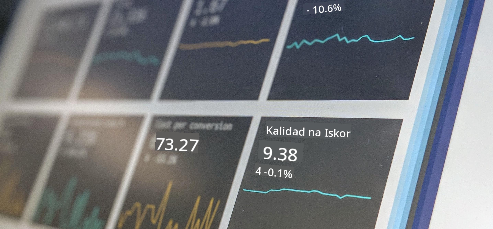

<!--
CO_OP_TRANSLATOR_METADATA:
{
  "original_hash": "696a8474a01054281704cbfb09148949",
  "translation_date": "2025-08-28T02:42:43+00:00",
  "source_file": "1-Introduction/README.md",
  "language_code": "tl"
}
-->
# Panimula sa Data Science

> Larawan ni <a href="https://unsplash.com/@dawson2406?utm_source=unsplash&utm_medium=referral&utm_content=creditCopyText">Stephen Dawson</a> sa <a href="https://unsplash.com/s/photos/data?utm_source=unsplash&utm_medium=referral&utm_content=creditCopyText">Unsplash</a>
  
Sa mga araling ito, matutuklasan mo kung paano tinutukoy ang Data Science at matututo tungkol sa mga etikal na konsiderasyon na dapat isaalang-alang ng isang data scientist. Malalaman mo rin kung paano tinutukoy ang data at magkakaroon ng kaunting kaalaman tungkol sa estadistika at probabilidad, ang mga pangunahing akademikong larangan ng Data Science.

### Mga Paksa

1. [Pagpapakilala sa Data Science](01-defining-data-science/README.md)
2. [Etika sa Data Science](02-ethics/README.md)
3. [Pagpapakilala sa Data](03-defining-data/README.md)
4. [Panimula sa Estadistika at Probabilidad](04-stats-and-probability/README.md)

### Mga Kredito

Ang mga araling ito ay isinulat nang may ❤️ nina [Nitya Narasimhan](https://twitter.com/nitya) at [Dmitry Soshnikov](https://twitter.com/shwars).

---

**Paunawa**:  
Ang dokumentong ito ay isinalin gamit ang AI translation service na [Co-op Translator](https://github.com/Azure/co-op-translator). Bagama't sinisikap naming maging tumpak, tandaan na ang mga awtomatikong pagsasalin ay maaaring maglaman ng mga pagkakamali o hindi pagkakatugma. Ang orihinal na dokumento sa kanyang katutubong wika ang dapat ituring na opisyal na pinagmulan. Para sa mahalagang impormasyon, inirerekomenda ang propesyonal na pagsasalin ng tao. Hindi kami mananagot sa anumang hindi pagkakaunawaan o maling interpretasyon na maaaring magmula sa paggamit ng pagsasaling ito.