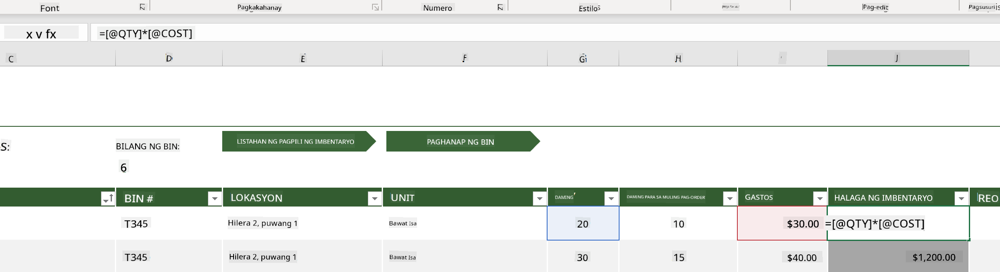
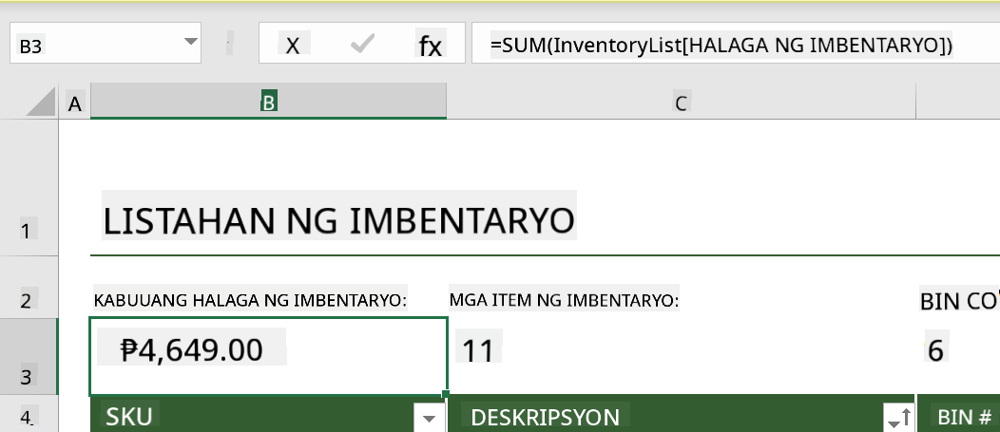
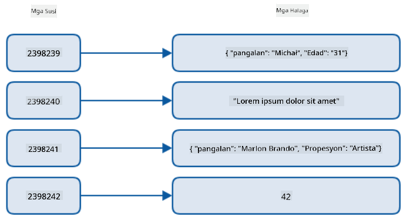
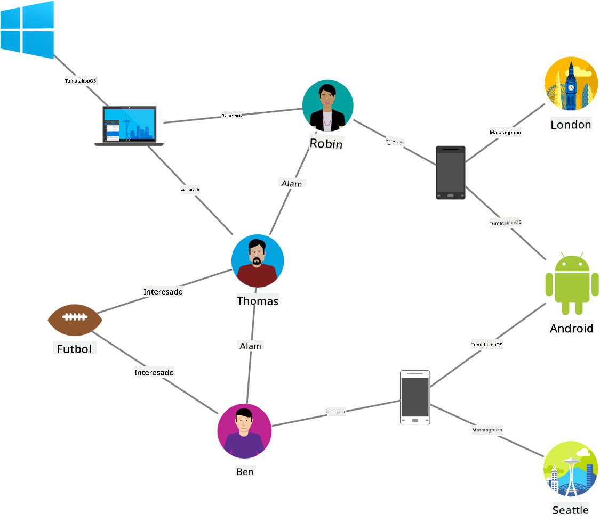
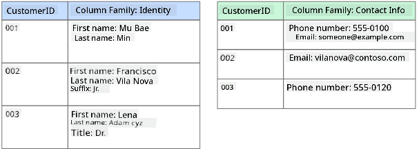
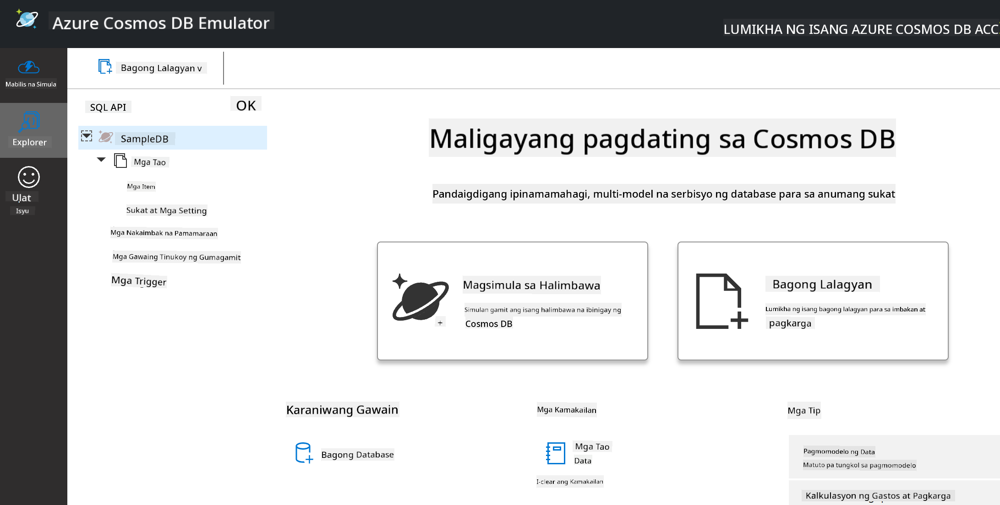
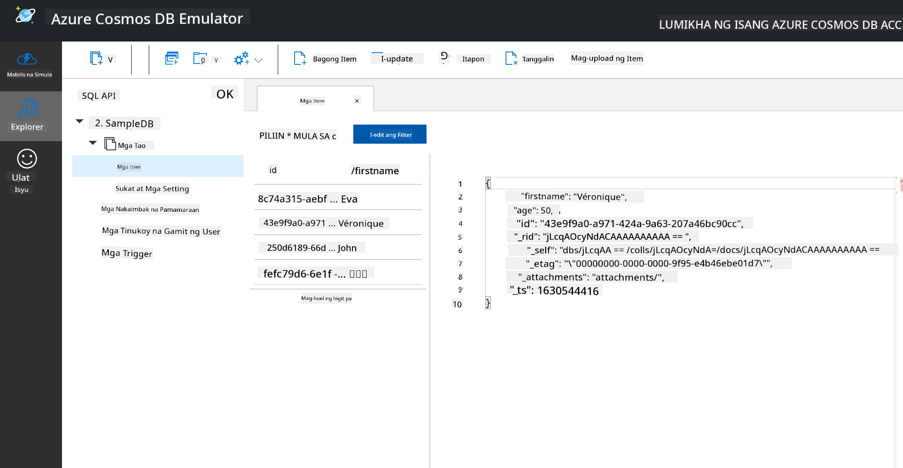

<!--
CO_OP_TRANSLATOR_METADATA:
{
  "original_hash": "32ddfef8121650f2ca2f3416fd283c37",
  "translation_date": "2025-08-28T02:26:54+00:00",
  "source_file": "2-Working-With-Data/06-non-relational/README.md",
  "language_code": "tl"
}
-->
# Paggawa gamit ang Data: Non-Relational Data

| ](../../sketchnotes/06-NoSQL.png)|
|:---:|
|Paggawa gamit ang NoSQL Data - _Sketchnote ni [@nitya](https://twitter.com/nitya)_ |

## [Pre-Lecture Quiz](https://purple-hill-04aebfb03.1.azurestaticapps.net/quiz/10)

Ang data ay hindi limitado sa relational databases. Ang araling ito ay nakatuon sa non-relational data at tatalakayin ang mga pangunahing kaalaman sa spreadsheets at NoSQL.

## Spreadsheets

Ang spreadsheets ay isang popular na paraan ng pag-iimbak at pagsusuri ng data dahil mas kaunting trabaho ang kinakailangan upang magsimula. Sa araling ito, matututunan mo ang mga pangunahing bahagi ng isang spreadsheet, pati na rin ang mga formula at function. Ang mga halimbawa ay ipapakita gamit ang Microsoft Excel, ngunit karamihan sa mga bahagi at paksa ay magkakaroon ng magkatulad na pangalan at hakbang kumpara sa ibang spreadsheet software.


Ang spreadsheet ay isang file na maa-access sa file system ng isang computer, device, o cloud-based file system. Ang software mismo ay maaaring browser-based o isang application na kailangang i-install sa computer o i-download bilang app. Sa Excel, ang mga file na ito ay tinatawag ding **workbooks**, at ang terminolohiyang ito ang gagamitin sa natitirang bahagi ng araling ito.

Ang isang workbook ay naglalaman ng isa o higit pang **worksheets**, kung saan ang bawat worksheet ay may label na mga tab. Sa loob ng isang worksheet ay may mga parihaba na tinatawag na **cells**, na naglalaman ng aktwal na data. Ang isang cell ay ang intersection ng isang row at column, kung saan ang mga column ay may label na mga alpabetikong karakter at ang mga row ay may label na numerically. Ang ilang spreadsheets ay naglalaman ng mga header sa unang ilang row upang ilarawan ang data sa isang cell.

Gamit ang mga pangunahing elemento ng isang Excel workbook, gagamit tayo ng isang halimbawa mula sa [Microsoft Templates](https://templates.office.com/) na nakatuon sa isang imbentaryo upang talakayin ang ilang karagdagang bahagi ng isang spreadsheet.

### Pamamahala ng Inventory

Ang spreadsheet file na pinangalanang "InventoryExample" ay isang formatted spreadsheet ng mga item sa isang imbentaryo na naglalaman ng tatlong worksheets, kung saan ang mga tab ay may label na "Inventory List", "Inventory Pick List" at "Bin Lookup". Ang Row 4 ng Inventory List worksheet ay ang header, na naglalarawan sa halaga ng bawat cell sa header column.



May mga pagkakataon kung saan ang isang cell ay nakadepende sa mga halaga ng ibang cells upang makabuo ng sarili nitong halaga. Ang Inventory List spreadsheet ay nagtatala ng gastos ng bawat item sa imbentaryo nito, ngunit paano kung kailangan nating malaman ang kabuuang halaga ng lahat ng nasa imbentaryo? Ang [**Formulas**](https://support.microsoft.com/en-us/office/overview-of-formulas-34519a4e-1e8d-4f4b-84d4-d642c4f63263) ay gumagawa ng mga aksyon sa cell data at ginagamit upang kalkulahin ang halaga ng imbentaryo sa halimbawang ito. Ang spreadsheet na ito ay gumamit ng formula sa Inventory Value column upang kalkulahin ang halaga ng bawat item sa pamamagitan ng pag-multiply sa dami sa ilalim ng QTY header at ang gastos sa mga cells sa ilalim ng COST header. Ang pag-double click o pag-highlight sa isang cell ay magpapakita ng formula. Mapapansin mo na ang mga formula ay nagsisimula sa isang equals sign, na sinusundan ng kalkulasyon o operasyon.



Maaari tayong gumamit ng isa pang formula upang idagdag ang lahat ng mga halaga ng Inventory Value upang makuha ang kabuuang halaga nito. Maaari itong kalkulahin sa pamamagitan ng pagdaragdag ng bawat cell upang makabuo ng kabuuan, ngunit maaaring maging nakakapagod ang gawaing iyon. Ang Excel ay may [**functions**](https://support.microsoft.com/en-us/office/sum-function-043e1c7d-7726-4e80-8f32-07b23e057f89), o mga predefined formulas upang magsagawa ng mga kalkulasyon sa cell values. Ang mga function ay nangangailangan ng arguments, na mga kinakailangang halaga upang maisagawa ang mga kalkulasyong ito. Kapag ang mga function ay nangangailangan ng higit sa isang argument, kailangang ilista ang mga ito sa partikular na pagkakasunod-sunod o maaaring hindi tama ang kalkulasyon ng function. Ang halimbawang ito ay gumagamit ng SUM function, at ginagamit ang mga halaga ng Inventory Value bilang argument upang makabuo ng kabuuan na nakalista sa ilalim ng row 3, column B (tinatawag ding B3).

## NoSQL

Ang NoSQL ay isang payong termino para sa iba't ibang paraan ng pag-iimbak ng non-relational data at maaaring ipakahulugan bilang "non-SQL", "non-relational" o "not only SQL". Ang mga ganitong uri ng database systems ay maaaring ikategorya sa 4 na uri.


> Pinagmulan mula sa [Michał Białecki Blog](https://www.michalbialecki.com/2018/03/18/azure-cosmos-db-key-value-database-cloud/)

Ang [Key-value](https://docs.microsoft.com/en-us/azure/architecture/data-guide/big-data/non-relational-data#keyvalue-data-stores) databases ay nagpa-pair ng mga natatanging keys, na isang natatanging identifier na nauugnay sa isang value. Ang mga pairs na ito ay iniimbak gamit ang isang [hash table](https://www.hackerearth.com/practice/data-structures/hash-tables/basics-of-hash-tables/tutorial/) na may angkop na hashing function.


> Pinagmulan mula sa [Microsoft](https://docs.microsoft.com/en-us/azure/cosmos-db/graph/graph-introduction#graph-database-by-example)

Ang [Graph](https://docs.microsoft.com/en-us/azure/architecture/data-guide/big-data/non-relational-data#graph-data-stores) databases ay naglalarawan ng mga relasyon sa data at kinakatawan bilang isang koleksyon ng nodes at edges. Ang isang node ay kumakatawan sa isang entity, isang bagay na umiiral sa totoong mundo tulad ng isang estudyante o bank statement. Ang mga edges ay kumakatawan sa relasyon sa pagitan ng dalawang entities. Ang bawat node at edge ay may mga properties na nagbibigay ng karagdagang impormasyon tungkol sa bawat node at edge.



Ang [Columnar](https://docs.microsoft.com/en-us/azure/architecture/data-guide/big-data/non-relational-data#columnar-data-stores) data stores ay nag-oorganisa ng data sa mga column at rows tulad ng isang relational data structure ngunit ang bawat column ay hinahati sa mga grupo na tinatawag na column family, kung saan ang lahat ng data sa ilalim ng isang column ay magkakaugnay at maaaring makuha o mabago bilang isang unit.

### Document Data Stores gamit ang Azure Cosmos DB

Ang [Document](https://docs.microsoft.com/en-us/azure/architecture/data-guide/big-data/non-relational-data#document-data-stores) data stores ay nakabatay sa konsepto ng isang key-value data store at binubuo ng isang serye ng fields at objects. Ang seksyong ito ay mag-eexplore ng document databases gamit ang Cosmos DB emulator.

Ang Cosmos DB database ay tumutugma sa kahulugan ng "Not Only SQL", kung saan ang document database ng Cosmos DB ay umaasa sa SQL upang mag-query ng data. Ang [nakaraang aralin](../05-relational-databases/README.md) tungkol sa SQL ay tumatalakay sa mga pangunahing kaalaman ng wika, at magagamit natin ang ilan sa parehong queries sa isang document database dito. Gagamitin natin ang Cosmos DB Emulator, na nagbibigay-daan sa atin na lumikha at mag-explore ng isang document database nang lokal sa isang computer. Basahin ang higit pa tungkol sa Emulator [dito](https://docs.microsoft.com/en-us/azure/cosmos-db/local-emulator?tabs=ssl-netstd21).

Ang isang dokumento ay isang koleksyon ng fields at object values, kung saan ang mga fields ay naglalarawan kung ano ang kinakatawan ng object value. Narito ang isang halimbawa ng dokumento.

```json
{
    "firstname": "Eva",
    "age": 44,
    "id": "8c74a315-aebf-4a16-bb38-2430a9896ce5",
    "_rid": "bHwDAPQz8s0BAAAAAAAAAA==",
    "_self": "dbs/bHwDAA==/colls/bHwDAPQz8s0=/docs/bHwDAPQz8s0BAAAAAAAAAA==/",
    "_etag": "\"00000000-0000-0000-9f95-010a691e01d7\"",
    "_attachments": "attachments/",
    "_ts": 1630544034
}
```

Ang mga fields na mahalaga sa dokumentong ito ay: `firstname`, `id`, at `age`. Ang natitirang mga fields na may underscores ay awtomatikong ginawa ng Cosmos DB.

#### Pag-eexplore ng Data gamit ang Cosmos DB Emulator

Maaari mong i-download at i-install ang emulator [para sa Windows dito](https://aka.ms/cosmosdb-emulator). Tingnan ang [dokumentasyon](https://docs.microsoft.com/en-us/azure/cosmos-db/local-emulator?tabs=ssl-netstd21#run-on-linux-macos) para sa mga opsyon kung paano patakbuhin ang Emulator para sa macOS at Linux.

Ang Emulator ay naglulunsad ng isang browser window, kung saan ang Explorer view ay nagbibigay-daan sa iyo na mag-explore ng mga dokumento.



Kung sumusunod ka, i-click ang "Start with Sample" upang makabuo ng isang sample database na tinatawag na SampleDB. Kung i-expand mo ang Sample DB sa pamamagitan ng pag-click sa arrow, makakakita ka ng isang container na tinatawag na `Persons`. Ang isang container ay naglalaman ng koleksyon ng mga items, na mga dokumento sa loob ng container. Maaari mong i-explore ang apat na indibidwal na dokumento sa ilalim ng `Items`.



#### Pag-query ng Document Data gamit ang Cosmos DB Emulator

Maaari rin nating i-query ang sample data sa pamamagitan ng pag-click sa bagong SQL Query button (pangalawang button mula sa kaliwa).

`SELECT * FROM c` ay nagbabalik ng lahat ng dokumento sa container. Magdagdag tayo ng where clause at hanapin ang lahat ng mas bata sa 40.

`SELECT * FROM c where c.age < 40`


Ang query ay nagbabalik ng dalawang dokumento, mapapansin na ang age value para sa bawat dokumento ay mas mababa sa 40.

#### JSON at Dokumento

Kung pamilyar ka sa JavaScript Object Notation (JSON), mapapansin mo na ang mga dokumento ay mukhang katulad ng JSON. Mayroong `PersonsData.json` file sa direktoryong ito na maaari mong i-upload sa Persons container sa Emulator gamit ang `Upload Item` button.

Sa karamihan ng mga pagkakataon, ang mga API na nagbabalik ng JSON data ay maaaring direktang ilipat at iimbak sa document databases. Narito ang isa pang dokumento, ito ay kumakatawan sa mga tweets mula sa Microsoft Twitter account na nakuha gamit ang Twitter API, pagkatapos ay isinama sa Cosmos DB.

```json
{
    "created_at": "2021-08-31T19:03:01.000Z",
    "id": "1432780985872142341",
    "text": "Blank slate. Like this tweet if you’ve ever painted in Microsoft Paint before. https://t.co/cFeEs8eOPK",
    "_rid": "dhAmAIUsA4oHAAAAAAAAAA==",
    "_self": "dbs/dhAmAA==/colls/dhAmAIUsA4o=/docs/dhAmAIUsA4oHAAAAAAAAAA==/",
    "_etag": "\"00000000-0000-0000-9f84-a0958ad901d7\"",
    "_attachments": "attachments/",
    "_ts": 1630537000
```

Ang mga fields na mahalaga sa dokumentong ito ay: `created_at`, `id`, at `text`.

## 🚀 Hamon

Mayroong `TwitterData.json` file na maaari mong i-upload sa SampleDB database. Inirerekomenda na idagdag mo ito sa isang hiwalay na container. Maaari itong gawin sa pamamagitan ng:

1. Pag-click sa bagong container button sa kanang itaas
1. Pagpili sa umiiral na database (SampleDB) at paggawa ng container id para sa container
1. Pagtatakda ng partition key sa `/id`
1. Pag-click sa OK (maaari mong balewalain ang natitirang impormasyon sa view na ito dahil ito ay isang maliit na dataset na tumatakbo nang lokal sa iyong makina)
1. Buksan ang iyong bagong container at i-upload ang Twitter Data file gamit ang `Upload Item` button

Subukang magpatakbo ng ilang select queries upang hanapin ang mga dokumento na may Microsoft sa text field. Pahiwatig: subukang gamitin ang [LIKE keyword](https://docs.microsoft.com/en-us/azure/cosmos-db/sql/sql-query-keywords#using-like-with-the--wildcard-character)

## [Post-Lecture Quiz](https://purple-hill-04aebfb03.1.azurestaticapps.net/quiz/11)

## Review at Pag-aaral sa Sarili

- Mayroong ilang karagdagang formatting at features na idinagdag sa spreadsheet na hindi saklaw ng araling ito. Ang Microsoft ay may [malaking library ng dokumentasyon at mga video](https://support.microsoft.com/excel) tungkol sa Excel kung interesado kang matuto pa.

- Ang dokumentasyong pang-arkitektura na ito ay nagdedetalye ng mga katangian sa iba't ibang uri ng non-relational data: [Non-relational Data and NoSQL](https://docs.microsoft.com/en-us/azure/architecture/data-guide/big-data/non-relational-data)

- Ang Cosmos DB ay isang cloud-based non-relational database na maaari ring mag-imbak ng iba't ibang uri ng NoSQL na nabanggit sa araling ito. Matuto pa tungkol sa mga uri na ito sa [Cosmos DB Microsoft Learn Module](https://docs.microsoft.com/en-us/learn/paths/work-with-nosql-data-in-azure-cosmos-db/)

## Takdang-Aralin

[Soda Profits](assignment.md)

---

**Paunawa**:  
Ang dokumentong ito ay isinalin gamit ang AI translation service na [Co-op Translator](https://github.com/Azure/co-op-translator). Bagama't sinisikap naming maging tumpak, tandaan na ang mga awtomatikong pagsasalin ay maaaring maglaman ng mga pagkakamali o hindi pagkakatugma. Ang orihinal na dokumento sa kanyang katutubong wika ang dapat ituring na opisyal na pinagmulan. Para sa mahalagang impormasyon, inirerekomenda ang propesyonal na pagsasalin ng tao. Hindi kami mananagot sa anumang hindi pagkakaunawaan o maling interpretasyon na dulot ng paggamit ng pagsasaling ito.