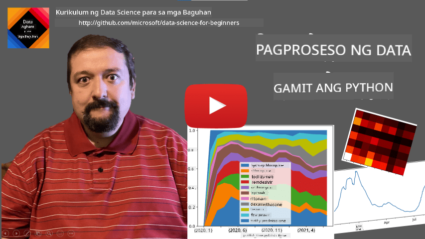
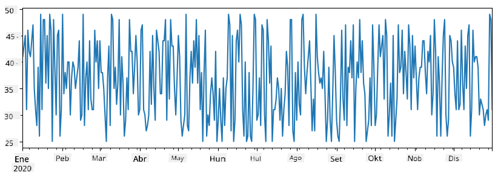
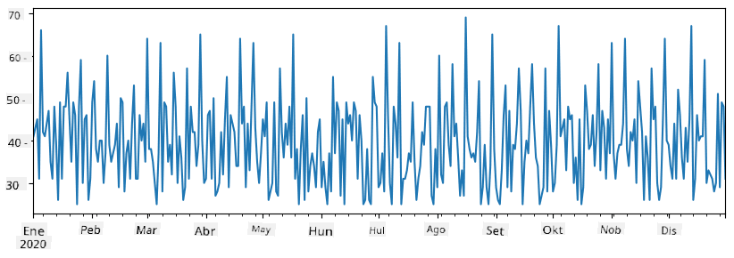
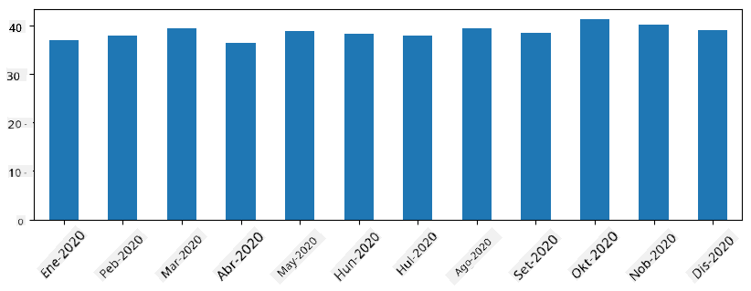
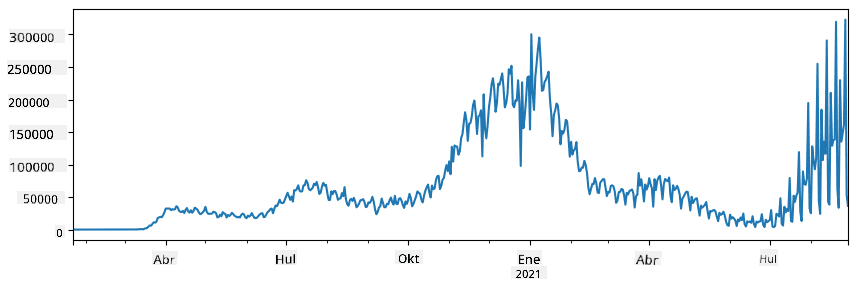
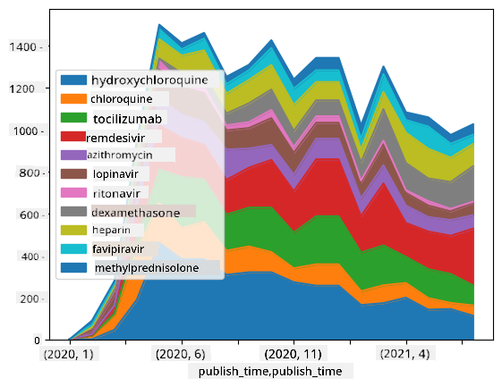

<!--
CO_OP_TRANSLATOR_METADATA:
{
  "original_hash": "116c5d361fbe812e59a73f37ce721d36",
  "translation_date": "2025-08-28T02:27:37+00:00",
  "source_file": "2-Working-With-Data/07-python/README.md",
  "language_code": "tl"
}
-->
# Paggamit ng Data: Python at ang Pandas Library

|  ](../../sketchnotes/07-WorkWithPython.png) |
| :-------------------------------------------------------------------------------------------------------: |
|                 Paggamit ng Python - _Sketchnote ni [@nitya](https://twitter.com/nitya)_                 |

[](https://youtu.be/dZjWOGbsN4Y)

Bagama't ang mga database ay nagbibigay ng napaka-epektibong paraan upang mag-imbak ng data at mag-query gamit ang mga query language, ang pinaka-flexible na paraan ng pagproseso ng data ay ang pagsusulat ng sarili mong programa upang manipulahin ang data. Sa maraming pagkakataon, mas epektibo ang paggamit ng database query. Gayunpaman, sa ilang mga kaso kung saan mas kumplikado ang kinakailangang pagproseso ng data, hindi ito madaling magawa gamit ang SQL. 

Ang pagproseso ng data ay maaaring gawin gamit ang anumang programming language, ngunit may mga partikular na wika na mas mataas ang antas pagdating sa pagproseso ng data. Karaniwang ginagamit ng mga data scientist ang isa sa mga sumusunod na wika:

* **[Python](https://www.python.org/)**, isang general-purpose programming language, na madalas itinuturing na isa sa mga pinakamahusay na opsyon para sa mga baguhan dahil sa pagiging simple nito. Maraming karagdagang library ang Python na makakatulong sa iyo na lutasin ang maraming praktikal na problema, tulad ng pagkuha ng data mula sa ZIP archive, o pag-convert ng larawan sa grayscale. Bukod sa data science, madalas ding ginagamit ang Python para sa web development. 
* **[R](https://www.r-project.org/)** ay isang tradisyunal na toolbox na binuo para sa statistical data processing. Mayroon din itong malaking repository ng mga library (CRAN), na ginagawang magandang opsyon para sa pagproseso ng data. Gayunpaman, ang R ay hindi isang general-purpose programming language, at bihirang ginagamit sa labas ng larangan ng data science.
* **[Julia](https://julialang.org/)** ay isa pang wika na partikular na binuo para sa data science. Nilalayon nitong magbigay ng mas mahusay na performance kaysa sa Python, na ginagawang mahusay na tool para sa scientific experimentation.

Sa araling ito, magtutuon tayo sa paggamit ng Python para sa simpleng pagproseso ng data. Ipinapalagay na mayroong kaunting kaalaman sa wika. Kung nais mong mas malalim na pag-aaral sa Python, maaari kang sumangguni sa isa sa mga sumusunod na resources:

* [Matutong Python sa Masayang Paraan gamit ang Turtle Graphics at Fractals](https://github.com/shwars/pycourse) - GitHub-based na mabilisang intro course sa Python Programming
* [Simulan ang Iyong Unang Hakbang sa Python](https://docs.microsoft.com/en-us/learn/paths/python-first-steps/?WT.mc_id=academic-77958-bethanycheum) Learning Path sa [Microsoft Learn](http://learn.microsoft.com/?WT.mc_id=academic-77958-bethanycheum)

Ang data ay maaaring dumating sa iba't ibang anyo. Sa araling ito, isasaalang-alang natin ang tatlong anyo ng data - **tabular data**, **text**, at **images**.

Magbibigay tayo ng ilang halimbawa ng pagproseso ng data, sa halip na magbigay ng kumpletong overview ng lahat ng kaugnay na library. Ito ay magbibigay-daan sa iyo na makuha ang pangunahing ideya ng kung ano ang posible, at mag-iwan sa iyo ng kaalaman kung saan hahanapin ang mga solusyon sa iyong mga problema kapag kailangan mo.

> **Pinakamahalagang payo**. Kapag kailangan mong magsagawa ng partikular na operasyon sa data na hindi mo alam kung paano gawin, subukang maghanap nito sa internet. Ang [Stackoverflow](https://stackoverflow.com/) ay karaniwang naglalaman ng maraming kapaki-pakinabang na code sample sa Python para sa maraming karaniwang gawain.

## [Pre-lecture quiz](https://purple-hill-04aebfb03.1.azurestaticapps.net/quiz/12)

## Tabular Data at Dataframes

Nakilala mo na ang tabular data noong pinag-usapan natin ang relational databases. Kapag marami kang data, at ito ay nakapaloob sa maraming magkakaugnay na mga table, tiyak na may katuturan ang paggamit ng SQL para sa pagproseso nito. Gayunpaman, may mga pagkakataon na mayroon tayong table ng data, at kailangan nating makakuha ng **pag-unawa** o **insights** tungkol sa data na ito, tulad ng distribution, correlation sa pagitan ng mga halaga, at iba pa. Sa data science, maraming pagkakataon na kailangan nating magsagawa ng ilang mga transformation ng orihinal na data, na sinusundan ng visualization. Ang parehong mga hakbang na ito ay madaling magawa gamit ang Python.

Mayroong dalawang pinaka-kapaki-pakinabang na library sa Python na makakatulong sa iyo sa pagproseso ng tabular data:
* **[Pandas](https://pandas.pydata.org/)** ay nagbibigay-daan sa iyo na manipulahin ang tinatawag na **Dataframes**, na katulad ng relational tables. Maaari kang magkaroon ng mga column na may pangalan, at magsagawa ng iba't ibang operasyon sa row, column, at dataframes sa pangkalahatan. 
* **[Numpy](https://numpy.org/)** ay isang library para sa pagproseso ng **tensors**, ibig sabihin, multi-dimensional **arrays**. Ang array ay may mga halaga ng parehong underlying type, at mas simple kaysa sa dataframe, ngunit nag-aalok ito ng mas maraming mathematical operations, at mas kaunting overhead.

Mayroon ding ilang iba pang mga library na dapat mong malaman:
* **[Matplotlib](https://matplotlib.org/)** ay isang library na ginagamit para sa data visualization at pag-plot ng mga graph
* **[SciPy](https://www.scipy.org/)** ay isang library na may ilang karagdagang scientific functions. Nakilala na natin ang library na ito noong pinag-usapan ang probability at statistics.

Narito ang isang piraso ng code na karaniwang ginagamit upang i-import ang mga library na ito sa simula ng iyong Python program:
```python
import numpy as np
import pandas as pd
import matplotlib.pyplot as plt
from scipy import ... # you need to specify exact sub-packages that you need
``` 

Ang Pandas ay nakasentro sa ilang mga pangunahing konsepto.

### Series 

Ang **Series** ay isang sequence ng mga halaga, katulad ng list o numpy array. Ang pangunahing pagkakaiba ay ang series ay mayroon ding **index**, at kapag nag-ooperate tayo sa series (hal., ina-add ang mga ito), isinasaalang-alang ang index. Ang index ay maaaring kasing simple ng integer row number (ito ang default na index kapag gumagawa ng series mula sa list o array), o maaari itong magkaroon ng mas kumplikadong istruktura, tulad ng date interval.

> **Note**: May introductory Pandas code sa kasamang notebook [`notebook.ipynb`](notebook.ipynb). Ibinabalangkas lamang namin ang ilang mga halimbawa dito, at tiyak na malugod kang suriin ang buong notebook.

Isaalang-alang ang isang halimbawa: nais nating suriin ang benta ng aming ice-cream spot. Gumawa tayo ng series ng mga numero ng benta (bilang ng mga item na nabenta bawat araw) para sa ilang panahon:

```python
start_date = "Jan 1, 2020"
end_date = "Mar 31, 2020"
idx = pd.date_range(start_date,end_date)
print(f"Length of index is {len(idx)}")
items_sold = pd.Series(np.random.randint(25,50,size=len(idx)),index=idx)
items_sold.plot()
```


Ngayon ipagpalagay na bawat linggo ay nag-oorganisa tayo ng party para sa mga kaibigan, at kumukuha ng karagdagang 10 pack ng ice-cream para sa party. Maaari tayong gumawa ng isa pang series, na naka-index ayon sa linggo, upang ipakita iyon:
```python
additional_items = pd.Series(10,index=pd.date_range(start_date,end_date,freq="W"))
```
Kapag pinagsama natin ang dalawang series, makakakuha tayo ng kabuuang bilang:
```python
total_items = items_sold.add(additional_items,fill_value=0)
total_items.plot()
```


> **Note** na hindi natin ginagamit ang simpleng syntax `total_items+additional_items`. Kung ginawa natin, makakakuha tayo ng maraming `NaN` (*Not a Number*) na mga halaga sa resulting series. Ito ay dahil may mga nawawalang halaga para sa ilang mga index point sa `additional_items` series, at ang pagdaragdag ng `NaN` sa anumang bagay ay nagreresulta sa `NaN`. Kaya kailangan nating tukuyin ang `fill_value` parameter sa panahon ng addition.

Sa time series, maaari rin tayong mag-**resample** ng series gamit ang iba't ibang time intervals. Halimbawa, ipagpalagay na nais nating kalkulahin ang mean sales volume buwan-buwan. Maaari nating gamitin ang sumusunod na code:
```python
monthly = total_items.resample("1M").mean()
ax = monthly.plot(kind='bar')
```


### DataFrame

Ang DataFrame ay mahalagang koleksyon ng mga series na may parehong index. Maaari nating pagsamahin ang ilang series upang makabuo ng isang DataFrame:
```python
a = pd.Series(range(1,10))
b = pd.Series(["I","like","to","play","games","and","will","not","change"],index=range(0,9))
df = pd.DataFrame([a,b])
```
Ito ay lilikha ng isang horizontal table tulad nito:
|     | 0   | 1    | 2   | 3   | 4      | 5   | 6      | 7    | 8    |
| --- | --- | ---- | --- | --- | ------ | --- | ------ | ---- | ---- |
| 0   | 1   | 2    | 3   | 4   | 5      | 6   | 7      | 8    | 9    |
| 1   | I   | like | to  | use | Python | and | Pandas | very | much |

Maaari rin nating gamitin ang Series bilang mga column, at tukuyin ang mga pangalan ng column gamit ang dictionary:
```python
df = pd.DataFrame({ 'A' : a, 'B' : b })
```
Ito ay magbibigay sa atin ng isang table tulad nito:

|     | A   | B      |
| --- | --- | ------ |
| 0   | 1   | I      |
| 1   | 2   | like   |
| 2   | 3   | to     |
| 3   | 4   | use    |
| 4   | 5   | Python |
| 5   | 6   | and    |
| 6   | 7   | Pandas |
| 7   | 8   | very   |
| 8   | 9   | much   |

**Note** na maaari rin nating makuha ang layout ng table na ito sa pamamagitan ng pag-transpose ng naunang table, hal., sa pamamagitan ng pagsulat 
```python
df = pd.DataFrame([a,b]).T..rename(columns={ 0 : 'A', 1 : 'B' })
```
Dito, ang `.T` ay nangangahulugan ng operasyon ng pag-transpose ng DataFrame, ibig sabihin, pagpapalit ng mga row at column, at ang `rename` operation ay nagbibigay-daan sa atin na palitan ang pangalan ng mga column upang tumugma sa naunang halimbawa.

Narito ang ilang pinakamahalagang operasyon na maaari nating gawin sa DataFrames:

**Pagpili ng column**. Maaari nating piliin ang mga indibidwal na column sa pamamagitan ng pagsulat ng `df['A']` - ang operasyong ito ay nagbabalik ng isang Series. Maaari rin nating piliin ang subset ng mga column sa isa pang DataFrame sa pamamagitan ng pagsulat ng `df[['B','A']]` - ito ay nagbabalik ng isa pang DataFrame.

**Pag-filter** ng mga partikular na row ayon sa criteria. Halimbawa, upang iwanan lamang ang mga row na may column `A` na mas malaki sa 5, maaari nating isulat ang `df[df['A']>5]`.

> **Note**: Ang paraan ng pag-filter ay ganito. Ang expression na `df['A']<5` ay nagbabalik ng boolean series, na nagpapahiwatig kung ang expression ay `True` o `False` para sa bawat elemento ng orihinal na series `df['A']`. Kapag ang boolean series ay ginamit bilang index, nagbabalik ito ng subset ng mga row sa DataFrame. Kaya't hindi posible na gumamit ng arbitrary Python boolean expression, halimbawa, ang pagsulat ng `df[df['A']>5 and df['A']<7]` ay mali. Sa halip, dapat mong gamitin ang espesyal na `&` operation sa boolean series, sa pamamagitan ng pagsulat ng `df[(df['A']>5) & (df['A']<7)]` (*mahalaga ang mga bracket dito*).

**Paglikha ng bagong computable columns**. Madali tayong makakagawa ng bagong computable columns para sa ating DataFrame sa pamamagitan ng paggamit ng intuitive na expression tulad nito:
```python
df['DivA'] = df['A']-df['A'].mean() 
``` 
Ang halimbawang ito ay nagkakalkula ng divergence ng A mula sa mean value nito. Ang aktwal na nangyayari dito ay nagkakalkula tayo ng isang series, at pagkatapos ay ina-assign ang series na ito sa kaliwang bahagi, na lumilikha ng isa pang column. Kaya't hindi natin maaaring gamitin ang anumang operasyon na hindi compatible sa series, halimbawa, ang code sa ibaba ay mali:
```python
# Wrong code -> df['ADescr'] = "Low" if df['A'] < 5 else "Hi"
df['LenB'] = len(df['B']) # <- Wrong result
``` 
Ang huling halimbawa, bagama't syntactically correct, ay nagbibigay sa atin ng maling resulta, dahil ina-assign nito ang haba ng series `B` sa lahat ng mga halaga sa column, at hindi ang haba ng mga indibidwal na elemento tulad ng ating nilalayon.

Kung kailangan nating kalkulahin ang mga kumplikadong expression tulad nito, maaari nating gamitin ang `apply` function. Ang huling halimbawa ay maaaring isulat tulad nito:
```python
df['LenB'] = df['B'].apply(lambda x : len(x))
# or 
df['LenB'] = df['B'].apply(len)
```

Pagkatapos ng mga operasyong nasa itaas, magkakaroon tayo ng sumusunod na DataFrame:

|     | A   | B      | DivA | LenB |
| --- | --- | ------ | ---- | ---- |
| 0   | 1   | I      | -4.0 | 1    |
| 1   | 2   | like   | -3.0 | 4    |
| 2   | 3   | to     | -2.0 | 2    |
| 3   | 4   | use    | -1.0 | 3    |
| 4   | 5   | Python | 0.0  | 6    |
| 5   | 6   | and    | 1.0  | 3    |
| 6   | 7   | Pandas | 2.0  | 6    |
| 7   | 8   | very   | 3.0  | 4    |
| 8   | 9   | much   | 4.0  | 4    |

**Pagpili ng mga row batay sa numero** ay maaaring gawin gamit ang `iloc` construct. Halimbawa, upang piliin ang unang 5 row mula sa DataFrame:
```python
df.iloc[:5]
```

**Pag-group** ay madalas na ginagamit upang makakuha ng resulta na katulad ng *pivot tables* sa Excel. Halimbawa, ipagpalagay na nais nating kalkulahin ang mean value ng column `A` para sa bawat ibinigay na numero ng `LenB`. Pagkatapos ay maaari nating i-group ang ating DataFrame sa pamamagitan ng `LenB`, at tawagin ang `mean`:
```python
df.groupby(by='LenB').mean()
```
Kung kailangan nating kalkulahin ang mean at ang bilang ng mga elemento sa grupo, maaari nating gamitin ang mas kumplikadong `aggregate` function:
```python
df.groupby(by='LenB') \
 .aggregate({ 'DivA' : len, 'A' : lambda x: x.mean() }) \
 .rename(columns={ 'DivA' : 'Count', 'A' : 'Mean'})
```
Ito ay nagbibigay sa atin ng sumusunod na table:

| LenB | Count | Mean     |
| ---- | ----- | -------- |
| 1    | 1     | 1.000000 |
| 2    | 1     | 3.000000 |
| 3    | 2     | 5.000000 |
| 4    | 3     | 6.333333 |
| 6    | 2     | 6.000000 |

### Pagkuha ng Data
Nakikita natin kung gaano kadali ang paggawa ng Series at DataFrames mula sa mga Python object. Gayunpaman, kadalasan ang data ay nasa anyo ng text file o Excel table. Sa kabutihang-palad, nag-aalok ang Pandas ng simpleng paraan para mag-load ng data mula sa disk. Halimbawa, ang pagbasa ng CSV file ay kasing simple ng ganito:  
```python
df = pd.read_csv('file.csv')
```  
Makikita natin ang mas maraming halimbawa ng pag-load ng data, kabilang ang pagkuha nito mula sa mga external na website, sa seksyong "Challenge".

### Pagpi-print at Pag-plot

Ang isang Data Scientist ay madalas kailangang mag-explore ng data, kaya mahalaga ang kakayahang ma-visualize ito. Kapag malaki ang DataFrame, madalas gusto nating tiyakin na tama ang ginagawa natin sa pamamagitan ng pagpi-print ng ilang unang rows. Magagawa ito sa pamamagitan ng pagtawag sa `df.head()`. Kung ginagamit mo ito sa Jupyter Notebook, ipi-print nito ang DataFrame sa isang maayos na tabular na anyo.

Nakita rin natin ang paggamit ng `plot` function para i-visualize ang ilang columns. Bagama't napaka-kapaki-pakinabang ng `plot` para sa maraming gawain, at sumusuporta sa iba't ibang uri ng graph sa pamamagitan ng `kind=` parameter, palagi kang maaaring gumamit ng raw na `matplotlib` library para mag-plot ng mas kumplikadong bagay. Tatalakayin natin ang data visualization nang mas detalyado sa mga hiwalay na leksyon ng kurso.

Saklaw ng overview na ito ang mga pinakamahalagang konsepto ng Pandas, ngunit napakayaman ng library na ito, at walang limitasyon sa kung ano ang magagawa mo rito! Ngayon, gamitin natin ang kaalamang ito para lutasin ang partikular na problema.

## 🚀 Hamon 1: Pagsusuri ng Pagkalat ng COVID

Ang unang problemang tututukan natin ay ang pagmomodelo ng pagkalat ng epidemya ng COVID-19. Upang magawa ito, gagamitin natin ang data sa bilang ng mga nahawaang indibidwal sa iba't ibang bansa, na ibinigay ng [Center for Systems Science and Engineering](https://systems.jhu.edu/) (CSSE) sa [Johns Hopkins University](https://jhu.edu/). Ang dataset ay makukuha sa [GitHub Repository na ito](https://github.com/CSSEGISandData/COVID-19).

Dahil gusto nating ipakita kung paano magtrabaho sa data, inaanyayahan ka naming buksan ang [`notebook-covidspread.ipynb`](notebook-covidspread.ipynb) at basahin ito mula simula hanggang dulo. Maaari mo ring i-execute ang mga cells, at gawin ang ilang hamon na iniwan namin para sa iyo sa dulo.



> Kung hindi mo alam kung paano magpatakbo ng code sa Jupyter Notebook, tingnan ang [artikulong ito](https://soshnikov.com/education/how-to-execute-notebooks-from-github/).

## Pagtatrabaho sa Hindi Nakabalangkas na Data

Bagama't madalas na nasa tabular na anyo ang data, sa ilang mga kaso kailangan nating magtrabaho sa mas hindi nakabalangkas na data, halimbawa, text o mga larawan. Sa ganitong kaso, upang magamit ang mga teknik sa pagproseso ng data na nakita natin sa itaas, kailangan nating **kunin** ang nakabalangkas na data. Narito ang ilang halimbawa:

* Pagkuha ng mga keyword mula sa text, at pagtingin kung gaano kadalas lumalabas ang mga keyword na iyon
* Paggamit ng neural networks para kunin ang impormasyon tungkol sa mga bagay sa larawan
* Pagkuha ng impormasyon tungkol sa emosyon ng mga tao sa video camera feed

## 🚀 Hamon 2: Pagsusuri ng COVID Papers

Sa hamon na ito, ipagpapatuloy natin ang paksa ng pandemya ng COVID, at magtutuon sa pagproseso ng mga scientific papers tungkol dito. Mayroong [CORD-19 Dataset](https://www.kaggle.com/allen-institute-for-ai/CORD-19-research-challenge) na may higit sa 7000 (sa oras ng pagsulat) na mga papel tungkol sa COVID, na makukuha kasama ang metadata at abstracts (at para sa halos kalahati nito, mayroong buong teksto na ibinigay).

Ang isang buong halimbawa ng pagsusuri sa dataset na ito gamit ang [Text Analytics for Health](https://docs.microsoft.com/azure/cognitive-services/text-analytics/how-tos/text-analytics-for-health/?WT.mc_id=academic-77958-bethanycheum) cognitive service ay inilarawan [sa blog post na ito](https://soshnikov.com/science/analyzing-medical-papers-with-azure-and-text-analytics-for-health/). Tatalakayin natin ang pinasimpleng bersyon ng pagsusuri na ito.

> **NOTE**: Hindi namin ibinibigay ang kopya ng dataset bilang bahagi ng repository na ito. Maaaring kailanganin mo munang i-download ang [`metadata.csv`](https://www.kaggle.com/allen-institute-for-ai/CORD-19-research-challenge?select=metadata.csv) file mula sa [dataset na ito sa Kaggle](https://www.kaggle.com/allen-institute-for-ai/CORD-19-research-challenge). Maaaring kailanganin ang pagpaparehistro sa Kaggle. Maaari mo ring i-download ang dataset nang walang pagpaparehistro [mula rito](https://ai2-semanticscholar-cord-19.s3-us-west-2.amazonaws.com/historical_releases.html), ngunit isasama nito ang lahat ng buong teksto bilang karagdagan sa metadata file.

Buksan ang [`notebook-papers.ipynb`](notebook-papers.ipynb) at basahin ito mula simula hanggang dulo. Maaari mo ring i-execute ang mga cells, at gawin ang ilang hamon na iniwan namin para sa iyo sa dulo.



## Pagproseso ng Data ng Larawan

Kamakailan, napakalalakas na AI models ang nadevelop na nagbibigay-daan sa atin upang maunawaan ang mga larawan. Maraming mga gawain ang maaaring malutas gamit ang pre-trained neural networks, o cloud services. Ilang halimbawa ay:

* **Image Classification**, na makakatulong sa iyong i-categorize ang larawan sa isa sa mga pre-defined na klase. Madali kang makakapagsanay ng sarili mong image classifiers gamit ang mga serbisyo tulad ng [Custom Vision](https://azure.microsoft.com/services/cognitive-services/custom-vision-service/?WT.mc_id=academic-77958-bethanycheum)
* **Object Detection** para matukoy ang iba't ibang bagay sa larawan. Ang mga serbisyo tulad ng [computer vision](https://azure.microsoft.com/services/cognitive-services/computer-vision/?WT.mc_id=academic-77958-bethanycheum) ay maaaring makakita ng maraming karaniwang bagay, at maaari kang magsanay ng [Custom Vision](https://azure.microsoft.com/services/cognitive-services/custom-vision-service/?WT.mc_id=academic-77958-bethanycheum) model para matukoy ang ilang partikular na bagay na interes.
* **Face Detection**, kabilang ang Age, Gender, at Emotion detection. Magagawa ito sa pamamagitan ng [Face API](https://azure.microsoft.com/services/cognitive-services/face/?WT.mc_id=academic-77958-bethanycheum).

Ang lahat ng mga cloud services na ito ay maaaring tawagin gamit ang [Python SDKs](https://docs.microsoft.com/samples/azure-samples/cognitive-services-python-sdk-samples/cognitive-services-python-sdk-samples/?WT.mc_id=academic-77958-bethanycheum), at kaya madaling maisama sa iyong workflow sa pag-explore ng data.

Narito ang ilang halimbawa ng pag-explore ng data mula sa mga pinagmulan ng Image data:
* Sa blog post na [How to Learn Data Science without Coding](https://soshnikov.com/azure/how-to-learn-data-science-without-coding/) ini-explore namin ang mga larawan sa Instagram, sinusubukang maunawaan kung ano ang nagpapataas ng likes sa isang larawan. Una naming kinukuha ang mas maraming impormasyon mula sa mga larawan gamit ang [computer vision](https://azure.microsoft.com/services/cognitive-services/computer-vision/?WT.mc_id=academic-77958-bethanycheum), at pagkatapos ay ginagamit ang [Azure Machine Learning AutoML](https://docs.microsoft.com/azure/machine-learning/concept-automated-ml/?WT.mc_id=academic-77958-bethanycheum) upang bumuo ng interpretable model.
* Sa [Facial Studies Workshop](https://github.com/CloudAdvocacy/FaceStudies) ginagamit namin ang [Face API](https://azure.microsoft.com/services/cognitive-services/face/?WT.mc_id=academic-77958-bethanycheum) upang kunin ang emosyon ng mga tao sa mga larawan mula sa mga event, upang subukang maunawaan kung ano ang nagpapasaya sa mga tao.

## Konklusyon

Kung mayroon ka nang nakabalangkas o hindi nakabalangkas na data, gamit ang Python maaari mong gawin ang lahat ng hakbang na may kaugnayan sa pagproseso at pag-unawa ng data. Marahil ito ang pinaka-flexible na paraan ng pagproseso ng data, at ito ang dahilan kung bakit ang karamihan sa mga data scientist ay gumagamit ng Python bilang kanilang pangunahing tool. Ang pag-aaral ng Python nang mas malalim ay marahil isang magandang ideya kung seryoso ka sa iyong data science journey!

## [Post-lecture quiz](https://purple-hill-04aebfb03.1.azurestaticapps.net/quiz/13)

## Review at Pag-aaral sa Sarili

**Mga Aklat**
* [Wes McKinney. Python for Data Analysis: Data Wrangling with Pandas, NumPy, and IPython](https://www.amazon.com/gp/product/1491957662)

**Mga Online Resources**
* Opisyal na [10 minutes to Pandas](https://pandas.pydata.org/pandas-docs/stable/user_guide/10min.html) tutorial
* [Dokumentasyon sa Pandas Visualization](https://pandas.pydata.org/pandas-docs/stable/user_guide/visualization.html)

**Pag-aaral ng Python**
* [Learn Python in a Fun Way with Turtle Graphics and Fractals](https://github.com/shwars/pycourse)
* [Take your First Steps with Python](https://docs.microsoft.com/learn/paths/python-first-steps/?WT.mc_id=academic-77958-bethanycheum) Learning Path sa [Microsoft Learn](http://learn.microsoft.com/?WT.mc_id=academic-77958-bethanycheum)

## Takdang-Aralin

[Gumawa ng mas detalyadong pag-aaral ng data para sa mga hamon sa itaas](assignment.md)

## Mga Kredito

Ang leksyon na ito ay isinulat nang may ♥️ ni [Dmitry Soshnikov](http://soshnikov.com)

---

**Paunawa**:  
Ang dokumentong ito ay isinalin gamit ang AI translation service na [Co-op Translator](https://github.com/Azure/co-op-translator). Bagama't sinisikap naming maging tumpak, tandaan na ang mga awtomatikong pagsasalin ay maaaring maglaman ng mga pagkakamali o hindi pagkakatugma. Ang orihinal na dokumento sa kanyang katutubong wika ang dapat ituring na opisyal na sanggunian. Para sa mahalagang impormasyon, inirerekomenda ang propesyonal na pagsasalin ng tao. Hindi kami mananagot sa anumang hindi pagkakaunawaan o maling interpretasyon na dulot ng paggamit ng pagsasaling ito.