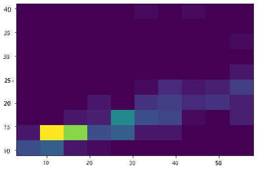

<!--
CO_OP_TRANSLATOR_METADATA:
{
  "original_hash": "02ce904bc1e2bfabb7dc05c25aae375c",
  "translation_date": "2025-09-04T21:04:13+00:00",
  "source_file": "3-Data-Visualization/10-visualization-distributions/README.md",
  "language_code": "tl"
}
-->
# Pagpapakita ng Pamamahagi

|](../../sketchnotes/10-Visualizing-Distributions.png)|
|:---:|
| Pagpapakita ng Pamamahagi - _Sketchnote ni [@nitya](https://twitter.com/nitya)_ |

Sa nakaraang aralin, natutunan mo ang ilang kawili-wiling impormasyon tungkol sa dataset ng mga ibon sa Minnesota. Natuklasan mo ang ilang maling datos sa pamamagitan ng pagpapakita ng mga outlier at tiningnan ang mga pagkakaiba sa pagitan ng mga kategorya ng ibon batay sa kanilang maximum na haba.

## [Pre-lecture quiz](https://purple-hill-04aebfb03.1.azurestaticapps.net/quiz/18)
## Tuklasin ang dataset ng mga ibon

Isa pang paraan upang suriin ang datos ay sa pamamagitan ng pagtingin sa pamamahagi nito, o kung paano nakaayos ang datos sa isang axis. Halimbawa, maaaring gusto mong malaman ang pangkalahatang pamamahagi ng maximum wingspan o maximum body mass ng mga ibon sa Minnesota para sa dataset na ito.

Tuklasin natin ang ilang impormasyon tungkol sa pamamahagi ng datos sa dataset na ito. Sa _notebook.ipynb_ file sa root ng folder ng araling ito, i-import ang Pandas, Matplotlib, at ang iyong datos:

```python
import pandas as pd
import matplotlib.pyplot as plt
birds = pd.read_csv('../../data/birds.csv')
birds.head()
```

|      | Pangalan                      | ScientificName         | Kategorya             | Order        | Pamilya   | Genus       | ConservationStatus | MinLength | MaxLength | MinBodyMass | MaxBodyMass | MinWingspan | MaxWingspan |
| ---: | :---------------------------- | :--------------------- | :-------------------- | :----------- | :------- | :---------- | :----------------- | --------: | --------: | ----------: | ----------: | ----------: | ----------: |
|    0 | Black-bellied whistling-duck | Dendrocygna autumnalis | Ducks/Geese/Waterfowl | Anseriformes | Anatidae | Dendrocygna | LC                 |        47 |        56 |         652 |        1020 |          76 |          94 |
|    1 | Fulvous whistling-duck       | Dendrocygna bicolor    | Ducks/Geese/Waterfowl | Anseriformes | Anatidae | Dendrocygna | LC                 |        45 |        53 |         712 |        1050 |          85 |          93 |
|    2 | Snow goose                   | Anser caerulescens     | Ducks/Geese/Waterfowl | Anseriformes | Anatidae | Anser       | LC                 |        64 |        79 |        2050 |        4050 |         135 |         165 |
|    3 | Ross's goose                 | Anser rossii           | Ducks/Geese/Waterfowl | Anseriformes | Anatidae | Anser       | LC                 |      57.3 |        64 |        1066 |        1567 |         113 |         116 |
|    4 | Greater white-fronted goose  | Anser albifrons        | Ducks/Geese/Waterfowl | Anseriformes | Anatidae | Anser       | LC                 |        64 |        81 |        1930 |        3310 |         130 |         165 |

Sa pangkalahatan, maaari mong mabilis na makita kung paano nakapamahagi ang datos sa pamamagitan ng paggamit ng scatter plot tulad ng ginawa natin sa nakaraang aralin:

```python
birds.plot(kind='scatter',x='MaxLength',y='Order',figsize=(12,8))

plt.title('Max Length per Order')
plt.ylabel('Order')
plt.xlabel('Max Length')

plt.show()
```


Ipinapakita nito ang pangkalahatang pamamahagi ng haba ng katawan bawat Order ng ibon, ngunit hindi ito ang pinakamainam na paraan upang ipakita ang tunay na pamamahagi. Ang gawaing ito ay karaniwang ginagawa sa pamamagitan ng paglikha ng Histogram.

## Paggamit ng histograms

Nag-aalok ang Matplotlib ng mahusay na paraan upang ipakita ang pamamahagi ng datos gamit ang Histograms. Ang ganitong uri ng tsart ay parang bar chart kung saan makikita ang pamamahagi sa pamamagitan ng pagtaas at pagbaba ng mga bar. Upang makabuo ng histogram, kailangan mo ng numeric na datos. Upang makabuo ng Histogram, maaari kang mag-plot ng tsart na tinutukoy ang uri bilang 'hist' para sa Histogram. Ang tsart na ito ay nagpapakita ng pamamahagi ng MaxBodyMass para sa buong saklaw ng numeric na datos ng dataset. Sa pamamagitan ng paghahati ng array ng datos sa mas maliliit na bins, maipapakita nito ang pamamahagi ng mga halaga ng datos:

```python
birds['MaxBodyMass'].plot(kind = 'hist', bins = 10, figsize = (12,12))
plt.show()
```


Tulad ng nakikita mo, karamihan sa 400+ ibon sa dataset na ito ay nasa saklaw na mas mababa sa 2000 para sa kanilang Max Body Mass. Makakuha ng higit pang insight sa datos sa pamamagitan ng pagbabago ng `bins` parameter sa mas mataas na numero, tulad ng 30:

```python
birds['MaxBodyMass'].plot(kind = 'hist', bins = 30, figsize = (12,12))
plt.show()
```


Ipinapakita ng tsart na ito ang pamamahagi sa mas detalyadong paraan. Maaaring makabuo ng tsart na hindi masyadong skewed sa kaliwa sa pamamagitan ng pagtiyak na pipiliin mo lamang ang datos sa loob ng isang ibinigay na saklaw:

I-filter ang iyong datos upang makuha lamang ang mga ibon na ang body mass ay mas mababa sa 60, at ipakita ang 40 `bins`:

```python
filteredBirds = birds[(birds['MaxBodyMass'] > 1) & (birds['MaxBodyMass'] < 60)]      
filteredBirds['MaxBodyMass'].plot(kind = 'hist',bins = 40,figsize = (12,12))
plt.show()     
```


✅ Subukan ang iba pang mga filter at puntos ng datos. Upang makita ang buong pamamahagi ng datos, alisin ang `['MaxBodyMass']` filter upang ipakita ang mga labeled distributions.

Nag-aalok ang histogram ng ilang magagandang enhancement sa kulay at labeling na maaari mong subukan:

Gumawa ng 2D histogram upang ihambing ang relasyon sa pagitan ng dalawang pamamahagi. Ihambing natin ang `MaxBodyMass` vs. `MaxLength`. Nag-aalok ang Matplotlib ng built-in na paraan upang ipakita ang convergence gamit ang mas maliwanag na mga kulay:

```python
x = filteredBirds['MaxBodyMass']
y = filteredBirds['MaxLength']

fig, ax = plt.subplots(tight_layout=True)
hist = ax.hist2d(x, y)
```
Mukhang may inaasahang ugnayan sa pagitan ng dalawang elementong ito sa isang inaasahang axis, na may isang partikular na malakas na punto ng convergence:



Ang histograms ay mahusay na gumagana sa default para sa numeric na datos. Paano kung kailangan mong makita ang pamamahagi ayon sa text na datos?

## Tuklasin ang dataset para sa pamamahagi gamit ang text na datos

Ang dataset na ito ay naglalaman din ng magagandang impormasyon tungkol sa kategorya ng ibon at ang genus, species, at pamilya nito pati na rin ang conservation status nito. Tuklasin natin ang impormasyong ito tungkol sa conservation. Ano ang pamamahagi ng mga ibon ayon sa kanilang conservation status?

> ✅ Sa dataset, ilang acronyms ang ginagamit upang ilarawan ang conservation status. Ang mga acronyms na ito ay mula sa [IUCN Red List Categories](https://www.iucnredlist.org/), isang organisasyon na nagkatalogo ng status ng mga species.
> 
> - CR: Critically Endangered
> - EN: Endangered
> - EX: Extinct
> - LC: Least Concern
> - NT: Near Threatened
> - VU: Vulnerable

Ang mga ito ay text-based na halaga kaya kailangan mong gumawa ng transform upang makabuo ng histogram. Gamit ang filteredBirds dataframe, ipakita ang conservation status nito kasama ang Minimum Wingspan. Ano ang nakikita mo?

```python
x1 = filteredBirds.loc[filteredBirds.ConservationStatus=='EX', 'MinWingspan']
x2 = filteredBirds.loc[filteredBirds.ConservationStatus=='CR', 'MinWingspan']
x3 = filteredBirds.loc[filteredBirds.ConservationStatus=='EN', 'MinWingspan']
x4 = filteredBirds.loc[filteredBirds.ConservationStatus=='NT', 'MinWingspan']
x5 = filteredBirds.loc[filteredBirds.ConservationStatus=='VU', 'MinWingspan']
x6 = filteredBirds.loc[filteredBirds.ConservationStatus=='LC', 'MinWingspan']

kwargs = dict(alpha=0.5, bins=20)

plt.hist(x1, **kwargs, color='red', label='Extinct')
plt.hist(x2, **kwargs, color='orange', label='Critically Endangered')
plt.hist(x3, **kwargs, color='yellow', label='Endangered')
plt.hist(x4, **kwargs, color='green', label='Near Threatened')
plt.hist(x5, **kwargs, color='blue', label='Vulnerable')
plt.hist(x6, **kwargs, color='gray', label='Least Concern')

plt.gca().set(title='Conservation Status', ylabel='Min Wingspan')
plt.legend();
```


Mukhang walang magandang ugnayan sa pagitan ng minimum wingspan at conservation status. Subukan ang iba pang mga elemento ng dataset gamit ang pamamaraang ito. Maaari kang mag-eksperimento sa iba't ibang mga filter. May nakikita ka bang ugnayan?

## Density plots

Maaaring napansin mo na ang mga histogram na tiningnan natin hanggang ngayon ay 'stepped' at hindi dumadaloy nang maayos sa isang arc. Upang ipakita ang mas maayos na density chart, maaari kang gumamit ng density plot.

Upang magtrabaho gamit ang density plots, magpakilala sa isang bagong plotting library, [Seaborn](https://seaborn.pydata.org/generated/seaborn.kdeplot.html).

Pag-load ng Seaborn, subukan ang isang basic density plot:

```python
import seaborn as sns
import matplotlib.pyplot as plt
sns.kdeplot(filteredBirds['MinWingspan'])
plt.show()
```


Makikita mo kung paano ginagaya ng plot ang naunang isa para sa Minimum Wingspan na datos; mas maayos lang ito. Ayon sa dokumentasyon ng Seaborn, "Relative to a histogram, KDE can produce a plot that is less cluttered and more interpretable, especially when drawing multiple distributions. But it has the potential to introduce distortions if the underlying distribution is bounded or not smooth. Like a histogram, the quality of the representation also depends on the selection of good smoothing parameters." [source](https://seaborn.pydata.org/generated/seaborn.kdeplot.html) Sa madaling salita, ang mga outlier ay palaging magpapasama sa iyong mga tsart.

Kung nais mong balikan ang jagged MaxBodyMass line sa pangalawang tsart na ginawa mo, maaari mo itong maayos na ma-smooth sa pamamagitan ng muling paggawa nito gamit ang pamamaraang ito:

```python
sns.kdeplot(filteredBirds['MaxBodyMass'])
plt.show()
```


Kung nais mo ng maayos ngunit hindi masyadong maayos na linya, i-edit ang `bw_adjust` parameter:

```python
sns.kdeplot(filteredBirds['MaxBodyMass'], bw_adjust=.2)
plt.show()
```


✅ Basahin ang tungkol sa mga parameter na magagamit para sa ganitong uri ng plot at mag-eksperimento!

Ang ganitong uri ng tsart ay nag-aalok ng magagandang paliwanag na visualizations. Sa ilang linya ng code, halimbawa, maaari mong ipakita ang max body mass density bawat Order ng ibon:

```python
sns.kdeplot(
   data=filteredBirds, x="MaxBodyMass", hue="Order",
   fill=True, common_norm=False, palette="crest",
   alpha=.5, linewidth=0,
)
```


Maaari mo ring i-map ang density ng ilang variable sa isang tsart. Subukan ang MaxLength at MinLength ng isang ibon kumpara sa kanilang conservation status:

```python
sns.kdeplot(data=filteredBirds, x="MinLength", y="MaxLength", hue="ConservationStatus")
```


Marahil ay sulit na pag-aralan kung ang cluster ng 'Vulnerable' na mga ibon ayon sa kanilang haba ay may kahulugan o wala.

## 🚀 Hamon

Ang histograms ay isang mas sopistikadong uri ng tsart kaysa sa mga basic scatterplots, bar charts, o line charts. Maghanap sa internet ng magagandang halimbawa ng paggamit ng histograms. Paano sila ginagamit, ano ang kanilang ipinapakita, at sa anong mga larangan o lugar ng pag-aaral sila karaniwang ginagamit?

## [Post-lecture quiz](https://ff-quizzes.netlify.app/en/ds/)

## Review at Pag-aaral sa Sarili

Sa araling ito, ginamit mo ang Matplotlib at nagsimulang magtrabaho gamit ang Seaborn upang ipakita ang mas sopistikadong mga tsart. Mag-research tungkol sa `kdeplot` sa Seaborn, isang "continuous probability density curve in one or more dimensions". Basahin ang [dokumentasyon](https://seaborn.pydata.org/generated/seaborn.kdeplot.html) upang maunawaan kung paano ito gumagana.

## Takdang Aralin

[Ilapat ang iyong mga kasanayan](assignment.md)

---

**Paunawa**:  
Ang dokumentong ito ay isinalin gamit ang AI translation service na [Co-op Translator](https://github.com/Azure/co-op-translator). Bagama't sinisikap naming maging tumpak, tandaan na ang mga awtomatikong pagsasalin ay maaaring maglaman ng mga pagkakamali o hindi pagkakatugma. Ang orihinal na dokumento sa kanyang katutubong wika ang dapat ituring na opisyal na sanggunian. Para sa mahalagang impormasyon, inirerekomenda ang propesyonal na pagsasalin ng tao. Hindi kami mananagot sa anumang hindi pagkakaunawaan o maling interpretasyon na maaaring magmula sa paggamit ng pagsasaling ito.