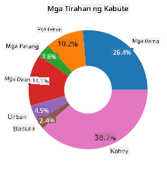

<!--
CO_OP_TRANSLATOR_METADATA:
{
  "original_hash": "af6a12015c6e250e500b570a9fa42593",
  "translation_date": "2025-08-28T02:38:31+00:00",
  "source_file": "3-Data-Visualization/11-visualization-proportions/README.md",
  "language_code": "tl"
}
-->
# Pagpapakita ng Proporsyon

| ](../../sketchnotes/11-Visualizing-Proportions.png)|
|:---:|
|Pagpapakita ng Proporsyon - _Sketchnote ni [@nitya](https://twitter.com/nitya)_ |

Sa araling ito, gagamit ka ng dataset na nakatuon sa kalikasan upang ipakita ang proporsyon, tulad ng kung gaano karaming iba't ibang uri ng fungi ang matatagpuan sa isang dataset tungkol sa mga kabute. Tuklasin natin ang mga kamangha-manghang fungi gamit ang dataset mula sa Audubon na naglalaman ng mga detalye tungkol sa 23 species ng gilled mushrooms sa mga pamilya ng Agaricus at Lepiota. Mag-eeksperimento ka sa masarap na mga visualisasyon tulad ng:

- Pie charts 🥧
- Donut charts 🍩
- Waffle charts 🧇

> 💡 Isang napaka-interesanteng proyekto na tinatawag na [Charticulator](https://charticulator.com) ng Microsoft Research ang nag-aalok ng libreng drag-and-drop na interface para sa data visualizations. Sa isa sa kanilang mga tutorial, ginamit din nila ang dataset ng kabute! Kaya maaari mong tuklasin ang data at matutunan ang library nang sabay: [Charticulator tutorial](https://charticulator.com/tutorials/tutorial4.html).

## [Pre-lecture quiz](https://purple-hill-04aebfb03.1.azurestaticapps.net/quiz/20)

## Kilalanin ang iyong mga kabute 🍄

Ang mga kabute ay napaka-interesante. Mag-import tayo ng dataset upang pag-aralan ang mga ito:

```python
import pandas as pd
import matplotlib.pyplot as plt
mushrooms = pd.read_csv('../../data/mushrooms.csv')
mushrooms.head()
```
Isang talahanayan ang ipinapakita na may magagandang datos para sa pagsusuri:

| class     | cap-shape | cap-surface | cap-color | bruises | odor    | gill-attachment | gill-spacing | gill-size | gill-color | stalk-shape | stalk-root | stalk-surface-above-ring | stalk-surface-below-ring | stalk-color-above-ring | stalk-color-below-ring | veil-type | veil-color | ring-number | ring-type | spore-print-color | population | habitat |
| --------- | --------- | ----------- | --------- | ------- | ------- | --------------- | ------------ | --------- | ---------- | ----------- | ---------- | ------------------------ | ------------------------ | ---------------------- | ---------------------- | --------- | ---------- | ----------- | --------- | ----------------- | ---------- | ------- |
| Poisonous | Convex    | Smooth      | Brown     | Bruises | Pungent | Free            | Close        | Narrow    | Black      | Enlarging   | Equal      | Smooth                   | Smooth                   | White                  | White                  | Partial   | White      | One         | Pendant   | Black             | Scattered  | Urban   |
| Edible    | Convex    | Smooth      | Yellow    | Bruises | Almond  | Free            | Close        | Broad     | Black      | Enlarging   | Club       | Smooth                   | Smooth                   | White                  | White                  | Partial   | White      | One         | Pendant   | Brown             | Numerous   | Grasses |
| Edible    | Bell      | Smooth      | White     | Bruises | Anise   | Free            | Close        | Broad     | Brown      | Enlarging   | Club       | Smooth                   | Smooth                   | White                  | White                  | Partial   | White      | One         | Pendant   | Brown             | Numerous   | Meadows |
| Poisonous | Convex    | Scaly       | White     | Bruises | Pungent | Free            | Close        | Narrow    | Brown      | Enlarging   | Equal      | Smooth                   | Smooth                   | White                  | White                  | Partial   | White      | One         | Pendant   | Black             | Scattered  | Urban   |

Mapapansin mo agad na ang lahat ng datos ay tekstwal. Kailangan mong i-convert ang datos na ito upang magamit ito sa isang chart. Karamihan sa datos, sa katunayan, ay kinakatawan bilang isang object:

```python
print(mushrooms.select_dtypes(["object"]).columns)
```

Ang output ay:

```output
Index(['class', 'cap-shape', 'cap-surface', 'cap-color', 'bruises', 'odor',
       'gill-attachment', 'gill-spacing', 'gill-size', 'gill-color',
       'stalk-shape', 'stalk-root', 'stalk-surface-above-ring',
       'stalk-surface-below-ring', 'stalk-color-above-ring',
       'stalk-color-below-ring', 'veil-type', 'veil-color', 'ring-number',
       'ring-type', 'spore-print-color', 'population', 'habitat'],
      dtype='object')
```
Kunin ang datos na ito at i-convert ang 'class' column sa isang kategorya:

```python
cols = mushrooms.select_dtypes(["object"]).columns
mushrooms[cols] = mushrooms[cols].astype('category')
```

```python
edibleclass=mushrooms.groupby(['class']).count()
edibleclass
```

Ngayon, kung ipi-print mo ang datos ng kabute, makikita mo na ito ay na-grupo sa mga kategorya ayon sa poisonous/edible class:

|           | cap-shape | cap-surface | cap-color | bruises | odor | gill-attachment | gill-spacing | gill-size | gill-color | stalk-shape | ... | stalk-surface-below-ring | stalk-color-above-ring | stalk-color-below-ring | veil-type | veil-color | ring-number | ring-type | spore-print-color | population | habitat |
| --------- | --------- | ----------- | --------- | ------- | ---- | --------------- | ------------ | --------- | ---------- | ----------- | --- | ------------------------ | ---------------------- | ---------------------- | --------- | ---------- | ----------- | --------- | ----------------- | ---------- | ------- |
| class     |           |             |           |         |      |                 |              |           |            |             |     |                          |                        |                        |           |            |             |           |                   |            |         |
| Edible    | 4208      | 4208        | 4208      | 4208    | 4208 | 4208            | 4208         | 4208      | 4208       | 4208        | ... | 4208                     | 4208                   | 4208                   | 4208      | 4208       | 4208        | 4208      | 4208              | 4208       | 4208    |
| Poisonous | 3916      | 3916        | 3916      | 3916    | 3916 | 3916            | 3916         | 3916      | 3916       | 3916        | ... | 3916                     | 3916                   | 3916                   | 3916      | 3916       | 3916        | 3916      | 3916              | 3916       | 3916    |

Kung susundin mo ang pagkakasunod-sunod na ipinakita sa talahanayan na ito upang lumikha ng iyong mga label ng kategorya ng class, maaari kang gumawa ng pie chart:

## Pie!

```python
labels=['Edible','Poisonous']
plt.pie(edibleclass['population'],labels=labels,autopct='%.1f %%')
plt.title('Edible?')
plt.show()
```
Voila, isang pie chart na nagpapakita ng proporsyon ng datos ayon sa dalawang klase ng kabute. Napakahalaga na makuha ang tamang pagkakasunod-sunod ng mga label, lalo na dito, kaya siguraduhing i-verify ang pagkakasunod-sunod ng array ng label!


## Donuts!

Ang isang mas visually interesting na pie chart ay isang donut chart, na isang pie chart na may butas sa gitna. Tingnan natin ang ating datos gamit ang pamamaraang ito.

Tingnan ang iba't ibang mga habitat kung saan tumutubo ang mga kabute:

```python
habitat=mushrooms.groupby(['habitat']).count()
habitat
```
Dito, ini-grupo mo ang iyong datos ayon sa habitat. Mayroong 7 na nakalista, kaya gamitin ang mga ito bilang mga label para sa iyong donut chart:

```python
labels=['Grasses','Leaves','Meadows','Paths','Urban','Waste','Wood']

plt.pie(habitat['class'], labels=labels,
        autopct='%1.1f%%', pctdistance=0.85)
  
center_circle = plt.Circle((0, 0), 0.40, fc='white')
fig = plt.gcf()

fig.gca().add_artist(center_circle)
  
plt.title('Mushroom Habitats')
  
plt.show()
```



Ang code na ito ay gumuguhit ng chart at isang gitnang bilog, pagkatapos ay idinadagdag ang gitnang bilog sa chart. I-edit ang lapad ng gitnang bilog sa pamamagitan ng pagbabago ng `0.40` sa ibang halaga.

Ang mga donut chart ay maaaring i-tweak sa iba't ibang paraan upang baguhin ang mga label. Ang mga label, partikular, ay maaaring i-highlight para sa readability. Matuto pa sa [docs](https://matplotlib.org/stable/gallery/pie_and_polar_charts/pie_and_donut_labels.html?highlight=donut).

Ngayon na alam mo kung paano i-grupo ang iyong datos at ipakita ito bilang pie o donut, maaari mong tuklasin ang iba pang uri ng chart. Subukan ang waffle chart, na isang ibang paraan ng pag-explore ng dami.

## Waffles!

Ang 'waffle' type chart ay isang ibang paraan ng pagpapakita ng dami bilang isang 2D array ng mga square. Subukang ipakita ang iba't ibang dami ng kulay ng mushroom cap sa dataset na ito. Upang gawin ito, kailangan mong mag-install ng helper library na tinatawag na [PyWaffle](https://pypi.org/project/pywaffle/) at gamitin ang Matplotlib:

```python
pip install pywaffle
```

Pumili ng segment ng iyong datos upang i-grupo:

```python
capcolor=mushrooms.groupby(['cap-color']).count()
capcolor
```

Gumawa ng waffle chart sa pamamagitan ng paglikha ng mga label at pagkatapos ay pag-grupo ng iyong datos:

```python
import pandas as pd
import matplotlib.pyplot as plt
from pywaffle import Waffle
  
data ={'color': ['brown', 'buff', 'cinnamon', 'green', 'pink', 'purple', 'red', 'white', 'yellow'],
    'amount': capcolor['class']
     }
  
df = pd.DataFrame(data)
  
fig = plt.figure(
    FigureClass = Waffle,
    rows = 100,
    values = df.amount,
    labels = list(df.color),
    figsize = (30,30),
    colors=["brown", "tan", "maroon", "green", "pink", "purple", "red", "whitesmoke", "yellow"],
)
```

Gamit ang waffle chart, makikita mo nang malinaw ang proporsyon ng mga kulay ng mushroom cap sa dataset na ito. Nakakatuwa, maraming green-capped mushrooms!


✅ Ang Pywaffle ay sumusuporta sa mga icon sa loob ng mga chart na gumagamit ng anumang icon na available sa [Font Awesome](https://fontawesome.com/). Mag-eksperimento upang lumikha ng mas kawili-wiling waffle chart gamit ang mga icon sa halip na mga square.

Sa araling ito, natutunan mo ang tatlong paraan ng pagpapakita ng proporsyon. Una, kailangan mong i-grupo ang iyong datos sa mga kategorya at pagkatapos ay magdesisyon kung alin ang pinakamahusay na paraan upang ipakita ang datos - pie, donut, o waffle. Lahat ay masarap at nagbibigay-kasiyahan sa user sa isang instant snapshot ng dataset.

## 🚀 Hamon

Subukang muling likhain ang mga masarap na chart na ito sa [Charticulator](https://charticulator.com).

## [Post-lecture quiz](https://purple-hill-04aebfb03.1.azurestaticapps.net/quiz/21)

## Review at Pag-aaral ng Sarili

Minsan hindi halata kung kailan gagamit ng pie, donut, o waffle chart. Narito ang ilang artikulo na maaaring basahin tungkol sa paksang ito:

https://www.beautiful.ai/blog/battle-of-the-charts-pie-chart-vs-donut-chart

https://medium.com/@hypsypops/pie-chart-vs-donut-chart-showdown-in-the-ring-5d24fd86a9ce

https://www.mit.edu/~mbarker/formula1/f1help/11-ch-c6.htm

https://medium.datadriveninvestor.com/data-visualization-done-the-right-way-with-tableau-waffle-chart-fdf2a19be402

Mag-research upang makahanap ng higit pang impormasyon tungkol sa desisyong ito.

## Takdang Aralin

[Subukan ito sa Excel](assignment.md)

---

**Paunawa**:  
Ang dokumentong ito ay isinalin gamit ang AI translation service na [Co-op Translator](https://github.com/Azure/co-op-translator). Bagama't sinisikap naming maging tumpak, tandaan na ang mga awtomatikong pagsasalin ay maaaring maglaman ng mga pagkakamali o hindi pagkakatugma. Ang orihinal na dokumento sa kanyang katutubong wika ang dapat ituring na opisyal na pinagmulan. Para sa mahalagang impormasyon, inirerekomenda ang propesyonal na pagsasalin ng tao. Hindi kami mananagot sa anumang hindi pagkakaunawaan o maling interpretasyon na dulot ng paggamit ng pagsasaling ito.