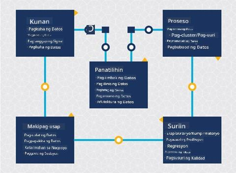
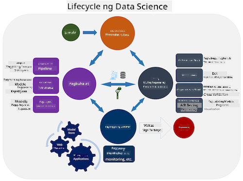
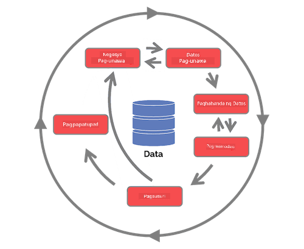

<!--
CO_OP_TRANSLATOR_METADATA:
{
  "original_hash": "c368f8f2506fe56bca0f7be05c4eb71d",
  "translation_date": "2025-08-28T02:32:05+00:00",
  "source_file": "4-Data-Science-Lifecycle/14-Introduction/README.md",
  "language_code": "tl"
}
-->
# Panimula sa Lifecycle ng Data Science

| ](../../sketchnotes/14-DataScience-Lifecycle.png)|
|:---:|
| Panimula sa Lifecycle ng Data Science - _Sketchnote ni [@nitya](https://twitter.com/nitya)_ |

## [Pre-Lecture Quiz](https://red-water-0103e7a0f.azurestaticapps.net/quiz/26)

Sa puntong ito, malamang napagtanto mo na ang data science ay isang proseso. Ang prosesong ito ay maaaring hatiin sa limang yugto:

- Pagkuha
- Pagproseso
- Pagsusuri
- Komunikasyon
- Pagpapanatili

Ang araling ito ay nakatuon sa tatlong bahagi ng lifecycle: pagkuha, pagproseso, at pagpapanatili.

  
> Larawan mula sa [Berkeley School of Information](https://ischoolonline.berkeley.edu/data-science/what-is-data-science/)

## Pagkuha

Ang unang yugto ng lifecycle ay napakahalaga dahil ang mga susunod na yugto ay nakadepende rito. Sa praktikal na aspeto, ito ay parang dalawang yugto na pinagsama: ang pagkuha ng data at ang pagtukoy sa layunin at mga problemang kailangang tugunan.  
Ang pagtukoy sa mga layunin ng proyekto ay nangangailangan ng mas malalim na konteksto tungkol sa problema o tanong. Una, kailangan nating tukuyin at makuha ang mga taong nangangailangan ng solusyon sa kanilang problema. Maaaring ito ay mga stakeholder sa isang negosyo o mga sponsor ng proyekto, na makakatulong sa pagtukoy kung sino o ano ang makikinabang sa proyektong ito, pati na rin kung ano at bakit nila ito kailangan. Ang isang malinaw na layunin ay dapat na nasusukat at nabibilang upang matukoy ang katanggap-tanggap na resulta.

Mga tanong na maaaring itanong ng isang data scientist:
- Nasubukan na ba ang problemang ito dati? Ano ang natuklasan?
- Naiintindihan ba ng lahat ang layunin at layunin ng proyekto?
- Mayroon bang kalabuan at paano ito mababawasan?
- Ano ang mga limitasyon?
- Ano ang posibleng hitsura ng resulta?
- Gaano karaming mga mapagkukunan (oras, tao, computational) ang magagamit?

Susunod ay ang pagtukoy, pagkolekta, at sa wakas ay pagsusuri ng data na kailangan upang makamit ang mga tinukoy na layunin. Sa hakbang na ito ng pagkuha, kailangang suriin ng mga data scientist ang dami at kalidad ng data. Nangangailangan ito ng ilang pagsusuri ng data upang matiyak na ang nakuha ay susuporta sa pag-abot sa nais na resulta.

Mga tanong na maaaring itanong ng isang data scientist tungkol sa data:
- Anong data ang mayroon na sa akin?
- Sino ang may-ari ng data na ito?
- Ano ang mga alalahanin sa privacy?
- Sapat ba ang data upang malutas ang problemang ito?
- Angkop ba ang kalidad ng data para sa problemang ito?
- Kung makakahanap ako ng karagdagang impormasyon mula sa data na ito, dapat ba nating isaalang-alang ang pagbabago o muling pagtukoy sa mga layunin?

## Pagproseso

Ang yugto ng pagproseso sa lifecycle ay nakatuon sa pagtuklas ng mga pattern sa data pati na rin ang pagmomodelo. Ang ilang mga teknik na ginagamit sa yugtong ito ay nangangailangan ng mga estadistikal na pamamaraan upang matuklasan ang mga pattern. Karaniwan, ito ay magiging isang nakakapagod na gawain para sa isang tao na gawin sa isang malaking dataset kaya’t umaasa sa mga computer upang mapabilis ang proseso. Sa yugtong ito rin nagtatagpo ang data science at machine learning. Tulad ng natutunan mo sa unang aralin, ang machine learning ay ang proseso ng paggawa ng mga modelo upang maunawaan ang data. Ang mga modelo ay representasyon ng relasyon sa pagitan ng mga variable sa data na tumutulong sa paghula ng mga resulta.

Karaniwang mga teknik na ginagamit sa yugtong ito ay saklaw sa kurikulum ng ML for Beginners. Sundan ang mga link upang matuto pa tungkol dito:

- [Classification](https://github.com/microsoft/ML-For-Beginners/tree/main/4-Classification): Pag-oorganisa ng data sa mga kategorya para sa mas epektibong paggamit.
- [Clustering](https://github.com/microsoft/ML-For-Beginners/tree/main/5-Clustering): Pag-grupo ng data sa mga magkakatulad na grupo.
- [Regression](https://github.com/microsoft/ML-For-Beginners/tree/main/2-Regression): Tukuyin ang relasyon sa pagitan ng mga variable upang mahulaan o ma-forecast ang mga halaga.

## Pagpapanatili

Sa diagram ng lifecycle, maaaring napansin mo na ang pagpapanatili ay nasa pagitan ng pagkuha at pagproseso. Ang pagpapanatili ay isang tuloy-tuloy na proseso ng pamamahala, pag-iimbak, at pag-secure ng data sa buong proseso ng isang proyekto at dapat isaalang-alang sa kabuuan ng proyekto.

### Pag-iimbak ng Data

Ang mga konsiderasyon kung paano at saan iniimbak ang data ay maaaring makaapekto sa gastos ng imbakan pati na rin ang performance ng bilis ng pag-access sa data. Ang mga desisyong tulad nito ay malamang na hindi gagawin ng isang data scientist lamang, ngunit maaaring kailanganin nilang gumawa ng mga pagpipilian kung paano gagamitin ang data batay sa kung paano ito iniimbak.

Narito ang ilang aspeto ng mga modernong sistema ng imbakan ng data na maaaring makaapekto sa mga pagpipiliang ito:

**On premise vs off premise vs public o private cloud**

Ang on premise ay tumutukoy sa pagho-host at pamamahala ng data gamit ang sariling kagamitan, tulad ng pagmamay-ari ng server na may mga hard drive na nag-iimbak ng data, habang ang off premise ay umaasa sa kagamitan na hindi mo pagmamay-ari, tulad ng isang data center. Ang public cloud ay isang popular na opsyon para sa pag-iimbak ng data na hindi nangangailangan ng kaalaman kung paano o saan eksaktong iniimbak ang data, kung saan ang public ay tumutukoy sa isang pinag-isang imprastraktura na ginagamit ng lahat ng gumagamit ng cloud. Ang ilang mga organisasyon ay may mahigpit na mga patakaran sa seguridad na nangangailangan ng ganap na access sa kagamitan kung saan naka-host ang data at umaasa sa isang private cloud na nagbibigay ng sariling serbisyo sa cloud. Matututo ka pa tungkol sa data sa cloud sa [mga susunod na aralin](https://github.com/microsoft/Data-Science-For-Beginners/tree/main/5-Data-Science-In-Cloud).

**Cold vs hot data**

Kapag sinasanay ang iyong mga modelo, maaaring kailanganin mo ng mas maraming training data. Kung kontento ka na sa iyong modelo, maaaring dumating ang mas maraming data upang magamit ang modelo sa layunin nito. Sa anumang kaso, ang gastos ng pag-iimbak at pag-access sa data ay tataas habang dumarami ito. Ang paghihiwalay ng bihirang ginagamit na data, na kilala bilang cold data, mula sa madalas na ginagamit na hot data ay maaaring maging mas murang opsyon sa pag-iimbak ng data gamit ang hardware o software services. Kung kailangang ma-access ang cold data, maaaring mas matagal itong makuha kumpara sa hot data.

### Pamamahala ng Data

Habang nagtatrabaho ka sa data, maaaring matuklasan mo na ang ilang bahagi ng data ay kailangang linisin gamit ang ilang mga teknik na saklaw sa aralin tungkol sa [data preparation](https://github.com/microsoft/Data-Science-For-Beginners/tree/main/2-Working-With-Data/08-data-preparation) upang makabuo ng tumpak na mga modelo. Kapag may bagong data na dumating, kakailanganin nito ng parehong mga aplikasyon upang mapanatili ang kalidad. Ang ilang mga proyekto ay mangangailangan ng paggamit ng isang automated na tool para sa paglilinis, pagsasama-sama, at compression bago ilipat ang data sa huling lokasyon nito. Ang Azure Data Factory ay isang halimbawa ng isa sa mga tool na ito.

### Pag-secure ng Data

Isa sa mga pangunahing layunin ng pag-secure ng data ay tiyakin na ang mga nagtatrabaho rito ay may kontrol sa kung ano ang kinokolekta at sa anong konteksto ito ginagamit. Ang pagpapanatiling ligtas ng data ay nangangailangan ng limitadong access sa mga taong nangangailangan lamang nito, pagsunod sa mga lokal na batas at regulasyon, pati na rin ang pagpapanatili ng mga etikal na pamantayan, tulad ng tinalakay sa [aralin sa etika](https://github.com/microsoft/Data-Science-For-Beginners/tree/main/1-Introduction/02-ethics).

Narito ang ilang bagay na maaaring gawin ng isang team na may kinalaman sa seguridad:
- Tiyakin na ang lahat ng data ay naka-encrypt
- Magbigay ng impormasyon sa mga customer kung paano ginagamit ang kanilang data
- Alisin ang access sa data mula sa mga umalis na sa proyekto
- Payagan lamang ang ilang miyembro ng proyekto na baguhin ang data

## 🚀 Hamon

Mayroong maraming bersyon ng Lifecycle ng Data Science, kung saan ang bawat hakbang ay maaaring may iba’t ibang pangalan at bilang ng mga yugto ngunit naglalaman ng parehong mga proseso na nabanggit sa araling ito.

Suriin ang [Team Data Science Process lifecycle](https://docs.microsoft.com/en-us/azure/architecture/data-science-process/lifecycle) at ang [Cross-industry standard process for data mining](https://www.datascience-pm.com/crisp-dm-2/). Magbanggit ng 3 pagkakatulad at pagkakaiba sa pagitan ng dalawa.

|Team Data Science Process (TDSP)|Cross-industry standard process for data mining (CRISP-DM)|
|--|--|
| |  |
| Larawan mula sa [Microsoft](https://docs.microsoft.comazure/architecture/data-science-process/lifecycle) | Larawan mula sa [Data Science Process Alliance](https://www.datascience-pm.com/crisp-dm-2/) |

## [Post-Lecture Quiz](https://red-water-0103e7a0f.azurestaticapps.net/quiz/27)

## Review at Pag-aaral sa Sarili

Ang paglalapat ng Lifecycle ng Data Science ay nangangailangan ng maraming tungkulin at gawain, kung saan ang ilan ay maaaring nakatuon sa partikular na bahagi ng bawat yugto. Ang Team Data Science Process ay nagbibigay ng ilang mga mapagkukunan na nagpapaliwanag ng mga uri ng tungkulin at gawain na maaaring mayroon ang isang tao sa isang proyekto.

* [Mga tungkulin at gawain sa Team Data Science Process](https://docs.microsoft.com/en-us/azure/architecture/data-science-process/roles-tasks)  
* [Pagganap ng mga gawain sa data science: pagsusuri, pagmomodelo, at pag-deploy](https://docs.microsoft.com/en-us/azure/architecture/data-science-process/execute-data-science-tasks)

## Takdang Aralin

[Pag-aassess ng Dataset](assignment.md)

---

**Paunawa**:  
Ang dokumentong ito ay isinalin gamit ang AI translation service na [Co-op Translator](https://github.com/Azure/co-op-translator). Bagama't sinisikap naming maging tumpak, tandaan na ang mga awtomatikong pagsasalin ay maaaring maglaman ng mga pagkakamali o hindi pagkakatugma. Ang orihinal na dokumento sa kanyang katutubong wika ang dapat ituring na opisyal na sanggunian. Para sa mahalagang impormasyon, inirerekomenda ang propesyonal na pagsasalin ng tao. Hindi kami mananagot sa anumang hindi pagkakaunawaan o maling interpretasyon na dulot ng paggamit ng pagsasaling ito.