<!--
CO_OP_TRANSLATOR_METADATA:
{
  "original_hash": "39f3b3a9d873eaa522c2e792ce0ca503",
  "translation_date": "2025-09-04T20:53:04+00:00",
  "source_file": "5-Data-Science-In-Cloud/18-Low-Code/README.md",
  "language_code": "tl"
}
-->
# Data Science sa Cloud: Ang "Low code/No code" na Paraan

| ](../../sketchnotes/18-DataScience-Cloud.png)|
|:---:|
| Data Science sa Cloud: Low Code - _Sketchnote ni [@nitya](https://twitter.com/nitya)_ |

Nilalaman ng Talakayan:

- [Data Science sa Cloud: Ang "Low code/No code" na Paraan](../../../../5-Data-Science-In-Cloud/18-Low-Code)
  - [Pre-Lecture Quiz](../../../../5-Data-Science-In-Cloud/18-Low-Code)
  - [1. Panimula](../../../../5-Data-Science-In-Cloud/18-Low-Code)
    - [1.1 Ano ang Azure Machine Learning?](../../../../5-Data-Science-In-Cloud/18-Low-Code)
    - [1.2 Ang Proyekto sa Prediksyon ng Heart Failure:](../../../../5-Data-Science-In-Cloud/18-Low-Code)
    - [1.3 Ang Dataset ng Heart Failure:](../../../../5-Data-Science-In-Cloud/18-Low-Code)
  - [2. Low code/No code na Pagsasanay ng Modelo sa Azure ML Studio](../../../../5-Data-Science-In-Cloud/18-Low-Code)
    - [2.1 Gumawa ng Azure ML Workspace](../../../../5-Data-Science-In-Cloud/18-Low-Code)
    - [2.2 Compute Resources](../../../../5-Data-Science-In-Cloud/18-Low-Code)
      - [2.2.1 Pagpili ng tamang opsyon para sa iyong compute resources](../../../../5-Data-Science-In-Cloud/18-Low-Code)
      - [2.2.2 Paglikha ng compute cluster](../../../../5-Data-Science-In-Cloud/18-Low-Code)
    - [2.3 Pag-load ng Dataset](../../../../5-Data-Science-In-Cloud/18-Low-Code)
    - [2.4 Low code/No Code na Pagsasanay gamit ang AutoML](../../../../5-Data-Science-In-Cloud/18-Low-Code)
  - [3. Low code/No Code na Deployment ng Modelo at Konsumo ng Endpoint](../../../../5-Data-Science-In-Cloud/18-Low-Code)
    - [3.1 Deployment ng Modelo](../../../../5-Data-Science-In-Cloud/18-Low-Code)
    - [3.2 Konsumo ng Endpoint](../../../../5-Data-Science-In-Cloud/18-Low-Code)
  - [🚀 Hamon](../../../../5-Data-Science-In-Cloud/18-Low-Code)
  - [Post-Lecture Quiz](../../../../5-Data-Science-In-Cloud/18-Low-Code)
  - [Review at Pag-aaral sa Sarili](../../../../5-Data-Science-In-Cloud/18-Low-Code)
  - [Takdang-Aralin](../../../../5-Data-Science-In-Cloud/18-Low-Code)
  
## [Pre-Lecture Quiz](https://ff-quizzes.netlify.app/en/ds/)

## 1. Panimula
### 1.1 Ano ang Azure Machine Learning?

Ang Azure cloud platform ay binubuo ng mahigit 200 produkto at cloud services na dinisenyo upang tulungan kang magdala ng mga bagong solusyon sa buhay. Ang mga data scientist ay gumugugol ng maraming oras sa pag-explore at pag-preprocess ng data, pati na rin sa pagsubok ng iba't ibang uri ng model-training algorithms upang makagawa ng mga accurate na modelo. Ang mga gawaing ito ay nakakaubos ng oras at madalas na hindi epektibo sa paggamit ng mahal na compute hardware.

Ang [Azure ML](https://docs.microsoft.com/azure/machine-learning/overview-what-is-azure-machine-learning?WT.mc_id=academic-77958-bethanycheum&ocid=AID3041109) ay isang cloud-based platform para sa pagbuo at pagpapatakbo ng mga machine learning solutions sa Azure. Naglalaman ito ng malawak na hanay ng mga tampok at kakayahan na tumutulong sa mga data scientist sa pag-aayos ng data, pagsasanay ng mga modelo, pag-publish ng predictive services, at pag-monitor ng kanilang paggamit. Ang pinakamahalaga, pinapataas nito ang kanilang kahusayan sa pamamagitan ng pag-automate ng maraming nakakaubos ng oras na gawain na may kaugnayan sa pagsasanay ng mga modelo; at pinapayagan silang gumamit ng cloud-based compute resources na epektibong nag-scale upang hawakan ang malalaking volume ng data habang nagkakaroon ng gastos lamang kapag aktwal na ginagamit.

Ang Azure ML ay nagbibigay ng lahat ng tools na kailangan ng mga developer at data scientist para sa kanilang machine learning workflows. Kasama dito ang:

- **Azure Machine Learning Studio**: Isang web portal sa Azure Machine Learning para sa low-code at no-code na opsyon para sa model training, deployment, automation, tracking, at asset management. Ang studio ay integrated sa Azure Machine Learning SDK para sa seamless na karanasan.
- **Jupyter Notebooks**: Mabilis na pag-prototype at pagsubok ng ML models.
- **Azure Machine Learning Designer**: Pinapayagan ang drag-and-drop ng mga module upang bumuo ng mga eksperimento at pagkatapos ay i-deploy ang mga pipeline sa isang low-code na kapaligiran.
- **Automated machine learning UI (AutoML)**: Ina-automate ang mga iterative na gawain ng machine learning model development, na nagbibigay-daan sa pagbuo ng ML models na may mataas na scale, kahusayan, at produktibidad, habang pinapanatili ang kalidad ng modelo.
- **Data Labelling**: Isang assisted ML tool para awtomatikong mag-label ng data.
- **Machine learning extension para sa Visual Studio Code**: Nagbibigay ng full-featured na development environment para sa pagbuo at pamamahala ng ML projects.
- **Machine learning CLI**: Nagbibigay ng mga command para sa pamamahala ng Azure ML resources mula sa command line.
- **Integration sa open-source frameworks** tulad ng PyTorch, TensorFlow, Scikit-learn, at marami pang iba para sa training, deployment, at pamamahala ng end-to-end machine learning process.
- **MLflow**: Isang open-source library para sa pamamahala ng lifecycle ng iyong machine learning experiments. Ang **MLFlow Tracking** ay isang bahagi ng MLflow na nag-log at nag-track ng iyong training run metrics at model artifacts, anuman ang environment ng iyong eksperimento.

### 1.2 Ang Proyekto sa Prediksyon ng Heart Failure:

Walang duda na ang paggawa at pagbuo ng mga proyekto ang pinakamahusay na paraan upang subukan ang iyong mga kasanayan at kaalaman. Sa araling ito, susuriin natin ang dalawang magkaibang paraan ng pagbuo ng isang data science project para sa prediksyon ng heart failure attacks sa Azure ML Studio, sa pamamagitan ng Low code/No code at sa pamamagitan ng Azure ML SDK tulad ng ipinapakita sa sumusunod na schema:

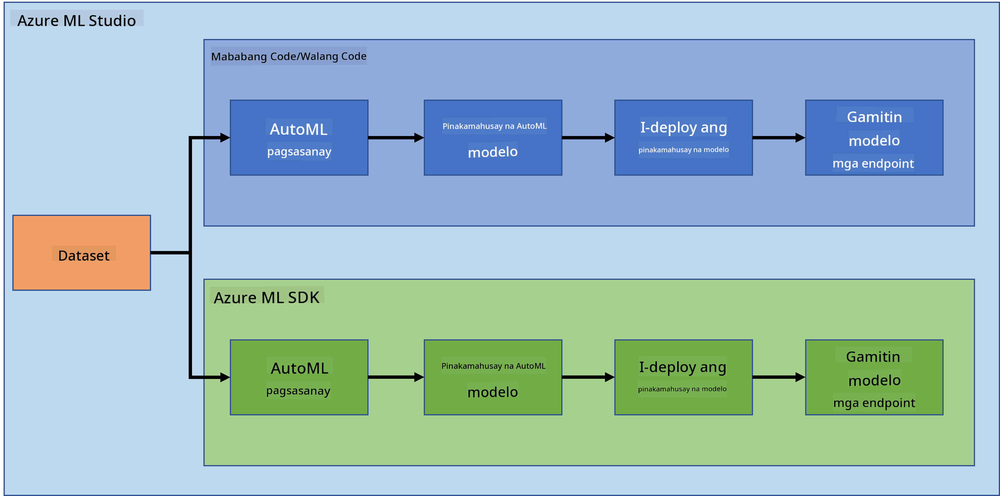

Ang bawat paraan ay may sariling mga kalamangan at kahinaan. Ang Low code/No code na paraan ay mas madaling simulan dahil ito ay nangangailangan ng pakikipag-ugnayan sa isang GUI (Graphical User Interface), na hindi nangangailangan ng kaalaman sa code. Ang pamamaraang ito ay nagbibigay-daan sa mabilis na pagsubok ng viability ng proyekto at sa paglikha ng POC (Proof Of Concept). Gayunpaman, habang lumalaki ang proyekto at kailangang maging handa para sa produksyon, hindi praktikal na lumikha ng mga resources sa pamamagitan ng GUI. Kailangan nating awtomatikong i-program ang lahat, mula sa paglikha ng mga resources hanggang sa deployment ng modelo. Dito nagiging mahalaga ang kaalaman sa paggamit ng Azure ML SDK.

|                   | Low code/No code | Azure ML SDK              |
|-------------------|------------------|---------------------------|
| Kaalaman sa code  | Hindi kailangan  | Kailangan                 |
| Oras ng pagbuo    | Mabilis at madali| Depende sa kaalaman sa code|
| Handa para sa produksyon | Hindi         | Oo                        |

### 1.3 Ang Dataset ng Heart Failure:

Ang cardiovascular diseases (CVDs) ang nangungunang sanhi ng kamatayan sa buong mundo, na nagkakaroon ng 31% ng lahat ng kamatayan. Ang mga environmental at behavioral risk factors tulad ng paggamit ng tabako, hindi malusog na diyeta at obesity, kawalan ng pisikal na aktibidad, at mapanganib na paggamit ng alak ay maaaring gamitin bilang mga features para sa estimation models. Ang kakayahang matantya ang posibilidad ng pag-develop ng CVD ay maaaring maging malaking tulong upang maiwasan ang mga atake sa mga taong may mataas na panganib.

Ang Kaggle ay nagbigay ng [Heart Failure dataset](https://www.kaggle.com/andrewmvd/heart-failure-clinical-data) na pampublikong magagamit, na gagamitin natin para sa proyektong ito. Maaari mong i-download ang dataset ngayon. Ito ay isang tabular dataset na may 13 columns (12 features at 1 target variable) at 299 rows.

|    | Pangalan ng Variable       | Uri              | Deskripsyon                                               | Halimbawa         |
|----|---------------------------|-----------------|-----------------------------------------------------------|-------------------|
| 1  | age                       | numerical       | Edad ng pasyente                                         | 25                |
| 2  | anaemia                   | boolean         | Pagbaba ng red blood cells o haemoglobin                 | 0 o 1             |
| 3  | creatinine_phosphokinase  | numerical       | Antas ng CPK enzyme sa dugo                              | 542               |
| 4  | diabetes                  | boolean         | Kung ang pasyente ay may diabetes                        | 0 o 1             |
| 5  | ejection_fraction         | numerical       | Porsyento ng dugo na lumalabas sa puso sa bawat contraction | 45                |
| 6  | high_blood_pressure       | boolean         | Kung ang pasyente ay may hypertension                    | 0 o 1             |
| 7  | platelets                 | numerical       | Platelets sa dugo                                        | 149000            |
| 8  | serum_creatinine          | numerical       | Antas ng serum creatinine sa dugo                        | 0.5               |
| 9  | serum_sodium              | numerical       | Antas ng serum sodium sa dugo                            | jun               |
| 10 | sex                       | boolean         | Babae o lalaki                                           | 0 o 1             |
| 11 | smoking                   | boolean         | Kung ang pasyente ay naninigarilyo                      | 0 o 1             |
| 12 | time                      | numerical       | Panahon ng follow-up (araw)                              | 4                 |
|----|---------------------------|-----------------|-----------------------------------------------------------|-------------------|
| 21 | DEATH_EVENT [Target]      | boolean         | Kung ang pasyente ay namatay sa panahon ng follow-up     | 0 o 1             |

Kapag nakuha mo na ang dataset, maaari na nating simulan ang proyekto sa Azure.

## 2. Low code/No code na Pagsasanay ng Modelo sa Azure ML Studio
### 2.1 Gumawa ng Azure ML Workspace
Upang magsanay ng modelo sa Azure ML, kailangan mo munang gumawa ng Azure ML workspace. Ang workspace ang pangunahing resource para sa Azure Machine Learning, na nagbibigay ng sentralisadong lugar upang magtrabaho sa lahat ng artifacts na iyong nilikha kapag ginamit mo ang Azure Machine Learning. Ang workspace ay nagtatago ng kasaysayan ng lahat ng training runs, kabilang ang logs, metrics, output, at snapshot ng iyong mga script. Ginagamit mo ang impormasyong ito upang matukoy kung aling training run ang nagprodyus ng pinakamahusay na modelo. [Matuto pa](https://docs.microsoft.com/azure/machine-learning/concept-workspace?WT.mc_id=academic-77958-bethanycheum&ocid=AID3041109)

Inirerekomenda na gamitin ang pinakabagong browser na compatible sa iyong operating system. Ang mga sumusunod na browser ay suportado:

- Microsoft Edge (Ang bagong Microsoft Edge, pinakabagong bersyon. Hindi ang Microsoft Edge legacy)
- Safari (pinakabagong bersyon, Mac lamang)
- Chrome (pinakabagong bersyon)
- Firefox (pinakabagong bersyon)

Upang magamit ang Azure Machine Learning, gumawa ng workspace sa iyong Azure subscription. Maaari mong gamitin ang workspace na ito upang pamahalaan ang data, compute resources, code, models, at iba pang artifacts na may kaugnayan sa iyong machine learning workloads.

> **_NOTE:_** Ang iyong Azure subscription ay sisingilin ng maliit na halaga para sa data storage hangga't ang Azure Machine Learning workspace ay umiiral sa iyong subscription, kaya inirerekomenda naming tanggalin ang Azure Machine Learning workspace kapag hindi mo na ito ginagamit.

1. Mag-sign in sa [Azure portal](https://ms.portal.azure.com/) gamit ang Microsoft credentials na nauugnay sa iyong Azure subscription.
2. Piliin ang **＋Create a resource**
   
   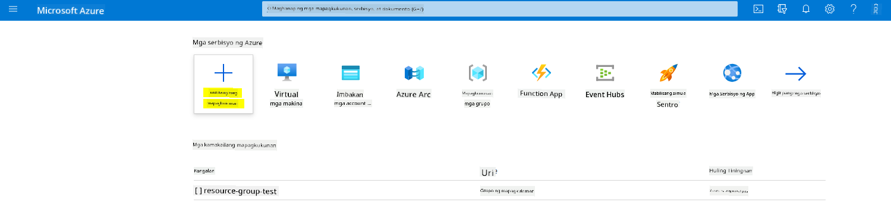

   Maghanap ng Machine Learning at piliin ang Machine Learning tile

   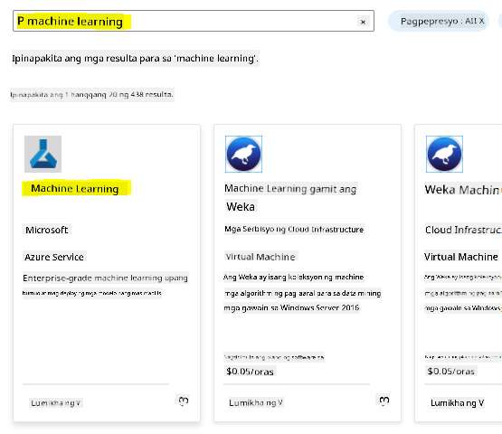

   I-click ang create button

   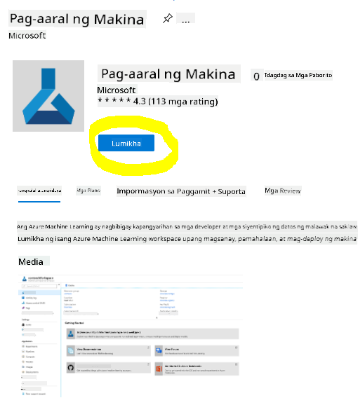

   Punan ang mga setting tulad ng sumusunod:
   - Subscription: Ang iyong Azure subscription
   - Resource group: Gumawa o pumili ng resource group
   - Workspace name: Maglagay ng natatanging pangalan para sa iyong workspace
   - Region: Piliin ang pinakamalapit na rehiyon sa iyo
   - Storage account: Tandaan ang default na bagong storage account na gagawin para sa iyong workspace
   - Key vault: Tandaan ang default na bagong key vault na gagawin para sa iyong workspace
   - Application insights: Tandaan ang default na bagong application insights resource na gagawin para sa iyong workspace
   - Container registry: Wala (isa ang awtomatikong gagawin sa unang pagkakataon na mag-deploy ka ng modelo sa isang container)

    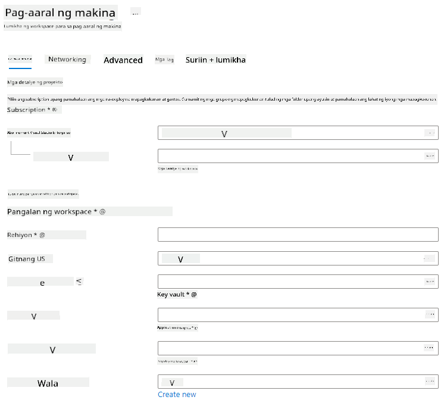

   - I-click ang create + review at pagkatapos ay ang create button
3. Maghintay para sa iyong workspace na magawa (maaari itong tumagal ng ilang minuto). Pagkatapos ay pumunta dito sa portal. Maaari mo itong mahanap sa pamamagitan ng Machine Learning Azure service.
4. Sa Overview page ng iyong workspace, i-launch ang Azure Machine Learning studio (o magbukas ng bagong browser tab at pumunta sa https://ml.azure.com), at mag-sign in sa Azure Machine Learning studio gamit ang iyong Microsoft account. Kung na-prompt, piliin ang iyong Azure directory at subscription, at ang iyong Azure Machine Learning workspace.
   
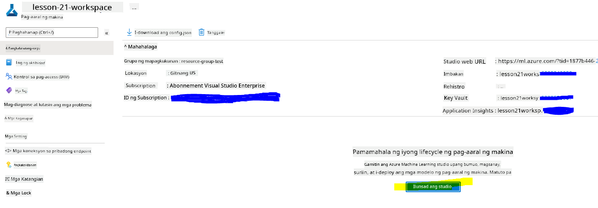

5. Sa Azure Machine Learning studio, i-toggle ang ☰ icon sa itaas na kaliwa upang makita ang iba't ibang mga pahina sa interface. Maaari mong gamitin ang mga pahinang ito upang pamahalaan ang mga resources sa iyong workspace.

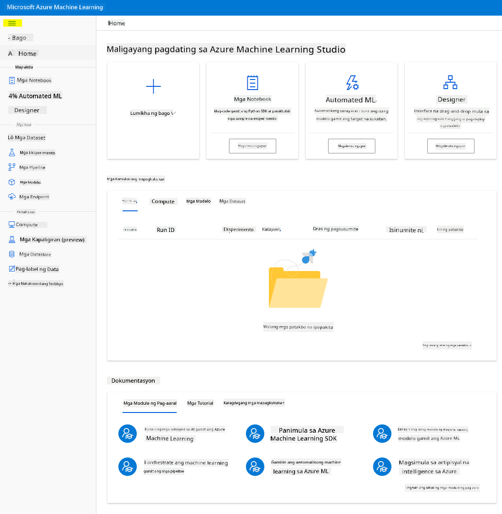

Maaari mong pamahalaan ang iyong workspace gamit ang Azure portal, ngunit para sa mga data scientist at Machine Learning operations engineers, ang Azure Machine Learning Studio ay nagbibigay ng mas nakatuon na user interface para sa pamamahala ng workspace resources.

### 2.2 Compute Resources

Ang Compute Resources ay mga cloud-based na resources kung saan maaari mong patakbuhin ang mga proseso ng model training at data exploration. Mayroong apat na uri ng compute resource na maaari mong gawin:

- **Compute Instances**: Mga development workstation na maaaring gamitin ng mga data scientist upang magtrabaho sa data at mga modelo. Kasama dito ang paglikha ng Virtual Machine (VM) at pag-launch ng notebook instance. Maaari mong sanayin ang modelo sa pamamagitan ng pagtawag sa compute cluster mula sa notebook.
- **Compute Clusters**: Mga scalable na cluster ng VMs para sa on-demand na pagproseso ng experiment code. Kakailanganin mo ito kapag nagsasanay ng modelo. Ang compute clusters ay maaari ring gumamit ng mga specialized GPU o CPU resources.
- **Inference Clusters**: Mga deployment target para sa predictive services na gumagamit ng iyong mga trained models.
- **Attached Compute**: Mga link sa umiiral na Azure compute resources, tulad ng Virtual Machines o Azure Databricks clusters.

#### 2.2.1 Pagpili ng tamang opsyon para sa iyong compute resources

May ilang mahahalagang salik na dapat isaalang-alang kapag gumagawa ng compute resource, at ang mga pagpipiliang ito ay maaaring maging kritikal na desisyon.

**Kailangan mo ba ng CPU o GPU?**

Ang CPU (Central Processing Unit) ay ang electronic circuitry na nag-e-execute ng mga utos na bumubuo sa isang computer program. Ang GPU (Graphics Processing Unit) ay isang espesyal na electronic circuit na maaaring magpatakbo ng graphics-related code sa napakataas na bilis.

Ang pangunahing pagkakaiba sa pagitan ng arkitektura ng CPU at GPU ay ang CPU ay dinisenyo upang mabilis na magproseso ng malawak na hanay ng mga gawain (na sinusukat sa bilis ng CPU clock), ngunit limitado ang kakayahan sa sabay-sabay na pagtakbo ng maraming gawain. Ang GPUs naman ay dinisenyo para sa parallel computing, kaya mas mahusay ito para sa mga deep learning tasks.

| CPU                                     | GPU                         |
|-----------------------------------------|-----------------------------|
| Mas mura                                | Mas mahal                  |
| Mas mababa ang antas ng concurrency     | Mas mataas ang antas ng concurrency |
| Mas mabagal sa pag-train ng deep learning models | Pinakamainam para sa deep learning   |

**Cluster Size**

Mas malaki ang cluster, mas mahal ito, ngunit mas maganda ang responsiveness. Kaya, kung may oras ka ngunit kulang sa budget, magsimula sa maliit na cluster. Sa kabaligtaran, kung may budget ka ngunit kulang sa oras, magsimula sa mas malaking cluster.

**VM Size**

Depende sa iyong oras at budget, maaari mong baguhin ang laki ng RAM, disk, bilang ng cores, at bilis ng clock. Ang pagtaas ng lahat ng mga parameter na ito ay mas magastos, ngunit magreresulta sa mas mahusay na performance.

**Dedicated o Low-Priority Instances?**

Ang low-priority instance ay nangangahulugang ito ay maaaring ma-interrupt: sa esensya, maaaring kunin ng Microsoft Azure ang mga resources na ito at i-assign sa ibang gawain, kaya maaantala ang trabaho. Ang dedicated instance, o non-interruptible, ay nangangahulugang ang trabaho ay hindi kailanman matatapos nang walang iyong pahintulot. Isa itong konsiderasyon sa pagitan ng oras at pera, dahil ang interruptible instances ay mas mura kaysa sa dedicated ones.

#### 2.2.2 Paglikha ng compute cluster

Sa [Azure ML workspace](https://ml.azure.com/) na ginawa natin kanina, pumunta sa compute at makikita mo ang iba't ibang compute resources na tinalakay natin (hal. compute instances, compute clusters, inference clusters, at attached compute). Para sa proyektong ito, kakailanganin natin ng compute cluster para sa model training. Sa Studio, i-click ang "Compute" menu, pagkatapos ang "Compute cluster" tab, at i-click ang "+ New" button upang lumikha ng compute cluster.

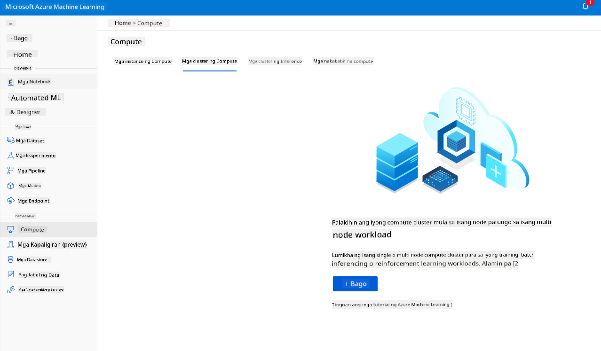

1. Piliin ang iyong mga opsyon: Dedicated vs Low priority, CPU o GPU, VM size, at bilang ng core (maaari mong panatilihin ang default settings para sa proyektong ito).
2. I-click ang Next button.

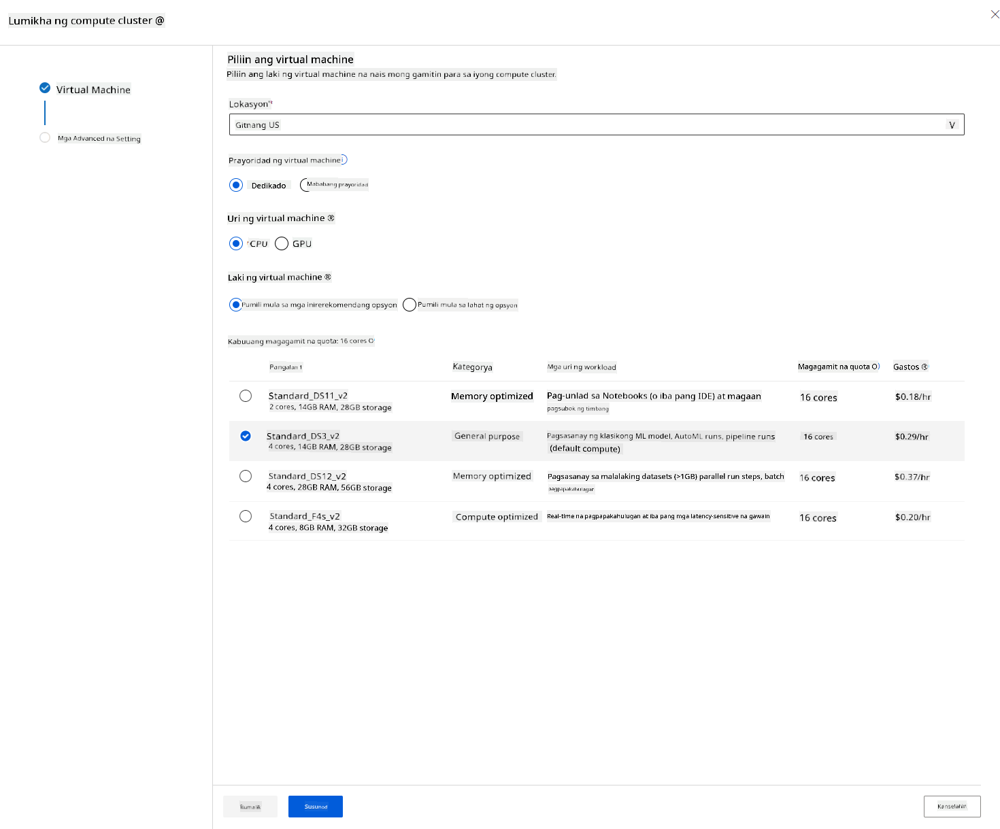

3. Bigyan ang cluster ng compute name.
4. Piliin ang iyong mga opsyon: Minimum/Maximum na bilang ng nodes, Idle seconds bago mag-scale down, SSH access. Tandaan na kung ang minimum na bilang ng nodes ay 0, makakatipid ka ng pera kapag idle ang cluster. Tandaan na mas mataas ang bilang ng maximum nodes, mas maikli ang training. Ang maximum na bilang ng nodes na inirerekomenda ay 3.  
5. I-click ang "Create" button. Ang hakbang na ito ay maaaring tumagal ng ilang minuto.

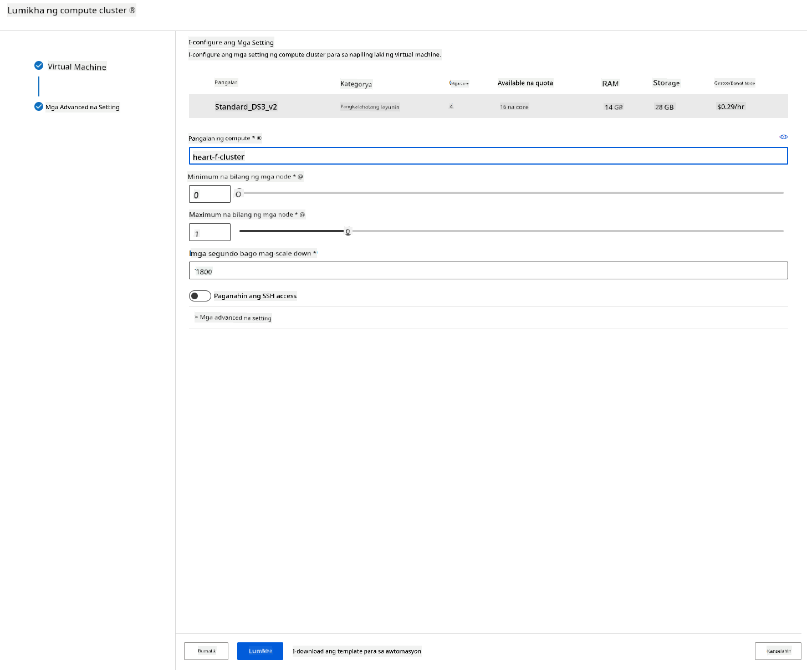

Ang galing! Ngayon na mayroon na tayong Compute cluster, kailangan nating i-load ang data sa Azure ML Studio.

### 2.3 Pag-load ng Dataset

1. Sa [Azure ML workspace](https://ml.azure.com/) na ginawa natin kanina, i-click ang "Datasets" sa kaliwang menu at i-click ang "+ Create dataset" button upang lumikha ng dataset. Piliin ang "From local files" option at piliin ang Kaggle dataset na na-download natin kanina.
   
   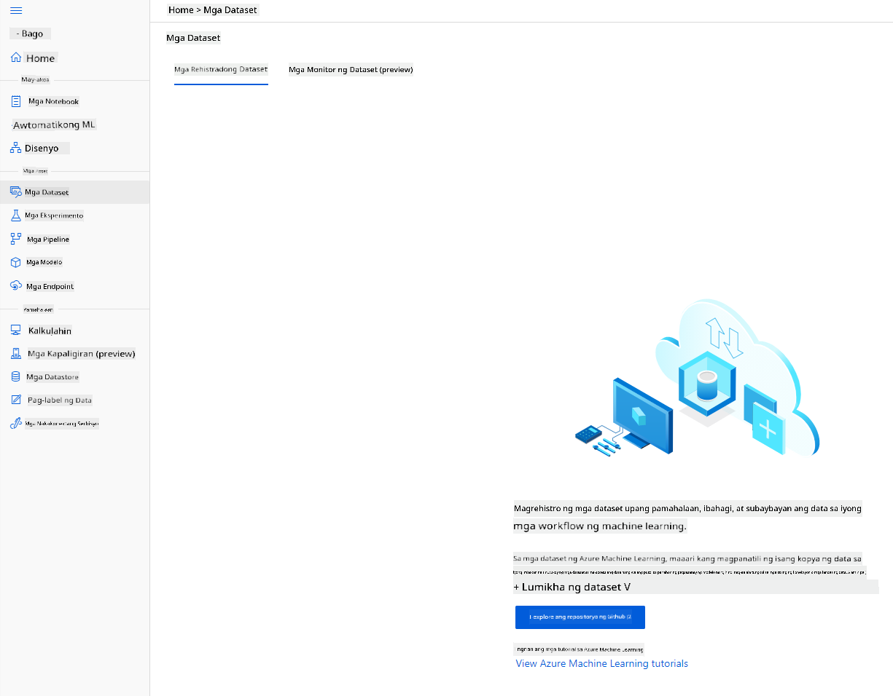

2. Bigyan ang dataset ng pangalan, uri, at deskripsyon. I-click ang Next. I-upload ang data mula sa mga file. I-click ang Next.
   
   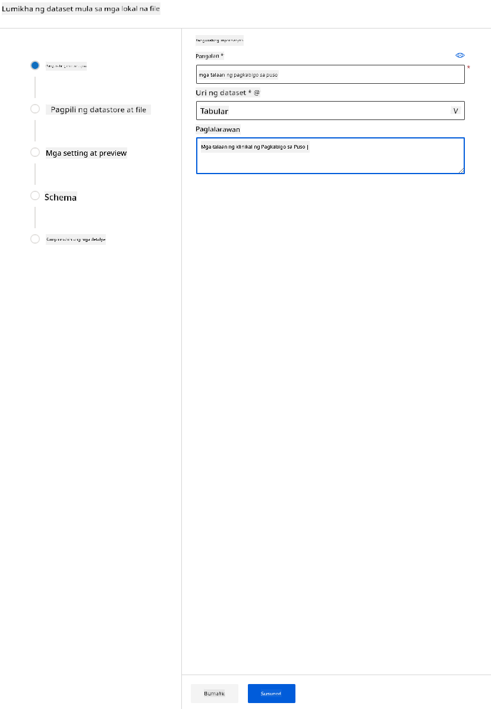

3. Sa Schema, baguhin ang data type sa Boolean para sa mga sumusunod na features: anaemia, diabetes, high blood pressure, sex, smoking, at DEATH_EVENT. I-click ang Next at I-click ang Create.
   
   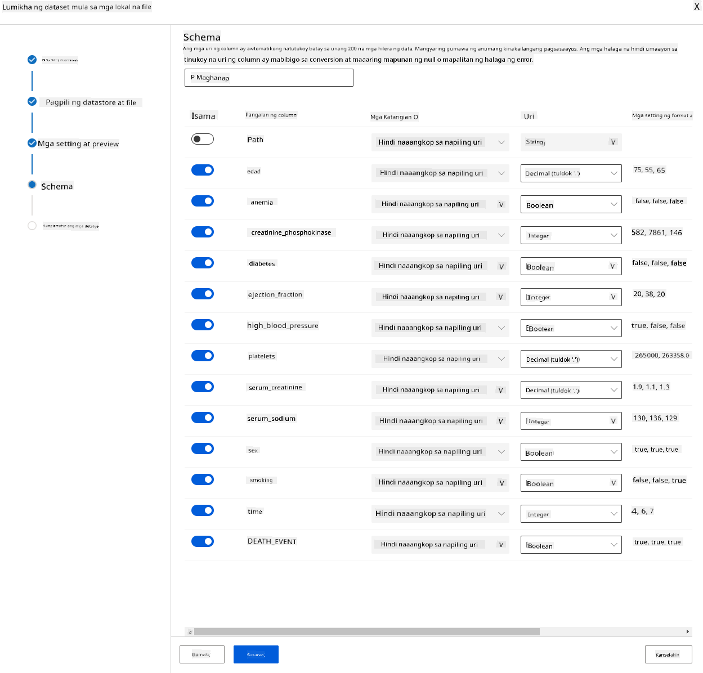

Ang galing! Ngayon na ang dataset ay nasa lugar na at ang compute cluster ay nalikha, maaari na nating simulan ang training ng model!

### 2.4 Low code/No Code training gamit ang AutoML

Ang tradisyunal na pag-develop ng machine learning model ay nangangailangan ng maraming resources, malalim na kaalaman, at oras upang makagawa at maikumpara ang dose-dosenang mga modelo. Ang Automated machine learning (AutoML) ay ang proseso ng pag-automate ng mga nakakaubos ng oras at paulit-ulit na gawain sa pag-develop ng machine learning model. Pinapayagan nito ang mga data scientist, analyst, at developer na gumawa ng ML models na may mataas na scale, efficiency, at productivity, habang pinapanatili ang kalidad ng modelo. Binabawasan nito ang oras na kinakailangan upang makagawa ng production-ready ML models nang madali at epektibo. [Matuto pa](https://docs.microsoft.com/azure/machine-learning/concept-automated-ml?WT.mc_id=academic-77958-bethanycheum&ocid=AID3041109)

1. Sa [Azure ML workspace](https://ml.azure.com/) na ginawa natin kanina, i-click ang "Automated ML" sa kaliwang menu at piliin ang dataset na kakaupload mo lang. I-click ang Next.

   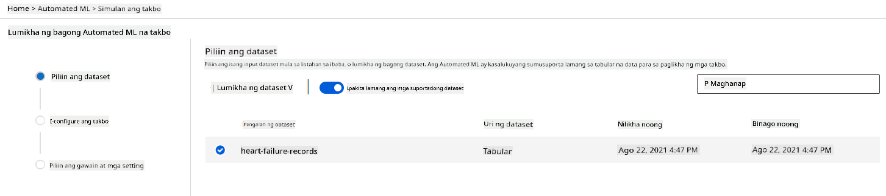

2. Maglagay ng bagong pangalan ng eksperimento, ang target column (DEATH_EVENT), at ang compute cluster na ginawa natin. I-click ang Next.
   
   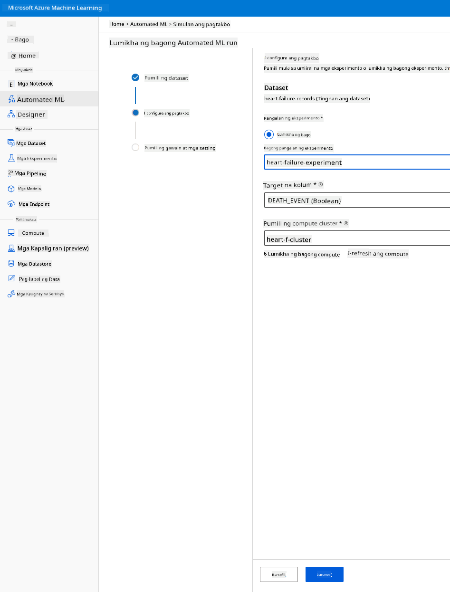

3. Piliin ang "Classification" at I-click ang Finish. Ang hakbang na ito ay maaaring tumagal ng 30 minuto hanggang 1 oras, depende sa laki ng compute cluster.
    
    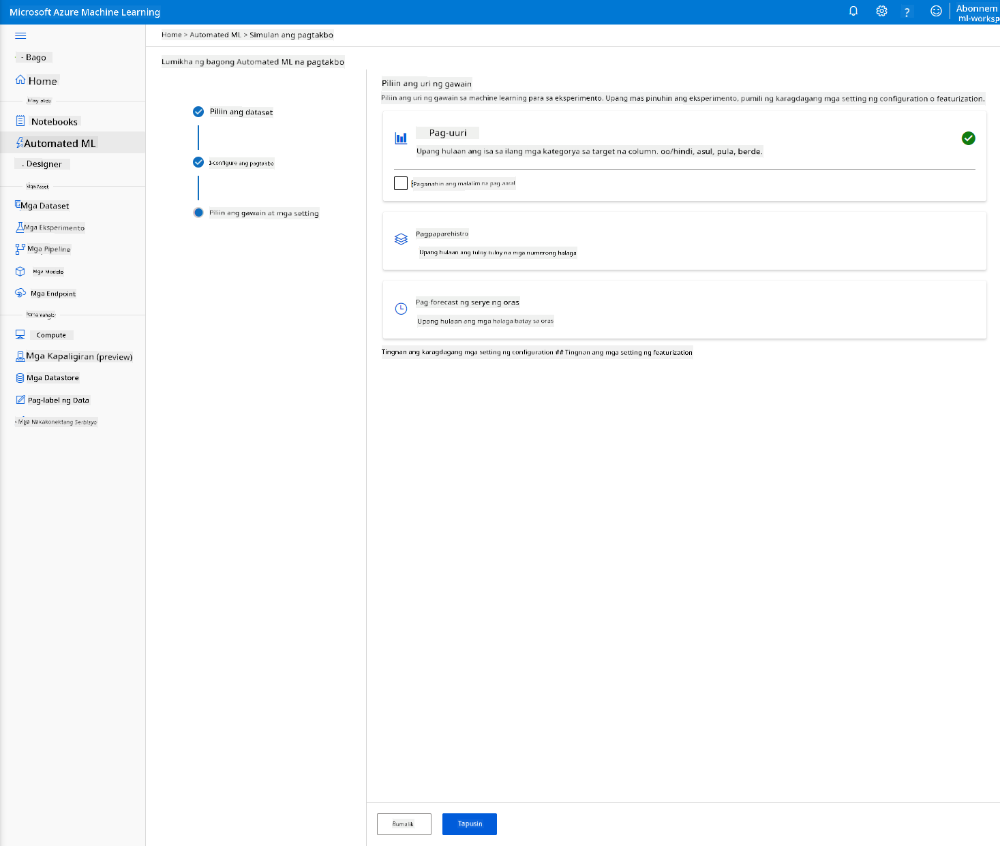

4. Kapag tapos na ang run, i-click ang "Automated ML" tab, i-click ang iyong run, at i-click ang Algorithm sa "Best model summary" card.
    
    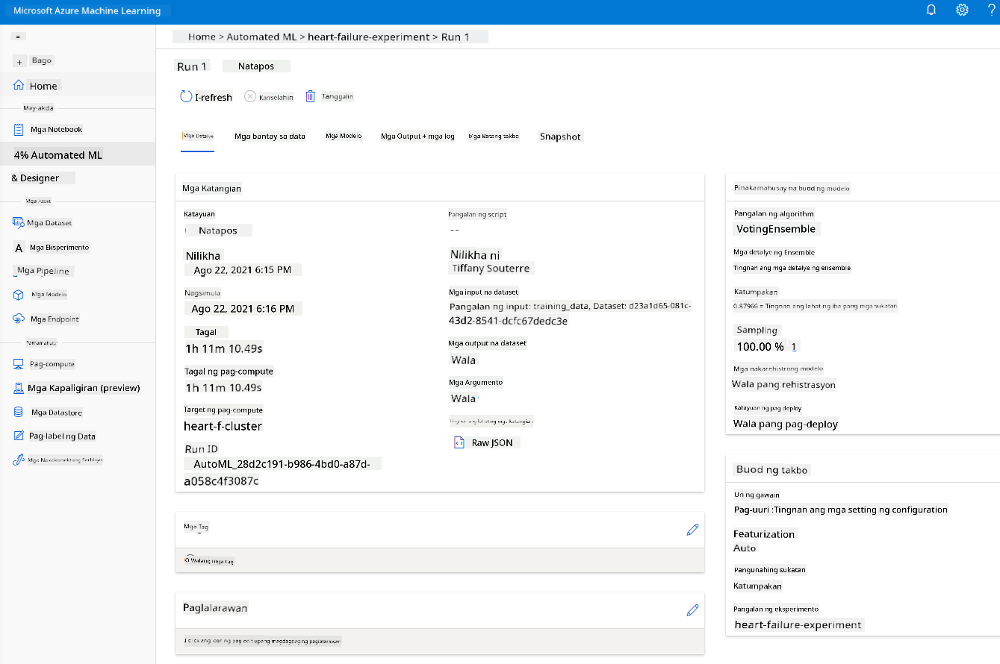

Dito makikita mo ang detalyadong deskripsyon ng pinakamahusay na model na ginawa ng AutoML. Maaari mo ring tuklasin ang iba pang mga modelo na ginawa sa Models tab. Maglaan ng ilang minuto upang tuklasin ang mga modelo sa Explanations (preview button). Kapag napili mo na ang model na gusto mong gamitin (dito pipiliin natin ang pinakamahusay na model na pinili ng AutoML), makikita natin kung paano ito ide-deploy.

## 3. Low code/No Code model deployment at endpoint consumption
### 3.1 Model deployment

Ang automated machine learning interface ay nagbibigay-daan sa iyo na i-deploy ang pinakamahusay na model bilang isang web service sa ilang hakbang. Ang deployment ay ang integrasyon ng model upang makagawa ito ng mga prediksyon batay sa bagong data at matukoy ang mga potensyal na oportunidad. Para sa proyektong ito, ang deployment sa isang web service ay nangangahulugang ang mga medical applications ay magagamit ang model upang makagawa ng live predictions ng panganib ng kanilang mga pasyente na magkaroon ng heart attack.

Sa pinakamahusay na deskripsyon ng model, i-click ang "Deploy" button.
    
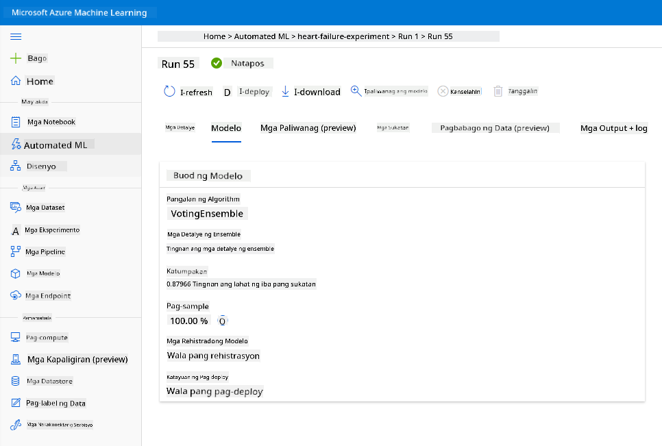

15. Bigyan ito ng pangalan, deskripsyon, compute type (Azure Container Instance), i-enable ang authentication, at i-click ang Deploy. Ang hakbang na ito ay maaaring tumagal ng 20 minuto upang makumpleto. Ang proseso ng deployment ay binubuo ng ilang hakbang kabilang ang pagrehistro ng model, pagbuo ng resources, at pag-configure ng mga ito para sa web service. Ang status message ay lilitaw sa ilalim ng Deploy status. Piliin ang Refresh nang pana-panahon upang suriin ang deployment status. Ito ay deployed at running kapag ang status ay "Healthy".

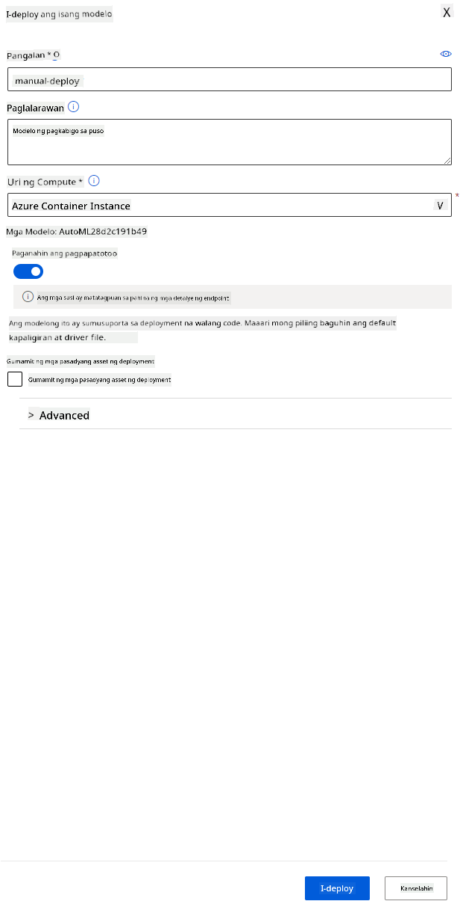

16. Kapag na-deploy na ito, i-click ang Endpoint tab at i-click ang endpoint na kakadeploy mo lang. Dito makikita ang lahat ng detalye na kailangan mong malaman tungkol sa endpoint.

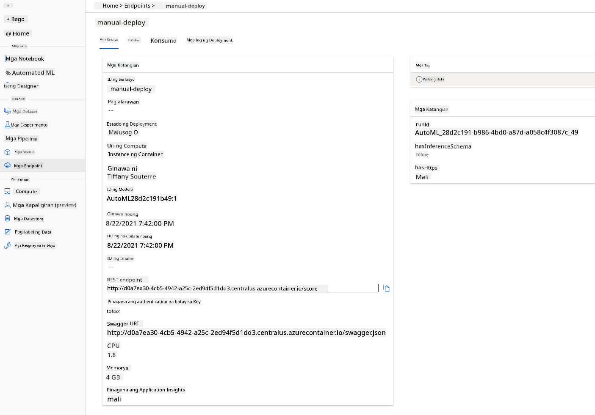

Ang galing! Ngayon na mayroon na tayong model na na-deploy, maaari na nating simulan ang paggamit ng endpoint.

### 3.2 Endpoint consumption

I-click ang "Consume" tab. Dito makikita ang REST endpoint at isang python script sa consumption option. Maglaan ng oras upang basahin ang python code.

Ang script na ito ay maaaring patakbuhin nang direkta mula sa iyong lokal na makina at gagamitin ang iyong endpoint.

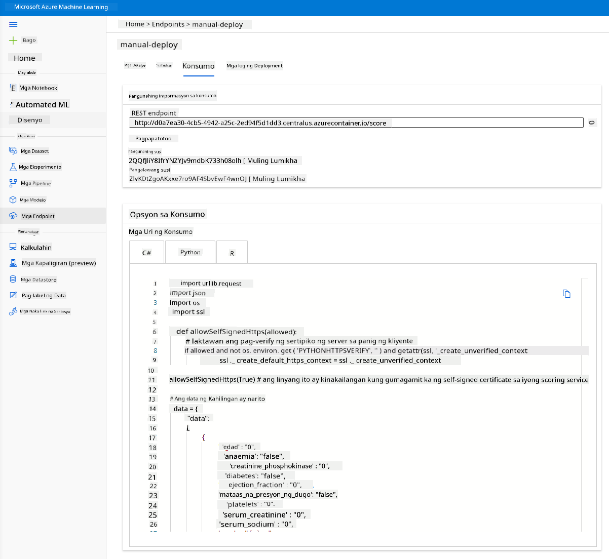

Maglaan ng oras upang suriin ang mga linyang ito ng code:

```python
url = 'http://98e3715f-xxxx-xxxx-xxxx-9ec22d57b796.centralus.azurecontainer.io/score'
api_key = '' # Replace this with the API key for the web service
```
Ang `url` variable ay ang REST endpoint na matatagpuan sa consume tab at ang `api_key` variable ay ang primary key na matatagpuan din sa consume tab (kung sakaling na-enable mo ang authentication). Ganito ginagamit ng script ang endpoint.

18. Kapag pinatakbo ang script, makikita mo ang sumusunod na output:
    ```python
    b'"{\\"result\\": [true]}"'
    ```
Ibig sabihin nito, ang prediksyon ng heart failure para sa ibinigay na data ay true. May katuturan ito dahil kung titingnan mo nang mas malapit ang data na awtomatikong nabuo sa script, lahat ay nasa 0 at false bilang default. Maaari mong baguhin ang data gamit ang sumusunod na input sample:

```python
data = {
    "data":
    [
        {
            'age': "0",
            'anaemia': "false",
            'creatinine_phosphokinase': "0",
            'diabetes': "false",
            'ejection_fraction': "0",
            'high_blood_pressure': "false",
            'platelets': "0",
            'serum_creatinine': "0",
            'serum_sodium': "0",
            'sex': "false",
            'smoking': "false",
            'time': "0",
        },
        {
            'age': "60",
            'anaemia': "false",
            'creatinine_phosphokinase': "500",
            'diabetes': "false",
            'ejection_fraction': "38",
            'high_blood_pressure': "false",
            'platelets': "260000",
            'serum_creatinine': "1.40",
            'serum_sodium': "137",
            'sex': "false",
            'smoking': "false",
            'time': "130",
        },
    ],
}
```
Ang script ay dapat magbalik ng:
    ```python
    b'"{\\"result\\": [true, false]}"'
    ```

Binabati kita! Ginamit mo ang model na na-deploy at na-train sa Azure ML!

> **_NOTE:_** Kapag tapos ka na sa proyekto, huwag kalimutang i-delete ang lahat ng resources.

## 🚀 Hamon

Pagmasdan nang mabuti ang mga paliwanag ng model at detalye na ginawa ng AutoML para sa mga nangungunang modelo. Subukang intindihin kung bakit ang pinakamahusay na model ay mas mahusay kaysa sa iba. Anong mga algorithm ang ikinumpara? Ano ang mga pagkakaiba sa pagitan ng mga ito? Bakit mas mahusay ang pinakamahusay na model sa kasong ito?

## [Post-lecture quiz](https://ff-quizzes.netlify.app/en/ds/)

## Review & Self Study

Sa araling ito, natutunan mo kung paano mag-train, mag-deploy, at gumamit ng model upang mag-predict ng heart failure risk sa isang Low code/No code na paraan sa cloud. Kung hindi mo pa nagagawa, masusing pag-aralan ang mga paliwanag ng model na ginawa ng AutoML para sa mga nangungunang modelo at subukang intindihin kung bakit ang pinakamahusay na model ay mas mahusay kaysa sa iba.

Maaari kang magpatuloy sa Low code/No code AutoML sa pamamagitan ng pagbabasa ng [dokumentasyon](https://docs.microsoft.com/azure/machine-learning/tutorial-first-experiment-automated-ml?WT.mc_id=academic-77958-bethanycheum&ocid=AID3041109).

## Assignment

[Low code/No code Data Science project on Azure ML](assignment.md)

---

**Paunawa**:  
Ang dokumentong ito ay isinalin gamit ang AI translation service na [Co-op Translator](https://github.com/Azure/co-op-translator). Bagama't sinisikap naming maging tumpak, pakitandaan na ang mga awtomatikong pagsasalin ay maaaring maglaman ng mga pagkakamali o hindi pagkakatugma. Ang orihinal na dokumento sa kanyang orihinal na wika ang dapat ituring na opisyal na sanggunian. Para sa mahalagang impormasyon, inirerekomenda ang propesyonal na pagsasalin ng tao. Hindi kami mananagot sa anumang hindi pagkakaunawaan o maling interpretasyon na maaaring magmula sa paggamit ng pagsasaling ito.