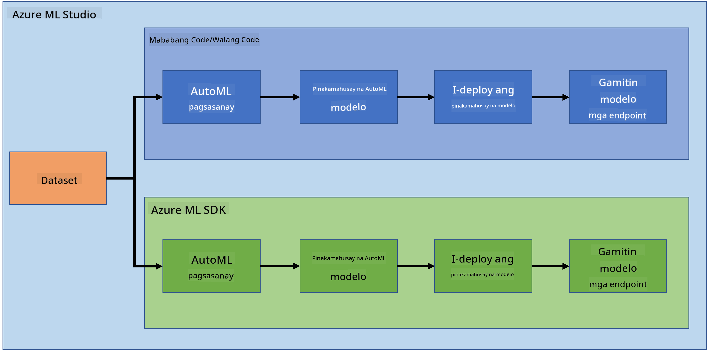
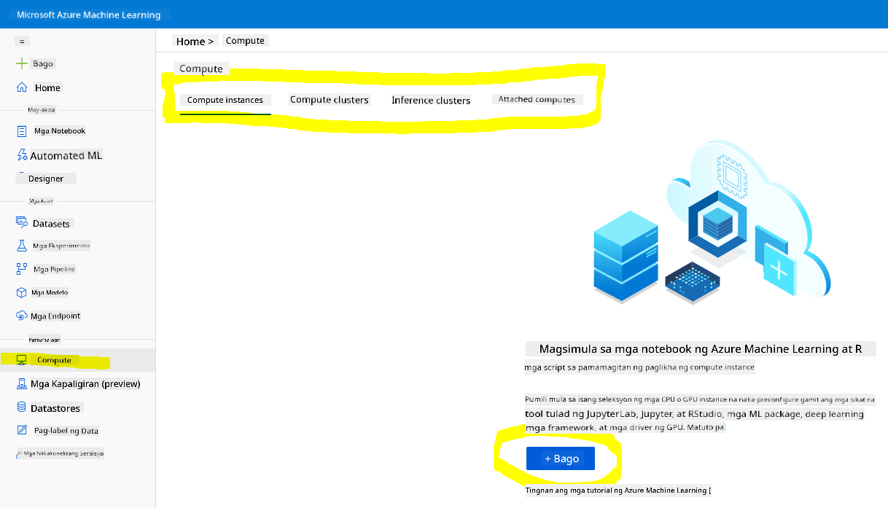
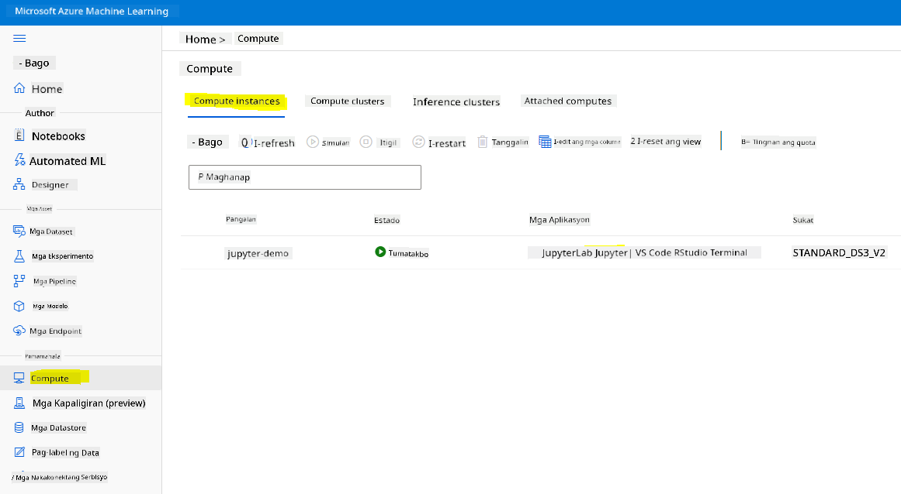
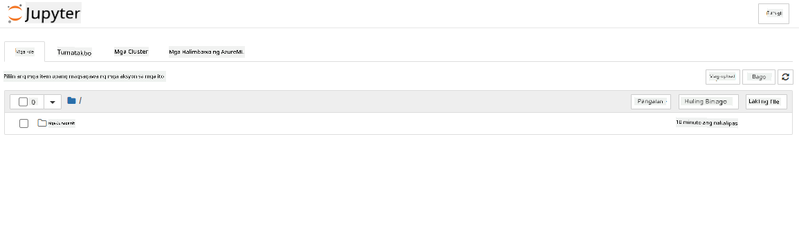

<!--
CO_OP_TRANSLATOR_METADATA:
{
  "original_hash": "5da2d6b3736f6d668b89de9bf3bdd31b",
  "translation_date": "2025-09-04T20:55:16+00:00",
  "source_file": "5-Data-Science-In-Cloud/19-Azure/README.md",
  "language_code": "tl"
}
-->
# Data Science sa Cloud: Ang "Azure ML SDK" na Paraan

| ](../../sketchnotes/19-DataScience-Cloud.png)|
|:---:|
| Data Science sa Cloud: Azure ML SDK - _Sketchnote ni [@nitya](https://twitter.com/nitya)_ |

Talaan ng mga Nilalaman:

- [Data Science sa Cloud: Ang "Azure ML SDK" na Paraan](../../../../5-Data-Science-In-Cloud/19-Azure)
  - [Pre-Lecture Quiz](../../../../5-Data-Science-In-Cloud/19-Azure)
  - [1. Panimula](../../../../5-Data-Science-In-Cloud/19-Azure)
    - [1.1 Ano ang Azure ML SDK?](../../../../5-Data-Science-In-Cloud/19-Azure)
    - [1.2 Pagsusuri ng proyekto at dataset para sa prediksyon ng heart failure](../../../../5-Data-Science-In-Cloud/19-Azure)
  - [2. Pagsasanay ng modelo gamit ang Azure ML SDK](../../../../5-Data-Science-In-Cloud/19-Azure)
    - [2.1 Gumawa ng Azure ML workspace](../../../../5-Data-Science-In-Cloud/19-Azure)
    - [2.2 Gumawa ng compute instance](../../../../5-Data-Science-In-Cloud/19-Azure)
    - [2.3 Paglo-load ng Dataset](../../../../5-Data-Science-In-Cloud/19-Azure)
    - [2.4 Paglikha ng Notebooks](../../../../5-Data-Science-In-Cloud/19-Azure)
    - [2.5 Pagsasanay ng modelo](../../../../5-Data-Science-In-Cloud/19-Azure)
      - [2.5.1 Pag-setup ng Workspace, eksperimento, compute cluster, at dataset](../../../../5-Data-Science-In-Cloud/19-Azure)
      - [2.5.2 AutoML Configuration at pagsasanay](../../../../5-Data-Science-In-Cloud/19-Azure)
  - [3. Pag-deploy ng modelo at paggamit ng endpoint gamit ang Azure ML SDK](../../../../5-Data-Science-In-Cloud/19-Azure)
    - [3.1 Pag-save ng pinakamahusay na modelo](../../../../5-Data-Science-In-Cloud/19-Azure)
    - [3.2 Pag-deploy ng modelo](../../../../5-Data-Science-In-Cloud/19-Azure)
    - [3.3 Paggamit ng endpoint](../../../../5-Data-Science-In-Cloud/19-Azure)
  - [🚀 Hamon](../../../../5-Data-Science-In-Cloud/19-Azure)
  - [Post-lecture quiz](../../../../5-Data-Science-In-Cloud/19-Azure)
  - [Review at Pag-aaral sa Sarili](../../../../5-Data-Science-In-Cloud/19-Azure)
  - [Takdang Aralin](../../../../5-Data-Science-In-Cloud/19-Azure)

## [Pre-Lecture Quiz](https://purple-hill-04aebfb03.1.azurestaticapps.net/quiz/36)

## 1. Panimula

### 1.1 Ano ang Azure ML SDK?

Ginagamit ng mga data scientist at AI developer ang Azure Machine Learning SDK upang bumuo at magpatakbo ng mga workflow ng machine learning gamit ang Azure Machine Learning service. Maaari kang makipag-ugnayan sa serbisyo sa anumang Python environment, kabilang ang Jupyter Notebooks, Visual Studio Code, o ang iyong paboritong Python IDE.

Pangunahing aspeto ng SDK:

- Tuklasin, ihanda, at pamahalaan ang lifecycle ng iyong mga dataset na ginagamit sa mga eksperimento ng machine learning.
- Pamahalaan ang mga cloud resource para sa monitoring, logging, at pag-oorganisa ng iyong mga eksperimento sa machine learning.
- Mag-train ng mga modelo, lokal man o gamit ang mga cloud resource, kabilang ang GPU-accelerated na pagsasanay ng modelo.
- Gumamit ng automated machine learning, na tumatanggap ng mga configuration parameter at training data. Awtomatiko nitong inuulit ang mga algorithm at hyperparameter settings upang mahanap ang pinakamahusay na modelo para sa prediksyon.
- Mag-deploy ng mga web service upang gawing RESTful services ang iyong mga na-train na modelo na maaaring gamitin sa anumang application.

[Alamin ang higit pa tungkol sa Azure Machine Learning SDK](https://docs.microsoft.com/python/api/overview/azure/ml?WT.mc_id=academic-77958-bethanycheum&ocid=AID3041109)

Sa [nakaraang aralin](../18-Low-Code/README.md), nakita natin kung paano mag-train, mag-deploy, at gumamit ng modelo sa Low code/No code na paraan. Ginamit natin ang Heart Failure dataset upang makabuo ng modelo para sa prediksyon ng heart failure. Sa araling ito, gagawin natin ang parehong bagay ngunit gamit ang Azure Machine Learning SDK.



### 1.2 Pagsusuri ng proyekto at dataset para sa prediksyon ng heart failure

Tingnan [dito](../18-Low-Code/README.md) ang pagsusuri ng proyekto at dataset para sa prediksyon ng heart failure.

## 2. Pagsasanay ng modelo gamit ang Azure ML SDK

### 2.1 Gumawa ng Azure ML workspace

Para sa kasimplehan, gagamit tayo ng jupyter notebook. Ipinapahiwatig nito na mayroon ka nang Workspace at compute instance. Kung mayroon ka nang Workspace, maaari kang dumiretso sa seksyong 2.3 Paglikha ng Notebook.

Kung wala pa, sundin ang mga tagubilin sa seksyong **2.1 Gumawa ng Azure ML workspace** sa [nakaraang aralin](../18-Low-Code/README.md) upang makagawa ng workspace.

### 2.2 Gumawa ng compute instance

Sa [Azure ML workspace](https://ml.azure.com/) na ginawa natin kanina, pumunta sa compute menu at makikita mo ang iba't ibang compute resources na magagamit.



Gumawa tayo ng compute instance upang maglaan ng jupyter notebook.  
1. I-click ang + New button.  
2. Bigyan ng pangalan ang iyong compute instance.  
3. Piliin ang iyong mga opsyon: CPU o GPU, VM size, at bilang ng core.  
4. I-click ang Create button.  

Binabati kita, nakagawa ka na ng compute instance! Gagamitin natin ang compute instance na ito upang gumawa ng Notebook sa seksyong [Paglikha ng Notebooks](../../../../5-Data-Science-In-Cloud/19-Azure).

### 2.3 Paglo-load ng Dataset

Tingnan ang [nakaraang aralin](../18-Low-Code/README.md) sa seksyong **2.3 Paglo-load ng Dataset** kung hindi mo pa na-upload ang dataset.

### 2.4 Paglikha ng Notebooks

> **_NOTE:_** Para sa susunod na hakbang, maaari kang gumawa ng bagong notebook mula sa simula, o maaari mong i-upload ang [notebook na ginawa natin](notebook.ipynb) sa iyong Azure ML Studio. Upang i-upload ito, i-click lamang ang "Notebook" menu at i-upload ang notebook.

Ang mga notebook ay mahalagang bahagi ng proseso ng data science. Maaari itong gamitin upang magsagawa ng Exploratory Data Analysis (EDA), tumawag sa isang compute cluster upang mag-train ng modelo, o tumawag sa isang inference cluster upang mag-deploy ng endpoint.

Upang makagawa ng Notebook, kailangan natin ng compute node na nagsisilbing jupyter notebook instance. Bumalik sa [Azure ML workspace](https://ml.azure.com/) at i-click ang Compute instances. Sa listahan ng compute instances, dapat mong makita ang [compute instance na ginawa natin kanina](../../../../5-Data-Science-In-Cloud/19-Azure).

1. Sa seksyong Applications, i-click ang Jupyter option.  
2. Lagyan ng check ang "Yes, I understand" box at i-click ang Continue button.  
  
3. Dapat itong magbukas ng bagong browser tab na may jupyter notebook instance. I-click ang "New" button upang gumawa ng notebook.  



Ngayon na mayroon na tayong Notebook, maaari na tayong magsimula sa pagsasanay ng modelo gamit ang Azure ML SDK.

### 2.5 Pagsasanay ng modelo

Una sa lahat, kung may alinlangan ka, tingnan ang [Azure ML SDK documentation](https://docs.microsoft.com/python/api/overview/azure/ml?WT.mc_id=academic-77958-bethanycheum&ocid=AID3041109). Naglalaman ito ng lahat ng kinakailangang impormasyon upang maunawaan ang mga module na tatalakayin natin sa araling ito.

#### 2.5.1 Pag-setup ng Workspace, eksperimento, compute cluster, at dataset

Kailangan mong i-load ang `workspace` mula sa configuration file gamit ang sumusunod na code:

```python
from azureml.core import Workspace
ws = Workspace.from_config()
```

Ito ay magbabalik ng isang object na uri ng `Workspace` na kumakatawan sa workspace. Pagkatapos, kailangan mong gumawa ng `experiment` gamit ang sumusunod na code:

```python
from azureml.core import Experiment
experiment_name = 'aml-experiment'
experiment = Experiment(ws, experiment_name)
```

Upang makuha o gumawa ng eksperimento mula sa workspace, hihilingin mo ang eksperimento gamit ang pangalan nito. Ang pangalan ng eksperimento ay dapat may 3-36 na karakter, nagsisimula sa letra o numero, at maaari lamang maglaman ng mga letra, numero, underscore, at dash. Kung hindi matagpuan ang eksperimento sa workspace, isang bagong eksperimento ang gagawin.

Ngayon, kailangan mong gumawa ng compute cluster para sa pagsasanay gamit ang sumusunod na code. Tandaan na maaaring tumagal ng ilang minuto ang hakbang na ito.

```python
from azureml.core.compute import AmlCompute

aml_name = "heart-f-cluster"
try:
    aml_compute = AmlCompute(ws, aml_name)
    print('Found existing AML compute context.')
except:
    print('Creating new AML compute context.')
    aml_config = AmlCompute.provisioning_configuration(vm_size = "Standard_D2_v2", min_nodes=1, max_nodes=3)
    aml_compute = AmlCompute.create(ws, name = aml_name, provisioning_configuration = aml_config)
    aml_compute.wait_for_completion(show_output = True)

cts = ws.compute_targets
compute_target = cts[aml_name]
```

Maaari mong makuha ang dataset mula sa workspace gamit ang pangalan ng dataset sa sumusunod na paraan:

```python
dataset = ws.datasets['heart-failure-records']
df = dataset.to_pandas_dataframe()
df.describe()
```

#### 2.5.2 AutoML Configuration at pagsasanay

Upang i-set ang AutoML configuration, gamitin ang [AutoMLConfig class](https://docs.microsoft.com/python/api/azureml-train-automl-client/azureml.train.automl.automlconfig(class)?WT.mc_id=academic-77958-bethanycheum&ocid=AID3041109).

Ayon sa dokumentasyon, maraming mga parameter na maaari mong paglaruan. Para sa proyektong ito, gagamitin natin ang sumusunod na mga parameter:

- `experiment_timeout_minutes`: Ang maximum na oras (sa minuto) na pinapayagan ang eksperimento bago ito awtomatikong itigil at gawing available ang mga resulta.
- `max_concurrent_iterations`: Ang maximum na bilang ng sabay-sabay na training iterations na pinapayagan para sa eksperimento.
- `primary_metric`: Ang pangunahing sukatan na ginagamit upang matukoy ang status ng eksperimento.
- `compute_target`: Ang Azure Machine Learning compute target kung saan tatakbo ang Automated Machine Learning experiment.
- `task`: Ang uri ng task na tatakbuhin. Ang mga halaga ay maaaring 'classification', 'regression', o 'forecasting' depende sa uri ng automated ML problem na kailangang lutasin.
- `training_data`: Ang training data na gagamitin sa eksperimento. Dapat itong maglaman ng parehong training features at isang label column (opsyonal ang sample weights column).
- `label_column_name`: Ang pangalan ng label column.
- `path`: Ang buong path sa Azure Machine Learning project folder.
- `enable_early_stopping`: Kung papayagan ang maagang pagtigil kung hindi bumubuti ang score sa maikling panahon.
- `featurization`: Indicator kung awtomatikong gagawin ang featurization step o hindi, o kung gagamit ng customized featurization.
- `debug_log`: Ang log file kung saan isusulat ang debug information.

```python
from azureml.train.automl import AutoMLConfig

project_folder = './aml-project'

automl_settings = {
    "experiment_timeout_minutes": 20,
    "max_concurrent_iterations": 3,
    "primary_metric" : 'AUC_weighted'
}

automl_config = AutoMLConfig(compute_target=compute_target,
                             task = "classification",
                             training_data=dataset,
                             label_column_name="DEATH_EVENT",
                             path = project_folder,  
                             enable_early_stopping= True,
                             featurization= 'auto',
                             debug_log = "automl_errors.log",
                             **automl_settings
                            )
```

Ngayon na na-set mo na ang iyong configuration, maaari mo nang i-train ang modelo gamit ang sumusunod na code. Ang hakbang na ito ay maaaring tumagal ng hanggang isang oras depende sa laki ng iyong cluster.

```python
remote_run = experiment.submit(automl_config)
```

Maaari mong patakbuhin ang RunDetails widget upang ipakita ang iba't ibang eksperimento.

```python
from azureml.widgets import RunDetails
RunDetails(remote_run).show()
```

## 3. Pag-deploy ng modelo at paggamit ng endpoint gamit ang Azure ML SDK

### 3.1 Pag-save ng pinakamahusay na modelo

Ang `remote_run` ay isang object na uri ng [AutoMLRun](https://docs.microsoft.com/python/api/azureml-train-automl-client/azureml.train.automl.run.automlrun?WT.mc_id=academic-77958-bethanycheum&ocid=AID3041109). Ang object na ito ay naglalaman ng method na `get_output()` na nagbabalik ng pinakamahusay na run at ang kaukulang fitted model.

```python
best_run, fitted_model = remote_run.get_output()
```

Makikita mo ang mga parameter na ginamit para sa pinakamahusay na modelo sa pamamagitan ng pag-print ng fitted_model at makita ang mga properties ng pinakamahusay na modelo gamit ang [get_properties()](https://docs.microsoft.com/python/api/azureml-core/azureml.core.run(class)?view=azure-ml-py#azureml_core_Run_get_properties?WT.mc_id=academic-77958-bethanycheum&ocid=AID3041109) method.

```python
best_run.get_properties()
```

Ngayon, irehistro ang modelo gamit ang [register_model](https://docs.microsoft.com/python/api/azureml-train-automl-client/azureml.train.automl.run.automlrun?view=azure-ml-py#register-model-model-name-none--description-none--tags-none--iteration-none--metric-none-?WT.mc_id=academic-77958-bethanycheum&ocid=AID3041109) method.

```python
model_name = best_run.properties['model_name']
script_file_name = 'inference/score.py'
best_run.download_file('outputs/scoring_file_v_1_0_0.py', 'inference/score.py')
description = "aml heart failure project sdk"
model = best_run.register_model(model_name = model_name,
                                model_path = './outputs/',
                                description = description,
                                tags = None)
```

### 3.2 Pag-deploy ng modelo

Kapag na-save na ang pinakamahusay na modelo, maaari na natin itong i-deploy gamit ang [InferenceConfig](https://docs.microsoft.com/python/api/azureml-core/azureml.core.model.inferenceconfig?view=azure-ml-py?ocid=AID3041109) class. Ang InferenceConfig ay kumakatawan sa mga configuration setting para sa custom environment na ginagamit para sa deployment. Ang [AciWebservice](https://docs.microsoft.com/python/api/azureml-core/azureml.core.webservice.aciwebservice?view=azure-ml-py) class ay kumakatawan sa isang machine learning model na na-deploy bilang web service endpoint sa Azure Container Instances. Ang na-deploy na serbisyo ay isang load-balanced, HTTP endpoint na may REST API. Maaari kang magpadala ng data sa API na ito at makatanggap ng prediksyon mula sa modelo.

Ang modelo ay ide-deploy gamit ang [deploy](https://docs.microsoft.com/python/api/azureml-core/azureml.core.model(class)?view=azure-ml-py#deploy-workspace--name--models--inference-config-none--deployment-config-none--deployment-target-none--overwrite-false--show-output-false-?WT.mc_id=academic-77958-bethanycheum&ocid=AID3041109) method.

```python
from azureml.core.model import InferenceConfig, Model
from azureml.core.webservice import AciWebservice

inference_config = InferenceConfig(entry_script=script_file_name, environment=best_run.get_environment())

aciconfig = AciWebservice.deploy_configuration(cpu_cores = 1,
                                               memory_gb = 1,
                                               tags = {'type': "automl-heart-failure-prediction"},
                                               description = 'Sample service for AutoML Heart Failure Prediction')

aci_service_name = 'automl-hf-sdk'
aci_service = Model.deploy(ws, aci_service_name, [model], inference_config, aciconfig)
aci_service.wait_for_deployment(True)
print(aci_service.state)
```

Ang hakbang na ito ay maaaring tumagal ng ilang minuto.

### 3.3 Paggamit ng endpoint

Maaari mong gamitin ang iyong endpoint sa pamamagitan ng paggawa ng sample input:

```python
data = {
    "data":
    [
        {
            'age': "60",
            'anaemia': "false",
            'creatinine_phosphokinase': "500",
            'diabetes': "false",
            'ejection_fraction': "38",
            'high_blood_pressure': "false",
            'platelets': "260000",
            'serum_creatinine': "1.40",
            'serum_sodium': "137",
            'sex': "false",
            'smoking': "false",
            'time': "130",
        },
    ],
}

test_sample = str.encode(json.dumps(data))
```

At pagkatapos, maaari mong ipadala ang input na ito sa iyong modelo para sa prediksyon:
```python
response = aci_service.run(input_data=test_sample)
response
```
Dapat itong mag-output ng `'{"result": [false]}'`. Ibig sabihin nito na ang input ng pasyente na ipinadala natin sa endpoint ay nag-generate ng prediksyon na `false`, na nangangahulugang ang taong ito ay hindi malamang magkaroon ng atake sa puso.

Binabati kita! Ginamit mo na ang modelong na-deploy at na-train gamit ang Azure ML sa tulong ng Azure ML SDK!

> **_NOTE:_** Kapag natapos mo na ang proyekto, huwag kalimutang i-delete ang lahat ng resources.

## 🚀 Hamon

Marami pang ibang bagay na magagawa mo gamit ang SDK, ngunit sa kasamaang-palad, hindi natin ito lahat matatalakay sa araling ito. Pero magandang balita, ang pag-aaral kung paano mag-skim sa dokumentasyon ng SDK ay makakatulong nang malaki sa iyong pag-aaral nang mag-isa. Tingnan ang dokumentasyon ng Azure ML SDK at hanapin ang `Pipeline` class na nagbibigay-daan sa iyo na gumawa ng mga pipeline. Ang Pipeline ay koleksyon ng mga hakbang na maaaring i-execute bilang isang workflow.

**HINT:** Pumunta sa [SDK documentation](https://docs.microsoft.com/python/api/overview/azure/ml/?view=azure-ml-py?WT.mc_id=academic-77958-bethanycheum&ocid=AID3041109) at mag-type ng mga keyword sa search bar tulad ng "Pipeline". Dapat mong makita ang `azureml.pipeline.core.Pipeline` class sa mga resulta ng paghahanap.

## [Post-lecture quiz](https://ff-quizzes.netlify.app/en/ds/)

## Review at Sariling Pag-aaral

Sa araling ito, natutunan mo kung paano mag-train, mag-deploy, at gumamit ng modelo upang mag-predict ng panganib ng heart failure gamit ang Azure ML SDK sa cloud. Tingnan ang [dokumentasyon](https://docs.microsoft.com/python/api/overview/azure/ml/?view=azure-ml-py?WT.mc_id=academic-77958-bethanycheum&ocid=AID3041109) para sa karagdagang impormasyon tungkol sa Azure ML SDK. Subukan mong gumawa ng sarili mong modelo gamit ang Azure ML SDK.

## Takdang-Aralin

[Proyekto sa Data Science gamit ang Azure ML SDK](assignment.md)

---

**Paunawa**:  
Ang dokumentong ito ay isinalin gamit ang AI translation service na [Co-op Translator](https://github.com/Azure/co-op-translator). Bagama't sinisikap naming maging tumpak, pakitandaan na ang mga awtomatikong pagsasalin ay maaaring maglaman ng mga pagkakamali o hindi pagkakatugma. Ang orihinal na dokumento sa kanyang orihinal na wika ang dapat ituring na opisyal na sanggunian. Para sa mahalagang impormasyon, inirerekomenda ang propesyonal na pagsasalin ng tao. Hindi kami mananagot sa anumang hindi pagkakaunawaan o maling interpretasyon na maaaring magmula sa paggamit ng pagsasaling ito.