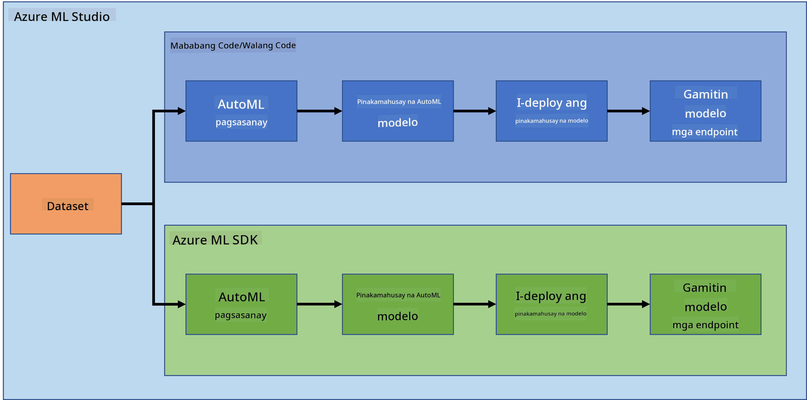

<!--
CO_OP_TRANSLATOR_METADATA:
{
  "original_hash": "8dfe141a0f46f7d253e07f74913c7f44",
  "translation_date": "2025-08-28T02:23:31+00:00",
  "source_file": "5-Data-Science-In-Cloud/README.md",
  "language_code": "tl"
}
-->
# Data Science sa Cloud

> Larawan ni [Jelleke Vanooteghem](https://unsplash.com/@ilumire) mula sa [Unsplash](https://unsplash.com/s/photos/cloud?orientation=landscape)

Kapag pinag-uusapan ang paggawa ng data science gamit ang malalaking datos, ang cloud ay maaaring maging isang malaking tulong. Sa susunod na tatlong aralin, tatalakayin natin kung ano ang cloud at kung bakit ito napaka-kapaki-pakinabang. Susuriin din natin ang isang dataset tungkol sa heart failure at gagawa ng modelo upang makatulong sa pagsusuri ng posibilidad na magkaroon ng heart failure ang isang tao. Gagamitin natin ang kapangyarihan ng cloud upang sanayin, i-deploy, at gamitin ang modelo sa dalawang magkaibang paraan. Ang isang paraan ay gamit lamang ang user interface sa isang Low code/No code na paraan, at ang isa pang paraan ay gamit ang Azure Machine Learning Software Developer Kit (Azure ML SDK).

### Mga Paksa

1. [Bakit gamitin ang Cloud para sa Data Science?](17-Introduction/README.md)
2. [Data Science sa Cloud: Ang "Low code/No code" na paraan](18-Low-Code/README.md)
3. [Data Science sa Cloud: Ang "Azure ML SDK" na paraan](19-Azure/README.md)

### Mga Kredito
Ang mga araling ito ay isinulat nang may ☁️ at 💕 nina [Maud Levy](https://twitter.com/maudstweets) at [Tiffany Souterre](https://twitter.com/TiffanySouterre)

Ang datos para sa proyekto ng Heart Failure Prediction ay mula sa [
Larxel](https://www.kaggle.com/andrewmvd) sa [Kaggle](https://www.kaggle.com/andrewmvd/heart-failure-clinical-data). Ito ay lisensyado sa ilalim ng [Attribution 4.0 International (CC BY 4.0)](https://creativecommons.org/licenses/by/4.0/)

---

**Paunawa**:  
Ang dokumentong ito ay isinalin gamit ang AI translation service na [Co-op Translator](https://github.com/Azure/co-op-translator). Bagama't sinisikap naming maging tumpak, tandaan na ang mga awtomatikong pagsasalin ay maaaring maglaman ng mga pagkakamali o hindi pagkakatugma. Ang orihinal na dokumento sa kanyang katutubong wika ang dapat ituring na opisyal na sanggunian. Para sa mahalagang impormasyon, inirerekomenda ang propesyonal na pagsasalin ng tao. Hindi kami mananagot sa anumang hindi pagkakaunawaan o maling interpretasyon na maaaring magmula sa paggamit ng pagsasaling ito.