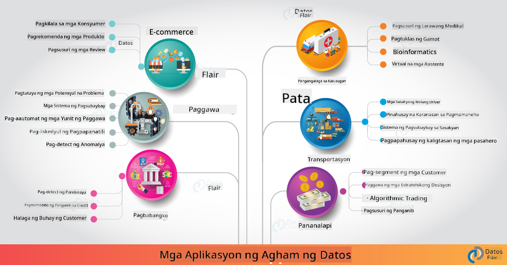

<!--
CO_OP_TRANSLATOR_METADATA:
{
  "original_hash": "67076ed50f54e7d26ba1ba378d6078f1",
  "translation_date": "2025-08-28T02:48:38+00:00",
  "source_file": "6-Data-Science-In-Wild/20-Real-World-Examples/README.md",
  "language_code": "tl"
}
-->
# Data Science sa Tunay na Mundo

|  ](../../sketchnotes/20-DataScience-RealWorld.png) |
| :--------------------------------------------------------------------------------------------------------------: |
|               Data Science sa Tunay na Mundo - _Sketchnote ni [@nitya](https://twitter.com/nitya)_               |

Malapit na tayo sa dulo ng ating pag-aaral!

Nagsimula tayo sa mga depinisyon ng data science at etika, sinuri ang iba't ibang tools at teknik para sa pagsusuri at pagpapakita ng datos, nirepaso ang lifecycle ng data science, at tiningnan ang pag-scale at pag-automate ng mga workflow ng data science gamit ang mga serbisyo ng cloud computing. Kaya, marahil iniisip mo: _"Paano ko maiaangkop ang lahat ng natutunan ko sa mga tunay na sitwasyon?"_

Sa araling ito, tatalakayin natin ang mga aplikasyon ng data science sa iba't ibang industriya at susuriin ang mga partikular na halimbawa sa pananaliksik, digital humanities, at sustainability. Titingnan din natin ang mga oportunidad para sa mga proyekto ng estudyante at magtatapos sa mga kapaki-pakinabang na resources para ipagpatuloy ang iyong pag-aaral!

## Pre-Lecture Quiz

[Pre-lecture quiz](https://purple-hill-04aebfb03.1.azurestaticapps.net/quiz/38)

## Data Science + Industriya

Dahil sa democratization ng AI, mas madali na ngayon para sa mga developer na magdisenyo at mag-integrate ng AI-driven decision-making at data-driven insights sa user experiences at development workflows. Narito ang ilang halimbawa kung paano "inaaplay" ang data science sa mga tunay na aplikasyon sa industriya:

 * [Google Flu Trends](https://www.wired.com/2015/10/can-learn-epic-failure-google-flu-trends) - ginamit ang data science para i-correlate ang mga search term sa flu trends. Bagama't may mga kahinaan ang approach, nagbigay ito ng kamalayan sa mga posibilidad (at hamon) ng data-driven na prediksyon sa healthcare.

 * [UPS Routing Predictions](https://www.technologyreview.com/2018/11/21/139000/how-ups-uses-ai-to-outsmart-bad-weather/) - nagpapaliwanag kung paano ginagamit ng UPS ang data science at machine learning para hulaan ang pinakamainam na ruta para sa delivery, isinasaalang-alang ang kondisyon ng panahon, traffic patterns, deadlines ng delivery, at iba pa.

 * [NYC Taxicab Route Visualization](http://chriswhong.github.io/nyctaxi/) - ang datos na nakuha gamit ang [Freedom Of Information Laws](https://chriswhong.com/open-data/foil_nyc_taxi/) ay tumulong sa pag-visualize ng isang araw sa buhay ng mga taxi sa NYC, na nagpapakita kung paano sila nag-navigate sa abalang lungsod, ang perang kanilang kinikita, at ang tagal ng biyahe sa loob ng bawat 24 na oras.

 * [Uber Data Science Workbench](https://eng.uber.com/dsw/) - gumagamit ng datos (pickup & dropoff locations, tagal ng biyahe, preferred routes, atbp.) mula sa milyon-milyong Uber trips *araw-araw* para bumuo ng data analytics tool na tumutulong sa pricing, safety, fraud detection, at navigation decisions.

 * [Sports Analytics](https://towardsdatascience.com/scope-of-analytics-in-sports-world-37ed09c39860) - nakatuon sa _predictive analytics_ (team at player analysis - gaya ng [Moneyball](https://datasciencedegree.wisconsin.edu/blog/moneyball-proves-importance-big-data-big-ideas/) - at fan management) at _data visualization_ (team & fan dashboards, games, atbp.) na may aplikasyon tulad ng talent scouting, sports gambling, at inventory/venue management.

 * [Data Science sa Banking](https://data-flair.training/blogs/data-science-in-banking/) - binibigyang-diin ang halaga ng data science sa industriya ng pananalapi na may mga aplikasyon mula sa risk modeling at fraud detection, hanggang sa customer segmentation, real-time prediction, at recommender systems. Ang predictive analytics ay nagdadala rin ng mahahalagang sukatan tulad ng [credit scores](https://dzone.com/articles/using-big-data-and-predictive-analytics-for-credit).

 * [Data Science sa Healthcare](https://data-flair.training/blogs/data-science-in-healthcare/) - binibigyang-diin ang mga aplikasyon tulad ng medical imaging (e.g., MRI, X-Ray, CT-Scan), genomics (DNA sequencing), drug development (risk assessment, success prediction), predictive analytics (patient care & supply logistics), disease tracking & prevention, atbp.

 Image Credit: [Data Flair: 6 Amazing Data Science Applications ](https://data-flair.training/blogs/data-science-applications/)

Ipinapakita ng figure ang iba pang domain at halimbawa ng paggamit ng mga teknik ng data science. Gusto mo bang tuklasin ang iba pang aplikasyon? Tingnan ang [Review & Self Study](../../../../6-Data-Science-In-Wild/20-Real-World-Examples) na seksyon sa ibaba.

## Data Science + Pananaliksik

|  ](../../sketchnotes/20-DataScience-Research.png) |
| :---------------------------------------------------------------------------------------------------------------: |
|              Data Science & Pananaliksik - _Sketchnote ni [@nitya](https://twitter.com/nitya)_              |

Bagama't ang mga tunay na aplikasyon ay madalas na nakatuon sa mga use case sa industriya, ang mga aplikasyon at proyekto sa _pananaliksik_ ay maaaring maging kapaki-pakinabang mula sa dalawang perspektibo:

* _oportunidad para sa inobasyon_ - tuklasin ang mabilis na pag-prototype ng mga advanced na konsepto at testing ng user experiences para sa mga susunod na henerasyon ng aplikasyon.
* _mga hamon sa deployment_ - suriin ang mga potensyal na pinsala o hindi inaasahang epekto ng mga teknolohiya ng data science sa mga tunay na sitwasyon.

Para sa mga estudyante, ang mga proyektong pananaliksik ay maaaring magbigay ng parehong learning at collaboration opportunities na maaaring magpabuti sa iyong pag-unawa sa paksa, at magpalawak ng iyong kamalayan at pakikilahok sa mga kaugnay na tao o team na nagtatrabaho sa mga lugar ng interes. Kaya ano ang hitsura ng mga proyektong pananaliksik at paano ito makakagawa ng epekto?

Tingnan natin ang isang halimbawa - ang [MIT Gender Shades Study](http://gendershades.org/overview.html) mula kay Joy Buolamwini (MIT Media Labs) na may [signature research paper](http://proceedings.mlr.press/v81/buolamwini18a/buolamwini18a.pdf) na co-authored ni Timnit Gebru (noon sa Microsoft Research) na nakatuon sa 

 * **Ano:** Ang layunin ng proyekto ay _suriin ang bias na naroroon sa mga automated facial analysis algorithms at datasets_ batay sa kasarian at uri ng balat.
 * **Bakit:** Ang facial analysis ay ginagamit sa mga lugar tulad ng law enforcement, airport security, hiring systems, at iba pa - mga konteksto kung saan ang maling klasipikasyon (hal., dahil sa bias) ay maaaring magdulot ng potensyal na pinsalang pang-ekonomiya at panlipunan sa mga apektadong indibidwal o grupo. Ang pag-unawa (at pag-aalis o pag-mitigate) ng bias ay mahalaga para sa fairness sa paggamit.
 * **Paano:** Napansin ng mga mananaliksik na ang mga umiiral na benchmark ay kadalasang gumagamit ng mga subject na may mas maputing balat, kaya gumawa sila ng bagong dataset (1000+ na imahe) na _mas balanse_ sa kasarian at uri ng balat. Ang dataset ay ginamit para suriin ang accuracy ng tatlong gender classification products (mula sa Microsoft, IBM & Face++).

Ipinakita ng resulta na bagama't maganda ang overall classification accuracy, may kapansin-pansing pagkakaiba sa error rates sa pagitan ng iba't ibang subgroup - kung saan mas mataas ang **misgendering** para sa mga babae o taong may mas maitim na balat, na nagpapahiwatig ng bias.

**Mga Pangunahing Resulta:** Nagbigay ng kamalayan na ang data science ay nangangailangan ng mas _representative datasets_ (balanseng subgroup) at mas _inclusive teams_ (diverse backgrounds) para ma-recognize at maalis o ma-mitigate ang ganitong bias nang mas maaga sa mga solusyon ng AI. Ang mga pagsisikap sa pananaliksik tulad nito ay mahalaga rin sa maraming organisasyon sa pagbuo ng mga prinsipyo at praktis para sa _responsible AI_ upang mapabuti ang fairness sa kanilang mga AI products at processes.

**Gusto mo bang matuto tungkol sa mga kaugnay na pagsisikap sa pananaliksik sa Microsoft?**

* Tingnan ang [Microsoft Research Projects](https://www.microsoft.com/research/research-area/artificial-intelligence/?facet%5Btax%5D%5Bmsr-research-area%5D%5B%5D=13556&facet%5Btax%5D%5Bmsr-content-type%5D%5B%5D=msr-project) sa Artificial Intelligence.
* Tuklasin ang mga proyekto ng estudyante mula sa [Microsoft Research Data Science Summer School](https://www.microsoft.com/en-us/research/academic-program/data-science-summer-school/).
* Tingnan ang [Fairlearn](https://fairlearn.org/) na proyekto at [Responsible AI](https://www.microsoft.com/en-us/ai/responsible-ai?activetab=pivot1%3aprimaryr6) na mga inisyatibo.

## Data Science + Humanities

|  ](../../sketchnotes/20-DataScience-Humanities.png) |
| :---------------------------------------------------------------------------------------------------------------: |
|              Data Science & Digital Humanities - _Sketchnote ni [@nitya](https://twitter.com/nitya)_              |

Ang Digital Humanities [ay naipaliwanag](https://digitalhumanities.stanford.edu/about-dh-stanford) bilang "isang koleksyon ng mga praktis at approach na pinagsasama ang computational methods sa humanistic inquiry". Ang mga [proyekto ng Stanford](https://digitalhumanities.stanford.edu/projects) tulad ng _"rebooting history"_ at _"poetic thinking"_ ay nagpapakita ng koneksyon sa pagitan ng [Digital Humanities at Data Science](https://digitalhumanities.stanford.edu/digital-humanities-and-data-science) - binibigyang-diin ang mga teknik tulad ng network analysis, information visualization, spatial at text analysis na maaaring makatulong sa atin na muling suriin ang mga historical at literary datasets upang makakuha ng bagong insights at perspektibo.

*Gusto mo bang tuklasin at palawakin ang isang proyekto sa larangang ito?*

Tingnan ang ["Emily Dickinson and the Meter of Mood"](https://gist.github.com/jlooper/ce4d102efd057137bc000db796bfd671) - isang mahusay na halimbawa mula kay [Jen Looper](https://twitter.com/jenlooper) na nagtatanong kung paano natin magagamit ang data science upang muling suriin ang pamilyar na tula at muling suriin ang kahulugan nito at ang kontribusyon ng may-akda sa bagong konteksto. Halimbawa, _maaari ba nating mahulaan ang panahon kung kailan isinulat ang isang tula sa pamamagitan ng pagsusuri sa tono o damdamin nito_ - at ano ang sinasabi nito tungkol sa estado ng isipan ng may-akda sa kaugnay na panahon?

Para masagot ang tanong na iyon, sundan natin ang mga hakbang ng lifecycle ng data science:
 * [`Data Acquisition`](https://gist.github.com/jlooper/ce4d102efd057137bc000db796bfd671#acquiring-the-dataset) - upang mangolekta ng kaugnay na dataset para sa pagsusuri. Ang mga opsyon ay kinabibilangan ng paggamit ng API (hal., [Poetry DB API](https://poetrydb.org/index.html)) o pag-scrape ng mga web page (hal., [Project Gutenberg](https://www.gutenberg.org/files/12242/12242-h/12242-h.htm)) gamit ang mga tools tulad ng [Scrapy](https://scrapy.org/).
 * [`Data Cleaning`](https://gist.github.com/jlooper/ce4d102efd057137bc000db796bfd671#clean-the-data) - nagpapaliwanag kung paano maaaring i-format, i-sanitize, at i-simplify ang text gamit ang mga basic tools tulad ng Visual Studio Code at Microsoft Excel.
 * [`Data Analysis`](https://gist.github.com/jlooper/ce4d102efd057137bc000db796bfd671#working-with-the-data-in-a-notebook) - nagpapaliwanag kung paano natin maaaring i-import ang dataset sa "Notebooks" para sa pagsusuri gamit ang Python packages (tulad ng pandas, numpy, at matplotlib) upang ayusin at i-visualize ang datos.
 * [`Sentiment Analysis`](https://gist.github.com/jlooper/ce4d102efd057137bc000db796bfd671#sentiment-analysis-using-cognitive-services) - nagpapaliwanag kung paano natin maaaring i-integrate ang cloud services tulad ng Text Analytics, gamit ang low-code tools tulad ng [Power Automate](https://flow.microsoft.com/en-us/) para sa automated na data processing workflows.

Gamit ang workflow na ito, maaari nating tuklasin ang epekto ng panahon sa damdamin ng mga tula, at tulungan tayong bumuo ng sarili nating perspektibo sa may-akda. Subukan mo ito - pagkatapos ay palawakin ang notebook upang magtanong ng iba pang mga tanong o i-visualize ang datos sa mga bagong paraan!

> Maaari mong gamitin ang ilan sa mga tools sa [Digital Humanities toolkit](https://github.com/Digital-Humanities-Toolkit) upang ituloy ang mga ganitong uri ng inquiry.

## Data Science + Sustainability

|  ](../../sketchnotes/20-DataScience-Sustainability.png) |
| :---------------------------------------------------------------------------------------------------------------: |
|              Data Science & Sustainability - _Sketchnote ni [@nitya](https://twitter.com/nitya)_              |

Ang [2030 Agenda For Sustainable Development](https://sdgs.un.org/2030agenda) - na in-adopt ng lahat ng miyembro ng United Nations noong 2015 - ay nagtatakda ng 17 layunin kabilang ang mga nakatuon sa **Pagprotekta sa Planet** mula sa pagkasira at epekto ng climate change. Ang [Microsoft Sustainability](https://www.microsoft.com/en-us/sustainability) na inisyatibo ay sumusuporta sa mga layuning ito sa pamamagitan ng paggalugad ng mga paraan kung paano makakatulong ang mga teknolohiyang solusyon sa pagbuo ng mas sustainable na kinabukasan na may [focus sa 4 na layunin](https://dev.to/azure/a-visual-guide-to-sustainable-software-engineering-53hh) - pagiging carbon negative, water positive, zero waste, at bio-diverse pagsapit ng 2030.

Ang pagharap sa mga hamon na ito sa isang scalable at napapanahong paraan ay nangangailangan ng cloud-scale na pag-iisip - at malaking datos. Ang [Planetary Computer](https://planetarycomputer.microsoft.com/) na inisyatibo ay nagbibigay ng 4 na bahagi upang matulungan ang mga data scientist at developer sa pagsisikap na ito:

 * [Data Catalog](https://planetarycomputer.microsoft.com/catalog) - na may petabytes ng Earth Systems data (libre at naka-host sa Azure).
 * [Planetary API](https://planetarycomputer.microsoft.com/docs/reference/stac/) - upang matulungan ang mga user na maghanap ng kaugnay na datos sa espasyo at oras.
 * [Hub](https://planetarycomputer.microsoft.com/docs/overview/environment/) - managed environment para sa mga scientist na magproseso ng malalaking geospatial datasets.
 * [Applications](https://planetarycomputer.microsoft.com/applications) - nagpapakita ng mga use case at tools para sa sustainability insights.
**Ang Planetary Computer Project ay kasalukuyang nasa preview (mula Setyembre 2021)** - narito kung paano ka makakapagsimula sa pag-aambag sa mga solusyon para sa sustainability gamit ang data science.

* [Humiling ng access](https://planetarycomputer.microsoft.com/account/request) upang magsimula sa pag-explore at makipag-ugnayan sa mga kapwa mananaliksik.
* [Mag-explore ng dokumentasyon](https://planetarycomputer.microsoft.com/docs/overview/about) upang maunawaan ang mga suportadong dataset at API.
* Mag-explore ng mga aplikasyon tulad ng [Ecosystem Monitoring](https://analytics-lab.org/ecosystemmonitoring/) para sa inspirasyon sa mga ideya ng aplikasyon.

Pag-isipan kung paano mo magagamit ang data visualization upang ipakita o palakasin ang mga mahahalagang insight sa mga larangan tulad ng pagbabago ng klima at deforestation. O pag-isipan kung paano magagamit ang mga insight upang lumikha ng mga bagong karanasan para sa mga user na magpapasigla sa pagbabago ng ugali para sa mas sustainable na pamumuhay.

## Data Science + Mga Mag-aaral

Napag-usapan na natin ang mga aplikasyon sa totoong mundo sa industriya at pananaliksik, at nag-explore ng mga halimbawa ng aplikasyon ng data science sa digital humanities at sustainability. Kaya paano mo maitatayo ang iyong mga kakayahan at maibabahagi ang iyong kaalaman bilang mga baguhan sa data science?

Narito ang ilang halimbawa ng mga proyekto ng data science para sa mga mag-aaral na maaaring magbigay inspirasyon sa iyo.

* [MSR Data Science Summer School](https://www.microsoft.com/en-us/research/academic-program/data-science-summer-school/#!projects) na may mga proyekto sa GitHub [projects](https://github.com/msr-ds3) na nag-eexplore ng mga paksa tulad ng:
    - [Racial Bias in Police Use of Force](https://www.microsoft.com/en-us/research/video/data-science-summer-school-2019-replicating-an-empirical-analysis-of-racial-differences-in-police-use-of-force/) | [Github](https://github.com/msr-ds3/stop-question-frisk)
    - [Reliability of NYC Subway System](https://www.microsoft.com/en-us/research/video/data-science-summer-school-2018-exploring-the-reliability-of-the-nyc-subway-system/) | [Github](https://github.com/msr-ds3/nyctransit)
* [Digitizing Material Culture: Exploring socio-economic distributions in Sirkap](https://claremont.maps.arcgis.com/apps/Cascade/index.html?appid=bdf2aef0f45a4674ba41cd373fa23afc) - mula kay [Ornella Altunyan](https://twitter.com/ornelladotcom) at team sa Claremont, gamit ang [ArcGIS StoryMaps](https://storymaps.arcgis.com/).

## 🚀 Hamon

Maghanap ng mga artikulo na nagrerekomenda ng mga proyekto sa data science na angkop para sa mga baguhan - tulad ng [50 mga paksa](https://www.upgrad.com/blog/data-science-project-ideas-topics-beginners/) o [21 mga ideya ng proyekto](https://www.intellspot.com/data-science-project-ideas) o [16 na proyekto na may source code](https://data-flair.training/blogs/data-science-project-ideas/) na maaari mong pag-aralan at i-remix. At huwag kalimutang mag-blog tungkol sa iyong mga learning journey at ibahagi ang iyong mga insight sa aming lahat.

## Post-Lecture Quiz

[Post-lecture quiz](https://purple-hill-04aebfb03.1.azurestaticapps.net/quiz/39)

## Review & Self Study

Gusto mo bang mag-explore ng mas maraming use cases? Narito ang ilang mga kaugnay na artikulo:
* [17 Data Science Applications and Examples](https://builtin.com/data-science/data-science-applications-examples) - Hulyo 2021
* [11 Breathtaking Data Science Applications in Real World](https://myblindbird.com/data-science-applications-real-world/) - Mayo 2021
* [Data Science In The Real World](https://towardsdatascience.com/data-science-in-the-real-world/home) - Koleksyon ng Artikulo
* Data Science Sa: [Edukasyon](https://data-flair.training/blogs/data-science-in-education/), [Agrikultura](https://data-flair.training/blogs/data-science-in-agriculture/), [Pananalapi](https://data-flair.training/blogs/data-science-in-finance/), [Mga Pelikula](https://data-flair.training/blogs/data-science-at-movies/) at iba pa.

## Assignment

[Mag-explore ng Dataset ng Planetary Computer](assignment.md)

---

**Paunawa**:  
Ang dokumentong ito ay isinalin gamit ang AI translation service na [Co-op Translator](https://github.com/Azure/co-op-translator). Bagama't sinisikap naming maging tumpak, tandaan na ang mga awtomatikong pagsasalin ay maaaring maglaman ng mga pagkakamali o hindi pagkakatugma. Ang orihinal na dokumento sa kanyang katutubong wika ang dapat ituring na opisyal na sanggunian. Para sa mahalagang impormasyon, inirerekomenda ang propesyonal na pagsasalin ng tao. Hindi kami mananagot sa anumang hindi pagkakaunawaan o maling interpretasyon na maaaring magmula sa paggamit ng pagsasaling ito.