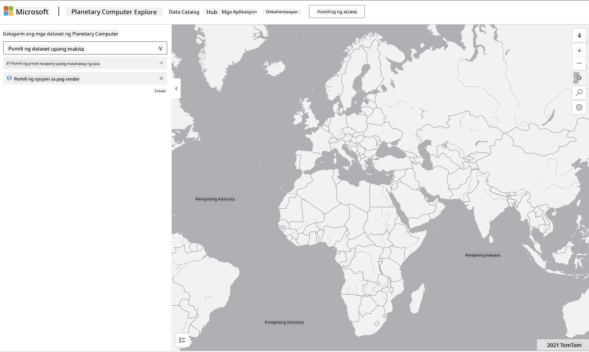

<!--
CO_OP_TRANSLATOR_METADATA:
{
  "original_hash": "d1e05715f9d97de6c4f1fb0c5a4702c0",
  "translation_date": "2025-08-28T02:49:29+00:00",
  "source_file": "6-Data-Science-In-Wild/20-Real-World-Examples/assignment.md",
  "language_code": "tl"
}
-->
# Mag-explore ng Dataset mula sa Planetary Computer

## Mga Instruksyon

Sa araling ito, tinalakay natin ang iba't ibang domain ng aplikasyon sa data science - kabilang ang masusing pag-aaral sa mga halimbawa na may kaugnayan sa pananaliksik, pagpapanatili, at digital humanities. Sa gawaing ito, mag-eexplore ka ng isa sa mga halimbawang ito nang mas detalyado, at gagamitin ang ilan sa iyong mga natutunan tungkol sa data visualizations at analysis upang makakuha ng mga insight tungkol sa datos ng pagpapanatili.

Ang proyekto ng [Planetary Computer](https://planetarycomputer.microsoft.com/) ay may mga dataset at API na maaaring ma-access gamit ang isang account - mag-request ng isa para sa access kung nais mong subukan ang bonus na hakbang ng gawain. Ang site ay mayroon ding [Explorer](https://planetarycomputer.microsoft.com/explore) na maaaring gamitin nang hindi gumagawa ng account.

`Mga Hakbang:`
Ang interface ng Explorer (makikita sa screenshot sa ibaba) ay nagbibigay-daan sa iyo na pumili ng dataset (mula sa mga ibinigay na opsyon), isang preset na query (upang i-filter ang data), at isang rendering option (upang lumikha ng kaugnay na visualization). Sa gawaing ito, ang iyong layunin ay:

 1. Basahin ang [Explorer documentation](https://planetarycomputer.microsoft.com/docs/overview/explorer/) - unawain ang mga opsyon.
 2. I-explore ang dataset [Catalog](https://planetarycomputer.microsoft.com/catalog) - alamin ang layunin ng bawat isa.
 3. Gamitin ang Explorer - pumili ng dataset na interesado ka, piliin ang kaugnay na query at rendering option.

`Ang Iyong Gawain:`
Pag-aralan ang visualization na na-render sa browser at sagutin ang mga sumusunod:
 * Anong mga _feature_ ang mayroon sa dataset?
 * Anong mga _insight_ o resulta ang ibinibigay ng visualization?
 * Ano ang mga _implikasyon_ ng mga insight na iyon sa mga layunin ng pagpapanatili ng proyekto?
 * Ano ang mga _limitasyon_ ng visualization (hal., anong insight ang hindi mo nakuha?)
 * Kung makukuha mo ang raw data, anong mga _alternatibong visualization_ ang gagawin mo, at bakit?

`Bonus Points:`
Mag-apply para sa isang account - at mag-login kapag naaprubahan.
 * Gamitin ang opsyon na _Launch Hub_ upang buksan ang raw data sa isang Notebook.
 * I-explore ang data nang interaktibo, at ipatupad ang mga alternatibong visualization na naisip mo.
 * Pag-aralan ang iyong mga custom na visualization - nakakuha ka ba ng mga insight na hindi mo nakuha dati?

## Rubric

Huwaran | Katanggap-tanggap | Kailangan ng Pagpapabuti
--- | --- | -- |
Nasagot ang lahat ng limang pangunahing tanong. Malinaw na tinukoy ng mag-aaral kung paano ang kasalukuyan at alternatibong visualization ay maaaring magbigay ng mga insight sa mga layunin o resulta ng pagpapanatili.| Nasagot ng mag-aaral ang hindi bababa sa nangungunang 3 tanong nang detalyado, na nagpapakita na may praktikal na karanasan sa Explorer. | Nabigo ang mag-aaral na sagutin ang maraming tanong, o nagbigay ng hindi sapat na detalye - na nagpapahiwatig na walang makabuluhang pagsubok na ginawa para sa proyekto |

---

**Paunawa**:  
Ang dokumentong ito ay isinalin gamit ang AI translation service na [Co-op Translator](https://github.com/Azure/co-op-translator). Bagama't sinisikap naming maging tumpak, tandaan na ang mga awtomatikong pagsasalin ay maaaring maglaman ng mga pagkakamali o hindi pagkakatugma. Ang orihinal na dokumento sa kanyang katutubong wika ang dapat ituring na opisyal na sanggunian. Para sa mahalagang impormasyon, inirerekomenda ang propesyonal na pagsasalin ng tao. Hindi kami mananagot sa anumang hindi pagkakaunawaan o maling interpretasyon na maaaring magmula sa paggamit ng pagsasaling ito.