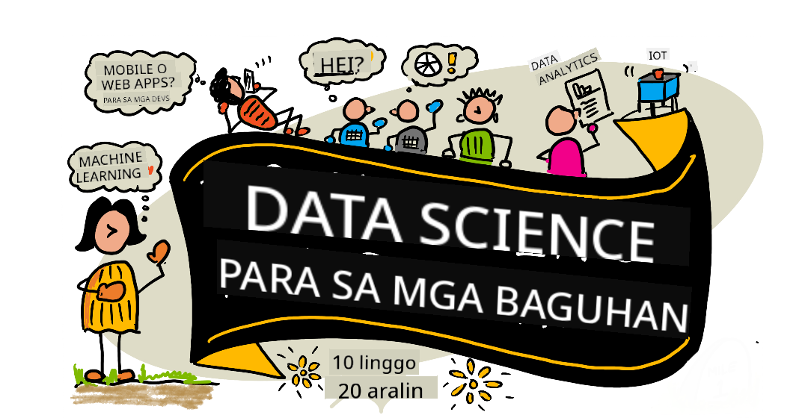

<!--
CO_OP_TRANSLATOR_METADATA:
{
  "original_hash": "dd9a1deb4da680b2cf11ba2e9f5a0a6e",
  "translation_date": "2025-09-29T22:03:12+00:00",
  "source_file": "README.md",
  "language_code": "tl"
}
-->
# Data Science para sa mga Baguhan - Isang Kurikulum

Azure Cloud Advocates sa Microsoft ay masayang nag-aalok ng isang 10-linggong, 20-leksyon na kurikulum tungkol sa Data Science. Ang bawat leksyon ay may kasamang pre-leksyon at post-leksyon na mga pagsusulit, nakasulat na mga tagubilin para sa pagsasagawa ng leksyon, solusyon, at takdang-aralin. Ang aming proyekto-based na pedagogy ay nagbibigay-daan sa iyo na matuto habang gumagawa, isang napatunayang paraan para matutunan ang mga bagong kasanayan.

**Taos-pusong pasasalamat sa aming mga may-akda:** [Jasmine Greenaway](https://www.twitter.com/paladique), [Dmitry Soshnikov](http://soshnikov.com), [Nitya Narasimhan](https://twitter.com/nitya), [Jalen McGee](https://twitter.com/JalenMcG), [Jen Looper](https://twitter.com/jenlooper), [Maud Levy](https://twitter.com/maudstweets), [Tiffany Souterre](https://twitter.com/TiffanySouterre), [Christopher Harrison](https://www.twitter.com/geektrainer).

**🙏 Espesyal na pasasalamat 🙏 sa aming [Microsoft Student Ambassador](https://studentambassadors.microsoft.com/) na mga may-akda, tagasuri, at mga kontribyutor ng nilalaman,** kabilang sina Aaryan Arora, [Aditya Garg](https://github.com/AdityaGarg00), [Alondra Sanchez](https://www.linkedin.com/in/alondra-sanchez-molina/), [Ankita Singh](https://www.linkedin.com/in/ankitasingh007), [Anupam Mishra](https://www.linkedin.com/in/anupam--mishra/), [Arpita Das](https://www.linkedin.com/in/arpitadas01/), ChhailBihari Dubey, [Dibri Nsofor](https://www.linkedin.com/in/dibrinsofor), [Dishita Bhasin](https://www.linkedin.com/in/dishita-bhasin-7065281bb), [Majd Safi](https://www.linkedin.com/in/majd-s/), [Max Blum](https://www.linkedin.com/in/max-blum-6036a1186/), [Miguel Correa](https://www.linkedin.com/in/miguelmque/), [Mohamma Iftekher (Iftu) Ebne Jalal](https://twitter.com/iftu119), [Nawrin Tabassum](https://www.linkedin.com/in/nawrin-tabassum), [Raymond Wangsa Putra](https://www.linkedin.com/in/raymond-wp/), [Rohit Yadav](https://www.linkedin.com/in/rty2423), Samridhi Sharma, [Sanya Sinha](https://www.linkedin.com/mwlite/in/sanya-sinha-13aab1200),
[Sheena Narula](https://www.linkedin.com/in/sheena-narua-n/), [Tauqeer Ahmad](https://www.linkedin.com/in/tauqeerahmad5201/), Yogendrasingh Pawar , [Vidushi Gupta](https://www.linkedin.com/in/vidushi-gupta07/), [Jasleen Sondhi](https://www.linkedin.com/in/jasleen-sondhi/)

||
|:---:|
| Data Science Para sa mga Baguhan - _Sketchnote ni [@nitya](https://twitter.com/nitya)_ |

### 🌐 Suporta sa Multi-Wika

#### Sinusuportahan sa pamamagitan ng GitHub Action (Automated at Palaging Napapanahon)

[French](../fr/README.md) | [Spanish](../es/README.md) | [German](../de/README.md) | [Russian](../ru/README.md) | [Arabic](../ar/README.md) | [Persian (Farsi)](../fa/README.md) | [Urdu](../ur/README.md) | [Chinese (Simplified)](../zh/README.md) | [Chinese (Traditional, Macau)](../mo/README.md) | [Chinese (Traditional, Hong Kong)](../hk/README.md) | [Chinese (Traditional, Taiwan)](../tw/README.md) | [Japanese](../ja/README.md) | [Korean](../ko/README.md) | [Hindi](../hi/README.md) | [Bengali](../bn/README.md) | [Marathi](../mr/README.md) | [Nepali](../ne/README.md) | [Punjabi (Gurmukhi)](../pa/README.md) | [Portuguese (Portugal)](../pt/README.md) | [Portuguese (Brazil)](../br/README.md) | [Italian](../it/README.md) | [Polish](../pl/README.md) | [Turkish](../tr/README.md) | [Greek](../el/README.md) | [Thai](../th/README.md) | [Swedish](../sv/README.md) | [Danish](../da/README.md) | [Norwegian](../no/README.md) | [Finnish](../fi/README.md) | [Dutch](../nl/README.md) | [Hebrew](../he/README.md) | [Vietnamese](../vi/README.md) | [Indonesian](../id/README.md) | [Malay](../ms/README.md) | [Tagalog (Filipino)](./README.md) | [Swahili](../sw/README.md) | [Hungarian](../hu/README.md) | [Czech](../cs/README.md) | [Slovak](../sk/README.md) | [Romanian](../ro/README.md) | [Bulgarian](../bg/README.md) | [Serbian (Cyrillic)](../sr/README.md) | [Croatian](../hr/README.md) | [Slovenian](../sl/README.md) | [Ukrainian](../uk/README.md) | [Burmese (Myanmar)](../my/README.md)

**Kung nais mong magkaroon ng karagdagang mga pagsasalin, ang mga sinusuportahang wika ay nakalista [dito](https://github.com/Azure/co-op-translator/blob/main/getting_started/supported-languages.md)**

#### Sumali sa Aming Komunidad 

Mayroon kaming ongoing na Discord learn with AI series, alamin pa at sumali sa amin sa [Learn with AI Series](https://aka.ms/learnwithai/discord) mula 18 - 30 Setyembre, 2025. Makakakuha ka ng mga tips at tricks sa paggamit ng GitHub Copilot para sa Data Science.

# Ikaw ba ay isang estudyante?

Simulan gamit ang mga sumusunod na resources:

- [Student Hub page](https://docs.microsoft.com/en-gb/learn/student-hub?WT.mc_id=academic-77958-bethanycheum) Sa pahinang ito, makakahanap ka ng mga resources para sa mga baguhan, Student packs, at maging mga paraan para makakuha ng libreng cert voucher. Isa itong pahina na dapat mong i-bookmark at bisitahin paminsan-minsan dahil ina-update namin ang nilalaman buwan-buwan.
- [Microsoft Learn Student Ambassadors](https://studentambassadors.microsoft.com?WT.mc_id=academic-77958-bethanycheum) Sumali sa isang global na komunidad ng mga student ambassadors, maaaring ito ang iyong daan papunta sa Microsoft.

# Pagsisimula

> **Mga Guro**: mayroon kaming [ilang mungkahi](for-teachers.md) kung paano gamitin ang kurikulum na ito. Gusto naming marinig ang inyong feedback [sa aming discussion forum](https://github.com/microsoft/Data-Science-For-Beginners/discussions)!

> **[Mga Estudyante](https://aka.ms/student-page)**: upang gamitin ang kurikulum na ito nang mag-isa, i-fork ang buong repo at kumpletuhin ang mga gawain nang mag-isa, simula sa pre-lecture quiz. Pagkatapos, basahin ang leksyon at kumpletuhin ang iba pang mga aktibidad. Subukang gawin ang mga proyekto sa pamamagitan ng pag-unawa sa mga leksyon sa halip na kopyahin ang solution code; gayunpaman, ang code na iyon ay makikita sa /solutions folders sa bawat project-oriented na leksyon. Isa pang ideya ay ang bumuo ng study group kasama ang mga kaibigan at sabay-sabay na pag-aralan ang nilalaman. Para sa karagdagang pag-aaral, inirerekumenda namin ang [Microsoft Learn](https://docs.microsoft.com/en-us/users/jenlooper-2911/collections/qprpajyoy3x0g7?WT.mc_id=academic-77958-bethanycheum).

## Kilalanin ang Koponan

**Gif ni** [Mohit Jaisal](https://www.linkedin.com/in/mohitjaisal)

> 🎥 I-click ang imahe sa itaas para sa isang video tungkol sa proyekto at sa mga taong lumikha nito!

## Pedagogy

Pinili namin ang dalawang pedagogical tenets habang binubuo ang kurikulum na ito: tiyakin na ito ay project-based at may kasamang madalas na mga pagsusulit. Sa pagtatapos ng serye, matututunan ng mga estudyante ang mga pangunahing prinsipyo ng data science, kabilang ang mga etikal na konsepto, paghahanda ng data, iba't ibang paraan ng pagproseso ng data, data visualization, data analysis, mga tunay na kaso ng paggamit ng data science, at marami pa.

Bukod dito, ang isang mababang-stakes na pagsusulit bago ang klase ay nagtatakda ng intensyon ng estudyante patungo sa pag-aaral ng isang paksa, habang ang pangalawang pagsusulit pagkatapos ng klase ay nagtitiyak ng karagdagang pagkatuto. Ang kurikulum na ito ay idinisenyo upang maging flexible at masaya at maaaring kunin nang buo o bahagi lamang. Ang mga proyekto ay nagsisimula sa maliit at nagiging mas kumplikado sa pagtatapos ng 10-linggong siklo.

> Hanapin ang aming [Code of Conduct](CODE_OF_CONDUCT.md), [Contributing](CONTRIBUTING.md), [Translation](TRANSLATIONS.md) guidelines. Malugod naming tinatanggap ang inyong mga konstruktibong feedback!

## Ang bawat leksyon ay may kasamang:

- Opsyonal na sketchnote
- Opsyonal na supplemental video
- Pre-leksyon na warmup quiz
- Nakatalang leksyon
- Para sa mga project-based na leksyon, step-by-step na gabay kung paano gawin ang proyekto
- Mga pagsusuri ng kaalaman
- Isang hamon
- Karagdagang babasahin
- Takdang-aralin
- [Post-leksyon na pagsusulit](https://ff-quizzes.netlify.app/en/)

> **Tungkol sa mga pagsusulit**: Ang lahat ng pagsusulit ay nakapaloob sa Quiz-App folder, para sa kabuuang 40 pagsusulit na may tig-tatlong tanong bawat isa. Ang mga ito ay naka-link mula sa loob ng mga leksyon, ngunit ang quiz app ay maaaring patakbuhin nang lokal o i-deploy sa Azure; sundin ang mga tagubilin sa `quiz-app` folder. Ang mga ito ay unti-unting nilolokal.

## Mga Leksyon
||
|:---:|
| Data Science Para sa Mga Baguhan: Roadmap - _Sketchnote ni [@nitya](https://twitter.com/nitya)_ |

| Bilang ng Aralin | Paksa | Pangkat ng Aralin | Mga Layunin sa Pag-aaral | Kaugnay na Aralin | May-akda |
| :-----------: | :----------------------------------------: | :--------------------------------------------------: | :-----------------------------------------------------------------------------------------------------------------------------------------------------------------------: | :---------------------------------------------------------------------: | :----: |
| 01 | Pagpapakahulugan sa Data Science | [Panimula](1-Introduction/README.md) | Matutunan ang mga pangunahing konsepto ng data science at kung paano ito nauugnay sa artificial intelligence, machine learning, at big data. | [aralin](1-Introduction/01-defining-data-science/README.md) [video](https://youtu.be/beZ7Mb_oz9I) | [Dmitry](http://soshnikov.com) |
| 02 | Etika sa Data Science | [Panimula](1-Introduction/README.md) | Mga Konsepto, Hamon, at Framework ng Etika sa Data. | [aralin](1-Introduction/02-ethics/README.md) | [Nitya](https://twitter.com/nitya) |
| 03 | Pagpapakahulugan sa Data | [Panimula](1-Introduction/README.md) | Paano ikinuklasipika ang data at ang mga karaniwang pinagmulan nito. | [aralin](1-Introduction/03-defining-data/README.md) | [Jasmine](https://www.twitter.com/paladique) |
| 04 | Panimula sa Statistics at Probability | [Panimula](1-Introduction/README.md) | Ang mga teknik sa matematika ng probability at statistics upang maunawaan ang data. | [aralin](1-Introduction/04-stats-and-probability/README.md) [video](https://youtu.be/Z5Zy85g4Yjw) | [Dmitry](http://soshnikov.com) |
| 05 | Paggawa gamit ang Relational Data | [Paggawa Gamit ang Data](2-Working-With-Data/README.md) | Panimula sa relational data at ang mga pangunahing kaalaman sa pag-explore at pagsusuri ng relational data gamit ang Structured Query Language, na kilala rin bilang SQL (binibigkas na “see-quell”). | [aralin](2-Working-With-Data/05-relational-databases/README.md) | [Christopher](https://www.twitter.com/geektrainer) | | |
| 06 | Paggawa gamit ang NoSQL Data | [Paggawa Gamit ang Data](2-Working-With-Data/README.md) | Panimula sa non-relational data, ang iba't ibang uri nito, at ang mga pangunahing kaalaman sa pag-explore at pagsusuri ng document databases. | [aralin](2-Working-With-Data/06-non-relational/README.md) | [Jasmine](https://twitter.com/paladique)|
| 07 | Paggawa gamit ang Python | [Paggawa Gamit ang Data](2-Working-With-Data/README.md) | Mga pangunahing kaalaman sa paggamit ng Python para sa pag-explore ng data gamit ang mga library tulad ng Pandas. Inirerekomenda ang pundasyong kaalaman sa Python programming. | [aralin](2-Working-With-Data/07-python/README.md) [video](https://youtu.be/dZjWOGbsN4Y) | [Dmitry](http://soshnikov.com) |
| 08 | Paghahanda ng Data | [Paggawa Gamit ang Data](2-Working-With-Data/README.md) | Mga paksa sa mga teknik ng data para sa paglilinis at pagbabago ng data upang matugunan ang mga hamon ng nawawala, hindi tama, o hindi kumpletong data. | [aralin](2-Working-With-Data/08-data-preparation/README.md) | [Jasmine](https://www.twitter.com/paladique) |
| 09 | Pagpapakita ng Dami | [Pagpapakita ng Data](3-Data-Visualization/README.md) | Matutunan kung paano gamitin ang Matplotlib upang ipakita ang data ng ibon 🦆 | [aralin](3-Data-Visualization/09-visualization-quantities/README.md) | [Jen](https://twitter.com/jenlooper) |
| 10 | Pagpapakita ng Pamamahagi ng Data | [Pagpapakita ng Data](3-Data-Visualization/README.md) | Pagpapakita ng mga obserbasyon at trend sa loob ng isang interval. | [aralin](3-Data-Visualization/10-visualization-distributions/README.md) | [Jen](https://twitter.com/jenlooper) |
| 11 | Pagpapakita ng Proporsyon | [Pagpapakita ng Data](3-Data-Visualization/README.md) | Pagpapakita ng discrete at grouped percentages. | [aralin](3-Data-Visualization/11-visualization-proportions/README.md) | [Jen](https://twitter.com/jenlooper) |
| 12 | Pagpapakita ng Relasyon | [Pagpapakita ng Data](3-Data-Visualization/README.md) | Pagpapakita ng mga koneksyon at correlations sa pagitan ng mga set ng data at ang kanilang mga variable. | [aralin](3-Data-Visualization/12-visualization-relationships/README.md) | [Jen](https://twitter.com/jenlooper) |
| 13 | Makabuluhang Pagpapakita | [Pagpapakita ng Data](3-Data-Visualization/README.md) | Mga teknik at gabay para gawing mahalaga ang iyong mga pagpapakita para sa epektibong paglutas ng problema at mga insight. | [aralin](3-Data-Visualization/13-meaningful-visualizations/README.md) | [Jen](https://twitter.com/jenlooper) |
| 14 | Panimula sa Lifecycle ng Data Science | [Lifecycle](4-Data-Science-Lifecycle/README.md) | Panimula sa lifecycle ng data science at ang unang hakbang nito sa pagkuha at pag-extract ng data. | [aralin](4-Data-Science-Lifecycle/14-Introduction/README.md) | [Jasmine](https://twitter.com/paladique) |
| 15 | Pagsusuri | [Lifecycle](4-Data-Science-Lifecycle/README.md) | Ang phase na ito ng lifecycle ng data science ay nakatuon sa mga teknik para sa pagsusuri ng data. | [aralin](4-Data-Science-Lifecycle/15-analyzing/README.md) | [Jasmine](https://twitter.com/paladique) | | |
| 16 | Komunikasyon | [Lifecycle](4-Data-Science-Lifecycle/README.md) | Ang phase na ito ng lifecycle ng data science ay nakatuon sa pagpapakita ng mga insight mula sa data sa paraang mas madaling maunawaan ng mga gumagawa ng desisyon. | [aralin](4-Data-Science-Lifecycle/16-communication/README.md) | [Jalen](https://twitter.com/JalenMcG) | | |
| 17 | Data Science sa Cloud | [Cloud Data](5-Data-Science-In-Cloud/README.md) | Ang serye ng mga araling ito ay nagpapakilala sa data science sa cloud at ang mga benepisyo nito. | [aralin](5-Data-Science-In-Cloud/17-Introduction/README.md) | [Tiffany](https://twitter.com/TiffanySouterre) at [Maud](https://twitter.com/maudstweets) |
| 18 | Data Science sa Cloud | [Cloud Data](5-Data-Science-In-Cloud/README.md) | Pagsasanay ng mga modelo gamit ang Low Code tools. |[aralin](5-Data-Science-In-Cloud/18-Low-Code/README.md) | [Tiffany](https://twitter.com/TiffanySouterre) at [Maud](https://twitter.com/maudstweets) |
| 19 | Data Science sa Cloud | [Cloud Data](5-Data-Science-In-Cloud/README.md) | Pag-deploy ng mga modelo gamit ang Azure Machine Learning Studio. | [aralin](5-Data-Science-In-Cloud/19-Azure/README.md)| [Tiffany](https://twitter.com/TiffanySouterre) at [Maud](https://twitter.com/maudstweets) |
| 20 | Data Science sa Wild | [Sa Wild](6-Data-Science-In-Wild/README.md) | Mga proyektong pinapatakbo ng data science sa totoong mundo. | [aralin](6-Data-Science-In-Wild/20-Real-World-Examples/README.md) | [Nitya](https://twitter.com/nitya) |

## GitHub Codespaces

Sundin ang mga hakbang na ito upang buksan ang sample na ito sa isang Codespace:
1. I-click ang drop-down na menu ng Code at piliin ang opsyong Open with Codespaces.
2. Piliin ang + New codespace sa ibaba ng pane.
Para sa karagdagang impormasyon, tingnan ang [dokumentasyon ng GitHub](https://docs.github.com/en/codespaces/developing-in-codespaces/creating-a-codespace-for-a-repository#creating-a-codespace).

## VSCode Remote - Containers
Sundin ang mga hakbang na ito upang buksan ang repo na ito sa isang container gamit ang iyong lokal na makina at VSCode gamit ang VS Code Remote - Containers extension:

1. Kung ito ang iyong unang beses na gumamit ng development container, tiyaking ang iyong sistema ay nakakatugon sa mga kinakailangan (hal. may naka-install na Docker) sa [dokumentasyon ng pagsisimula](https://code.visualstudio.com/docs/devcontainers/containers#_getting-started).

Upang gamitin ang repository na ito, maaari mong buksan ang repository sa isang nakahiwalay na Docker volume:

**Tandaan**: Sa ilalim ng hood, gagamitin nito ang Remote-Containers: **Clone Repository in Container Volume...** command upang i-clone ang source code sa isang Docker volume sa halip na sa lokal na filesystem. Ang [Volumes](https://docs.docker.com/storage/volumes/) ang mas pinapaboran na mekanismo para sa pag-persist ng data ng container.

O buksan ang isang lokal na na-clone o na-download na bersyon ng repository:

- I-clone ang repository na ito sa iyong lokal na filesystem.
- Pindutin ang F1 at piliin ang **Remote-Containers: Open Folder in Container...** command.
- Piliin ang na-clone na kopya ng folder na ito, hintayin ang pagsisimula ng container, at subukan ang mga bagay.

## Offline na access

Maaari mong patakbuhin ang dokumentasyong ito offline gamit ang [Docsify](https://docsify.js.org/#/). I-fork ang repo na ito, [i-install ang Docsify](https://docsify.js.org/#/quickstart) sa iyong lokal na makina, pagkatapos sa root folder ng repo na ito, i-type ang `docsify serve`. Ang website ay magsisilbi sa port 3000 sa iyong localhost: `localhost:3000`.

> Tandaan, ang mga notebook ay hindi mairender sa pamamagitan ng Docsify, kaya kapag kailangan mong patakbuhin ang isang notebook, gawin iyon nang hiwalay sa VS Code gamit ang Python kernel.

## Iba pang Kurikulum

Ang aming team ay gumagawa ng iba pang kurikulum! Tingnan ang:

- [Edge AI para sa Mga Baguhan](https://aka.ms/edgeai-for-beginners)
- [AI Agents para sa Mga Baguhan](https://aka.ms/ai-agents-beginners)
- [Generative AI para sa Mga Baguhan](https://aka.ms/genai-beginners)
- [Generative AI para sa Mga Baguhan .NET](https://github.com/microsoft/Generative-AI-for-beginners-dotnet)
- [Generative AI gamit ang JavaScript](https://github.com/microsoft/generative-ai-with-javascript)
- [Generative AI gamit ang Java](https://aka.ms/genaijava)
- [AI para sa Mga Baguhan](https://aka.ms/ai-beginners)
- [Data Science para sa Mga Baguhan](https://aka.ms/datascience-beginners)
- [Bash para sa Mga Baguhan](https://github.com/microsoft/bash-for-beginners)
- [ML para sa Mga Baguhan](https://aka.ms/ml-beginners)
- [Cybersecurity para sa Mga Baguhan](https://github.com/microsoft/Security-101) 
- [Web Dev para sa Mga Baguhan](https://aka.ms/webdev-beginners)
- [IoT para sa Mga Baguhan](https://aka.ms/iot-beginners)
- [Machine Learning para sa Mga Baguhan](https://aka.ms/ml-beginners)
- [XR Development para sa Mga Baguhan](https://aka.ms/xr-dev-for-beginners)
- [Mastering GitHub Copilot para sa AI Paired Programming](https://aka.ms/GitHubCopilotAI)
- [XR Development para sa Mga Baguhan](https://github.com/microsoft/xr-development-for-beginners)
- [Mastering GitHub Copilot para sa C#/.NET Developers](https://github.com/microsoft/mastering-github-copilot-for-dotnet-csharp-developers)
- [Piliin ang Iyong Sariling Copilot Adventure](https://github.com/microsoft/CopilotAdventures)

---

**Paunawa**:  
Ang dokumentong ito ay isinalin gamit ang AI translation service na [Co-op Translator](https://github.com/Azure/co-op-translator). Bagama't sinisikap naming maging tumpak, mangyaring tandaan na ang mga awtomatikong pagsasalin ay maaaring maglaman ng mga pagkakamali o hindi pagkakatugma. Ang orihinal na dokumento sa kanyang katutubong wika ang dapat ituring na opisyal na sanggunian. Para sa mahalagang impormasyon, inirerekomenda ang propesyonal na pagsasalin ng tao. Hindi kami mananagot sa anumang hindi pagkakaunawaan o maling interpretasyon na dulot ng paggamit ng pagsasaling ito.