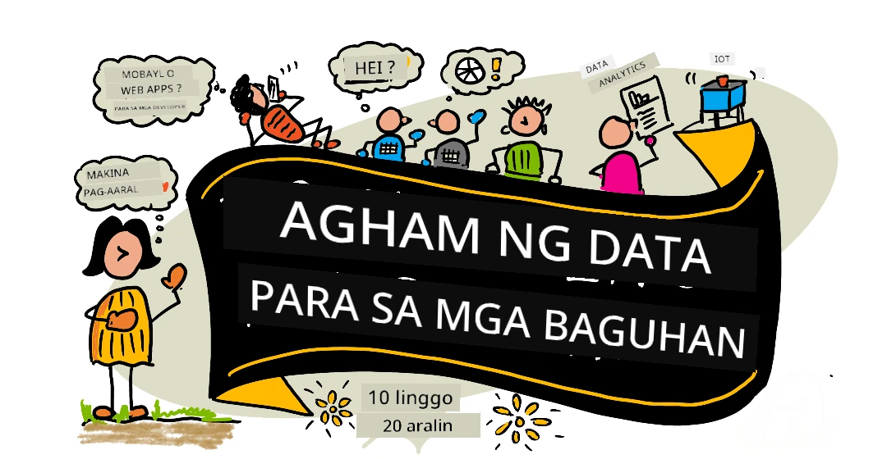
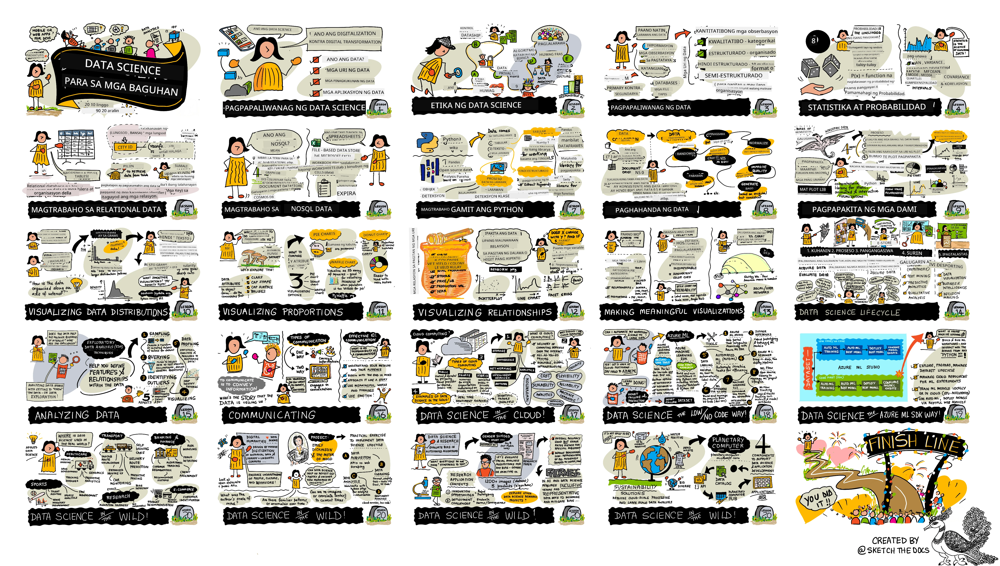

# Data Science para sa mga Nagsisimula - Isang Kurikulum

[](https://github.com/codespaces/new?hide_repo_select=true&ref=main&repo=344191198)

[](https://github.com/microsoft/Data-Science-For-Beginners/blob/master/LICENSE)
[](https://GitHub.com/microsoft/Data-Science-For-Beginners/graphs/contributors/)
[](https://GitHub.com/microsoft/Data-Science-For-Beginners/issues/)
[](https://GitHub.com/microsoft/Data-Science-For-Beginners/pulls/)
[](http://makeapullrequest.com)

[](https://GitHub.com/microsoft/Data-Science-For-Beginners/watchers/)
[](https://GitHub.com/microsoft/Data-Science-For-Beginners/network/)
[](https://GitHub.com/microsoft/Data-Science-For-Beginners/stargazers/)


[](https://discord.gg/nTYy5BXMWG)

[](https://aka.ms/foundry/forum)

Ang Azure Cloud Advocates sa Microsoft ay natutuwa na mag-alok ng isang 10-linggong, 20-leksyon na kurikulum tungkol sa Data Science. Bawat leksyon ay may kasamang pre-lesson at post-lesson quizzes, mga nakasulat na tagubilin para makumpleto ang leksyon, isang solusyon, at isang takdang-aralin. Ang aming project-based na pagtuturo ay nagpapahintulot sa iyo na matuto habang nagtatayo, isang napatunayang paraan para ang mga bagong kasanayan ay manatili.

**Taos-pusong pasasalamat sa aming mga may-akda:** [Jasmine Greenaway](https://www.twitter.com/paladique), [Dmitry Soshnikov](http://soshnikov.com), [Nitya Narasimhan](https://twitter.com/nitya), [Jalen McGee](https://twitter.com/JalenMcG), [Jen Looper](https://twitter.com/jenlooper), [Maud Levy](https://twitter.com/maudstweets), [Tiffany Souterre](https://twitter.com/TiffanySouterre), [Christopher Harrison](https://www.twitter.com/geektrainer).

**🙏 Espesyal na pasasalamat 🙏 sa aming mga [Microsoft Student Ambassador](https://studentambassadors.microsoft.com/) na mga may-akda, tagasuri at mga kontribyutor ng nilalaman,** lalo na sina Aaryan Arora, [Aditya Garg](https://github.com/AdityaGarg00), [Alondra Sanchez](https://www.linkedin.com/in/alondra-sanchez-molina/), [Ankita Singh](https://www.linkedin.com/in/ankitasingh007), [Anupam Mishra](https://www.linkedin.com/in/anupam--mishra/), [Arpita Das](https://www.linkedin.com/in/arpitadas01/), ChhailBihari Dubey, [Dibri Nsofor](https://www.linkedin.com/in/dibrinsofor), [Dishita Bhasin](https://www.linkedin.com/in/dishita-bhasin-7065281bb), [Majd Safi](https://www.linkedin.com/in/majd-s/), [Max Blum](https://www.linkedin.com/in/max-blum-6036a1186/), [Miguel Correa](https://www.linkedin.com/in/miguelmque/), [Mohamma Iftekher (Iftu) Ebne Jalal](https://twitter.com/iftu119), [Nawrin Tabassum](https://www.linkedin.com/in/nawrin-tabassum), [Raymond Wangsa Putra](https://www.linkedin.com/in/raymond-wp/), [Rohit Yadav](https://www.linkedin.com/in/rty2423), Samridhi Sharma, [Sanya Sinha](https://www.linkedin.com/mwlite/in/sanya-sinha-13aab1200),
[Sheena Narula](https://www.linkedin.com/in/sheena-narua-n/), [Tauqeer Ahmad](https://www.linkedin.com/in/tauqeerahmad5201/), Yogendrasingh Pawar , [Vidushi Gupta](https://www.linkedin.com/in/vidushi-gupta07/), [Jasleen Sondhi](https://www.linkedin.com/in/jasleen-sondhi/)

||
|:---:|
| Data Science Para sa mga Nagsisimula - _Sketchnote ni [@nitya](https://twitter.com/nitya)_ |

### 🌐 Suporta sa Maramihang Wika

#### Sinusuportahan sa pamamagitan ng GitHub Action (Automated at Palaging Nai-update)

<!-- CO-OP TRANSLATOR LANGUAGES TABLE START -->
[Arabic](../ar/README.md) | [Bengali](../bn/README.md) | [Bulgarian](../bg/README.md) | [Burmese (Myanmar)](../my/README.md) | [Chinese (Simplified)](../zh-CN/README.md) | [Chinese (Traditional, Hong Kong)](../zh-HK/README.md) | [Chinese (Traditional, Macau)](../zh-MO/README.md) | [Chinese (Traditional, Taiwan)](../zh-TW/README.md) | [Croatian](../hr/README.md) | [Czech](../cs/README.md) | [Danish](../da/README.md) | [Dutch](../nl/README.md) | [Estonian](../et/README.md) | [Finnish](../fi/README.md) | [French](../fr/README.md) | [German](../de/README.md) | [Greek](../el/README.md) | [Hebrew](../he/README.md) | [Hindi](../hi/README.md) | [Hungarian](../hu/README.md) | [Indonesian](../id/README.md) | [Italian](../it/README.md) | [Japanese](../ja/README.md) | [Kannada](../kn/README.md) | [Khmer](../km/README.md) | [Korean](../ko/README.md) | [Lithuanian](../lt/README.md) | [Malay](../ms/README.md) | [Malayalam](../ml/README.md) | [Marathi](../mr/README.md) | [Nepali](../ne/README.md) | [Nigerian Pidgin](../pcm/README.md) | [Norwegian](../no/README.md) | [Persian (Farsi)](../fa/README.md) | [Polish](../pl/README.md) | [Portuguese (Brazil)](../pt-BR/README.md) | [Portuguese (Portugal)](../pt-PT/README.md) | [Punjabi (Gurmukhi)](../pa/README.md) | [Romanian](../ro/README.md) | [Russian](../ru/README.md) | [Serbian (Cyrillic)](../sr/README.md) | [Slovak](../sk/README.md) | [Slovenian](../sl/README.md) | [Spanish](../es/README.md) | [Swahili](../sw/README.md) | [Swedish](../sv/README.md) | [Tagalog (Filipino)](./README.md) | [Tamil](../ta/README.md) | [Telugu](../te/README.md) | [Thai](../th/README.md) | [Turkish](../tr/README.md) | [Ukrainian](../uk/README.md) | [Urdu](../ur/README.md) | [Vietnamese](../vi/README.md)

> **Mas gusto mo bang I-clone Lokal?**
>
> Kasama sa repositoryong ito ang 50+ na mga pagsasalin ng wika na lubos na nagpapalaki sa laki ng pag-download. Para mag-clone nang walang mga pagsasalin, gamitin ang sparse checkout:
>
> **Bash / macOS / Linux:**
> ```bash
> git clone --filter=blob:none --sparse https://github.com/microsoft/Data-Science-For-Beginners.git
> cd Data-Science-For-Beginners
> git sparse-checkout set --no-cone '/*' '!translations' '!translated_images'
> ```
>
> **CMD (Windows):**
> ```cmd
> git clone --filter=blob:none --sparse https://github.com/microsoft/Data-Science-For-Beginners.git
> cd Data-Science-For-Beginners
> git sparse-checkout set --no-cone "/*" "!translations" "!translated_images"
> ```
>
> Binibigyan ka nito ng lahat ng kailangan mo para makumpleto ang kurso nang mas mabilis ang pag-download.
<!-- CO-OP TRANSLATOR LANGUAGES TABLE END -->

**Kung nais mong magkaroon pa ng karagdagang mga suportadong wika ng pagsasalin, nakalista ang mga ito [dito](https://github.com/Azure/co-op-translator/blob/main/getting_started/supported-languages.md)**

#### Sumali sa Aming Komunidad  
[](https://discord.gg/nTYy5BXMWG)

Mayroon kaming Discord learn with AI series na tumatakbo, alamin pa at sumali sa amin sa [Learn with AI Series](https://aka.ms/learnwithai/discord) mula Setyembre 18 - 30, 2025. Makakakuha ka ng mga tips at tricks sa paggamit ng GitHub Copilot para sa Data Science.


# Isa ka bang estudyante?

Magsimula gamit ang mga sumusunod na resources:

- [Student Hub page](https://docs.microsoft.com/en-gb/learn/student-hub?WT.mc_id=academic-77958-bethanycheum) Sa pahinang ito, makikita mo ang mga beginner na resources, Student packs at pati na mga paraan para makakuha ng libreng certificate voucher. Isang pahina ito na nais mong i-bookmark at tingnan paminsan-minsan habang pinapalitan namin ang nilalaman kahit buwan-buwan.
- [Microsoft Learn Student Ambassadors](https://studentambassadors.microsoft.com?WT.mc_id=academic-77958-bethanycheum) Sumali sa isang pandaigdigang komunidad ng mga student ambassador, ito ay maaaring maging iyong daan papasok sa Microsoft.

# Panimula

## 📚 Dokumentasyon

- **[Installation Guide](INSTALLATION.md)** - Hakbang-hakbang na gabay sa pag-set up para sa mga nagsisimula
- **[Usage Guide](USAGE.md)** - Mga halimbawa at karaniwang workflows
- **[Troubleshooting](TROUBLESHOOTING.md)** - Mga solusyon sa mga karaniwang isyu
- **[Contributing Guide](CONTRIBUTING.md)** - Paano mag-ambag sa proyektong ito
- **[Para sa mga Guro](for-teachers.md)** - Gabay sa pagtuturo at mga materyales para sa klase

## 👨‍🎓 Para sa mga Estudyante
> **Mga Ganap na Nagsisimula**: Bago pa sa data science? Magsimula sa aming mga [example na angkop para sa mga nagsisimula](examples/README.md)! Ang mga simpleng halimbawa na ito na may malinaw na komento ay makakatulong sa iyo na maunawaan ang mga pangunahing kaalaman bago magpatuloy sa buong kurikulum.
> **[Mga Estudyante](https://aka.ms/student-page)**: para gamitin ang kurikulum na ito ng mag-isa, i-fork ang buong repo at tapusin ang mga exercises nang mag-isa, simula sa pre-lecture quiz. Pagkatapos basahin ang lektura at kumpletuhin ang mga natitirang gawain. Subukang likhain ang mga proyekto sa pamamagitan ng pag-unawa sa mga leksyon kaysa kopyahin ang solusyon; gayunpaman, ang code na iyon ay makukuha sa mga /solutions na folder sa bawat proyekto-orientated na leksyon. Isa pang ideya ay magbuo ng study group kasama ang mga kaibigan at pag-aralan ang nilalaman nang magkakasama. Para sa karagdagang pag-aaral, inirerekomenda namin ang [Microsoft Learn](https://docs.microsoft.com/en-us/users/jenlooper-2911/collections/qprpajyoy3x0g7?WT.mc_id=academic-77958-bethanycheum).

**Mabilisang Pagsisimula:**
1. Tingnan ang [Installation Guide](INSTALLATION.md) para i-setup ang iyong environment
2. Suriin ang [Usage Guide](USAGE.md) para matutunan kung paano gamitin ang kurikulum
3. Simulan sa Lesson 1 at sundan nang sunod-sunod
4. Sumali sa aming [Discord community](https://aka.ms/ds4beginners/discord) para sa suporta

## 👩‍🏫 Para sa mga Guro
> **Mga Guro**: nag- [include kami ng ilang mungkahi](for-teachers.md) kung paano gamitin ang kurikulum na ito. Nais naming marinig ang inyong puna [sa aming discussion forum](https://github.com/microsoft/Data-Science-For-Beginners/discussions)!

## Kilalanin ang Koponan

[](https://youtu.be/8mzavjQSMM4 "Promo video")

**Gif ni** [Mohit Jaisal](https://www.linkedin.com/in/mohitjaisal)

> 🎥 I-click ang larawan sa itaas para sa isang video tungkol sa proyekto at sa mga taong lumikha nito!

## Pedagohiya

Pinili namin ang dalawang pedagogical tenets habang binubuo ang kurikulum na ito: tiyakin na ito ay proyekto-based at may kasamang madalas na pagsusulit. Sa pagtatapos ng seryeng ito, matututuhan ng mga estudyante ang mga pangunahing prinsipyo ng data science, kabilang ang mga etikal na konsepto, paghahanda ng data, iba't ibang paraan ng pagtatrabaho gamit ang data, visualisasyon ng data, pagsusuri ng data, mga totoong gamit ng data science, at iba pa.

Bilang karagdagan, ang isang mababang-stakes na pagsusulit bago ang klase ay nagtatakda ng intensiyon ng estudyante na matutunan ang isang paksa, habang ang pangalawang pagsusulit pagkatapos ng klase ay nagtitiyak ng mas malalim na pag-alala. Dinisenyo ang kurikulum na ito upang maging flexible at masaya at maaaring kunin nang buo o bahagi. Nagsisimula ang mga proyekto nang maliit at nagiging mas kumplikado sa pagtatapos ng 10 linggong siklo.

> Hanapin ang aming [Code of Conduct](CODE_OF_CONDUCT.md), [Contributing](CONTRIBUTING.md), [Translation](TRANSLATIONS.md) na mga patnubay. Malugod naming tinatanggap ang inyong makabuluhang puna!

## Kasama sa bawat aralin:

- Opsyonal na sketchnote
- Opsyonal na karagdagang video
- Pre-lesson warmup quiz
- Nakasaad na aralin
- Para sa mga proyekto-based na aralin, step-by-step na gabay kung paano buuin ang proyekto
- Knowledge checks
- Isang hamon
- Karagdagang babasahin
- Takdang-aralin
- [Post-lesson quiz](https://ff-quizzes.netlify.app/en/)

> **Tungkol sa mga pagsusulit**: Lahat ng pagsusulit ay nasa folder ng Quiz-App, para sa kabuuang 40 na pagsusulit na may tig-tatlong tanong bawat isa. Nakalink ito mula sa mga aralin, ngunit ang quiz app ay maaaring patakbuhin nang lokal o ideploy sa Azure; sundin ang mga tagubilin sa folder na `quiz-app`. Unti-unti itong nililinang sa lokal na wika.

## 🎓 Mga Halimbawa na Friendly para sa mga Nagsisimula

**Bago sa Data Science?** Nilikha namin ang isang espesyal na [mga direktoryo ng halimbawa](examples/README.md) na may simpleng mga code na may malinaw na paliwanag upang tulungan kang makapagsimula:

- 🌟 **Hello World** - Ang iyong unang data science program
- 📂 **Loading Data** - Matutong magbasa at mag-explore ng mga dataset
- 📊 **Simple Analysis** - Kalkulahin ang mga estadistika at hanapin ang mga pattern
- 📈 **Basic Visualization** - Gumawa ng mga tsart at grap
- 🔬 **Real-World Project** - Kumpletong workflow mula simula hanggang katapusan

Bawat halimbawa ay may detalyadong mga komento na nagpapaliwanag sa bawat hakbang, kaya perfect ito para sa mga ganap na nagsisimula!

👉 **[Magsimula sa mga halimbawa](examples/README.md)** 👈

## Mga Aralin


||
|:---:|
| Data Science For Beginners: Roadmap - _Sketchnote ni [@nitya](https://twitter.com/nitya)_ |


| Numero ng Aralin | Paksa | Pag-grupo ng Aralin | Mga Layunin ng Pagkatuto | Nakalink na Aralin | May-Akda |
| :--------------: | :---------------------------------------: | :------------------------------------------------: | :----------------------------------------------------------------------------------------------------------------------------: | :---------------------------------------------------------: | :------: |
| 01 | Pagpapakahulugan sa Data Science | [Introduction](1-Introduction/README.md) | Matutunan ang mga pangunahing konsepto sa likod ng data science at kung paano ito may kaugnayan sa artificial intelligence, machine learning, at big data. | [lesson](1-Introduction/01-defining-data-science/README.md) [video](https://youtu.be/beZ7Mb_oz9I) | [Dmitry](http://soshnikov.com) |
| 02 | Etika sa Data Science | [Introduction](1-Introduction/README.md) | Mga Konsepto, Hamon & Mga Framework ng Data Ethics. | [lesson](1-Introduction/02-ethics/README.md) | [Nitya](https://twitter.com/nitya) |
| 03 | Pagpapakahulugan sa Data | [Introduction](1-Introduction/README.md) | Paano ikinaklasipika ang data at ang mga karaniwang pinagkukunan nito. | [lesson](1-Introduction/03-defining-data/README.md) | [Jasmine](https://www.twitter.com/paladique) |
| 04 | Panimula sa Estadistika at Probability | [Introduction](1-Introduction/README.md) | Mga matematikal na teknik ng probability at estadistika upang maunawaan ang data. | [lesson](1-Introduction/04-stats-and-probability/README.md) [video](https://youtu.be/Z5Zy85g4Yjw) | [Dmitry](http://soshnikov.com) |
| 05 | Pagtatrabaho gamit ang Relational Data | [Working With Data](2-Working-With-Data/README.md) | Panimula sa relational data at mga batayan ng pag-explore at pagsusuri ng relational data gamit ang Structured Query Language, kilala rin bilang SQL (binibigkas na “see-quell”). | [lesson](2-Working-With-Data/05-relational-databases/README.md) | [Christopher](https://www.twitter.com/geektrainer) | | |
| 06 | Pagtatrabaho gamit ang NoSQL Data | [Working With Data](2-Working-With-Data/README.md) | Panimula sa non-relational data, iba't ibang uri nito at mga batayan ng pag-explore at pagsusuri ng mga document database. | [lesson](2-Working-With-Data/06-non-relational/README.md) | [Jasmine](https://twitter.com/paladique)|
| 07 | Pagtatrabaho gamit ang Python | [Working With Data](2-Working-With-Data/README.md) | Mga batayan ng paggamit ng Python para sa pag-explore ng data gamit ang mga library gaya ng Pandas. Inirerekomenda ang pangunahing pag-unawa sa programming sa Python. | [lesson](2-Working-With-Data/07-python/README.md) [video](https://youtu.be/dZjWOGbsN4Y) | [Dmitry](http://soshnikov.com) |
| 08 | Paghahanda ng Data | [Working With Data](2-Working-With-Data/README.md) | Mga paksa tungkol sa mga teknik sa paglilinis at pagbabago ng data upang hawakan ang mga hamon ng nawawala, mali, o hindi kumpletong data. | [lesson](2-Working-With-Data/08-data-preparation/README.md) | [Jasmine](https://www.twitter.com/paladique) |
| 09 | Pag-visualize ng mga Dami | [Data Visualization](3-Data-Visualization/README.md) | Matutunan kung paano gamitin ang Matplotlib upang i-visualize ang bird data 🦆 | [lesson](3-Data-Visualization/09-visualization-quantities/README.md) | [Jen](https://twitter.com/jenlooper) |
| 10 | Pag-visualize ng Pamamahagi ng Data | [Data Visualization](3-Data-Visualization/README.md) | Pag-visualize ng mga obserbasyon at mga trend sa loob ng isang interval. | [lesson](3-Data-Visualization/10-visualization-distributions/README.md) | [Jen](https://twitter.com/jenlooper) |
| 11 | Pag-visualize ng mga Proporsyon | [Data Visualization](3-Data-Visualization/README.md) | Pag-visualize ng discrete at pinangkat na porsyento. | [lesson](3-Data-Visualization/11-visualization-proportions/README.md) | [Jen](https://twitter.com/jenlooper) |
| 12 | Pag-visualize ng mga Ugnayan | [Data Visualization](3-Data-Visualization/README.md) | Pag-visualize ng mga koneksyon at korelasyon sa pagitan ng mga set ng data at kanilang mga variable. | [lesson](3-Data-Visualization/12-visualization-relationships/README.md) | [Jen](https://twitter.com/jenlooper) |
| 13 | Makabuluhang Mga Visualization | [Data Visualization](3-Data-Visualization/README.md) | Mga teknik at gabay para gawing mahalaga ang iyong mga visualization para sa epektibong paglutas ng problema at pagkuha ng mga kaalaman. | [lesson](3-Data-Visualization/13-meaningful-visualizations/README.md) | [Jen](https://twitter.com/jenlooper) |
| 14 | Panimula sa Lifecycle ng Data Science | [Lifecycle](4-Data-Science-Lifecycle/README.md) | Panimula sa lifecycle ng data science at ang unang hakbang ng pagkuha at pag-extract ng data. | [lesson](4-Data-Science-Lifecycle/14-Introduction/README.md) | [Jasmine](https://twitter.com/paladique) |
| 15 | Pagsusuri | [Lifecycle](4-Data-Science-Lifecycle/README.md) | Ang yugto ng data science lifecycle na ito ay nakatuon sa mga teknik para suriin ang data. | [lesson](4-Data-Science-Lifecycle/15-analyzing/README.md) | [Jasmine](https://twitter.com/paladique) | | |
| 16 | Komunikasyon | [Lifecycle](4-Data-Science-Lifecycle/README.md) | Ang yugto ng data science lifecycle na ito ay nakatuon sa paghahayag ng mga kaalaman mula sa data sa isang paraan upang maging mas madali para sa mga tagagawa ng desisyon na maunawaan. | [lesson](4-Data-Science-Lifecycle/16-communication/README.md) | [Jalen](https://twitter.com/JalenMcG) | | |
| 17 | Data Science sa Cloud | [Cloud Data](5-Data-Science-In-Cloud/README.md) | Ang serye ng mga araling ito ay nagpapakilala ng data science sa cloud at ang mga benepisyo nito. | [lesson](5-Data-Science-In-Cloud/17-Introduction/README.md) | [Tiffany](https://twitter.com/TiffanySouterre) at [Maud](https://twitter.com/maudstweets) |
| 18 | Data Science sa Cloud | [Cloud Data](5-Data-Science-In-Cloud/README.md) | Pagsasanay sa mga modelo gamit ang Low Code tools. |[lesson](5-Data-Science-In-Cloud/18-Low-Code/README.md) | [Tiffany](https://twitter.com/TiffanySouterre) at [Maud](https://twitter.com/maudstweets) |
| 19 | Data Science sa Cloud | [Cloud Data](5-Data-Science-In-Cloud/README.md) | Pag-deploy ng mga modelo gamit ang Azure Machine Learning Studio. | [lesson](5-Data-Science-In-Cloud/19-Azure/README.md)| [Tiffany](https://twitter.com/TiffanySouterre) at [Maud](https://twitter.com/maudstweets) |
| 20 | Data Science sa Aktuwal na Mundo | [In the Wild](6-Data-Science-In-Wild/README.md) | Mga proyektong pinatatakbo ng data science sa totoong mundo. | [lesson](6-Data-Science-In-Wild/20-Real-World-Examples/README.md) | [Nitya](https://twitter.com/nitya) |

## GitHub Codespaces

Sundin ang mga hakbang na ito upang buksan ang sample na ito sa isang Codespace:
1. I-click ang drop-down na menu ng Code at piliin ang Open with Codespaces na opsyon.
2. Piliin ang + New codespace sa ibaba ng pane.
Para sa karagdagang impormasyon, tingnan ang [GitHub documentation](https://docs.github.com/en/codespaces/developing-in-codespaces/creating-a-codespace-for-a-repository#creating-a-codespace).

## VSCode Remote - Containers
Sundin ang mga hakbang na ito upang buksan ang repo na ito sa isang container gamit ang iyong lokal na makina at VSCode gamit ang VS Code Remote - Containers extension:

1. Kung ito ang unang pagkakataon mong gumamit ng development container, siguraduhin na ang iyong sistema ay nakakatugon sa mga kinakailangan (i.e. naka-install ang Docker) sa [getting started documentation](https://code.visualstudio.com/docs/devcontainers/containers#_getting-started).

Para gamitin ang repository na ito, maaari mong buksan ang repository sa isang isolated Docker volume:

**Tandaan**: Sa likod nito, gagamitin nito ang Remote-Containers: **Clone Repository in Container Volume...** command upang i-clone ang source code sa isang Docker volume sa halip na sa lokal na filesystem. Ang [Volumes](https://docs.docker.com/storage/volumes/) ang mas pinipiling mekanismo para mapanatili ang data ng container.

O buksan ang lokal na na-clone o na-download na bersyon ng repository:

- I-clone ang repository na ito sa iyong lokal na filesystem.
- Pindutin ang F1 at piliin ang **Remote-Containers: Open Folder in Container...** na command.
- Piliin ang kinopyang folder, hintayin ang pagsisimula ng container, at subukan.

## Offline access

Maaari mong patakbuhin ang dokumentasyong ito offline gamit ang [Docsify](https://docsify.js.org/#/). I-fork ang repo na ito, [i-install ang Docsify](https://docsify.js.org/#/quickstart) sa iyong lokal na makina, pagkatapos ay sa root folder ng repo na ito, i-type ang `docsify serve`. Ang website ay ise-serve sa port 3000 sa iyong localhost: `localhost:3000`.

> Tandaan, hindi marender ang mga notebooks via Docsify, kaya kapag kailangang patakbuhin ang notebook, gawin ito nang hiwalay sa VS Code gamit ang isang Python kernel.

## Iba pang Kurikulum

Ang aming koponan ay gumagawa ng ibang kurikulum! Tingnan ang:

<!-- CO-OP TRANSLATOR OTHER COURSES START -->
### LangChain
[](https://aka.ms/langchain4j-for-beginners)
[](https://aka.ms/langchainjs-for-beginners?WT.mc_id=m365-94501-dwahlin)
[](https://github.com/microsoft/langchain-for-beginners?WT.mc_id=m365-94501-dwahlin)
---

### Azure / Edge / MCP / Mga Ahente
[](https://github.com/microsoft/AZD-for-beginners?WT.mc_id=academic-105485-koreyst)
[](https://github.com/microsoft/edgeai-for-beginners?WT.mc_id=academic-105485-koreyst)
[](https://github.com/microsoft/mcp-for-beginners?WT.mc_id=academic-105485-koreyst)
[](https://github.com/microsoft/ai-agents-for-beginners?WT.mc_id=academic-105485-koreyst)

---
 
### Generative AI Series
[](https://github.com/microsoft/generative-ai-for-beginners?WT.mc_id=academic-105485-koreyst)
[-9333EA?style=for-the-badge&labelColor=E5E7EB&color=9333EA)](https://github.com/microsoft/Generative-AI-for-beginners-dotnet?WT.mc_id=academic-105485-koreyst)
[-C084FC?style=for-the-badge&labelColor=E5E7EB&color=C084FC)](https://github.com/microsoft/generative-ai-for-beginners-java?WT.mc_id=academic-105485-koreyst)
[-E879F9?style=for-the-badge&labelColor=E5E7EB&color=E879F9)](https://github.com/microsoft/generative-ai-with-javascript?WT.mc_id=academic-105485-koreyst)

---
 
### Pangunahing Pagkatuto
[](https://aka.ms/ml-beginners?WT.mc_id=academic-105485-koreyst)
[](https://aka.ms/datascience-beginners?WT.mc_id=academic-105485-koreyst)
[](https://aka.ms/ai-beginners?WT.mc_id=academic-105485-koreyst)
[](https://github.com/microsoft/Security-101?WT.mc_id=academic-96948-sayoung)
[](https://aka.ms/webdev-beginners?WT.mc_id=academic-105485-koreyst)
[](https://aka.ms/iot-beginners?WT.mc_id=academic-105485-koreyst)
[](https://github.com/microsoft/xr-development-for-beginners?WT.mc_id=academic-105485-koreyst)

---
 
### Copilot Series
[](https://aka.ms/GitHubCopilotAI?WT.mc_id=academic-105485-koreyst)
[](https://github.com/microsoft/mastering-github-copilot-for-dotnet-csharp-developers?WT.mc_id=academic-105485-koreyst)
[](https://github.com/microsoft/CopilotAdventures?WT.mc_id=academic-105485-koreyst)
<!-- CO-OP TRANSLATOR OTHER COURSES END -->

## Pagkuha ng Tulong

**May mga problema ba?** Tingnan ang aming [Troubleshooting Guide](TROUBLESHOOTING.md) para sa mga solusyon sa mga karaniwang problema.

Kung ikaw ay nahihirapan o may mga tanong tungkol sa paggawa ng AI apps. Sumali sa mga kapwa nag-aaral at mga bihasang developer sa mga talakayan tungkol sa MCP. Ito ay isang suportadong komunidad kung saan malugod ang mga tanong at malaya ang pagbabahagi ng kaalaman.

[](https://discord.gg/nTYy5BXMWG)

Kung mayroon kang feedback sa produkto o mga error habang nagde-develop, bisitahin ang:

[](https://aka.ms/foundry/forum)

---

<!-- CO-OP TRANSLATOR DISCLAIMER START -->
**Paunawa**:  
Ang dokumentong ito ay naisalin gamit ang AI translation service na [Co-op Translator](https://github.com/Azure/co-op-translator). Bagamat aming pinagsisikapang maging tumpak, pakatandaan na ang mga awtomatikong pagsasalin ay maaaring maglaman ng mga pagkakamali o hindi pagkakatugma. Ang orihinal na dokumento sa kanyang orihinal na wika ang dapat ituring na pangunahing sanggunian. Para sa mahahalagang impormasyon, inirerekomenda ang propesyonal na pagsasalin ng tao. Hindi kami mananagot sa anumang hindi pagkakaunawaan o maling interpretasyon na nagmumula sa paggamit ng pagsasaling ito.
<!-- CO-OP TRANSLATOR DISCLAIMER END -->