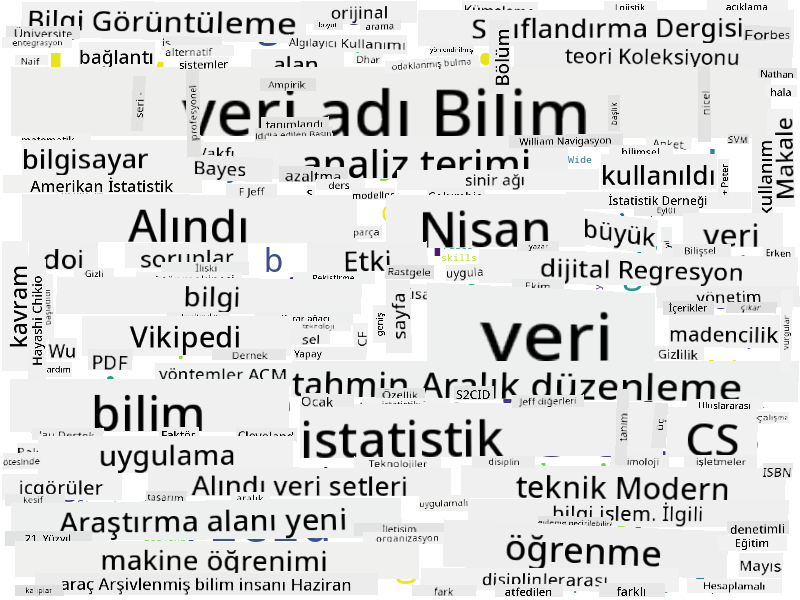

<!--
CO_OP_TRANSLATOR_METADATA:
{
  "original_hash": "8141e7195841682914be03ef930fe43d",
  "translation_date": "2025-09-03T20:15:25+00:00",
  "source_file": "1-Introduction/01-defining-data-science/README.md",
  "language_code": "tr"
}
-->
## Veri Türleri

Daha önce de belirttiğimiz gibi, veri her yerde. Sadece doğru şekilde yakalamamız gerekiyor! Veriyi **yapılandırılmış** ve **yapılandırılmamış** olarak ayırt etmek faydalıdır. Yapılandırılmış veri genellikle iyi organize edilmiş bir formda, genellikle bir tablo veya birden fazla tablo olarak temsil edilirken, yapılandırılmamış veri sadece bir dosya koleksiyonudur. Bazen, büyük ölçüde değişebilen bir yapıya sahip olan **yarı yapılandırılmış** verilerden de bahsedebiliriz.

| Yapılandırılmış                                                             | Yarı Yapılandırılmış                                                                          | Yapılandırılmamış                     |
| -------------------------------------------------------------------------- | ------------------------------------------------------------------------------------------- | ------------------------------------- |
| İnsanların telefon numaralarıyla birlikte listesi                          | Bağlantılar içeren Wikipedia sayfaları                                                      | Encyclopedia Britannica'nın metni     |
| Son 20 yılda bir binanın tüm odalarındaki her dakika sıcaklık ölçümleri    | Yazarlar, yayın tarihi ve özet bilgileriyle JSON formatında bilimsel makaleler koleksiyonu  | Kurumsal belgelerle dolu bir dosya paylaşımı |
| Binaya giren tüm insanların yaş ve cinsiyet bilgileri                      | İnternet sayfaları                                                                          | Gözetim kamerasından gelen ham video akışı |

## Veri Nereden Bulunur?

Veri elde edilebilecek birçok kaynak vardır ve hepsini listelemek imkansızdır! Ancak, bazı tipik veri kaynaklarını belirtelim:

* **Yapılandırılmış**
  - **Nesnelerin İnterneti** (IoT), sıcaklık veya basınç sensörleri gibi çeşitli sensörlerden gelen veriler dahil, birçok faydalı veri sağlar. Örneğin, bir ofis binası IoT sensörleriyle donatılmışsa, ısıtma ve aydınlatmayı otomatik olarak kontrol ederek maliyetleri minimize edebiliriz.
  - **Anketler**, kullanıcıların bir satın alma işleminden veya bir web sitesini ziyaret ettikten sonra doldurmasını istediğimiz formlar.
  - **Davranış analizi**, örneğin, bir kullanıcının bir siteyi ne kadar derinlemesine incelediğini ve siteyi terk etme nedenlerini anlamamıza yardımcı olabilir.
* **Yapılandırılmamış**
  - **Metinler**, genel bir **duygu skoru** veya anahtar kelimeler ve anlamsal anlam çıkarma gibi zengin içgörüler sağlayabilir.
  - **Görseller** veya **Videolar**. Bir gözetim kamerasından alınan video, yoldaki trafiği tahmin etmek ve olası trafik sıkışıklıkları hakkında insanları bilgilendirmek için kullanılabilir.
  - Web sunucusu **Günlükleri**, sitemizin en sık ziyaret edilen sayfalarını ve bu sayfalarda ne kadar süre kalındığını anlamak için kullanılabilir.
* **Yarı Yapılandırılmış**
  - **Sosyal Ağ** grafikleri, kullanıcı kişilikleri ve bilgilerin yayılma potansiyeli hakkında harika veri kaynakları olabilir.
  - Bir partiden elde edilen bir grup fotoğrafı, insanlar arasındaki **Grup Dinamikleri** verilerini, birbirleriyle fotoğraf çektiren kişilerin bir grafiğini oluşturarak çıkarabilir.

Farklı veri kaynaklarını bilerek, veri bilimi tekniklerinin hangi senaryolarda uygulanabileceğini, durumu daha iyi anlamak ve iş süreçlerini iyileştirmek için düşünebilirsiniz.

## Verilerle Neler Yapabilirsiniz?

Veri Bilimi'nde, veri yolculuğunun şu adımlarına odaklanırız:

Tabii ki, mevcut verilere bağlı olarak bazı adımlar atlanabilir (örneğin, veriler zaten bir veritabanında mevcutsa veya model eğitimi gerekmiyorsa), ya da bazı adımlar birkaç kez tekrarlanabilir (örneğin, veri işleme gibi).

## Dijitalleşme ve Dijital Dönüşüm

Son on yılda, birçok işletme iş kararları alırken verinin önemini anlamaya başladı. Veri bilimi ilkelerini bir işletmeyi yönetmek için uygulamak istiyorsanız, önce bazı veriler toplamanız, yani iş süreçlerini dijital forma çevirmeniz gerekir. Bu, **dijitalleşme** olarak bilinir. Bu verilere veri bilimi tekniklerini uygulayarak kararları yönlendirmek, üretkenlikte önemli artışlara (hatta iş modelinde değişimlere) yol açabilir ve bu da **dijital dönüşüm** olarak adlandırılır.

Bir örnek düşünelim. Diyelim ki, öğrenciler için çevrimiçi olarak sunduğumuz bir veri bilimi kursumuz var (tıpkı bu kurs gibi) ve bunu geliştirmek için veri bilimi kullanmak istiyoruz. Bunu nasıl yapabiliriz?

"Ne dijitalleştirilebilir?" sorusuyla başlayabiliriz. En basit yol, her öğrencinin her modülü tamamlaması için geçen süreyi ölçmek ve her modülün sonunda çoktan seçmeli bir testle elde edilen bilgiyi ölçmek olabilir. Tüm öğrenciler arasında tamamlanma süresini ortalayarak, öğrenciler için en zorlayıcı olan modülleri bulabilir ve bunları basitleştirmek için çalışabiliriz.
Bu yaklaşımın ideal olmadığını savunabilirsiniz, çünkü modüller farklı uzunluklarda olabilir. Zamanı modülün uzunluğuna (karakter sayısına göre) bölmek ve bu değerleri karşılaştırmak muhtemelen daha adil bir yöntem olacaktır.
Çoktan seçmeli testlerin sonuçlarını analiz etmeye başladığımızda, öğrencilerin anlamakta zorlandığı kavramları belirlemeye çalışabilir ve bu bilgiyi içeriği geliştirmek için kullanabiliriz. Bunu yapmak için, her sorunun belirli bir kavram veya bilgi parçasına karşılık gelecek şekilde testler tasarlamamız gerekir.

Daha karmaşık bir analiz yapmak istersek, her modül için harcanan zamanı öğrencilerin yaş kategorilerine göre karşılaştırabiliriz. Bazı yaş kategorileri için modülü tamamlamak çok uzun zaman alıyor olabilir ya da öğrenciler modülü tamamlamadan bırakıyor olabilir. Bu, modül için yaş önerileri sunmamıza ve yanlış beklentilerden kaynaklanan memnuniyetsizliği en aza indirmemize yardımcı olabilir.

## 🚀 Zorluk

Bu zorlukta, metinlere bakarak Veri Bilimi alanıyla ilgili kavramları bulmaya çalışacağız. Veri Bilimi ile ilgili bir Wikipedia makalesi alacağız, metni indirecek ve işleyeceğiz, ardından aşağıdaki gibi bir kelime bulutu oluşturacağız:

Kodları incelemek için [`notebook.ipynb`](../../../../../../../../../1-Introduction/01-defining-data-science/notebook.ipynb ':ignore') dosyasını ziyaret edin. Kodları çalıştırabilir ve tüm veri dönüşümlerinin gerçek zamanlı olarak nasıl gerçekleştirildiğini görebilirsiniz.

> Jupyter Notebook'ta kod çalıştırmayı bilmiyorsanız, [bu makaleye](https://soshnikov.com/education/how-to-execute-notebooks-from-github/) göz atabilirsiniz.

## [Ders sonrası quiz](https://ff-quizzes.netlify.app/en/ds/)

## Ödevler

* **Görev 1**: Yukarıdaki kodu değiştirerek **Büyük Veri** ve **Makine Öğrenimi** alanlarıyla ilgili kavramları bulun.
* **Görev 2**: [Veri Bilimi Senaryolarını Düşünün](assignment.md)

## Katkılar

Bu ders, [Dmitry Soshnikov](http://soshnikov.com) tarafından ♥️ ile hazırlanmıştır.

---

**Feragatname**:  
Bu belge, AI çeviri hizmeti [Co-op Translator](https://github.com/Azure/co-op-translator) kullanılarak çevrilmiştir. Doğruluk için çaba göstersek de, otomatik çevirilerin hata veya yanlışlık içerebileceğini lütfen unutmayın. Belgenin orijinal dili, yetkili kaynak olarak kabul edilmelidir. Kritik bilgiler için profesyonel insan çevirisi önerilir. Bu çevirinin kullanımından kaynaklanan yanlış anlamalar veya yanlış yorumlamalardan sorumlu değiliz.