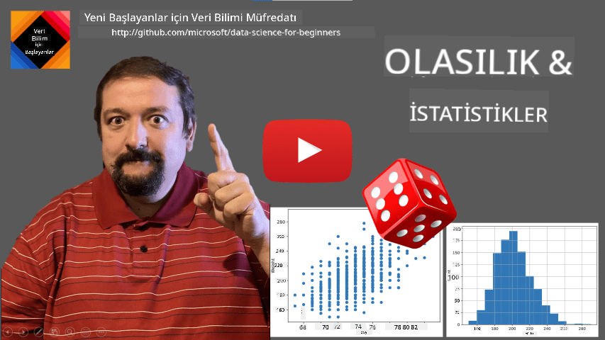
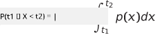
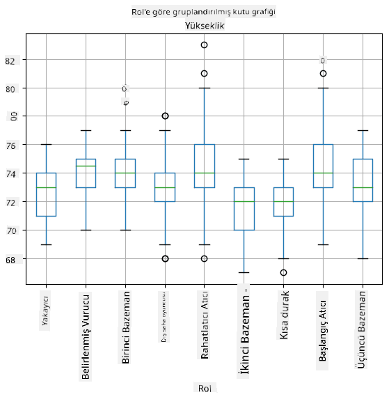
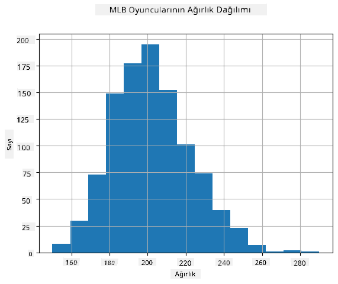
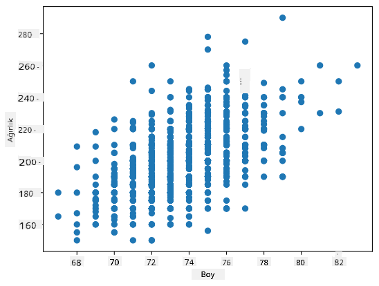

<!--
CO_OP_TRANSLATOR_METADATA:
{
  "original_hash": "b706a07cfa87ba091cbb91e0aa775600",
  "translation_date": "2025-08-28T11:20:03+00:00",
  "source_file": "1-Introduction/04-stats-and-probability/README.md",
  "language_code": "tr"
}
-->
# İstatistik ve Olasılığa Kısa Bir Giriş

| ](../../sketchnotes/04-Statistics-Probability.png)|
|:---:|
| İstatistik ve Olasılık - _Sketchnote by [@nitya](https://twitter.com/nitya)_ |

İstatistik ve Olasılık Teorisi, Matematiğin birbiriyle yakından ilişkili ve Veri Bilimi açısından oldukça önemli iki alanıdır. Matematik hakkında derin bir bilgiye sahip olmadan veriyle çalışmak mümkün olsa da, en azından bazı temel kavramları bilmek her zaman daha iyidir. Burada, başlangıç yapmanıza yardımcı olacak kısa bir giriş sunacağız.

[](https://youtu.be/Z5Zy85g4Yjw)

## [Ders Öncesi Test](https://purple-hill-04aebfb03.1.azurestaticapps.net/quiz/6)

## Olasılık ve Rastgele Değişkenler

**Olasılık**, bir **olayın** ne kadar olası olduğunu ifade eden 0 ile 1 arasında bir sayıdır. Pozitif sonuçların (olaya yol açan sonuçlar) sayısının, tüm sonuçların toplamına bölünmesiyle tanımlanır; burada tüm sonuçların eşit olasılıkla gerçekleştiği varsayılır. Örneğin, bir zar attığımızda, çift bir sayı gelme olasılığı 3/6 = 0.5'tir.

Olaylardan bahsederken **rastgele değişkenler** kullanırız. Örneğin, bir zar attığımızda elde edilen sayıyı temsil eden rastgele değişken, 1 ile 6 arasında değerler alır. 1'den 6'ya kadar olan sayı kümesine **örnek uzayı** denir. Rastgele bir değişkenin belirli bir değeri alma olasılığından bahsedebiliriz, örneğin P(X=3)=1/6.

Önceki örnekteki rastgele değişken **ayrık** olarak adlandırılır, çünkü sayılabilir bir örnek uzayına sahiptir, yani ayrı ayrı sıralanabilen değerler vardır. Örnek uzayının gerçek sayıların bir aralığı veya tüm gerçek sayı kümesi olduğu durumlar da vardır. Bu tür değişkenlere **sürekli** denir. İyi bir örnek, otobüsün varış zamanı olabilir.

## Olasılık Dağılımı

Ayrık rastgele değişkenler durumunda, her olayın olasılığını P(X) fonksiyonu ile tanımlamak kolaydır. Örnek uzayı *S*'den her bir değer *s* için, 0 ile 1 arasında bir sayı verir ve tüm olaylar için P(X=s) değerlerinin toplamı 1 olur.

En bilinen ayrık dağılım **uniform dağılım**dır; burada N elemanlı bir örnek uzayı vardır ve her bir elemanın olasılığı 1/N'dir.

Sürekli bir değişkenin olasılık dağılımını tanımlamak daha zordur; bu değişkenin değerleri [a,b] aralığından veya tüm gerçek sayı kümesinden ℝ alınır. Örneğin, otobüsün varış zamanını ele alalım. Aslında, belirli bir varış zamanı *t* için, otobüsün tam olarak o anda varma olasılığı 0'dır!

> Şimdi biliyorsunuz ki olasılığı 0 olan olaylar gerçekleşir ve oldukça sık! En azından her otobüs geldiğinde!

Sadece bir değişkenin belirli bir değer aralığına düşme olasılığından bahsedebiliriz, örneğin P(t<sub>1</sub>≤X<t<sub>2</sub>). Bu durumda, olasılık dağılımı **olasılık yoğunluk fonksiyonu** p(x) ile tanımlanır, şöyle ki:



Uniform dağılımın sürekli analoğu **sürekli uniform** olarak adlandırılır ve sonlu bir aralıkta tanımlanır. X'in uzunluğu l olan bir aralığa düşme olasılığı l ile orantılıdır ve 1'e kadar yükselir.

Bir diğer önemli dağılım **normal dağılım**dır ve aşağıda daha ayrıntılı olarak ele alacağız.

## Ortalama, Varyans ve Standart Sapma

Bir rastgele değişken X'in n örneğini alalım: x<sub>1</sub>, x<sub>2</sub>, ..., x<sub>n</sub>. **Ortalama** (veya **aritmetik ortalama**) değeri, geleneksel şekilde (x<sub>1</sub>+x<sub>2</sub>+x<sub>n</sub>)/n olarak tanımlanabilir. Örnek boyutunu büyüttükçe (yani n→∞ limiti alındığında), dağılımın ortalamasını (aynı zamanda **beklenti** olarak adlandırılır) elde ederiz. Beklentiyi **E**(x) ile göstereceğiz.

> Herhangi bir ayrık dağılım için, {x<sub>1</sub>, x<sub>2</sub>, ..., x<sub>N</sub>} değerleri ve bunlara karşılık gelen p<sub>1</sub>, p<sub>2</sub>, ..., p<sub>N</sub> olasılıkları ile, beklenti E(X)=x<sub>1</sub>p<sub>1</sub>+x<sub>2</sub>p<sub>2</sub>+...+x<sub>N</sub>p<sub>N</sub> eşitliğine ulaşılır.

Değerlerin ne kadar yayıldığını belirlemek için varyansı hesaplayabiliriz: σ<sup>2</sup> = ∑(x<sub>i</sub> - μ)<sup>2</sup>/n, burada μ dizinin ortalamasıdır. σ değeri **standart sapma**, σ<sup>2</sup> ise **varyans** olarak adlandırılır.

## Mod, Medyan ve Çeyrekler

Bazen ortalama, veriler için "tipik" değeri yeterince temsil etmez. Örneğin, birkaç aşırı değer tamamen aralık dışındaysa, bunlar ortalamayı etkileyebilir. Bir diğer iyi gösterge **medyan**dır; bu, veri noktalarının yarısının altında, diğer yarısının ise üstünde olduğu bir değerdir.

Veri dağılımını anlamamıza yardımcı olmak için **çeyreklerden** bahsetmek faydalıdır:

* Birinci çeyrek, veya Q1, verilerin %25'inin altında olduğu bir değerdir
* Üçüncü çeyrek, veya Q3, verilerin %75'inin altında olduğu bir değerdir

Medyan ve çeyrekler arasındaki ilişkiyi grafiksel olarak **kutu grafiği** adı verilen bir diyagramda gösterebiliriz:


Burada ayrıca **çeyrekler arası aralık** IQR=Q3-Q1 ve **aykırı değerler** - [Q1-1.5*IQR,Q3+1.5*IQR] sınırlarının dışında kalan değerler - hesaplanır.

Olası değerlerin küçük bir sayıda olduğu sonlu bir dağılım için, en sık görülen "tipik" değer, **mod** olarak adlandırılır. Mod genellikle kategorik verilere uygulanır, örneğin renklere. İki grup insan olduğunu düşünün - biri kırmızıyı, diğeri maviyi güçlü bir şekilde tercih ediyor. Renkleri sayılarla kodlarsak, favori renk için ortalama değer turuncu-yeşil spektrumunda bir yerde olur, bu da hiçbir grubun gerçek tercihini göstermez. Ancak mod, ya renklerden biri ya da her iki renk olur; eğer bu renklere oy veren kişi sayısı eşitse (bu durumda örnek **çok modlu** olarak adlandırılır).

## Gerçek Dünya Verileri

Gerçek hayattan veri analiz ettiğimizde, bu veriler tam anlamıyla rastgele değişkenler olmayabilir; yani bilinmeyen sonuçlarla deneyler yapmayız. Örneğin, bir beyzbol oyuncusu takımını ve onların boy, kilo ve yaş gibi vücut verilerini düşünün. Bu sayılar tam olarak rastgele olmasa da, yine de aynı matematiksel kavramları uygulayabiliriz. Örneğin, insanların kilolarının bir dizisi, bir rastgele değişkenden alınan değerler dizisi olarak düşünülebilir. Aşağıda [Major League Baseball](http://mlb.mlb.com/index.jsp) oyuncularının [bu veri setinden](http://wiki.stat.ucla.edu/socr/index.php/SOCR_Data_MLB_HeightsWeights) alınan gerçek kilolarının dizisi verilmiştir (sadece ilk 20 değer gösterilmiştir):

```
[180.0, 215.0, 210.0, 210.0, 188.0, 176.0, 209.0, 200.0, 231.0, 180.0, 188.0, 180.0, 185.0, 160.0, 180.0, 185.0, 197.0, 189.0, 185.0, 219.0]
```

> **Not**: Bu veri setiyle çalışma örneğini görmek için [ilgili notebook](notebook.ipynb)'a göz atabilirsiniz. Bu ders boyunca bir dizi zorluk da bulunmaktadır ve bu notebook'a biraz kod ekleyerek tamamlayabilirsiniz. Veriler üzerinde nasıl işlem yapacağınızı bilmiyorsanız endişelenmeyin - Python kullanarak veri üzerinde çalışmaya daha sonra geri döneceğiz. Jupyter Notebook'ta kod çalıştırmayı bilmiyorsanız, [bu makaleye](https://soshnikov.com/education/how-to-execute-notebooks-from-github/) göz atabilirsiniz.

İşte verilerimiz için ortalama, medyan ve çeyrekleri gösteren kutu grafiği:


Verilerimiz farklı oyuncu **rolleri** hakkında bilgi içerdiğinden, rollere göre kutu grafiği de yapabiliriz - bu, parametre değerlerinin roller arasında nasıl farklılık gösterdiği hakkında fikir edinmemizi sağlar. Bu sefer boyu ele alacağız:



Bu diyagram, ortalama olarak birinci baz oyuncularının boyunun ikinci baz oyuncularının boyundan daha yüksek olduğunu göstermektedir. Bu dersin ilerleyen bölümlerinde bu hipotezi daha resmi bir şekilde nasıl test edebileceğimizi ve verilerimizin bu durumu göstermek için istatistiksel olarak anlamlı olduğunu nasıl kanıtlayabileceğimizi öğreneceğiz.

> Gerçek dünya verileriyle çalışırken, tüm veri noktalarının bir olasılık dağılımından alınan örnekler olduğunu varsayarız. Bu varsayım, makine öğrenimi tekniklerini uygulamamıza ve çalışan tahmin modelleri oluşturmamıza olanak tanır.

Verilerimizin dağılımını görmek için **histogram** adı verilen bir grafik çizebiliriz. X ekseni, farklı kilo aralıklarını (sözde **binler**) içerir ve dikey eksen, rastgele değişken örneğimizin belirli bir aralıkta olduğu zamanların sayısını gösterir.



Bu histogramdan, tüm değerlerin belirli bir ortalama kilonun etrafında toplandığını ve bu kilodan uzaklaştıkça, o değerdeki kiloların daha az sıklıkla karşılaşıldığını görebilirsiniz. Yani, bir beyzbol oyuncusunun kilosunun ortalama kilodan çok farklı olması oldukça olasılık dışıdır. Kiloların varyansı, kiloların ortalamadan ne kadar farklı olma olasılığını gösterir.

> Eğer beyzbol liginden olmayan diğer insanların kilolarını alırsak, dağılım muhtemelen farklı olacaktır. Ancak, dağılımın şekli aynı kalacak, sadece ortalama ve varyans değişecektir. Bu nedenle, modelimizi beyzbol oyuncuları üzerinde eğitirsek, üniversite öğrencilerine uygulandığında yanlış sonuçlar vermesi muhtemeldir, çünkü temel dağılım farklıdır.

## Normal Dağılım

Yukarıda gördüğümüz kilo dağılımı oldukça tipiktir ve gerçek dünyadan birçok ölçüm aynı türde bir dağılımı takip eder, ancak farklı ortalama ve varyanslarla. Bu dağılıma **normal dağılım** denir ve istatistikte çok önemli bir rol oynar.

Normal dağılım kullanmak, potansiyel beyzbol oyuncularının rastgele kilolarını üretmenin doğru bir yoludur. Ortalama kilo `mean` ve standart sapma `std` değerlerini bildiğimizde, 1000 kilo örneği şu şekilde üretebiliriz:
```python
samples = np.random.normal(mean,std,1000)
``` 

Üretilen örneklerin histogramını çizersek, yukarıda gösterilen resme çok benzeyen bir görüntü görürüz. Örnek sayısını ve bin sayısını artırırsak, ideal bir normal dağılıma daha yakın bir görüntü oluşturabiliriz:


*Ortalama=0 ve std.dev=1 ile Normal Dağılım*

## Güven Aralıkları

Beyzbol oyuncularının kilolarından bahsederken, tüm beyzbol oyuncularının kilolarının ideal olasılık dağılımına karşılık gelen **rastgele değişken W** olduğunu varsayarız (sözde **popülasyon**). Kilo dizimiz, tüm beyzbol oyuncularının bir alt kümesine karşılık gelir ve buna **örneklem** deriz. İlginç bir soru şu: W'nin dağılım parametrelerini, yani popülasyonun ortalama ve varyansını bilebilir miyiz?

En kolay cevap, örneklemimizin ortalama ve varyansını hesaplamak olacaktır. Ancak, rastgele örneklemimizin tüm popülasyonu doğru bir şekilde temsil etmediği durumlar olabilir. Bu nedenle **güven aralığı** hakkında konuşmak mantıklıdır.
> **Güven aralığı**, örneklemimize dayanarak popülasyonun gerçek ortalamasını belirli bir olasılıkla (veya **güven düzeyi**) doğru bir şekilde tahmin etme yöntemidir.
Varsayalım ki dağılımımızdan X<sub>1</sub>, ..., X<sub>n</sub> örneklerini aldık. Dağılımımızdan her örnek aldığımızda, farklı bir ortalama değer μ elde ederiz. Bu nedenle μ bir rastgele değişken olarak düşünülebilir. Güven olasılığı p olan bir **güven aralığı**, (L<sub>p</sub>,R<sub>p</sub>) şeklinde bir değer çiftidir ve **P**(L<sub>p</sub>≤μ≤R<sub>p</sub>) = p, yani ölçülen ortalama değerin bu aralık içinde yer alma olasılığı p'ye eşittir.

Bu güven aralıklarının nasıl hesaplandığını detaylı bir şekilde tartışmak, kısa girişimizin ötesine geçer. Daha fazla detayı [Wikipedia'da](https://en.wikipedia.org/wiki/Confidence_interval) bulabilirsiniz. Kısaca, popülasyonun gerçek ortalamasına göre hesaplanan örnek ortalamasının dağılımını tanımlarız; bu dağılıma **student dağılımı** denir.

> **İlginç bir bilgi**: Student dağılımı, matematikçi William Sealy Gosset'in takma adı "Student" ile yayınladığı makalesinden adını almıştır. Gosset, Guinness bira fabrikasında çalışıyordu ve bir versiyona göre, işvereni, ham maddelerin kalitesini belirlemek için istatistiksel testler kullandıklarını kamuoyunun bilmesini istemiyordu.

Popülasyonumuzun ortalaması μ'yü güven olasılığı p ile tahmin etmek istiyorsak, bir Student dağılımı A'nın *(1-p)/2'nci yüzdelik dilimini* almamız gerekir. Bu değer tablolar aracılığıyla veya istatistiksel yazılımların (örneğin Python, R, vb.) yerleşik fonksiyonları kullanılarak hesaplanabilir. Daha sonra μ için aralık X±A*D/√n şeklinde olur; burada X örnekten elde edilen ortalama, D standart sapmadır.

> **Not**: Student dağılımıyla ilgili önemli bir kavram olan [serbestlik dereceleri](https://en.wikipedia.org/wiki/Degrees_of_freedom_(statistics)) tartışmasını da atlıyoruz. Bu kavramı daha derinlemesine anlamak için istatistik üzerine daha kapsamlı kitaplara başvurabilirsiniz.

Ağırlıklar ve boylar için güven aralığı hesaplama örneği [eşlik eden not defterinde](notebook.ipynb) verilmiştir.

| p    | Ağırlık ortalaması |
|------|--------------------|
| 0.85 | 201.73±0.94       |
| 0.90 | 201.73±1.08       |
| 0.95 | 201.73±1.28       |

Dikkat edin, güven olasılığı arttıkça güven aralığı genişler.

## Hipotez Testi

Beyzbol oyuncuları veri setimizde farklı oyuncu rolleri bulunmaktadır. Bu roller aşağıda özetlenmiştir (bu tablonun nasıl hesaplandığını görmek için [eşlik eden not defterine](notebook.ipynb) bakın):

| Rol               | Boy       | Ağırlık   | Sayı  |
|-------------------|-----------|-----------|-------|
| Catcher          | 72.723684 | 204.328947 | 76    |
| Designated_Hitter | 74.222222 | 220.888889 | 18    |
| First_Baseman     | 74.000000 | 213.109091 | 55    |
| Outfielder        | 73.010309 | 199.113402 | 194   |
| Relief_Pitcher    | 74.374603 | 203.517460 | 315   |
| Second_Baseman    | 71.362069 | 184.344828 | 58    |
| Shortstop         | 71.903846 | 182.923077 | 52    |
| Starting_Pitcher  | 74.719457 | 205.163636 | 221   |
| Third_Baseman     | 73.044444 | 200.955556 | 45    |

İlk kalecilerin ortalama boylarının ikinci kalecilerinkinden daha yüksek olduğunu fark edebiliriz. Bu nedenle, **ilk kaleciler ikinci kalecilerden daha uzundur** sonucuna varabiliriz.

> Bu ifade **bir hipotez** olarak adlandırılır, çünkü bu durumun gerçekten doğru olup olmadığını bilmiyoruz.

Ancak, bu sonuca varmanın her zaman açık bir yolu yoktur. Yukarıdaki tartışmadan, her ortalamanın bir güven aralığına sahip olduğunu ve bu farkın sadece istatistiksel bir hata olabileceğini biliyoruz. Hipotezimizi test etmek için daha resmi bir yönteme ihtiyacımız var.

İlk ve ikinci kalecilerin boyları için güven aralıklarını ayrı ayrı hesaplayalım:

| Güven     | İlk Kaleciler | İkinci Kaleciler |
|-----------|---------------|------------------|
| 0.85      | 73.62..74.38  | 71.04..71.69     |
| 0.90      | 73.56..74.44  | 70.99..71.73     |
| 0.95      | 73.47..74.53  | 70.92..71.81     |

Hiçbir güven olasılığında aralıkların örtüşmediğini görebiliriz. Bu, ilk kalecilerin ikinci kalecilerden daha uzun olduğu hipotezimizi kanıtlar.

Daha resmi olarak, çözmeye çalıştığımız problem, **iki olasılık dağılımının aynı olup olmadığını** veya en azından aynı parametrelere sahip olup olmadığını görmektir. Dağılıma bağlı olarak, bunun için farklı testler kullanmamız gerekir. Dağılımlarımızın normal olduğunu biliyorsak, **[Student t-testi](https://en.wikipedia.org/wiki/Student%27s_t-test)** uygulayabiliriz.

Student t-testinde, varyansı dikkate alarak ortalamalar arasındaki farkı gösteren **t-değeri** hesaplanır. T-değerinin **student dağılımını** takip ettiği gösterilmiştir, bu da bize belirli bir güven seviyesi **p** için eşik değerini verir (bu hesaplanabilir veya sayısal tablolardan bulunabilir). Daha sonra hipotezi onaylamak veya reddetmek için t-değerini bu eşikle karşılaştırırız.

Python'da, `ttest_ind` fonksiyonunu içeren **SciPy** paketini kullanabiliriz (diğer birçok faydalı istatistiksel fonksiyonun yanı sıra!). Bu fonksiyon bizim için t-değerini hesaplar ve ayrıca güven p-değerinin tersine bakar, böylece sadece güven seviyesine bakarak sonuca varabiliriz.

Örneğin, ilk ve ikinci kalecilerin boyları arasındaki karşılaştırmamız bize şu sonuçları verir:
```python
from scipy.stats import ttest_ind

tval, pval = ttest_ind(df.loc[df['Role']=='First_Baseman',['Height']], df.loc[df['Role']=='Designated_Hitter',['Height']],equal_var=False)
print(f"T-value = {tval[0]:.2f}\nP-value: {pval[0]}")
```
```
T-value = 7.65
P-value: 9.137321189738925e-12
```
Bizim durumumuzda, p-değeri oldukça düşük, bu da ilk kalecilerin daha uzun olduğuna dair güçlü bir kanıt olduğunu gösterir.

Test etmek isteyebileceğimiz diğer hipotez türleri de vardır, örneğin:
* Belirli bir örneğin bir dağılıma uyduğunu kanıtlamak. Bizim durumumuzda boyların normal dağıldığını varsaydık, ancak bu resmi istatistiksel doğrulama gerektirir.
* Bir örnek ortalamasının önceden tanımlanmış bir değere karşılık geldiğini kanıtlamak
* Birden fazla örneğin ortalamalarını karşılaştırmak (örneğin, farklı yaş gruplarındaki mutluluk seviyeleri arasındaki fark nedir)

## Büyük Sayılar Yasası ve Merkezi Limit Teoremi

Normal dağılımın neden bu kadar önemli olduğunun nedenlerinden biri, **merkezi limit teoremi** olarak adlandırılır. Bağımsız N değeri X<sub>1</sub>, ..., X<sub>N</sub> içeren büyük bir örnek aldığımızı varsayalım; bu değerler herhangi bir dağılımdan ortalama μ ve varyans σ<sup>2</sup> ile alınmıştır. Daha sonra, yeterince büyük N için (diğer bir deyişle, N→∞ olduğunda), Σ<sub>i</sub>X<sub>i</sub> ortalaması normal dağılıma sahip olur, ortalama μ ve varyans σ<sup>2</sup>/N ile.

> Merkezi limit teoremini yorumlamanın başka bir yolu, dağılım ne olursa olsun, herhangi bir rastgele değişken değerlerinin toplamının ortalamasını hesapladığınızda normal dağılıma ulaşırsınız.

Merkezi limit teoreminden ayrıca şu sonuç çıkar: N→∞ olduğunda, örnek ortalamasının μ'ye eşit olma olasılığı 1 olur. Bu, **büyük sayılar yasası** olarak bilinir.

## Kovaryans ve Korelasyon

Veriler arasındaki ilişkileri bulmak, Veri Bilimi'nin yaptığı şeylerden biridir. İki dizinin **korelasyon** gösterdiğini, aynı anda benzer davranış sergilediklerinde, yani birlikte yükselip/düştüklerinde veya biri yükselirken diğerinin düştüğünde ve tam tersinde söyleriz. Diğer bir deyişle, iki dizi arasında bir ilişki var gibi görünür.

> Korelasyon, iki dizi arasında nedensel bir ilişki olduğunu mutlaka göstermez; bazen her iki değişken de bazı dış nedenlere bağlı olabilir veya iki dizinin korelasyonu tamamen tesadüfi olabilir. Ancak, güçlü matematiksel korelasyon, iki değişkenin bir şekilde bağlantılı olduğuna dair iyi bir göstergedir.

Matematiksel olarak, iki rastgele değişken arasındaki ilişkiyi gösteren ana kavram **kovaryans**dır ve şu şekilde hesaplanır: Cov(X,Y) = **E**\[(X-**E**(X))(Y-**E**(Y))\]. Her iki değişkenin ortalama değerlerinden sapmalarını hesaplar ve bu sapmaların çarpımını alırız. Eğer her iki değişken birlikte saparsa, çarpım her zaman pozitif bir değer olur ve bu pozitif kovaryansa eklenir. Eğer her iki değişken senkronize olmayan şekilde saparsa (yani biri ortalamanın altına düşerken diğeri ortalamanın üstüne çıkarsa), her zaman negatif sayılar elde ederiz ve bu negatif kovaryansa eklenir. Eğer sapmalar bağımsızsa, yaklaşık olarak sıfıra eklenir.

Kovaryansın mutlak değeri, korelasyonun ne kadar büyük olduğunu bize pek söylemez, çünkü gerçek değerlerin büyüklüğüne bağlıdır. Bunu normalleştirmek için kovaryansı her iki değişkenin standart sapmasına bölebiliriz ve **korelasyon** elde ederiz. İyi olan şey, korelasyonun her zaman [-1,1] aralığında olmasıdır; burada 1, değerler arasında güçlü pozitif korelasyonu, -1 güçlü negatif korelasyonu ve 0 hiçbir korelasyon olmadığını (değişkenler bağımsızdır) gösterir.

**Örnek**: Yukarıda belirtilen veri setindeki beyzbol oyuncularının ağırlıkları ve boyları arasındaki korelasyonu hesaplayabiliriz:
```python
print(np.corrcoef(weights,heights))
```
Sonuç olarak, şu şekilde bir **korelasyon matrisi** elde ederiz:
```
array([[1.        , 0.52959196],
       [0.52959196, 1.        ]])
```

> Korelasyon matrisi C, S<sub>1</sub>, ..., S<sub>n</sub> giriş dizilerinin herhangi bir sayısı için hesaplanabilir. C<sub>ij</sub> değeri, S<sub>i</sub> ve S<sub>j</sub> arasındaki korelasyonu gösterir ve diyagonal elemanlar her zaman 1'dir (bu aynı zamanda S<sub>i</sub>'nin kendi kendine korelasyonudur).

Bizim durumumuzda, 0.53 değeri, bir kişinin ağırlığı ile boyu arasında bir miktar korelasyon olduğunu gösterir. Ayrıca, ilişkiyi görsel olarak görmek için bir değeri diğerine karşı dağılım grafiği yapabiliriz:



> Korelasyon ve kovaryans ile ilgili daha fazla örnek [eşlik eden not defterinde](notebook.ipynb) bulunabilir.

## Sonuç

Bu bölümde şunları öğrendik:

* verilerin temel istatistiksel özellikleri, örneğin ortalama, varyans, mod ve çeyrekler
* rastgele değişkenlerin farklı dağılımları, normal dağılım dahil
* farklı özellikler arasındaki korelasyonu nasıl bulacağımız
* bazı hipotezleri kanıtlamak için matematik ve istatistiklerin sağlam araçlarını nasıl kullanacağımız
* veri örneği verilen rastgele değişken için güven aralıklarını nasıl hesaplayacağımız

Bu, olasılık ve istatistik içinde var olan konuların kesinlikle kapsamlı bir listesi olmasa da, bu kursa iyi bir başlangıç yapmanız için yeterli olmalıdır.

## 🚀 Zorluk

Not defterindeki örnek kodu kullanarak şu hipotezleri test edin:
1. İlk kaleciler ikinci kalecilerden daha yaşlıdır
2. İlk kaleciler üçüncü kalecilerden daha uzundur
3. Shortstop'lar ikinci kalecilerden daha uzundur

## [Ders sonrası test](https://purple-hill-04aebfb03.1.azurestaticapps.net/quiz/7)

## İnceleme ve Kendi Kendine Çalışma

Olasılık ve istatistik, kendi kursunu hak eden çok geniş bir konudur. Teoriye daha derinlemesine dalmak istiyorsanız, aşağıdaki kitaplardan bazılarını okumaya devam edebilirsiniz:

1. New York Üniversitesi'nden [Carlos Fernandez-Granda](https://cims.nyu.edu/~cfgranda/) harika ders notlarına sahiptir: [Probability and Statistics for Data Science](https://cims.nyu.edu/~cfgranda/pages/stuff/probability_stats_for_DS.pdf) (çevrimiçi olarak mevcut)
1. [Peter ve Andrew Bruce. Practical Statistics for Data Scientists.](https://www.oreilly.com/library/view/practical-statistics-for/9781491952955/) [[R'de örnek kod](https://github.com/andrewgbruce/statistics-for-data-scientists)]. 
1. [James D. Miller. Statistics for Data Science](https://www.packtpub.com/product/statistics-for-data-science/9781788290678) [[R'de örnek kod](https://github.com/PacktPublishing/Statistics-for-Data-Science)]

## Ödev

[Küçük Diyabet Çalışması](assignment.md)

## Katkılar

Bu ders [Dmitry Soshnikov](http://soshnikov.com) tarafından ♥️ ile hazırlanmıştır.

---

**Feragatname**:  
Bu belge, [Co-op Translator](https://github.com/Azure/co-op-translator) adlı yapay zeka çeviri hizmeti kullanılarak çevrilmiştir. Doğruluk için çaba göstersek de, otomatik çevirilerin hata veya yanlışlıklar içerebileceğini lütfen unutmayın. Belgenin orijinal dili, yetkili kaynak olarak kabul edilmelidir. Kritik bilgiler için profesyonel insan çevirisi önerilir. Bu çevirinin kullanımından kaynaklanan yanlış anlama veya yanlış yorumlamalardan sorumlu değiliz.