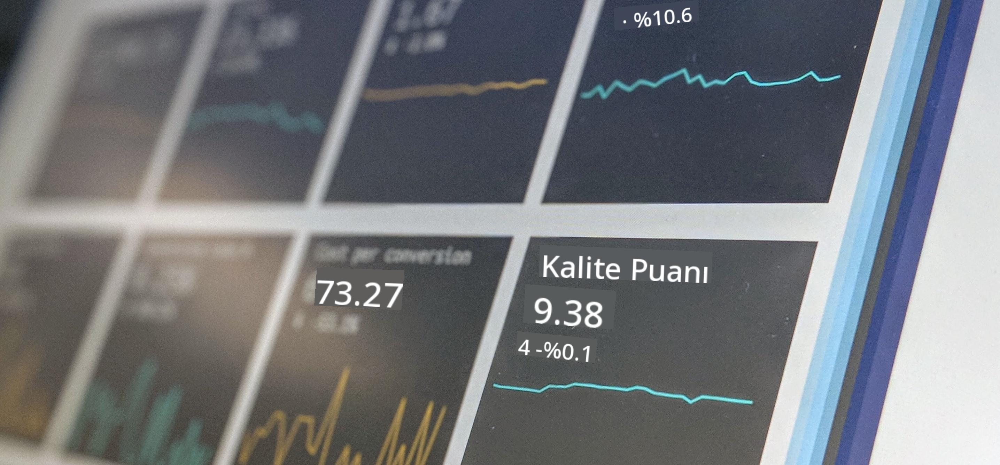

<!--
CO_OP_TRANSLATOR_METADATA:
{
  "original_hash": "696a8474a01054281704cbfb09148949",
  "translation_date": "2025-08-28T11:18:42+00:00",
  "source_file": "1-Introduction/README.md",
  "language_code": "tr"
}
-->
# Veri Bilimine Giriş

> Fotoğraf: <a href="https://unsplash.com/@dawson2406?utm_source=unsplash&utm_medium=referral&utm_content=creditCopyText">Stephen Dawson</a> tarafından <a href="https://unsplash.com/s/photos/data?utm_source=unsplash&utm_medium=referral&utm_content=creditCopyText">Unsplash</a> üzerinde
  
Bu derslerde, Veri Bilimi'nin nasıl tanımlandığını keşfedecek ve bir veri bilimcinin dikkate alması gereken etik konuları öğreneceksiniz. Ayrıca verinin nasıl tanımlandığını öğrenecek ve Veri Bilimi'nin temel akademik alanları olan istatistik ve olasılık hakkında biraz bilgi edineceksiniz.

### Konular

1. [Veri Bilimini Tanımlama](01-defining-data-science/README.md)
2. [Veri Bilimi Etiği](02-ethics/README.md)
3. [Veriyi Tanımlama](03-defining-data/README.md)
4. [İstatistik ve Olasılığa Giriş](04-stats-and-probability/README.md)

### Katkıda Bulunanlar

Bu dersler, [Nitya Narasimhan](https://twitter.com/nitya) ve [Dmitry Soshnikov](https://twitter.com/shwars) tarafından ❤️ ile yazılmıştır.

---

**Feragatname**:  
Bu belge, AI çeviri hizmeti [Co-op Translator](https://github.com/Azure/co-op-translator) kullanılarak çevrilmiştir. Doğruluk için çaba göstersek de, otomatik çevirilerin hata veya yanlışlıklar içerebileceğini lütfen unutmayın. Belgenin orijinal dili, yetkili kaynak olarak kabul edilmelidir. Kritik bilgiler için profesyonel insan çevirisi önerilir. Bu çevirinin kullanımından kaynaklanan yanlış anlama veya yanlış yorumlamalardan sorumlu değiliz.