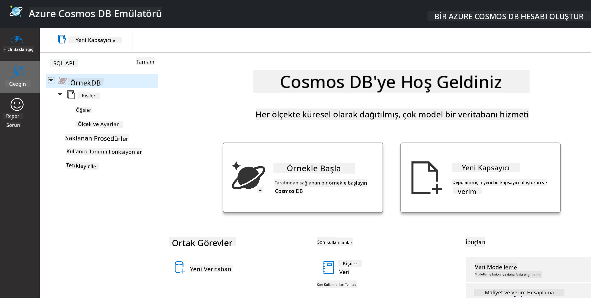
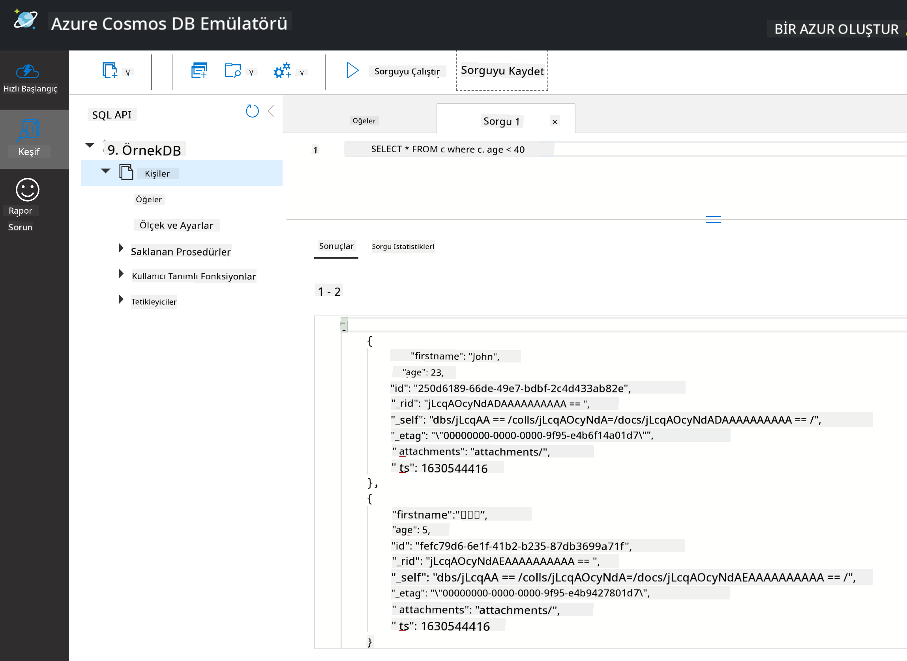

<!--
CO_OP_TRANSLATOR_METADATA:
{
  "original_hash": "54c5a1c74aecb69d2f9099300a4b7eea",
  "translation_date": "2025-09-04T18:07:20+00:00",
  "source_file": "2-Working-With-Data/06-non-relational/README.md",
  "language_code": "tr"
}
-->
# Veriyle Çalışmak: İlişkisel Olmayan Veriler

| ](../../sketchnotes/06-NoSQL.png)|
|:---:|
|NoSQL Verileriyle Çalışmak - _Sketchnote by [@nitya](https://twitter.com/nitya)_ |

## [Ders Öncesi Quiz](https://purple-hill-04aebfb03.1.azurestaticapps.net/quiz/10)

Veriler yalnızca ilişkisel veritabanlarıyla sınırlı değildir. Bu ders, ilişkisel olmayan veriler üzerine odaklanacak ve elektronik tablolar ile NoSQL'in temel bilgilerini kapsayacaktır.

## Elektronik Tablolar

Elektronik tablolar, veri depolamak ve keşfetmek için popüler bir yöntemdir çünkü kurulum ve başlama açısından daha az çaba gerektirir. Bu derste bir elektronik tablonun temel bileşenlerini, formülleri ve işlevleri öğreneceksiniz. Örnekler Microsoft Excel ile gösterilecek, ancak diğer elektronik tablo yazılımlarıyla karşılaştırıldığında çoğu bölüm ve konu benzer isimlere ve adımlara sahip olacaktır.


Bir elektronik tablo bir dosyadır ve bir bilgisayar, cihaz veya bulut tabanlı dosya sisteminde erişilebilir olacaktır. Yazılımın kendisi tarayıcı tabanlı olabilir veya bir bilgisayara yüklenmesi gereken bir uygulama ya da bir uygulama olarak indirilebilir. Excel'de bu dosyalar **çalışma kitapları** olarak tanımlanır ve bu terim dersin geri kalanında kullanılacaktır.

Bir çalışma kitabı, bir veya daha fazla **çalışma sayfası** içerir ve her çalışma sayfası sekmelerle etiketlenir. Bir çalışma sayfasında, gerçek verileri içeren **hücreler** adı verilen dikdörtgenler bulunur. Bir hücre, bir satır ve sütunun kesişimidir; sütunlar alfabetik karakterlerle, satırlar ise sayısal olarak etiketlenir. Bazı elektronik tablolar, bir hücredeki verileri açıklamak için ilk birkaç satırda başlıklar içerebilir.

Excel çalışma kitabının bu temel unsurlarıyla, [Microsoft Templates](https://templates.office.com/) sitesinden bir envantere odaklanan bir örnek kullanarak bir elektronik tablonun bazı ek bölümlerini inceleyeceğiz.

### Envanter Yönetimi

"InventoryExample" adlı elektronik tablo dosyası, envanterdeki öğelerin biçimlendirilmiş bir elektronik tablosudur ve "Inventory List", "Inventory Pick List" ve "Bin Lookup" olarak etiketlenmiş üç çalışma sayfası içerir. Inventory List çalışma sayfasının 4. satırı, başlık sütunundaki her hücrenin değerini açıklayan başlıktır.


Bazı durumlarda, bir hücre diğer hücrelerin değerlerine bağlı olarak kendi değerini oluşturur. Inventory List elektronik tablosu, envanterindeki her öğenin maliyetini takip eder, ancak envanterdeki her şeyin toplam değerini bilmemiz gerekirse ne yaparız? [**Formüller**](https://support.microsoft.com/en-us/office/overview-of-formulas-34519a4e-1e8d-4f4b-84d4-d642c4f63263), hücre verileri üzerinde işlem yapar ve bu örnekte envanterin maliyetini hesaplamak için kullanılır. Bu elektronik tablo, Inventory Value sütununda bir formül kullanarak her öğenin değerini, QTY başlığı altındaki miktarı ve COST başlığı altındaki maliyetleri çarparak hesaplar. Bir hücreyi çift tıklayarak veya vurgulayarak formülü görebilirsiniz. Formüllerin bir eşittir işaretiyle başladığını ve ardından hesaplama veya işlemin geldiğini fark edeceksiniz.


Envanter Değeri'nin tüm değerlerini toplamak için başka bir formül kullanabiliriz. Bu, her hücreyi ekleyerek toplamı oluşturmakla hesaplanabilir, ancak bu zahmetli bir iş olabilir. Excel, hücre değerleri üzerinde hesaplama yapmak için önceden tanımlanmış formüller olan [**işlevler**](https://support.microsoft.com/en-us/office/sum-function-043e1c7d-7726-4e80-8f32-07b23e057f89) içerir. İşlevler, bu hesaplamaları yapmak için gereken değerler olan argümanlara ihtiyaç duyar. İşlevler birden fazla argüman gerektirdiğinde, belirli bir sırayla listelenmeleri gerekir, aksi takdirde işlev doğru değeri hesaplamayabilir. Bu örnek, SUM işlevini kullanır ve B3 (3. satır, B sütunu) altında listelenen toplamı oluşturmak için Inventory Value değerlerini argüman olarak kullanır.

## NoSQL

NoSQL, ilişkisel olmayan verileri depolamanın farklı yollarını kapsayan bir şemsiye terimdir ve "non-SQL", "non-relational" veya "not only SQL" olarak yorumlanabilir. Bu tür veritabanı sistemleri 4 türe ayrılabilir.


> Kaynak: [Michał Białecki Blog](https://www.michalbialecki.com/2018/03/18/azure-cosmos-db-key-value-database-cloud/)

[Anahtar-değer](https://docs.microsoft.com/en-us/azure/architecture/data-guide/big-data/non-relational-data#keyvalue-data-stores) veritabanları, bir değerle ilişkilendirilmiş benzersiz bir tanımlayıcı olan benzersiz anahtarları eşleştirir. Bu çiftler, uygun bir karma işleviyle bir [hash tablosu](https://www.hackerearth.com/practice/data-structures/hash-tables/basics-of-hash-tables/tutorial/) kullanılarak depolanır.


> Kaynak: [Microsoft](https://docs.microsoft.com/en-us/azure/cosmos-db/graph/graph-introduction#graph-database-by-example)

[Grafik](https://docs.microsoft.com/en-us/azure/architecture/data-guide/big-data/non-relational-data#graph-data-stores) veritabanları, verilerdeki ilişkileri tanımlar ve düğümler ve kenarların bir koleksiyonu olarak temsil edilir. Bir düğüm, gerçek dünyada var olan bir varlığı, örneğin bir öğrenci veya banka ekstresini temsil eder. Kenarlar, iki varlık arasındaki ilişkiyi temsil eder. Her düğüm ve kenar, her bir düğüm ve kenar hakkında ek bilgi sağlayan özelliklere sahiptir.


[Sütunlu](https://docs.microsoft.com/en-us/azure/architecture/data-guide/big-data/non-relational-data#columnar-data-stores) veri depoları, verileri sütunlar ve satırlar halinde düzenler, ancak her sütun, bir sütun ailesi olarak adlandırılan gruplara ayrılır. Bir sütun altındaki tüm veriler ilişkilidir ve bir birim olarak alınabilir ve değiştirilebilir.

### Azure Cosmos DB ile Belge Veri Depoları

[Belge](https://docs.microsoft.com/en-us/azure/architecture/data-guide/big-data/non-relational-data#document-data-stores) veri depoları, bir anahtar-değer veri deposu kavramını temel alır ve bir dizi alan ve nesne değerinden oluşur. Bu bölüm, Cosmos DB emülatörü ile belge veritabanlarını keşfedecektir.

Bir Cosmos DB veritabanı, "Sadece SQL Değil" tanımına uyar; Cosmos DB'nin belge veritabanı, verileri sorgulamak için SQL'e dayanır. [Önceki ders](../05-relational-databases/README.md) SQL dilinin temellerini kapsar ve burada bir belge veritabanına bazı aynı sorguları uygulayabileceğiz. Cosmos DB Emülatörünü kullanacağız, bu emülatör, bir bilgisayarda yerel olarak bir belge veritabanı oluşturmanıza ve keşfetmenize olanak tanır. Emülatör hakkında daha fazla bilgi için [burayı okuyun](https://docs.microsoft.com/en-us/azure/cosmos-db/local-emulator?tabs=ssl-netstd21).

Bir belge, alanlar ve nesne değerlerinden oluşan bir koleksiyondur; alanlar, nesne değerinin neyi temsil ettiğini açıklar. Aşağıda bir belge örneği bulunmaktadır.

```json
{
    "firstname": "Eva",
    "age": 44,
    "id": "8c74a315-aebf-4a16-bb38-2430a9896ce5",
    "_rid": "bHwDAPQz8s0BAAAAAAAAAA==",
    "_self": "dbs/bHwDAA==/colls/bHwDAPQz8s0=/docs/bHwDAPQz8s0BAAAAAAAAAA==/",
    "_etag": "\"00000000-0000-0000-9f95-010a691e01d7\"",
    "_attachments": "attachments/",
    "_ts": 1630544034
}
```

Bu belgedeki ilgi alanları: `firstname`, `id` ve `age`. Cosmos DB tarafından oluşturulan alt çizgili alanlar geri kalanıdır.

#### Cosmos DB Emülatörü ile Verileri Keşfetmek

Emülatörü [Windows için buradan](https://aka.ms/cosmosdb-emulator) indirebilir ve yükleyebilirsiniz. macOS ve Linux için Emülatörü çalıştırma seçenekleri hakkında bilgi almak için bu [belgeye](https://docs.microsoft.com/en-us/azure/cosmos-db/local-emulator?tabs=ssl-netstd21#run-on-linux-macos) başvurun.

Emülatör bir tarayıcı penceresi açar, burada Explorer görünümü belgeleri keşfetmenize olanak tanır.



Eğer takip ediyorsanız, "Start with Sample" seçeneğine tıklayarak SampleDB adlı bir örnek veritabanı oluşturabilirsiniz. Sample DB'yi genişletmek için oka tıklarsanız `Persons` adlı bir konteyner bulacaksınız; bir konteyner, içindeki belgeler olan öğelerin bir koleksiyonunu tutar. `Items` altında dört bireysel belgeyi keşfedebilirsiniz.


#### Cosmos DB Emülatörü ile Belge Verilerini Sorgulamak

Yeni SQL Query düğmesine (soldan ikinci düğme) tıklayarak örnek verileri sorgulayabiliriz.

`SELECT * FROM c` konteynerdeki tüm belgeleri döndürür. Bir where clause ekleyelim ve yaşı 40'tan küçük olan herkesi bulalım.

`SELECT * FROM c where c.age < 40`



Sorgu iki belge döndürür, her belgenin yaş değerinin 40'tan küçük olduğunu fark edin.

#### JSON ve Belgeler

Eğer JavaScript Object Notation (JSON) ile aşina iseniz, belgelerin JSON'a benzediğini fark edeceksiniz. Bu dizinde `PersonsData.json` adlı bir dosya bulunmaktadır, bu dosyayı Emülatördeki Persons konteynerine `Upload Item` düğmesi aracılığıyla yükleyebilirsiniz.

Çoğu durumda, JSON verileri döndüren API'ler doğrudan belge veritabanlarına aktarılabilir ve depolanabilir. Aşağıda başka bir belge bulunmaktadır, bu belge Microsoft Twitter hesabından alınan tweetleri temsil eder ve Twitter API kullanılarak alınmış, ardından Cosmos DB'ye eklenmiştir.

```json
{
    "created_at": "2021-08-31T19:03:01.000Z",
    "id": "1432780985872142341",
    "text": "Blank slate. Like this tweet if you’ve ever painted in Microsoft Paint before. https://t.co/cFeEs8eOPK",
    "_rid": "dhAmAIUsA4oHAAAAAAAAAA==",
    "_self": "dbs/dhAmAA==/colls/dhAmAIUsA4o=/docs/dhAmAIUsA4oHAAAAAAAAAA==/",
    "_etag": "\"00000000-0000-0000-9f84-a0958ad901d7\"",
    "_attachments": "attachments/",
    "_ts": 1630537000
```

Bu belgedeki ilgi alanları: `created_at`, `id` ve `text`.

## 🚀 Zorluk

Bir `TwitterData.json` dosyası bulunmaktadır, bu dosyayı SampleDB veritabanına yükleyebilirsiniz. Bunun ayrı bir konteynere eklenmesi önerilir. Bu şu şekilde yapılabilir:

1. Sağ üstteki yeni konteyner düğmesine tıklayın
1. Mevcut veritabanını (SampleDB) seçin, konteyner için bir id oluşturun
1. Bölüm anahtarını `/id` olarak ayarlayın
1. Tamam'a tıklayın (bu görünümdeki diğer bilgileri görmezden gelebilirsiniz çünkü bu, makinenizde yerel olarak çalışan küçük bir veri kümesidir)
1. Yeni konteynerinizi açın ve Twitter Data dosyasını `Upload Item` düğmesiyle yükleyin

`text` alanında Microsoft bulunan belgeleri bulmak için birkaç select sorgusu çalıştırmayı deneyin. İpucu: [LIKE anahtar kelimesini](https://docs.microsoft.com/en-us/azure/cosmos-db/sql/sql-query-keywords#using-like-with-the--wildcard-character) kullanmayı deneyin.

## [Ders Sonrası Quiz](https://ff-quizzes.netlify.app/en/ds/)

## Gözden Geçirme ve Kendi Kendine Çalışma

- Bu derste ele alınmayan elektronik tabloya eklenen bazı ek formatlama ve özellikler bulunmaktadır. Microsoft'un Excel hakkında daha fazla bilgi edinmek istiyorsanız [geniş bir belge ve video kütüphanesi](https://support.microsoft.com/excel) bulunmaktadır.

- Farklı türdeki ilişkisel olmayan verilerin özelliklerini detaylandıran bu mimari belgeleri inceleyin: [İlişkisel Olmayan Veri ve NoSQL](https://docs.microsoft.com/en-us/azure/architecture/data-guide/big-data/non-relational-data)

- Cosmos DB, bu derste bahsedilen farklı NoSQL türlerini de depolayabilen bulut tabanlı bir ilişkisel olmayan veritabanıdır. Bu türler hakkında daha fazla bilgi edinmek için bu [Cosmos DB Microsoft Learn Modülünü](https://docs.microsoft.com/en-us/learn/paths/work-with-nosql-data-in-azure-cosmos-db/) inceleyin.

## Ödev

[Soda Profits](assignment.md)

---

**Feragatname**:  
Bu belge, AI çeviri hizmeti [Co-op Translator](https://github.com/Azure/co-op-translator) kullanılarak çevrilmiştir. Doğruluk için çaba göstersek de, otomatik çevirilerin hata veya yanlışlıklar içerebileceğini lütfen unutmayın. Belgenin orijinal dili, yetkili kaynak olarak kabul edilmelidir. Kritik bilgiler için profesyonel insan çevirisi önerilir. Bu çevirinin kullanımından kaynaklanan yanlış anlamalar veya yanlış yorumlamalar için sorumluluk kabul etmiyoruz.