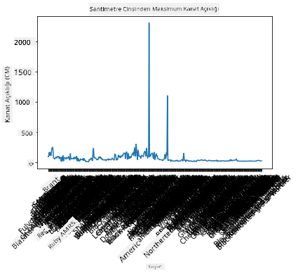
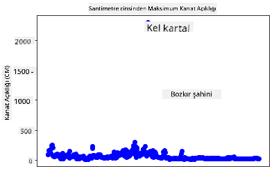
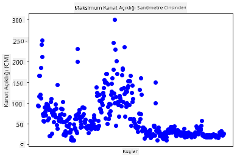
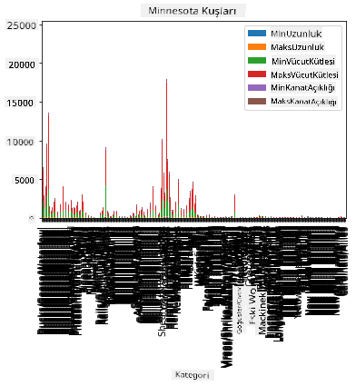
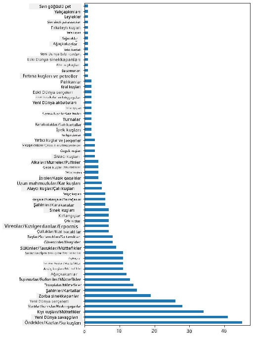
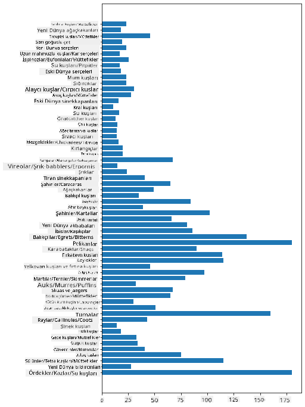
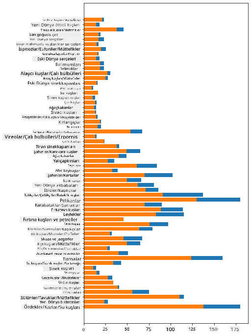

<!--
CO_OP_TRANSLATOR_METADATA:
{
  "original_hash": "69b32b6789a91f796ebc7a02f5575e03",
  "translation_date": "2025-09-04T18:12:49+00:00",
  "source_file": "3-Data-Visualization/09-visualization-quantities/README.md",
  "language_code": "tr"
}
-->
# Miktarları Görselleştirme

| ](../../sketchnotes/09-Visualizing-Quantities.png)|
|:---:|
| Miktarları Görselleştirme - _Sketchnote by [@nitya](https://twitter.com/nitya)_ |

Bu derste, miktar kavramı etrafında ilginç görselleştirmeler oluşturmayı öğrenmek için mevcut Python kütüphanelerinden birini nasıl kullanacağınızı keşfedeceksiniz. Minnesota kuşları hakkında temizlenmiş bir veri seti kullanarak yerel vahşi yaşam hakkında birçok ilginç bilgi edinebilirsiniz.  
## [Ders Öncesi Test](https://purple-hill-04aebfb03.1.azurestaticapps.net/quiz/16)

## Matplotlib ile kanat açıklığını gözlemleyin

Hem basit hem de karmaşık grafikler ve çeşitli türlerde çizimler oluşturmak için mükemmel bir kütüphane olan [Matplotlib](https://matplotlib.org/stable/index.html) ile tanışın. Genel olarak, bu kütüphaneleri kullanarak veri görselleştirme süreci, hedeflemek istediğiniz veri çerçevesi bölümlerini belirlemeyi, gerekli dönüşümleri yapmayı, x ve y ekseni değerlerini atamayı, hangi tür grafiği göstereceğinize karar vermeyi ve ardından grafiği göstermeyi içerir. Matplotlib çok çeşitli görselleştirmeler sunar, ancak bu derste miktarları görselleştirmek için en uygun olanlara odaklanacağız: çizgi grafikleri, dağılım grafikleri ve çubuk grafikleri.

> ✅ Verinizin yapısına ve anlatmak istediğiniz hikayeye en uygun grafiği kullanın.  
> - Zaman içindeki eğilimleri analiz etmek için: çizgi  
> - Değerleri karşılaştırmak için: çubuk, sütun, pasta, dağılım grafiği  
> - Parçaların bütüne nasıl ilişkili olduğunu göstermek için: pasta  
> - Verinin dağılımını göstermek için: dağılım grafiği, çubuk  
> - Eğilimleri göstermek için: çizgi, sütun  
> - Değerler arasındaki ilişkileri göstermek için: çizgi, dağılım grafiği, balon  

Bir veri setiniz varsa ve belirli bir öğeden ne kadar bulunduğunu keşfetmeniz gerekiyorsa, ilk yapmanız gereken görevlerden biri değerlerini incelemek olacaktır.

✅ Matplotlib için çok iyi 'hızlı başvuru kılavuzları' [burada](https://matplotlib.org/cheatsheets/cheatsheets.pdf) mevcuttur.

## Kuş kanat açıklığı değerleri hakkında bir çizgi grafiği oluşturun

Bu ders klasörünün kökünde bulunan `notebook.ipynb` dosyasını açın ve bir hücre ekleyin.

> Not: Veriler bu depo kökünde `/data` klasöründe saklanmaktadır.

```python
import pandas as pd
import matplotlib.pyplot as plt
birds = pd.read_csv('../../data/birds.csv')
birds.head()
```  
Bu veri, metin ve sayılar karışımıdır:

|      | İsim                         | BilimselAdı            | Kategori              | Takım        | Aile     | Cins        | KorumaDurumu         | MinUzunluk | MaxUzunluk | MinVücutKütlesi | MaxVücutKütlesi | MinKanatAçıklığı | MaxKanatAçıklığı |
| ---: | :--------------------------- | :--------------------- | :-------------------- | :----------- | :------- | :---------- | :------------------- | --------: | --------: | -------------: | -------------: | --------------: | --------------: |
|    0 | Kara karınlı ıslıkçı ördek   | Dendrocygna autumnalis | Ördekler/Kazlar/Su Kuşları | Anseriformes | Anatidae | Dendrocygna | LC                   |        47 |        56 |           652 |          1020 |              76 |              94 |
|    1 | Sarımsı ıslıkçı ördek        | Dendrocygna bicolor    | Ördekler/Kazlar/Su Kuşları | Anseriformes | Anatidae | Dendrocygna | LC                   |        45 |        53 |           712 |          1050 |              85 |              93 |
|    2 | Kar kazı                     | Anser caerulescens     | Ördekler/Kazlar/Su Kuşları | Anseriformes | Anatidae | Anser       | LC                   |        64 |        79 |          2050 |          4050 |             135 |             165 |
|    3 | Ross'un kazı                 | Anser rossii           | Ördekler/Kazlar/Su Kuşları | Anseriformes | Anatidae | Anser       | LC                   |      57.3 |        64 |          1066 |          1567 |             113 |             116 |
|    4 | Büyük beyaz alınlı kaz       | Anser albifrons        | Ördekler/Kazlar/Su Kuşları | Anseriformes | Anatidae | Anser       | LC                   |        64 |        81 |          1930 |          3310 |             130 |             165 |

Hadi bu ilginç kuşların maksimum kanat açıklığını temel alan basit bir çizgi grafiği oluşturalım.

```python
wingspan = birds['MaxWingspan'] 
wingspan.plot()
```  


Hemen ne fark ettiniz? En az bir aykırı değer var gibi görünüyor - bu oldukça büyük bir kanat açıklığı! 2300 santimetrelik bir kanat açıklığı 23 metreye eşittir - Minnesota'da Pterodactyl'ler mi dolaşıyor? Hadi bunu araştıralım.

Excel'de hızlı bir sıralama yaparak bu aykırı değerleri bulabilirsiniz, ancak görselleştirme sürecine grafikten devam edin.

X eksenine hangi tür kuşların söz konusu olduğunu göstermek için etiketler ekleyin:

```
plt.title('Max Wingspan in Centimeters')
plt.ylabel('Wingspan (CM)')
plt.xlabel('Birds')
plt.xticks(rotation=45)
x = birds['Name'] 
y = birds['MaxWingspan']

plt.plot(x, y)

plt.show()
```  


Etiketlerin 45 derece döndürülmesine rağmen, okunamayacak kadar çok etiket var. Farklı bir strateji deneyelim: yalnızca aykırı değerleri etiketleyin ve etiketleri grafik içinde ayarlayın. Daha fazla alan yaratmak için bir dağılım grafiği kullanabilirsiniz:

```python
plt.title('Max Wingspan in Centimeters')
plt.ylabel('Wingspan (CM)')
plt.tick_params(axis='both',which='both',labelbottom=False,bottom=False)

for i in range(len(birds)):
    x = birds['Name'][i]
    y = birds['MaxWingspan'][i]
    plt.plot(x, y, 'bo')
    if birds['MaxWingspan'][i] > 500:
        plt.text(x, y * (1 - 0.05), birds['Name'][i], fontsize=12)
    
plt.show()
```  
Burada neler oluyor? `tick_params` kullanarak alt etiketleri gizlediniz ve ardından kuş veri setiniz üzerinde bir döngü oluşturdunuz. `bo` kullanarak küçük yuvarlak mavi noktalarla grafiği çizdiniz, maksimum kanat açıklığı 500'ün üzerinde olan herhangi bir kuşu kontrol ettiniz ve eğer öyleyse, noktanın yanına etiket olarak kuş adını gösterdiniz. Etiketleri y ekseninde biraz kaydırdınız (`y * (1 - 0.05)`) ve kuş adını etiket olarak kullandınız.

Ne keşfettiniz?

  
## Verilerinizi filtreleyin

Hem Kel Kartal hem de Bozkır Şahini, muhtemelen çok büyük kuşlar olmasına rağmen, maksimum kanat açıklıklarına fazladan bir `0` eklenmiş gibi görünüyor. 25 metrelik kanat açıklığına sahip bir Kel Kartal ile karşılaşmanız pek olası değil, ancak eğer öyleyse, lütfen bize bildirin! Hadi bu iki aykırı değeri içermeyen yeni bir veri çerçevesi oluşturalım:

```python
plt.title('Max Wingspan in Centimeters')
plt.ylabel('Wingspan (CM)')
plt.xlabel('Birds')
plt.tick_params(axis='both',which='both',labelbottom=False,bottom=False)
for i in range(len(birds)):
    x = birds['Name'][i]
    y = birds['MaxWingspan'][i]
    if birds['Name'][i] not in ['Bald eagle', 'Prairie falcon']:
        plt.plot(x, y, 'bo')
plt.show()
```  

Aykırı değerleri filtreleyerek, verileriniz artık daha tutarlı ve anlaşılır hale geldi.



Artık en azından kanat açıklığı açısından daha temiz bir veri setine sahibiz, hadi bu kuşlar hakkında daha fazla şey keşfedelim.

Çizgi ve dağılım grafikleri, veri değerleri ve dağılımları hakkında bilgi gösterebilir, ancak bu veri setinde yer alan değerler hakkında düşünmek istiyoruz. Miktarlarla ilgili şu soruları yanıtlamak için görselleştirmeler oluşturabilirsiniz:

> Kaç kuş kategorisi var ve sayıları nedir?  
> Kaç kuş nesli tükenmiş, tehlikede, nadir veya yaygın?  
> Linnaeus'un terminolojisinde çeşitli cins ve takımlardan kaç tane var?  
## Çubuk grafiklerini keşfedin

Çubuk grafikleri, veri gruplarını göstermeniz gerektiğinde pratiktir. Bu veri setinde hangi kuş kategorilerinin en yaygın olduğunu görmek için kuş kategorilerini keşfedelim.

Notebook dosyasında temel bir çubuk grafik oluşturun.

✅ Not, önceki bölümde belirlediğimiz iki aykırı kuşu filtreleyebilir, kanat açıklığındaki yazım hatasını düzeltebilir veya kanat açıklığı değerlerine bağlı olmayan bu alıştırmalar için onları bırakabilirsiniz.

Bir çubuk grafik oluşturmak istiyorsanız, odaklanmak istediğiniz verileri seçebilirsiniz. Çubuk grafikleri ham verilerden oluşturulabilir:

```python
birds.plot(x='Category',
        kind='bar',
        stacked=True,
        title='Birds of Minnesota')

```  


Ancak bu çubuk grafik, çok fazla gruplandırılmamış veri olduğu için okunamaz. Yalnızca çizmek istediğiniz verileri seçmeniz gerekir, bu yüzden kuşların kategorisine göre uzunluklarına bakalım.

Verilerinizi yalnızca kuşların kategorisini içerecek şekilde filtreleyin.

✅ Pandas'ı verileri yönetmek için kullanıyorsunuz ve ardından Matplotlib grafikleri oluşturuyor.

Birçok kategori olduğu için bu grafiği dikey olarak görüntüleyebilir ve tüm verileri hesaba katmak için yüksekliğini ayarlayabilirsiniz:

```python
category_count = birds.value_counts(birds['Category'].values, sort=True)
plt.rcParams['figure.figsize'] = [6, 12]
category_count.plot.barh()
```  


Bu çubuk grafik, her kategorideki kuşların sayısını iyi bir şekilde gösteriyor. Bir bakışta, bu bölgedeki en büyük kuş sayısının Ördekler/Kazlar/Su Kuşları kategorisinde olduğunu görebilirsiniz. Minnesota '10,000 gölün ülkesi' olduğu için bu şaşırtıcı değil!

✅ Bu veri setinde başka sayımları deneyin. Sizi şaşırtan bir şey var mı?

## Verileri karşılaştırma

Gruplandırılmış verilerin farklı karşılaştırmalarını yeni eksenler oluşturarak deneyebilirsiniz. Kuşların kategorisine göre Maksimum Uzunluk karşılaştırmasını deneyin:

```python
maxlength = birds['MaxLength']
plt.barh(y=birds['Category'], width=maxlength)
plt.rcParams['figure.figsize'] = [6, 12]
plt.show()
```  


Burada şaşırtıcı bir şey yok: sinek kuşları, pelikanlar veya kazlara kıyasla en az Maksimum Uzunluğa sahip. Veriler mantıklı olduğunda iyidir!

Çubuk grafiklerin daha ilginç görselleştirmelerini, verileri üst üste bindirerek oluşturabilirsiniz. Hadi bir kuş kategorisindeki Minimum ve Maksimum Uzunluğu üst üste bindirelim:

```python
minLength = birds['MinLength']
maxLength = birds['MaxLength']
category = birds['Category']

plt.barh(category, maxLength)
plt.barh(category, minLength)

plt.show()
```  
Bu grafikte, Minimum Uzunluk ve Maksimum Uzunluk aralığını kuş kategorisine göre görebilirsiniz. Bu verilere dayanarak, kuş ne kadar büyükse, uzunluk aralığının o kadar geniş olduğunu güvenle söyleyebilirsiniz. İlginç!



## 🚀 Meydan Okuma

Bu kuş veri seti, belirli bir ekosistemdeki farklı kuş türleri hakkında zengin bilgiler sunuyor. İnternette araştırma yapın ve başka kuş odaklı veri setleri bulabilir misiniz? Bu kuşlar etrafında grafikler ve çizimler oluşturarak farkında olmadığınız gerçekleri keşfetmeye çalışın.

## [Ders Sonrası Test](https://ff-quizzes.netlify.app/en/ds/)

## Gözden Geçirme ve Kendi Kendine Çalışma

Bu ilk ders, Matplotlib'i kullanarak miktarları nasıl görselleştireceğiniz hakkında size bazı bilgiler verdi. Veri görselleştirme için veri setleriyle çalışmanın diğer yolları hakkında araştırma yapın. [Plotly](https://github.com/plotly/plotly.py) bu derslerde ele almayacağımız bir kütüphane, bu yüzden neler sunabileceğine bir göz atın.  
## Ödev

[Çizgiler, Dağılımlar ve Çubuklar](assignment.md)

---

**Feragatname**:  
Bu belge, AI çeviri hizmeti [Co-op Translator](https://github.com/Azure/co-op-translator) kullanılarak çevrilmiştir. Doğruluk için çaba göstersek de, otomatik çevirilerin hata veya yanlışlık içerebileceğini lütfen unutmayın. Belgenin orijinal dili, yetkili kaynak olarak kabul edilmelidir. Kritik bilgiler için profesyonel insan çevirisi önerilir. Bu çevirinin kullanımından kaynaklanan yanlış anlamalar veya yanlış yorumlamalardan sorumlu değiliz.