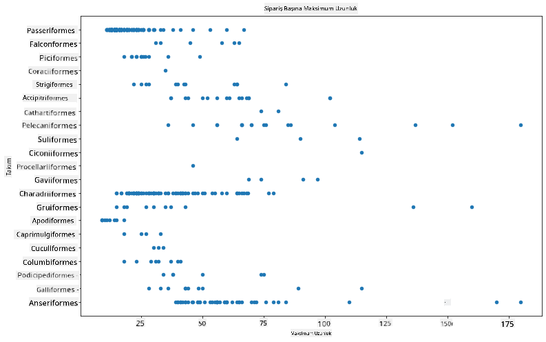
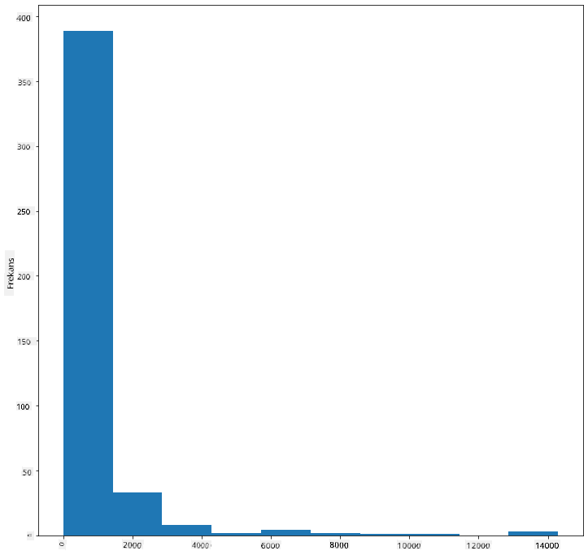
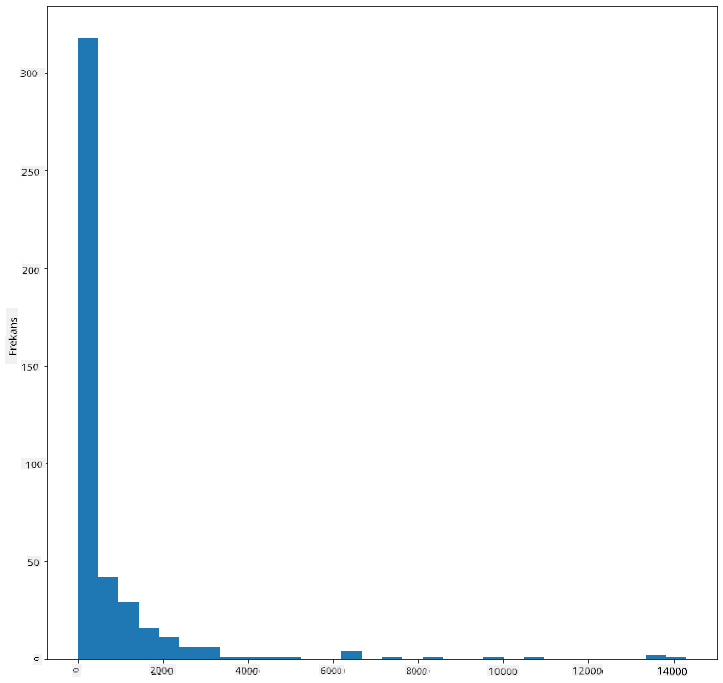
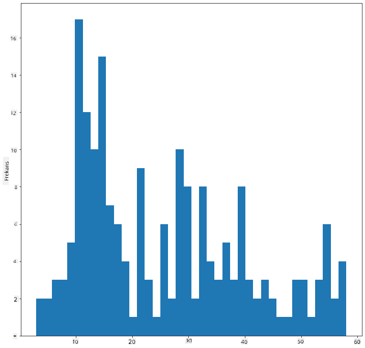
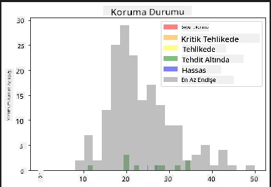
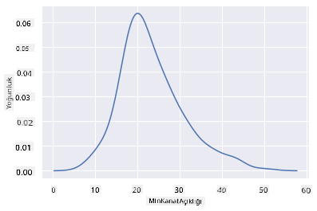
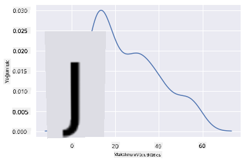
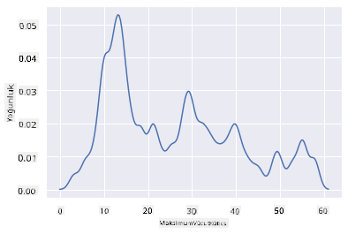
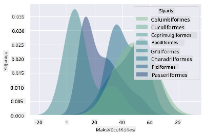
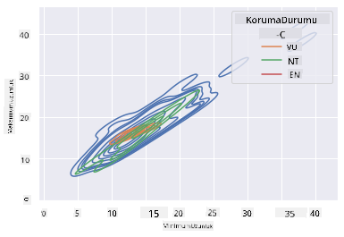

<!--
CO_OP_TRANSLATOR_METADATA:
{
  "original_hash": "02ce904bc1e2bfabb7dc05c25aae375c",
  "translation_date": "2025-09-04T18:14:33+00:00",
  "source_file": "3-Data-Visualization/10-visualization-distributions/README.md",
  "language_code": "tr"
}
-->
# Dağılımları Görselleştirme

| ](../../sketchnotes/10-Visualizing-Distributions.png)|
|:---:|
| Dağılımları Görselleştirme - _Sketchnote by [@nitya](https://twitter.com/nitya)_ |

Önceki derste, Minnesota kuşları hakkında bir veri kümesiyle ilgili bazı ilginç bilgiler öğrendiniz. Aykırı değerleri görselleştirerek hatalı verileri buldunuz ve kuş kategorileri arasındaki maksimum uzunluk farklarına baktınız.

## [Ders Öncesi Test](https://purple-hill-04aebfb03.1.azurestaticapps.net/quiz/18)
## Kuşlar veri kümesini keşfetmek

Verilere daha derinlemesine bakmanın bir başka yolu, verilerin bir eksen boyunca nasıl organize edildiğini incelemek, yani dağılımını görmektir. Örneğin, Minnesota kuşlarının maksimum kanat açıklığı veya maksimum vücut kütlesinin genel dağılımını öğrenmek isteyebilirsiniz.

Bu veri kümesindeki verilerin dağılımları hakkında bazı bilgiler keşfedelim. Ders klasörünün kökünde bulunan _notebook.ipynb_ dosyasında Pandas, Matplotlib ve verilerinizi içe aktarın:

```python
import pandas as pd
import matplotlib.pyplot as plt
birds = pd.read_csv('../../data/birds.csv')
birds.head()
```

|      | İsim                         | BilimselAd             | Kategori              | Takım        | Aile     | Cins        | KorumaDurumu        | MinUzunluk | MaxUzunluk | MinVücutKütlesi | MaxVücutKütlesi | MinKanatAçıklığı | MaxKanatAçıklığı |
| ---: | :--------------------------- | :--------------------- | :-------------------- | :----------- | :------- | :---------- | :----------------- | --------: | --------: | ----------: | ----------: | ----------: | ----------: |
|    0 | Kara karınlı ıslıkçı ördek   | Dendrocygna autumnalis | Ördekler/Kazlar/Su Kuşları | Anseriformes | Anatidae | Dendrocygna | LC                 |        47 |        56 |         652 |        1020 |          76 |          94 |
|    1 | Sarımsı ıslıkçı ördek        | Dendrocygna bicolor    | Ördekler/Kazlar/Su Kuşları | Anseriformes | Anatidae | Dendrocygna | LC                 |        45 |        53 |         712 |        1050 |          85 |          93 |
|    2 | Kar kazı                     | Anser caerulescens     | Ördekler/Kazlar/Su Kuşları | Anseriformes | Anatidae | Anser       | LC                 |        64 |        79 |        2050 |        4050 |         135 |         165 |
|    3 | Ross'un kazı                 | Anser rossii           | Ördekler/Kazlar/Su Kuşları | Anseriformes | Anatidae | Anser       | LC                 |      57.3 |        64 |        1066 |        1567 |         113 |         116 |
|    4 | Büyük beyaz alınlı kaz       | Anser albifrons        | Ördekler/Kazlar/Su Kuşları | Anseriformes | Anatidae | Anser       | LC                 |        64 |        81 |        1930 |        3310 |         130 |         165 |

Genel olarak, verilerin dağılımını hızlı bir şekilde görmek için önceki derste yaptığımız gibi bir saçılım grafiği kullanabilirsiniz:

```python
birds.plot(kind='scatter',x='MaxLength',y='Order',figsize=(12,8))

plt.title('Max Length per Order')
plt.ylabel('Order')
plt.xlabel('Max Length')

plt.show()
```


Bu, kuş takımlarına göre vücut uzunluğunun genel dağılımını gösterir, ancak gerçek dağılımları göstermek için en uygun yöntem değildir. Bu görev genellikle bir Histogram oluşturarak gerçekleştirilir.

## Histogramlarla Çalışmak

Matplotlib, Histogramlar kullanarak veri dağılımını görselleştirmek için çok iyi yollar sunar. Bu tür grafik, çubuk grafik gibi görünür, ancak dağılımı çubukların yükselip alçalmasıyla gösterir. Bir histogram oluşturmak için sayısal verilere ihtiyacınız vardır. Histogram oluşturmak için, türü 'hist' olarak tanımlayarak bir grafik çizebilirsiniz. Bu grafik, tüm veri kümesinin sayısal veri aralığı için MaxBodyMass dağılımını gösterir. Verilen veri dizisini daha küçük bölmelere ayırarak, verilerin değerlerinin dağılımını gösterebilir:

```python
birds['MaxBodyMass'].plot(kind = 'hist', bins = 10, figsize = (12,12))
plt.show()
```


Gördüğünüz gibi, bu veri kümesindeki 400'den fazla kuşun çoğu Max Body Mass değerleri 2000'in altında yer alıyor. `bins` parametresini daha yüksek bir sayıya, örneğin 30'a değiştirerek veriler hakkında daha fazla bilgi edinin:

```python
birds['MaxBodyMass'].plot(kind = 'hist', bins = 30, figsize = (12,12))
plt.show()
```


Bu grafik, dağılımı biraz daha ayrıntılı bir şekilde gösterir. Daha az sola eğimli bir grafik, yalnızca belirli bir aralıktaki verileri seçerek oluşturulabilir:

Verilerinizi filtreleyerek vücut kütlesi 60'ın altında olan kuşları alın ve 40 `bins` gösterin:

```python
filteredBirds = birds[(birds['MaxBodyMass'] > 1) & (birds['MaxBodyMass'] < 60)]      
filteredBirds['MaxBodyMass'].plot(kind = 'hist',bins = 40,figsize = (12,12))
plt.show()     
```


✅ Diğer filtreleri ve veri noktalarını deneyin. Verilerin tam dağılımını görmek için `['MaxBodyMass']` filtresini kaldırarak etiketli dağılımları gösterin.

Histogram, bazı güzel renk ve etiketleme geliştirmeleri de sunar:

İki dağılım arasındaki ilişkiyi karşılaştırmak için 2D histogram oluşturun. `MaxBodyMass` ve `MaxLength` karşılaştırmasını yapalım. Matplotlib, daha parlak renkler kullanarak yakınsama göstermenin yerleşik bir yolunu sunar:

```python
x = filteredBirds['MaxBodyMass']
y = filteredBirds['MaxLength']

fig, ax = plt.subplots(tight_layout=True)
hist = ax.hist2d(x, y)
```
Beklenen bir eksen boyunca bu iki öğe arasında beklenen bir korelasyon var gibi görünüyor, özellikle güçlü bir yakınsama noktasıyla:


Histogramlar, varsayılan olarak sayısal veriler için iyi çalışır. Peki, metin verilerine göre dağılımları görmek isterseniz ne olur? 
## Metin Verilerini Kullanarak Veri Kümesini Keşfetmek

Bu veri kümesi ayrıca kuş kategorisi, cinsi, türü ve ailesi ile koruma durumu hakkında iyi bilgiler içerir. Bu koruma bilgilerini inceleyelim. Kuşların koruma durumlarına göre dağılımı nedir?

> ✅ Veri kümesinde, koruma durumunu tanımlamak için birkaç kısaltma kullanılmıştır. Bu kısaltmalar, türlerin durumunu kataloglayan bir organizasyon olan [IUCN Kırmızı Liste Kategorileri](https://www.iucnredlist.org/) tarafından sağlanmaktadır.
> 
> - CR: Kritik Tehlike Altında
> - EN: Tehlike Altında
> - EX: Nesli Tükenmiş
> - LC: En Az Endişe
> - NT: Tehdit Altında
> - VU: Hassas

Bunlar metin tabanlı değerler olduğundan, bir histogram oluşturmak için bir dönüşüm yapmanız gerekecek. Filtrelenmiş kuşlar veri çerçevesini kullanarak koruma durumunu Minimum Kanat Açıklığı ile birlikte görüntüleyin. Ne görüyorsunuz?

```python
x1 = filteredBirds.loc[filteredBirds.ConservationStatus=='EX', 'MinWingspan']
x2 = filteredBirds.loc[filteredBirds.ConservationStatus=='CR', 'MinWingspan']
x3 = filteredBirds.loc[filteredBirds.ConservationStatus=='EN', 'MinWingspan']
x4 = filteredBirds.loc[filteredBirds.ConservationStatus=='NT', 'MinWingspan']
x5 = filteredBirds.loc[filteredBirds.ConservationStatus=='VU', 'MinWingspan']
x6 = filteredBirds.loc[filteredBirds.ConservationStatus=='LC', 'MinWingspan']

kwargs = dict(alpha=0.5, bins=20)

plt.hist(x1, **kwargs, color='red', label='Extinct')
plt.hist(x2, **kwargs, color='orange', label='Critically Endangered')
plt.hist(x3, **kwargs, color='yellow', label='Endangered')
plt.hist(x4, **kwargs, color='green', label='Near Threatened')
plt.hist(x5, **kwargs, color='blue', label='Vulnerable')
plt.hist(x6, **kwargs, color='gray', label='Least Concern')

plt.gca().set(title='Conservation Status', ylabel='Min Wingspan')
plt.legend();
```



Minimum kanat açıklığı ile koruma durumu arasında iyi bir korelasyon görünmüyor. Bu yöntemi kullanarak veri kümesinin diğer öğelerini test edin. Farklı filtreler de deneyebilirsiniz. Herhangi bir korelasyon buluyor musunuz?

## Yoğunluk Grafikleri

Şimdiye kadar baktığımız histogramların 'basamaklı' olduğunu ve düzgün bir yay şeklinde akmadığını fark etmiş olabilirsiniz. Daha düzgün bir yoğunluk grafiği göstermek için bir yoğunluk grafiği deneyebilirsiniz.

Yoğunluk grafikleriyle çalışmak için yeni bir grafik kütüphanesi olan [Seaborn](https://seaborn.pydata.org/generated/seaborn.kdeplot.html) ile tanışın.

Seaborn'u yükleyerek, temel bir yoğunluk grafiği deneyin:

```python
import seaborn as sns
import matplotlib.pyplot as plt
sns.kdeplot(filteredBirds['MinWingspan'])
plt.show()
```


Minimum Kanat Açıklığı verileri için önceki grafiği nasıl yansıttığını görebilirsiniz; sadece biraz daha düzgün. Seaborn'un belgelerine göre, "Bir histogramla karşılaştırıldığında, KDE birden fazla dağılım çizerken daha az karmaşık ve daha anlaşılır bir grafik üretebilir. Ancak, altta yatan dağılım sınırlı veya düzgün değilse bozulmalar oluşturma potansiyeline sahiptir. Bir histogram gibi, temsilin kalitesi de iyi yumuşatma parametrelerinin seçimine bağlıdır." [kaynak](https://seaborn.pydata.org/generated/seaborn.kdeplot.html) Başka bir deyişle, her zaman olduğu gibi aykırı değerler grafiklerinizi kötü davranmaya zorlayabilir.

İkinci grafikte oluşturduğunuz o basamaklı MaxBodyMass çizgisini yeniden ziyaret etmek isterseniz, bu yöntemi kullanarak çok iyi bir şekilde düzeltebilirsiniz:

```python
sns.kdeplot(filteredBirds['MaxBodyMass'])
plt.show()
```


Çok düzgün olmayan ama yine de düzgün bir çizgi istiyorsanız, `bw_adjust` parametresini düzenleyin:

```python
sns.kdeplot(filteredBirds['MaxBodyMass'], bw_adjust=.2)
plt.show()
```


✅ Bu tür grafik için mevcut parametreler hakkında okuyun ve deneyin!

Bu tür grafikler, açıklayıcı görselleştirmeler sunar. Örneğin, birkaç satır kodla kuş takımlarına göre maksimum vücut kütlesi yoğunluğunu gösterebilirsiniz:

```python
sns.kdeplot(
   data=filteredBirds, x="MaxBodyMass", hue="Order",
   fill=True, common_norm=False, palette="crest",
   alpha=.5, linewidth=0,
)
```



Bir grafikte birden fazla değişkenin yoğunluğunu da eşleyebilirsiniz. Bir kuşun MaxLength ve MinLength değerlerini koruma durumlarına göre test edin:

```python
sns.kdeplot(data=filteredBirds, x="MinLength", y="MaxLength", hue="ConservationStatus")
```



Belki de 'Hassas' kuşların uzunluklarına göre kümelenmesinin anlamlı olup olmadığını araştırmaya değer.

## 🚀 Meydan Okuma

Histogramlar, temel saçılım grafikleri, çubuk grafikler veya çizgi grafiklerden daha sofistike bir grafik türüdür. İnternette histogramların iyi kullanıldığı örnekleri bulmak için bir arama yapın. Nasıl kullanılıyorlar, neyi gösteriyorlar ve hangi alanlarda veya araştırma konularında kullanılma eğilimindeler?

## [Ders Sonrası Test](https://ff-quizzes.netlify.app/en/ds/)

## Gözden Geçirme ve Kendi Kendine Çalışma

Bu derste, Matplotlib kullandınız ve daha sofistike grafikler göstermek için Seaborn ile çalışmaya başladınız. Seaborn'daki `kdeplot` hakkında araştırma yapın, "bir veya daha fazla boyutta sürekli olasılık yoğunluğu eğrisi". [Belgeleri](https://seaborn.pydata.org/generated/seaborn.kdeplot.html) okuyarak nasıl çalıştığını anlayın.

## Ödev

[Yeteneğinizi uygulayın](assignment.md)

---

**Feragatname**:  
Bu belge, AI çeviri hizmeti [Co-op Translator](https://github.com/Azure/co-op-translator) kullanılarak çevrilmiştir. Doğruluğu sağlamak için çaba göstersek de, otomatik çevirilerin hata veya yanlışlık içerebileceğini lütfen unutmayın. Belgenin orijinal dili, yetkili kaynak olarak kabul edilmelidir. Kritik bilgiler için profesyonel insan çevirisi önerilir. Bu çevirinin kullanımından kaynaklanan yanlış anlamalar veya yanlış yorumlamalar için sorumluluk kabul etmiyoruz.