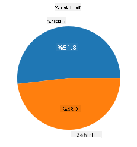
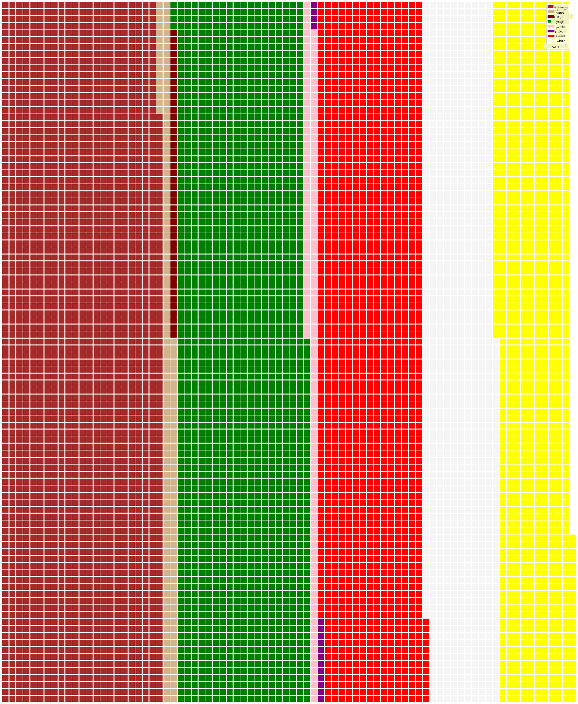

<!--
CO_OP_TRANSLATOR_METADATA:
{
  "original_hash": "af6a12015c6e250e500b570a9fa42593",
  "translation_date": "2025-08-28T11:11:02+00:00",
  "source_file": "3-Data-Visualization/11-visualization-proportions/README.md",
  "language_code": "tr"
}
-->
# Oranları Görselleştirme

| ](../../sketchnotes/11-Visualizing-Proportions.png)|
|:---:|
|Oranları Görselleştirme - _Sketchnote by [@nitya](https://twitter.com/nitya)_ |

Bu derste, mantarlarla ilgili bir veri kümesinde farklı mantar türlerinin oranlarını görselleştirmek gibi oranları incelemek için doğa odaklı farklı bir veri kümesi kullanacaksınız. Agaricus ve Lepiota ailelerine ait 23 tür lamelli mantar hakkında Audubon'dan alınan bir veri kümesini keşfederek bu büyüleyici mantarları inceleyeceğiz. Şu lezzetli görselleştirmelerle denemeler yapacaksınız:

- Pasta grafikleri 🥧
- Donut grafikleri 🍩
- Waffle grafikleri 🧇

> 💡 Microsoft Research tarafından geliştirilen [Charticulator](https://charticulator.com) adlı çok ilginç bir proje, veri görselleştirmeleri için ücretsiz bir sürükle-bırak arayüzü sunuyor. Bu projede, mantar veri kümesini kullandıkları bir eğitim de var! Böylece hem veriyi keşfedebilir hem de kütüphaneyi öğrenebilirsiniz: [Charticulator tutorial](https://charticulator.com/tutorials/tutorial4.html).

## [Ders Öncesi Testi](https://purple-hill-04aebfb03.1.azurestaticapps.net/quiz/20)

## Mantarlarınızı Tanıyın 🍄

Mantarlar oldukça ilginçtir. Hadi bir veri kümesi içe aktararak onları inceleyelim:

```python
import pandas as pd
import matplotlib.pyplot as plt
mushrooms = pd.read_csv('../../data/mushrooms.csv')
mushrooms.head()
```
Bir tablo, analiz için harika verilerle birlikte yazdırılır:


| class     | cap-shape | cap-surface | cap-color | bruises | odor    | gill-attachment | gill-spacing | gill-size | gill-color | stalk-shape | stalk-root | stalk-surface-above-ring | stalk-surface-below-ring | stalk-color-above-ring | stalk-color-below-ring | veil-type | veil-color | ring-number | ring-type | spore-print-color | population | habitat |
| --------- | --------- | ----------- | --------- | ------- | ------- | --------------- | ------------ | --------- | ---------- | ----------- | ---------- | ------------------------ | ------------------------ | ---------------------- | ---------------------- | --------- | ---------- | ----------- | --------- | ----------------- | ---------- | ------- |
| Zehirli   | Konveks   | Düzgün      | Kahverengi| Morarma  | Keskin  | Serbest         | Yakın        | Dar       | Siyah      | Genişleyen  | Eşit       | Düzgün                   | Düzgün                   | Beyaz                  | Beyaz                  | Kısmi     | Beyaz      | Bir         | Sarkan   | Siyah             | Dağınık    | Şehir   |
| Yenilebilir| Konveks  | Düzgün      | Sarı      | Morarma  | Badem  | Serbest         | Yakın        | Geniş     | Siyah      | Genişleyen  | Kulüp      | Düzgün                   | Düzgün                   | Beyaz                  | Beyaz                  | Kısmi     | Beyaz      | Bir         | Sarkan   | Kahverengi        | Çok        | Çimenler|
| Yenilebilir| Çan      | Düzgün      | Beyaz     | Morarma  | Anason | Serbest         | Yakın        | Geniş     | Kahverengi | Genişleyen  | Kulüp      | Düzgün                   | Düzgün                   | Beyaz                  | Beyaz                  | Kısmi     | Beyaz      | Bir         | Sarkan   | Kahverengi        | Çok        | Çayırlar|
| Zehirli   | Konveks   | Pullu       | Beyaz     | Morarma  | Keskin  | Serbest         | Yakın        | Dar       | Kahverengi | Genişleyen  | Eşit       | Düzgün                   | Düzgün                   | Beyaz                  | Beyaz                  | Kısmi     | Beyaz      | Bir         | Sarkan   | Siyah             | Dağınık    | Şehir   |

Hemen fark ediyorsunuz ki tüm veriler metinsel. Bu verileri bir grafik oluşturmak için dönüştürmeniz gerekecek. Aslında, verilerin çoğu bir nesne olarak temsil ediliyor:

```python
print(mushrooms.select_dtypes(["object"]).columns)
```

Çıktı şu şekilde:

```output
Index(['class', 'cap-shape', 'cap-surface', 'cap-color', 'bruises', 'odor',
       'gill-attachment', 'gill-spacing', 'gill-size', 'gill-color',
       'stalk-shape', 'stalk-root', 'stalk-surface-above-ring',
       'stalk-surface-below-ring', 'stalk-color-above-ring',
       'stalk-color-below-ring', 'veil-type', 'veil-color', 'ring-number',
       'ring-type', 'spore-print-color', 'population', 'habitat'],
      dtype='object')
```
Bu verileri alın ve 'class' sütununu bir kategoriye dönüştürün:

```python
cols = mushrooms.select_dtypes(["object"]).columns
mushrooms[cols] = mushrooms[cols].astype('category')
```

```python
edibleclass=mushrooms.groupby(['class']).count()
edibleclass
```

Şimdi mantar verilerini yazdırırsanız, zehirli/yenilebilir sınıfına göre kategorilere ayrıldığını görebilirsiniz:


|           | cap-shape | cap-surface | cap-color | bruises | odor | gill-attachment | gill-spacing | gill-size | gill-color | stalk-shape | ... | stalk-surface-below-ring | stalk-color-above-ring | stalk-color-below-ring | veil-type | veil-color | ring-number | ring-type | spore-print-color | population | habitat |
| --------- | --------- | ----------- | --------- | ------- | ---- | --------------- | ------------ | --------- | ---------- | ----------- | --- | ------------------------ | ---------------------- | ---------------------- | --------- | ---------- | ----------- | --------- | ----------------- | ---------- | ------- |
| class     |           |             |           |         |      |                 |              |           |            |             |     |                          |                        |                        |           |            |             |           |                   |            |         |
| Yenilebilir| 4208     | 4208        | 4208      | 4208    | 4208 | 4208            | 4208         | 4208      | 4208       | 4208        | ... | 4208                     | 4208                   | 4208                   | 4208      | 4208       | 4208        | 4208      | 4208              | 4208       | 4208    |
| Zehirli   | 3916      | 3916        | 3916      | 3916    | 3916 | 3916            | 3916         | 3916      | 3916       | 3916        | ... | 3916                     | 3916                   | 3916                   | 3916      | 3916       | 3916        | 3916      | 3916              | 3916       | 3916    |

Bu tablodaki sırayı takip ederek sınıf kategori etiketlerinizi oluşturursanız, bir pasta grafiği oluşturabilirsiniz:

## Pasta!

```python
labels=['Edible','Poisonous']
plt.pie(edibleclass['population'],labels=labels,autopct='%.1f %%')
plt.title('Edible?')
plt.show()
```
İşte, bu iki mantar sınıfına göre verilerin oranlarını gösteren bir pasta grafiği. Etiketlerin sırasını doğru almak oldukça önemlidir, özellikle burada, bu yüzden etiket dizisinin oluşturulma sırasını doğruladığınızdan emin olun!



## Donutlar!

Biraz daha görsel olarak ilginç bir pasta grafiği, ortasında bir delik olan bir donut grafiğidir. Verilerimize bu yöntemle bakalım.

Mantarların büyüdüğü çeşitli habitatlara bir göz atın:

```python
habitat=mushrooms.groupby(['habitat']).count()
habitat
```
Burada verilerinizi habitatlara göre grupluyorsunuz. 7 habitat listelenmiş, bu yüzden donut grafiğiniz için bunları etiket olarak kullanın:

```python
labels=['Grasses','Leaves','Meadows','Paths','Urban','Waste','Wood']

plt.pie(habitat['class'], labels=labels,
        autopct='%1.1f%%', pctdistance=0.85)
  
center_circle = plt.Circle((0, 0), 0.40, fc='white')
fig = plt.gcf()

fig.gca().add_artist(center_circle)
  
plt.title('Mushroom Habitats')
  
plt.show()
```


Bu kod bir grafik ve bir merkez çember çizer, ardından bu merkez çemberi grafiğe ekler. Merkez çemberin genişliğini `0.40` değerini değiştirerek düzenleyebilirsiniz.

Donut grafikleri, etiketleri değiştirmek gibi çeşitli şekillerde özelleştirilebilir. Özellikle etiketler okunabilirlik için vurgulanabilir. Daha fazla bilgi için [dokümanlara](https://matplotlib.org/stable/gallery/pie_and_polar_charts/pie_and_donut_labels.html?highlight=donut) göz atın.

Artık verilerinizi gruplamayı ve ardından pasta veya donut olarak görüntülemeyi öğrendiğinize göre, diğer grafik türlerini keşfedebilirsiniz. Waffle grafiği deneyin, bu sadece miktarı keşfetmenin farklı bir yoludur.
## Waffle!

'Waffle' türü bir grafik, miktarları 2D kare dizisi olarak görselleştirmenin farklı bir yoludur. Bu veri kümesindeki mantar şapka renklerinin farklı miktarlarını görselleştirmeyi deneyin. Bunu yapmak için [PyWaffle](https://pypi.org/project/pywaffle/) adlı bir yardımcı kütüphaneyi yüklemeniz ve Matplotlib kullanmanız gerekiyor:

```python
pip install pywaffle
```

Verilerinizden bir segment seçin ve gruplandırın:

```python
capcolor=mushrooms.groupby(['cap-color']).count()
capcolor
```

Etiketler oluşturup ardından verilerinizi gruplandırarak bir waffle grafiği oluşturun:

```python
import pandas as pd
import matplotlib.pyplot as plt
from pywaffle import Waffle
  
data ={'color': ['brown', 'buff', 'cinnamon', 'green', 'pink', 'purple', 'red', 'white', 'yellow'],
    'amount': capcolor['class']
     }
  
df = pd.DataFrame(data)
  
fig = plt.figure(
    FigureClass = Waffle,
    rows = 100,
    values = df.amount,
    labels = list(df.color),
    figsize = (30,30),
    colors=["brown", "tan", "maroon", "green", "pink", "purple", "red", "whitesmoke", "yellow"],
)
```

Bir waffle grafiği kullanarak, bu mantar veri kümesindeki şapka renklerinin oranlarını açıkça görebilirsiniz. İlginç bir şekilde, birçok yeşil şapkalı mantar var!



✅ Pywaffle, [Font Awesome](https://fontawesome.com/) içindeki herhangi bir simgeyi kullanarak grafiklerde simgeleri destekler. Kareler yerine simgeler kullanarak daha ilginç bir waffle grafiği oluşturmak için bazı deneyler yapın.

Bu derste, oranları görselleştirmenin üç yolunu öğrendiniz. Öncelikle verilerinizi kategorilere ayırmanız ve ardından verileri görüntülemenin en iyi yoluna karar vermeniz gerekiyor - pasta, donut veya waffle. Hepsi lezzetli ve kullanıcıya bir veri kümesinin anlık görüntüsünü sunar.

## 🚀 Meydan Okuma

Bu lezzetli grafikleri [Charticulator](https://charticulator.com) ile yeniden oluşturmaya çalışın.
## [Ders Sonrası Testi](https://purple-hill-04aebfb03.1.azurestaticapps.net/quiz/21)

## İnceleme ve Kendi Kendine Çalışma

Bazen pasta, donut veya waffle grafiği kullanmanın ne zaman uygun olduğu açık olmayabilir. Bu konuyla ilgili şu makaleleri okuyabilirsiniz:

https://www.beautiful.ai/blog/battle-of-the-charts-pie-chart-vs-donut-chart

https://medium.com/@hypsypops/pie-chart-vs-donut-chart-showdown-in-the-ring-5d24fd86a9ce

https://www.mit.edu/~mbarker/formula1/f1help/11-ch-c6.htm

https://medium.datadriveninvestor.com/data-visualization-done-the-right-way-with-tableau-waffle-chart-fdf2a19be402

Bu zor kararla ilgili daha fazla bilgi bulmak için araştırma yapın.
## Ödev

[Excel'de Deneyin](assignment.md)

---

**Feragatname**:  
Bu belge, [Co-op Translator](https://github.com/Azure/co-op-translator) adlı yapay zeka çeviri hizmeti kullanılarak çevrilmiştir. Doğruluk için çaba göstersek de, otomatik çevirilerin hata veya yanlışlıklar içerebileceğini lütfen unutmayın. Belgenin orijinal dili, yetkili kaynak olarak kabul edilmelidir. Kritik bilgiler için profesyonel insan çevirisi önerilir. Bu çevirinin kullanımından kaynaklanan yanlış anlama veya yanlış yorumlamalardan sorumlu değiliz.