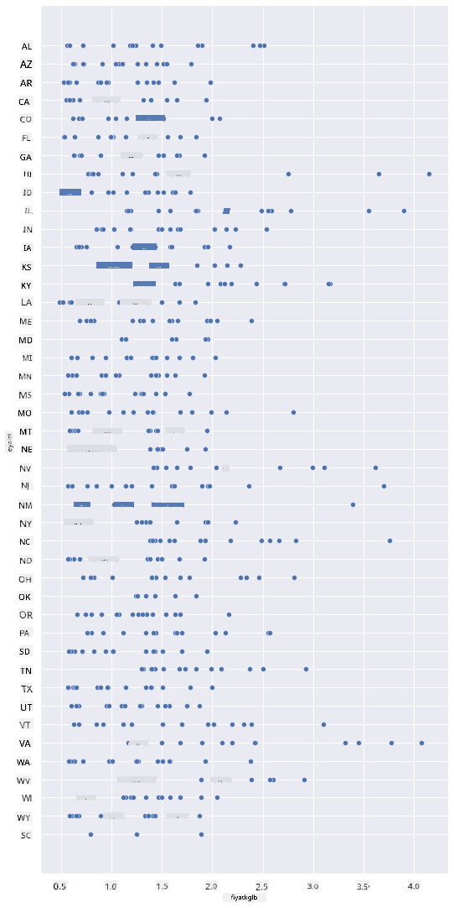
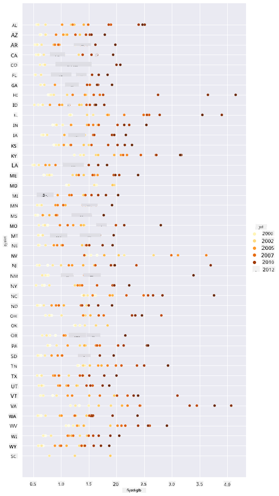
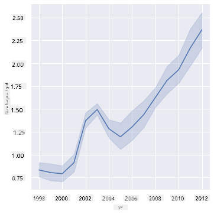
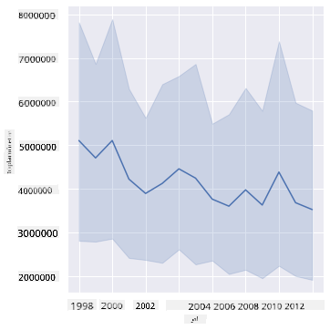
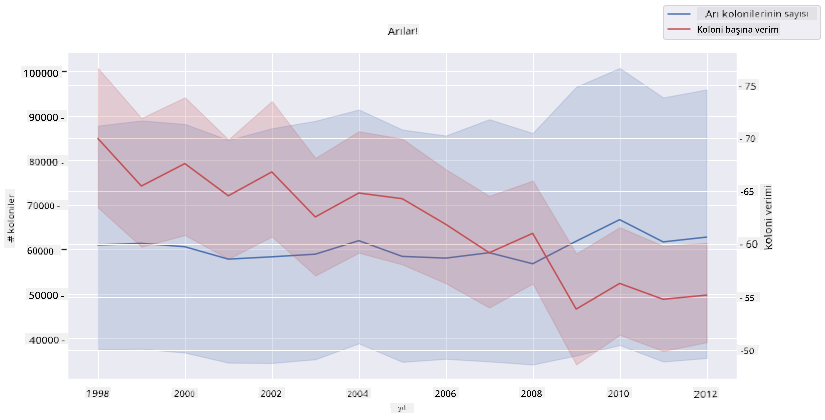

<!--
CO_OP_TRANSLATOR_METADATA:
{
  "original_hash": "cad419b574d5c35eaa417e9abfdcb0c8",
  "translation_date": "2025-08-28T11:16:01+00:00",
  "source_file": "3-Data-Visualization/12-visualization-relationships/README.md",
  "language_code": "tr"
}
-->
# İlişkileri Görselleştirme: Bal Hakkında Her Şey 🍯

| ](../../sketchnotes/12-Visualizing-Relationships.png)|
|:---:|
|İlişkileri Görselleştirme - _Sketchnote by [@nitya](https://twitter.com/nitya)_ |

Araştırmamızın doğa odaklı temasına devam ederek, [Amerika Birleşik Devletleri Tarım Bakanlığı](https://www.nass.usda.gov/About_NASS/index.php) tarafından sağlanan bir veri setine göre, çeşitli bal türleri arasındaki ilişkileri göstermek için ilginç görselleştirmeler keşfedelim.

Yaklaşık 600 öğeden oluşan bu veri seti, birçok ABD eyaletindeki bal üretimini göstermektedir. Örneğin, 1998-2012 yılları arasında her bir eyalet için yıllık bir satır olacak şekilde, bir eyaletteki koloni sayısını, koloni başına verimi, toplam üretimi, stokları, pound başına fiyatı ve üretilen balın değerini inceleyebilirsiniz.

Bir eyaletin yıllık üretimi ile o eyaletteki bal fiyatı arasındaki ilişkiyi görselleştirmek ilginç olabilir. Alternatif olarak, eyaletlerin koloni başına bal verimi arasındaki ilişkiyi görselleştirebilirsiniz. Bu zaman aralığı, 2006 yılında ilk kez görülen yıkıcı 'Koloni Çöküş Bozukluğu' (CCD) (http://npic.orst.edu/envir/ccd.html) dönemini kapsadığı için çalışılması anlamlı bir veri setidir. 🐝

## [Ders Öncesi Test](https://purple-hill-04aebfb03.1.azurestaticapps.net/quiz/22)

Bu derste, daha önce kullandığınız Seaborn kütüphanesini, değişkenler arasındaki ilişkileri görselleştirmek için kullanabilirsiniz. Özellikle ilginç olan, Seaborn'un `relplot` fonksiyonunun kullanımıdır. Bu fonksiyon, veri bilimcilerin değişkenlerin birbirleriyle nasıl ilişkili olduğunu daha iyi anlamalarını sağlayan '[istatistiksel ilişkileri](https://seaborn.pydata.org/tutorial/relational.html?highlight=relationships)' hızlı bir şekilde görselleştirmek için dağılım grafikleri ve çizgi grafikleri oluşturur.

## Dağılım Grafikleri

Bal fiyatının eyalet bazında yıllar içinde nasıl değiştiğini göstermek için bir dağılım grafiği kullanın. Seaborn'un `relplot` fonksiyonu, eyalet verilerini gruplar ve hem kategorik hem de sayısal veriler için veri noktalarını görüntüler.

Hadi verileri ve Seaborn'u içe aktararak başlayalım:

```python
import pandas as pd
import matplotlib.pyplot as plt
import seaborn as sns
honey = pd.read_csv('../../data/honey.csv')
honey.head()
```
Bal verilerinin yıl ve pound başına fiyat gibi birkaç ilginç sütunu olduğunu fark edeceksiniz. ABD eyaletlerine göre gruplandırılmış bu verileri inceleyelim:

| state | numcol | yieldpercol | totalprod | stocks   | priceperlb | prodvalue | year |
| ----- | ------ | ----------- | --------- | -------- | ---------- | --------- | ---- |
| AL    | 16000  | 71          | 1136000   | 159000   | 0.72       | 818000    | 1998 |
| AZ    | 55000  | 60          | 3300000   | 1485000  | 0.64       | 2112000   | 1998 |
| AR    | 53000  | 65          | 3445000   | 1688000  | 0.59       | 2033000   | 1998 |
| CA    | 450000 | 83          | 37350000  | 12326000 | 0.62       | 23157000  | 1998 |
| CO    | 27000  | 72          | 1944000   | 1594000  | 0.7        | 1361000   | 1998 |

Koloni başına pound fiyatı ile balın üretildiği ABD eyaleti arasındaki ilişkiyi göstermek için temel bir dağılım grafiği oluşturun. `y` eksenini tüm eyaletleri gösterecek kadar uzun yapın:

```python
sns.relplot(x="priceperlb", y="state", data=honey, height=15, aspect=.5);
```


Şimdi, aynı verileri yıllar içinde fiyatın nasıl değiştiğini göstermek için bir bal renk şemasıyla gösterin. Bunu, yıllar içindeki değişimi göstermek için bir 'hue' parametresi ekleyerek yapabilirsiniz:

> ✅ Seaborn'da kullanabileceğiniz [renk paletleri hakkında daha fazla bilgi edinin](https://seaborn.pydata.org/tutorial/color_palettes.html) - güzel bir gökkuşağı renk şeması deneyin!

```python
sns.relplot(x="priceperlb", y="state", hue="year", palette="YlOrBr", data=honey, height=15, aspect=.5);
```


Bu renk şeması değişikliğiyle, pound başına bal fiyatında yıllar içinde belirgin bir artış olduğunu görebilirsiniz. Gerçekten de, verilerde bir örnek seti doğrulamak için (örneğin Arizona'yı seçin) yıllar içinde fiyat artışlarının bir modelini, birkaç istisna dışında görebilirsiniz:

| state | numcol | yieldpercol | totalprod | stocks  | priceperlb | prodvalue | year |
| ----- | ------ | ----------- | --------- | ------- | ---------- | --------- | ---- |
| AZ    | 55000  | 60          | 3300000   | 1485000 | 0.64       | 2112000   | 1998 |
| AZ    | 52000  | 62          | 3224000   | 1548000 | 0.62       | 1999000   | 1999 |
| AZ    | 40000  | 59          | 2360000   | 1322000 | 0.73       | 1723000   | 2000 |
| AZ    | 43000  | 59          | 2537000   | 1142000 | 0.72       | 1827000   | 2001 |
| AZ    | 38000  | 63          | 2394000   | 1197000 | 1.08       | 2586000   | 2002 |
| AZ    | 35000  | 72          | 2520000   | 983000  | 1.34       | 3377000   | 2003 |
| AZ    | 32000  | 55          | 1760000   | 774000  | 1.11       | 1954000   | 2004 |
| AZ    | 36000  | 50          | 1800000   | 720000  | 1.04       | 1872000   | 2005 |
| AZ    | 30000  | 65          | 1950000   | 839000  | 0.91       | 1775000   | 2006 |
| AZ    | 30000  | 64          | 1920000   | 902000  | 1.26       | 2419000   | 2007 |
| AZ    | 25000  | 64          | 1600000   | 336000  | 1.26       | 2016000   | 2008 |
| AZ    | 20000  | 52          | 1040000   | 562000  | 1.45       | 1508000   | 2009 |
| AZ    | 24000  | 77          | 1848000   | 665000  | 1.52       | 2809000   | 2010 |
| AZ    | 23000  | 53          | 1219000   | 427000  | 1.55       | 1889000   | 2011 |
| AZ    | 22000  | 46          | 1012000   | 253000  | 1.79       | 1811000   | 2012 |

Başka bir yolu, renk yerine boyutu kullanarak bu ilerlemeyi görselleştirmektir. Renk körü kullanıcılar için bu daha iyi bir seçenek olabilir. Görselleştirmenizi, fiyat artışını nokta çevresinin artışıyla gösterecek şekilde düzenleyin:

```python
sns.relplot(x="priceperlb", y="state", size="year", data=honey, height=15, aspect=.5);
```
Noktaların boyutunun kademeli olarak arttığını görebilirsiniz.


Bu basit bir arz ve talep meselesi mi? İklim değişikliği ve koloni çöküşü gibi faktörler nedeniyle, yıllar içinde satın alınabilir daha az bal mı var ve bu nedenle fiyat mı artıyor?

Bu veri setindeki bazı değişkenler arasındaki bir korelasyonu keşfetmek için, bazı çizgi grafiklerini inceleyelim.

## Çizgi Grafikler

Soru: Pound başına bal fiyatında yıllar içinde net bir artış var mı? Bunu en kolay şekilde tek bir çizgi grafiği oluşturarak keşfedebilirsiniz:

```python
sns.relplot(x="year", y="priceperlb", kind="line", data=honey);
```
Cevap: Evet, 2003 yılı civarındaki bazı istisnalarla birlikte:



✅ Seaborn, bir çizgi etrafında verileri topladığı için, "her x değeri için birden fazla ölçümü ortalama ve ortalama etrafındaki %95 güven aralığını çizerek" gösterir. [Kaynak](https://seaborn.pydata.org/tutorial/relational.html). Bu zaman alıcı davranış, `ci=None` eklenerek devre dışı bırakılabilir.

Soru: Peki, 2003 yılında bal arzında bir artış da görebilir miyiz? Yıllar içinde toplam üretime bakarsanız ne olur?

```python
sns.relplot(x="year", y="totalprod", kind="line", data=honey);
```



Cevap: Pek değil. Toplam üretime bakarsanız, aslında o yıl belirgin bir artış olduğu görülüyor, ancak genel olarak bu yıllar boyunca üretilen bal miktarının azaldığı görülüyor.

Soru: Bu durumda, 2003 yılı civarındaki bal fiyatındaki artışa ne sebep olmuş olabilir?

Bunu keşfetmek için bir facet grid'i inceleyebilirsiniz.

## Facet Grid'ler

Facet grid'ler, veri setinizin bir yönünü (bizim durumumuzda 'yıl'ı seçebilirsiniz) alır. Seaborn, seçtiğiniz x ve y koordinatları için her bir facet için bir grafik oluşturabilir, böylece görsel karşılaştırmayı kolaylaştırır. 2003 yılı bu tür bir karşılaştırmada öne çıkıyor mu?

Seaborn'un [belgelerinde önerildiği](https://seaborn.pydata.org/generated/seaborn.FacetGrid.html?highlight=facetgrid#seaborn.FacetGrid) gibi `relplot` kullanmaya devam ederek bir facet grid oluşturun.

```python
sns.relplot(
    data=honey, 
    x="yieldpercol", y="numcol",
    col="year", 
    col_wrap=3,
    kind="line"
```
Bu görselleştirmede, koloni başına verim ve koloni sayısını yıllar içinde yan yana, sütunlar için 3 ile sarılmış olarak karşılaştırabilirsiniz:


Bu veri seti için, yıllar ve eyaletler arasında koloni sayısı ve verim açısından özellikle dikkat çeken bir şey yok. Bu iki değişken arasında bir korelasyon bulmanın farklı bir yolu var mı?

## Çift Çizgi Grafikler

Seaborn'un 'despine' özelliğini kullanarak üst ve sağ omurgaları kaldırın ve Matplotlib'den türetilen `ax.twinx` [kaynağını](https://matplotlib.org/stable/api/_as_gen/matplotlib.axes.Axes.twinx.html) kullanarak iki çizgi grafiği üst üste bindirin. Twinx, bir grafiğin x eksenini paylaşmasını ve iki y ekseni görüntülemesini sağlar. Böylece, koloni başına verim ve koloni sayısını üst üste bindirilmiş olarak görüntüleyin:

```python
fig, ax = plt.subplots(figsize=(12,6))
lineplot = sns.lineplot(x=honey['year'], y=honey['numcol'], data=honey, 
                        label = 'Number of bee colonies', legend=False)
sns.despine()
plt.ylabel('# colonies')
plt.title('Honey Production Year over Year');

ax2 = ax.twinx()
lineplot2 = sns.lineplot(x=honey['year'], y=honey['yieldpercol'], ax=ax2, color="r", 
                         label ='Yield per colony', legend=False) 
sns.despine(right=False)
plt.ylabel('colony yield')
ax.figure.legend();
```


2003 yılı civarında göze çarpan bir şey olmasa da, bu dersi biraz daha mutlu bir notla bitirmemizi sağlıyor: genel olarak azalan koloni sayısına rağmen, koloni sayısı sabitleniyor, hatta koloni başına verim azalsa bile.

Haydi arılar, devam edin!

🐝❤️
## 🚀 Zorluk

Bu derste, dağılım grafikleri ve çizgi grid'lerinin diğer kullanımları hakkında biraz daha bilgi edindiniz, facet grid'ler dahil. Daha önceki derslerde kullandığınız farklı bir veri seti kullanarak bir facet grid oluşturmayı deneyin. Bunları oluşturmanın ne kadar sürdüğünü ve bu teknikleri kullanırken kaç tane grid çizmeniz gerektiğine dikkat etmeniz gerektiğini not edin.
## [Ders Sonrası Test](https://purple-hill-04aebfb03.1.azurestaticapps.net/quiz/23)

## Gözden Geçirme ve Kendi Kendine Çalışma

Çizgi grafikleri basit veya oldukça karmaşık olabilir. [Seaborn belgelerinde](https://seaborn.pydata.org/generated/seaborn.lineplot.html) çizgi grafikleri oluşturmanın çeşitli yolları hakkında biraz okuyun. Bu derste oluşturduğunuz çizgi grafiklerini, belgelerde listelenen diğer yöntemlerle geliştirmeyi deneyin.
## Ödev

[Arı kovanına dalın](assignment.md)

---

**Feragatname**:  
Bu belge, AI çeviri hizmeti [Co-op Translator](https://github.com/Azure/co-op-translator) kullanılarak çevrilmiştir. Doğruluk için çaba göstersek de, otomatik çevirilerin hata veya yanlışlıklar içerebileceğini lütfen unutmayın. Belgenin orijinal dili, yetkili kaynak olarak kabul edilmelidir. Kritik bilgiler için profesyonel insan çevirisi önerilir. Bu çevirinin kullanımından kaynaklanan yanlış anlamalar veya yanlış yorumlamalar için sorumluluk kabul etmiyoruz.