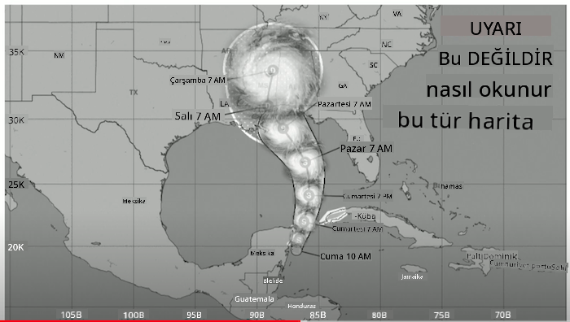
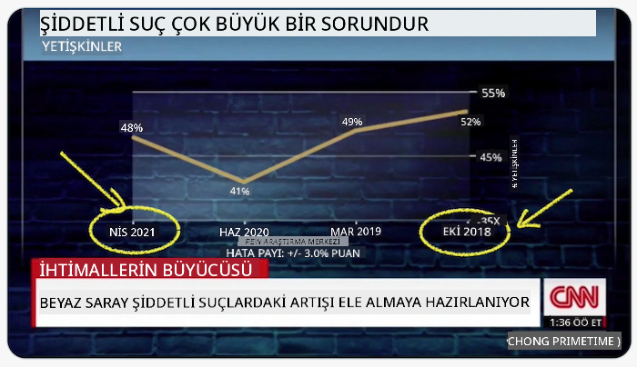
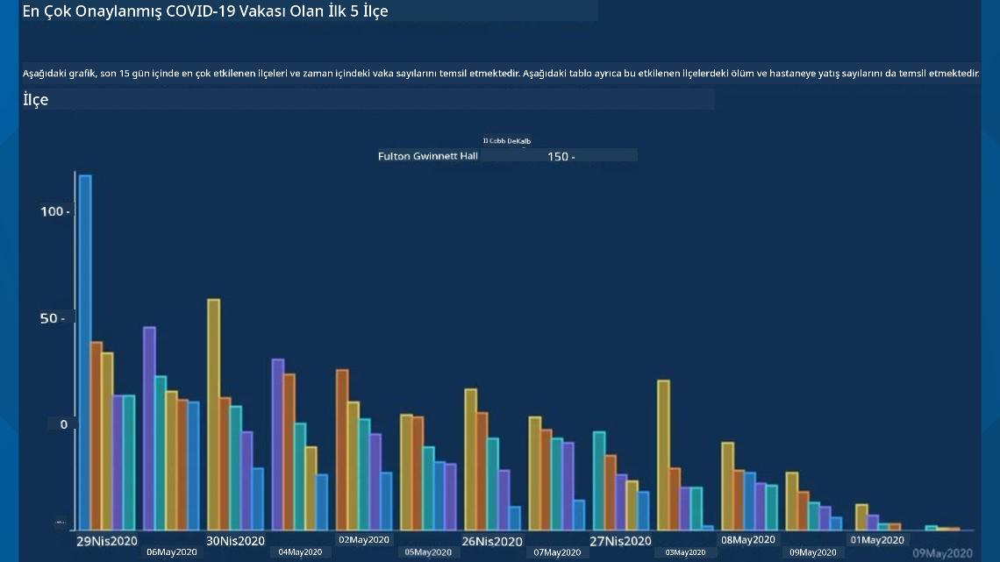
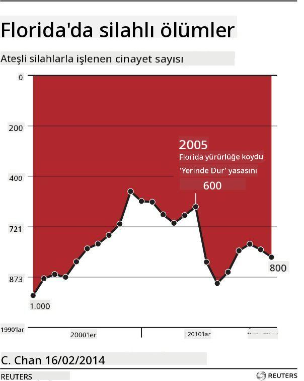
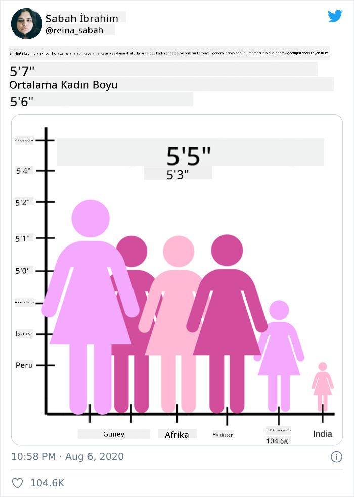
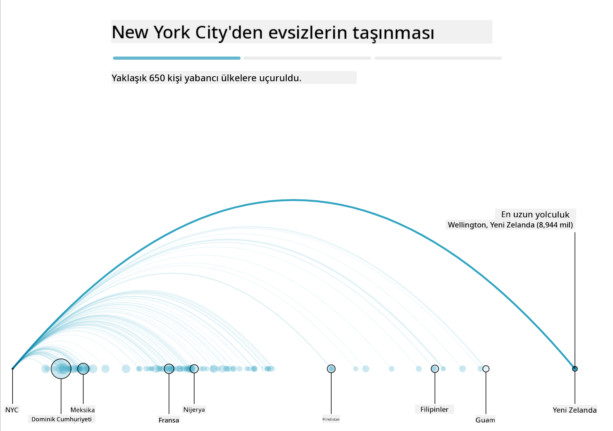
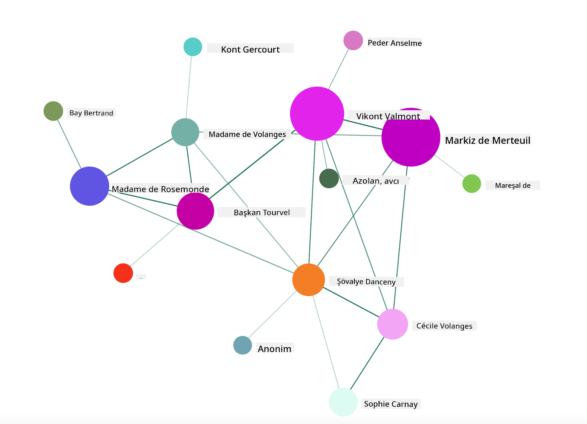

<!--
CO_OP_TRANSLATOR_METADATA:
{
  "original_hash": "4ec4747a9f4f7d194248ea29903ae165",
  "translation_date": "2025-08-28T11:14:07+00:00",
  "source_file": "3-Data-Visualization/13-meaningful-visualizations/README.md",
  "language_code": "tr"
}
-->
# Anlamlı Görselleştirmeler Yapmak

| ](../../sketchnotes/13-MeaningfulViz.png)|
|:---:|
| Anlamlı Görselleştirmeler - _Sketchnote by [@nitya](https://twitter.com/nitya)_ |

> "Veriyi yeterince işkence ederseniz, her şeyi itiraf eder." -- [Ronald Coase](https://en.wikiquote.org/wiki/Ronald_Coase)

Bir veri bilimcisinin temel becerilerinden biri, sahip olduğunuz soruları yanıtlamaya yardımcı olacak anlamlı bir veri görselleştirmesi oluşturma yeteneğidir. Verilerinizi görselleştirmeden önce, önceki derslerde olduğu gibi temizlenmiş ve hazırlanmış olduğundan emin olmanız gerekir. Bundan sonra, verileri en iyi şekilde nasıl sunacağınızı belirlemeye başlayabilirsiniz.

Bu derste şunları gözden geçireceksiniz:

1. Doğru grafik türünü nasıl seçersiniz
2. Yanıltıcı grafiklerden nasıl kaçınırsınız
3. Renklerle nasıl çalışırsınız
4. Grafiklerinizi okunabilirlik için nasıl tasarlarsınız
5. Animasyonlu veya 3D grafik çözümleri nasıl oluşturulur
6. Yaratıcı bir görselleştirme nasıl yapılır

## [Ders Öncesi Test](https://purple-hill-04aebfb03.1.azurestaticapps.net/quiz/24)

## Doğru grafik türünü seçmek

Önceki derslerde, Matplotlib ve Seaborn kullanarak her türlü ilginç veri görselleştirmesi oluşturmayı denediniz. Genel olarak, sorduğunuz soruya uygun [doğru grafik türünü](https://chartio.com/learn/charts/how-to-select-a-data-vizualization/) bu tabloyu kullanarak seçebilirsiniz:

| Yapmanız gereken:          | Kullanmanız gereken:            |
| -------------------------- | ------------------------------- |
| Zaman içindeki veri trendlerini göstermek | Çizgi                          |
| Kategorileri karşılaştırmak | Çubuk, Pasta                    |
| Toplamları karşılaştırmak   | Pasta, Yığılmış Çubuk           |
| İlişkileri göstermek        | Dağılım, Çizgi, Facet, Çift Çizgi |
| Dağılımları göstermek       | Dağılım, Histogram, Kutu        |
| Oranları göstermek          | Pasta, Donut, Waffle            |

> ✅ Verilerinizin yapısına bağlı olarak, belirli bir grafiğin desteklenmesi için metinden sayısala dönüştürmeniz gerekebilir.

## Yanıltıcı grafiklerden kaçınmak

Bir veri bilimci doğru grafik türünü doğru veri için dikkatlice seçse bile, veriler genellikle bir noktayı kanıtlamak için, çoğu zaman verinin kendisini baltalama pahasına, yanıltıcı bir şekilde gösterilebilir. Yanıltıcı grafikler ve infografikler hakkında birçok örnek bulunmaktadır!

[](https://www.youtube.com/watch?v=oX74Nge8Wkw "How charts lie")

> 🎥 Yanıltıcı grafikler hakkında bir konferans konuşması için yukarıdaki görsele tıklayın

Bu grafik, X eksenini ters çevirerek tarihe dayalı olarak gerçeğin tam tersini gösteriyor:



[Bu grafik](https://media.firstcoastnews.com/assets/WTLV/images/170ae16f-4643-438f-b689-50d66ca6a8d8/170ae16f-4643-438f-b689-50d66ca6a8d8_1140x641.jpg) daha da yanıltıcıdır, çünkü göz sağa doğru çekilerek zamanla COVID vakalarının çeşitli ilçelerde azaldığı sonucuna varır. Aslında, tarihlere yakından bakarsanız, bu yanıltıcı düşüş eğilimini vermek için yeniden düzenlendiklerini görürsünüz.



Bu kötü şöhretli örnek, yanıltmak için renk ve ters çevrilmiş Y eksenini kullanır: silah dostu yasaların geçmesinden sonra silah ölümlerinin arttığı sonucuna varmak yerine, göz tam tersinin doğru olduğunu düşünmek için kandırılır:



Bu garip grafik, oranların nasıl manipüle edilebileceğini, komik bir şekilde gösteriyor:



Karşılaştırılamaz olanı karşılaştırmak, başka bir gölgeli hiledir. [Harika bir web sitesi](https://tylervigen.com/spurious-correlations), Maine'deki boşanma oranı ile margarin tüketimi gibi şeyleri ilişkilendiren 'uydurma korelasyonlar' hakkında 'gerçekler' sergiliyor. Bir Reddit grubu ayrıca [verilerin çirkin kullanımlarını](https://www.reddit.com/r/dataisugly/top/?t=all) toplar.

Gözün yanıltıcı grafiklerle ne kadar kolay kandırılabileceğini anlamak önemlidir. Veri bilimcisinin niyeti iyi olsa bile, çok fazla kategori gösteren bir pasta grafiği gibi kötü bir grafik türü seçimi yanıltıcı olabilir.

## Renk

Yukarıdaki 'Florida silah şiddeti' grafiğinde, özellikle Matplotlib ve Seaborn gibi çeşitli onaylanmış renk kütüphaneleri ve paletleriyle gelen kütüphaneler kullanılarak tasarlanmamış grafiklerde, rengin grafiklere ek bir anlam katmanı sağlayabileceğini gördünüz. Bir grafiği elle yapıyorsanız, biraz [renk teorisi](https://colormatters.com/color-and-design/basic-color-theory) çalışması yapın.

> ✅ Grafik tasarlarken, erişilebilirliğin görselleştirmenin önemli bir yönü olduğunu unutmayın. Bazı kullanıcılar renk körü olabilir - grafiğiniz görme engelli kullanıcılar için iyi görüntüleniyor mu?

Grafiğiniz için renk seçerken dikkatli olun, çünkü renk istemediğiniz bir anlam taşıyabilir. Yukarıdaki 'boy' grafiğindeki 'pembe kadınlar', grafiğin kendisinin tuhaflığını artıran belirgin bir 'kadınsı' anlam taşır.

[Renk anlamı](https://colormatters.com/color-symbolism/the-meanings-of-colors) dünyanın farklı bölgelerinde farklı olabilir ve genellikle tonlarına göre anlam değiştirir. Genel olarak, renk anlamları şunları içerir:

| Renk   | Anlam               |
| ------ | ------------------- |
| kırmızı | güç                 |
| mavi    | güven, sadakat      |
| sarı    | mutluluk, dikkat    |
| yeşil   | ekoloji, şans, kıskançlık |
| mor     | mutluluk            |
| turuncu | canlılık            |

Özel renklerle bir grafik oluşturmakla görevlendirildiyseniz, grafiklerinizin hem erişilebilir olduğundan hem de seçtiğiniz rengin iletmeye çalıştığınız anlamla örtüştüğünden emin olun.

## Grafiklerinizi okunabilirlik için tasarlamak

Grafikler, okunabilir olmadıklarında anlamlı değildir! Verilerinizle iyi ölçeklenecek şekilde grafiğinizin genişliğini ve yüksekliğini tasarlamayı düşünmek için bir an durun. Bir değişkenin (örneğin tüm 50 eyalet) görüntülenmesi gerekiyorsa, mümkünse Y ekseninde dikey olarak gösterin, böylece yatay kaydırmalı bir grafik oluşmasından kaçının.

Eksenlerinizi etiketleyin, gerekirse bir açıklama sağlayın ve verilerin daha iyi anlaşılması için ipuçları sunun.

Verileriniz X ekseninde metinsel ve ayrıntılıysa, daha iyi okunabilirlik için metni açılı hale getirebilirsiniz. [Matplotlib](https://matplotlib.org/stable/tutorials/toolkits/mplot3d.html) verileriniz destekliyorsa 3D grafikler sunar. `mpl_toolkits.mplot3d` kullanarak sofistike veri görselleştirmeleri üretilebilir.


## Animasyon ve 3D grafik gösterimi

Bugün en iyi veri görselleştirmelerinden bazıları animasyonludur. Shirley Wu, D3 ile yapılan '[film flowers](http://bl.ocks.org/sxywu/raw/d612c6c653fb8b4d7ff3d422be164a5d/)' gibi harika görselleştirmeler yapmıştır; burada her çiçek bir filmin görselleştirmesidir. Guardian için başka bir örnek 'bussed out', NYC'nin evsiz sorununu insanları şehirden otobüsle çıkararak nasıl ele aldığını göstermek için görselleştirmeleri Greensock ve D3 ile birleştiren etkileşimli bir deneyimdir.



> "Bussed Out: Amerika Evsizlerini Nasıl Hareket Ettiriyor" [Guardian'dan](https://www.theguardian.com/us-news/ng-interactive/2017/dec/20/bussed-out-america-moves-homeless-people-country-study). Görselleştirmeler Nadieh Bremer & Shirley Wu tarafından.

Bu ders, bu güçlü görselleştirme kütüphanelerini öğretmek için derinlemesine gitmek için yetersiz olsa da, D3'ü bir Vue.js uygulamasında deneyerek "Tehlikeli İlişkiler" kitabının animasyonlu bir sosyal ağ görselleştirmesini oluşturmayı deneyebilirsiniz.

> "Les Liaisons Dangereuses" bir mektup romanıdır, yani bir dizi mektup olarak sunulan bir romandır. 1782'de Choderlos de Laclos tarafından yazılmıştır ve 18. yüzyılın sonlarında Fransız aristokrasisinin iki rakip kahramanı olan Vicomte de Valmont ve Marquise de Merteuil'in acımasız, ahlaki açıdan yozlaşmış sosyal manevralarını anlatır. Her ikisi de sonunda yok olur, ancak büyük bir sosyal zarar vermeden önce değil. Roman, çevrelerindeki çeşitli insanlara yazılan, intikam planlayan veya sadece sorun çıkarmak için yazılan bir dizi mektup olarak gelişir. Bu mektupların görselleştirmesini oluşturarak anlatının anahtar figürlerini görsel olarak keşfedin.

Bir sosyal ağın animasyonlu bir görünümünü gösterecek bir web uygulaması tamamlayacaksınız. Bu uygulama, Vue.js ve D3 kullanarak bir [ağ görselleştirmesi](https://github.com/emiliorizzo/vue-d3-network) oluşturmak için tasarlanmış bir kütüphane kullanır. Uygulama çalışırken, ekran üzerindeki düğümleri çekerek verileri karıştırabilirsiniz.



## Proje: D3.js kullanarak bir ağ göstermek için grafik oluşturun

> Bu ders klasörü, referansınız için tamamlanmış projeyi bulabileceğiniz bir `solution` klasörü içerir.

1. Başlangıç klasörünün kökündeki README.md dosyasındaki talimatları izleyin. Proje bağımlılıklarını yüklemeden önce makinenizde NPM ve Node.js'nin çalıştığından emin olun.

2. `starter/src` klasörünü açın. Bir .json dosyasının tüm mektupları numaralandırılmış, 'to' ve 'from' açıklamalarıyla birlikte bulabileceğiniz bir `assets` klasörü keşfedeceksiniz.

3. Görselleştirmeyi etkinleştirmek için `components/Nodes.vue` dosyasındaki kodu tamamlayın. `createLinks()` adlı yöntemi bulun ve aşağıdaki iç içe döngüyü ekleyin.

.json nesnesini döngüye alarak mektupların 'to' ve 'from' verilerini yakalayın ve görselleştirme kütüphanesinin tüketebilmesi için `links` nesnesini oluşturun:

```javascript
//loop through letters
      let f = 0;
      let t = 0;
      for (var i = 0; i < letters.length; i++) {
          for (var j = 0; j < characters.length; j++) {
              
            if (characters[j] == letters[i].from) {
              f = j;
            }
            if (characters[j] == letters[i].to) {
              t = j;
            }
        }
        this.links.push({ sid: f, tid: t });
      }
  ```

Uygulamanızı terminalden çalıştırın (npm run serve) ve görselleştirmenin keyfini çıkarın!

## 🚀 Zorluk

İnternette yanıltıcı görselleştirmeleri keşfetmek için bir tur yapın. Yazar kullanıcıyı nasıl kandırıyor ve bu kasıtlı mı? Görselleştirmeleri düzeltmeyi deneyin ve nasıl görünmeleri gerektiğini gösterin.

## [Ders Sonrası Test](https://purple-hill-04aebfb03.1.azurestaticapps.net/quiz/25)

## İnceleme ve Kendi Kendine Çalışma

Yanıltıcı veri görselleştirme hakkında bazı makaleler okuyun:

https://gizmodo.com/how-to-lie-with-data-visualization-1563576606

http://ixd.prattsi.org/2017/12/visual-lies-usability-in-deceptive-data-visualizations/

Tarihi varlıklar ve eserler için bu ilginç görselleştirmelere bir göz atın:

https://handbook.pubpub.org/

Animasyonun görselleştirmelerinizi nasıl geliştirebileceğiyle ilgili bu makaleye göz atın:

https://medium.com/@EvanSinar/use-animation-to-supercharge-data-visualization-cd905a882ad4

## Ödev

[Kendi özel görselleştirmenizi oluşturun](assignment.md)

---

**Feragatname**:  
Bu belge, [Co-op Translator](https://github.com/Azure/co-op-translator) adlı yapay zeka çeviri hizmeti kullanılarak çevrilmiştir. Doğruluk için çaba göstersek de, otomatik çevirilerin hata veya yanlışlıklar içerebileceğini lütfen unutmayın. Belgenin orijinal dili, yetkili kaynak olarak kabul edilmelidir. Kritik bilgiler için profesyonel insan çevirisi önerilir. Bu çevirinin kullanımından kaynaklanan yanlış anlama veya yanlış yorumlamalardan sorumlu değiliz.