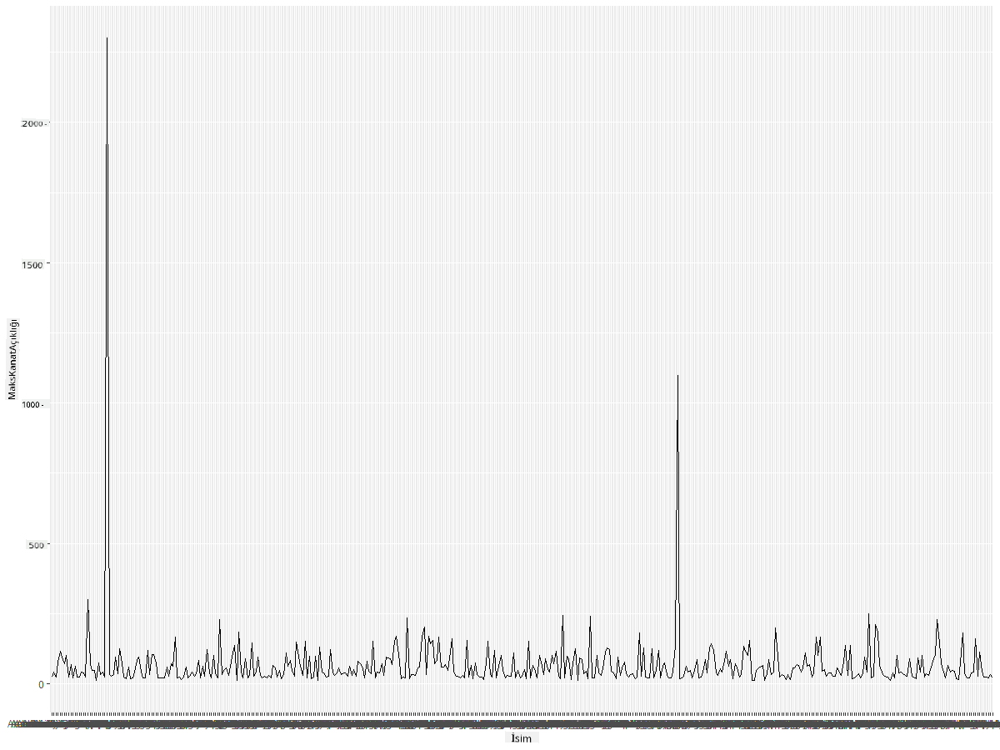
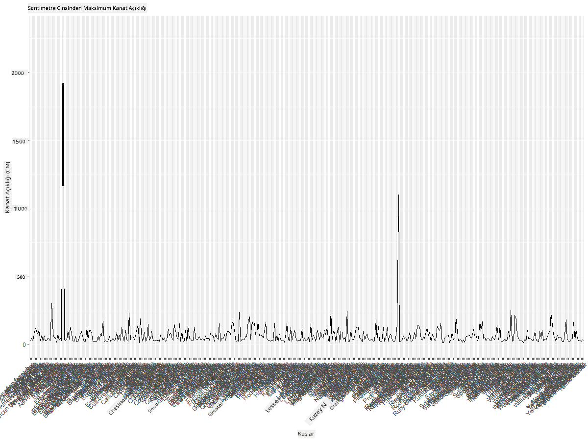
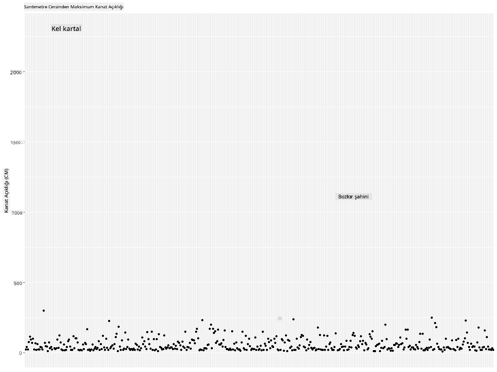
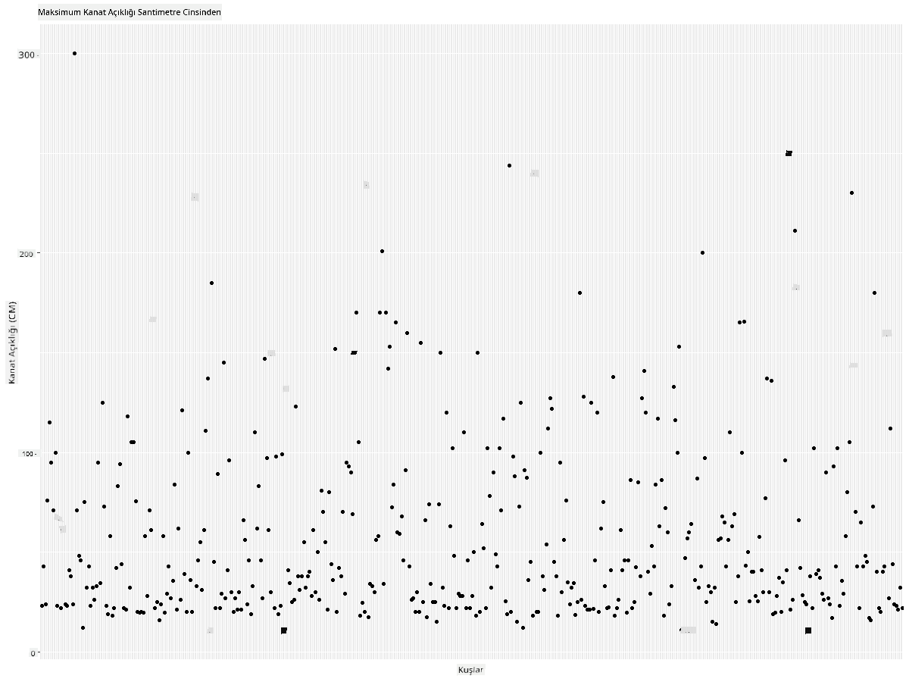
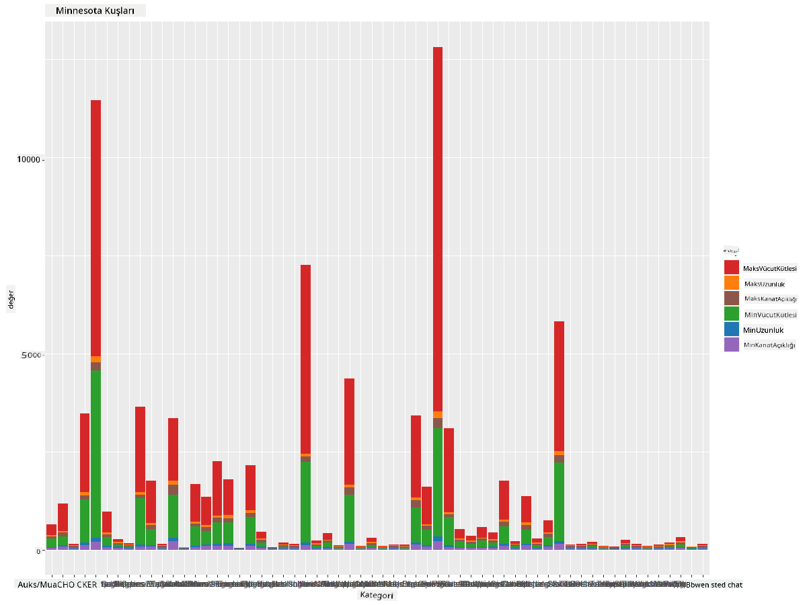
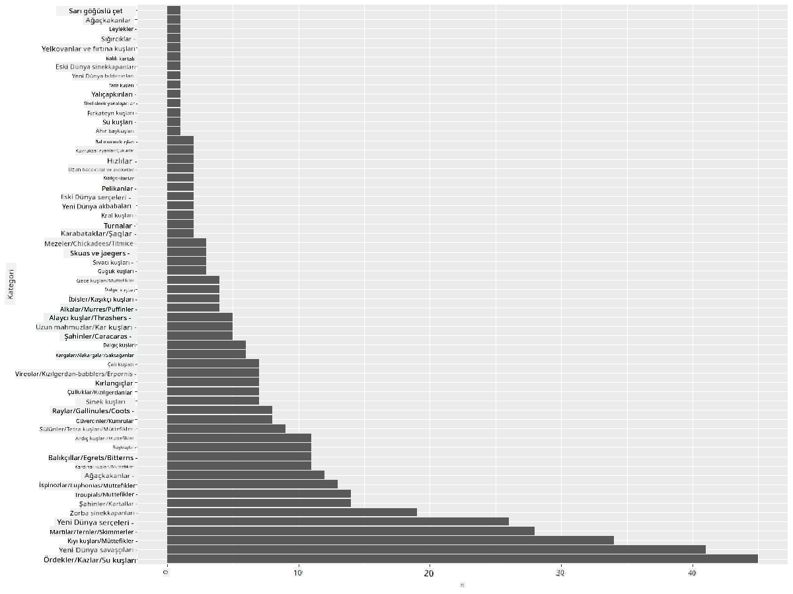
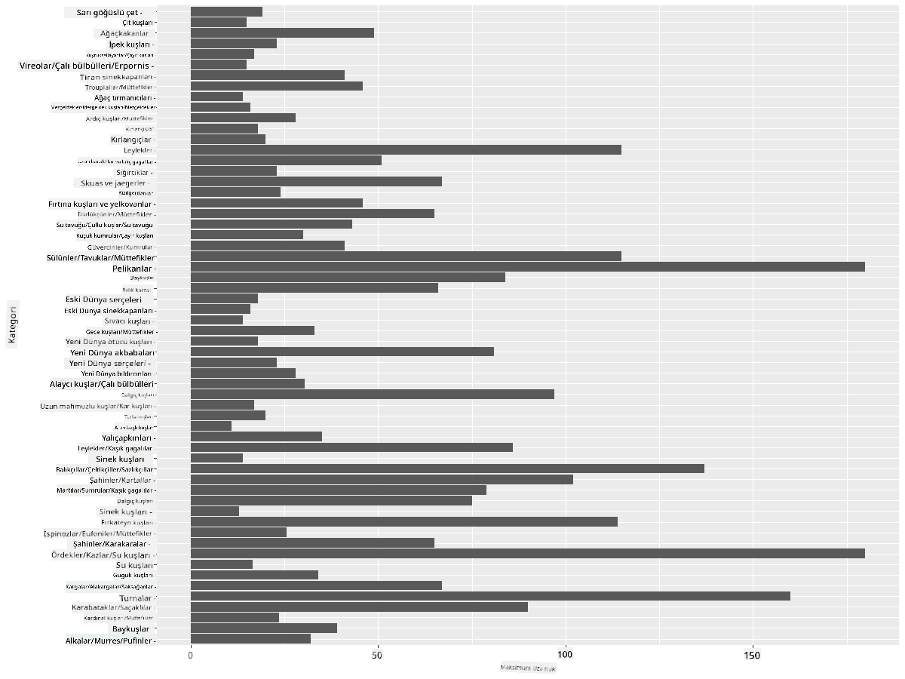
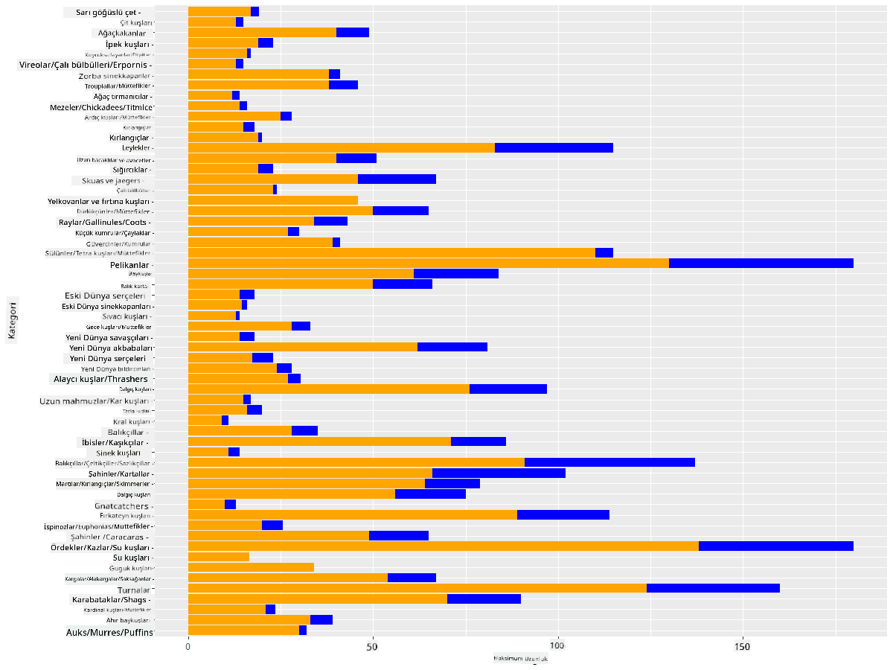

<!--
CO_OP_TRANSLATOR_METADATA:
{
  "original_hash": "22acf28f518a4769ea14fa42f4734b9f",
  "translation_date": "2025-08-28T11:05:33+00:00",
  "source_file": "3-Data-Visualization/R/09-visualization-quantities/README.md",
  "language_code": "tr"
}
-->
# Miktarları Görselleştirme
| ](https://github.com/microsoft/Data-Science-For-Beginners/blob/main/sketchnotes/09-Visualizing-Quantities.png)|
|:---:|
| Miktarları Görselleştirme - _Sketchnote by [@nitya](https://twitter.com/nitya)_ |

Bu derste, miktar kavramı etrafında ilginç görselleştirmeler oluşturmayı öğrenmek için mevcut birçok R paket kütüphanesinden bazılarını nasıl kullanacağınızı keşfedeceksiniz. Minnesota kuşları hakkında temizlenmiş bir veri seti kullanarak, yerel vahşi yaşam hakkında birçok ilginç bilgi edinebilirsiniz.  
## [Ders Öncesi Testi](https://purple-hill-04aebfb03.1.azurestaticapps.net/quiz/16)

## ggplot2 ile kanat açıklığını gözlemleyin
Hem basit hem de karmaşık grafikler ve çeşitli türlerde çizimler oluşturmak için mükemmel bir kütüphane olan [ggplot2](https://cran.r-project.org/web/packages/ggplot2/index.html) ile tanışın. Genel olarak, bu kütüphaneleri kullanarak veri görselleştirme süreci, hedeflemek istediğiniz veri çerçevesi bölümlerini belirlemeyi, gerekli veri dönüşümlerini yapmayı, x ve y ekseni değerlerini atamayı, hangi tür grafiği göstereceğinize karar vermeyi ve ardından grafiği göstermeyi içerir.

`ggplot2`, Grafiklerin Grameri'ne dayalı olarak grafikler oluşturmak için deklaratif bir sistemdir. [Grafiklerin Grameri](https://en.wikipedia.org/wiki/Ggplot2), ölçekler ve katmanlar gibi grafik bileşenlerini semantik parçalara ayıran genel bir veri görselleştirme şemasıdır. Başka bir deyişle, az kodla tek değişkenli veya çok değişkenli veriler için grafikler ve çizimler oluşturmanın kolaylığı, `ggplot2`'yi R'de görselleştirme için en popüler paket haline getirir. Kullanıcı, `ggplot2`'ye değişkenleri estetiklere nasıl eşleştireceğini, hangi grafiksel ilkel öğeleri kullanacağını söyler ve `ggplot2` geri kalanını halleder.

> ✅ Grafik = Veri + Estetik + Geometri
> - Veri, veri setini ifade eder
> - Estetik, incelenecek değişkenleri belirtir (x ve y değişkenleri)
> - Geometri, grafik türünü ifade eder (çizgi grafiği, çubuk grafiği vb.)

Verilerinize ve grafikle anlatmak istediğiniz hikayeye göre en iyi geometriyi (grafik türü) seçin.

> - Eğilimleri analiz etmek için: çizgi, sütun
> - Değerleri karşılaştırmak için: çubuk, sütun, pasta, dağılım grafiği
> - Parçaların bütüne nasıl bağlandığını göstermek için: pasta
> - Verilerin dağılımını göstermek için: dağılım grafiği, çubuk
> - Değerler arasındaki ilişkileri göstermek için: çizgi, dağılım grafiği, balon

✅ Ayrıca ggplot2 için bu açıklayıcı [kılavuzu](https://nyu-cdsc.github.io/learningr/assets/data-visualization-2.1.pdf) inceleyebilirsiniz.

## Kuş kanat açıklığı değerleri hakkında bir çizgi grafiği oluşturun

R konsolunu açın ve veri setini içe aktarın.  
> Not: Veri seti bu depo kök dizininde `/data` klasöründe saklanmıştır.

Veri setini içe aktaralım ve verilerin başını (ilk 5 satırını) gözlemleyelim.

```r
birds <- read.csv("../../data/birds.csv",fileEncoding="UTF-8-BOM")
head(birds)
```  
Verilerin başı, metin ve sayılar karışımından oluşur:

|      | İsim                          | BilimselAd             | Kategori              | Takım         | Aile     | Cins        | KorumaDurumu         | MinUzunluk | MaxUzunluk | MinVücutKütlesi | MaxVücutKütlesi | MinKanatAçıklığı | MaxKanatAçıklığı |
| ---: | :---------------------------- | :--------------------- | :-------------------- | :------------ | :------- | :---------- | :------------------- | ----------: | ----------: | --------------: | --------------: | ---------------: | ---------------: |
|    0 | Kara karınlı ıslıkçı ördek    | Dendrocygna autumnalis | Ördekler/Kazlar/Su Kuşları | Anseriformes | Anatidae | Dendrocygna | LC                   |        47   |        56   |           652   |          1020   |             76   |             94   |
|    1 | Sarımsı ıslıkçı ördek         | Dendrocygna bicolor    | Ördekler/Kazlar/Su Kuşları | Anseriformes | Anatidae | Dendrocygna | LC                   |        45   |        53   |           712   |          1050   |             85   |             93   |
|    2 | Kar kazı                      | Anser caerulescens     | Ördekler/Kazlar/Su Kuşları | Anseriformes | Anatidae | Anser       | LC                   |        64   |        79   |          2050   |          4050   |            135   |            165   |
|    3 | Ross'un kazı                  | Anser rossii           | Ördekler/Kazlar/Su Kuşları | Anseriformes | Anatidae | Anser       | LC                   |      57.3   |        64   |          1066   |          1567   |            113   |            116   |
|    4 | Büyük beyaz alınlı kaz        | Anser albifrons        | Ördekler/Kazlar/Su Kuşları | Anseriformes | Anatidae | Anser       | LC                   |        64   |        81   |          1930   |          3310   |            130   |            165   |

Şimdi bu ilginç kuşların maksimum kanat açıklığını gösteren temel bir çizgi grafiği çizelim.

```r
install.packages("ggplot2")
library("ggplot2")
ggplot(data=birds, aes(x=Name, y=MaxWingspan,group=1)) +
  geom_line() 
```  
Burada `ggplot2` paketini yüklüyor ve ardından `library("ggplot2")` komutuyla çalışma alanına dahil ediyorsunuz. ggplot'ta herhangi bir grafik çizmek için `ggplot()` fonksiyonu kullanılır ve veri seti, x ve y değişkenleri öznitelik olarak belirtilir. Bu durumda, bir çizgi grafiği çizmeyi hedeflediğimiz için `geom_line()` fonksiyonunu kullanıyoruz.



Hemen ne fark ediyorsunuz? En az bir aykırı değer var gibi görünüyor - bu oldukça büyük bir kanat açıklığı! 2000+ santimetrelik bir kanat açıklığı 20 metreden fazladır - Minnesota'da Pterodaktiller mi dolaşıyor? Hadi bunu araştıralım.

Bu aykırı değerleri bulmak için Excel'de hızlı bir sıralama yapabilirsiniz, ancak görselleştirme sürecine grafikten çalışarak devam edin.

X eksenine hangi tür kuşların söz konusu olduğunu göstermek için etiketler ekleyin:

```r
ggplot(data=birds, aes(x=Name, y=MaxWingspan,group=1)) +
  geom_line() +
  theme(axis.text.x = element_text(angle = 45, hjust=1))+
  xlab("Birds") +
  ylab("Wingspan (CM)") +
  ggtitle("Max Wingspan in Centimeters")
```  
`theme` içinde açıyı belirtiyor ve `xlab()` ve `ylab()` ile x ve y ekseni etiketlerini belirtiyorsunuz. `ggtitle()` grafiğe bir ad verir.



Etiketlerin 45 derece döndürülmesine rağmen, okunamayacak kadar çok etiket var. Farklı bir strateji deneyelim: yalnızca aykırı değerleri etiketleyin ve etiketleri grafik içinde ayarlayın. Daha fazla alan yaratmak için bir dağılım grafiği kullanabilirsiniz:

```r
ggplot(data=birds, aes(x=Name, y=MaxWingspan,group=1)) +
  geom_point() +
  geom_text(aes(label=ifelse(MaxWingspan>500,as.character(Name),'')),hjust=0,vjust=0) + 
  theme(axis.title.x=element_blank(), axis.text.x=element_blank(), axis.ticks.x=element_blank())
  ylab("Wingspan (CM)") +
  ggtitle("Max Wingspan in Centimeters") + 
```  
Burada ne oluyor? `geom_point()` fonksiyonunu kullanarak dağılım noktaları çizdiniz. Bununla, `MaxWingspan > 500` olan kuşlar için etiketler eklediniz ve ayrıca grafiği sadeleştirmek için x eksenindeki etiketleri gizlediniz.

Ne keşfediyorsunuz?



## Verilerinizi filtreleyin

Hem Kel Kartal hem de Bozkır Şahini, muhtemelen çok büyük kuşlar olsalar da, maksimum kanat açıklıklarına fazladan bir sıfır eklenmiş gibi görünüyor. 25 metrelik kanat açıklığına sahip bir Kel Kartal ile karşılaşırsanız, lütfen bize bildirin! Bu iki aykırı değeri içermeyen yeni bir veri çerçevesi oluşturalım:

```r
birds_filtered <- subset(birds, MaxWingspan < 500)

ggplot(data=birds_filtered, aes(x=Name, y=MaxWingspan,group=1)) +
  geom_point() +
  ylab("Wingspan (CM)") +
  xlab("Birds") +
  ggtitle("Max Wingspan in Centimeters") + 
  geom_text(aes(label=ifelse(MaxWingspan>500,as.character(Name),'')),hjust=0,vjust=0) +
  theme(axis.text.x=element_blank(), axis.ticks.x=element_blank())
```  
Yeni bir `birds_filtered` veri çerçevesi oluşturduk ve ardından bir dağılım grafiği çizdik. Aykırı değerleri filtreleyerek, verileriniz artık daha tutarlı ve anlaşılır hale geldi.



Kanat açıklığı açısından daha temiz bir veri setine sahip olduğumuza göre, bu kuşlar hakkında daha fazla şey keşfedelim.

Çizgi ve dağılım grafikleri, veri değerleri ve dağılımları hakkında bilgi gösterebilirken, bu veri setinde yer alan değerler hakkında düşünmek istiyoruz. Aşağıdaki miktarlarla ilgili soruları yanıtlamak için görselleştirmeler oluşturabilirsiniz:

> Kuş kategorileri nelerdir ve sayıları nedir?  
> Hangi kuşlar nesli tükenmiş, tehlikede, nadir veya yaygındır?  
> Linnaeus'un terminolojisine göre çeşitli cins ve takımların sayısı nedir?  
## Çubuk grafiklerini keşfedin

Çubuk grafikleri, verilerin gruplandırılmasını göstermeniz gerektiğinde pratiktir. Bu veri setinde hangi kuş kategorilerinin var olduğunu ve hangisinin sayı bakımından en yaygın olduğunu görelim.  
Filtrelenmiş veriler üzerinde bir çubuk grafiği oluşturalım.

```r
install.packages("dplyr")
install.packages("tidyverse")

library(lubridate)
library(scales)
library(dplyr)
library(ggplot2)
library(tidyverse)

birds_filtered %>% group_by(Category) %>%
  summarise(n=n(),
  MinLength = mean(MinLength),
  MaxLength = mean(MaxLength),
  MinBodyMass = mean(MinBodyMass),
  MaxBodyMass = mean(MaxBodyMass),
  MinWingspan=mean(MinWingspan),
  MaxWingspan=mean(MaxWingspan)) %>% 
  gather("key", "value", - c(Category, n)) %>%
  ggplot(aes(x = Category, y = value, group = key, fill = key)) +
  geom_bar(stat = "identity") +
  scale_fill_manual(values = c("#D62728", "#FF7F0E", "#8C564B","#2CA02C", "#1F77B4", "#9467BD")) +                   
  xlab("Category")+ggtitle("Birds of Minnesota")

```  
Aşağıdaki kod parçasında, verileri manipüle etmek ve gruplamak için [dplyr](https://www.rdocumentation.org/packages/dplyr/versions/0.7.8) ve [lubridate](https://www.rdocumentation.org/packages/lubridate/versions/1.8.0) paketlerini yüklüyoruz. Daha sonra `ggplot2` paketini kullanarak bir çubuk grafik çiziyoruz ve farklı kategoriler için renkleri ve etiketleri belirtiyoruz.



Ancak bu çubuk grafiği okunamaz çünkü çok fazla gruplandırılmamış veri var. Çizmek istediğiniz verileri seçmeniz gerekiyor, bu yüzden kuşların kategorilerine göre uzunluklarına bakalım.

Verilerinizi yalnızca kuşların kategorisini içerecek şekilde filtreleyin.

Birçok kategori olduğu için bu grafiği dikey olarak görüntüleyebilir ve tüm verileri hesaba katmak için yüksekliğini ayarlayabilirsiniz:

```r
birds_count<-dplyr::count(birds_filtered, Category, sort = TRUE)
birds_count$Category <- factor(birds_count$Category, levels = birds_count$Category)
ggplot(birds_count,aes(Category,n))+geom_bar(stat="identity")+coord_flip()
```  
Önce `Category` sütunundaki benzersiz değerleri sayar ve ardından bunları yeni bir `birds_count` veri çerçevesine sıralarsınız. Bu sıralanmış veriler aynı seviyede faktörlenir, böylece sıralı bir şekilde çizilir. `ggplot2` kullanarak verileri bir çubuk grafikte çizersiniz. `coord_flip()` yatay çubuklar çizer.



Bu çubuk grafiği, her kategorideki kuş sayısının iyi bir görünümünü sunar. Bir bakışta, bu bölgedeki en büyük kuş sayısının Ördekler/Kazlar/Su Kuşları kategorisinde olduğunu görüyorsunuz. Minnesota '10.000 gölün ülkesi' olduğu için bu şaşırtıcı değil!

✅ Bu veri setinde başka hangi sayımları deneyebilirsiniz? Sizi şaşırtan bir şey var mı?

## Verileri karşılaştırma

Yeni eksenler oluşturarak gruplandırılmış verilerin farklı karşılaştırmalarını deneyebilirsiniz. Bir kuşun kategorisine göre Maksimum Uzunluğunu karşılaştırmayı deneyin:

```r
birds_grouped <- birds_filtered %>%
  group_by(Category) %>%
  summarise(
  MaxLength = max(MaxLength, na.rm = T),
  MinLength = max(MinLength, na.rm = T)
           ) %>%
  arrange(Category)
  
ggplot(birds_grouped,aes(Category,MaxLength))+geom_bar(stat="identity")+coord_flip()
```  
`birds_filtered` verilerini `Category`'ye göre gruplar ve ardından bir çubuk grafik çizersiniz.



Burada şaşırtıcı bir şey yok: sinek kuşlarının Maksimum Uzunluğu, Pelikanlar veya Kazlarla karşılaştırıldığında en azdır. Verilerin mantıklı olması güzel bir şey!

Çubuk grafiklerin daha ilginç görselleştirmelerini, verileri üst üste bindirerek oluşturabilirsiniz. Bir kuş kategorisinde Minimum ve Maksimum Uzunluğu üst üste bindirelim:

```r
ggplot(data=birds_grouped, aes(x=Category)) +
  geom_bar(aes(y=MaxLength), stat="identity", position ="identity",  fill='blue') +
  geom_bar(aes(y=MinLength), stat="identity", position="identity", fill='orange')+
  coord_flip()
```  


## 🚀 Meydan Okuma

Bu kuş veri seti, belirli bir ekosistemdeki farklı kuş türleri hakkında zengin bilgiler sunar. İnternette araştırma yapın ve başka kuş odaklı veri setleri bulabilir misiniz bir bakın. Bu kuşlar etrafında grafikler ve çizimler oluşturarak farkında olmadığınız gerçekleri keşfetmeye çalışın.  
## [Ders Sonrası Testi](https://purple-hill-04aebfb03.1.azurestaticapps.net/quiz/17)

## Gözden Geçirme ve Kendi Kendine Çalışma

Bu ilk ders, miktarları görselleştirmek için `ggplot2` kullanımı hakkında size bazı bilgiler verdi. Veri görselleştirme için başka yollarla çalışmak hakkında araştırma yapın. [Lattice](https://stat.ethz.ch/R-manual/R-devel/library/lattice/html/Lattice.html) ve [Plotly](https://github.com/plotly/plotly.R#readme) gibi diğer paketleri kullanarak görselleştirebileceğiniz veri setlerini araştırın ve keşfedin.

## Ödev
[Çizgiler, Dağılımlar ve Çubuklar](assignment.md)

---

**Feragatname**:  
Bu belge, [Co-op Translator](https://github.com/Azure/co-op-translator) adlı bir yapay zeka çeviri hizmeti kullanılarak çevrilmiştir. Doğruluk için çaba göstersek de, otomatik çevirilerin hata veya yanlışlıklar içerebileceğini lütfen unutmayın. Belgenin orijinal dili, yetkili kaynak olarak kabul edilmelidir. Kritik bilgiler için profesyonel bir insan çevirisi önerilir. Bu çevirinin kullanımından kaynaklanan yanlış anlamalar veya yanlış yorumlamalar için sorumluluk kabul etmiyoruz.