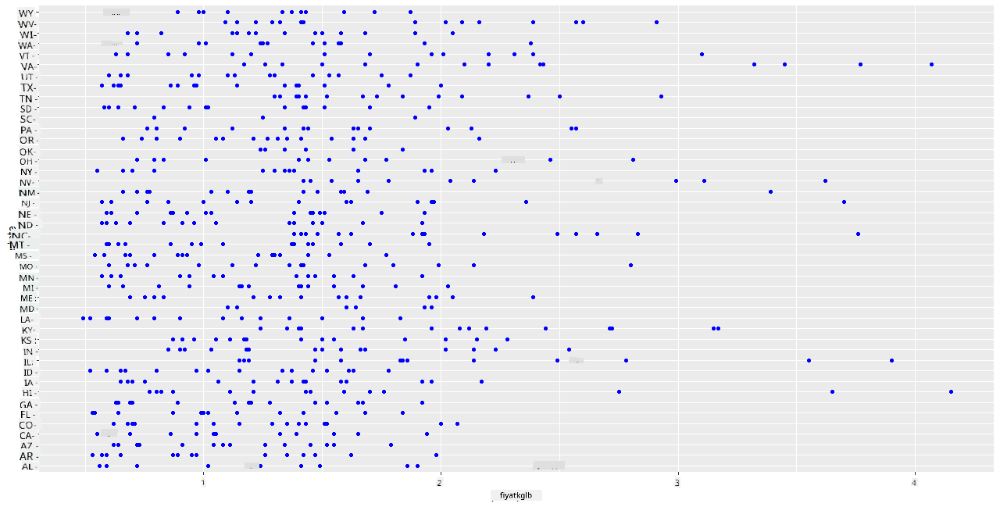
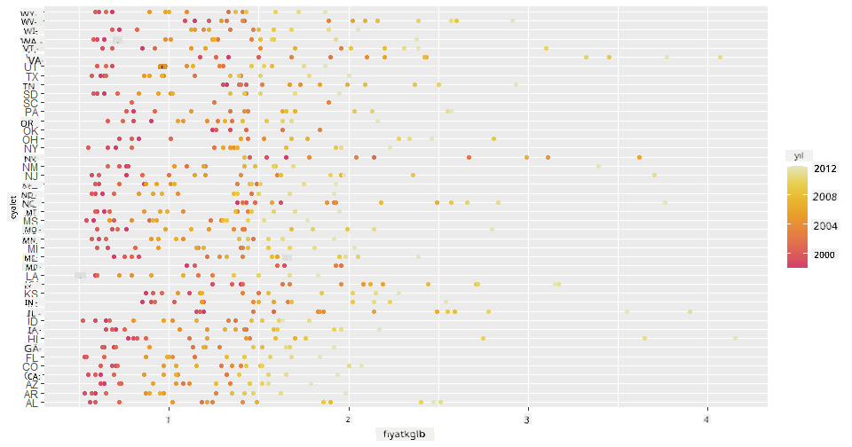
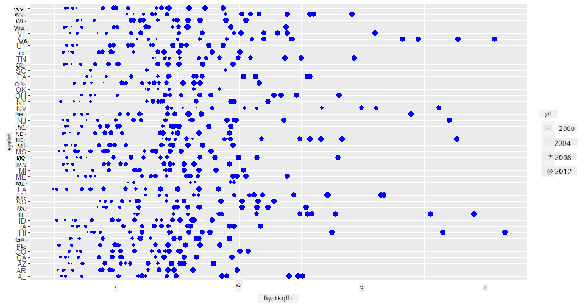
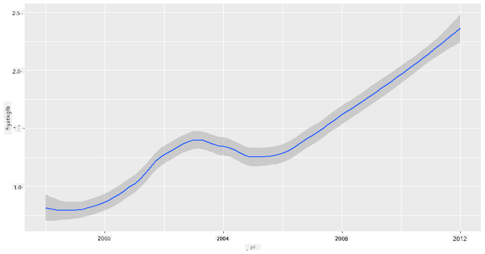
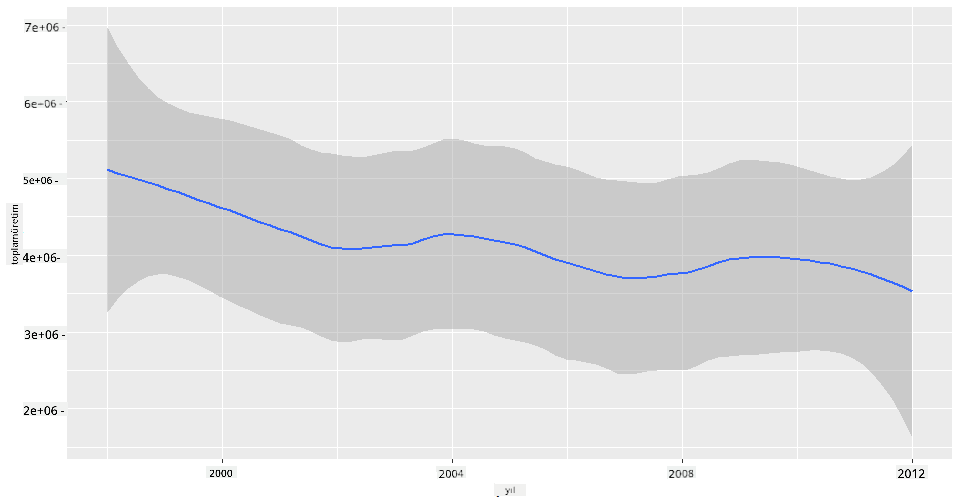
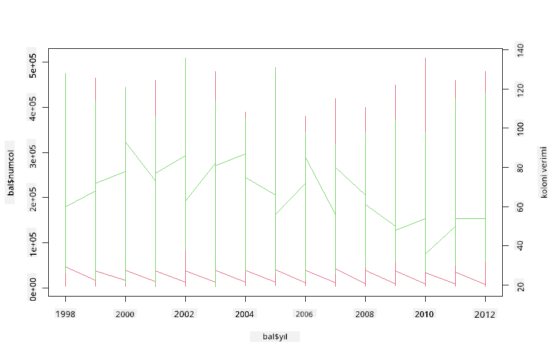

<!--
CO_OP_TRANSLATOR_METADATA:
{
  "original_hash": "a33c5d4b4156a2b41788d8720b6f724c",
  "translation_date": "2025-08-28T11:07:17+00:00",
  "source_file": "3-Data-Visualization/R/12-visualization-relationships/README.md",
  "language_code": "tr"
}
-->
# İlişkileri Görselleştirme: Bal Hakkında Her Şey 🍯

| ](../../../sketchnotes/12-Visualizing-Relationships.png)|
|:---:|
|İlişkileri Görselleştirme - _Sketchnote by [@nitya](https://twitter.com/nitya)_ |

Araştırmamızın doğa odaklı temasına devam ederek, Amerika Birleşik Devletleri Tarım Bakanlığı'ndan ([United States Department of Agriculture](https://www.nass.usda.gov/About_NASS/index.php)) alınan bir veri setine göre farklı bal türleri arasındaki ilişkileri göstermek için ilginç görselleştirmeler keşfedelim.

Yaklaşık 600 öğeden oluşan bu veri seti, birçok ABD eyaletindeki bal üretimini gösteriyor. Örneğin, bir eyaletteki kolonilerin sayısını, koloni başına verimi, toplam üretimi, stokları, pound başına fiyatı ve 1998-2012 yılları arasında üretilen balın değerini inceleyebilirsiniz. Her eyalet için her yıl bir satır olacak şekilde düzenlenmiştir.

Bir eyaletin yıllık üretimi ile o eyaletteki bal fiyatı arasındaki ilişkiyi görselleştirmek ilginç olabilir. Alternatif olarak, eyaletlerin koloni başına bal verimi arasındaki ilişkiyi görselleştirebilirsiniz. Bu zaman aralığı, ilk olarak 2006 yılında görülen 'Koloni Çöküş Bozukluğu' (CCD) (http://npic.orst.edu/envir/ccd.html) gibi yıkıcı bir dönemi kapsadığı için çalışılması anlamlı bir veri setidir. 🐝

## [Ders Öncesi Test](https://purple-hill-04aebfb03.1.azurestaticapps.net/quiz/22)

Bu derste, daha önce kullandığınız ggplot2 kütüphanesini değişkenler arasındaki ilişkileri görselleştirmek için kullanabilirsiniz. Özellikle ilginç olan, ggplot2'nin `geom_point` ve `qplot` fonksiyonlarını kullanarak '[istatistiksel ilişkileri](https://ggplot2.tidyverse.org/)' hızlı bir şekilde görselleştiren dağılım grafikleri ve çizgi grafikleri oluşturma yeteneğidir. Bu, veri bilimcilerin değişkenlerin birbirleriyle nasıl ilişkili olduğunu daha iyi anlamalarını sağlar.

## Dağılım Grafikleri

Bal fiyatının eyalet bazında yıllar içinde nasıl değiştiğini göstermek için bir dağılım grafiği kullanın. ggplot2, `ggplot` ve `geom_point` kullanarak eyalet verilerini gruplar ve hem kategorik hem de sayısal veriler için veri noktalarını görüntüler.

Hadi verileri ve Seaborn'u içe aktararak başlayalım:

```r
honey=read.csv('../../data/honey.csv')
head(honey)
```
Bal verilerinin yıl ve pound başına fiyat gibi birkaç ilginç sütuna sahip olduğunu fark ediyorsunuz. Bu verileri ABD eyaletlerine göre gruplayarak keşfedelim:

| eyalet | numcol | yieldpercol | totalprod | stocks   | priceperlb | prodvalue | year |
| ----- | ------ | ----------- | --------- | -------- | ---------- | --------- | ---- |
| AL    | 16000  | 71          | 1136000   | 159000   | 0.72       | 818000    | 1998 |
| AZ    | 55000  | 60          | 3300000   | 1485000  | 0.64       | 2112000   | 1998 |
| AR    | 53000  | 65          | 3445000   | 1688000  | 0.59       | 2033000   | 1998 |
| CA    | 450000 | 83          | 37350000  | 12326000 | 0.62       | 23157000  | 1998 |
| CO    | 27000  | 72          | 1944000   | 1594000  | 0.7        | 1361000   | 1998 |
| FL    | 230000 | 98          |22540000   | 4508000  | 0.64       | 14426000  | 1998 |

Balın pound başına fiyatı ile ABD'deki üretim eyaleti arasındaki ilişkiyi göstermek için temel bir dağılım grafiği oluşturun. `y` eksenini tüm eyaletleri gösterecek kadar uzun yapın:

```r
library(ggplot2)
ggplot(honey, aes(x = priceperlb, y = state)) +
  geom_point(colour = "blue")
```


Şimdi, aynı verileri yıllar içinde fiyatın nasıl değiştiğini göstermek için bal renk şemasıyla gösterin. Bunu, yıllar içinde değişimi göstermek için 'scale_color_gradientn' parametresini ekleyerek yapabilirsiniz:

> ✅ [scale_color_gradientn](https://www.rdocumentation.org/packages/ggplot2/versions/0.9.1/topics/scale_colour_gradientn) hakkında daha fazla bilgi edinin - güzel bir gökkuşağı renk şeması deneyin!

```r
ggplot(honey, aes(x = priceperlb, y = state, color=year)) +
  geom_point()+scale_color_gradientn(colours = colorspace::heat_hcl(7))
```


Bu renk şeması değişikliğiyle, pound başına bal fiyatında yıllar içinde açık bir ilerleme olduğunu görebilirsiniz. Gerçekten de, verilerde bir örnek seti doğrulamak için (örneğin Arizona'yı seçin) yıllar içinde fiyat artışlarının bir modelini birkaç istisna dışında görebilirsiniz:

| eyalet | numcol | yieldpercol | totalprod | stocks  | priceperlb | prodvalue | year |
| ----- | ------ | ----------- | --------- | ------- | ---------- | --------- | ---- |
| AZ    | 55000  | 60          | 3300000   | 1485000 | 0.64       | 2112000   | 1998 |
| AZ    | 52000  | 62          | 3224000   | 1548000 | 0.62       | 1999000   | 1999 |
| AZ    | 40000  | 59          | 2360000   | 1322000 | 0.73       | 1723000   | 2000 |
| AZ    | 43000  | 59          | 2537000   | 1142000 | 0.72       | 1827000   | 2001 |
| AZ    | 38000  | 63          | 2394000   | 1197000 | 1.08       | 2586000   | 2002 |
| AZ    | 35000  | 72          | 2520000   | 983000  | 1.34       | 3377000   | 2003 |
| AZ    | 32000  | 55          | 1760000   | 774000  | 1.11       | 1954000   | 2004 |
| AZ    | 36000  | 50          | 1800000   | 720000  | 1.04       | 1872000   | 2005 |
| AZ    | 30000  | 65          | 1950000   | 839000  | 0.91       | 1775000   | 2006 |
| AZ    | 30000  | 64          | 1920000   | 902000  | 1.26       | 2419000   | 2007 |
| AZ    | 25000  | 64          | 1600000   | 336000  | 1.26       | 2016000   | 2008 |
| AZ    | 20000  | 52          | 1040000   | 562000  | 1.45       | 1508000   | 2009 |
| AZ    | 24000  | 77          | 1848000   | 665000  | 1.52       | 2809000   | 2010 |
| AZ    | 23000  | 53          | 1219000   | 427000  | 1.55       | 1889000   | 2011 |
| AZ    | 22000  | 46          | 1012000   | 253000  | 1.79       | 1811000   | 2012 |

Bu ilerlemeyi görselleştirmenin başka bir yolu, renk yerine boyut kullanmaktır. Renk körü kullanıcılar için bu daha iyi bir seçenek olabilir. Fiyat artışını nokta çevresinin büyüklüğüyle göstermek için görselleştirmenizi düzenleyin:

```r
ggplot(honey, aes(x = priceperlb, y = state)) +
  geom_point(aes(size = year),colour = "blue") +
  scale_size_continuous(range = c(0.25, 3))
```
Noktaların boyutlarının kademeli olarak arttığını görebilirsiniz.



Bu basit bir arz ve talep meselesi mi? İklim değişikliği ve koloni çöküşü gibi faktörler nedeniyle, yıllar içinde satın alınabilecek daha az bal mı var ve bu nedenle fiyat mı artıyor?

Bu veri setindeki bazı değişkenler arasında bir korelasyon bulmak için çizgi grafiklerini keşfedelim.

## Çizgi Grafikleri

Soru: Balın pound başına fiyatında yıllar içinde açık bir artış var mı? Bunu en kolay şekilde tek bir çizgi grafiği oluşturarak keşfedebilirsiniz:

```r
qplot(honey$year,honey$priceperlb, geom='smooth', span =0.5, xlab = "year",ylab = "priceperlb")
```
Cevap: Evet, 2003 yılı civarındaki bazı istisnalar dışında:



Soru: Peki, 2003 yılında bal arzında bir artış görebiliyor muyuz? Yıllar içinde toplam üretime bakarsanız ne görürsünüz?

```python
qplot(honey$year,honey$totalprod, geom='smooth', span =0.5, xlab = "year",ylab = "totalprod")
```



Cevap: Pek değil. Toplam üretime bakarsanız, aslında o yıl artmış gibi görünüyor, ancak genel olarak bu yıllarda üretilen bal miktarı düşüşte.

Soru: Bu durumda, 2003 civarındaki bal fiyatındaki artışa ne sebep olmuş olabilir?

Bunu keşfetmek için bir facet grid (yüzey ızgarası) oluşturabilirsiniz.

## Facet Grid'ler

Facet grid'ler veri setinizin bir yönünü (bizim durumumuzda 'yıl' seçebilirsiniz) alır ve seçtiğiniz x ve y koordinatları için daha kolay görsel karşılaştırma yapmak üzere her bir facet için bir grafik oluşturur. 2003 yılı bu tür bir karşılaştırmada öne çıkıyor mu?

[ggplot2'nin dokümantasyonunda](https://ggplot2.tidyverse.org/reference/facet_wrap.html) önerildiği gibi `facet_wrap` kullanarak bir facet grid oluşturun.

```r
ggplot(honey, aes(x=yieldpercol, y = numcol,group = 1)) + 
  geom_line() + facet_wrap(vars(year))
```
Bu görselleştirmede, koloni başına verim ve koloni sayısını yıllar içinde yan yana, sütunlar için 3 olarak ayarlanmış bir wrap ile karşılaştırabilirsiniz:


Bu veri seti için, eyaletler ve yıllar arasında koloni sayısı ve verim açısından dikkat çeken bir şey yok. Bu iki değişken arasında bir korelasyon bulmanın farklı bir yolu var mı?

## Çift Çizgi Grafikleri

R'nin `par` ve `plot` fonksiyonlarını kullanarak iki çizgi grafiği üst üste bindirerek çoklu çizgi grafiği deneyin. x ekseninde yılı çizeceğiz ve iki y ekseni göstereceğiz. Yani, koloni başına verim ve koloni sayısını üst üste bindirerek göstereceğiz:

```r
par(mar = c(5, 4, 4, 4) + 0.3)              
plot(honey$year, honey$numcol, pch = 16, col = 2,type="l")              
par(new = TRUE)                             
plot(honey$year, honey$yieldpercol, pch = 17, col = 3,              
     axes = FALSE, xlab = "", ylab = "",type="l")
axis(side = 4, at = pretty(range(y2)))      
mtext("colony yield", side = 4, line = 3)   
```


2003 yılı civarında göze çarpan bir şey olmasa da, bu dersi biraz daha mutlu bir notla bitirmemize olanak tanıyor: genel olarak azalan koloni sayısına rağmen, koloni sayısı sabitleniyor, ancak koloni başına verim azalıyor.

Haydi arılar, devam edin!

🐝❤️
## 🚀 Meydan Okuma

Bu derste, scatterplot'lar ve çizgi grid'lerinin diğer kullanımları hakkında biraz daha bilgi edindiniz, facet grid'ler dahil. Kendinize meydan okuyarak bu teknikleri kullanarak önceki derslerde kullandığınız farklı bir veri setiyle bir facet grid oluşturun. Bunları oluşturmanın ne kadar sürdüğünü ve bu teknikleri kullanırken kaç tane grid çizmeniz gerektiğine dikkat etmeniz gerektiğini not edin.
## [Ders Sonrası Test](https://purple-hill-04aebfb03.1.azurestaticapps.net/quiz/23)

## İnceleme ve Kendi Kendine Çalışma

Çizgi grafikleri basit veya oldukça karmaşık olabilir. [ggplot2 dokümantasyonunda](https://ggplot2.tidyverse.org/reference/geom_path.html#:~:text=geom_line()%20connects%20them%20in,which%20cases%20are%20connected%20together) çizgi grafikleri oluşturmanın çeşitli yolları hakkında biraz okuyun. Bu derste oluşturduğunuz çizgi grafiklerini dokümanlarda listelenen diğer yöntemlerle geliştirmeyi deneyin.
## Ödev

[Arı kovanına dalın](assignment.md)

---

**Feragatname**:  
Bu belge, AI çeviri hizmeti [Co-op Translator](https://github.com/Azure/co-op-translator) kullanılarak çevrilmiştir. Doğruluk için çaba göstersek de, otomatik çevirilerin hata veya yanlışlıklar içerebileceğini lütfen unutmayın. Belgenin orijinal dili, yetkili kaynak olarak kabul edilmelidir. Kritik bilgiler için profesyonel bir insan çevirisi önerilir. Bu çevirinin kullanımından kaynaklanan yanlış anlamalar veya yanlış yorumlamalardan sorumlu değiliz.