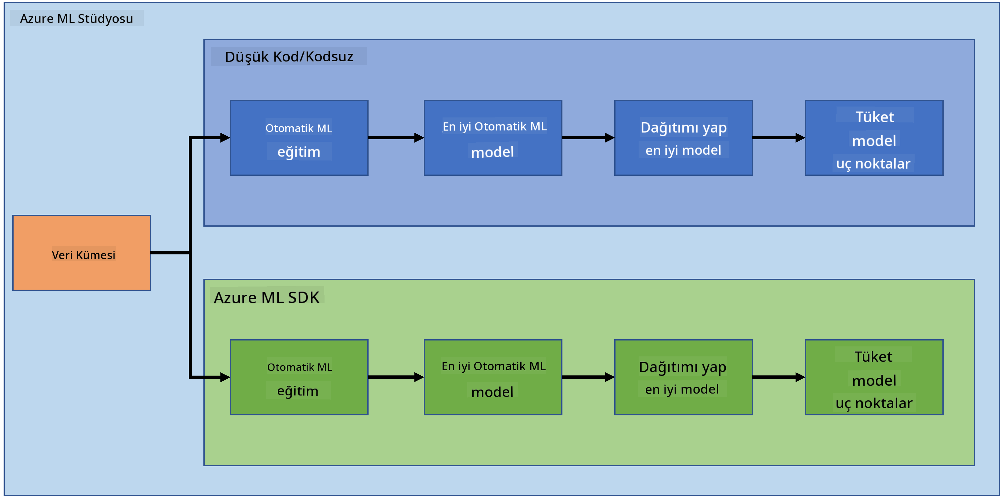
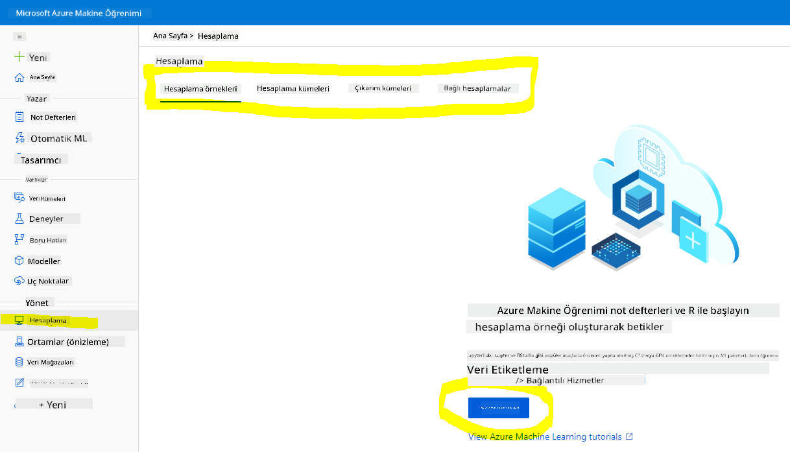
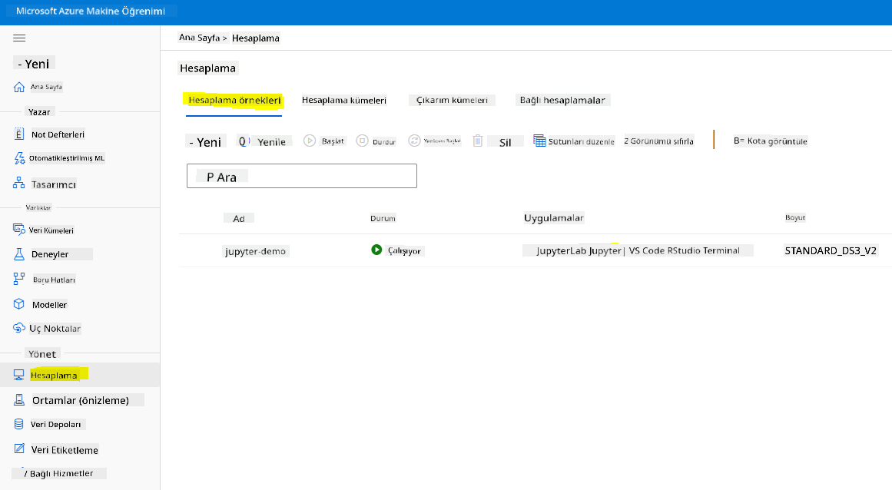
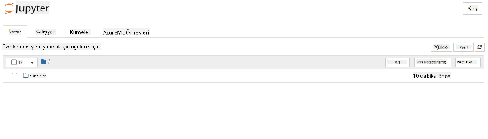

<!--
CO_OP_TRANSLATOR_METADATA:
{
  "original_hash": "73dead89dc2ddda4d6ec0232814a191e",
  "translation_date": "2025-08-28T10:44:40+00:00",
  "source_file": "5-Data-Science-In-Cloud/19-Azure/README.md",
  "language_code": "tr"
}
-->
# Bulutta Veri Bilimi: "Azure ML SDK" Yöntemi

| ](../../sketchnotes/19-DataScience-Cloud.png)|
|:---:|
| Bulutta Veri Bilimi: Azure ML SDK - _Sketchnote by [@nitya](https://twitter.com/nitya)_ |

İçindekiler:

- [Bulutta Veri Bilimi: "Azure ML SDK" Yöntemi](../../../../5-Data-Science-In-Cloud/19-Azure)
  - [Ders Öncesi Test](../../../../5-Data-Science-In-Cloud/19-Azure)
  - [1. Giriş](../../../../5-Data-Science-In-Cloud/19-Azure)
    - [1.1 Azure ML SDK Nedir?](../../../../5-Data-Science-In-Cloud/19-Azure)
    - [1.2 Kalp yetmezliği tahmin projesi ve veri kümesi tanıtımı](../../../../5-Data-Science-In-Cloud/19-Azure)
  - [2. Azure ML SDK ile bir model eğitmek](../../../../5-Data-Science-In-Cloud/19-Azure)
    - [2.1 Bir Azure ML çalışma alanı oluşturma](../../../../5-Data-Science-In-Cloud/19-Azure)
    - [2.2 Bir hesaplama örneği oluşturma](../../../../5-Data-Science-In-Cloud/19-Azure)
    - [2.3 Veri Kümesini Yükleme](../../../../5-Data-Science-In-Cloud/19-Azure)
    - [2.4 Not Defterleri Oluşturma](../../../../5-Data-Science-In-Cloud/19-Azure)
    - [2.5 Bir model eğitmek](../../../../5-Data-Science-In-Cloud/19-Azure)
      - [2.5.1 Çalışma alanı, deney, hesaplama kümesi ve veri kümesini ayarlama](../../../../5-Data-Science-In-Cloud/19-Azure)
      - [2.5.2 AutoML Yapılandırması ve eğitim](../../../../5-Data-Science-In-Cloud/19-Azure)
  - [3. Azure ML SDK ile model dağıtımı ve uç nokta tüketimi](../../../../5-Data-Science-In-Cloud/19-Azure)
    - [3.1 En iyi modeli kaydetme](../../../../5-Data-Science-In-Cloud/19-Azure)
    - [3.2 Model Dağıtımı](../../../../5-Data-Science-In-Cloud/19-Azure)
    - [3.3 Uç nokta tüketimi](../../../../5-Data-Science-In-Cloud/19-Azure)
  - [🚀 Meydan Okuma](../../../../5-Data-Science-In-Cloud/19-Azure)
  - [Ders Sonrası Test](../../../../5-Data-Science-In-Cloud/19-Azure)
  - [Gözden Geçirme ve Kendi Kendine Çalışma](../../../../5-Data-Science-In-Cloud/19-Azure)
  - [Ödev](../../../../5-Data-Science-In-Cloud/19-Azure)

## [Ders Öncesi Test](https://purple-hill-04aebfb03.1.azurestaticapps.net/quiz/36)

## 1. Giriş

### 1.1 Azure ML SDK Nedir?

Veri bilimciler ve yapay zeka geliştiricileri, Azure Machine Learning SDK'sını kullanarak Azure Machine Learning hizmetiyle makine öğrenimi iş akışları oluşturur ve çalıştırır. Bu hizmetle Jupyter Notebooks, Visual Studio Code veya favori Python IDE'niz gibi herhangi bir Python ortamında etkileşim kurabilirsiniz.

SDK'nın temel alanları şunlardır:

- Makine öğrenimi deneylerinde kullanılan veri kümelerinin yaşam döngüsünü keşfetme, hazırlama ve yönetme.
- Makine öğrenimi deneylerinizi izlemek, günlük kaydı yapmak ve düzenlemek için bulut kaynaklarını yönetme.
- Modelleri yerel olarak veya GPU hızlandırmalı model eğitimi dahil olmak üzere bulut kaynaklarını kullanarak eğitme.
- Yapılandırma parametrelerini ve eğitim verilerini kabul eden otomatik makine öğrenimini kullanma. Bu, algoritmalar ve hiperparametre ayarları arasında otomatik olarak iterasyon yaparak tahmin çalıştırmak için en iyi modeli bulur.
- Eğitilmiş modellerinizi RESTful hizmetlere dönüştürmek için web hizmetleri dağıtma ve bu hizmetleri herhangi bir uygulamada kullanma.

[Azure Machine Learning SDK hakkında daha fazla bilgi edinin](https://docs.microsoft.com/python/api/overview/azure/ml?WT.mc_id=academic-77958-bethanycheum&ocid=AID3041109)

[Önceki derste](../18-Low-Code/README.md), bir modeli Düşük Kod/Hiç Kod kullanarak nasıl eğiteceğimizi, dağıtacağımızı ve tüketeceğimizi gördük. Kalp Yetmezliği veri kümesini kullanarak bir Kalp Yetmezliği tahmin modeli oluşturduk. Bu derste, aynı işlemi Azure Machine Learning SDK'sını kullanarak gerçekleştireceğiz.



### 1.2 Kalp yetmezliği tahmin projesi ve veri kümesi tanıtımı

Kalp yetmezliği tahmin projesi ve veri kümesi tanıtımı için [buraya](../18-Low-Code/README.md) göz atın.

## 2. Azure ML SDK ile bir model eğitmek

### 2.1 Bir Azure ML çalışma alanı oluşturma

Basitlik açısından, bir jupyter not defteri üzerinde çalışacağız. Bu, zaten bir Çalışma Alanınız ve bir hesaplama örneğiniz olduğu anlamına gelir. Eğer zaten bir Çalışma Alanınız varsa, doğrudan **2.3 Not Defteri Oluşturma** bölümüne geçebilirsiniz.

Eğer yoksa, bir çalışma alanı oluşturmak için [önceki dersteki](../18-Low-Code/README.md) **2.1 Bir Azure ML çalışma alanı oluşturma** bölümündeki talimatları izleyin.

### 2.2 Bir hesaplama örneği oluşturma

Daha önce oluşturduğumuz [Azure ML çalışma alanına](https://ml.azure.com/) gidin, hesaplama menüsüne tıklayın ve mevcut hesaplama kaynaklarını göreceksiniz.



Bir jupyter not defteri sağlamak için bir hesaplama örneği oluşturalım.  
1. + Yeni düğmesine tıklayın.  
2. Hesaplama örneğinize bir ad verin.  
3. Seçeneklerinizi belirleyin: CPU veya GPU, VM boyutu ve çekirdek sayısı.  
4. Oluştur düğmesine tıklayın.

Tebrikler, bir hesaplama örneği oluşturdunuz! Bu hesaplama örneğini [Not Defterleri Oluşturma](../../../../5-Data-Science-In-Cloud/19-Azure) bölümünde bir Not Defteri oluşturmak için kullanacağız.

### 2.3 Veri Kümesini Yükleme

Eğer veri kümesini henüz yüklemediyseniz, [önceki dersteki](../18-Low-Code/README.md) **2.3 Veri Kümesini Yükleme** bölümüne bakın.

### 2.4 Not Defterleri Oluşturma

> **_NOT:_** Bir sonraki adım için ya sıfırdan yeni bir not defteri oluşturabilir ya da [oluşturduğumuz not defterini](notebook.ipynb) Azure ML Studio'ya yükleyebilirsiniz. Yüklemek için, "Not Defteri" menüsüne tıklayın ve not defterini yükleyin.

Not defterleri, veri bilimi sürecinin gerçekten önemli bir parçasıdır. Keşifsel Veri Analizi (EDA) yapmak, bir model eğitmek için bir hesaplama kümesine çağrı yapmak veya bir uç nokta dağıtmak için bir çıkarım kümesine çağrı yapmak için kullanılabilirler.

Bir Not Defteri oluşturmak için, jupyter not defteri örneğini çalıştıran bir hesaplama düğümüne ihtiyacımız var. [Azure ML çalışma alanına](https://ml.azure.com/) geri dönün ve Hesaplama örneklerine tıklayın. Daha önce oluşturduğumuz [hesaplama örneğini](../../../../5-Data-Science-In-Cloud/19-Azure) listede görmelisiniz.

1. Uygulamalar bölümünde, Jupyter seçeneğine tıklayın.  
2. "Evet, anladım" kutusunu işaretleyin ve Devam düğmesine tıklayın.  
  
3. Bu, aşağıdaki gibi jupyter not defteri örneğinizle yeni bir tarayıcı sekmesi açmalıdır. Yeni bir not defteri oluşturmak için "Yeni" düğmesine tıklayın.  



Artık bir Not Defterimiz olduğuna göre, Azure ML SDK ile modeli eğitmeye başlayabiliriz.

### 2.5 Bir model eğitmek

Herhangi bir şüpheniz olduğunda, [Azure ML SDK belgelerine](https://docs.microsoft.com/python/api/overview/azure/ml?WT.mc_id=academic-77958-bethanycheum&ocid=AID3041109) başvurun. Bu belgeler, bu derste göreceğimiz modülleri anlamak için gerekli tüm bilgileri içerir.

#### 2.5.1 Çalışma alanı, deney, hesaplama kümesi ve veri kümesini ayarlama

`workspace` nesnesini yapılandırma dosyasından aşağıdaki kodu kullanarak yüklemeniz gerekir:

```python
from azureml.core import Workspace
ws = Workspace.from_config()
```

Bu, çalışma alanını temsil eden bir `Workspace` türünde bir nesne döndürür. Ardından, aşağıdaki kodu kullanarak bir `deney` oluşturmanız gerekir:

```python
from azureml.core import Experiment
experiment_name = 'aml-experiment'
experiment = Experiment(ws, experiment_name)
```  
Bir çalışma alanından bir deneyi almak veya oluşturmak için, deney adını kullanarak deneyi talep edersiniz. Deney adı 3-36 karakter uzunluğunda olmalı, bir harf veya rakamla başlamalı ve yalnızca harfler, rakamlar, alt çizgiler ve tireler içerebilir. Çalışma alanında deney bulunamazsa, yeni bir deney oluşturulur.

Şimdi, aşağıdaki kodu kullanarak eğitim için bir hesaplama kümesi oluşturmanız gerekir. Bu adım birkaç dakika sürebilir.

```python
from azureml.core.compute import AmlCompute

aml_name = "heart-f-cluster"
try:
    aml_compute = AmlCompute(ws, aml_name)
    print('Found existing AML compute context.')
except:
    print('Creating new AML compute context.')
    aml_config = AmlCompute.provisioning_configuration(vm_size = "Standard_D2_v2", min_nodes=1, max_nodes=3)
    aml_compute = AmlCompute.create(ws, name = aml_name, provisioning_configuration = aml_config)
    aml_compute.wait_for_completion(show_output = True)

cts = ws.compute_targets
compute_target = cts[aml_name]
```

Veri kümesini, çalışma alanından veri kümesi adını kullanarak şu şekilde alabilirsiniz:

```python
dataset = ws.datasets['heart-failure-records']
df = dataset.to_pandas_dataframe()
df.describe()
```

#### 2.5.2 AutoML Yapılandırması ve eğitim

AutoML yapılandırmasını ayarlamak için [AutoMLConfig sınıfını](https://docs.microsoft.com/python/api/azureml-train-automl-client/azureml.train.automl.automlconfig(class)?WT.mc_id=academic-77958-bethanycheum&ocid=AID3041109) kullanın.

Belgelerde açıklandığı gibi, oynayabileceğiniz birçok parametre vardır. Bu proje için aşağıdaki parametreleri kullanacağız:

- `experiment_timeout_minutes`: Deneyin otomatik olarak durdurulmadan önce çalışmasına izin verilen maksimum süre (dakika cinsinden).  
- `max_concurrent_iterations`: Deney için izin verilen maksimum eşzamanlı eğitim iterasyonu sayısı.  
- `primary_metric`: Deneyin durumunu belirlemek için kullanılan birincil metrik.  
- `compute_target`: Otomatik Makine Öğrenimi deneyini çalıştırmak için kullanılan Azure Machine Learning hesaplama hedefi.  
- `task`: Çalıştırılacak görev türü. Değerler, çözülmesi gereken otomatik ML problemine bağlı olarak 'classification', 'regression' veya 'forecasting' olabilir.  
- `training_data`: Deneyde kullanılacak eğitim verileri. Hem eğitim özelliklerini hem de bir etiket sütununu (isteğe bağlı olarak bir örnek ağırlıkları sütunu) içermelidir.  
- `label_column_name`: Etiket sütununun adı.  
- `path`: Azure Machine Learning proje klasörünün tam yolu.  
- `enable_early_stopping`: Kısa vadede skor iyileşmiyorsa erken sonlandırmayı etkinleştirip etkinleştirmeme.  
- `featurization`: Özellik oluşturma adımının otomatik olarak yapılıp yapılmayacağını veya özelleştirilmiş özellik oluşturmanın kullanılıp kullanılmayacağını belirten gösterge.  
- `debug_log`: Hata ayıklama bilgilerini yazmak için günlük dosyası.  

```python
from azureml.train.automl import AutoMLConfig

project_folder = './aml-project'

automl_settings = {
    "experiment_timeout_minutes": 20,
    "max_concurrent_iterations": 3,
    "primary_metric" : 'AUC_weighted'
}

automl_config = AutoMLConfig(compute_target=compute_target,
                             task = "classification",
                             training_data=dataset,
                             label_column_name="DEATH_EVENT",
                             path = project_folder,  
                             enable_early_stopping= True,
                             featurization= 'auto',
                             debug_log = "automl_errors.log",
                             **automl_settings
                            )
```  
Yapılandırmanızı ayarladıktan sonra, aşağıdaki kodu kullanarak modeli eğitebilirsiniz. Bu adım, küme boyutunuza bağlı olarak bir saate kadar sürebilir.

```python
remote_run = experiment.submit(automl_config)
```  
Farklı deneyleri göstermek için RunDetails widget'ını çalıştırabilirsiniz.  
```python
from azureml.widgets import RunDetails
RunDetails(remote_run).show()
```  

## 3. Azure ML SDK ile model dağıtımı ve uç nokta tüketimi

### 3.1 En iyi modeli kaydetme

`remote_run`, [AutoMLRun](https://docs.microsoft.com/python/api/azureml-train-automl-client/azureml.train.automl.run.automlrun?WT.mc_id=academic-77958-bethanycheum&ocid=AID3041109) türünde bir nesnedir. Bu nesne, en iyi çalışmayı ve karşılık gelen eğitilmiş modeli döndüren `get_output()` yöntemini içerir.

```python
best_run, fitted_model = remote_run.get_output()
```  
Kullanılan parametreleri görmek için fitted_model'i yazdırabilir ve en iyi modelin özelliklerini [get_properties()](https://docs.microsoft.com/python/api/azureml-core/azureml.core.run(class)?view=azure-ml-py#azureml_core_Run_get_properties?WT.mc_id=academic-77958-bethanycheum&ocid=AID3041109) yöntemiyle görebilirsiniz.

```python
best_run.get_properties()
```  

Şimdi modeli [register_model](https://docs.microsoft.com/python/api/azureml-train-automl-client/azureml.train.automl.run.automlrun?view=azure-ml-py#register-model-model-name-none--description-none--tags-none--iteration-none--metric-none-?WT.mc_id=academic-77958-bethanycheum&ocid=AID3041109) yöntemiyle kaydedin.  
```python
model_name = best_run.properties['model_name']
script_file_name = 'inference/score.py'
best_run.download_file('outputs/scoring_file_v_1_0_0.py', 'inference/score.py')
description = "aml heart failure project sdk"
model = best_run.register_model(model_name = model_name,
                                model_path = './outputs/',
                                description = description,
                                tags = None)
```  

### 3.2 Model Dağıtımı

En iyi model kaydedildikten sonra, [InferenceConfig](https://docs.microsoft.com/python/api/azureml-core/azureml.core.model.inferenceconfig?view=azure-ml-py?ocid=AID3041109) sınıfını kullanarak dağıtabilirsiniz. InferenceConfig, dağıtım için kullanılan özel bir ortamın yapılandırma ayarlarını temsil eder. [AciWebservice](https://docs.microsoft.com/python/api/azureml-core/azureml.core.webservice.aciwebservice?view=azure-ml-py) sınıfı, Azure Container Instances üzerinde bir web hizmeti uç noktası olarak dağıtılmış bir makine öğrenimi modelini temsil eder. Dağıtılmış bir hizmet, bir model, betik ve ilişkili dosyalardan oluşturulur. Ortaya çıkan web hizmeti, bir REST API ile yük dengelemesi yapılmış bir HTTP uç noktasıdır. Bu API'ye veri gönderebilir ve modelin döndürdüğü tahmini alabilirsiniz.

Model, [deploy](https://docs.microsoft.com/python/api/azureml-core/azureml.core.model(class)?view=azure-ml-py#deploy-workspace--name--models--inference-config-none--deployment-config-none--deployment-target-none--overwrite-false--show-output-false-?WT.mc_id=academic-77958-bethanycheum&ocid=AID3041109) yöntemiyle dağıtılır.

```python
from azureml.core.model import InferenceConfig, Model
from azureml.core.webservice import AciWebservice

inference_config = InferenceConfig(entry_script=script_file_name, environment=best_run.get_environment())

aciconfig = AciWebservice.deploy_configuration(cpu_cores = 1,
                                               memory_gb = 1,
                                               tags = {'type': "automl-heart-failure-prediction"},
                                               description = 'Sample service for AutoML Heart Failure Prediction')

aci_service_name = 'automl-hf-sdk'
aci_service = Model.deploy(ws, aci_service_name, [model], inference_config, aciconfig)
aci_service.wait_for_deployment(True)
print(aci_service.state)
```  
Bu adım birkaç dakika sürebilir.

### 3.3 Uç nokta tüketimi

Uç noktanızı bir örnek giriş oluşturarak tüketebilirsiniz:

```python
data = {
    "data":
    [
        {
            'age': "60",
            'anaemia': "false",
            'creatinine_phosphokinase': "500",
            'diabetes': "false",
            'ejection_fraction': "38",
            'high_blood_pressure': "false",
            'platelets': "260000",
            'serum_creatinine': "1.40",
            'serum_sodium': "137",
            'sex': "false",
            'smoking': "false",
            'time': "130",
        },
    ],
}

test_sample = str.encode(json.dumps(data))
```  
Ve ardından bu girişi tahmin için modelinize gönderebilirsiniz:  
```python
response = aci_service.run(input_data=test_sample)
response
```
Bu, `'{"result": [false]}'` çıktısını vermelidir. Bu, uç noktaya gönderdiğimiz hasta girdisinin `false` tahminini ürettiği anlamına gelir, yani bu kişinin kalp krizi geçirme olasılığı düşük.

Tebrikler! Azure ML SDK ile Azure ML üzerinde eğitilen ve dağıtılan modeli başarıyla tükettiniz!

> **_NOT:_** Projeyi tamamladıktan sonra, tüm kaynakları silmeyi unutmayın.

## 🚀 Zorluk

SDK aracılığıyla yapabileceğiniz birçok başka şey var, ancak maalesef bu derste hepsini inceleyemiyoruz. İyi haber şu ki, SDK dokümantasyonunda gezinmeyi öğrenmek, kendi başınıza çok yol kat etmenizi sağlayabilir. Azure ML SDK dokümantasyonuna bir göz atın ve size boru hatları oluşturmanıza olanak tanıyan `Pipeline` sınıfını bulun. Bir Pipeline, bir iş akışı olarak yürütülebilen bir dizi adımdan oluşur.

**İPUCU:** [SDK dokümantasyonu](https://docs.microsoft.com/python/api/overview/azure/ml/?view=azure-ml-py?WT.mc_id=academic-77958-bethanycheum&ocid=AID3041109) sayfasına gidin ve arama çubuğuna "Pipeline" gibi anahtar kelimeler yazın. Arama sonuçlarında `azureml.pipeline.core.Pipeline` sınıfını bulmalısınız.

## [Ders sonrası sınav](https://purple-hill-04aebfb03.1.azurestaticapps.net/quiz/37)

## Gözden Geçirme ve Kendi Kendine Çalışma

Bu derste, Azure ML SDK ile bulutta kalp yetmezliği riskini tahmin etmek için bir modeli nasıl eğiteceğinizi, dağıtacağınızı ve tüketeceğinizi öğrendiniz. Azure ML SDK hakkında daha fazla bilgi için bu [dokümantasyonu](https://docs.microsoft.com/python/api/overview/azure/ml/?view=azure-ml-py?WT.mc_id=academic-77958-bethanycheum&ocid=AID3041109) inceleyin. Azure ML SDK ile kendi modelinizi oluşturmaya çalışın.

## Ödev

[Azure ML SDK kullanarak Veri Bilimi projesi](assignment.md)

---

**Feragatname**:  
Bu belge, AI çeviri hizmeti [Co-op Translator](https://github.com/Azure/co-op-translator) kullanılarak çevrilmiştir. Doğruluk için çaba göstersek de, otomatik çevirilerin hata veya yanlışlıklar içerebileceğini lütfen unutmayın. Belgenin orijinal dili, yetkili kaynak olarak kabul edilmelidir. Kritik bilgiler için profesyonel insan çevirisi önerilir. Bu çevirinin kullanımından kaynaklanan yanlış anlamalar veya yanlış yorumlamalar için sorumluluk kabul etmiyoruz.