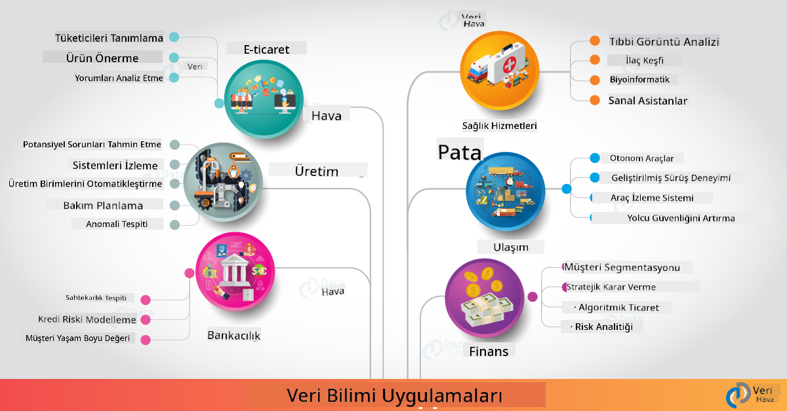

<!--
CO_OP_TRANSLATOR_METADATA:
{
  "original_hash": "67076ed50f54e7d26ba1ba378d6078f1",
  "translation_date": "2025-08-28T11:31:47+00:00",
  "source_file": "6-Data-Science-In-Wild/20-Real-World-Examples/README.md",
  "language_code": "tr"
}
-->
# Gerçek Dünyada Veri Bilimi

|  ](../../sketchnotes/20-DataScience-RealWorld.png) |
| :--------------------------------------------------------------------------------------------------------------: |
|               Gerçek Dünyada Veri Bilimi - _Sketchnote by [@nitya](https://twitter.com/nitya)_               |

Bu öğrenme yolculuğunun sonuna yaklaşıyoruz!

Veri biliminin ve etiğin tanımlarıyla başladık, veri analizi ve görselleştirme için çeşitli araçlar ve teknikleri keşfettik, veri bilimi yaşam döngüsünü gözden geçirdik ve bulut bilişim hizmetleriyle veri bilimi iş akışlarını ölçeklendirme ve otomatikleştirme konularına baktık. Muhtemelen şu soruyu soruyorsunuz: _"Tüm bu öğrendiklerimi gerçek dünya bağlamlarına nasıl uyarlayabilirim?"_

Bu derste, veri biliminin endüstrideki gerçek dünya uygulamalarını keşfedeceğiz ve araştırma, dijital beşeri bilimler ve sürdürülebilirlik bağlamlarında belirli örneklere dalacağız. Öğrenci proje fırsatlarına bakacağız ve öğrenme yolculuğunuzu devam ettirmenize yardımcı olacak faydalı kaynaklarla sonlandıracağız!

## Ders Öncesi Test

[Ders öncesi test](https://purple-hill-04aebfb03.1.azurestaticapps.net/quiz/38)

## Veri Bilimi + Endüstri

Yapay zekanın demokratikleşmesi sayesinde, geliştiriciler artık yapay zeka destekli karar verme ve veri odaklı içgörüleri kullanıcı deneyimlerine ve geliştirme iş akışlarına entegre etmeyi daha kolay buluyor. İşte veri biliminin endüstrideki gerçek dünya uygulamalarına nasıl "uygulandığına" dair birkaç örnek:

 * [Google Flu Trends](https://www.wired.com/2015/10/can-learn-epic-failure-google-flu-trends/) veri bilimi kullanarak arama terimlerini grip trendleriyle ilişkilendirdi. Yaklaşımın kusurları olsa da, veri odaklı sağlık tahminlerinin olasılıkları (ve zorlukları) konusunda farkındalık yarattı.

 * [UPS Routing Predictions](https://www.technologyreview.com/2018/11/21/139000/how-ups-uses-ai-to-outsmart-bad-weather/) - UPS'in hava koşulları, trafik desenleri, teslimat süreleri ve daha fazlasını dikkate alarak teslimat için en uygun rotaları tahmin etmek için veri bilimi ve makine öğrenimini nasıl kullandığını açıklar.

 * [NYC Taxicab Route Visualization](http://chriswhong.github.io/nyctaxi/) - [Bilgi Edinme Özgürlüğü Yasaları](https://chriswhong.com/open-data/foil_nyc_taxi/) kullanılarak toplanan veriler, NYC taksilerinin yoğun şehirde nasıl gezindiğini, kazandıkları parayı ve her 24 saatlik dönemdeki yolculuk sürelerini anlamamıza yardımcı olan bir günün görselleştirilmesini sağladı.

 * [Uber Data Science Workbench](https://eng.uber.com/dsw/) - günlük olarak milyonlarca Uber yolculuğundan toplanan verileri (alım ve bırakma konumları, yolculuk süresi, tercih edilen rotalar vb.) kullanarak fiyatlandırma, güvenlik, dolandırıcılık tespiti ve navigasyon kararları için bir veri analitiği aracı oluşturur.

 * [Sports Analytics](https://towardsdatascience.com/scope-of-analytics-in-sports-world-37ed09c39860) - _öngörücü analitik_ (takım ve oyuncu analizi - [Moneyball](https://datasciencedegree.wisconsin.edu/blog/moneyball-proves-importance-big-data-big-ideas/) düşünün - ve hayran yönetimi) ve _veri görselleştirme_ (takım ve hayran panoları, oyunlar vb.) üzerine odaklanır. Uygulamalar arasında yetenek avı, spor bahisleri ve envanter/mekan yönetimi bulunur.

 * [Bankacılıkta Veri Bilimi](https://data-flair.training/blogs/data-science-in-banking/) - risk modelleme ve dolandırıcılık tespitinden müşteri segmentasyonu, gerçek zamanlı tahmin ve öneri sistemlerine kadar finans sektöründeki veri biliminin değerini vurgular. Öngörücü analitik ayrıca [kredi puanları](https://dzone.com/articles/using-big-data-and-predictive-analytics-for-credit) gibi kritik ölçütleri yönlendirir.

 * [Sağlıkta Veri Bilimi](https://data-flair.training/blogs/data-science-in-healthcare/) - tıbbi görüntüleme (ör. MRI, X-Ray, CT-Scan), genomik (DNA dizilimi), ilaç geliştirme (risk değerlendirmesi, başarı tahmini), öngörücü analitik (hasta bakımı ve tedarik lojistiği), hastalık takibi ve önleme gibi uygulamaları vurgular.

 Görsel Kaynağı: [Data Flair: 6 Amazing Data Science Applications ](https://data-flair.training/blogs/data-science-applications/)

Şekil, veri bilimi tekniklerini uygulamak için diğer alanları ve örnekleri göstermektedir. Diğer uygulamaları keşfetmek ister misiniz? Aşağıdaki [Gözden Geçirme ve Kendi Kendine Çalışma](../../../../6-Data-Science-In-Wild/20-Real-World-Examples) bölümüne göz atın.

## Veri Bilimi + Araştırma

|  ](../../sketchnotes/20-DataScience-Research.png) |
| :---------------------------------------------------------------------------------------------------------------: |
|              Veri Bilimi & Araştırma - _Sketchnote by [@nitya](https://twitter.com/nitya)_              |

Gerçek dünya uygulamaları genellikle ölçekli endüstri kullanım durumlarına odaklanırken, _araştırma_ uygulamaları ve projeleri iki açıdan faydalı olabilir:

* _yenilik fırsatları_ - ileri konseptlerin hızlı prototiplenmesini ve gelecek nesil uygulamalar için kullanıcı deneyimlerinin test edilmesini keşfetmek.
* _uygulama zorlukları_ - veri bilimi teknolojilerinin gerçek dünya bağlamlarında potansiyel zararlarını veya istenmeyen sonuçlarını araştırmak.

Öğrenciler için bu araştırma projeleri, hem öğrenme hem de iş birliği fırsatları sağlayarak konuyu daha iyi anlamalarını ve ilgi alanlarında çalışan ilgili kişiler veya ekiplerle farkındalıklarını ve etkileşimlerini genişletmelerini sağlayabilir. Peki araştırma projeleri nasıl görünür ve nasıl bir etki yaratabilir?

Bir örneğe bakalım - Joy Buolamwini (MIT Media Labs) tarafından yapılan [MIT Gender Shades Study](http://gendershades.org/overview.html) ve Timnit Gebru (o dönemde Microsoft Research'te) ile birlikte yazılan [önemli bir araştırma makalesi](http://proceedings.mlr.press/v81/buolamwini18a/buolamwini18a.pdf) üzerine odaklanmıştır:

 * **Ne:** Araştırma projesinin amacı, _otomatik yüz analizi algoritmalarında ve veri setlerinde cinsiyet ve cilt tipi temelinde mevcut önyargıları değerlendirmekti_.
 * **Neden:** Yüz analizi, kolluk kuvvetleri, havaalanı güvenliği, işe alım sistemleri gibi alanlarda kullanılır - yanlış sınıflandırmalar (ör. önyargı nedeniyle) etkilenen bireyler veya gruplar için potansiyel ekonomik ve sosyal zararlar yaratabilir. Önyargıları anlamak (ve ortadan kaldırmak veya hafifletmek) kullanımda adalet için önemlidir.
 * **Nasıl:** Araştırmacılar, mevcut ölçütlerin ağırlıklı olarak açık tenli denekleri kullandığını fark etti ve cinsiyet ve cilt tipi açısından _daha dengeli_ olan yeni bir veri seti (1000+ görüntü) oluşturdu. Veri seti, üç cinsiyet sınıflandırma ürününün (Microsoft, IBM ve Face++'tan) doğruluğunu değerlendirmek için kullanıldı.

Sonuçlar, genel sınıflandırma doğruluğunun iyi olmasına rağmen, çeşitli alt gruplar arasında hata oranlarında belirgin bir fark olduğunu gösterdi - **yanlış cinsiyetlendirme** kadınlar veya koyu tenli kişiler için daha yüksek olup, önyargıya işaret ediyordu.

**Ana Çıktılar:** Veri biliminin daha _temsil edici veri setlerine_ (dengeli alt gruplar) ve daha _kapsayıcı ekiplere_ (çeşitli geçmişler) ihtiyaç duyduğunu, bu tür önyargıları AI çözümlerinde daha erken tanımak ve ortadan kaldırmak veya hafifletmek için farkındalık yarattı. Bu tür araştırma çabaları, birçok kuruluşun AI ürünleri ve süreçlerinde adaleti artırmak için _sorumlu AI_ ilkelerini ve uygulamalarını tanımlamasında da etkili olmuştur.

**Microsoft'taki ilgili araştırma çabalarını öğrenmek ister misiniz?**

* [Microsoft Research Projects](https://www.microsoft.com/research/research-area/artificial-intelligence/?facet%5Btax%5D%5Bmsr-research-area%5D%5B%5D=13556&facet%5Btax%5D%5Bmsr-content-type%5D%5B%5D=msr-project) adresinde Yapay Zeka üzerine araştırma projelerine göz atın.
* [Microsoft Research Data Science Summer School](https://www.microsoft.com/en-us/research/academic-program/data-science-summer-school/) adresindeki öğrenci projelerini keşfedin.
* [Fairlearn](https://fairlearn.org/) projesine ve [Responsible AI](https://www.microsoft.com/en-us/ai/responsible-ai?activetab=pivot1%3aprimaryr6) girişimlerine göz atın.

## Veri Bilimi + Beşeri Bilimler

|  ](../../sketchnotes/20-DataScience-Humanities.png) |
| :---------------------------------------------------------------------------------------------------------------: |
|              Veri Bilimi & Dijital Beşeri Bilimler - _Sketchnote by [@nitya](https://twitter.com/nitya)_              |

Dijital Beşeri Bilimler [şöyle tanımlanmıştır](https://digitalhumanities.stanford.edu/about-dh-stanford): "hesaplamalı yöntemleri insani sorgulamalarla birleştiren bir uygulama ve yaklaşım koleksiyonu". [Stanford projeleri](https://digitalhumanities.stanford.edu/projects) gibi _"tarihi yeniden başlatma"_ ve _"şiirsel düşünme"_ [Dijital Beşeri Bilimler ve Veri Bilimi](https://digitalhumanities.stanford.edu/digital-humanities-and-data-science) arasındaki bağlantıyı vurgular - ağ analizi, bilgi görselleştirme, mekansal ve metin analizi gibi tekniklerin tarihi ve edebi veri setlerini yeniden gözden geçirmemize ve yeni içgörüler ve perspektifler elde etmemize nasıl yardımcı olabileceğini gösterir.

*Bu alanda bir projeyi keşfetmek ve genişletmek ister misiniz?*

["Emily Dickinson ve Ruh Halinin Ölçüsü"](https://gist.github.com/jlooper/ce4d102efd057137bc000db796bfd671) - [Jen Looper](https://twitter.com/jenlooper) tarafından harika bir örnek - şiirleri yeniden gözden geçirerek anlamlarını ve yazarının katkılarını yeni bağlamlarda değerlendirmek için veri bilimi kullanmayı sorar. Örneğin, _bir şiirin tonu veya duygusunu analiz ederek hangi mevsimde yazıldığını tahmin edebilir miyiz_ - ve bu, ilgili dönemde yazarın ruh hali hakkında bize ne anlatır?

Bu soruyu yanıtlamak için veri bilimi yaşam döngüsünün adımlarını takip ediyoruz:
 * [`Veri Toplama`](https://gist.github.com/jlooper/ce4d102efd057137bc000db796bfd671#acquiring-the-dataset) - analiz için ilgili bir veri seti toplamak. Seçenekler arasında bir API kullanmak (ör. [Poetry DB API](https://poetrydb.org/index.html)) veya web sayfalarını kazımak (ör. [Project Gutenberg](https://www.gutenberg.org/files/12242/12242-h/12242-h.htm)) gibi araçlar kullanmak bulunur.
 * [`Veri Temizleme`](https://gist.github.com/jlooper/ce4d102efd057137bc000db796bfd671#clean-the-data) - metnin nasıl biçimlendirilebileceğini, temizlenebileceğini ve basitleştirilebileceğini temel araçlar kullanarak açıklar (ör. Visual Studio Code ve Microsoft Excel).
 * [`Veri Analizi`](https://gist.github.com/jlooper/ce4d102efd057137bc000db796bfd671#working-with-the-data-in-a-notebook) - veri setini "Notebooks" içine aktararak Python paketleri (ör. pandas, numpy ve matplotlib) kullanarak veriyi düzenlemek ve görselleştirmek.
 * [`Duygu Analizi`](https://gist.github.com/jlooper/ce4d102efd057137bc000db796bfd671#sentiment-analysis-using-cognitive-services) - bulut hizmetlerini (ör. Text Analytics) düşük kodlu araçlar (ör. [Power Automate](https://flow.microsoft.com/en-us/)) kullanarak otomatik veri işleme iş akışları için nasıl entegre edebileceğimizi açıklar.

Bu iş akışını kullanarak şiirlerin duygularındaki mevsimsel etkileri keşfedebilir ve yazar hakkında kendi perspektiflerimizi oluşturabiliriz. Kendiniz deneyin - ardından veri setine başka sorular sormak veya veriyi yeni şekillerde görselleştirmek için not defterini genişletin!

> Bu sorgulama yollarını takip etmek için [Dijital Beşeri Bilimler araç seti](https://github.com/Digital-Humanities-Toolkit) içindeki bazı araçları kullanabilirsiniz.

## Veri Bilimi + Sürdürülebilirlik

|  ](../../sketchnotes/20-DataScience-Sustainability.png) |
| :---------------------------------------------------------------------------------------------------------------: |
|              Veri Bilimi & Sürdürülebilirlik - _Sketchnote by [@nitya](https://twitter.com/nitya)_              |

[2030 Sürdürülebilir Kalkınma Gündemi](https://sdgs.un.org/2030agenda) - 2015 yılında tüm Birleşmiş Milletler üyeleri tarafından kabul edilen - **Gezegeni** bozulmadan ve iklim değişikliğinin etkilerinden korumaya odaklanan 17 hedefi tanımlar. [Microsoft Sürdürülebilirlik](https://www.microsoft.com/en-us/sustainability) girişimi, bu hedefleri destekleyerek teknoloji çözümlerinin daha sürdürülebilir gelecekler oluşturmayı nasıl destekleyebileceğini ve [4 hedefe](https://dev.to/azure/a-visual-guide-to-sustainable-software-engineering-53hh) odaklanarak - 2030 yılına kadar karbon negatif, su pozitif, sıfır atık ve biyolojik çeşitlilik sağlama - yollarını araştırır.

Bu zorlukları ölçeklenebilir ve zamanında bir şekilde ele almak, bulut ölçekli düşünmeyi ve büyük ölçekli veriyi gerektirir. [Planetary Computer](https://planetarycomputer.microsoft.com/) girişimi, veri bilimciler ve geliştiricilere bu çabada yardımcı olmak için 4 bileşen sunar:

 * [Veri Kataloğu](https://planetarycomputer.microsoft.com/catalog) - Dünya Sistemleri verileriyle (ücretsiz ve Azure barındırmalı) petabaytlarca veri.
 * [Planetary API](https://planetarycomputer.microsoft.com/docs/reference/stac/) - kullanıcıların uzay ve zaman boyunca ilgili verileri aramasına yardımcı olur.
 * [Hub](https://planetarycomputer.microsoft.com/docs/overview/environment/) - bilim insanları için büyük ölçekli coğrafi veri setlerini işlemek için yönetilen bir ortam.
 * [Uygulamalar](https://planetarycomputer.microsoft.com/applications) - sürdürülebilirlik içgörüleri için kullanım durumlarını ve araçları sergiler.
**Gezegen Bilgisayar Projesi şu anda önizleme aşamasında (Eylül 2021 itibarıyla)** - veri bilimi kullanarak sürdürülebilirlik çözümlerine katkıda bulunmaya nasıl başlayabileceğinizi öğrenin.

* Keşfe başlamak ve diğer kişilerle bağlantı kurmak için [Erişim talep edin](https://planetarycomputer.microsoft.com/account/request).
* Desteklenen veri setlerini ve API'leri anlamak için [Dokümantasyonu keşfedin](https://planetarycomputer.microsoft.com/docs/overview/about).
* [Ekosistem İzleme](https://analytics-lab.org/ecosystemmonitoring/) gibi uygulamaları keşfederek uygulama fikirleri için ilham alın.

Veri görselleştirmeyi, iklim değişikliği ve ormansızlaşma gibi alanlarda ilgili içgörüleri ortaya çıkarmak veya güçlendirmek için nasıl kullanabileceğinizi düşünün. Ya da bu içgörülerin, daha sürdürülebilir bir yaşam için davranış değişikliklerini motive eden yeni kullanıcı deneyimleri oluşturmak için nasıl kullanılabileceğini düşünün.

## Veri Bilimi + Öğrenciler

Endüstri ve araştırmadaki gerçek dünya uygulamalarından bahsettik ve dijital beşeri bilimler ile sürdürülebilirlikte veri bilimi uygulama örneklerini inceledik. Peki, veri bilimi başlangıç seviyesindeki öğrenciler olarak becerilerinizi nasıl geliştirebilir ve uzmanlığınızı nasıl paylaşabilirsiniz?

İşte ilham alabileceğiniz bazı veri bilimi öğrenci projeleri örnekleri:

* GitHub [projeleri](https://github.com/msr-ds3) ile [MSR Veri Bilimi Yaz Okulu](https://www.microsoft.com/en-us/research/academic-program/data-science-summer-school/#!projects), şu konuları keşfediyor:
    - [Polis Güç Kullanımında Irksal Önyargı](https://www.microsoft.com/en-us/research/video/data-science-summer-school-2019-replicating-an-empirical-analysis-of-racial-differences-in-police-use-of-force/) | [Github](https://github.com/msr-ds3/stop-question-frisk)
    - [NYC Metro Sisteminin Güvenilirliği](https://www.microsoft.com/en-us/research/video/data-science-summer-school-2018-exploring-the-reliability-of-the-nyc-subway-system/) | [Github](https://github.com/msr-ds3/nyctransit)
* [Malzeme Kültürünü Dijitalleştirme: Sirkap'taki sosyo-ekonomik dağılımları keşfetmek](https://claremont.maps.arcgis.com/apps/Cascade/index.html?appid=bdf2aef0f45a4674ba41cd373fa23afc) - [Ornella Altunyan](https://twitter.com/ornelladotcom) ve Claremont ekibinden, [ArcGIS StoryMaps](https://storymaps.arcgis.com/) kullanılarak.

## 🚀 Meydan Okuma

Başlangıç seviyesine uygun veri bilimi projelerini öneren makaleler arayın - örneğin [bu 50 konu alanı](https://www.upgrad.com/blog/data-science-project-ideas-topics-beginners/), [bu 21 proje fikri](https://www.intellspot.com/data-science-project-ideas) veya [kaynak kodlu bu 16 proje](https://data-flair.training/blogs/data-science-project-ideas/) gibi. Öğrenme yolculuklarınızı bloglamayı ve içgörülerinizi bizimle paylaşmayı unutmayın.

## Ders Sonrası Test

[Ders sonrası test](https://purple-hill-04aebfb03.1.azurestaticapps.net/quiz/39)

## Gözden Geçirme ve Kendi Kendine Çalışma

Daha fazla kullanım senaryosu keşfetmek ister misiniz? İşte birkaç ilgili makale:
* [17 Veri Bilimi Uygulaması ve Örnekleri](https://builtin.com/data-science/data-science-applications-examples) - Temmuz 2021
* [Gerçek Dünyada 11 Nefes Kesici Veri Bilimi Uygulaması](https://myblindbird.com/data-science-applications-real-world/) - Mayıs 2021
* [Gerçek Dünyada Veri Bilimi](https://towardsdatascience.com/data-science-in-the-real-world/home) - Makale Koleksiyonu
* Veri Bilimi Şu Alanlarda: [Eğitim](https://data-flair.training/blogs/data-science-in-education/), [Tarım](https://data-flair.training/blogs/data-science-in-agriculture/), [Finans](https://data-flair.training/blogs/data-science-in-finance/), [Filmler](https://data-flair.training/blogs/data-science-at-movies/) ve daha fazlası.

## Ödev

[Bir Gezegen Bilgisayar Veri Setini Keşfedin](assignment.md)

---

**Feragatname**:  
Bu belge, [Co-op Translator](https://github.com/Azure/co-op-translator) adlı yapay zeka çeviri hizmeti kullanılarak çevrilmiştir. Doğruluk için çaba göstersek de, otomatik çevirilerin hata veya yanlışlıklar içerebileceğini lütfen unutmayın. Belgenin orijinal dili, yetkili kaynak olarak kabul edilmelidir. Kritik bilgiler için profesyonel insan çevirisi önerilir. Bu çevirinin kullanımından kaynaklanan yanlış anlama veya yanlış yorumlamalardan sorumlu değiliz.