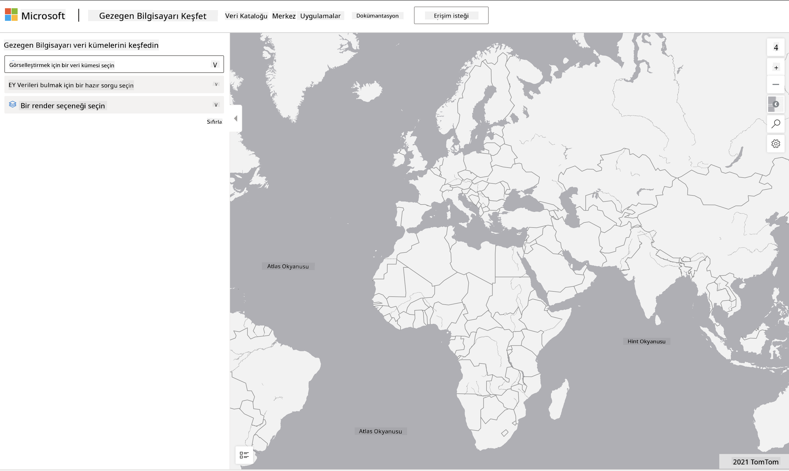

<!--
CO_OP_TRANSLATOR_METADATA:
{
  "original_hash": "d1e05715f9d97de6c4f1fb0c5a4702c0",
  "translation_date": "2025-08-28T11:33:02+00:00",
  "source_file": "6-Data-Science-In-Wild/20-Real-World-Examples/assignment.md",
  "language_code": "tr"
}
-->
# Bir Gezegen Bilgisayarı Veri Setini Keşfet

## Talimatlar

Bu derste, araştırma, sürdürülebilirlik ve dijital beşeri bilimlerle ilgili örneklere derinlemesine dalış yaparak çeşitli veri bilimi uygulama alanlarını ele aldık. Bu ödevde, bu örneklerden birini daha ayrıntılı bir şekilde inceleyecek ve sürdürülebilirlik verileri hakkında içgörüler elde etmek için veri görselleştirme ve analizle ilgili öğrendiklerinizi uygulayacaksınız.

[Planetary Computer](https://planetarycomputer.microsoft.com/) projesi, bir hesapla erişilebilen veri setleri ve API'ler sunar - ödevin bonus adımını denemek isterseniz erişim için bir hesap talep edin. Site ayrıca bir hesap oluşturmadan kullanabileceğiniz bir [Explorer](https://planetarycomputer.microsoft.com/explore) özelliği sağlar.

`Adımlar:`
Explorer arayüzü (aşağıdaki ekran görüntüsünde gösterilmiştir), bir veri seti (sunulan seçeneklerden), bir önceden ayarlanmış sorgu (verileri filtrelemek için) ve bir görselleştirme seçeneği (ilgili bir görselleştirme oluşturmak için) seçmenize olanak tanır. Bu ödevdeki göreviniz:

 1. [Explorer belgelerini](https://planetarycomputer.microsoft.com/docs/overview/explorer/) okuyun - seçenekleri anlayın.
 2. Veri seti [Kataloğunu](https://planetarycomputer.microsoft.com/catalog) keşfedin - her birinin amacını öğrenin.
 3. Explorer'ı kullanın - ilginizi çeken bir veri seti seçin, ilgili bir sorgu ve görselleştirme seçeneği belirleyin.

`Göreviniz:`
Şimdi tarayıcıda oluşturulan görselleştirmeyi inceleyin ve aşağıdaki soruları yanıtlayın:
 * Veri seti hangi _özelliklere_ sahip?
 * Görselleştirme hangi _içgörüleri_ veya sonuçları sağlıyor?
 * Bu içgörülerin projenin sürdürülebilirlik hedeflerine olan _etkileri_ nelerdir?
 * Görselleştirmenin _sınırlamaları_ nelerdir (yani, hangi içgörüyü elde edemediniz)?
 * Ham veriyi alabilseydiniz, hangi _alternatif görselleştirmeleri_ oluştururdunuz ve neden?

`Bonus Puanlar:`
Bir hesap için başvurun - kabul edildiğinde giriş yapın.
 * Ham veriyi bir Notebook'ta açmak için _Launch Hub_ seçeneğini kullanın.
 * Veriyi etkileşimli olarak keşfedin ve düşündüğünüz alternatif görselleştirmeleri uygulayın.
 * Şimdi özel görselleştirmelerinizi analiz edin - daha önce kaçırdığınız içgörüleri elde edebildiniz mi?

## Değerlendirme Ölçütü

Örnek | Yeterli | Geliştirme Gerekiyor
--- | --- | -- |
Beş temel sorunun tamamı yanıtlandı. Öğrenci, mevcut ve alternatif görselleştirmelerin sürdürülebilirlik hedefleri veya sonuçları hakkında nasıl içgörüler sağlayabileceğini açıkça belirtti. | Öğrenci en azından ilk 3 soruyu ayrıntılı bir şekilde yanıtladı ve Explorer ile pratik deneyime sahip olduğunu gösterdi. | Öğrenci birden fazla soruyu yanıtlamadı veya yetersiz ayrıntı sağladı - bu da projenin anlamlı bir şekilde ele alınmadığını gösteriyor. |

---

**Feragatname**:  
Bu belge, AI çeviri hizmeti [Co-op Translator](https://github.com/Azure/co-op-translator) kullanılarak çevrilmiştir. Doğruluk için çaba göstersek de, otomatik çevirilerin hata veya yanlışlık içerebileceğini lütfen unutmayın. Belgenin orijinal dili, yetkili kaynak olarak kabul edilmelidir. Kritik bilgiler için profesyonel insan çevirisi önerilir. Bu çevirinin kullanımından kaynaklanan yanlış anlamalar veya yanlış yorumlamalar için sorumluluk kabul etmiyoruz.