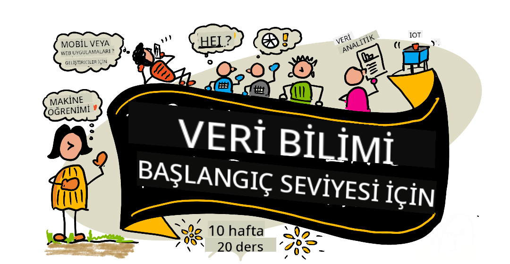

<!--
CO_OP_TRANSLATOR_METADATA:
{
  "original_hash": "dd9a1deb4da680b2cf11ba2e9f5a0a6e",
  "translation_date": "2025-09-29T21:49:55+00:00",
  "source_file": "README.md",
  "language_code": "tr"
}
-->
# Veri Bilimi için Başlangıç - Bir Müfredat

Microsoft'taki Azure Cloud Advocates ekibi, Veri Bilimi hakkında 10 haftalık, 20 derslik bir müfredat sunmaktan mutluluk duyuyor. Her ders, ders öncesi ve sonrası sınavlar, dersin tamamlanması için yazılı talimatlar, bir çözüm ve bir ödev içerir. Proje tabanlı pedagojimiz, öğrenirken inşa etmenizi sağlar; bu, yeni becerilerin kalıcı olmasını sağlayan kanıtlanmış bir yöntemdir.

**Yazarlarımıza içten teşekkürler:** [Jasmine Greenaway](https://www.twitter.com/paladique), [Dmitry Soshnikov](http://soshnikov.com), [Nitya Narasimhan](https://twitter.com/nitya), [Jalen McGee](https://twitter.com/JalenMcG), [Jen Looper](https://twitter.com/jenlooper), [Maud Levy](https://twitter.com/maudstweets), [Tiffany Souterre](https://twitter.com/TiffanySouterre), [Christopher Harrison](https://www.twitter.com/geektrainer).

**🙏 Özel teşekkürler 🙏 [Microsoft Öğrenci Elçisi](https://studentambassadors.microsoft.com/) yazarlarımıza, gözden geçirenlerimize ve içerik katkıda bulunanlarımıza,** özellikle Aaryan Arora, [Aditya Garg](https://github.com/AdityaGarg00), [Alondra Sanchez](https://www.linkedin.com/in/alondra-sanchez-molina/), [Ankita Singh](https://www.linkedin.com/in/ankitasingh007), [Anupam Mishra](https://www.linkedin.com/in/anupam--mishra/), [Arpita Das](https://www.linkedin.com/in/arpitadas01/), ChhailBihari Dubey, [Dibri Nsofor](https://www.linkedin.com/in/dibrinsofor), [Dishita Bhasin](https://www.linkedin.com/in/dishita-bhasin-7065281bb), [Majd Safi](https://www.linkedin.com/in/majd-s/), [Max Blum](https://www.linkedin.com/in/max-blum-6036a1186/), [Miguel Correa](https://www.linkedin.com/in/miguelmque/), [Mohamma Iftekher (Iftu) Ebne Jalal](https://twitter.com/iftu119), [Nawrin Tabassum](https://www.linkedin.com/in/nawrin-tabassum), [Raymond Wangsa Putra](https://www.linkedin.com/in/raymond-wp/), [Rohit Yadav](https://www.linkedin.com/in/rty2423), Samridhi Sharma, [Sanya Sinha](https://www.linkedin.com/mwlite/in/sanya-sinha-13aab1200),
[Sheena Narula](https://www.linkedin.com/in/sheena-narua-n/), [Tauqeer Ahmad](https://www.linkedin.com/in/tauqeerahmad5201/), Yogendrasingh Pawar , [Vidushi Gupta](https://www.linkedin.com/in/vidushi-gupta07/), [Jasleen Sondhi](https://www.linkedin.com/in/jasleen-sondhi/)

||
|:---:|
| Veri Bilimi için Başlangıç - _Sketchnote by [@nitya](https://twitter.com/nitya)_ |

### 🌐 Çok Dilli Destek

#### GitHub Action ile Destekleniyor (Otomatik ve Her Zaman Güncel)

[Fransızca](../fr/README.md) | [İspanyolca](../es/README.md) | [Almanca](../de/README.md) | [Rusça](../ru/README.md) | [Arapça](../ar/README.md) | [Farsça](../fa/README.md) | [Urduca](../ur/README.md) | [Çince (Basitleştirilmiş)](../zh/README.md) | [Çince (Geleneksel, Macau)](../mo/README.md) | [Çince (Geleneksel, Hong Kong)](../hk/README.md) | [Çince (Geleneksel, Tayvan)](../tw/README.md) | [Japonca](../ja/README.md) | [Korece](../ko/README.md) | [Hintçe](../hi/README.md) | [Bengalce](../bn/README.md) | [Marathi](../mr/README.md) | [Nepalce](../ne/README.md) | [Pencapça (Gurmukhi)](../pa/README.md) | [Portekizce (Portekiz)](../pt/README.md) | [Portekizce (Brezilya)](../br/README.md) | [İtalyanca](../it/README.md) | [Lehçe](../pl/README.md) | [Türkçe](./README.md) | [Yunanca](../el/README.md) | [Tayca](../th/README.md) | [İsveççe](../sv/README.md) | [Danca](../da/README.md) | [Norveççe](../no/README.md) | [Fince](../fi/README.md) | [Felemenkçe](../nl/README.md) | [İbranice](../he/README.md) | [Vietnamca](../vi/README.md) | [Endonezce](../id/README.md) | [Malayca](../ms/README.md) | [Tagalog (Filipince)](../tl/README.md) | [Swahili](../sw/README.md) | [Macarca](../hu/README.md) | [Çekçe](../cs/README.md) | [Slovakça](../sk/README.md) | [Romence](../ro/README.md) | [Bulgarca](../bg/README.md) | [Sırpça (Kiril)](../sr/README.md) | [Hırvatça](../hr/README.md) | [Slovence](../sl/README.md) | [Ukraynaca](../uk/README.md) | [Burma (Myanmar)](../my/README.md)

**Ek dil çevirileri talep etmek isterseniz, desteklenen diller [burada](https://github.com/Azure/co-op-translator/blob/main/getting_started/supported-languages.md) listelenmiştir.**

#### Topluluğumuza Katılın 

AI ile öğrenme serimiz devam ediyor, daha fazla bilgi edinin ve [AI ile Öğrenme Serisi](https://aka.ms/learnwithai/discord) etkinliğine 18 - 30 Eylül 2025 tarihleri arasında katılın. GitHub Copilot'u Veri Bilimi için kullanma ipuçlarını ve püf noktalarını öğrenin.

# Öğrenci misiniz?

Aşağıdaki kaynaklarla başlayabilirsiniz:

- [Öğrenci Merkezi sayfası](https://docs.microsoft.com/en-gb/learn/student-hub?WT.mc_id=academic-77958-bethanycheum) Bu sayfada başlangıç kaynakları, öğrenci paketleri ve hatta ücretsiz sertifika kuponu alma yollarını bulabilirsiniz. Bu sayfayı sık kullanılanlara ekleyip zaman zaman kontrol etmenizi öneririz çünkü içeriği en az ayda bir değiştiriyoruz.
- [Microsoft Learn Öğrenci Elçileri](https://studentambassadors.microsoft.com?WT.mc_id=academic-77958-bethanycheum) Küresel bir öğrenci elçileri topluluğuna katılın, bu sizin Microsoft'a giriş yolunuz olabilir.

# Başlarken

> **Eğitmenler**: Bu müfredatı nasıl kullanabileceğinize dair [bazı öneriler ekledik](for-teachers.md). Geri bildirimlerinizi [tartışma forumumuzda](https://github.com/microsoft/Data-Science-For-Beginners/discussions) bekliyoruz!

> **[Öğrenciler](https://aka.ms/student-page)**: Bu müfredatı kendi başınıza kullanmak için, tüm depoyu çatallayın ve ders öncesi sınavla başlayarak alıştırmaları kendi başınıza tamamlayın. Ardından dersi okuyun ve diğer etkinlikleri tamamlayın. Dersleri anlayarak projeleri oluşturmaya çalışın, çözüm kodunu kopyalamaktan kaçının; ancak bu kod, her proje odaklı dersin /solutions klasörlerinde mevcuttur. Bir diğer fikir, arkadaşlarınızla bir çalışma grubu oluşturup içeriği birlikte incelemek olabilir. Daha fazla çalışma için [Microsoft Learn](https://docs.microsoft.com/en-us/users/jenlooper-2911/collections/qprpajyoy3x0g7?WT.mc_id=academic-77958-bethanycheum) öneriyoruz.

## Ekibi Tanıyın

**Gif by** [Mohit Jaisal](https://www.linkedin.com/in/mohitjaisal)

> 🎥 Yukarıdaki görsele tıklayarak proje ve onu oluşturan kişiler hakkında bir video izleyin!

## Pedagoji

Bu müfredatı oluştururken iki pedagojik ilkeyi benimsedik: proje tabanlı olmasını sağlamak ve sık sık sınavlar içermesi. Bu serinin sonunda, öğrenciler veri biliminin temel ilkelerini, etik kavramları, veri hazırlama yöntemlerini, veriyle çalışma yollarını, veri görselleştirme, veri analizi, veri biliminin gerçek dünya uygulamaları ve daha fazlasını öğrenmiş olacaklar.

Ayrıca, ders öncesi düşük riskli bir sınav, öğrencinin bir konuyu öğrenmeye yönelik niyetini belirlerken, ders sonrası ikinci bir sınav daha fazla bilgiyi pekiştirir. Bu müfredat esnek ve eğlenceli olacak şekilde tasarlandı ve tamamı veya bir kısmı alınabilir. Projeler küçük başlar ve 10 haftalık döngünün sonunda giderek daha karmaşık hale gelir.

> [Davranış Kurallarımızı](CODE_OF_CONDUCT.md), [Katkı Sağlama](CONTRIBUTING.md), [Çeviri](TRANSLATIONS.md) yönergelerimizi bulun. Yapıcı geri bildirimlerinizi bekliyoruz!

## Her ders şunları içerir:

- İsteğe bağlı sketchnote
- İsteğe bağlı ek video
- Ders öncesi ısınma sınavı
- Yazılı ders
- Proje tabanlı dersler için, projeyi nasıl oluşturacağınızı adım adım anlatan rehberler
- Bilgi kontrolleri
- Bir meydan okuma
- Ek okuma materyalleri
- Ödev
- [Ders sonrası sınav](https://ff-quizzes.netlify.app/en/)

> **Sınavlar hakkında bir not**: Tüm sınavlar Quiz-App klasöründe yer alır, toplamda her biri üç sorudan oluşan 40 sınav vardır. Derslerin içinden bağlantılıdır, ancak sınav uygulaması yerel olarak çalıştırılabilir veya Azure'a dağıtılabilir; `quiz-app` klasöründeki talimatları takip edin. Sınavlar kademeli olarak yerelleştirilmektedir.

## Dersler
||
|:---:|
| Veri Bilimi Başlangıç Seviyesi: Yol Haritası - _[@nitya](https://twitter.com/nitya) tarafından hazırlanan Sketchnote_ |

| Ders Numarası | Konu | Ders Grubu | Öğrenme Hedefleri | Bağlantılı Ders | Yazar |
| :-----------: | :----------------------------------------: | :--------------------------------------------------: | :-----------------------------------------------------------------------------------------------------------------------------------------------------------------------: | :---------------------------------------------------------------------: | :----: |
| 01 | Veri Bilimini Tanımlama | [Giriş](1-Introduction/README.md) | Veri biliminin temel kavramlarını ve yapay zeka, makine öğrenimi ve büyük veri ile ilişkisini öğrenin. | [ders](1-Introduction/01-defining-data-science/README.md) [video](https://youtu.be/beZ7Mb_oz9I) | [Dmitry](http://soshnikov.com) |
| 02 | Veri Bilimi Etiği | [Giriş](1-Introduction/README.md) | Veri etiği kavramları, zorlukları ve çerçeveleri. | [ders](1-Introduction/02-ethics/README.md) | [Nitya](https://twitter.com/nitya) |
| 03 | Veriyi Tanımlama | [Giriş](1-Introduction/README.md) | Verinin nasıl sınıflandırıldığı ve yaygın kaynakları. | [ders](1-Introduction/03-defining-data/README.md) | [Jasmine](https://www.twitter.com/paladique) |
| 04 | İstatistik ve Olasılığa Giriş | [Giriş](1-Introduction/README.md) | Veriyi anlamak için olasılık ve istatistik matematiksel teknikleri. | [ders](1-Introduction/04-stats-and-probability/README.md) [video](https://youtu.be/Z5Zy85g4Yjw) | [Dmitry](http://soshnikov.com) |
| 05 | İlişkisel Veri ile Çalışma | [Veri ile Çalışma](2-Working-With-Data/README.md) | İlişkisel veriye giriş ve Structured Query Language (SQL) olarak bilinen dil ile ilişkisel veriyi keşfetme ve analiz etmenin temelleri. | [ders](2-Working-With-Data/05-relational-databases/README.md) | [Christopher](https://www.twitter.com/geektrainer) | | |
| 06 | NoSQL Veri ile Çalışma | [Veri ile Çalışma](2-Working-With-Data/README.md) | İlişkisel olmayan veriye giriş, çeşitli türleri ve belge veritabanlarını keşfetme ve analiz etmenin temelleri. | [ders](2-Working-With-Data/06-non-relational/README.md) | [Jasmine](https://twitter.com/paladique)|
| 07 | Python ile Çalışma | [Veri ile Çalışma](2-Working-With-Data/README.md) | Pandas gibi kütüphanelerle veri keşfi için Python kullanmanın temelleri. Python programlama konusunda temel bir anlayış önerilir. | [ders](2-Working-With-Data/07-python/README.md) [video](https://youtu.be/dZjWOGbsN4Y) | [Dmitry](http://soshnikov.com) |
| 08 | Veri Hazırlama | [Veri ile Çalışma](2-Working-With-Data/README.md) | Eksik, hatalı veya eksik verilerle başa çıkmak için veri temizleme ve dönüştürme teknikleri üzerine konular. | [ders](2-Working-With-Data/08-data-preparation/README.md) | [Jasmine](https://www.twitter.com/paladique) |
| 09 | Miktarları Görselleştirme | [Veri Görselleştirme](3-Data-Visualization/README.md) | Matplotlib kullanarak kuş verilerini görselleştirmeyi öğrenin 🦆 | [ders](3-Data-Visualization/09-visualization-quantities/README.md) | [Jen](https://twitter.com/jenlooper) |
| 10 | Veri Dağılımlarını Görselleştirme | [Veri Görselleştirme](3-Data-Visualization/README.md) | Bir aralık içindeki gözlemleri ve eğilimleri görselleştirme. | [ders](3-Data-Visualization/10-visualization-distributions/README.md) | [Jen](https://twitter.com/jenlooper) |
| 11 | Oranları Görselleştirme | [Veri Görselleştirme](3-Data-Visualization/README.md) | Ayrık ve gruplandırılmış yüzdeleri görselleştirme. | [ders](3-Data-Visualization/11-visualization-proportions/README.md) | [Jen](https://twitter.com/jenlooper) |
| 12 | İlişkileri Görselleştirme | [Veri Görselleştirme](3-Data-Visualization/README.md) | Veri setleri ve değişkenleri arasındaki bağlantıları ve korelasyonları görselleştirme. | [ders](3-Data-Visualization/12-visualization-relationships/README.md) | [Jen](https://twitter.com/jenlooper) |
| 13 | Anlamlı Görselleştirmeler | [Veri Görselleştirme](3-Data-Visualization/README.md) | Sorun çözme ve içgörüler için görselleştirmelerinizi değerli hale getirmek için teknikler ve rehberlik. | [ders](3-Data-Visualization/13-meaningful-visualizations/README.md) | [Jen](https://twitter.com/jenlooper) |
| 14 | Veri Bilimi Yaşam Döngüsüne Giriş | [Yaşam Döngüsü](4-Data-Science-Lifecycle/README.md) | Veri bilimi yaşam döngüsüne giriş ve veri toplama ve çıkarma adımı. | [ders](4-Data-Science-Lifecycle/14-Introduction/README.md) | [Jasmine](https://twitter.com/paladique) |
| 15 | Analiz | [Yaşam Döngüsü](4-Data-Science-Lifecycle/README.md) | Veri bilimi yaşam döngüsünün bu aşaması, veriyi analiz etme tekniklerine odaklanır. | [ders](4-Data-Science-Lifecycle/15-analyzing/README.md) | [Jasmine](https://twitter.com/paladique) | | |
| 16 | İletişim | [Yaşam Döngüsü](4-Data-Science-Lifecycle/README.md) | Veri bilimi yaşam döngüsünün bu aşaması, veriden elde edilen içgörüleri karar vericilerin daha kolay anlamasını sağlayacak şekilde sunmaya odaklanır. | [ders](4-Data-Science-Lifecycle/16-communication/README.md) | [Jalen](https://twitter.com/JalenMcG) | | |
| 17 | Bulutta Veri Bilimi | [Bulut Verisi](5-Data-Science-In-Cloud/README.md) | Bu ders serisi, bulutta veri bilimine ve avantajlarına giriş yapar. | [ders](5-Data-Science-In-Cloud/17-Introduction/README.md) | [Tiffany](https://twitter.com/TiffanySouterre) ve [Maud](https://twitter.com/maudstweets) |
| 18 | Bulutta Veri Bilimi | [Bulut Verisi](5-Data-Science-In-Cloud/README.md) | Düşük Kod araçları kullanarak modelleri eğitme. |[ders](5-Data-Science-In-Cloud/18-Low-Code/README.md) | [Tiffany](https://twitter.com/TiffanySouterre) ve [Maud](https://twitter.com/maudstweets) |
| 19 | Bulutta Veri Bilimi | [Bulut Verisi](5-Data-Science-In-Cloud/README.md) | Azure Machine Learning Studio ile modelleri dağıtma. | [ders](5-Data-Science-In-Cloud/19-Azure/README.md)| [Tiffany](https://twitter.com/TiffanySouterre) ve [Maud](https://twitter.com/maudstweets) |
| 20 | Doğada Veri Bilimi | [Doğada](6-Data-Science-In-Wild/README.md) | Gerçek dünyada veri bilimi odaklı projeler. | [ders](6-Data-Science-In-Wild/20-Real-World-Examples/README.md) | [Nitya](https://twitter.com/nitya) |

## GitHub Codespaces

Bu örneği bir Codespace'de açmak için şu adımları izleyin:
1. Code açılır menüsüne tıklayın ve Codespaces ile Aç seçeneğini seçin.
2. Pencerenin altındaki + Yeni Codespace seçeneğini seçin.
Daha fazla bilgi için [GitHub belgelerine](https://docs.github.com/en/codespaces/developing-in-codespaces/creating-a-codespace-for-a-repository#creating-a-codespace) göz atın.

## VSCode Remote - Containers
Bu depoyu yerel makineniz ve VSCode kullanarak bir konteynerde açmak için VS Code Remote - Containers uzantısını kullanarak şu adımları izleyin:

1. İlk kez bir geliştirme konteyneri kullanıyorsanız, sisteminizin ön gereksinimleri karşıladığından emin olun (örneğin, Docker kurulu olmalı) [başlangıç belgelerinde](https://code.visualstudio.com/docs/devcontainers/containers#_getting-started).

Bu depoyu kullanmak için, ya depoyu izole bir Docker hacminde açabilirsiniz:

**Not**: Arka planda, bu işlem Remote-Containers: **Clone Repository in Container Volume...** komutunu kullanarak kaynak kodunu yerel dosya sistemi yerine bir Docker hacmine klonlayacaktır. [Hacimler](https://docs.docker.com/storage/volumes/) konteyner verilerini kalıcı hale getirmek için tercih edilen mekanizmadır.

Ya da yerel olarak klonlanmış veya indirilmiş bir depo sürümünü açabilirsiniz:

- Bu depoyu yerel dosya sisteminize klonlayın.
- F1 tuşuna basın ve **Remote-Containers: Open Folder in Container...** komutunu seçin.
- Bu klasörün klonlanmış kopyasını seçin, konteynerin başlamasını bekleyin ve denemeler yapın.

## Çevrimdışı erişim

Bu belgeleri [Docsify](https://docsify.js.org/#/) kullanarak çevrimdışı çalıştırabilirsiniz. Bu depoyu çatallayın, [Docsify'i kurun](https://docsify.js.org/#/quickstart) yerel makinenize, ardından bu deponun kök klasöründe `docsify serve` yazın. Web sitesi localhost'ta 3000 portunda sunulacaktır: `localhost:3000`.

> Not, not defterleri Docsify üzerinden görüntülenmeyecektir, bu nedenle bir not defteri çalıştırmanız gerektiğinde bunu ayrı olarak VS Code'da bir Python çekirdeği çalıştırarak yapın.

## Diğer Müfredatlar

Ekibimiz başka müfredatlar da üretiyor! Şunlara göz atın:

- [Edge AI for Beginners](https://aka.ms/edgeai-for-beginners)
- [AI Agents for Beginners](https://aka.ms/ai-agents-beginners)
- [Generative AI for Beginners](https://aka.ms/genai-beginners)
- [Generative AI for Beginners .NET](https://github.com/microsoft/Generative-AI-for-beginners-dotnet)
- [Generative AI with JavaScript](https://github.com/microsoft/generative-ai-with-javascript)
- [Generative AI with Java](https://aka.ms/genaijava)
- [AI for Beginners](https://aka.ms/ai-beginners)
- [Data Science for Beginners](https://aka.ms/datascience-beginners)
- [Bash for Beginners](https://github.com/microsoft/bash-for-beginners)
- [ML for Beginners](https://aka.ms/ml-beginners)
- [Cybersecurity for Beginners](https://github.com/microsoft/Security-101) 
- [Web Dev for Beginners](https://aka.ms/webdev-beginners)
- [IoT for Beginners](https://aka.ms/iot-beginners)
- [Machine Learning for Beginners](https://aka.ms/ml-beginners)
- [XR Development for Beginners](https://aka.ms/xr-dev-for-beginners)
- [Mastering GitHub Copilot for AI Paired Programming](https://aka.ms/GitHubCopilotAI)
- [XR Development for Beginners](https://github.com/microsoft/xr-development-for-beginners)
- [Mastering GitHub Copilot for C#/.NET Developers](https://github.com/microsoft/mastering-github-copilot-for-dotnet-csharp-developers)
- [Choose Your Own Copilot Adventure](https://github.com/microsoft/CopilotAdventures)

---

**Feragatname**:  
Bu belge, AI çeviri hizmeti [Co-op Translator](https://github.com/Azure/co-op-translator) kullanılarak çevrilmiştir. Doğruluk için çaba göstersek de, otomatik çevirilerin hata veya yanlışlık içerebileceğini lütfen unutmayın. Belgenin orijinal dili, yetkili kaynak olarak kabul edilmelidir. Kritik bilgiler için profesyonel insan çevirisi önerilir. Bu çevirinin kullanımından kaynaklanan yanlış anlamalar veya yanlış yorumlamalar için sorumluluk kabul etmiyoruz.