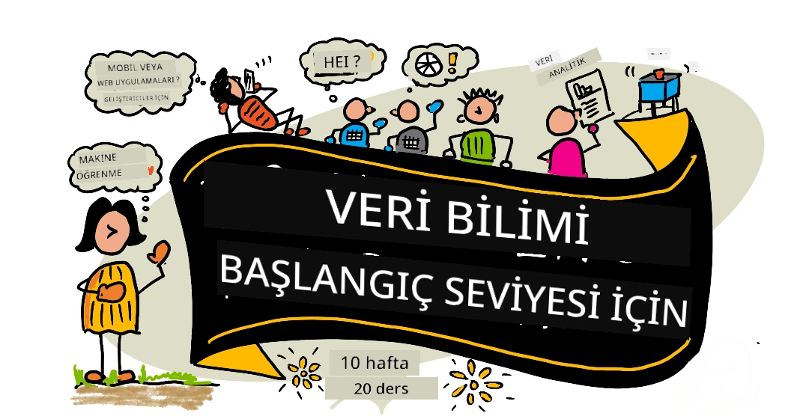
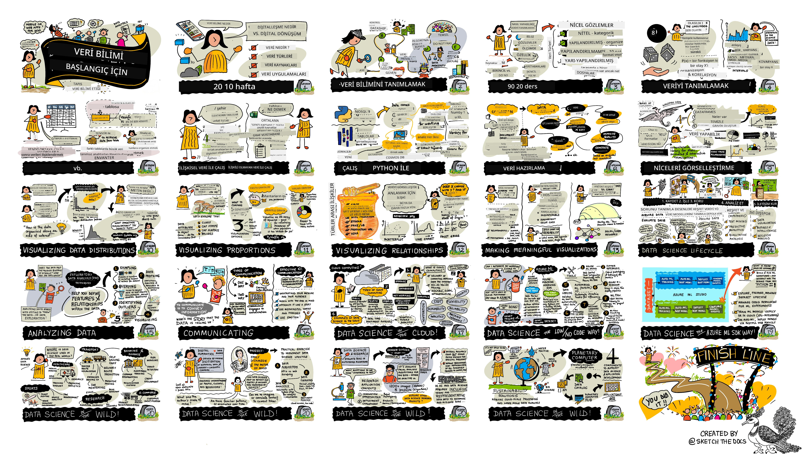

# Yeni Başlayanlar İçin Veri Bilimi - Bir Müfredat

[](https://github.com/codespaces/new?hide_repo_select=true&ref=main&repo=344191198)

[](https://github.com/microsoft/Data-Science-For-Beginners/blob/master/LICENSE)
[](https://GitHub.com/microsoft/Data-Science-For-Beginners/graphs/contributors/)
[](https://GitHub.com/microsoft/Data-Science-For-Beginners/issues/)
[](https://GitHub.com/microsoft/Data-Science-For-Beginners/pulls/)
[](http://makeapullrequest.com)

[](https://GitHub.com/microsoft/Data-Science-For-Beginners/watchers/)
[](https://GitHub.com/microsoft/Data-Science-For-Beginners/network/)
[](https://GitHub.com/microsoft/Data-Science-For-Beginners/stargazers/)


[](https://discord.gg/nTYy5BXMWG)

[](https://aka.ms/foundry/forum)

Microsoft'taki Azure Bulut Savunucuları, Veri Bilimi hakkında tümüyle 10 haftalık, 20 derslik bir müfredat sunmaktan mutluluk duyarlar. Her ders, dersten önce ve sonra yapılan quizler, dersi tamamlamak için yazılı talimatlar, bir çözüm ve bir ödev içerir. Proje tabanlı pedagojimiz, yeni becerilerin 'yerleşmesi' için kanıtlanmış bir yol olan yaparak öğrenmenizi sağlar.

**Yazarlarımıza içten teşekkürler:** [Jasmine Greenaway](https://www.twitter.com/paladique), [Dmitry Soshnikov](http://soshnikov.com), [Nitya Narasimhan](https://twitter.com/nitya), [Jalen McGee](https://twitter.com/JalenMcG), [Jen Looper](https://twitter.com/jenlooper), [Maud Levy](https://twitter.com/maudstweets), [Tiffany Souterre](https://twitter.com/TiffanySouterre), [Christopher Harrison](https://www.twitter.com/geektrainer).

**🙏 Özel teşekkürler 🙏 [Microsoft Öğrenci Elçisi](https://studentambassadors.microsoft.com/) yazarlarımıza, inceleyicilerimize ve içerik katkıcılarımıza,** özellikle Aaryan Arora, [Aditya Garg](https://github.com/AdityaGarg00), [Alondra Sanchez](https://www.linkedin.com/in/alondra-sanchez-molina/), [Ankita Singh](https://www.linkedin.com/in/ankitasingh007), [Anupam Mishra](https://www.linkedin.com/in/anupam--mishra/), [Arpita Das](https://www.linkedin.com/in/arpitadas01/), ChhailBihari Dubey, [Dibri Nsofor](https://www.linkedin.com/in/dibrinsofor), [Dishita Bhasin](https://www.linkedin.com/in/dishita-bhasin-7065281bb), [Majd Safi](https://www.linkedin.com/in/majd-s/), [Max Blum](https://www.linkedin.com/in/max-blum-6036a1186/), [Miguel Correa](https://www.linkedin.com/in/miguelmque/), [Mohamma Iftekher (Iftu) Ebne Jalal](https://twitter.com/iftu119), [Nawrin Tabassum](https://www.linkedin.com/in/nawrin-tabassum), [Raymond Wangsa Putra](https://www.linkedin.com/in/raymond-wp/), [Rohit Yadav](https://www.linkedin.com/in/rty2423), Samridhi Sharma, [Sanya Sinha](https://www.linkedin.com/mwlite/in/sanya-sinha-13aab1200),
[Sheena Narula](https://www.linkedin.com/in/sheena-narua-n/), [Tauqeer Ahmad](https://www.linkedin.com/in/tauqeerahmad5201/), Yogendrasingh Pawar , [Vidushi Gupta](https://www.linkedin.com/in/vidushi-gupta07/), [Jasleen Sondhi](https://www.linkedin.com/in/jasleen-sondhi/)

||
|:---:|
| Yeni Başlayanlar İçin Veri Bilimi - _Sketchnote [@nitya](https://twitter.com/nitya) tarafından_ |

### 🌐 Çok Dilli Destek

#### GitHub Action ile Desteklenmektedir (Otomatik & Daima Güncel)

<!-- CO-OP TRANSLATOR LANGUAGES TABLE START -->
[Arabic](../ar/README.md) | [Bengali](../bn/README.md) | [Bulgarian](../bg/README.md) | [Burmese (Myanmar)](../my/README.md) | [Chinese (Simplified)](../zh-CN/README.md) | [Chinese (Traditional, Hong Kong)](../zh-HK/README.md) | [Chinese (Traditional, Macau)](../zh-MO/README.md) | [Chinese (Traditional, Taiwan)](../zh-TW/README.md) | [Croatian](../hr/README.md) | [Czech](../cs/README.md) | [Danish](../da/README.md) | [Dutch](../nl/README.md) | [Estonian](../et/README.md) | [Finnish](../fi/README.md) | [French](../fr/README.md) | [German](../de/README.md) | [Greek](../el/README.md) | [Hebrew](../he/README.md) | [Hindi](../hi/README.md) | [Hungarian](../hu/README.md) | [Indonesian](../id/README.md) | [Italian](../it/README.md) | [Japanese](../ja/README.md) | [Kannada](../kn/README.md) | [Khmer](../km/README.md) | [Korean](../ko/README.md) | [Lithuanian](../lt/README.md) | [Malay](../ms/README.md) | [Malayalam](../ml/README.md) | [Marathi](../mr/README.md) | [Nepali](../ne/README.md) | [Nigerian Pidgin](../pcm/README.md) | [Norwegian](../no/README.md) | [Persian (Farsi)](../fa/README.md) | [Polish](../pl/README.md) | [Portuguese (Brazil)](../pt-BR/README.md) | [Portuguese (Portugal)](../pt-PT/README.md) | [Punjabi (Gurmukhi)](../pa/README.md) | [Romanian](../ro/README.md) | [Russian](../ru/README.md) | [Serbian (Cyrillic)](../sr/README.md) | [Slovak](../sk/README.md) | [Slovenian](../sl/README.md) | [Spanish](../es/README.md) | [Swahili](../sw/README.md) | [Swedish](../sv/README.md) | [Tagalog (Filipino)](../tl/README.md) | [Tamil](../ta/README.md) | [Telugu](../te/README.md) | [Thai](../th/README.md) | [Turkish](./README.md) | [Ukrainian](../uk/README.md) | [Urdu](../ur/README.md) | [Vietnamese](../vi/README.md)

> **Yerel Olarak Klonlamayı Tercih Ediyor musunuz?**
>
> Bu depo 50+ dil çevirisi içerir ve bu da indirme boyutunu önemli ölçüde artırır. Çeviriler olmadan klonlamak için dağıtık checkout kullanın:
>
> **Bash / macOS / Linux:**
> ```bash
> git clone --filter=blob:none --sparse https://github.com/microsoft/Data-Science-For-Beginners.git
> cd Data-Science-For-Beginners
> git sparse-checkout set --no-cone '/*' '!translations' '!translated_images'
> ```
>
> **CMD (Windows):**
> ```cmd
> git clone --filter=blob:none --sparse https://github.com/microsoft/Data-Science-For-Beginners.git
> cd Data-Science-For-Beginners
> git sparse-checkout set --no-cone "/*" "!translations" "!translated_images"
> ```
>
> Bu sayede kursu tamamlamak için ihtiyacınız olan her şeye çok daha hızlı indirme ile sahip olursunuz.
<!-- CO-OP TRANSLATOR LANGUAGES TABLE END -->

**Ek çeviri dillerinin desteklenmesini istiyorsanız, bunlar [burada](https://github.com/Azure/co-op-translator/blob/main/getting_started/supported-languages.md) listelenmiştir**

#### Topluluğumuza Katılın 
[](https://discord.gg/nTYy5BXMWG)

Yapay Zeka ile öğrenme serimiz Discord üzerinde devam ediyor, daha fazla bilgi almak ve 18 - 30 Eylül 2025 tarihleri arasında bize katılmak için [Learn with AI Series](https://aka.ms/learnwithai/discord) sayfasını ziyaret edin. Veri Bilimi için GitHub Copilot kullanımı hakkında ipuçları ve püf noktaları edineceksiniz.


# Öğrenci misiniz?

Aşağıdaki kaynaklarla başlayın:

- [Öğrenci Merkezi sayfası](https://docs.microsoft.com/en-gb/learn/student-hub?WT.mc_id=academic-77958-bethanycheum) Bu sayfada başlangıç kaynakları, Öğrenci paketleri ve hatta ücretsiz sertifika kuponu alma yolları bulacaksınız. İçeriği en az ayda bir değiştirdiğimiz için, sık sık kontrol etmek isteyeceğiniz tek sayfa bu.
- [Microsoft Learn Öğrenci Elçileri](https://studentambassadors.microsoft.com?WT.mc_id=academic-77958-bethanycheum) Küresel öğrenci elçileri topluluğuna katılın, bu Microsoft’a giden yolunuz olabilir.

# Başlarken

## 📚 Dokümantasyon

- **[Kurulum Kılavuzu](INSTALLATION.md)** - Yeni başlayanlar için adım adım kurulum talimatları
- **[Kullanım Kılavuzu](USAGE.md)** - Örnekler ve yaygın iş akışları
- **[Sorun Giderme](TROUBLESHOOTING.md)** - Yaygın sorunların çözümleri
- **[Katkı Kılavuzu](CONTRIBUTING.md)** - Bu projeye nasıl katkıda bulunulur
- **[Öğretmenler için](for-teachers.md)** - Öğretim rehberi ve sınıf kaynakları

## 👨‍🎓 Öğrenciler İçin
> **Tamamen Yeni Başlayanlar:** Veri bilimine yeni misiniz? [Başlangıç dostu örneklerimiz](examples/README.md) ile başlayın! Bu basit, iyi yorumlanmış örnekler tam müfredata girmeden önce temel bilgiyi anlamanıza yardımcı olur.
> **[Öğrenciler](https://aka.ms/student-page)**: Bu müfredatı kendi başınıza kullanmak için tüm depoyu çatalayın ve alıştırmaları kendi başınıza tamamlayın, önce bir ders öncesi quiz yaparak başlayın. Sonra dersi okuyun ve geri kalan etkinlikleri tamamlayın. Projeleri çözüm kodunu kopyalamak yerine dersleri anlayarak yapmaya çalışın; ancak kod /çözümler klasörlerinde her proje odaklı derste mevcuttur. Bir diğer fikir ise arkadaşlarınızla bir çalışma grubu kurmak ve içeriği birlikte gözden geçirmek. Daha ileri seviye çalışma için [Microsoft Learn](https://docs.microsoft.com/en-us/users/jenlooper-2911/collections/qprpajyoy3x0g7?WT.mc_id=academic-77958-bethanycheum) önerilir.

**Hızlı Başlangıç:**
1. Ortamınızı kurmak için [Kurulum Kılavuzunu](INSTALLATION.md) kontrol edin
2. Müfredatla nasıl çalışılacağını öğrenmek için [Kullanım Kılavuzunu](USAGE.md) inceleyin
3. Ders 1'den başlayarak sırasıyla ilerleyin
4. Destek için [Discord topluluğumuza](https://aka.ms/ds4beginners/discord) katılın

## 👩‍🏫 Öğretmenler İçin
> **Öğretmenler**: Bu müfredatı nasıl kullanacağınıza dair [bazı öneriler ekledik](for-teachers.md). Geri bildirimlerinizi [tartışma forumumuzda](https://github.com/microsoft/Data-Science-For-Beginners/discussions) bizlerle paylaşmanızı çok isteriz!

## Takım ile Tanışın

[](https://youtu.be/8mzavjQSMM4 "Tanıtım videosu")

**Gif yapan** [Mohit Jaisal](https://www.linkedin.com/in/mohitjaisal)

> 🎥 Projeyle ve yaratan kişilerle ilgili bir video için yukarıdaki görsele tıklayın!

## Pedagoji

Bu müfredatı oluştururken iki pedagojik ilke seçtik: proje tabanlı olması ve sık sık quizler içermesi. Bu serinin sonunda öğrenciler; ahlaki kavramlar, veri hazırlama, veri ile çalışma farklı yolları, veri görselleştirme, veri analizi, veri biliminin gerçek dünya kullanım örnekleri ve daha fazlası dahil olmak üzere veri biliminin temel prensiplerini öğrenmiş olacaklar.

Buna ek olarak, ders öncesi yapılan düşük stresli bir quiz öğrencinin bir konuyu öğrenme amacını belirlerken, ders sonrası yapılan ikinci quiz ise bilgilerin kalıcı olmasını sağlar. Bu müfredat esnek ve eğlenceli olacak şekilde tasarlandı ve tamamı ya da bir kısmı alınabilir. Projeler küçük başlayıp 10 haftalık döngünün sonunda giderek daha karmaşık hale gelir.

> [Davranış Kurallarımızı](CODE_OF_CONDUCT.md), [Katkıda Bulunma](CONTRIBUTING.md), [Çeviri](TRANSLATIONS.md) yönergelerimizi bulun. Yapıcı geri bildirimlerinizi bekleriz!

## Her ders şunları içerir:

- İsteğe bağlı çizim notu
- İsteğe bağlı destekleyici video
- Ders öncesi hazırlık quizi
- Yazılı ders
- Proje tabanlı dersler için, projeyi nasıl inşa edeceğinize dair adım adım rehberler
- Bilgi kontrolleri
- Bir meydan okuma
- Destekleyici okumalar
- Ödev
- [Ders sonrası quiz](https://ff-quizzes.netlify.app/en/)

> **Quizler hakkında bir not**: Tüm quizler Quiz-App klasöründe yer almakta olup, toplamda 40 adet, her biri üç sorudan oluşan quiz vardır. Derslerin içinden bağlantı verilmiştir ancak quiz uygulaması yerel olarak çalıştırılabilir veya Azure'a dağıtılabilir; `quiz-app` klasöründeki talimatları izleyin. Quizler kademeli olarak yerelleştirilmektedir.

## 🎓 Yeni Başlayanlara Uygun Örnekler

**Veri Bilimine yeni misiniz?** Başlamanıza yardımcı olmak için basit, iyi yorumlu kodların yer aldığı özel bir [örnekler dizini](examples/README.md) oluşturduk:

- 🌟 **Merhaba Dünya** - İlk veri bilimi programınız
- 📂 **Veri Yükleme** - Veri setlerini okumayı ve keşfetmeyi öğrenin
- 📊 **Basit Analiz** - İstatistikleri hesaplayın ve desenleri bulun
- 📈 **Temel Görselleştirme** - Grafikler ve çizelgeler oluşturun
- 🔬 **Gerçek Dünya Projesi** - Baştan sona tamamlanan iş akışı

Her örnek, her adımı açıklayan detaylı yorumlar içerir, bu yüzden tamamen yeni başlayanlar için mükemmeldir!

👉 **[Örneklerle başlayın](examples/README.md)** 👈

## Dersler


||
|:---:|
| Yeni Başlayanlar İçin Veri Bilimi: Yol Haritası - _Çizim notu [@nitya](https://twitter.com/nitya) tarafından_ |


| Ders Numarası | Konu | Ders Grubu | Öğrenme Hedefleri | Bağlantılı Ders | Yazar |
| :-----------: | :----------------------------------------: | :--------------------------------------------------: | :-----------------------------------------------------------------------------------------------------------------------------------------------------------------------: | :---------------------------------------------------------------------: | :----: |
| 01 | Veri Bilimini Tanımlama | [Giriş](1-Introduction/README.md) | Veri bilimi temel kavramlarını ve yapay zeka, makine öğrenimi ve büyük veri ile ilişkisini öğrenin. | [ders](1-Introduction/01-defining-data-science/README.md) [video](https://youtu.be/beZ7Mb_oz9I) | [Dmitry](http://soshnikov.com) |
| 02 | Veri Bilimi Etiği | [Giriş](1-Introduction/README.md) | Veri Etiği Kavramları, Zorluklar ve Çerçeveler. | [ders](1-Introduction/02-ethics/README.md) | [Nitya](https://twitter.com/nitya) |
| 03 | Veriyi Tanımlama | [Giriş](1-Introduction/README.md) | Verinin nasıl sınıflandırıldığı ve yaygın kaynakları. | [ders](1-Introduction/03-defining-data/README.md) | [Jasmine](https://www.twitter.com/paladique) |
| 04 | İstatistik ve Olasılığa Giriş | [Giriş](1-Introduction/README.md) | Veriyi anlamak için olasılık ve istatistik matematiksel teknikleri. | [ders](1-Introduction/04-stats-and-probability/README.md) [video](https://youtu.be/Z5Zy85g4Yjw) | [Dmitry](http://soshnikov.com) |
| 05 | İlişkisel Veri ile Çalışmak | [Veri ile Çalışmak](2-Working-With-Data/README.md) | İlişkisel veriye giriş ve SQL (Structured Query Language, “si-kwel” olarak telaffuz edilir) ile ilişkisel veriyi keşfetme ve analiz etme temelleri. | [ders](2-Working-With-Data/05-relational-databases/README.md) | [Christopher](https://www.twitter.com/geektrainer) | | |
| 06 | NoSQL Veri ile Çalışmak | [Veri ile Çalışmak](2-Working-With-Data/README.md) | İlişkisel olmayan veriye giriş, türleri ve döküman veritabanlarını keşfetme ve analiz etme temelleri. | [ders](2-Working-With-Data/06-non-relational/README.md) | [Jasmine](https://twitter.com/paladique)|
| 07 | Python ile Çalışmak | [Veri ile Çalışmak](2-Working-With-Data/README.md) | Pandas gibi kütüphanelerle Python kullanarak veri keşfine giriş. Temel Python programlama bilgisi önerilir. | [ders](2-Working-With-Data/07-python/README.md) [video](https://youtu.be/dZjWOGbsN4Y) | [Dmitry](http://soshnikov.com) |
| 08 | Veri Hazırlama | [Veri ile Çalışmak](2-Working-With-Data/README.md) | Eksik, hatalı veya tamamlanmamış verilerle başa çıkmak için veri temizleme ve dönüştürme teknikleri. | [ders](2-Working-With-Data/08-data-preparation/README.md) | [Jasmine](https://www.twitter.com/paladique) |
| 09 | Miktarların Görselleştirilmesi | [Veri Görselleştirme](3-Data-Visualization/README.md) | Matplotlib kullanarak kuş verilerini görselleştirmeyi öğrenin 🦆 | [ders](3-Data-Visualization/09-visualization-quantities/README.md) | [Jen](https://twitter.com/jenlooper) |
| 10 | Verinin Dağılımlarını Görselleştirme | [Veri Görselleştirme](3-Data-Visualization/README.md) | Bir aralıktaki gözlemleri ve eğilimleri görselleştirmek. | [ders](3-Data-Visualization/10-visualization-distributions/README.md) | [Jen](https://twitter.com/jenlooper) |
| 11 | Oranların Görselleştirilmesi | [Veri Görselleştirme](3-Data-Visualization/README.md) | Ayrık ve gruplanmış yüzde oranlarını görselleştirme. | [ders](3-Data-Visualization/11-visualization-proportions/README.md) | [Jen](https://twitter.com/jenlooper) |
| 12 | İlişkilerin Görselleştirilmesi | [Veri Görselleştirme](3-Data-Visualization/README.md) | Veri setleri ve değişkenler arasındaki bağlantılar ve korelasyonların görselleştirilmesi. | [ders](3-Data-Visualization/12-visualization-relationships/README.md) | [Jen](https://twitter.com/jenlooper) |
| 13 | Anlamlı Görselleştirmeler | [Veri Görselleştirme](3-Data-Visualization/README.md) | Görselleştirmenizi etkili problem çözme ve içgörüler için değerli kılmanın teknikleri ve rehberi. | [ders](3-Data-Visualization/13-meaningful-visualizations/README.md) | [Jen](https://twitter.com/jenlooper) |
| 14 | Veri Bilimi Yaşam Döngüsüne Giriş | [Yaşam Döngüsü](4-Data-Science-Lifecycle/README.md) | Veri bilimi yaşam döngüsüne giriş ve verinin edinilmesi ve çıkarılması ilk adımı. | [ders](4-Data-Science-Lifecycle/14-Introduction/README.md) | [Jasmine](https://twitter.com/paladique) |
| 15 | Analiz Etme | [Yaşam Döngüsü](4-Data-Science-Lifecycle/README.md) | Veri bilimi yaşam döngüsünün bu aşaması, veriyi analiz etme tekniklerine odaklanır. | [ders](4-Data-Science-Lifecycle/15-analyzing/README.md) | [Jasmine](https://twitter.com/paladique) | | |
| 16 | İletişim | [Yaşam Döngüsü](4-Data-Science-Lifecycle/README.md) | Veri bilimi yaşam döngüsünün bu aşaması, karar vericilerin anlayabilmesi için veriden elde edilen içgörülerin sunulmasına odaklanır. | [ders](4-Data-Science-Lifecycle/16-communication/README.md) | [Jalen](https://twitter.com/JalenMcG) | | |
| 17 | Bulutta Veri Bilimi | [Bulut Verisi](5-Data-Science-In-Cloud/README.md) | Bu ders serisi, bulutta veri bilimi ve avantajlarını tanıtır. | [ders](5-Data-Science-In-Cloud/17-Introduction/README.md) | [Tiffany](https://twitter.com/TiffanySouterre) ve [Maud](https://twitter.com/maudstweets) |
| 18 | Bulutta Veri Bilimi | [Bulut Verisi](5-Data-Science-In-Cloud/README.md) | Low Code araçları kullanarak model eğitimi. |[ders](5-Data-Science-In-Cloud/18-Low-Code/README.md) | [Tiffany](https://twitter.com/TiffanySouterre) ve [Maud](https://twitter.com/maudstweets) |
| 19 | Bulutta Veri Bilimi | [Bulut Verisi](5-Data-Science-In-Cloud/README.md) | Azure Machine Learning Studio ile modelleri dağıtma. | [ders](5-Data-Science-In-Cloud/19-Azure/README.md)| [Tiffany](https://twitter.com/TiffanySouterre) ve [Maud](https://twitter.com/maudstweets) |
| 20 | Gerçek Dünyada Veri Bilimi | [Doğada](6-Data-Science-In-Wild/README.md) | Gerçek dünya veri bilimi odaklı projeler. | [ders](6-Data-Science-In-Wild/20-Real-World-Examples/README.md) | [Nitya](https://twitter.com/nitya) |

## GitHub Codespaces

Bu örneği bir Codespace’de açmak için aşağıdaki adımları uygulayın:
1. Kod menüsünü açın ve Open with Codespaces seçeneğini seçin.
2. Panelin altındaki + New codespace seçeneğini seçin.
Daha fazla bilgi için [GitHub dokümantasyonuna](https://docs.github.com/en/codespaces/developing-in-codespaces/creating-a-codespace-for-a-repository#creating-a-codespace) bakın.

## VSCode Remote - Containers
Bu depoyu yerel makinenizde ve VSCode’da VS Code Remote - Containers uzantısını kullanarak bir konteyner içinde açmak için aşağıdaki adımları izleyin:

1. Eğer bu sizin ilk geliştirme konteyneri kullanışınızsa, sisteminizin ön gereksinimleri karşıladığından emin olun (ör. Docker kurulumu) [başlangıç dokümantasyonunda](https://code.visualstudio.com/docs/devcontainers/containers#_getting-started) belirtilmiştir.

Bu depoyu kullanmak için ya deposu izole bir Docker hacminde açabilirsiniz:

**Not**: Arkada, bu, kaynak kodu yerel dosya sistemine değil bir Docker hacmine klonlamak için Remote-Containers: **Clone Repository in Container Volume...** komutunu kullanır. [Hacimler](https://docs.docker.com/storage/volumes/) konteyner verisini saklamak için tercih edilen mekanizmadır.

Ya da depoyu yerel olarak klonlanmış ya da indirilmiş haliyle açabilirsiniz:

- Bu depoyu yerel dosya sisteminize klonlayın.
- F1 tuşuna basın ve **Remote-Containers: Open Folder in Container...** komutunu seçin.
- Bu klasörün klonlanmış kopyasını seçin, konteynerin başlamasını bekleyin ve denemeye başlayın.

## Çevrimdışı erişim

Bu dokümantasyonu [Docsify](https://docsify.js.org/#/) kullanarak çevrimdışı olarak çalıştırabilirsiniz. Bu depoyu çatallayın, [Docsify'ı yükleyin](https://docsify.js.org/#/quickstart) yerel makinenize, sonra bu deponun kök klasöründe `docsify serve` yazın. Web sitesi localhost'unuzda 3000 numaralı portta sunulacaktır: `localhost:3000`.

> Not, defterler Docsify ile işlenmez, bu yüzden bir defteri çalıştırmanız gerektiğinde, bunu VS Code'da bir Python çekirdeği kullanarak ayrı olarak yapın.

## Diğer Müfredatlar

Ekibimiz başka müfredatlar da üretiyor! Bakınız:

<!-- CO-OP TRANSLATOR OTHER COURSES START -->
### LangChain
[](https://aka.ms/langchain4j-for-beginners)
[](https://aka.ms/langchainjs-for-beginners?WT.mc_id=m365-94501-dwahlin)
[](https://github.com/microsoft/langchain-for-beginners?WT.mc_id=m365-94501-dwahlin)
---

### Azure / Edge / MCP / Ajanlar
[](https://github.com/microsoft/AZD-for-beginners?WT.mc_id=academic-105485-koreyst)
[](https://github.com/microsoft/edgeai-for-beginners?WT.mc_id=academic-105485-koreyst)
[](https://github.com/microsoft/mcp-for-beginners?WT.mc_id=academic-105485-koreyst)
[](https://github.com/microsoft/ai-agents-for-beginners?WT.mc_id=academic-105485-koreyst)

---
 
### Üretken AI Serisi
[](https://github.com/microsoft/generative-ai-for-beginners?WT.mc_id=academic-105485-koreyst)
[-9333EA?style=for-the-badge&labelColor=E5E7EB&color=9333EA)](https://github.com/microsoft/Generative-AI-for-beginners-dotnet?WT.mc_id=academic-105485-koreyst)
[-C084FC?style=for-the-badge&labelColor=E5E7EB&color=C084FC)](https://github.com/microsoft/generative-ai-for-beginners-java?WT.mc_id=academic-105485-koreyst)
[-E879F9?style=for-the-badge&labelColor=E5E7EB&color=E879F9)](https://github.com/microsoft/generative-ai-with-javascript?WT.mc_id=academic-105485-koreyst)

---
 
### Temel Öğrenme
[](https://aka.ms/ml-beginners?WT.mc_id=academic-105485-koreyst)
[](https://aka.ms/datascience-beginners?WT.mc_id=academic-105485-koreyst)
[](https://aka.ms/ai-beginners?WT.mc_id=academic-105485-koreyst)
[](https://github.com/microsoft/Security-101?WT.mc_id=academic-96948-sayoung)
[](https://aka.ms/webdev-beginners?WT.mc_id=academic-105485-koreyst)
[](https://aka.ms/iot-beginners?WT.mc_id=academic-105485-koreyst)
[](https://github.com/microsoft/xr-development-for-beginners?WT.mc_id=academic-105485-koreyst)

---
 
### Copilot Serisi
[](https://aka.ms/GitHubCopilotAI?WT.mc_id=academic-105485-koreyst)
[](https://github.com/microsoft/mastering-github-copilot-for-dotnet-csharp-developers?WT.mc_id=academic-105485-koreyst)
[](https://github.com/microsoft/CopilotAdventures?WT.mc_id=academic-105485-koreyst)
<!-- CO-OP TRANSLATOR DİĞER KURSLAR BİTİŞ -->

## Yardım Alma

**Sorun mu yaşıyorsunuz?** Yaygın sorunlar için çözümler içeren [Sorun Giderme Rehberi](TROUBLESHOOTING.md)'ne göz atın.

AI uygulamaları geliştirme konusunda takılırsanız veya herhangi bir sorunuz varsa. MCP ile ilgili tartışmalara katılın, diğer öğrenciler ve deneyimli geliştiricilerle bir araya gelin. Soruların hoş karşılandığı ve bilginin özgürce paylaşıldığı destekleyici bir topluluk.

[](https://discord.gg/nTYy5BXMWG)

Ürün geribildirimi veya geliştirme sırasında oluşan hatalar için:

[](https://aka.ms/foundry/forum)

---

<!-- CO-OP TRANSLATOR DISCLAIMER START -->
**Feragatname**:  
Bu belge, AI çeviri servisi [Co-op Translator](https://github.com/Azure/co-op-translator) kullanılarak çevrilmiştir. Doğruluk için çaba göstersek de, otomatik çevirilerin hatalar veya yanlışlıklar içerebileceğini lütfen unutmayın. Orijinal belge, kendi ana dilindeki haliyle yetkili kaynak olarak kabul edilmelidir. Kritik bilgiler için profesyonel insan çevirisi önerilir. Bu çevirinin kullanımı sonucu ortaya çıkabilecek herhangi bir yanlış anlama veya yanlış yorumdan sorumlu değiliz.
<!-- CO-OP TRANSLATOR DISCLAIMER END -->