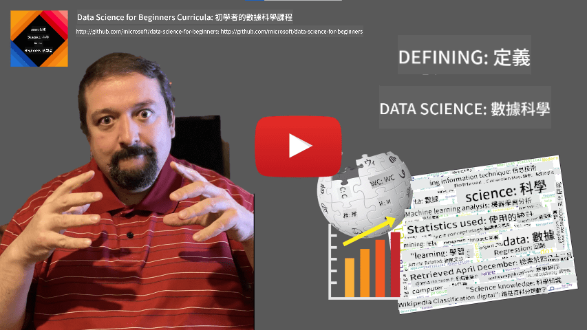

<!--
CO_OP_TRANSLATOR_METADATA:
{
  "original_hash": "2583a9894af7123b2fcae3376b14c035",
  "translation_date": "2025-08-25T16:51:36+00:00",
  "source_file": "1-Introduction/01-defining-data-science/README.md",
  "language_code": "tw"
}
-->
## 定義資料科學

|  繪製的手繪筆記 ](../../sketchnotes/01-Definitions.png) |
| :----------------------------------------------------------------------------------------------------: |
|              資料科學的定義 - _由 [@nitya](https://twitter.com/nitya) 繪製的手繪筆記_                   |

---

## [課前測驗](https://purple-hill-04aebfb03.1.azurestaticapps.net/quiz/0)

## 什麼是資料？
在我們的日常生活中，資料無處不在。你現在正在閱讀的文字就是資料。你手機裡朋友的電話號碼列表是資料，手錶上顯示的當前時間也是資料。作為人類，我們自然地使用資料，例如計算我們擁有的金錢或給朋友寫信。

然而，隨著電腦的誕生，資料變得更加重要。電腦的主要功能是進行計算，但它們需要資料來進行操作。因此，我們需要了解電腦如何存儲和處理資料。

隨著互聯網的出現，電腦作為資料處理設備的角色更加突出。如果仔細想想，我們現在使用電腦更多的是進行資料處理和通信，而不是實際的計算。當我們給朋友寫電子郵件或在互聯網上搜索信息時，我們本質上是在創建、存儲、傳輸和操作資料。
> 你能記得上一次使用電腦進行實際計算是什麼時候嗎？

## 什麼是資料科學？

根據 [維基百科](https://en.wikipedia.org/wiki/Data_science)，**資料科學**被定義為*一個科學領域，使用科學方法從結構化和非結構化資料中提取知識和洞察，並將資料中的知識和可行洞察應用於廣泛的應用領域*。

這個定義突出了資料科學的以下重要方面：

* 資料科學的主要目標是從資料中**提取知識**，換句話說，就是**理解**資料，找到一些隱藏的關係並建立**模型**。
* 資料科學使用**科學方法**，例如概率和統計。事實上，當*資料科學*這個術語首次被提出時，有些人認為資料科學只是統計學的一個新潮名稱。然而，現在已經明顯地看到這個領域遠不止於此。
* 獲得的知識應該被應用以產生一些**可行的洞察**，即可以應用於實際商業情境的實用洞察。
* 我們應該能夠操作**結構化**和**非結構化**資料。我們稍後會在課程中討論不同類型的資料。
* **應用領域**是一個重要概念，資料科學家通常需要在問題領域中至少具備一定程度的專業知識，例如：金融、醫療、行銷等。

> 資料科學的另一個重要方面是研究如何使用電腦收集、存儲和操作資料。雖然統計學為我們提供了數學基礎，資料科學則將數學概念應用於實際從資料中提取洞察。

一種看待資料科學的方法（歸因於 [Jim Gray](https://en.wikipedia.org/wiki/Jim_Gray_(computer_scientist)))是將其視為科學的一個獨立範式：
* **實證科學**，主要依賴觀察和實驗結果
* **理論科學**，從現有科學知識中產生新概念
* **計算科學**，基於一些計算實驗發現新原則
* **資料驅動科學**，基於發現資料中的關係和模式

## 其他相關領域

由於資料無處不在，資料科學本身也是一個廣泛的領域，涉及許多其他學科。

## 資料的類型

如我們之前提到的，資料無處不在。我們只需要以正確的方式捕捉它！區分**結構化**和**非結構化**資料是很有用的。前者通常以某種良好的結構形式表示，通常是表格或多個表格，而後者則只是文件的集合。有時我們也可以談論**半結構化**資料，它具有某種結構，但可能差異很大。

| 結構化資料                                                                   | 半結構化資料                                                                                  | 非結構化資料                            |
| ---------------------------------------------------------------------------- | ---------------------------------------------------------------------------------------------- | --------------------------------------- |
| 人員及其電話號碼列表                                                         | 帶有連結的維基百科頁面                                                                         | 《大英百科全書》的文本                  |
| 過去20年中每分鐘建築物所有房間的溫度                                         | 以JSON格式存儲的科學論文集合，包括作者、出版日期和摘要                                         | 包含公司文件的文件共享                  |
| 進入建築物的所有人的年齡和性別資料                                          | 網頁                                                                                           | 監控攝像頭的原始視頻流                  |

## 資料的來源

資料的來源有很多，幾乎不可能列出所有可能的來源！然而，我們可以提到一些典型的資料來源：

* **結構化資料**
  - **物聯網** (IoT)，包括來自不同感測器的資料，例如溫度或壓力感測器，提供了大量有用的資料。例如，如果辦公樓配備了物聯網感測器，我們可以自動控制供暖和照明以降低成本。
  - **調查問卷**，例如在購買後或訪問網站後要求用戶完成的問卷。
  - **行為分析**，例如幫助我們了解用戶如何深入瀏覽網站，以及離開網站的典型原因。
* **非結構化資料**
  - **文本**可以是洞察的豐富來源，例如整體**情感分數**，或提取關鍵字和語義含義。
  - **圖像**或**視頻**。監控攝像頭的視頻可以用來估算道路上的交通流量，並通知人們可能的交通堵塞。
  - 網頁伺服器的**日誌**可以用來了解我們網站上最常被訪問的頁面，以及訪問時長。
* **半結構化資料**
  - **社交網絡**圖表可以是關於用戶個性和在信息傳播中的潛在有效性的重要資料來源。
  - 當我們有一堆派對照片時，我們可以嘗試通過建立人們互相拍照的圖表來提取**群體動態**資料。

通過了解不同的資料來源，你可以嘗試思考不同的情境，資料科學技術可以被應用於更好地了解情況並改善業務流程。

## 資料的用途

在資料科學中，我們專注於資料旅程的以下步驟：

當然，根據實際資料，有些步驟可能會缺失（例如，當我們已經擁有資料庫中的資料，或者當我們不需要模型訓練時），或者有些步驟可能會重複多次（例如資料處理）。

## 數位化與數位轉型

在過去十年中，許多企業開始理解在做出業務決策時資料的重要性。要將資料科學原則應用於經營業務，首先需要收集一些資料，即將業務流程轉化為數位形式。這被稱為**數位化**。將資料科學技術應用於這些資料以指導決策，可以顯著提高生產力（甚至業務轉型），這被稱為**數位轉型**。

讓我們考慮一個例子。假設我們有一門資料科學課程（像這門課程），我們在線上向學生提供，並希望使用資料科學來改進它。我們該怎麼做？

我們可以從問「什麼可以數位化？」開始。最簡單的方法是測量每位學生完成每個模組所需的時間，並通過在每個模組結束時進行選擇題測試來測量所獲得的知識。通過計算所有學生的平均完成時間，我們可以找出哪些模組對學生來說最具挑戰性，並著手簡化它們。
你可能會認為這種方法並不理想，因為模組的長度可能不同。或許更公平的做法是將時間除以模組的長度（以字元數計算），然後比較這些值。
當我們開始分析多選題測試的結果時，可以嘗試找出學生難以理解的概念，並利用這些資訊改進內容。為了達到這個目的，我們需要設計測試，使每個問題都能對應到某個特定概念或知識片段。

如果我們想進一步深入分析，可以將每個模組所花費的時間與學生的年齡類別進行對比。我們可能會發現某些年齡類別的學生完成模組所需時間過長，或者在完成之前就中途退出。這些資訊可以幫助我們為模組提供年齡建議，並減少因錯誤期望而導致的不滿。

## 🚀 挑戰

在這個挑戰中，我們將透過分析文本來尋找與資料科學領域相關的概念。我們會選取一篇關於資料科學的維基百科文章，下載並處理文本，然後建立一個像這樣的文字雲：

請訪問 [`notebook.ipynb`](../../../../../../../../../1-Introduction/01-defining-data-science/notebook.ipynb ':ignore') 閱讀程式碼。您也可以執行程式碼，並即時查看它如何進行所有的數據轉換。

> 如果您不知道如何在 Jupyter Notebook 中執行程式碼，可以參考 [這篇文章](https://soshnikov.com/education/how-to-execute-notebooks-from-github/)。

## [課後測驗](https://purple-hill-04aebfb03.1.azurestaticapps.net/quiz/1)

## 作業

* **任務 1**：修改上述程式碼，找出與 **大數據** 和 **機器學習** 領域相關的概念
* **任務 2**：[思考資料科學場景](assignment.md)

## 致謝

這節課由 [Dmitry Soshnikov](http://soshnikov.com) 用 ♥️ 編寫完成

**免責聲明**：  
本文件使用 AI 翻譯服務 [Co-op Translator](https://github.com/Azure/co-op-translator) 進行翻譯。儘管我們努力確保翻譯的準確性，但請注意，自動翻譯可能包含錯誤或不準確之處。原始文件的母語版本應被視為權威來源。對於關鍵資訊，建議使用專業人工翻譯。我們對因使用此翻譯而引起的任何誤解或錯誤解釋不承擔責任。