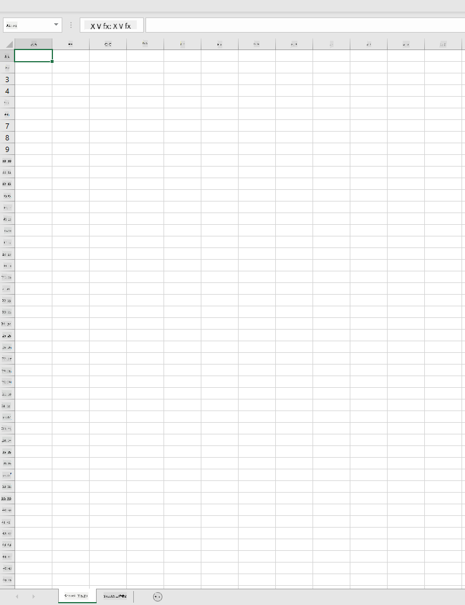
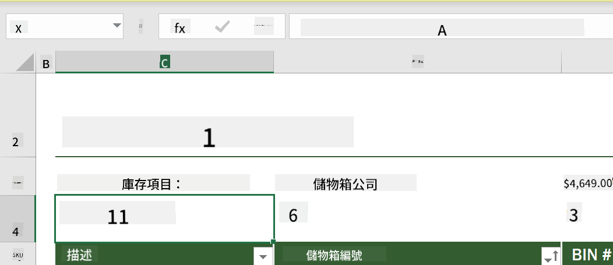
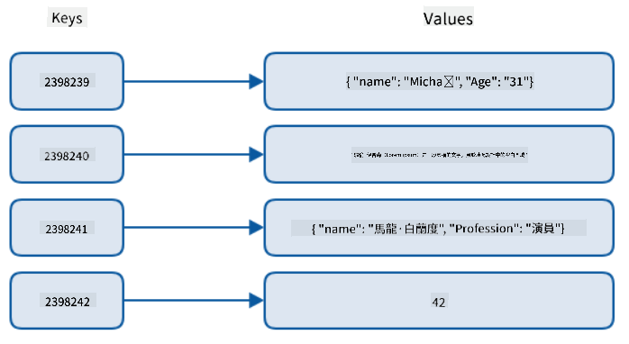
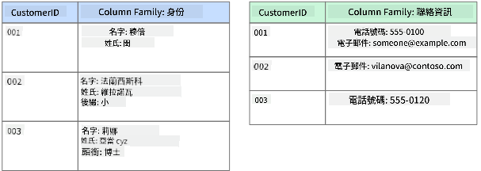
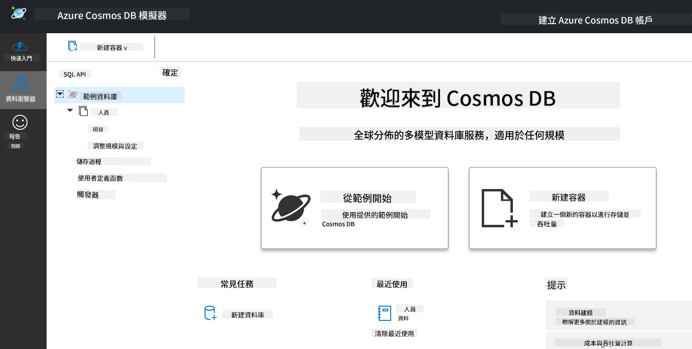
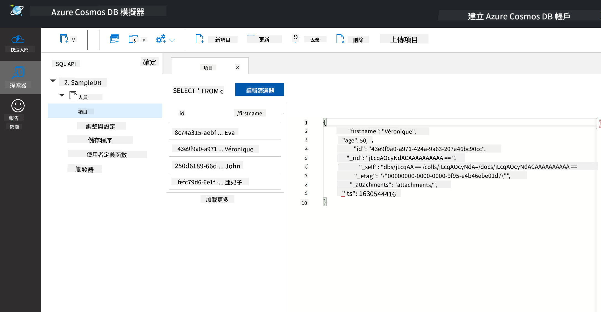

<!--
CO_OP_TRANSLATOR_METADATA:
{
  "original_hash": "54c5a1c74aecb69d2f9099300a4b7eea",
  "translation_date": "2025-09-04T12:28:57+00:00",
  "source_file": "2-Working-With-Data/06-non-relational/README.md",
  "language_code": "tw"
}
-->
# 使用資料：非關聯式資料

| 繪製的速記筆記](../../sketchnotes/06-NoSQL.png)|
|:---:|
|使用 NoSQL 資料 - _由 [@nitya](https://twitter.com/nitya) 繪製的速記筆記_ |

## [課前測驗](https://purple-hill-04aebfb03.1.azurestaticapps.net/quiz/10)

資料並不限於關聯式資料庫。本課程聚焦於非關聯式資料，並將涵蓋試算表和 NoSQL 的基礎知識。

## 試算表

試算表是一種流行的資料存儲和探索方式，因為它需要的設置和啟動工作較少。在本課程中，您將學習試算表的基本組成部分，以及公式和函數。示例將以 Microsoft Excel 為例，但大多數部分和主題在其他試算表軟體中名稱和步驟相似。



試算表是一個檔案，可以在電腦、設備或基於雲的檔案系統中訪問。軟體本身可能是基於瀏覽器的，或者需要安裝在電腦上或下載為應用程式。在 Excel 中，這些檔案也被定義為 **工作簿**，本課程將使用此術語。

工作簿包含一個或多個 **工作表**，每個工作表都由標籤標記。在工作表中有稱為 **儲存格** 的矩形，這些儲存格包含實際的資料。儲存格是行和列的交叉點，其中列用字母標記，行用數字標記。一些試算表會在前幾行中包含標題，以描述儲存格中的資料。

基於 Excel 工作簿的這些基本元素，我們將使用 [Microsoft Templates](https://templates.office.com/) 中的庫存範例來演示試算表的一些其他部分。

### 管理庫存

名為 "InventoryExample" 的試算表檔案是一個格式化的庫存項目試算表，包含三個工作表，標籤分別為 "Inventory List"、"Inventory Pick List" 和 "Bin Lookup"。Inventory List 工作表的第 4 行是標題，描述了標題列中每個儲存格的值。


有些情況下，儲存格的值依賴於其他儲存格的值來生成。在庫存清單試算表中記錄了庫存中每個項目的成本，但如果我們需要知道整個庫存的價值呢？[**公式**](https://support.microsoft.com/en-us/office/overview-of-formulas-34519a4e-1e8d-4f4b-84d4-d642c4f63263) 用於對儲存格資料執行操作，並在此示例中計算庫存的成本。此試算表使用公式在 "Inventory Value" 列中計算每個項目的價值，方法是將 "QTY" 標題下的數量與 "COST" 標題下的成本相乘。雙擊或高亮顯示儲存格將顯示公式。您會注意到公式以等號開頭，後面是計算或操作。



我們可以使用另一個公式將所有 "Inventory Value" 的值相加以獲得其總價值。這可以通過逐一相加每個儲存格來計算，但這可能是一項繁瑣的任務。Excel 提供了 [**函數**](https://support.microsoft.com/en-us/office/sum-function-043e1c7d-7726-4e80-8f32-07b23e057f89)，即預定義的公式，用於對儲存格值進行計算。函數需要參數，即執行計算所需的值。當函數需要多個參數時，它們需要按特定順序列出，否則函數可能無法計算正確的值。此示例使用 SUM 函數，並使用 "Inventory Value" 的值作為參數來生成總值，列於第 3 行，第 B 列（也稱為 B3）。

## NoSQL

NoSQL 是一個涵蓋非關聯式資料存儲方式的術語，可以解釋為 "非 SQL"、"非關聯式" 或 "不僅僅是 SQL"。這些類型的資料庫系統可以分為四種類型。


> 來源：[Michał Białecki Blog](https://www.michalbialecki.com/2018/03/18/azure-cosmos-db-key-value-database-cloud/)

[鍵值](https://docs.microsoft.com/en-us/azure/architecture/data-guide/big-data/non-relational-data#keyvalue-data-stores) 資料庫將唯一鍵（唯一識別符）與值配對。這些配對使用 [哈希表](https://www.hackerearth.com/practice/data-structures/hash-tables/basics-of-hash-tables/tutorial/) 和適當的哈希函數存儲。


> 來源：[Microsoft](https://docs.microsoft.com/en-us/azure/cosmos-db/graph/graph-introduction#graph-database-by-example)

[圖形](https://docs.microsoft.com/en-us/azure/architecture/data-guide/big-data/non-relational-data#graph-data-stores) 資料庫描述資料中的關係，並表示為節點和邊的集合。節點表示實體，即現實世界中存在的事物，例如學生或銀行對帳單。邊表示兩個實體之間的關係。每個節點和邊都有屬性，提供有關節點和邊的附加資訊。



[列式](https://docs.microsoft.com/en-us/azure/architecture/data-guide/big-data/non-relational-data#columnar-data-stores) 資料存儲將資料組織為列和行，類似於關聯式資料結構，但每列被分為稱為列族的組，其中一列下的所有資料是相關的，可以作為一個單元檢索和更改。

### 使用 Azure Cosmos DB 的文件資料存儲

[文件](https://docs.microsoft.com/en-us/azure/architecture/data-guide/big-data/non-relational-data#document-data-stores) 資料存儲基於鍵值資料存儲的概念，由一系列字段和物件組成。本節將使用 Cosmos DB 模擬器探索文件資料庫。

Cosmos DB 資料庫符合 "不僅僅是 SQL" 的定義，其中 Cosmos DB 的文件資料庫依賴 SQL 來查詢資料。[前一課程](../05-relational-databases/README.md) 涵蓋了 SQL 的基礎知識，我們將能夠在此處將一些相同的查詢應用於文件資料庫。我們將使用 Cosmos DB 模擬器，該模擬器允許我們在電腦上本地創建和探索文件資料庫。閱讀更多關於模擬器的資訊 [此處](https://docs.microsoft.com/en-us/azure/cosmos-db/local-emulator?tabs=ssl-netstd21)。

文件是字段和物件值的集合，其中字段描述物件值的含義。以下是一個文件的示例。

```json
{
    "firstname": "Eva",
    "age": 44,
    "id": "8c74a315-aebf-4a16-bb38-2430a9896ce5",
    "_rid": "bHwDAPQz8s0BAAAAAAAAAA==",
    "_self": "dbs/bHwDAA==/colls/bHwDAPQz8s0=/docs/bHwDAPQz8s0BAAAAAAAAAA==/",
    "_etag": "\"00000000-0000-0000-9f95-010a691e01d7\"",
    "_attachments": "attachments/",
    "_ts": 1630544034
}
```

此文件中感興趣的字段包括：`firstname`、`id` 和 `age`。其餘帶有下劃線的字段由 Cosmos DB 生成。

#### 使用 Cosmos DB 模擬器探索資料

您可以 [在此處下載並安裝 Windows 版模擬器](https://aka.ms/cosmosdb-emulator)。請參考 [此文件](https://docs.microsoft.com/en-us/azure/cosmos-db/local-emulator?tabs=ssl-netstd21#run-on-linux-macos) 了解 macOS 和 Linux 上運行模擬器的選項。

模擬器啟動後會打開一個瀏覽器窗口，其中的 Explorer 視圖允許您探索文件。



如果您正在跟隨操作，請點擊 "Start with Sample" 生成一個名為 SampleDB 的示例資料庫。如果您點擊箭頭展開 SampleDB，您會找到一個名為 `Persons` 的容器，容器包含一系列項目，即容器中的文件。您可以探索 `Items` 下的四個單獨文件。



#### 使用 Cosmos DB 模擬器查詢文件資料

我們還可以通過點擊 "New SQL Query" 按鈕（左側第二個按鈕）來查詢示例資料。

`SELECT * FROM c` 返回容器中的所有文件。我們可以添加一個 where 子句，查找年齡小於 40 的人。

`SELECT * FROM c where c.age < 40`


查詢返回了兩個文件，注意每個文件的年齡值都小於 40。

#### JSON 與文件

如果您熟悉 JavaScript Object Notation (JSON)，您會注意到文件看起來與 JSON 類似。本目錄中有一個 `PersonsData.json` 檔案，包含更多資料，您可以通過模擬器中的 `Upload Item` 按鈕上傳到 Persons 容器。

在大多數情況下，返回 JSON 資料的 API 可以直接轉移並存儲到文件資料庫中。以下是另一個文件，它表示從 Microsoft Twitter 帳戶檢索的推文，該推文使用 Twitter API 獲取，然後插入到 Cosmos DB 中。

```json
{
    "created_at": "2021-08-31T19:03:01.000Z",
    "id": "1432780985872142341",
    "text": "Blank slate. Like this tweet if you’ve ever painted in Microsoft Paint before. https://t.co/cFeEs8eOPK",
    "_rid": "dhAmAIUsA4oHAAAAAAAAAA==",
    "_self": "dbs/dhAmAA==/colls/dhAmAIUsA4o=/docs/dhAmAIUsA4oHAAAAAAAAAA==/",
    "_etag": "\"00000000-0000-0000-9f84-a0958ad901d7\"",
    "_attachments": "attachments/",
    "_ts": 1630537000
```

此文件中感興趣的字段包括：`created_at`、`id` 和 `text`。

## 🚀 挑戰

目錄中有一個 `TwitterData.json` 檔案，您可以上傳到 SampleDB 資料庫。建議您將其添加到單獨的容器中。這可以通過以下步驟完成：

1. 點擊右上角的 "New Container" 按鈕
1. 選擇現有資料庫 (SampleDB)，為容器創建一個容器 ID
1. 將分區鍵設置為 `/id`
1. 點擊 OK（您可以忽略此視圖中的其他資訊，因為這是一個小型資料集，運行在您的本地機器上）
1. 打開您的新容器，使用 `Upload Item` 按鈕上傳 Twitter Data 檔案

嘗試運行一些 SELECT 查詢，查找 `text` 字段中包含 Microsoft 的文件。提示：嘗試使用 [LIKE 關鍵字](https://docs.microsoft.com/en-us/azure/cosmos-db/sql/sql-query-keywords#using-like-with-the--wildcard-character)。

## [課後測驗](https://ff-quizzes.netlify.app/en/ds/)

## 回顧與自學

- 該試算表中添加了一些本課程未涵蓋的額外格式和功能。如果您有興趣了解更多，Microsoft 提供了 [大量的 Excel 文件和視頻資源](https://support.microsoft.com/excel)。

- 此架構文件詳細說明了不同類型非關聯式資料的特徵：[非關聯式資料與 NoSQL](https://docs.microsoft.com/en-us/azure/architecture/data-guide/big-data/non-relational-data)

- Cosmos DB 是一個基於雲的非關聯式資料庫，也可以存儲本課程中提到的不同 NoSQL 類型。了解更多這些類型的資訊，請參考 [Cosmos DB Microsoft Learn 模組](https://docs.microsoft.com/en-us/learn/paths/work-with-nosql-data-in-azure-cosmos-db/)。

## 作業

[Soda Profits](assignment.md)

---

**免責聲明**：  
本文件使用 AI 翻譯服務 [Co-op Translator](https://github.com/Azure/co-op-translator) 進行翻譯。我們致力於提供準確的翻譯，但請注意，自動翻譯可能包含錯誤或不準確之處。應以原始語言的文件作為權威來源。對於關鍵資訊，建議尋求專業人工翻譯。我們對因使用此翻譯而產生的任何誤解或錯誤解讀概不負責。