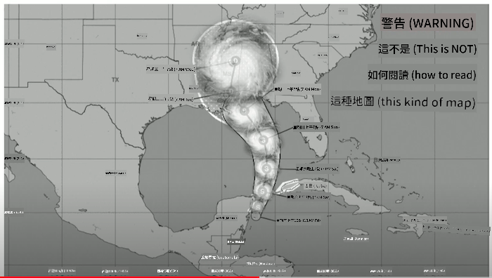
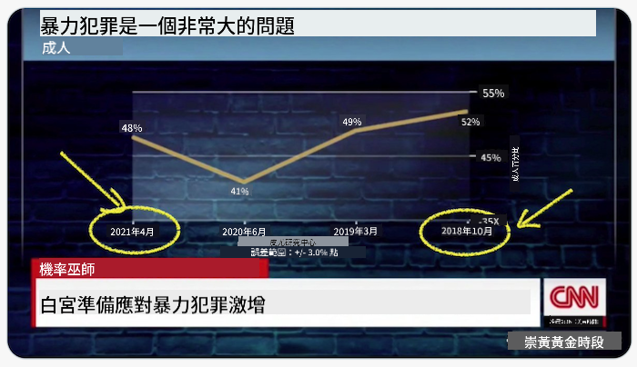
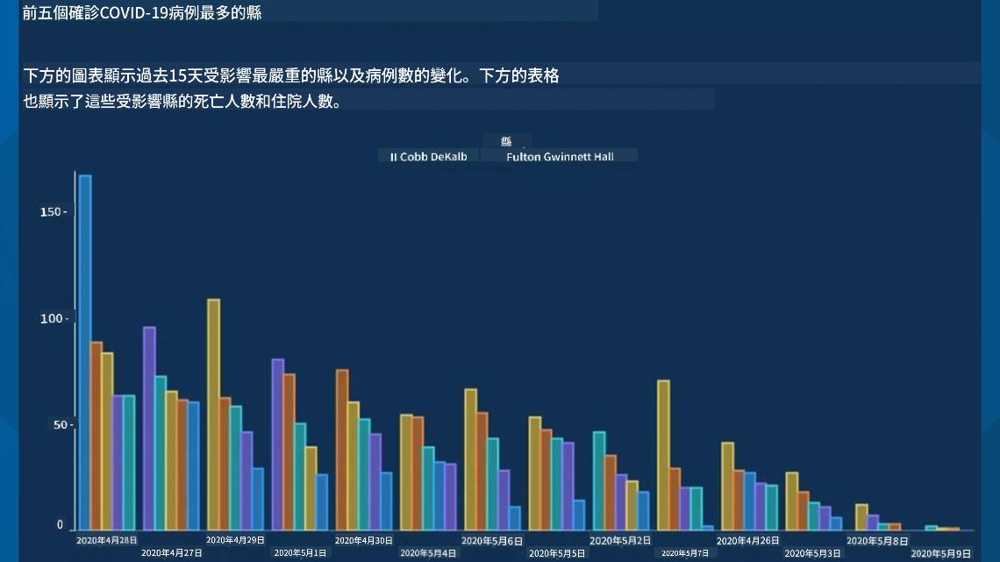
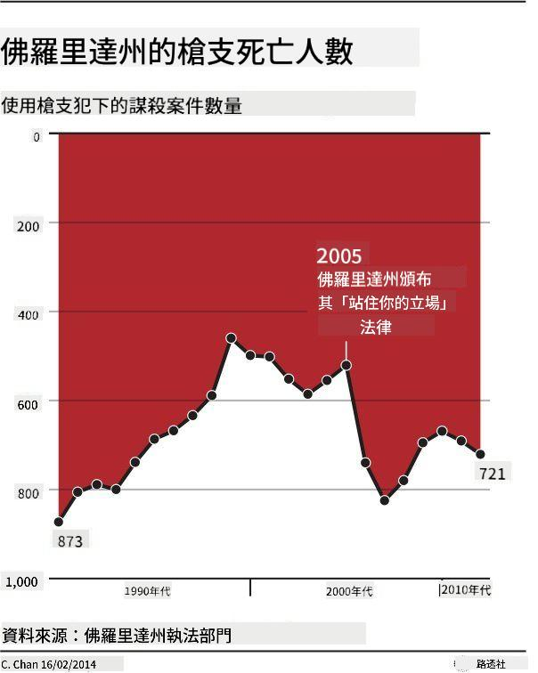
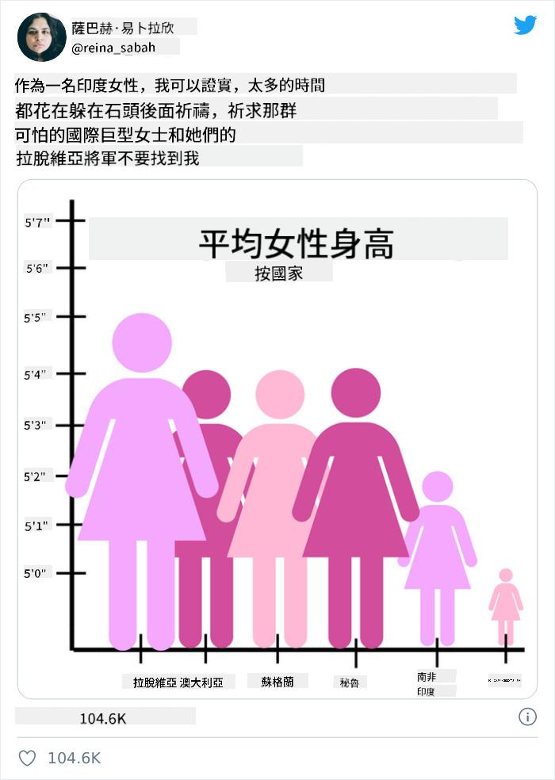
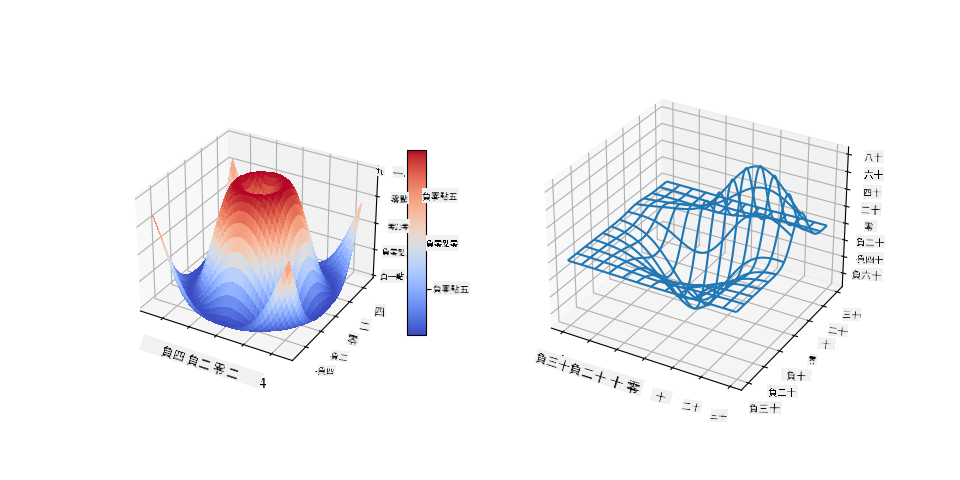
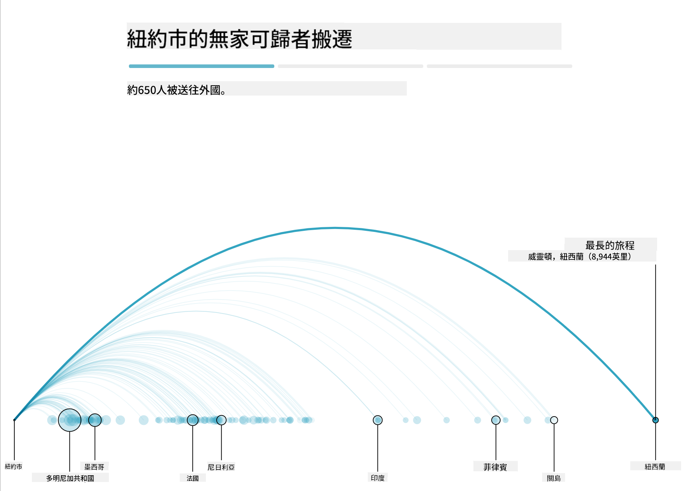

<!--
CO_OP_TRANSLATOR_METADATA:
{
  "original_hash": "4ec4747a9f4f7d194248ea29903ae165",
  "translation_date": "2025-08-25T17:59:21+00:00",
  "source_file": "3-Data-Visualization/13-meaningful-visualizations/README.md",
  "language_code": "tw"
}
-->
# 製作有意義的視覺化圖表

| 繪製的手繪筆記](../../sketchnotes/13-MeaningfulViz.png)|
|:---:|
| 有意義的視覺化圖表 - _手繪筆記由 [@nitya](https://twitter.com/nitya) 提供_ |

> 「如果你對數據施加足夠的壓力，它會承認任何事情。」-- [Ronald Coase](https://en.wikiquote.org/wiki/Ronald_Coase)

作為一名數據科學家，基本技能之一就是能夠創建有意義的數據視覺化圖表，幫助回答你可能有的問題。在進行數據視覺化之前，你需要確保數據已經像之前課程中所做的那樣被清理和準備好。之後，你就可以開始決定如何最好地呈現數據。

在本課中，你將學習：

1. 如何選擇正確的圖表類型  
2. 如何避免誤導性的圖表  
3. 如何使用顏色  
4. 如何設計圖表以提高可讀性  
5. 如何構建動畫或3D圖表解決方案  
6. 如何創建創意視覺化  

## [課前測驗](https://purple-hill-04aebfb03.1.azurestaticapps.net/quiz/24)

## 選擇正確的圖表類型

在之前的課程中，你已經嘗試使用 Matplotlib 和 Seaborn 創建各種有趣的數據視覺化圖表。通常，你可以使用以下表格來選擇[正確的圖表類型](https://chartio.com/learn/charts/how-to-select-a-data-vizualization/)來回答你的問題：

| 需求                          | 建議使用的圖表類型             |
| ----------------------------- | ----------------------------- |
| 顯示隨時間變化的數據趨勢      | 折線圖                        |
| 比較類別                      | 條形圖、圓餅圖                |
| 比較總量                      | 圓餅圖、堆疊條形圖            |
| 顯示關係                      | 散點圖、折線圖、分面圖、雙折線圖 |
| 顯示分佈                      | 散點圖、直方圖、箱形圖        |
| 顯示比例                      | 圓餅圖、甜甜圈圖、華夫圖      |

> ✅ 根據數據的組成，你可能需要將其從文本轉換為數值，以支持某些圖表。

## 避免誤導

即使數據科學家謹慎地為數據選擇了正確的圖表類型，數據仍然可能以某種方式被展示來證明某個觀點，往往以犧牲數據本身為代價。有許多關於誤導性圖表和信息圖的例子！

[](https://www.youtube.com/watch?v=oX74Nge8Wkw "How charts lie")

> 🎥 點擊上方圖片觀看關於誤導性圖表的會議演講

這張圖表反轉了 X 軸，根據日期顯示了與事實相反的內容：



[這張圖表](https://media.firstcoastnews.com/assets/WTLV/images/170ae16f-4643-438f-b689-50d66ca6a8d8/170ae16f-4643-438f-b689-50d66ca6a8d8_1140x641.jpg) 更具誤導性，因為視線會被吸引到右側，得出 COVID 病例在各縣隨時間下降的結論。事實上，如果仔細查看日期，你會發現它們被重新排列以製造這種誤導性的下降趨勢。



這個臭名昭著的例子使用了顏色和反轉的 Y 軸來誤導：與其得出槍支友好立法通過後槍支死亡人數激增的結論，事實上視線被誤導以為情況正好相反：



這張奇怪的圖表展示了比例如何被操縱，效果令人啼笑皆非：



比較無法比較的事物是另一種不正當的手段。有一個[精彩的網站](https://tylervigen.com/spurious-correlations)專門展示「虛假的相關性」，例如緬因州的離婚率與人造奶油的消耗量之間的「事實」相關性。一個 Reddit 群組也收集了[數據的醜陋用法](https://www.reddit.com/r/dataisugly/top/?t=all)。

了解視線如何容易被誤導性圖表欺騙是很重要的。即使數據科學家的意圖是好的，選擇一個不合適的圖表類型（例如顯示過多類別的圓餅圖）也可能具有誤導性。

## 顏色

從上面提到的「佛羅里達槍支暴力」圖表中可以看到，顏色可以為圖表提供額外的意義層次，特別是那些不是使用 Matplotlib 和 Seaborn 等庫設計的圖表，這些庫自帶各種經過驗證的顏色庫和調色板。如果你是手動製作圖表，可以稍微學習一下[色彩理論](https://colormatters.com/color-and-design/basic-color-theory)。

> ✅ 在設計圖表時，請注意可訪問性是視覺化的一個重要方面。你的某些用戶可能是色盲——你的圖表是否對視障用戶友好？

選擇圖表顏色時要小心，因為顏色可能傳達你未曾預料的含義。上面「身高」圖表中的「粉紅女士」傳達了一種明顯的「女性化」意義，這進一步增加了圖表本身的怪異感。

雖然[顏色的意義](https://colormatters.com/color-symbolism/the-meanings-of-colors)可能因地區而異，並且根據其色調的不同而改變，但一般來說，顏色的意義包括：

| 顏色   | 意義                 |
| ------ | ------------------- |
| 紅色   | 力量                 |
| 藍色   | 信任、忠誠           |
| 黃色   | 快樂、警告           |
| 綠色   | 生態、幸運、嫉妒     |
| 紫色   | 快樂                 |
| 橙色   | 活力                 |

如果你需要為圖表設置自定義顏色，請確保你的圖表既具有可訪問性，又能與你想要傳達的意義相符。

## 設計圖表以提高可讀性

如果圖表不可讀，那麼它就沒有意義！花點時間考慮調整圖表的寬度和高度，使其與數據比例相符。如果需要顯示的變量（例如所有 50 個州）很多，盡量將它們垂直顯示在 Y 軸上，以避免水平滾動的圖表。

標記你的軸，必要時提供圖例，並提供工具提示以便更好地理解數據。

如果你的數據在 X 軸上是文本且冗長，可以將文本傾斜以提高可讀性。[Matplotlib](https://matplotlib.org/stable/tutorials/toolkits/mplot3d.html) 提供了 3D 繪圖功能，如果你的數據支持的話。使用 `mpl_toolkits.mplot3d` 可以生成更高級的數據視覺化。



## 動畫和 3D 圖表展示

當今一些最好的數據視覺化是動畫的。Shirley Wu 使用 D3 創作了許多令人驚嘆的作品，例如「[電影之花](http://bl.ocks.org/sxywu/raw/d612c6c653fb8b4d7ff3d422be164a5d/)」，每朵花都是一部電影的視覺化。另一個為《衛報》製作的例子是「Bussed Out」，這是一個結合了 Greensock 和 D3 的互動體驗，並採用滾動敘事的文章格式，展示了紐約市如何通過將無家可歸者送出城市來處理這一問題。



> 「Bussed Out: How America Moves its Homeless」來自 [The Guardian](https://www.theguardian.com/us-news/ng-interactive/2017/dec/20/bussed-out-america-moves-homeless-people-country-study)。視覺化由 Nadieh Bremer 和 Shirley Wu 製作

雖然本課無法深入教授這些強大的視覺化庫，但你可以嘗試在 Vue.js 應用中使用 D3，創建一本書《危險關係》的動畫社交網絡視覺化。

> 《危險關係》是一部書信體小說，或以一系列信件形式呈現的小說。由 Choderlos de Laclos 於 1782 年撰寫，講述了 18 世紀末法國貴族中兩位主角 Vicomte de Valmont 和 Marquise de Merteuil 的惡毒、道德淪喪的社交操縱故事。最終兩人都走向毀滅，但在此之前造成了巨大的社會破壞。小說以他們寫給圈內各人的信件形式展開，或為復仇，或僅僅為製造麻煩。創建這些信件的視覺化，來發現敘事中的主要關鍵人物。

你將完成一個網頁應用，展示這個社交網絡的動畫視圖。它使用了一個庫來創建[網絡視覺化](https://github.com/emiliorizzo/vue-d3-network)，基於 Vue.js 和 D3。當應用運行時，你可以在屏幕上拖動節點來重新排列數據。


## 專案：使用 D3.js 構建一個網絡圖表

> 本課文件夾包含一個 `solution` 文件夾，你可以在其中找到完整的專案作為參考。

1. 按照起始文件夾根目錄中的 README.md 文件中的指示進行操作。在安裝專案依賴項之前，確保你的機器上已運行 NPM 和 Node.js。

2. 打開 `starter/src` 文件夾。你會發現一個 `assets` 文件夾，其中包含一個 .json 文件，記錄了小說中的所有信件，按編號排列，並帶有「to」和「from」的註釋。

3. 完成 `components/Nodes.vue` 中的代碼以啟用視覺化。找到名為 `createLinks()` 的方法，並添加以下嵌套循環。

遍歷 .json 對象以捕獲信件的「to」和「from」數據，並構建 `links` 對象，以便視覺化庫可以使用它：

```javascript
//loop through letters
      let f = 0;
      let t = 0;
      for (var i = 0; i < letters.length; i++) {
          for (var j = 0; j < characters.length; j++) {
              
            if (characters[j] == letters[i].from) {
              f = j;
            }
            if (characters[j] == letters[i].to) {
              t = j;
            }
        }
        this.links.push({ sid: f, tid: t });
      }
  ```

從終端運行你的應用（npm run serve），享受視覺化的樂趣！

## 🚀 挑戰

瀏覽互聯網，發現誤導性的視覺化圖表。作者是如何誤導用戶的？這是有意的嗎？嘗試修正這些視覺化圖表，展示它們應該的樣子。

## [課後測驗](https://purple-hill-04aebfb03.1.azurestaticapps.net/quiz/25)

## 回顧與自學

以下是一些關於誤導性數據視覺化的文章：

https://gizmodo.com/how-to-lie-with-data-visualization-1563576606

http://ixd.prattsi.org/2017/12/visual-lies-usability-in-deceptive-data-visualizations/

看看這些有趣的歷史資產和文物視覺化：

https://handbook.pubpub.org/

閱讀這篇文章，了解動畫如何增強你的視覺化效果：

https://medium.com/@EvanSinar/use-animation-to-supercharge-data-visualization-cd905a882ad4

## 作業

[創建你自己的自定義視覺化](assignment.md)

**免責聲明**：  
本文件使用 AI 翻譯服務 [Co-op Translator](https://github.com/Azure/co-op-translator) 進行翻譯。雖然我們致力於提供準確的翻譯，但請注意，自動翻譯可能包含錯誤或不準確之處。原始語言的文件應被視為權威來源。對於關鍵信息，建議使用專業人工翻譯。我們對因使用此翻譯而引起的任何誤解或錯誤解釋不承擔責任。